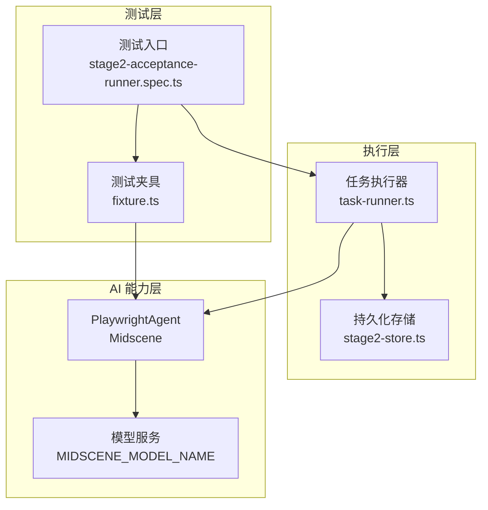
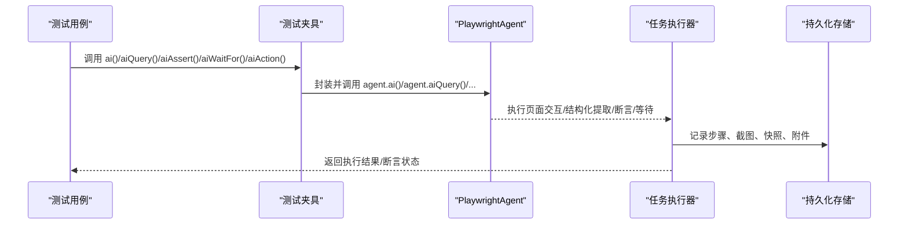
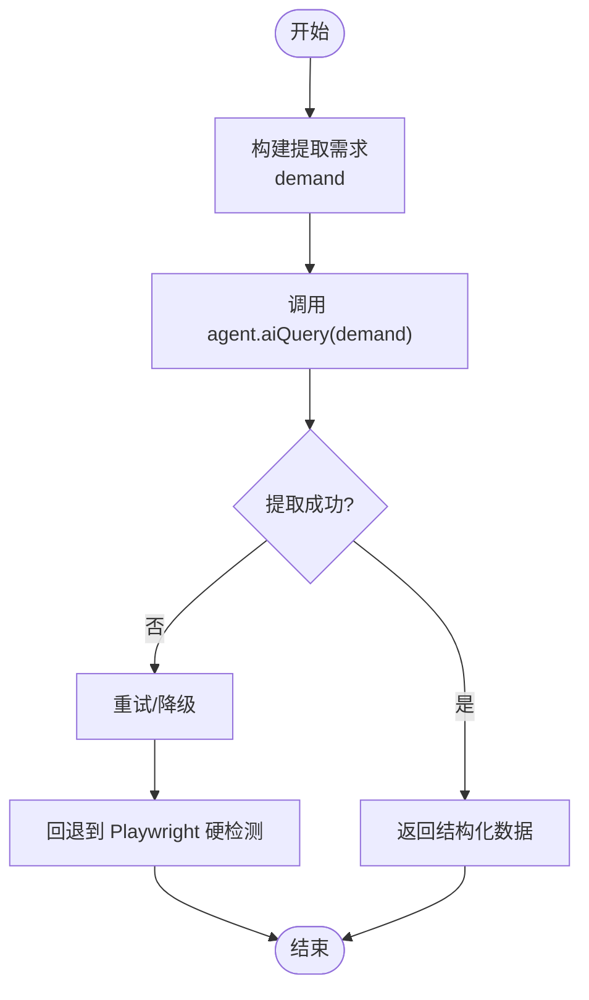
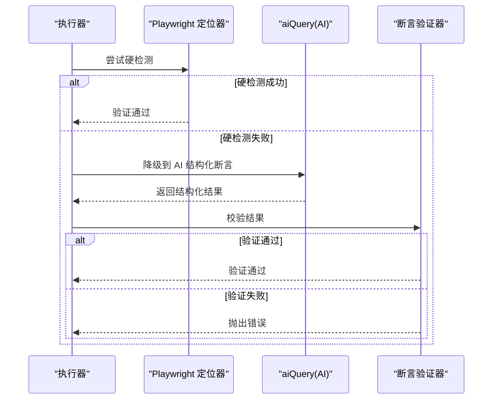
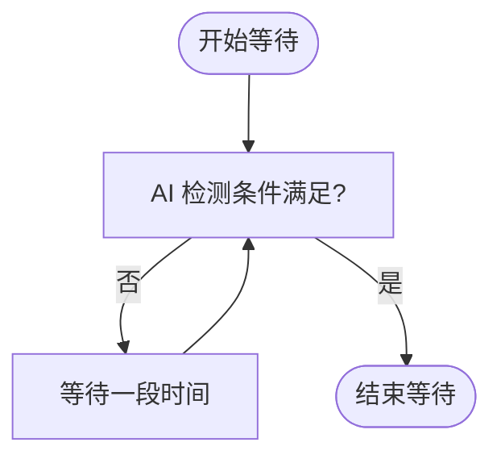
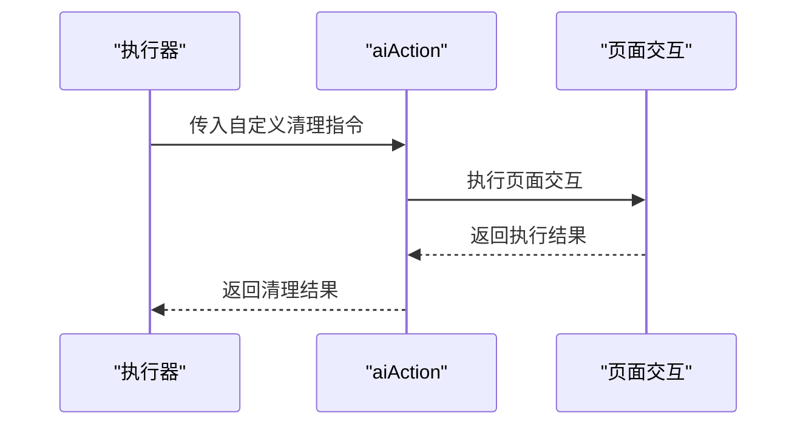
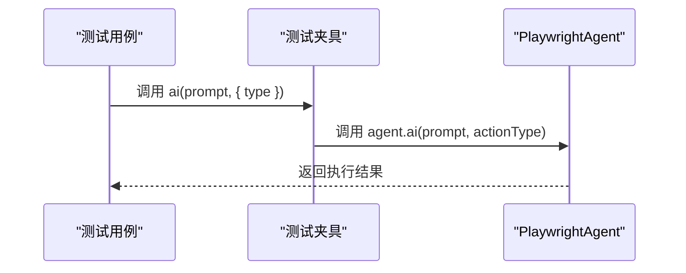
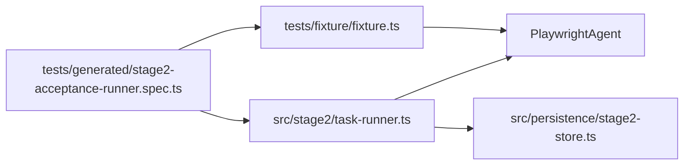

# AI 操作 API

<cite>
**本文引用的文件**
- [README.md](file://README.md)
- [package.json](file://package.json)
- [tests/fixture/fixture.ts](file://tests/fixture/fixture.ts)
- [tests/generated/stage2-acceptance-runner.spec.ts](file://tests/generated/stage2-acceptance-runner.spec.ts)
- [src/stage2/task-runner.ts](file://src/stage2/task-runner.ts)
- [src/persistence/stage2-store.ts](file://src/persistence/stage2-store.ts)
- [specs/tasks/acceptance-task.template.json](file://specs/tasks/acceptance-task.template.json)
- [specs/tasks/acceptance-task.community-create.example.json](file://specs/tasks/acceptance-task.community-create.example.json)
</cite>

## 目录
1. [简介](#简介)
2. [项目结构](#项目结构)
3. [核心组件](#核心组件)
4. [架构总览](#架构总览)
5. [详细组件分析](#详细组件分析)
6. [依赖关系分析](#依赖关系分析)
7. [性能考量](#性能考量)
8. [故障排查指南](#故障排查指南)
9. [结论](#结论)
10. [附录](#附录)

## 简介
本文件面向使用 Midscene + Playwright 的 AI 自动化测试体系，系统性梳理并说明以下五类 AI 操作 API 的使用方法与实现原理：
- aiQuery：从页面中提取结构化数据
- aiAssert：执行 AI 断言
- aiWaitFor：AI 条件等待（仅在 Playwright 常规等待不适用时使用）
- aiAction：动作执行能力（描述任务并驱动页面交互）
- ai：通用 AI 调用（描述步骤并执行交互）

文档将覆盖参数配置、返回值类型、典型使用场景、错误处理机制与最佳实践，并结合仓库中的真实任务 JSON 与执行器源码，给出可复用的使用范式。

## 项目结构
该仓库采用“测试夹具 + 任务驱动执行器”的组织方式：
- 测试夹具 tests/fixture/fixture.ts 将 Midscene 的 PlaywrightAgent 包装为 ai、aiQuery、aiAssert、aiWaitFor、aiAction 五个测试 API
- 任务驱动执行器 src/stage2/task-runner.ts 解析 JSON 任务，按步骤编排 Playwright + AI 的混合流程
- 示例任务 specs/tasks/*.json 描述了导航、表单填写、断言与清理等完整验收流程
- 运行入口 tests/generated/stage2-acceptance-runner.spec.ts 将上述能力注入测试用例

图示来源
- [tests/generated/stage2-acceptance-runner.spec.ts:12-37](file://tests/generated/stage2-acceptance-runner.spec.ts#L12-L37)
- [tests/fixture/fixture.ts:23-99](file://tests/fixture/fixture.ts#L23-L99)
- [src/stage2/task-runner.ts:18-34](file://src/stage2/task-runner.ts#L18-L34)
- [src/persistence/stage2-store.ts:495-537](file://src/persistence/stage2-store.ts#L495-L537)

章节来源
- [README.md:132-158](file://README.md#L132-L158)
- [package.json:6-11](file://package.json#L6-L11)

## 核心组件
本节概述五类 AI 操作 API 的职责、参数与返回值约定。这些 API 均由测试夹具 tests/fixture/fixture.ts 注入到测试上下文中，供测试用例直接使用。

- ai(prompt, options?)
  - 用途：描述步骤并执行交互。支持通过 options.type 指定执行模式（默认为 action）
  - 参数
    - prompt: string，自然语言描述要执行的操作
    - options.type: 'action' | 'query'，控制底层行为类型
  - 返回：Promise<T>，具体类型取决于内部实现与模型输出
  - 使用场景：通用步骤执行、页面交互自动化
  - 章节来源
    - [tests/fixture/fixture.ts:34-41](file://tests/fixture/fixture.ts#L34-L41)
    - [README.md:139-144](file://README.md#L139-L144)

- aiQuery(demand)
  - 用途：从页面中提取结构化数据
  - 参数
    - demand: any，描述要提取的数据需求（例如字符串类型提示、JSON Schema 或自然语言描述）
  - 返回：Promise<T>，结构化数据对象或数组
  - 使用场景：复杂页面元素定位、动态内容提取、表格行/列值抽取
  - 章节来源
    - [tests/fixture/fixture.ts:67-69](file://tests/fixture/fixture.ts#L67-L69)
    - [README.md:139-144](file://README.md#L139-L144)

- aiAssert(assertion, errorMsg?)
  - 用途：执行 AI 断言
  - 参数
    - assertion: string，断言描述
    - errorMsg?: string，自定义错误信息
  - 返回：Promise<void>
  - 使用场景：页面状态验证、业务规则校验
  - 章节来源
    - [tests/fixture/fixture.ts:81-83](file://tests/fixture/fixture.ts#L81-L83)
    - [README.md:139-144](file://README.md#L139-L144)

- aiWaitFor(assertion, options?)
  - 用途：AI 条件等待（仅在 Playwright 常规等待不适用时使用）
  - 参数
    - assertion: string，等待条件描述
    - options?: AiWaitForOpt，等待相关选项（如超时、轮询间隔等）
  - 返回：Promise<void>
  - 使用场景：AI 识别的动态条件满足（如滑块验证码消失）
  - 章节来源
    - [tests/fixture/fixture.ts:95-97](file://tests/fixture/fixture.ts#L95-L97)
    - [README.md:139-144](file://README.md#L139-L144)

- aiAction(taskPrompt)
  - 用途：动作执行能力（描述任务并驱动页面交互）
  - 参数
    - taskPrompt: string，任务描述
  - 返回：Promise<any>
  - 使用场景：复杂交互流程（如登录、表单提交、列表筛选）
  - 章节来源
    - [tests/fixture/fixture.ts:53-55](file://tests/fixture/fixture.ts#L53-L55)
    - [README.md:139-144](file://README.md#L139-L144)

## 架构总览
AI 操作 API 的调用链路如下：
- 测试用例通过 fixtures 注入 ai、aiQuery、aiAssert、aiWaitFor、aiAction
- 任务执行器 src/stage2/task-runner.ts 解析 JSON 任务，按步骤编排 Playwright + AI 的混合流程
- 执行器内部对断言采用“Playwright 硬检测优先 -> AI 断言兜底 -> 重试机制”的策略
- 执行器在关键节点写入持久化存储，记录运行、步骤、快照与附件

图示来源
- [tests/fixture/fixture.ts:23-99](file://tests/fixture/fixture.ts#L23-L99)
- [src/stage2/task-runner.ts:1562-1575](file://src/stage2/task-runner.ts#L1562-L1575)
- [src/persistence/stage2-store.ts:495-537](file://src/persistence/stage2-store.ts#L495-L537)

## 详细组件分析

### aiQuery 组件分析
- 实现要点
  - 通过 agent.aiQuery(demand) 发起结构化数据提取请求
  - 在任务执行器中广泛用于表格行定位、列表快照提取、清理前后的数据核对
  - 对于未知断言类型，执行器会回退到 aiQuery 进行通用断言
- 典型使用场景
  - 列表快照提取：提取当前列表前若干行的关键字段
  - 表格列值对比：在“table-cell-equals”和“table-cell-contains”断言中，先尝试 Playwright 硬检测，失败则降级到 aiQuery
- 复杂度与性能
  - aiQuery 的调用次数与页面复杂度、断言数量正相关
  - 建议在非必要场景优先使用 Playwright 定位器，降低 AI 成本
- 错误处理
  - 执行器对 aiQuery 调用采用带重试的断言执行器，失败时记录最后结果并抛出错误

图示来源
- [src/stage2/task-runner.ts:1739-1760](file://src/stage2/task-runner.ts#L1739-L1760)
- [src/stage2/task-runner.ts:1898-1908](file://src/stage2/task-runner.ts#L1898-L1908)

章节来源
- [src/stage2/task-runner.ts:2591-2596](file://src/stage2/task-runner.ts#L2591-L2596)
- [src/stage2/task-runner.ts:1739-1760](file://src/stage2/task-runner.ts#L1739-L1760)
- [src/stage2/task-runner.ts:1898-1908](file://src/stage2/task-runner.ts#L1898-L1908)

### aiAssert 组件分析
- 实现要点
  - 通过 agent.aiAssert(assertion, errorMsg) 执行 AI 断言
  - 任务执行器对断言采用“Playwright 硬检测优先 -> AI 断言兜底 -> 重试机制”
  - 对于“table-cell-equals”和“table-cell-contains”，若 Playwright 硬检测失败，则降级到 aiQuery 结构化断言
- 典型使用场景
  - Toast 提示断言
  - 表格行存在性断言
  - 自定义描述断言（custom）
- 复杂度与性能
  - 断言重试策略可配置，避免瞬时波动导致误判
- 错误处理
  - 若断言失败，执行器会汇总 Playwright 与 AI 的诊断信息，抛出详细错误

图示来源
- [src/stage2/task-runner.ts:1562-1575](file://src/stage2/task-runner.ts#L1562-L1575)
- [src/stage2/task-runner.ts:1739-1760](file://src/stage2/task-runner.ts#L1739-L1760)
- [src/stage2/task-runner.ts:1874-1894](file://src/stage2/task-runner.ts#L1874-L1894)

章节来源
- [src/stage2/task-runner.ts:1562-1575](file://src/stage2/task-runner.ts#L1562-L1575)
- [src/stage2/task-runner.ts:1739-1760](file://src/stage2/task-runner.ts#L1739-L1760)
- [src/stage2/task-runner.ts:1874-1894](file://src/stage2/task-runner.ts#L1874-L1894)

### aiWaitFor 组件分析
- 实现要点
  - 通过 agent.aiWaitFor(assertion, options) 实现 AI 条件等待
  - 适用于 Playwright 常规等待无法覆盖的动态条件（如滑块验证码消失）
- 典型使用场景
  - 登录页滑块验证码自动处理：AI 识别滑块按钮位置，Playwright 模拟拖动轨迹，等待滑块消失
- 错误处理
  - 超时或条件不满足时抛出明确错误，便于切换到手动模式

图示来源
- [tests/fixture/fixture.ts:95-97](file://tests/fixture/fixture.ts#L95-L97)
- [src/stage2/task-runner.ts:483-501](file://src/stage2/task-runner.ts#L483-L501)

章节来源
- [README.md:64-74](file://README.md#L64-L74)
- [src/stage2/task-runner.ts:483-501](file://src/stage2/task-runner.ts#L483-L501)

### aiAction 组件分析
- 实现要点
  - 通过 agent.aiAction(taskPrompt) 执行复杂交互任务
  - 在任务执行器中用于自定义清理操作的执行
- 典型使用场景
  - 删除已创建数据的自定义清理流程
- 错误处理
  - 执行异常时返回包含错误信息的结果对象

图示来源
- [src/stage2/task-runner.ts:2149-2173](file://src/stage2/task-runner.ts#L2149-L2173)

章节来源
- [src/stage2/task-runner.ts:2149-2173](file://src/stage2/task-runner.ts#L2149-L2173)

### ai 组件分析
- 实现要点
  - 通过 agent.ai(prompt, actionType) 执行描述性步骤
  - 支持通过 options.type 控制执行模式（默认为 action）
- 典型使用场景
  - 通用步骤执行、页面交互自动化
- 错误处理
  - 异常时抛出错误，便于测试用例捕获与定位

图示来源
- [tests/fixture/fixture.ts:34-41](file://tests/fixture/fixture.ts#L34-L41)

章节来源
- [tests/fixture/fixture.ts:34-41](file://tests/fixture/fixture.ts#L34-L41)

## 依赖关系分析
- 测试夹具依赖 Midscene 的 PlaywrightAgent，负责将自然语言描述转化为页面交互
- 任务执行器依赖测试夹具提供的 ai、aiQuery、aiAssert、aiWaitFor、aiAction 能力
- 执行器与持久化存储协作，记录运行、步骤、快照与附件

图示来源
- [tests/fixture/fixture.ts:23-99](file://tests/fixture/fixture.ts#L23-L99)
- [src/stage2/task-runner.ts:18-34](file://src/stage2/task-runner.ts#L18-L34)
- [src/persistence/stage2-store.ts:495-537](file://src/persistence/stage2-store.ts#L495-L537)
- [tests/generated/stage2-acceptance-runner.spec.ts:12-37](file://tests/generated/stage2-acceptance-runner.spec.ts#L12-L37)

章节来源
- [tests/fixture/fixture.ts:23-99](file://tests/fixture/fixture.ts#L23-L99)
- [src/stage2/task-runner.ts:18-34](file://src/stage2/task-runner.ts#L18-L34)
- [src/persistence/stage2-store.ts:495-537](file://src/persistence/stage2-store.ts#L495-L537)
- [tests/generated/stage2-acceptance-runner.spec.ts:12-37](file://tests/generated/stage2-acceptance-runner.spec.ts#L12-L37)

## 性能考量
- 断言策略优先级
  - Playwright 硬检测优先，AI 断言兜底，减少 AI 成本与不确定性
  - 对于“table-cell-equals”/“table-cell-contains”，建议仅对少量关键列使用 AI，其余列使用 Playwright 定位器
- 重试机制
  - 断言重试次数与延迟可配置，避免瞬时波动导致误判
- 截图与报告
  - 执行器在关键步骤写入截图与报告，便于定位问题但会增加 IO 开销
- 最佳实践
  - 将 AI 作为兜底手段，尽量使用结构化定位器与硬检测
  - 对复杂页面元素定位与动态内容提取，优先使用 aiQuery 并限定返回范围

## 故障排查指南
- 常见问题与处理
  - 断言失败：执行器会汇总 Playwright 与 AI 的诊断信息，优先检查定位器与期望值是否匹配
  - AI 查询失败：检查 prompt 是否清晰、页面是否加载完成、模型配置是否正确
  - 等待超时：对于滑块验证码等动态条件，确认 aiWaitFor 的条件描述准确
- 日志与报告
  - Midscene 报告目录与 Playwright HTML 报告目录由环境变量统一管理
  - 执行器会写入运行、步骤、快照与附件到数据库与文件系统
- 环境配置
  - OPENAI_API_KEY、OPENAI_BASE_URL、MIDSCENE_MODEL_NAME 等需按实际模型提供商配置

章节来源
- [README.md:39-54](file://README.md#L39-L54)
- [README.md:76-96](file://README.md#L76-L96)
- [src/stage2/task-runner.ts:1532-1556](file://src/stage2/task-runner.ts#L1532-L1556)

## 结论
本仓库通过测试夹具与任务执行器，将 Midscene 的 AI 能力与 Playwright 的强定位能力有机结合。建议在大多数场景优先使用 Playwright 硬检测，仅在复杂页面元素定位、动态内容提取与断言兜底时使用 AI 操作 API。配合断言重试与完善的持久化记录，可显著提升测试稳定性与可维护性。

## 附录

### 使用示例与最佳实践
- 复杂页面元素定位
  - 使用 aiQuery 提取列表快照，限定返回字段与数量，避免一次性提取过多数据
  - 在断言失败时，优先检查 Playwright 定位器是否更稳定
- 动态内容提取
  - 对于异步加载的表格数据，先使用 aiWaitFor 等待条件满足，再进行 aiQuery 提取
- 智能断言
  - 对关键业务列使用“table-cell-equals”，其余列使用 Playwright 硬检测
  - 自定义断言（custom）应尽量具体，避免模糊描述导致 AI 幻觉
- 清理与回滚
  - 使用 aiAction 执行自定义清理流程，确保测试数据可回滚
  - 清理失败时，根据 failOnError 配置决定是否中断执行

章节来源
- [specs/tasks/acceptance-task.template.json:75-105](file://specs/tasks/acceptance-task.template.json#L75-L105)
- [specs/tasks/acceptance-task.community-create.example.json:157-194](file://specs/tasks/acceptance-task.community-create.example.json#L157-L194)
- [src/stage2/task-runner.ts:2149-2173](file://src/stage2/task-runner.ts#L2149-L2173)