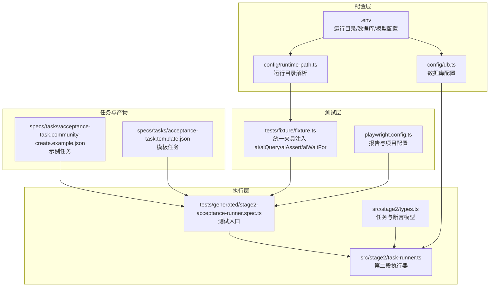
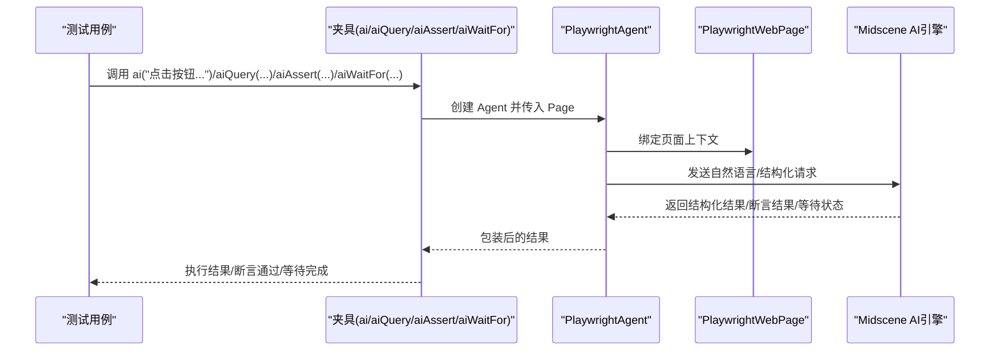
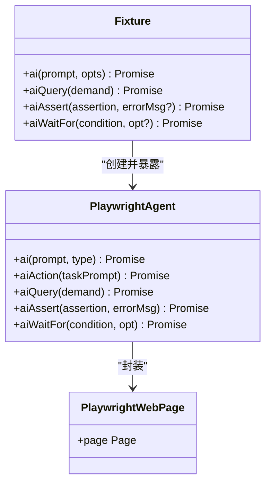
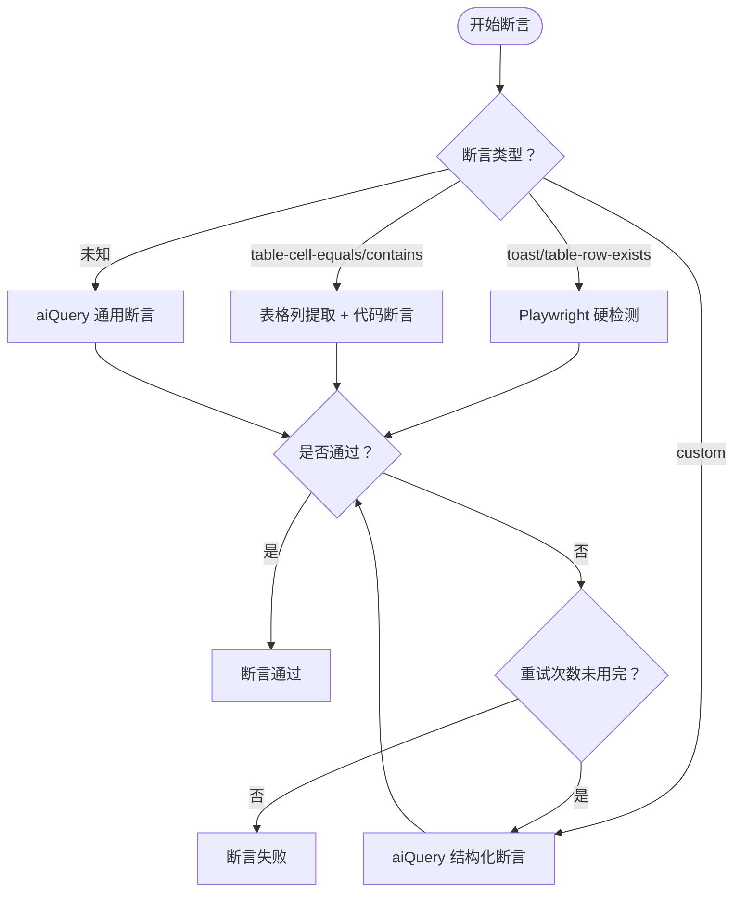
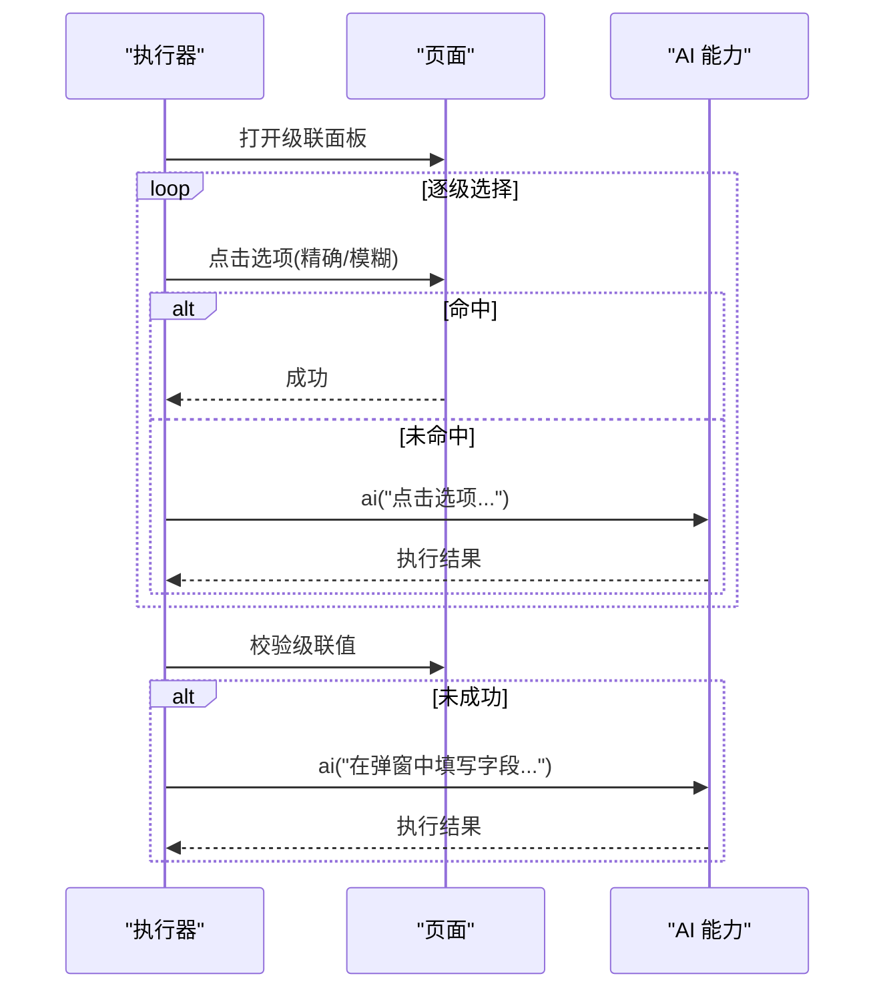
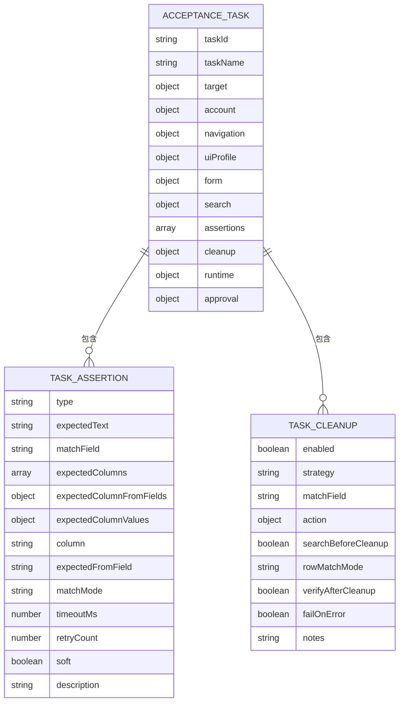
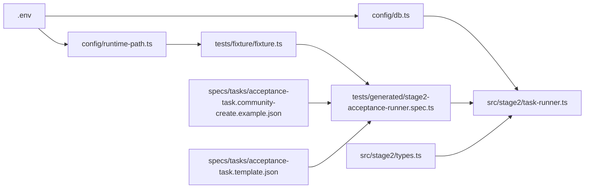

# AI 通用 AI 调用 API

<cite>
**本文引用的文件**
- [README.md](file://README.md)
- [AGENTS.md](file://AGENTS.md)
- [package.json](file://package.json)
- [playwright.config.ts](file://playwright.config.ts)
- [config/runtime-path.ts](file://config/runtime-path.ts)
- [config/db.ts](file://config/db.ts)
- [tests/fixture/fixture.ts](file://tests/fixture/fixture.ts)
- [tests/generated/stage2-acceptance-runner.spec.ts](file://tests/generated/stage2-acceptance-runner.spec.ts)
- [src/stage2/types.ts](file://src/stage2/types.ts)
- [src/stage2/task-runner.ts](file://src/stage2/task-runner.ts)
- [specs/tasks/acceptance-task.community-create.example.json](file://specs/tasks/acceptance-task.community-create.example.json)
- [specs/tasks/acceptance-task.template.json](file://specs/tasks/acceptance-task.template.json)
</cite>

## 目录
1. [简介](#简介)
2. [项目结构](#项目结构)
3. [核心组件](#核心组件)
4. [架构总览](#架构总览)
5. [详细组件分析](#详细组件分析)
6. [依赖关系分析](#依赖关系分析)
7. [性能考量](#性能考量)
8. [故障排查指南](#故障排查指南)
9. [结论](#结论)
10. [附录](#附录)

## 简介
本文件面向希望在测试自动化中使用 AI 的开发者，系统性介绍基于 Midscene.js 与 Playwright 的通用 AI 调用 API 能力。该能力覆盖自然语言指令、上下文理解与执行反馈，支持复杂的页面操作指导、智能决策与动态行为控制。文档重点说明：
- 如何通过 ai、aiQuery、aiAssert、aiWaitFor 等接口进行交互与断言
- 在测试中如何使用 AI 完成级联选择器、按钮点击、表单填写等高级场景
- 性能与成本控制策略、最佳实践与常见问题排查

## 项目结构
该项目采用“配置驱动 + JSON 任务 + Midscene + Playwright”的分层架构：
- 配置层：运行目录、数据库、环境变量集中管理
- 测试层：统一夹具注入 AI 能力，提供 ai、aiQuery、aiAssert、aiWaitFor
- 执行层：基于 JSON 任务驱动的第二段执行器，内置断言与清理策略
- 产物层：Playwright 报告、Midscene 报告、结构化结果与数据库落盘

**图表来源**
- [config/runtime-path.ts:1-46](file://config/runtime-path.ts#L1-L46)
- [config/db.ts:1-28](file://config/db.ts#L1-L28)
- [tests/fixture/fixture.ts:1-100](file://tests/fixture/fixture.ts#L1-L100)
- [playwright.config.ts:1-95](file://playwright.config.ts#L1-L95)
- [tests/generated/stage2-acceptance-runner.spec.ts:1-39](file://tests/generated/stage2-acceptance-runner.spec.ts#L1-L39)
- [src/stage2/task-runner.ts:1-200](file://src/stage2/task-runner.ts#L1-L200)
- [src/stage2/types.ts:1-180](file://src/stage2/types.ts#L1-L180)
- [specs/tasks/acceptance-task.community-create.example.json:1-229](file://specs/tasks/acceptance-task.community-create.example.json#L1-L229)
- [specs/tasks/acceptance-task.template.json:1-141](file://specs/tasks/acceptance-task.template.json#L1-L141)

**章节来源**
- [README.md:10-253](file://README.md#L10-L253)
- [package.json:1-28](file://package.json#L1-L28)
- [playwright.config.ts:1-95](file://playwright.config.ts#L1-L95)
- [config/runtime-path.ts:1-46](file://config/runtime-path.ts#L1-L46)
- [config/db.ts:1-28](file://config/db.ts#L1-L28)
- [tests/fixture/fixture.ts:1-100](file://tests/fixture/fixture.ts#L1-L100)
- [tests/generated/stage2-acceptance-runner.spec.ts:1-39](file://tests/generated/stage2-acceptance-runner.spec.ts#L1-L39)
- [src/stage2/types.ts:1-180](file://src/stage2/types.ts#L1-L180)
- [src/stage2/task-runner.ts:1-200](file://src/stage2/task-runner.ts#L1-L200)
- [specs/tasks/acceptance-task.community-create.example.json:1-229](file://specs/tasks/acceptance-task.community-create.example.json#L1-L229)
- [specs/tasks/acceptance-task.template.json:1-141](file://specs/tasks/acceptance-task.template.json#L1-L141)

## 核心组件
- 夹具注入的 AI 能力
  - ai：执行自然语言动作（如点击、填写、滚动、等待），支持 action/query 两种类型
  - aiQuery：从页面提取结构化数据，返回 JSON 结构
  - aiAssert：执行 AI 断言，返回布尔与原因
  - aiWaitFor：在 Playwright 常规等待不适用时，使用 AI 等待条件满足
- 第二段执行器
  - 基于 JSON 任务驱动，内置导航、打开弹窗、填写表单、提交、搜索、断言、清理等步骤
  - 断言策略：Playwright 硬检测优先，AI 断言兜底，带重试与软断言支持
- 任务模型与 UI 配置
  - AcceptanceTask、TaskAssertion、TaskCleanup 等模型定义
  - uiProfile 支持跨平台选择器优先级（表格行、Toast、弹窗）

**章节来源**
- [tests/fixture/fixture.ts:16-99](file://tests/fixture/fixture.ts#L16-L99)
- [src/stage2/task-runner.ts:1529-1556](file://src/stage2/task-runner.ts#L1529-L1556)
- [src/stage2/task-runner.ts:1562-1917](file://src/stage2/task-runner.ts#L1562-L1917)
- [src/stage2/types.ts:67-126](file://src/stage2/types.ts#L67-L126)

## 架构总览
AI 调用 API 在测试夹具中统一注入，通过 PlaywrightAgent 与 PlaywrightWebPage 封装，结合 Midscene 的 aiQuery/aiAssert/aiWaitFor 能力，形成“自然语言 + 结构化数据 + 智能断言”的闭环。

**图表来源**
- [tests/fixture/fixture.ts:23-99](file://tests/fixture/fixture.ts#L23-L99)
- [src/stage2/task-runner.ts:1562-1917](file://src/stage2/task-runner.ts#L1562-L1917)

## 详细组件分析

### 夹具与 AI 能力注入
- 夹具在每个测试用例中注入 ai、aiQuery、aiAssert、aiWaitFor 四个函数，并设置缓存 ID、分组信息与报告生成
- ai 支持通过 opts.type 指定“动作”或“查询”，aiQuery/aiAssert/aiWaitFor 为专用能力封装
- Midscene 运行日志目录通过 setLogDir 统一收敛到运行目录

**图表来源**
- [tests/fixture/fixture.ts:23-99](file://tests/fixture/fixture.ts#L23-L99)

**章节来源**
- [tests/fixture/fixture.ts:1-100](file://tests/fixture/fixture.ts#L1-L100)

### 第二段执行器与断言策略
- 执行器内置多种步骤：导航、打开弹窗、填写表单、提交、搜索、断言、清理
- 断言策略优先使用 Playwright 硬检测，失败时降级到 aiQuery/aiAssert，并支持重试与软断言
- 通用断言入口会根据断言类型选择 Playwright 或 AI 能力，未知类型则使用 aiQuery 通用断言兜底

**图表来源**
- [src/stage2/task-runner.ts:1562-1917](file://src/stage2/task-runner.ts#L1562-L1917)

**章节来源**
- [src/stage2/task-runner.ts:1529-1556](file://src/stage2/task-runner.ts#L1529-L1556)
- [src/stage2/task-runner.ts:1562-1917](file://src/stage2/task-runner.ts#L1562-L1917)

### 级联选择器、按钮点击与表单填写的高级场景
- 级联选择器
  - 通过 openCascaderPanel 打开面板，逐级点击选项，使用 tryClickLocator 与 getByText 精确命中
  - 若页面元素不稳定，最终回退到 ai("在省市区级联面板中点击...") 完成选择
- 按钮点击
  - 优先使用 getByRole('button', { name: /正则/ }) 精确匹配，其次使用 loose 匹配
  - 若均失败，回退到 ai("点击按钮...") 完成操作
- 表单填写
  - 优先在弹窗上下文中定位字段，使用 input/textarea 的 role 与占位文案
  - 若仍失败，回退到 ai("在弹窗中，在字段...输入...") 完成填写

**图表来源**
- [src/stage2/task-runner.ts:726-788](file://src/stage2/task-runner.ts#L726-L788)
- [src/stage2/task-runner.ts:897-974](file://src/stage2/task-runner.ts#L897-L974)

**章节来源**
- [src/stage2/task-runner.ts:726-788](file://src/stage2/task-runner.ts#L726-L788)
- [src/stage2/task-runner.ts:897-974](file://src/stage2/task-runner.ts#L897-L974)

### 任务模型与 UI 配置
- AcceptanceTask：任务主入口，包含目标站点、账户、导航、UI 配置、表单、搜索、断言、清理、运行时配置
- TaskAssertion：断言类型丰富，支持 toast、table-row-exists、table-cell-equals/contains、custom 等
- TaskCleanup：支持删除新增数据、删除全部匹配、自定义 AI 指令，以及行匹配模式与清理后校验

**图表来源**
- [src/stage2/types.ts:141-180](file://src/stage2/types.ts#L141-L180)
- [src/stage2/types.ts:67-126](file://src/stage2/types.ts#L67-L126)

**章节来源**
- [src/stage2/types.ts:1-180](file://src/stage2/types.ts#L1-L180)

### 示例任务与使用指引
- 示例任务展示了完整的新增小区流程：登录 → 导航 → 打开弹窗 → 填写表单（含级联） → 提交 → 搜索校验 → 清理
- 模板任务提供了可复制的字段与断言结构，便于快速扩展

**章节来源**
- [specs/tasks/acceptance-task.community-create.example.json:1-229](file://specs/tasks/acceptance-task.community-create.example.json#L1-L229)
- [specs/tasks/acceptance-task.template.json:1-141](file://specs/tasks/acceptance-task.template.json#L1-L141)

## 依赖关系分析
- 运行时目录与数据库路径由 .env 与 config/runtime-path.ts、config/db.ts 统一解析
- 测试入口 tests/generated/stage2-acceptance-runner.spec.ts 通过夹具注入 AI 能力，并调用第二段执行器
- 执行器内部根据任务模型选择 Playwright 或 AI 能力，断言与清理策略贯穿始终

**图表来源**
- [config/runtime-path.ts:1-46](file://config/runtime-path.ts#L1-L46)
- [config/db.ts:1-28](file://config/db.ts#L1-L28)
- [tests/fixture/fixture.ts:1-100](file://tests/fixture/fixture.ts#L1-L100)
- [tests/generated/stage2-acceptance-runner.spec.ts:1-39](file://tests/generated/stage2-acceptance-runner.spec.ts#L1-L39)
- [src/stage2/task-runner.ts:1-200](file://src/stage2/task-runner.ts#L1-L200)
- [src/stage2/types.ts:1-180](file://src/stage2/types.ts#L1-L180)
- [specs/tasks/acceptance-task.community-create.example.json:1-229](file://specs/tasks/acceptance-task.community-create.example.json#L1-L229)
- [specs/tasks/acceptance-task.template.json:1-141](file://specs/tasks/acceptance-task.template.json#L1-L141)

**章节来源**
- [README.md:10-253](file://README.md#L10-L253)
- [package.json:1-28](file://package.json#L1-L28)
- [playwright.config.ts:1-95](file://playwright.config.ts#L1-L95)
- [config/runtime-path.ts:1-46](file://config/runtime-path.ts#L1-L46)
- [config/db.ts:1-28](file://config/db.ts#L1-L28)
- [tests/fixture/fixture.ts:1-100](file://tests/fixture/fixture.ts#L1-L100)
- [tests/generated/stage2-acceptance-runner.spec.ts:1-39](file://tests/generated/stage2-acceptance-runner.spec.ts#L1-L39)
- [src/stage2/task-runner.ts:1-200](file://src/stage2/task-runner.ts#L1-L200)
- [src/stage2/types.ts:1-180](file://src/stage2/types.ts#L1-L180)
- [specs/tasks/acceptance-task.community-create.example.json:1-229](file://specs/tasks/acceptance-task.community-create.example.json#L1-L229)
- [specs/tasks/acceptance-task.template.json:1-141](file://specs/tasks/acceptance-task.template.json#L1-L141)

## 性能考量
- 模型成本控制
  - 将长流程拆分为多个短 Prompt 的步骤，避免一次性超长 Prompt 导致成本上升与定位困难
  - 优先使用 Playwright 硬检测，AI 仅作为兜底与复杂语义场景的补充
- 等待与重试
  - aiWaitFor 仅在常规等待不适用时使用，避免频繁调用 AI 增加延迟
  - 断言与清理支持重试与软断言，减少误报导致的失败风暴
- 截图与报告
  - 合理开启截图与报告，避免过多截图影响性能与存储成本
- 运行目录与数据库
  - 统一运行目录与报告输出，便于资源回收与成本统计

[本节为通用指导，无需列出具体文件来源]

## 故障排查指南
- AI 操作失败
  - 检查任务 hints 与 uiProfile，确保 Midscene 能准确理解页面元素
  - 将复杂步骤拆分为更细粒度的步骤，便于定位失败点
- 断言失败
  - 优先确认 Playwright 硬检测是否可用，AI 断言仅作为兜底
  - 对未知断言类型，确认 aiQuery 返回结构是否符合预期
- 页面元素不稳定
  - 使用 aiWaitFor 等待稳定状态，或在执行器中增加重试与截图
- 运行产物与日志
  - 查看 Midscene 报告与 Playwright HTML 报告，定位失败步骤与截图

**章节来源**
- [README.md:144-158](file://README.md#L144-L158)
- [src/stage2/task-runner.ts:1562-1917](file://src/stage2/task-runner.ts#L1562-L1917)

## 结论
通过夹具统一注入的 AI 能力与第二段执行器的结构化任务驱动，本项目实现了“自然语言 + 结构化数据 + 智能断言”的测试自动化闭环。建议在日常开发中遵循“Playwright 硬检测优先、AI 兜底”的原则，合理拆分步骤、控制重试与截图，以获得更高的稳定性与更低的成本。

[本节为总结性内容，无需列出具体文件来源]

## 附录
- 运行与产物
  - 运行第二段：npx playwright test tests/generated/stage2-acceptance-runner.spec.ts --headed
  - 产物目录：Playwright 报告、Midscene 报告、结构化结果与数据库落盘
- 配置与规范
  - 统一使用 .env 管理路径与开关，避免硬编码
  - 日志与报告统一收敛到 t_runtime/ 下的子目录

**章节来源**
- [README.md:159-212](file://README.md#L159-L212)
- [AGENTS.md:22-61](file://AGENTS.md#L22-L61)