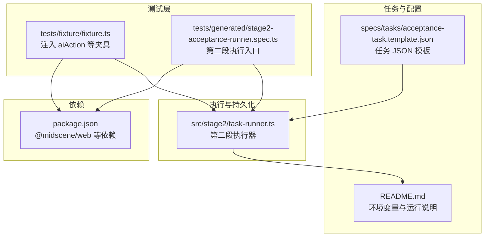
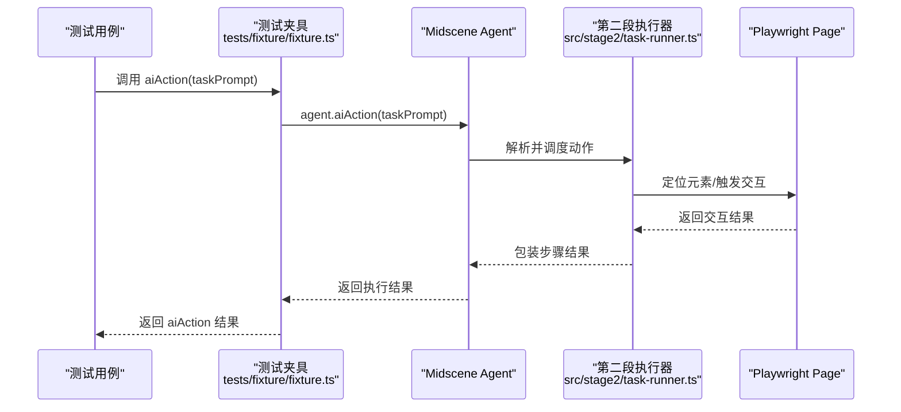
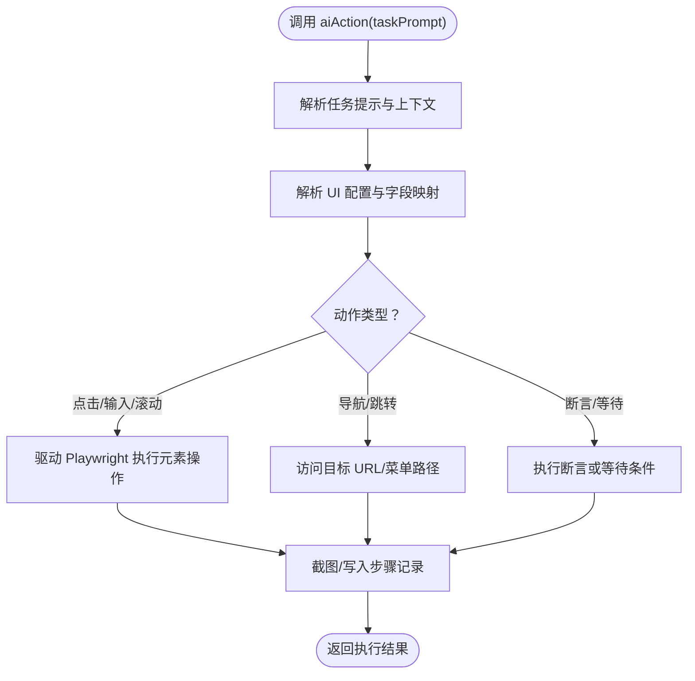
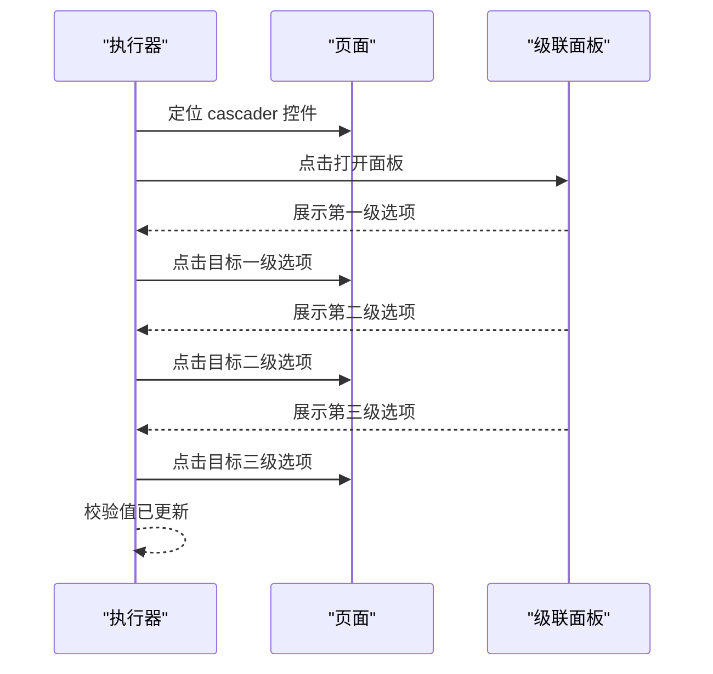
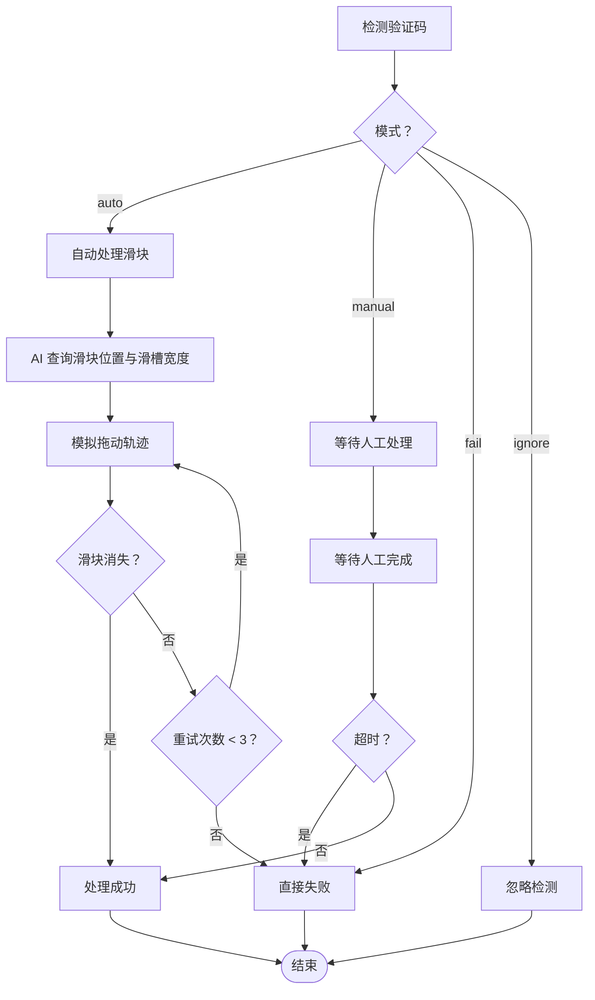
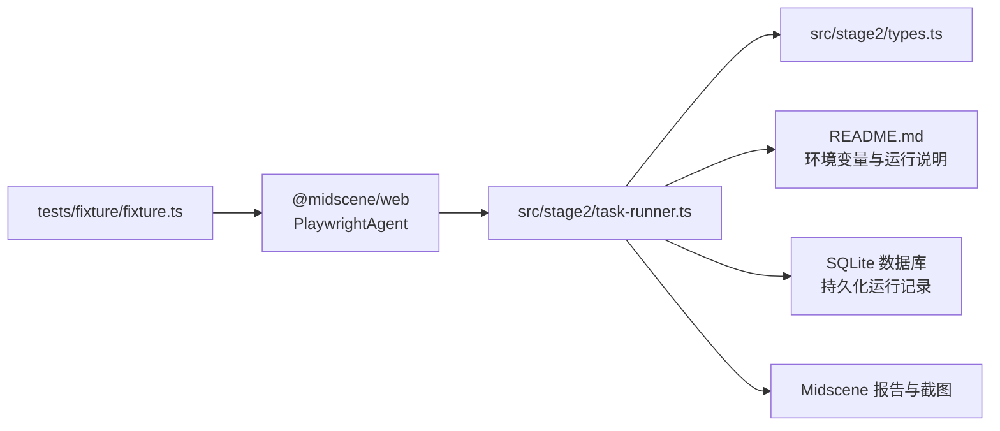

# aiAction 动作执行 API

<cite>
**本文引用的文件**
- [README.md](file://README.md)
- [package.json](file://package.json)
- [tests/fixture/fixture.ts](file://tests/fixture/fixture.ts)
- [tests/generated/stage2-acceptance-runner.spec.ts](file://tests/generated/stage2-acceptance-runner.spec.ts)
- [specs/tasks/acceptance-task.template.json](file://specs/tasks/acceptance-task.template.json)
- [src/stage2/types.ts](file://src/stage2/types.ts)
- [src/stage2/task-runner.ts](file://src/stage2/task-runner.ts)
- [.tasks/AI自主代理验收系统开发改造方案_2026-03-11.md](file://.tasks/AI自主代理验收系统开发改造方案_2026-03-11.md)
</cite>

## 目录
1. [简介](#简介)
2. [项目结构](#项目结构)
3. [核心组件](#核心组件)
4. [架构总览](#架构总览)
5. [详细组件分析](#详细组件分析)
6. [依赖关系分析](#依赖关系分析)
7. [性能考量](#性能考量)
8. [故障排查指南](#故障排查指南)
9. [结论](#结论)
10. [附录](#附录)

## 简介
本文件面向使用 aiAction API 的开发者，系统性阐述其在页面交互、元素操作、表单填写与复杂用户行为模拟中的能力与最佳实践。重点覆盖：
- aiAction 的动作类型与参数配置
- 执行策略与重试机制
- 错误处理与失败回退方案
- 在测试中如何使用 aiAction 打开级联面板、点击选项、处理验证码等关键操作
- 如何结合任务 JSON 与第二段执行器实现稳定可靠的智能动作执行系统

## 项目结构
该项目基于 Playwright 与 Midscene.js 构建 AI 自动化测试体系，aiAction 通过统一的测试夹具注入，贯穿任务驱动的执行流程。

**图表来源**
- [tests/fixture/fixture.ts:1-99](file://tests/fixture/fixture.ts#L1-L99)
- [tests/generated/stage2-acceptance-runner.spec.ts:1-39](file://tests/generated/stage2-acceptance-runner.spec.ts#L1-L39)
- [specs/tasks/acceptance-task.template.json:1-141](file://specs/tasks/acceptance-task.template.json#L1-L141)
- [src/stage2/task-runner.ts:1-200](file://src/stage2/task-runner.ts#L1-L200)
- [README.md:1-253](file://README.md#L1-L253)
- [package.json:1-28](file://package.json#L1-L28)

**章节来源**
- [README.md:136-202](file://README.md#L136-L202)
- [package.json:17-26](file://package.json#L17-L26)

## 核心组件
- aiAction 夹具：在测试夹具中注入 aiAction，封装对底层 Agent 的调用，对外暴露简洁的动作执行接口。
- 任务驱动执行器：第二段执行器负责加载任务 JSON、解析 UI 配置、执行动作序列，并进行断言与清理。
- 验证码处理：内置滑块验证码自动处理逻辑，支持自动、手动、失败、忽略四种模式。
- 数据持久化：执行过程中的运行记录、步骤、快照与附件写入 SQLite 数据库。

**章节来源**
- [tests/fixture/fixture.ts:43-56](file://tests/fixture/fixture.ts#L43-L56)
- [src/stage2/task-runner.ts:55-87](file://src/stage2/task-runner.ts#L55-L87)
- [src/stage2/task-runner.ts:483-686](file://src/stage2/task-runner.ts#L483-L686)
- [README.md:101-134](file://README.md#L101-L134)

## 架构总览
aiAction 的调用链路从测试夹具开始，经由 Agent 将任务提示交给底层 AI 引擎，再由执行器解析并驱动 Playwright 完成页面交互。

**图表来源**
- [tests/fixture/fixture.ts:43-56](file://tests/fixture/fixture.ts#L43-L56)
- [src/stage2/task-runner.ts:18-34](file://src/stage2/task-runner.ts#L18-L34)

## 详细组件分析

### aiAction 接口与动作类型
- 接口形态：在测试夹具中以函数形式提供，接收任务提示字符串，内部委托给 Agent 的 aiAction 方法。
- 动作类型：通过任务 JSON 的字段与执行器解析，支持页面导航、元素点击、表单填写、级联选择、对话框操作、表格行操作、清理等。
- 参数配置：主要来源于任务 JSON 的 form、search、navigation、uiProfile 等字段，执行器据此解析 UI 选择器与交互策略。

**图表来源**
- [tests/fixture/fixture.ts:43-56](file://tests/fixture/fixture.ts#L43-L56)
- [specs/tasks/acceptance-task.template.json:141-154](file://specs/tasks/acceptance-task.template.json#L141-L154)
- [src/stage2/types.ts:23-40](file://src/stage2/types.ts#L23-L40)

**章节来源**
- [tests/fixture/fixture.ts:43-56](file://tests/fixture/fixture.ts#L43-L56)
- [specs/tasks/acceptance-task.template.json:18-74](file://specs/tasks/acceptance-task.template.json#L18-L74)
- [src/stage2/types.ts:23-40](file://src/stage2/types.ts#L23-L40)

### 页面交互与元素操作
- 导航：根据任务 JSON 的 navigation.homeReadyText 与 menuPath，执行菜单展开与跳转。
- 元素定位：利用 uiProfile 中的 tableRowSelectors、toastSelectors、dialogSelectors 等选择器优先级列表，提升定位稳定性。
- 交互策略：对可见性、可用性进行前置判断，避免无效操作；对动态内容采用等待与重试策略。

**章节来源**
- [specs/tasks/acceptance-task.template.json:18-45](file://specs/tasks/acceptance-task.template.json#L18-L45)
- [src/stage2/task-runner.ts:165-200](file://src/stage2/task-runner.ts#L165-L200)

### 表单填写与级联面板
- 字段类型：支持 input、textarea、cascader 等组件类型，cascader 用于多级联动选择。
- 填写策略：根据字段 label 与 componentType，定位对应输入控件并填入 value 或数组值。
- 级联面板：通过多次点击与等待，逐级打开并选择目标选项，确保每一步交互后页面状态稳定。

**图表来源**
- [specs/tasks/acceptance-task.template.json:52-63](file://specs/tasks/acceptance-task.template.json#L52-L63)
- [src/stage2/types.ts:25](file://src/stage2/types.ts#L25)

**章节来源**
- [specs/tasks/acceptance-task.template.json:52-63](file://specs/tasks/acceptance-task.template.json#L52-L63)
- [src/stage2/types.ts:25](file://src/stage2/types.ts#L25)

### 复杂用户行为模拟
- 滚动与聚焦：在长列表或隐藏区域中，先滚动至可视范围再进行交互。
- 键盘事件：必要时通过键盘事件辅助完成输入或快捷操作。
- 多步骤编排：将复杂流程拆分为多个步骤，每个步骤独立等待与断言，提升可维护性与可观测性。

**章节来源**
- [.tasks/AI自主代理验收系统开发改造方案_2026-03-11.md:60-84](file://.tasks/AI自主代理验收系统开发改造方案_2026-03-11.md#L60-L84)

### 验证码处理与重试策略
- 模式配置：支持 auto（自动）、manual（人工）、fail（失败）、ignore（忽略）四种模式，通过环境变量控制。
- 自动处理：检测滑块验证码，AI 查询滑块位置与滑槽宽度，Playwright 模拟真人拖动轨迹（15步、easeOut 缓动、随机抖动），最多重试 3 次。
- 人工处理：检测到验证码后等待人工完成，超时则报错。
- 失败与忽略：fail 模式直接报错；ignore 模式跳过检测。

**图表来源**
- [src/stage2/task-runner.ts:61-87](file://src/stage2/task-runner.ts#L61-L87)
- [src/stage2/task-runner.ts:483-501](file://src/stage2/task-runner.ts#L483-L501)
- [src/stage2/task-runner.ts:510-559](file://src/stage2/task-runner.ts#L510-L559)
- [src/stage2/task-runner.ts:561-648](file://src/stage2/task-runner.ts#L561-L648)
- [src/stage2/task-runner.ts:650-686](file://src/stage2/task-runner.ts#L650-L686)
- [README.md:58-76](file://README.md#L58-L76)

**章节来源**
- [src/stage2/task-runner.ts:61-87](file://src/stage2/task-runner.ts#L61-L87)
- [src/stage2/task-runner.ts:483-686](file://src/stage2/task-runner.ts#L483-L686)
- [README.md:58-76](file://README.md#L58-L76)

### 错误处理与失败回退
- 步骤级失败：执行器记录每个步骤的状态、耗时、截图路径与错误堆栈，便于定位问题。
- 回退策略：清理阶段可配置 verifyAfterCleanup 与 failOnError，失败时可选择中断或继续。
- 日志与报告：统一设置日志目录，生成 Midscene 报告与截图，便于问题复现。

**章节来源**
- [src/stage2/task-runner.ts:495-537](file://src/stage2/task-runner.ts#L495-L537)
- [README.md:101-134](file://README.md#L101-L134)
- [tests/fixture/fixture.ts:10](file://tests/fixture/fixture.ts#L10)

## 依赖关系分析
aiAction 的实现依赖于测试夹具、执行器与任务 JSON 配置，同时受环境变量与运行时配置影响。

**图表来源**
- [tests/fixture/fixture.ts:1-99](file://tests/fixture/fixture.ts#L1-L99)
- [src/stage2/task-runner.ts:1-200](file://src/stage2/task-runner.ts#L1-L200)
- [src/stage2/types.ts:1-180](file://src/stage2/types.ts#L1-L180)
- [README.md:39-56](file://README.md#L39-L56)

**章节来源**
- [package.json:17-26](file://package.json#L17-L26)
- [README.md:39-56](file://README.md#L39-L56)

## 性能考量
- 步骤拆分：将长流程拆分为多个步骤，降低单步失败概率，提升可重试性与可观测性。
- 等待策略：优先使用 Playwright 硬检测与显式等待，避免过度依赖 AI 推理导致的不确定性。
- 截图与报告：合理开启截图与报告，平衡性能与诊断成本。
- 重试与退避：验证码自动处理采用固定次数重试，避免无限等待。

[本节为通用指导，无需列出章节来源]

## 故障排查指南
- 验证码处理失败
  - 检查 STAGE2_CAPTCHA_MODE 与 STAGE2_CAPTCHA_WAIT_TIMEOUT_MS 配置。
  - 确认滑块检测选择器与页面样式一致，必要时调整 uiProfile。
  - 查看 Midscene 报告与截图，定位拖动轨迹与验证结果。
- 动作执行失败
  - 检查任务 JSON 中的字段 label 与 componentType 是否正确。
  - 确认 UI 选择器优先级列表是否覆盖目标平台。
  - 查看步骤记录中的截图与错误堆栈，定位失败步骤。
- 清理阶段异常
  - 启用 verifyAfterCleanup 并检查 failOnError 配置。
  - 确认匹配字段与行匹配模式（exact/contains）符合预期。

**章节来源**
- [README.md:58-76](file://README.md#L58-L76)
- [src/stage2/task-runner.ts:650-686](file://src/stage2/task-runner.ts#L650-L686)
- [src/stage2/task-runner.ts:495-537](file://src/stage2/task-runner.ts#L495-L537)

## 结论
aiAction 通过统一的夹具与任务驱动执行器，将自然语言提示转化为可重试、可观测、可回退的页面交互。配合完善的验证码处理、步骤记录与持久化能力，能够支撑复杂业务场景下的稳定自动化执行。建议在关键断言上优先使用硬检测与结构化查询，AI 能力作为兜底与增强手段，持续提升系统的鲁棒性与可维护性。

[本节为总结性内容，无需列出章节来源]

## 附录

### 使用示例（步骤说明）
以下示例以“步骤说明”的形式给出，便于在测试中组织 aiAction 的调用：

- 打开级联面板并选择选项
  - 步骤 1：定位 cascader 控件并点击打开面板
  - 步骤 2：等待第一级选项出现并点击目标项
  - 步骤 3：等待第二级选项出现并点击目标项
  - 步骤 4：等待第三级选项出现并点击目标项
  - 步骤 5：断言所选值已更新

- 处理验证码
  - 步骤 1：进入登录页并触发登录
  - 步骤 2：检测验证码并根据模式处理（自动/人工/失败/忽略）
  - 步骤 3：若自动模式失败，按重试策略再次尝试
  - 步骤 4：验证验证码是否清除，继续后续流程

- 表单填写与提交
  - 步骤 1：打开新增弹窗
  - 步骤 2：按字段顺序填写表单（含级联面板）
  - 步骤 3：点击提交按钮并等待成功提示
  - 步骤 4：断言表格中出现新增记录

**章节来源**
- [specs/tasks/acceptance-task.template.json:46-74](file://specs/tasks/acceptance-task.template.json#L46-L74)
- [src/stage2/task-runner.ts:561-648](file://src/stage2/task-runner.ts#L561-L648)
- [tests/generated/stage2-acceptance-runner.spec.ts:12-37](file://tests/generated/stage2-acceptance-runner.spec.ts#L12-L37)