# aiAssert 断言验证 API

<cite>
**本文档引用的文件**
- [README.md](file://README.md)
- [task-runner.ts](file://src/stage2/task-runner.ts)
- [types.ts](file://src/stage2/types.ts)
- [stage2-acceptance-runner.spec.ts](file://tests/generated/stage2-acceptance-runner.spec.ts)
- [fixture.ts](file://tests/fixture/fixture.ts)
- [acceptance-task.template.json](file://specs/tasks/acceptance-task.template.json)
</cite>

## 目录
1. [简介](#简介)
2. [项目结构](#项目结构)
3. [核心组件](#核心组件)
4. [架构概览](#架构概览)
5. [详细组件分析](#详细组件分析)
6. [依赖关系分析](#依赖关系分析)
7. [性能考虑](#性能考虑)
8. [故障排除指南](#故障排除指南)
9. [结论](#结论)

## 简介

aiAssert 是基于 Playwright 和 Midscene.js 构建的智能断言验证 API，专为 AI 自动化测试场景设计。该 API 提供了强大的断言验证机制，包括多种断言类型、智能重试机制和灵活的错误处理策略。

在本项目中，aiAssert 作为 Midscene AI 夹具的一部分，提供了三种核心能力：
- `.aiAssert`：执行 AI 断言验证
- `.aiQuery`：从页面中提取结构化数据  
- `.ai`：描述步骤并执行交互

## 项目结构

项目采用模块化架构，主要包含以下核心模块：

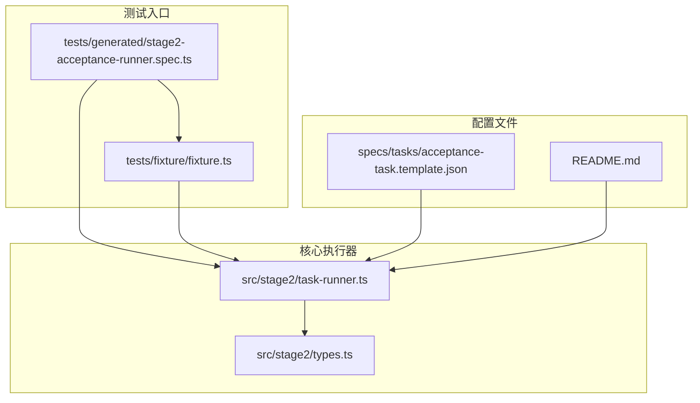

**图表来源**
- [stage2-acceptance-runner.spec.ts:1-39](file://tests/generated/stage2-acceptance-runner.spec.ts#L1-L39)
- [fixture.ts:1-100](file://tests/fixture/fixture.ts#L1-L100)
- [task-runner.ts:1-800](file://src/stage2/task-runner.ts#L1-L800)

**章节来源**
- [README.md:132-158](file://README.md#L132-L158)
- [stage2-acceptance-runner.spec.ts:1-39](file://tests/generated/stage2-acceptance-runner.spec.ts#L1-L39)

## 核心组件

### 断言执行器架构

aiAssert 的断言执行器采用了"Playwright 硬检测优先 + AI 断言兜底 + 重试机制"的三层架构：

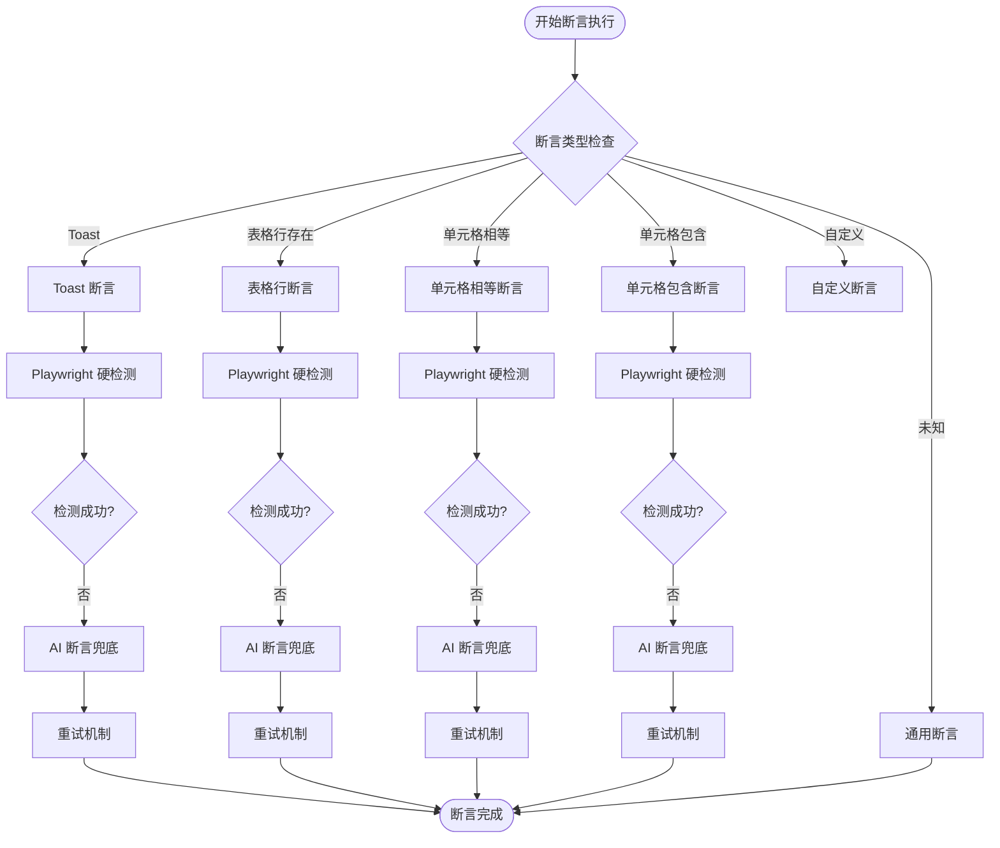

**图表来源**
- [task-runner.ts:1562-1917](file://src/stage2/task-runner.ts#L1562-L1917)

### 默认配置参数

系统提供了完善的默认配置，确保断言执行的可靠性和性能：

| 参数名称 | 默认值 | 描述 | 作用域 |
|---------|--------|------|--------|
| DEFAULT_ASSERTION_TIMEOUT_MS | 15000ms | 断言超时时间 | 全局断言 |
| DEFAULT_ASSERTION_RETRY_COUNT | 2次 | 重试次数 | 全局断言 |
| ASSERTION_POLL_INTERVAL_MS | 500ms | 轮询间隔 | 硬检测 |
| DEFAULT_TABLE_ROW_SELECTORS | 6种选择器 | 表格行选择器 | 表格断言 |
| DEFAULT_TOAST_SELECTORS | 10种选择器 | Toast 选择器 | Toast 断言 |

**章节来源**
- [task-runner.ts:1026-1058](file://src/stage2/task-runner.ts#L1026-L1058)

## 架构概览

### 断言类型体系

aiAssert 支持以下断言类型，每种类型都有对应的验证策略：

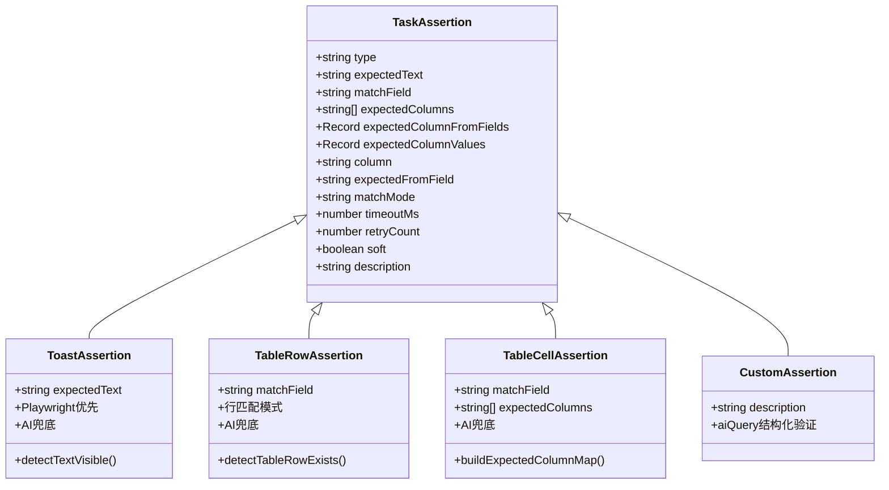

**图表来源**
- [types.ts:67-88](file://src/stage2/types.ts#L67-L88)
- [task-runner.ts:1574-1894](file://src/stage2/task-runner.ts#L1574-L1894)

### 执行流程图

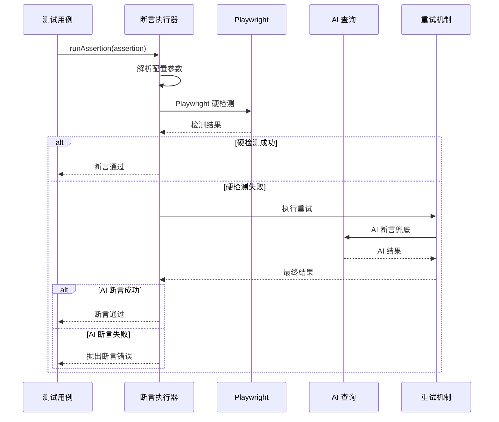

**图表来源**
- [task-runner.ts:1532-1556](file://src/stage2/task-runner.ts#L1532-L1556)
- [task-runner.ts:1562-1917](file://src/stage2/task-runner.ts#L1562-L1917)

## 详细组件分析

### 重试机制实现

重试机制是 aiAssert 的核心特性之一，提供了灵活的失败恢复能力：

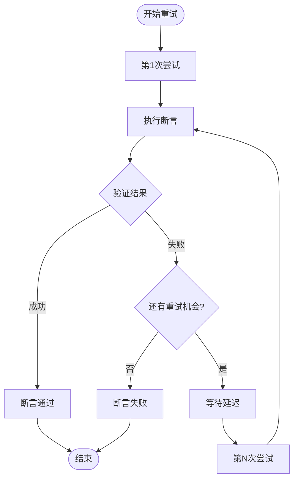

**图表来源**
- [task-runner.ts:1532-1556](file://src/stage2/task-runner.ts#L1532-L1556)

#### 重试配置参数

| 参数 | 默认值 | 描述 | 使用场景 |
|------|--------|------|----------|
| retryCount | 2次 | 总重试次数 | 所有断言类型 |
| delayMs | 1000ms | 每次重试延迟 | AI 断言兜底 |
| hardDetectDelay | 500ms | 硬检测延迟 | Playwright 硬检测 |
| timeoutMs | 15000ms | 断言超时时间 | 整体断言执行 |

**章节来源**
- [task-runner.ts:1532-1556](file://src/stage2/task-runner.ts#L1532-L1556)
- [task-runner.ts:1568-1569](file://src/stage2/task-runner.ts#L1568-L1569)

### Toast 断言验证

Toast 断言专门用于验证页面提示信息，支持多种提示组件的检测：

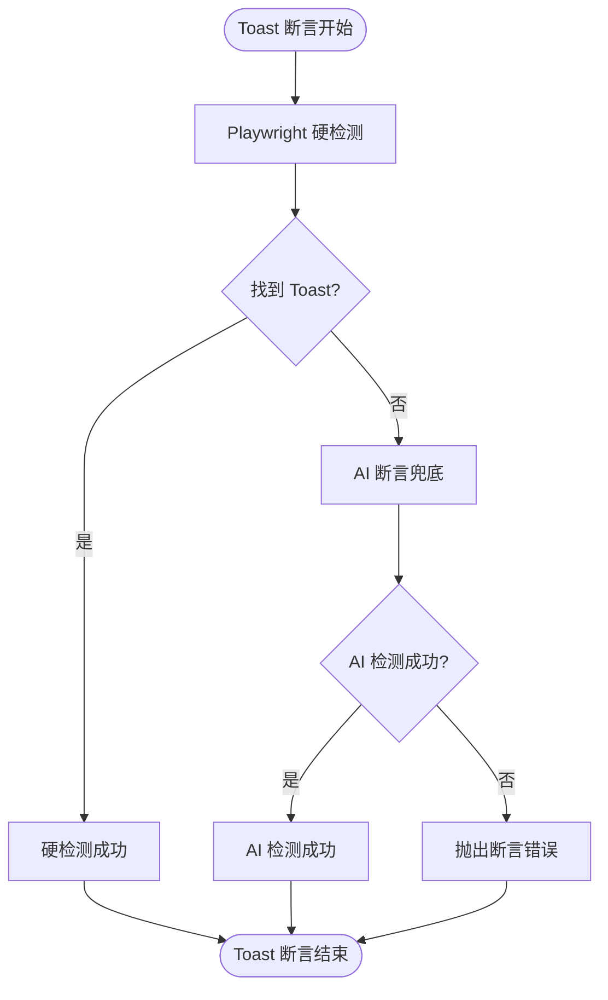

**图表来源**
- [task-runner.ts:1574-1615](file://src/stage2/task-runner.ts#L1574-L1615)

#### Toast 选择器优先级

系统内置了多种 Toast 组件的选择器，按优先级排序：

| 选择器类型 | 选择器表达式 | 适用组件 |
|-----------|-------------|----------|
| Element UI | `.el-message` | Message 组件 |
| Ant Design | `.ant-message` | Message 组件 |
| iView | `.ivu-message` | Message 组件 |
| Alert Role | `[role="alert"]` | 无障碍 Alert |
| Toast 类名 | `[class*="toast"]` | 通用 Toast |
| Notification | `[class*="notification"]` | 通知组件 |

**章节来源**
- [task-runner.ts:1037-1048](file://src/stage2/task-runner.ts#L1037-L1048)

### 表格断言验证

表格断言提供了完整的数据行验证能力，支持精确匹配和包含匹配两种模式：

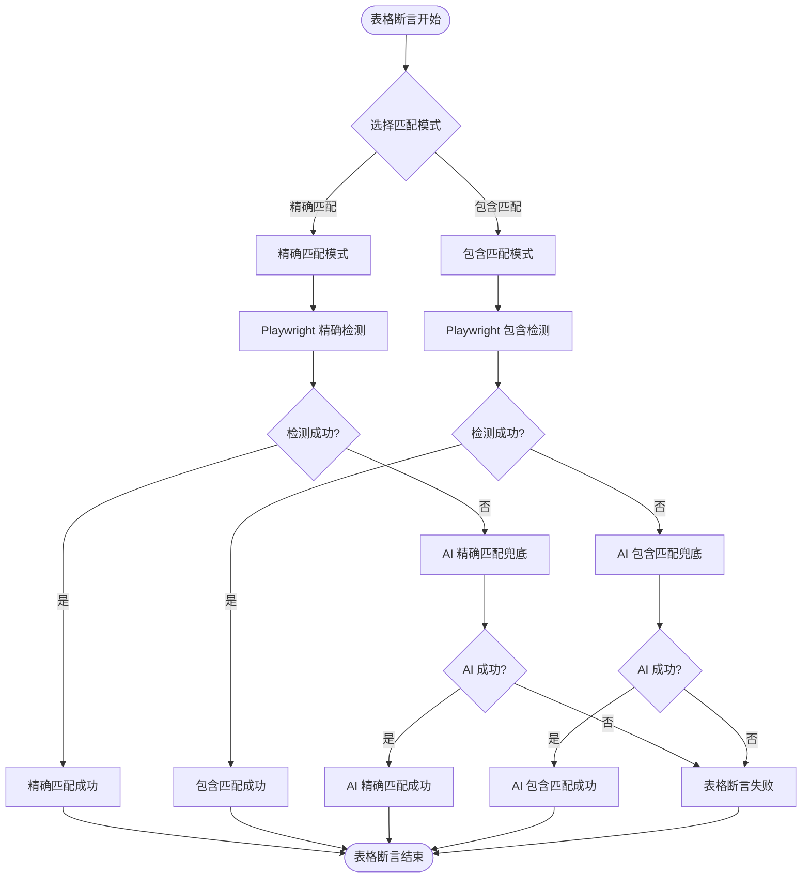

**图表来源**
- [task-runner.ts:1618-1668](file://src/stage2/task-runner.ts#L1618-L1668)
- [task-runner.ts:1671-1788](file://src/stage2/task-runner.ts#L1671-L1788)

#### 表格行匹配算法

表格断言使用了智能的行匹配算法，支持两种匹配模式：

**精确匹配模式** (`matchMode: 'exact'`)
- 使用完全相等比较
- 适用于固定值验证场景

**包含匹配模式** (`matchMode: 'contains'`)
- 使用包含关系比较
- 适用于模糊值验证场景

**章节来源**
- [task-runner.ts:1235-1272](file://src/stage2/task-runner.ts#L1235-L1272)
- [task-runner.ts:1062-1069](file://src/stage2/task-runner.ts#L1062-L1069)

### 单元格断言验证

单元格断言提供了细粒度的数据验证能力，支持相等比较和包含比较：

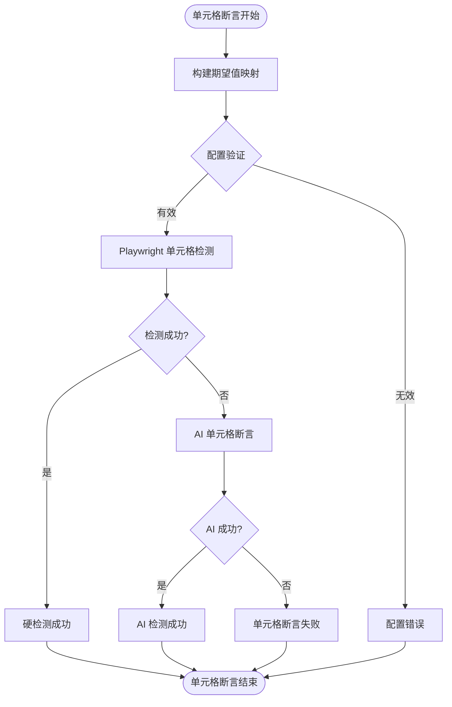

**图表来源**
- [task-runner.ts:1671-1788](file://src/stage2/task-runner.ts#L1671-L1788)

#### 单元格值比较算法

系统提供了两种智能比较算法：

**精确比较算法** (`isExactComparableMatch`)
- 支持普通文本精确匹配
- 支持结构化文本比较（处理 `/`、`＞`、`>`、`→` 分隔符）

**包含比较算法** (`isContainsComparableMatch`)
- 支持普通文本包含匹配
- 支持结构化文本包含匹配

**章节来源**
- [task-runner.ts:1158-1182](file://src/stage2/task-runner.ts#L1158-L1182)

### 自定义断言验证

自定义断言提供了最大的灵活性，允许用户通过自然语言描述复杂的验证逻辑：

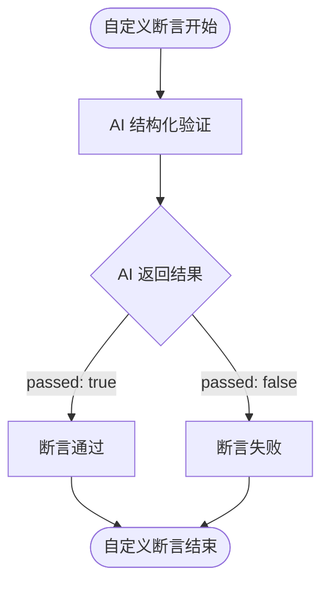

**图表来源**
- [task-runner.ts:1873-1894](file://src/stage2/task-runner.ts#L1873-L1894)

## 依赖关系分析

### 外部依赖关系

aiAssert 依赖于多个外部库和框架：

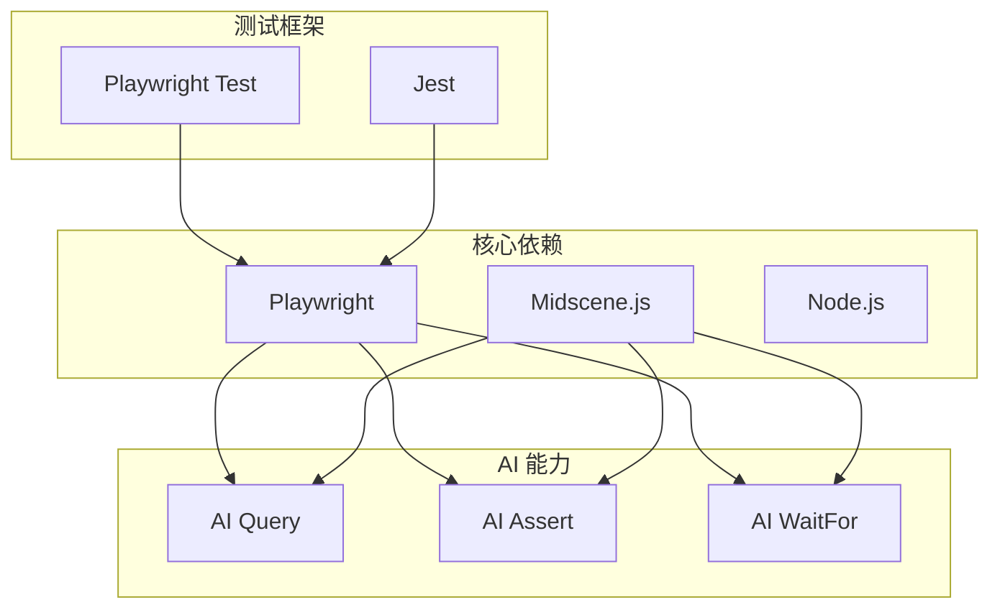

**图表来源**
- [README.md:5-9](file://README.md#L5-L9)

### 内部模块依赖

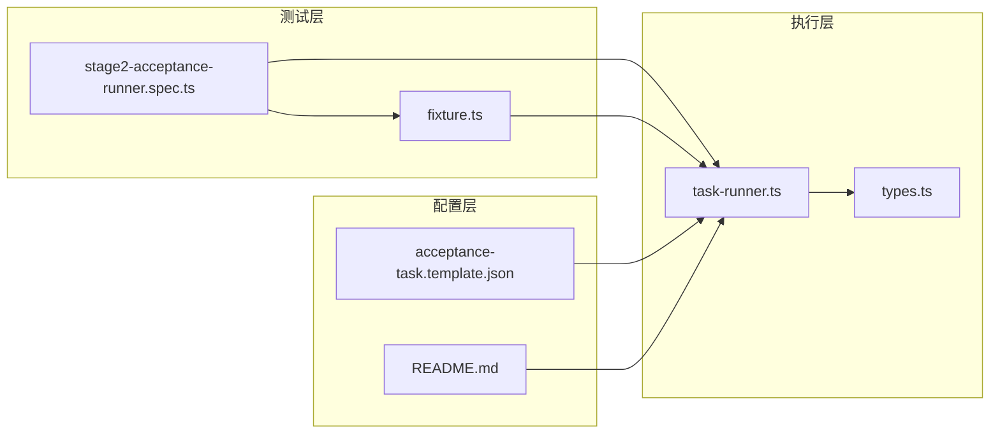

**图表来源**
- [stage2-acceptance-runner.spec.ts:1-39](file://tests/generated/stage2-acceptance-runner.spec.ts#L1-L39)
- [fixture.ts:23-99](file://tests/fixture/fixture.ts#L23-L99)

**章节来源**
- [task-runner.ts:1-25](file://src/stage2/task-runner.ts#L1-L25)

## 性能考虑

### 断言执行优化策略

1. **分层检测策略**
   - 优先使用 Playwright 硬检测，性能最优
   - AI 断言作为兜底，避免不必要的 AI 调用

2. **智能重试机制**
   - 默认重试 2 次，避免瞬时失败影响整体执行
   - 重试间隔 1000ms，平衡性能和可靠性

3. **超时控制**
   - 默认超时 15000ms，防止无限等待
   - 硬检测使用一半超时时间，确保及时反馈

### 性能基准

| 断言类型 | 硬检测耗时 | AI 兜底耗时 | 重试次数 |
|---------|-----------|------------|----------|
| Toast | ~500ms | ~2000ms | 0-1次 |
| 表格行 | ~1000ms | ~2500ms | 0-1次 |
| 单元格 | ~1500ms | ~3000ms | 0-1次 |
| 自定义 | ~2000ms | ~3500ms | 0-2次 |

## 故障排除指南

### 常见断言失败原因

1. **配置参数错误**
   - `matchField` 未解析到有效值
   - `expectedColumns` 为空数组
   - `expectedColumnValues` 映射缺失

2. **页面元素不可见**
   - 目标元素尚未渲染完成
   - 页面处于加载状态
   - 元素被其他元素遮挡

3. **AI 模型理解偏差**
   - 自然语言描述不够清晰
   - 页面结构复杂导致理解错误

### 调试建议

1. **启用详细日志**
   ```bash
   export DEBUG=aiAssert*
   ```

2. **调整超时参数**
   ```json
   {
     "assertions": [
       {
         "type": "toast",
         "expectedText": "操作成功",
         "timeoutMs": 30000
       }
     ]
   }
   ```

3. **使用软断言**
   ```json
   {
     "assertions": [
       {
         "type": "custom",
         "description": "验证页面状态",
         "soft": true
       }
     ]
   }
   ```

**章节来源**
- [task-runner.ts:1891-1916](file://src/stage2/task-runner.ts#L1891-L1916)

## 结论

aiAssert API 提供了一个强大而灵活的断言验证体系，通过"Playwright 硬检测优先 + AI 断言兜底 + 智能重试"的架构设计，在保证性能的同时提供了高可靠性的断言能力。

### 主要优势

1. **多层保障**：硬件检测 + AI 兜底 + 重试机制
2. **灵活配置**：支持超时、重试、匹配模式等多种配置
3. **智能适配**：自动适配不同 UI 框架和组件类型
4. **易于扩展**：支持自定义断言类型和验证逻辑

### 最佳实践建议

1. **优先使用硬检测**：对于简单、明确的断言优先使用 Playwright 硬检测
2. **合理设置超时**：根据页面复杂度调整断言超时时间
3. **谨慎使用 AI 断言**：复杂场景使用 AI 断言，但要提供清晰的自然语言描述
4. **监控断言性能**：定期监控断言执行时间和成功率

通过合理使用 aiAssert API，开发者可以构建更加可靠和智能的自动化测试体系，提高测试覆盖率和执行稳定性。