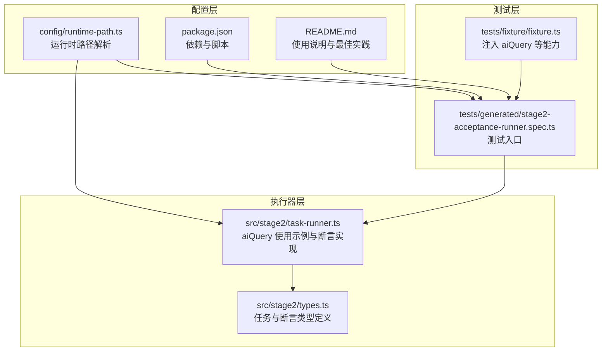
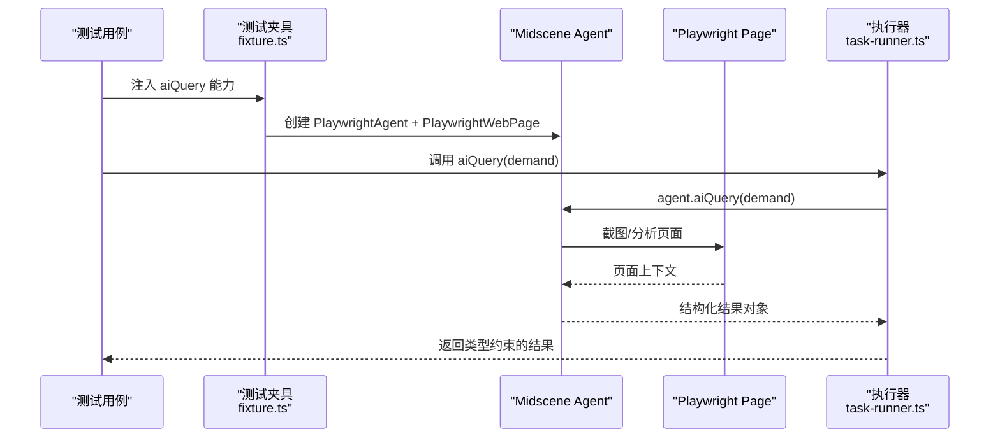
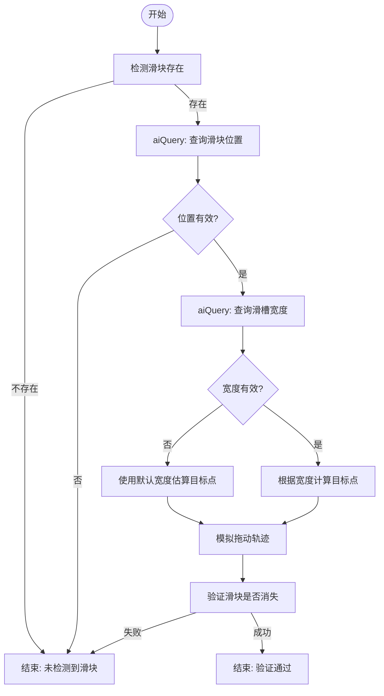
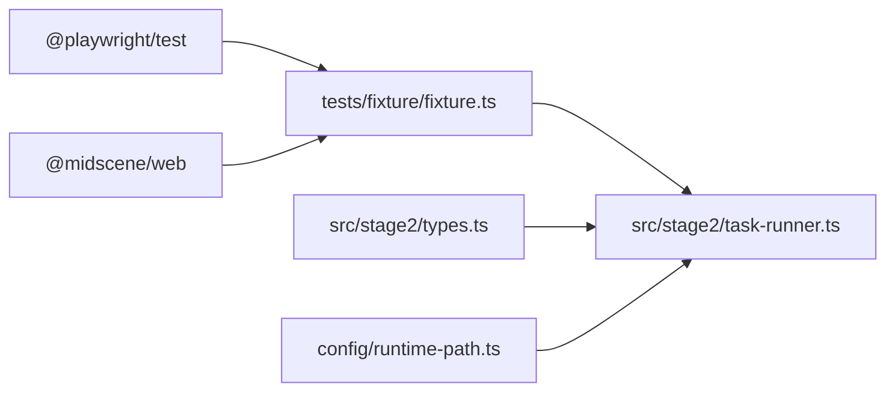

# aiQuery 数据提取 API

<cite>
**本文引用的文件**
- [README.md](file://README.md)
- [package.json](file://package.json)
- [fixture.ts](file://tests/fixture/fixture.ts)
- [stage2-acceptance-runner.spec.ts](file://tests/generated/stage2-acceptance-runner.spec.ts)
- [task-runner.ts](file://src/stage2/task-runner.ts)
- [types.ts](file://src/stage2/types.ts)
- [runtime-path.ts](file://config/runtime-path.ts)
</cite>

## 目录
1. [简介](#简介)
2. [项目结构](#项目结构)
3. [核心组件](#核心组件)
4. [架构概览](#架构概览)
5. [详细组件分析](#详细组件分析)
6. [依赖分析](#依赖分析)
7. [性能考虑](#性能考虑)
8. [故障排除指南](#故障排除指南)
9. [结论](#结论)
10. [附录](#附录)

## 简介
本文件面向开发者，系统性阐述 aiQuery API 的数据提取能力与使用方法。aiQuery 是基于 Midscene.js 的结构化数据提取能力，在本项目中通过 Playwright 夹具注入，用于从页面中抽取结构化信息（如滑块位置、验证码滑槽宽度、表格行信息、提示文本等），并与 Playwright 的强检测相结合，形成"硬检测优先、AI 兜底"的断言策略。

本项目已在 README 中明确说明：
- aiQuery 的核心职责是"从页面中提取结构化数据"
- 推荐实践是"断言优先使用 Playwright 硬检测，复杂语义场景使用 aiQuery + 代码断言"
- aiQuery 返回结构化 JSON 对象，调用方需定义期望字段并进行类型约束

**章节来源**
- [README.md:139-152](file://README.md#L139-L152)

## 项目结构
该项目采用分层组织：
- tests：测试夹具与入口，提供 aiQuery 等 Midscene 能力注入
- src/stage2：第二阶段执行器与任务编排逻辑
- config：运行时路径与环境变量解析
- 根目录：项目配置与说明文档

**图表来源**
- [fixture.ts:1-100](file://tests/fixture/fixture.ts#L1-L100)
- [stage2-acceptance-runner.spec.ts:1-39](file://tests/generated/stage2-acceptance-runner.spec.ts#L1-L39)
- [task-runner.ts:1-800](file://src/stage2/task-runner.ts#L1-L800)
- [types.ts:1-180](file://src/stage2/types.ts#L1-L180)
- [runtime-path.ts:1-41](file://config/runtime-path.ts#L1-L41)
- [package.json:1-26](file://package.json#L1-L26)
- [README.md:132-158](file://README.md#L132-L158)

**章节来源**
- [README.md:132-158](file://README.md#L132-L158)
- [package.json:6-11](file://package.json#L6-L11)

## 核心组件
- aiQuery 夹具注入：在测试夹具中通过 Midscene Agent 包装 Page，暴露 aiQuery 方法，支持泛型返回类型约束
- 执行器中的 aiQuery 使用：在滑块验证码自动处理、表格断言、提示信息断言等场景中，通过 aiQuery 获取结构化数据
- 类型系统：通过 TypeScript 泛型约束 aiQuery 的返回值结构，确保调用方能安全消费结果
- 运行时配置：通过环境变量控制验证码处理模式与超时，影响 aiQuery 的使用时机与容错策略

**章节来源**
- [fixture.ts:57-69](file://tests/fixture/fixture.ts#L57-L69)
- [task-runner.ts:510-559](file://src/stage2/task-runner.ts#L510-L559)
- [types.ts:67-88](file://src/stage2/types.ts#L67-L88)
- [README.md:56-62](file://README.md#L56-L62)

## 架构概览
aiQuery 在本项目中的调用链路如下：

**图表来源**
- [fixture.ts:57-69](file://tests/fixture/fixture.ts#L57-L69)
- [stage2-acceptance-runner.spec.ts:18-25](file://tests/generated/stage2-acceptance-runner.spec.ts#L18-L25)
- [task-runner.ts:510-559](file://src/stage2/task-runner.ts#L510-L559)

## 详细组件分析

### aiQuery API 语法与参数
- 调用签名
  - 测试夹具注入：aiQuery(demand: any) => Promise<T>
  - 执行器内部：runner.aiQuery<T>(prompt: string) => Promise<T>
- 参数说明
  - demand/prompt：描述要提取的数据需求，应包含明确的返回格式要求（如 JSON Schema）
  - 返回类型：通过 TypeScript 泛型约束，确保调用方获得结构化的强类型结果
- 作用域
  - 在页面可见状态下调用，AI 会基于当前页面截图与 DOM 上下文进行分析
  - 适合提取复杂语义、多元素组合或需要结构化输出的场景

**章节来源**
- [fixture.ts:57-69](file://tests/fixture/fixture.ts#L57-L69)
- [task-runner.ts:510-559](file://src/stage2/task-runner.ts#L510-L559)

### aiQuery 的数据提取能力与返回值类型

#### 滑块验证码位置与滑槽宽度提取
- 提取目标
  - 滑块按钮中心点坐标与尺寸
  - 验证码滑槽总宽度
- 返回值类型
  - 位置：包含 found、x、y、width、height 的对象
  - 宽度：包含 found、width 的对象
- 使用场景
  - 自动拖动滑块验证：根据位置与滑槽宽度计算目标终点，模拟真人轨迹

**图表来源**
- [task-runner.ts:510-559](file://src/stage2/task-runner.ts#L510-L559)
- [task-runner.ts:561-648](file://src/stage2/task-runner.ts#L561-L648)

**章节来源**
- [task-runner.ts:510-559](file://src/stage2/task-runner.ts#L510-L559)
- [task-runner.ts:561-648](file://src/stage2/task-runner.ts#L561-L648)

#### 表格行与单元格信息提取
- 提取目标
  - 表格行是否存在、行内列值
  - 单元格值是否等于/包含期望值
- 返回值类型
  - 行存在：{ found: boolean, rowInfo?: string }
  - 单元格比较：{ found: boolean, matchedRow?: boolean, allMatched?: boolean, mismatchedColumns?: string[], columnValues?: Record<string, string> }
- 使用场景
  - 先尝试 Playwright 硬检测，失败后降级到 aiQuery 结构化提取与比对

**章节来源**
- [task-runner.ts:1618-1668](file://src/stage2/task-runner.ts#L1618-L1668)
- [task-runner.ts:1670-1789](file://src/stage2/task-runner.ts#L1670-L1789)
- [task-runner.ts:1840-1871](file://src/stage2/task-runner.ts#L1840-L1871)

#### 提示信息提取
- 提取目标
  - 页面是否存在包含特定文本的提示信息（如 Toast、弹窗、通知）
- 返回值类型
  - { found: boolean, text?: string }
- 使用场景
  - 验证操作后的反馈信息，先硬检测后 AI 兜底

**章节来源**
- [task-runner.ts:1594-1615](file://src/stage2/task-runner.ts#L1594-L1615)

#### 自定义断言与通用断言
- 提取目标
  - 根据描述性文本进行页面状态验证
- 返回值类型
  - { passed: boolean, reason?: string }
- 使用场景
  - 未知断言类型或复杂语义断言的兜底方案

**章节来源**
- [task-runner.ts:1873-1894](file://src/stage2/task-runner.ts#L1873-L1894)
- [task-runner.ts:1896-1917](file://src/stage2/task-runner.ts#L1896-L1917)

### 页面元素定位、文本内容提取与属性获取
- 元素定位
  - 优先使用 Playwright 的强检测（getByRole/getByLabel/getByTestId）进行定位
  - aiQuery 适用于复杂语义或无法直接定位的场景
- 文本内容提取
  - aiQuery 返回结构化字段，调用方可按字段名访问
  - 对于表格等结构化数据，建议返回 columnValues 以便代码断言
- 属性获取
  - aiQuery 主要面向结构化数据提取，属性读取建议结合 Playwright 的 getAttribute/inputValue 等方法

**章节来源**
- [README.md:146-152](file://README.md#L146-L152)
- [task-runner.ts:292-310](file://src/stage2/task-runner.ts#L292-L310)

### 结构化数据解析与类型约束
- 类型约束
  - 通过 TypeScript 泛型约束 aiQuery 的返回类型，确保字段存在性与类型正确性
- 解析策略
  - 先检查 found 标记，再访问具体字段
  - 对数值型字段进行范围校验（如宽度>0）
  - 对字符串字段进行空值与规范化处理

**章节来源**
- [task-runner.ts:514-537](file://src/stage2/task-runner.ts#L514-L537)
- [task-runner.ts:544-558](file://src/stage2/task-runner.ts#L544-L558)

### 错误处理机制
- aiQuery 调用异常
  - 在滑块验证码处理等关键路径中，aiQuery 调用被 try/catch 包裹，异常会被忽略并回退到默认行为
- 断言降级
  - Playwright 硬检测失败时，自动降级到 aiQuery 结构化断言
  - 未知断言类型时，使用通用 aiQuery 断言兜底
- 失败补偿
  - 滑块自动处理失败时，提供重试机制与错误提示，建议切换到 manual 模式或调整检测策略

**章节来源**
- [task-runner.ts:534-536](file://src/stage2/task-runner.ts#L534-L536)
- [task-runner.ts:683-685](file://src/stage2/task-runner.ts#L683-L685)
- [task-runner.ts:1596-1606](file://src/stage2/task-runner.ts#L1596-L1606)
- [task-runner.ts:1898-1908](file://src/stage2/task-runner.ts#L1898-L1908)

### 超时配置与最佳实践
- 超时配置
  - 验证码等待超时：STAGE2_CAPTCHA_WAIT_TIMEOUT_MS（默认 120000ms）
  - 验证码处理模式：auto/manual/fail/ignore
- 最佳实践
  - 硬检测优先：尽量使用 Playwright 的强检测方法
  - 复杂语义用 aiQuery：对表格、提示信息等结构化数据使用 aiQuery
  - 明确返回格式：在 demand/prompt 中声明期望的 JSON 字段
  - 合理重试：对不稳定场景设置合理的重试次数与间隔
  - 记录与报告：启用 Midscene 报告，便于问题定位

**章节来源**
- [README.md:56-62](file://README.md#L56-L62)
- [README.md:146-152](file://README.md#L146-L152)
- [stage2-acceptance-runner.spec.ts:10](file://tests/generated/stage2-acceptance-runner.spec.ts#L10)

## 依赖分析
- 外部依赖
  - @midscene/web：提供 ai、aiQuery、aiAssert、aiWaitFor 等能力
  - @playwright/test：自动化测试框架
- 内部依赖
  - 测试夹具依赖 Midscene Agent 包装 Playwright Page
  - 执行器在滑块处理、表格断言、提示断言等场景中调用 aiQuery
  - 类型系统通过 TypeScript 泛型约束 aiQuery 返回值

**图表来源**
- [package.json:15-24](file://package.json#L15-L24)
- [fixture.ts:1-10](file://tests/fixture/fixture.ts#L1-L10)
- [task-runner.ts:1-25](file://src/stage2/task-runner.ts#L1-L25)
- [types.ts:1-10](file://src/stage2/types.ts#L1-L10)
- [runtime-path.ts:1-10](file://config/runtime-path.ts#L1-L10)

**章节来源**
- [package.json:15-24](file://package.json#L15-L24)

## 性能考虑
- 截图与分析成本
  - aiQuery 依赖页面截图与视觉分析，频繁调用会增加性能开销
  - 建议在必要时才触发 aiQuery，避免在循环中重复调用
- 重试与等待
  - 对不稳定场景设置合理重试次数与等待间隔，避免过度重试导致执行时间过长
- 组合策略
  - 优先使用 Playwright 硬检测，仅在必要时降级到 aiQuery，平衡准确率与性能

[本节为通用指导，无需特定文件来源]

## 故障排除指南
- aiQuery 无响应或报错
  - 检查页面是否已渲染完成，确保在可见状态下调用
  - 确认 demand/prompt 中的返回格式声明清晰
  - 查看 Midscene 报告与日志，定位分析失败原因
- 验证码自动处理失败
  - 检查滑块检测选择器与文本模式是否匹配当前页面
  - 调整 STAGE2_CAPTCHA_WAIT_TIMEOUT_MS 或切换到 manual 模式
  - 确认 aiQuery 返回的滑块位置与滑槽宽度有效
- 断言失败
  - 先确认 Playwright 硬检测是否能定位目标元素
  - 若降级到 aiQuery，检查返回字段是否符合预期

**章节来源**
- [README.md:64-74](file://README.md#L64-L74)
- [task-runner.ts:683-705](file://src/stage2/task-runner.ts#L683-L705)

## 结论
aiQuery 在本项目中承担了结构化数据提取的关键角色，配合 Playwright 的强检测形成了稳健的断言体系。通过明确的返回格式声明、类型约束与合理的降级策略，开发者可以在复杂 UI 场景中高效、可靠地获取所需信息。建议遵循"硬检测优先、AI 兜底"的原则，并在需要时使用 aiQuery 进行结构化断言与数据提取。

[本节为总结性内容，无需特定文件来源]

## 附录

### 使用示例（代码片段路径）
- 滑块位置提取
  - [task-runner.ts:514-537](file://src/stage2/task-runner.ts#L514-L537)
- 滑槽宽度提取
  - [task-runner.ts:544-558](file://src/stage2/task-runner.ts#L544-L558)
- 表格行存在断言
  - [task-runner.ts:1646-1657](file://src/stage2/task-runner.ts#L1646-L1657)
- 表格单元格值断言
  - [task-runner.ts:1740-1760](file://src/stage2/task-runner.ts#L1740-L1760)
- 提示信息断言
  - [task-runner.ts:1596-1606](file://src/stage2/task-runner.ts#L1596-L1606)
- 自定义断言
  - [task-runner.ts:1876-1893](file://src/stage2/task-runner.ts#L1876-L1893)

### 配置项参考
- 验证码处理模式：STAGE2_CAPTCHA_MODE（auto/manual/fail/ignore）
- 验证码等待超时：STAGE2_CAPTCHA_WAIT_TIMEOUT_MS（毫秒）
- 运行产物目录：通过 RUNTIME_DIR_PREFIX、PLAYWRIGHT_OUTPUT_DIR、PLAYWRIGHT_HTML_REPORT_DIR、MIDSCENE_RUN_DIR、ACCEPTANCE_RESULT_DIR 等环境变量控制

**章节来源**
- [README.md:56-62](file://README.md#L56-L62)
- [README.md:76-95](file://README.md#L76-L95)
- [runtime-path.ts:13-36](file://config/runtime-path.ts#L13-L36)