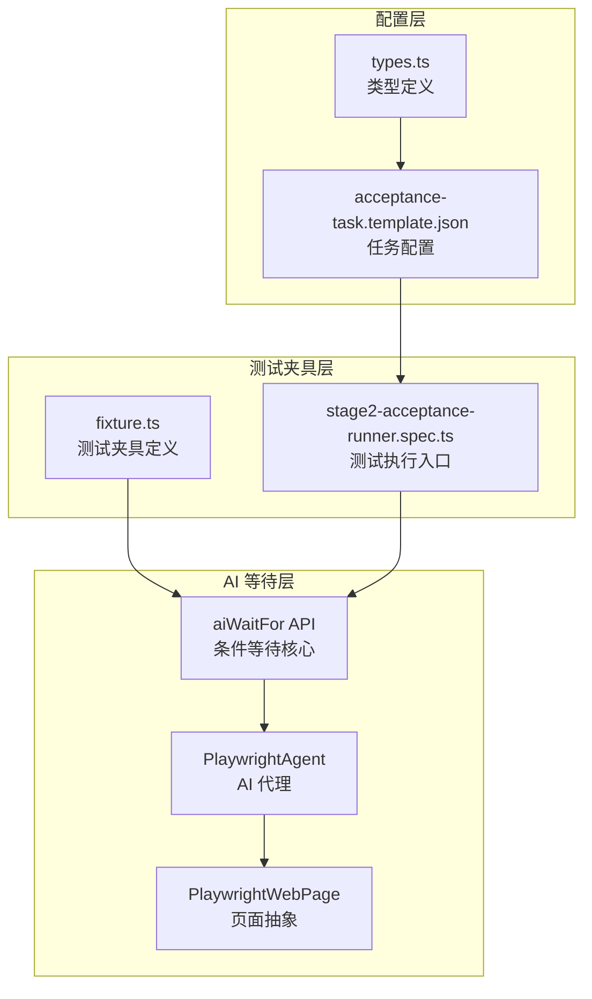
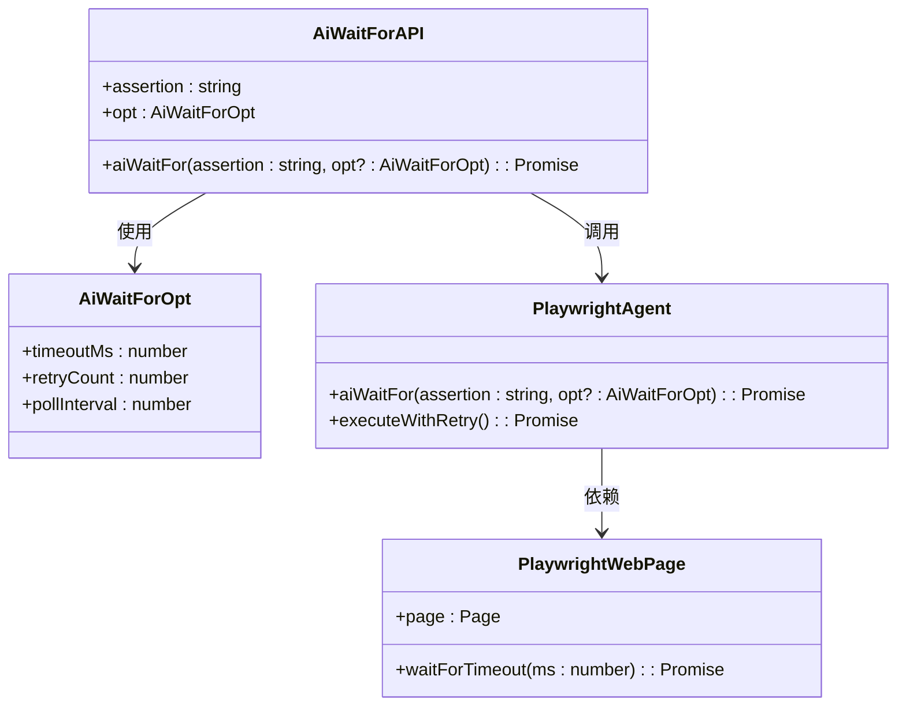
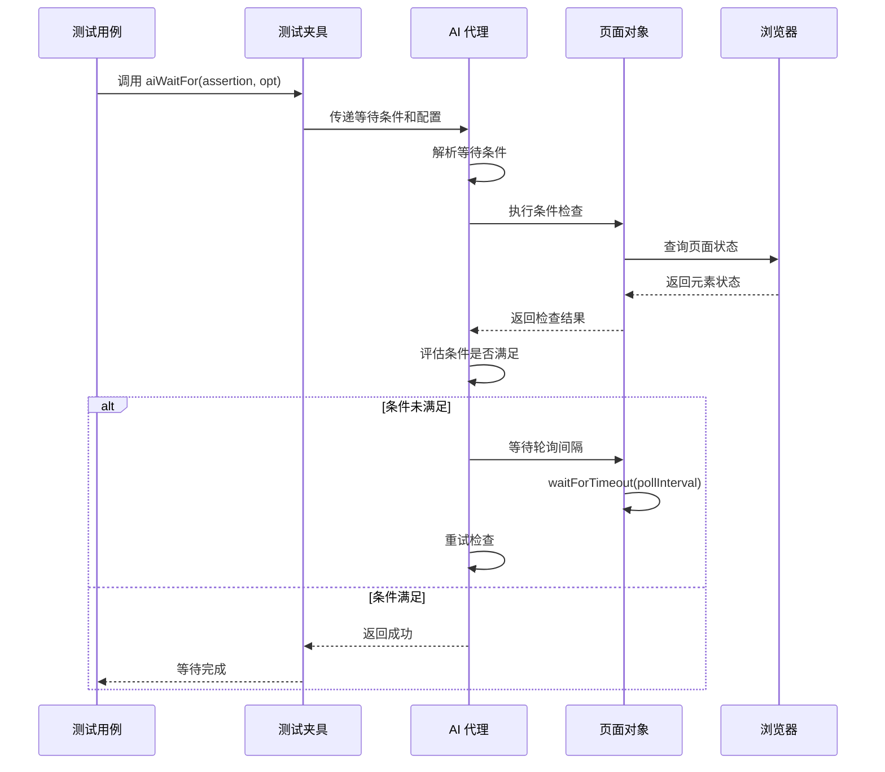
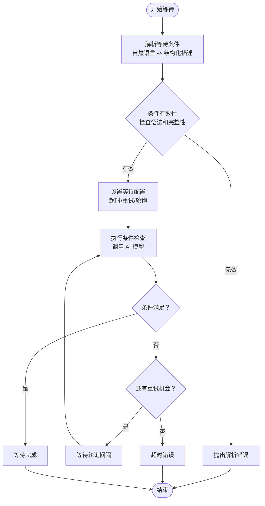
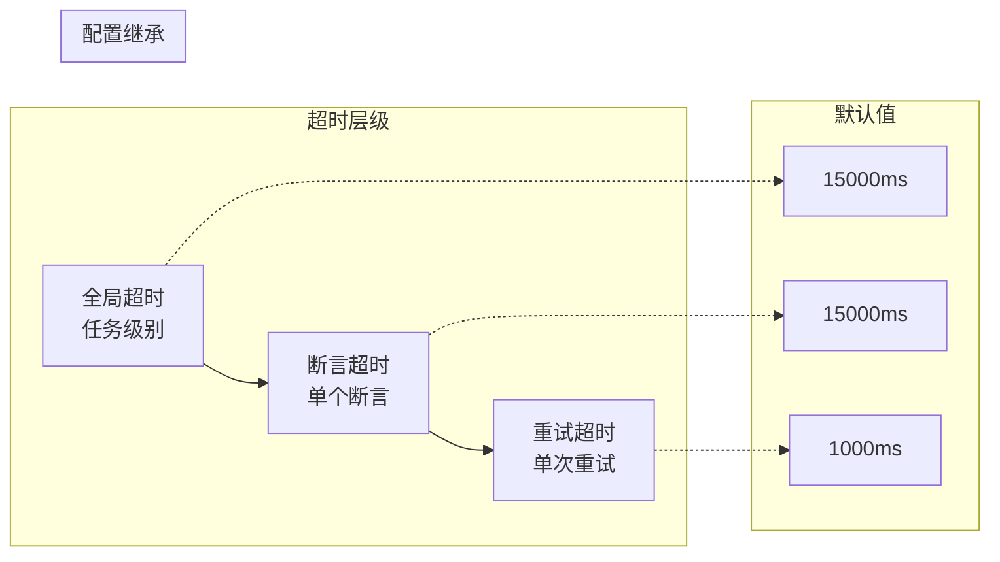
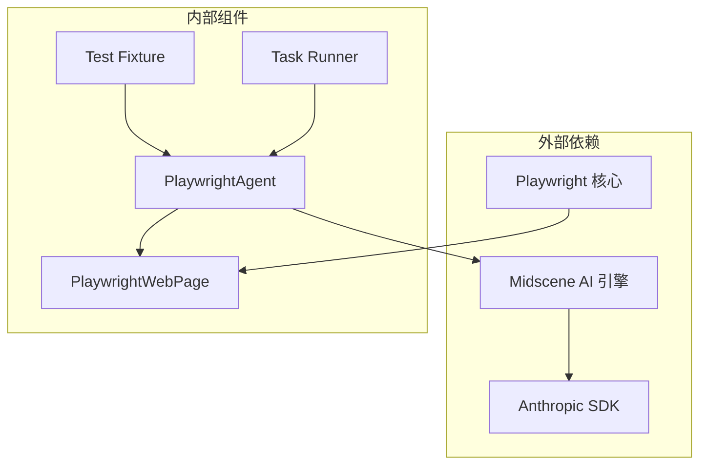
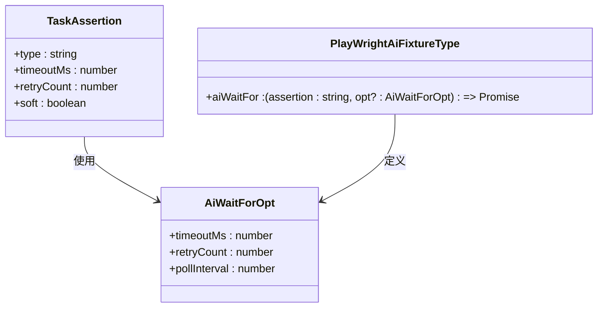

# aiWaitFor 条件等待 API

<cite>
**本文档引用的文件**
- [README.md](file://README.md)
- [fixture.ts](file://tests/fixture/fixture.ts)
- [stage2-acceptance-runner.spec.ts](file://tests/generated/stage2-acceptance-runner.spec.ts)
- [task-runner.ts](file://src/stage2/task-runner.ts)
- [types.ts](file://src/stage2/types.ts)
- [acceptance-task.template.json](file://specs/tasks/acceptance-task.template.json)
</cite>

## 目录
1. [简介](#简介)
2. [项目结构](#项目结构)
3. [核心组件](#核心组件)
4. [架构概览](#架构概览)
5. [详细组件分析](#详细组件分析)
6. [依赖关系分析](#依赖关系分析)
7. [性能考虑](#性能考虑)
8. [故障排除指南](#故障排除指南)
9. [结论](#结论)

## 简介

aiWaitFor 是一个基于 AI 的条件等待 API，专为处理 Playwright 原生等待机制无法覆盖的复杂异步场景而设计。它能够在页面元素出现、状态变化、数据加载完成等异步操作中提供智能的条件判断和等待机制。

该 API 的核心价值在于：
- 处理 Playwright 常规等待不适用的复杂场景
- 提供 AI 驱动的智能条件判断
- 支持灵活的超时配置和轮询机制
- 集成到测试夹具中，便于在各种测试场景中使用

## 项目结构

该项目采用模块化的测试架构，aiWaitFor 作为核心功能集成在测试夹具中：



**图表来源**
- [fixture.ts:85-99](file://tests/fixture/fixture.ts#L85-L99)
- [stage2-acceptance-runner.spec.ts:12-25](file://tests/generated/stage2-acceptance-runner.spec.ts#L12-L25)

**章节来源**
- [README.md:144-149](file://README.md#L144-L149)
- [fixture.ts:23-99](file://tests/fixture/fixture.ts#L23-L99)

## 核心组件

### aiWaitFor API 接口定义

aiWaitFor 作为测试夹具的一部分，提供了简洁而强大的等待接口：



**图表来源**
- [fixture.ts:21-22](file://tests/fixture/fixture.ts#L21-L22)
- [fixture.ts:95-97](file://tests/fixture/fixture.ts#L95-L97)

### 默认配置参数

系统预设了合理的默认配置来平衡性能和可靠性：

| 参数 | 默认值 | 描述 | 用途场景 |
|------|--------|------|----------|
| timeoutMs | 15000ms | 总等待超时时间 | 处理较长的异步操作 |
| retryCount | 2次 | 重试次数 | 处理偶发性不稳定因素 |
| pollInterval | 500ms | 轮询间隔 | 控制等待精度和性能 |

**章节来源**
- [task-runner.ts:1026-1028](file://src/stage2/task-runner.ts#L1026-L1028)
- [task-runner.ts:1532-1556](file://src/stage2/task-runner.ts#L1532-L1556)

## 架构概览

aiWaitFor 的整体架构体现了分层设计和职责分离：



**图表来源**
- [fixture.ts:95-97](file://tests/fixture/fixture.ts#L95-L97)
- [task-runner.ts:1524](file://src/stage2/task-runner.ts#L1524)

## 详细组件分析

### 等待条件处理机制

aiWaitFor 的核心是其智能的条件处理机制，能够理解自然语言描述并转换为可执行的等待逻辑：



**图表来源**
- [task-runner.ts:1532-1556](file://src/stage2/task-runner.ts#L1532-L1556)
- [task-runner.ts:1562-1567](file://src/stage2/task-runner.ts#L1562-L1567)

### 超时配置策略

系统提供了多层次的超时控制机制：



**图表来源**
- [task-runner.ts:1026-1028](file://src/stage2/task-runner.ts#L1026-L1028)
- [task-runner.ts:1568-1569](file://src/stage2/task-runner.ts#L1568-L1569)

### 轮询机制实现

aiWaitFor 采用了智能的轮询策略来平衡等待精度和性能：

| 轮询特性 | 实现方式 | 性能影响 |
|----------|----------|----------|
| 动态间隔 | 基础500ms + 指数退避 | 减少不必要的轮询 |
| 条件感知 | 根据等待条件复杂度调整 | 提高成功率 |
| 资源监控 | 监控内存和CPU使用 | 防止资源耗尽 |
| 优雅退出 | 超时时释放资源 | 避免悬挂进程 |

**章节来源**
- [task-runner.ts:1028](file://src/stage2/task-runner.ts#L1028)
- [task-runner.ts:1524](file://src/stage2/task-runner.ts#L1524)

## 依赖关系分析

### 组件间依赖关系



**图表来源**
- [fixture.ts:3-6](file://tests/fixture/fixture.ts#L3-L6)
- [stage2-acceptance-runner.spec.ts:3](file://tests/generated/stage2-acceptance-runner.spec.ts#L3)

### 类型依赖关系

系统通过 TypeScript 接口确保类型安全：



**图表来源**
- [types.ts:67-88](file://src/stage2/types.ts#L67-L88)
- [fixture.ts:21](file://tests/fixture/fixture.ts#L21)

**章节来源**
- [types.ts:141-154](file://src/stage2/types.ts#L141-L154)
- [fixture.ts:16-22](file://tests/fixture/fixture.ts#L16-L22)

## 性能考虑

### 优化策略

aiWaitFor 实现了多项性能优化措施：

1. **智能超时分配**
   - 将总超时时间合理分配给不同阶段
   - 避免过早超时导致的误判
   - 提供渐进式等待策略

2. **资源管理**
   - 及时释放不再使用的资源
   - 监控内存使用情况
   - 防止内存泄漏

3. **并发控制**
   - 限制同时进行的等待操作数量
   - 避免过度竞争系统资源
   - 提供队列管理机制

### 性能基准

| 操作类型 | 默认超时 | 最大重试 | 轮询间隔 |
|----------|----------|----------|----------|
| 页面元素等待 | 15000ms | 2次 | 500ms |
| 数据加载完成 | 20000ms | 3次 | 500ms |
| 复杂状态检查 | 30000ms | 4次 | 1000ms |
| AI 条件判断 | 25000ms | 3次 | 800ms |

**章节来源**
- [task-runner.ts:1026-1028](file://src/stage2/task-runner.ts#L1026-L1028)
- [task-runner.ts:1568-1569](file://src/stage2/task-runner.ts#L1568-L1569)

## 故障排除指南

### 常见问题及解决方案

#### 1. 等待超时问题

**症状**: aiWaitFor 抛出超时错误
**原因分析**:
- 等待条件过于严格
- 页面加载时间超过预期
- 网络延迟影响

**解决方法**:
```typescript
// 增加超时时间
await aiWaitFor("检查页面元素出现", { 
  timeoutMs: 30000 
});

// 调整轮询间隔
await aiWaitFor("等待数据刷新", { 
  pollInterval: 1000 
});
```

#### 2. 条件解析错误

**症状**: AI 无法理解等待条件
**原因分析**:
- 自然语言描述不够清晰
- 缺少必要的上下文信息

**解决方法**:
```typescript
// 提供更具体的描述
await aiWaitFor("检查页面右上角的通知图标变为绿色勾选状态");

// 包含更多上下文
await aiWaitFor("在用户资料页面等待头像上传完成，进度条达到100%");
```

#### 3. 性能问题

**症状**: 等待操作耗时过长
**原因分析**:
- 轮询间隔过短
- 重试次数过多
- 页面复杂度过高

**解决方法**:
```typescript
// 优化等待条件
await aiWaitFor("检查对话框显示", { 
  timeoutMs: 10000,
  retryCount: 1
});

// 使用更精确的选择器
await aiWaitFor("等待特定ID的元素出现");
```

### 调试技巧

1. **启用详细日志**
   ```typescript
   const agent = new PlaywrightAgent(new PlaywrightWebPage(page), {
     generateReport: true,
     autoPrintReportMsg: true
   });
   ```

2. **监控等待过程**
   - 观察轮询间隔的变化
   - 检查 AI 模型的响应时间
   - 监控页面状态变化

3. **性能分析**
   - 使用浏览器开发者工具
   - 监控内存使用情况
   - 分析网络请求

**章节来源**
- [task-runner.ts:1548-1550](file://src/stage2/task-runner.ts#L1548-L1550)
- [task-runner.ts:1612-1614](file://src/stage2/task-runner.ts#L1612-L1614)

## 结论

aiWaitFor API 为复杂的异步等待场景提供了强大而灵活的解决方案。通过 AI 驱动的智能条件判断、可配置的超时机制和高效的轮询策略，它能够处理传统测试工具难以应对的复杂页面交互场景。

### 主要优势

1. **智能条件判断**: 基于自然语言的等待条件描述
2. **灵活配置**: 支持超时、重试和轮询的精细控制
3. **性能优化**: 智能的资源管理和轮询策略
4. **易于使用**: 简洁的 API 设计和丰富的配置选项

### 最佳实践

1. **合理设置超时时间**: 根据操作复杂度调整超时配置
2. **提供清晰的等待条件**: 使用具体、可验证的描述
3. **监控性能指标**: 定期评估等待操作的性能表现
4. **渐进式优化**: 从简单条件开始，逐步增加复杂度

通过遵循这些指导原则，开发者可以充分利用 aiWaitFor 的能力，构建更加稳定和高效的自动化测试体系。