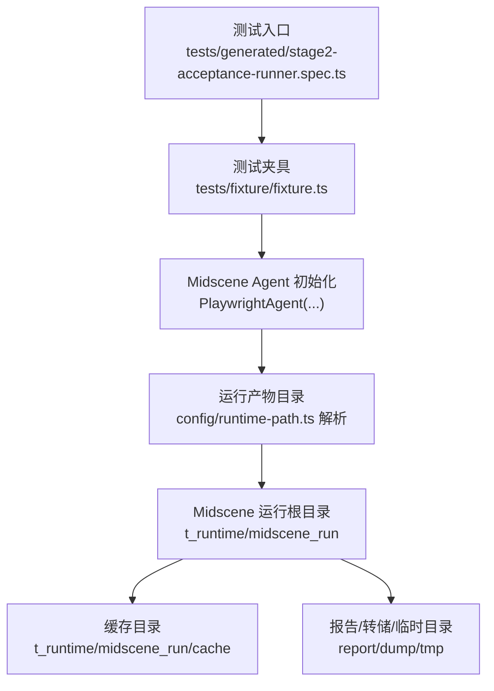
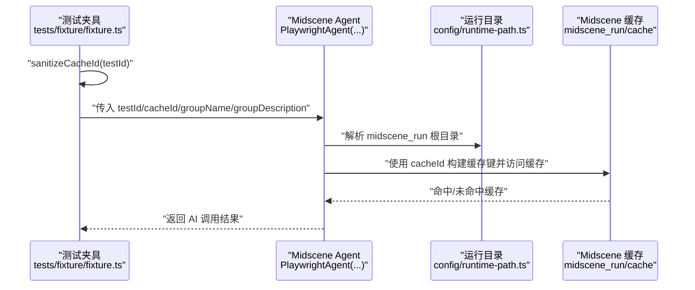
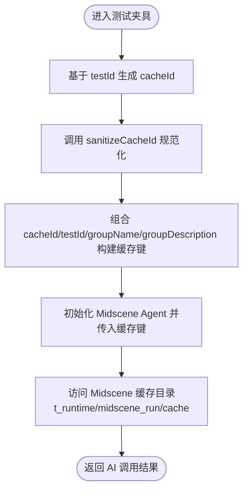
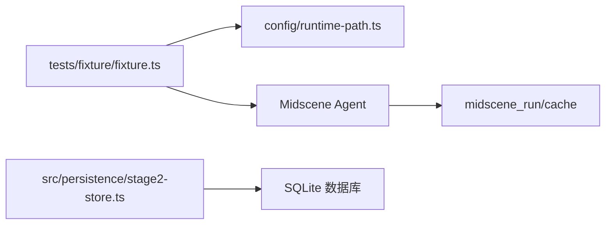

# AI 缓存策略

<cite>
**本文引用的文件**
- [README.md](file://README.md)
- [AGENTS.md](file://AGENTS.md)
- [package.json](file://package.json)
- [config/runtime-path.ts](file://config/runtime-path.ts)
- [tests/fixture/fixture.ts](file://tests/fixture/fixture.ts)
- [.tasks/AI自主代理验收系统开发改造方案_2026-03-11.md](file://.tasks/AI自主代理验收系统开发改造方案_2026-03-11.md)
- [src/persistence/stage2-store.ts](file://src/persistence/stage2-store.ts)
- [src/persistence/types.ts](file://src/persistence/types.ts)
- [src/stage2/task-runner.ts](file://src/stage2/task-runner.ts)
- [tests/generated/stage2-acceptance-runner.spec.ts](file://tests/generated/stage2-acceptance-runner.spec.ts)
</cite>

## 目录
1. [简介](#简介)
2. [项目结构](#项目结构)
3. [核心组件](#核心组件)
4. [架构总览](#架构总览)
5. [详细组件分析](#详细组件分析)
6. [依赖分析](#依赖分析)
7. [性能考量](#性能考量)
8. [故障排查指南](#故障排查指南)
9. [结论](#结论)
10. [附录](#附录)

## 简介
本文件围绕项目中的 AI 能力缓存机制展开，重点解释缓存 ID 的生成规则、缓存键的构建方式、缓存失效策略，以及 sanitizeCacheId 函数的安全处理机制。同时，结合运行产物目录与 Midscene 缓存目录，说明缓存对性能的影响与优化效果，并给出缓存配置的最佳实践、不同测试场景下的使用建议、调试与故障排查方法。

## 项目结构
该项目基于 Playwright 与 Midscene.js 构建 AI 自动化测试体系，运行产物统一收敛至 t_runtime/ 目录，其中 Midscene 的运行日志、缓存、报告等位于 midscene_run 子目录。缓存策略与安全处理集中在测试夹具中，通过统一的缓存 ID 规范化，确保缓存键稳定、安全、可复用。

图表来源
- [tests/generated/stage2-acceptance-runner.spec.ts:12-37](file://tests/generated/stage2-acceptance-runner.spec.ts#L12-L37)
- [tests/fixture/fixture.ts:23-98](file://tests/fixture/fixture.ts#L23-L98)
- [config/runtime-path.ts:28-31](file://config/runtime-path.ts#L28-L31)
- [README.md:76-95](file://README.md#L76-L95)

章节来源
- [README.md:76-95](file://README.md#L76-L95)
- [config/runtime-path.ts:13-31](file://config/runtime-path.ts#L13-L31)
- [tests/generated/stage2-acceptance-runner.spec.ts:12-37](file://tests/generated/stage2-acceptance-runner.spec.ts#L12-L37)

## 核心组件
- 测试夹具中的缓存 ID 规范化函数 sanitizeCacheId，负责将测试标识转换为安全稳定的缓存键。
- Midscene Agent 在初始化时使用规范化后的 cacheId 与 testId，确保同一测试的 AI 调用共享缓存。
- 运行产物目录通过环境变量集中管理，Midscene 缓存目录位于 midscene_run/cache。
- SQLite 持久化层负责将执行结果、快照、附件等结构化数据写入本地数据库，与缓存形成互补。

章节来源
- [tests/fixture/fixture.ts:12-14](file://tests/fixture/fixture.ts#L12-L14)
- [tests/fixture/fixture.ts:23-98](file://tests/fixture/fixture.ts#L23-L98)
- [README.md:76-95](file://README.md#L76-L95)
- [src/persistence/stage2-store.ts:358-395](file://src/persistence/stage2-store.ts#L358-L395)

## 架构总览
AI 缓存策略贯穿“测试夹具 -> Midscene Agent -> 运行产物目录”的链路。夹具负责生成安全的缓存 ID，Agent 使用该 ID 构建缓存键，Midscene 在其运行根目录下维护缓存文件，避免重复调用带来的资源浪费与响应延迟。

图表来源
- [tests/fixture/fixture.ts:23-98](file://tests/fixture/fixture.ts#L23-L98)
- [config/runtime-path.ts:28-31](file://config/runtime-path.ts#L28-L31)
- [README.md:76-95](file://README.md#L76-L95)

## 详细组件分析

### 缓存 ID 生成与安全处理
- 生成规则
  - 夹具在每个测试用例开始时，基于 testId 生成安全的 cacheId，随后将该 cacheId 传递给 Midscene Agent。
  - 生成的 cacheId 会作为 Agent 的 testId 与 cacheId 参数的一部分，用于后续缓存键构建。
- 安全处理机制（sanitizeCacheId）
  - 该函数通过正则表达式将非法字符替换为下划线，覆盖 Windows 文件系统不安全字符集合，防止缓存键冲突与路径注入风险。
  - 替换范围包括尖括号、引号、斜杠、反斜杠、竖线、问号、星号以及控制字符（0x00-0x1f）。
- 缓存键构建方式
  - Agent 初始化时使用规范化后的 cacheId 与 groupName/groupDescription 组合，形成稳定的缓存键，确保同一测试场景下的重复调用命中缓存。
- 缓存失效策略
  - 项目未显式暴露缓存过期策略配置；默认行为遵循 Midscene 缓存机制。若需调整，可在 Midscene 官方文档与环境变量范围内进行配置（例如缓存目录、调试模式等）。

图表来源
- [tests/fixture/fixture.ts:23-98](file://tests/fixture/fixture.ts#L23-L98)
- [README.md:76-95](file://README.md#L76-L95)

章节来源
- [tests/fixture/fixture.ts:12-14](file://tests/fixture/fixture.ts#L12-L14)
- [tests/fixture/fixture.ts:23-98](file://tests/fixture/fixture.ts#L23-L98)
- [README.md:76-95](file://README.md#L76-L95)

### Midscene Agent 与缓存目录
- 日志与缓存目录
  - 项目通过运行路径配置模块解析 midscene_run 根目录，并在该目录下生成 report、dump、tmp、cache 等子目录。
  - 缓存目录位于 midscene_run/cache，用于存放 AI 调用的中间结果与缓存数据。
- 目录统一管理
  - 所有运行产物目录通过环境变量集中管理，避免硬编码路径，提升可移植性与一致性。

章节来源
- [config/runtime-path.ts:28-31](file://config/runtime-path.ts#L28-L31)
- [README.md:76-95](file://README.md#L76-L95)

### 缓存对性能的影响与优化
- 重复调用避免
  - 通过统一的 cacheId 与缓存键，同一测试场景下的重复 AI 查询/断言可直接命中缓存，避免重复请求与计算。
- 响应时间改善
  - 命中缓存显著降低网络与模型推理延迟，提升整体执行效率。
- 与持久化互补
  - SQLite 持久化层负责结构化数据与附件落盘，缓存侧重于中间结果与重复调用加速，二者协同提升稳定性与性能。

章节来源
- [src/persistence/stage2-store.ts:358-395](file://src/persistence/stage2-store.ts#L358-L395)
- [README.md:76-95](file://README.md#L76-L95)

### 缓存配置最佳实践
- 缓存目录与调试
  - 通过环境变量统一管理 midscene_run 根目录，确保缓存、报告、转储等目录清晰分离。
  - 如需启用 Midscene 调试模式或查看缓存详情，可在 Midscene 官方文档与环境变量范围内进行配置。
- 缓存大小与过期时间
  - 项目未提供显式的缓存大小限制与过期时间配置项；建议结合 Midscene 官方能力与运行环境进行评估与配置。
- 内存管理策略
  - 在长时间批量执行或高并发场景下，建议定期清理 midscene_run/cache 目录，避免磁盘占用过高。
- 测试场景适配
  - 对于需要严格隔离的测试场景，可考虑为不同测试组分配独立的 groupName 或 cacheId 前缀，避免跨场景污染。
  - 对于易变页面或动态内容，谨慎依赖缓存，必要时在测试夹具中增加缓存失效逻辑或禁用缓存的标记。

章节来源
- [README.md:76-95](file://README.md#L76-L95)
- [.tasks/AI自主代理验收系统开发改造方案_2026-03-11.md:49-84](file://.tasks/AI自主代理验收系统开发改造方案_2026-03-11.md#L49-L84)

### 测试入口与夹具集成
- 测试入口通过统一夹具注入 ai、aiQuery、aiAssert、aiWaitFor 等 AI 能力，并在夹具中完成缓存 ID 的安全处理与 Agent 初始化。
- 该设计保证了缓存策略在所有测试用例中的一致性与可复用性。

章节来源
- [tests/generated/stage2-acceptance-runner.spec.ts:12-37](file://tests/generated/stage2-acceptance-runner.spec.ts#L12-L37)
- [tests/fixture/fixture.ts:23-98](file://tests/fixture/fixture.ts#L23-L98)

## 依赖分析
- 测试夹具依赖运行路径配置模块解析 midscene_run 根目录，进而影响缓存目录的落点。
- Midscene Agent 依赖夹具提供的 cacheId 与 testId，用于构建缓存键。
- SQLite 持久化层与缓存策略互补，分别承担结构化数据与中间结果的存储职责。

图表来源
- [tests/fixture/fixture.ts:23-98](file://tests/fixture/fixture.ts#L23-L98)
- [config/runtime-path.ts:28-31](file://config/runtime-path.ts#L28-L31)
- [src/persistence/stage2-store.ts:358-395](file://src/persistence/stage2-store.ts#L358-L395)

章节来源
- [tests/fixture/fixture.ts:23-98](file://tests/fixture/fixture.ts#L23-L98)
- [config/runtime-path.ts:28-31](file://config/runtime-path.ts#L28-L31)
- [src/persistence/stage2-store.ts:358-395](file://src/persistence/stage2-store.ts#L358-L395)

## 性能考量
- 缓存命中率
  - 通过统一的 cacheId 与缓存键，可显著提升重复查询/断言的命中率，降低模型调用频率。
- 响应时间
  - 命中缓存可减少网络往返与模型推理时间，整体响应时间明显改善。
- 磁盘与内存
  - 需要平衡缓存大小与磁盘空间，避免 midscene_run/cache 目录膨胀；在高并发场景下建议定期清理或限制缓存生命周期。
- 与持久化的配合
  - SQLite 持久化层负责最终结果与附件的落盘，缓存侧重中间加速，二者共同提升整体性能与可靠性。

## 故障排查指南
- 缓存冲突与路径异常
  - 若出现缓存冲突或路径异常，检查 sanitizeCacheId 是否正确替换非法字符；确认 testId 与 groupName 是否包含特殊字符。
- 缓存未命中
  - 检查 cacheId 是否一致；确认 Midscene Agent 初始化时传入的 cacheId/testId 是否与预期一致。
- 运行目录与缓存目录
  - 确认 midscene_run 根目录解析正确；检查 t_runtime/midscene_run/cache 是否存在权限与磁盘空间问题。
- 调试与日志
  - 参考 AGENTS.md 中的日志规范，确保运行日志、错误日志与缓存日志完整输出，便于定位问题。
- 持久化数据核对
  - 若缓存命中但结果异常，可通过 SQLite 持久化层核对结构化快照与最终结果，辅助判断缓存是否被污染。

章节来源
- [tests/fixture/fixture.ts:12-14](file://tests/fixture/fixture.ts#L12-L14)
- [config/runtime-path.ts:28-31](file://config/runtime-path.ts#L28-L31)
- [AGENTS.md:33-38](file://AGENTS.md#L33-L38)
- [src/persistence/stage2-store.ts:358-395](file://src/persistence/stage2-store.ts#L358-L395)

## 结论
本项目通过测试夹具中的 sanitizeCacheId 与 Midscene Agent 的缓存键构建，实现了稳定、安全、可复用的 AI 能力缓存机制。结合统一的运行产物目录与 SQLite 持久化，缓存策略有效降低了重复调用成本，提升了响应速度与整体执行效率。建议在实际使用中遵循最佳实践，合理配置缓存目录与调试选项，并根据测试场景进行针对性优化与清理。

## 附录
- 运行产物目录与 Midscene 缓存目录
  - 运行产物统一收敛至 t_runtime/，Midscene 缓存位于 t_runtime/midscene_run/cache。
- 环境变量与脚本
  - 通过 .env 与 package.json 中的脚本统一管理运行参数与执行入口。

章节来源
- [README.md:76-95](file://README.md#L76-L95)
- [package.json:6-10](file://package.json#L6-L10)