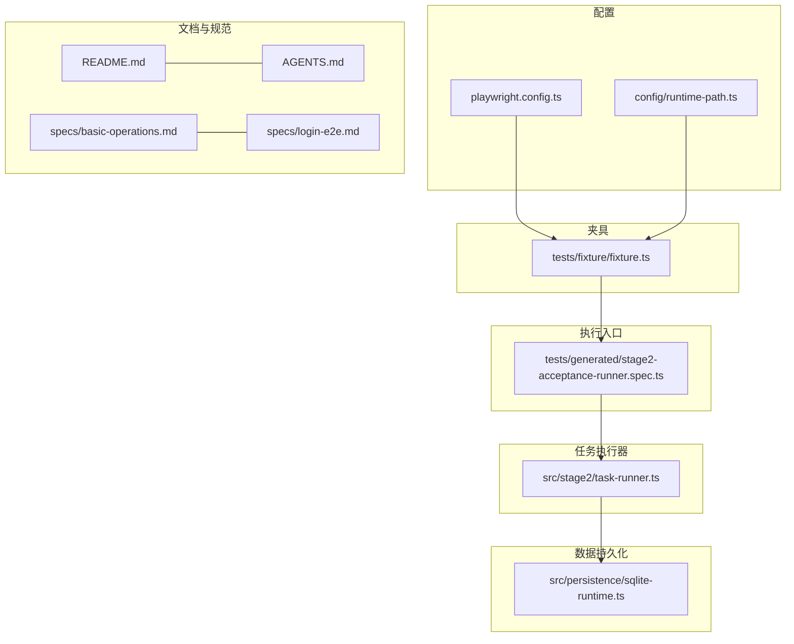
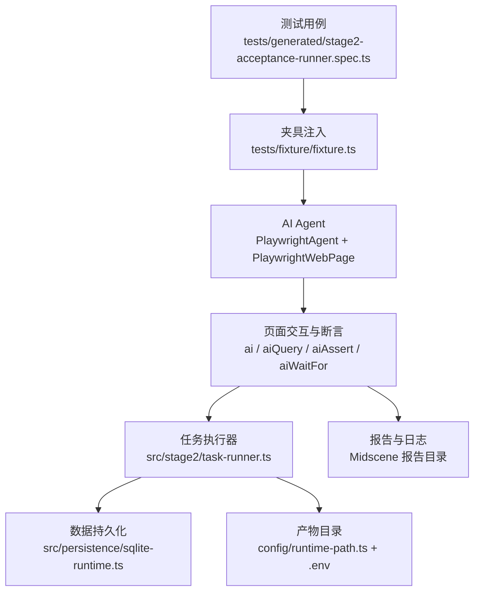
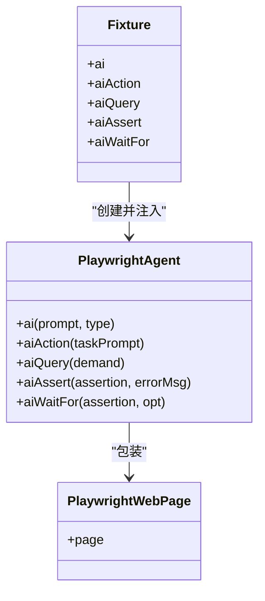
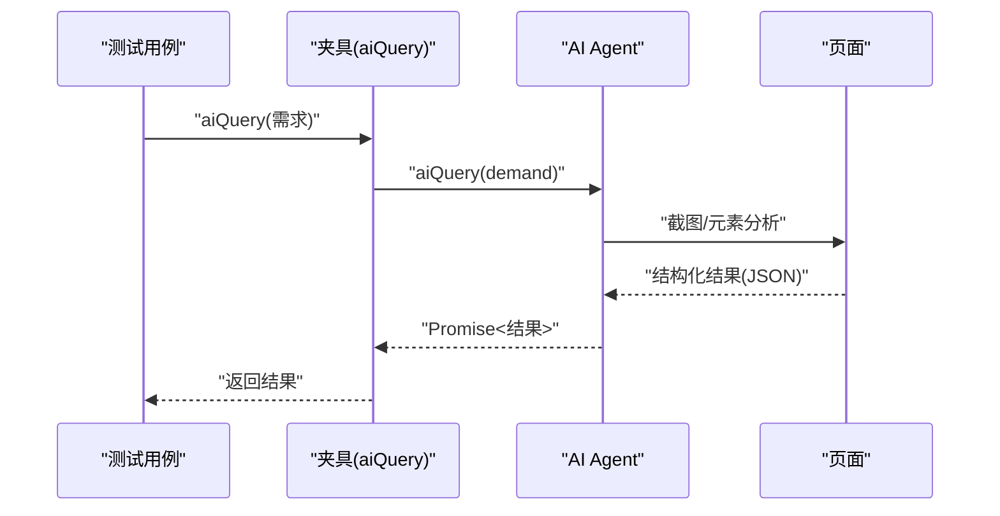
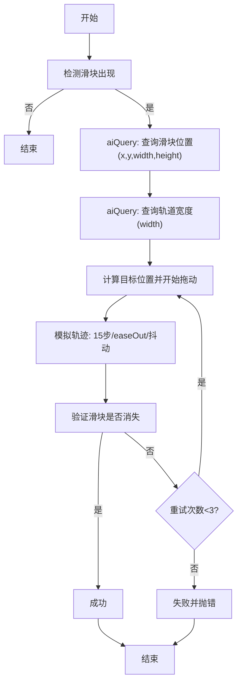
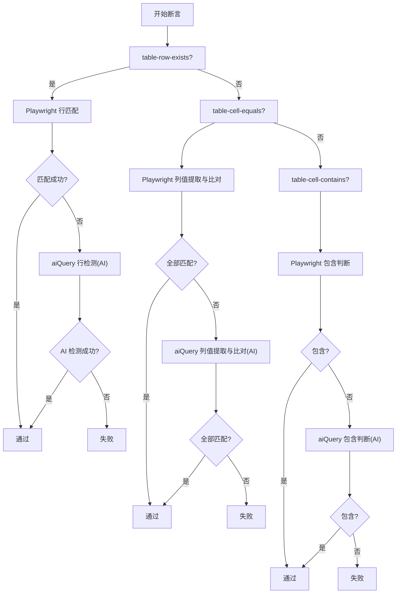
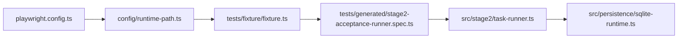

# AI 能力集成

<cite>
**本文引用的文件**
- [README.md](file://README.md)
- [AGENTS.md](file://AGENTS.md)
- [playwright.config.ts](file://playwright.config.ts)
- [config/runtime-path.ts](file://config/runtime-path.ts)
- [tests/fixture/fixture.ts](file://tests/fixture/fixture.ts)
- [tests/generated/stage2-acceptance-runner.spec.ts](file://tests/generated/stage2-acceptance-runner.spec.ts)
- [src/stage2/task-runner.ts](file://src/stage2/task-runner.ts)
- [src/persistence/sqlite-runtime.ts](file://src/persistence/sqlite-runtime.ts)
- [specs/basic-operations.md](file://specs/basic-operations.md)
- [specs/login-e2e.md](file://specs/login-e2e.md)
</cite>

## 目录
1. [简介](#简介)
2. [项目结构](#项目结构)
3. [核心组件](#核心组件)
4. [架构总览](#架构总览)
5. [组件详解](#组件详解)
6. [依赖关系分析](#依赖关系分析)
7. [性能与缓存策略](#性能与缓存策略)
8. [故障排查指南](#故障排查指南)
9. [结论](#结论)
10. [附录](#附录)

## 简介
本项目基于 Playwright 与 Midscene.js 构建，提供 AI 能力集成的自动化测试方案。通过统一的夹具（fixture）暴露 ai、aiQuery、aiAssert、aiWaitFor 等 AI 操作 API，结合任务驱动的第二段执行器，实现从 JSON 任务到页面交互与断言的闭环。项目强调“硬检测优先、AI 作为兜底”的原则，既保证稳定性，又提升复杂场景的可维护性。

## 项目结构
- 配置层：通过 dotenv 与 runtime-path 模块集中管理运行时目录与环境变量，确保所有产物目录统一收敛到 t_runtime/。
- 夹具层：tests/fixture/fixture.ts 注入 AI Agent，封装 ai、aiAction、aiQuery、aiAssert、aiWaitFor。
- 执行层：tests/generated/stage2-acceptance-runner.spec.ts 作为 JSON 任务入口，调度任务执行器。
- 业务层：src/stage2/task-runner.ts 实现滑块验证码自动处理、表格断言降级策略、重试与超时控制。
- 数据持久化：src/persistence/sqlite-runtime.ts 提供 SQLite 初始化、迁移与相对路径转换。
- 文档与规范：README.md、AGENTS.md、specs/*.md 提供使用说明、规范与测试场景。

图表来源
- [playwright.config.ts:1-95](file://playwright.config.ts#L1-L95)
- [config/runtime-path.ts:1-41](file://config/runtime-path.ts#L1-L41)
- [tests/fixture/fixture.ts:1-100](file://tests/fixture/fixture.ts#L1-L100)
- [tests/generated/stage2-acceptance-runner.spec.ts:1-39](file://tests/generated/stage2-acceptance-runner.spec.ts#L1-L39)
- [src/stage2/task-runner.ts:55-686](file://src/stage2/task-runner.ts#L55-L686)
- [src/persistence/sqlite-runtime.ts:73-116](file://src/persistence/sqlite-runtime.ts#L73-L116)
- [README.md:1-223](file://README.md#L1-L223)
- [AGENTS.md:1-61](file://AGENTS.md#L1-L61)
- [specs/basic-operations.md:1-34](file://specs/basic-operations.md#L1-L34)
- [specs/login-e2e.md:1-152](file://specs/login-e2e.md#L1-L152)

章节来源
- [README.md:10-96](file://README.md#L10-L96)
- [playwright.config.ts:1-95](file://playwright.config.ts#L1-L95)
- [config/runtime-path.ts:1-41](file://config/runtime-path.ts#L1-L41)

## 核心组件
- Midscene AI Agent 与夹具注入
  - 通过 tests/fixture/fixture.ts 注入 ai、aiAction、aiQuery、aiAssert、aiWaitFor，每个 fixture 基于 PlaywrightAgent + PlaywrightWebPage 创建，统一设置日志目录、分组信息与缓存标识。
- 任务驱动执行器
  - tests/generated/stage2-acceptance-runner.spec.ts 作为入口，接收 ai、aiQuery、aiAssert、aiWaitFor 并交由 runTaskScenario 执行。
- 滑块验证码自动处理
  - src/stage2/task-runner.ts 提供滑块检测、AI 查询位置与轨道宽度、模拟真人拖动轨迹、重试与最终验证。
- 表格断言降级策略
  - 对 table-row-exists、table-cell-equals、table-cell-contains 等断言，优先使用 Playwright 硬检测，失败后降级到 aiQuery + AI 断言，减少幻觉风险。
- 数据持久化
  - src/persistence/sqlite-runtime.ts 提供数据库初始化、迁移、校验与相对路径转换，配合 README 的表结构说明落地运行产物。

章节来源
- [tests/fixture/fixture.ts:23-99](file://tests/fixture/fixture.ts#L23-L99)
- [tests/generated/stage2-acceptance-runner.spec.ts:9-38](file://tests/generated/stage2-acceptance-runner.spec.ts#L9-L38)
- [src/stage2/task-runner.ts:55-686](file://src/stage2/task-runner.ts#L55-L686)
- [src/stage2/task-runner.ts:1184-1871](file://src/stage2/task-runner.ts#L1184-L1871)
- [src/persistence/sqlite-runtime.ts:73-116](file://src/persistence/sqlite-runtime.ts#L73-L116)
- [README.md:97-131](file://README.md#L97-L131)

## 架构总览
AI 能力集成围绕“夹具注入 + 任务执行 + 断言降级 + 数据持久化”展开。夹具负责将 Midscene 的 AI 能力以统一 API 暴露给测试；执行器负责把 JSON 任务转化为页面操作与断言；断言策略优先硬检测，AI 作为兜底；持久化负责将运行记录、步骤、快照与附件写入数据库与文件系统。

图表来源
- [tests/generated/stage2-acceptance-runner.spec.ts:12-37](file://tests/generated/stage2-acceptance-runner.spec.ts#L12-L37)
- [tests/fixture/fixture.ts:23-99](file://tests/fixture/fixture.ts#L23-L99)
- [src/stage2/task-runner.ts:55-686](file://src/stage2/task-runner.ts#L55-L686)
- [src/persistence/sqlite-runtime.ts:73-116](file://src/persistence/sqlite-runtime.ts#L73-L116)
- [config/runtime-path.ts:18-40](file://config/runtime-path.ts#L18-L40)
- [README.md:76-96](file://README.md#L76-L96)

## 组件详解

### 夹具与 AI 代理模式
- 代理模式配置
  - 每个测试用例注入 ai、aiAction、aiQuery、aiAssert、aiWaitFor，内部以 PlaywrightAgent 包装 PlaywrightWebPage，传入 testId、cacheId、groupName、groupDescription、generateReport 等参数，确保日志与报告目录可控。
  - ai 与 aiAction 通过可选 type 参数区分“动作型”与“查询型”提示词风格。
- 缓存与报告
  - 通过 setLogDir 与 resolveRuntimePath 将 Midscene 日志与报告写入统一目录；cacheId 基于 testId 清洗，避免非法字符影响缓存与产物命名。

图表来源
- [tests/fixture/fixture.ts:23-99](file://tests/fixture/fixture.ts#L23-L99)

章节来源
- [tests/fixture/fixture.ts:10-14](file://tests/fixture/fixture.ts#L10-L14)
- [tests/fixture/fixture.ts:23-99](file://tests/fixture/fixture.ts#L23-L99)
- [README.md:139-153](file://README.md#L139-L153)

### aiQuery：数据提取能力
- 使用场景
  - 复杂页面元素定位：如滑块验证码位置与轨道宽度查询。
  - 动态内容提取：如表格行匹配、单元格值提取与比对。
- 实现原理
  - 通过 aiQuery 发送结构化需求给 AI，AI 返回 JSON 结果（如 found、x/y/width/height、columnValues 等），执行器据此进行后续操作或断言。
- 断言降级策略
  - 对 table-row-exists、table-cell-equals、table-cell-contains 等断言，优先使用 Playwright 硬检测；失败后降级为 aiQuery + AI 断言，减少幻觉风险。

图表来源
- [tests/fixture/fixture.ts:57-69](file://tests/fixture/fixture.ts#L57-L69)
- [src/stage2/task-runner.ts:510-559](file://src/stage2/task-runner.ts#L510-L559)
- [src/stage2/task-runner.ts:1643-1668](file://src/stage2/task-runner.ts#L1643-L1668)
- [src/stage2/task-runner.ts:1670-1788](file://src/stage2/task-runner.ts#L1670-L1788)
- [src/stage2/task-runner.ts:1790-1871](file://src/stage2/task-runner.ts#L1790-L1871)

章节来源
- [src/stage2/task-runner.ts:510-559](file://src/stage2/task-runner.ts#L510-L559)
- [src/stage2/task-runner.ts:1643-1668](file://src/stage2/task-runner.ts#L1643-L1668)
- [src/stage2/task-runner.ts:1670-1788](file://src/stage2/task-runner.ts#L1670-L1788)
- [src/stage2/task-runner.ts:1790-1871](file://src/stage2/task-runner.ts#L1790-L1871)

### aiAssert：断言验证机制
- 使用场景
  - 作为补充性可读断言，避免对关键结果过度依赖 AI 幻觉。
- 实现原理
  - aiAssert 接收断言字符串与可选错误信息，交由 AI Agent 执行断言判断；通常与 aiQuery 结合，先提取再断言，提高准确性。
- 最佳实践
  - 关键断言优先硬检测；AI 断言用于辅助与兜底。

章节来源
- [tests/fixture/fixture.ts:71-84](file://tests/fixture/fixture.ts#L71-L84)
- [README.md:148-152](file://README.md#L148-L152)

### aiWaitFor：条件等待功能
- 使用场景
  - 当 Playwright 常规等待不适用时，使用 aiWaitFor 等待特定条件满足（如动态内容出现、状态变化）。
- 实现原理
  - aiWaitFor 接收断言与可选参数，内部由 AI Agent 循环检测直到条件满足或超时。
- 注意事项
  - 仅在必要时使用，避免过度依赖 AI 等待导致性能与稳定性问题。

章节来源
- [tests/fixture/fixture.ts:85-99](file://tests/fixture/fixture.ts#L85-L99)
- [README.md:142-144](file://README.md#L142-L144)

### 滑块验证码自动处理（AI + Playwright）
- 流程概览
  - 检测滑块出现 → AI 查询滑块位置与轨道宽度 → Playwright 模拟真人拖动轨迹（15步、easeOut、随机抖动）→ 验证滑块是否消失 → 失败重试最多 3 次。
- 关键点
  - 使用 aiQuery 两次分别查询滑块中心点与轨道宽度，确保拖动距离准确。
  - 拖动轨迹模拟真实人类行为，带随机抖动与缓动，提升成功率。
  - 每次失败后等待并重试，避免一次性失败导致流程中断。

图表来源
- [src/stage2/task-runner.ts:483-501](file://src/stage2/task-runner.ts#L483-L501)
- [src/stage2/task-runner.ts:510-559](file://src/stage2/task-runner.ts#L510-L559)
- [src/stage2/task-runner.ts:561-648](file://src/stage2/task-runner.ts#L561-L648)

章节来源
- [README.md:64-75](file://README.md#L64-L75)
- [src/stage2/task-runner.ts:561-648](file://src/stage2/task-runner.ts#L561-L648)

### 表格断言降级策略（AI 作为兜底）
- 策略说明
  - table-row-exists：优先 Playwright 行匹配，失败则使用 aiQuery + AI 检测。
  - table-cell-equals：优先 Playwright 列值提取与比对，失败则使用 aiQuery + AI 比对。
  - table-cell-contains：优先 Playwright 包含判断，失败则使用 aiQuery + AI 包含判断。
- 优势
  - 降低 AI 幻觉风险，提升关键断言的稳定性；仅在必要时启用 AI，兼顾性能与可靠性。

图表来源
- [src/stage2/task-runner.ts:1643-1668](file://src/stage2/task-runner.ts#L1643-L1668)
- [src/stage2/task-runner.ts:1670-1788](file://src/stage2/task-runner.ts#L1670-L1788)
- [src/stage2/task-runner.ts:1790-1871](file://src/stage2/task-runner.ts#L1790-L1871)

章节来源
- [README.md:146-152](file://README.md#L146-L152)
- [src/stage2/task-runner.ts:1643-1668](file://src/stage2/task-runner.ts#L1643-L1668)
- [src/stage2/task-runner.ts:1670-1788](file://src/stage2/task-runner.ts#L1670-L1788)
- [src/stage2/task-runner.ts:1790-1871](file://src/stage2/task-runner.ts#L1790-L1871)

### 数据持久化与产物目录
- 目录规范
  - 通过 .env 与 runtime-path.ts 统一管理运行产物目录，包括 Playwright 输出、HTML 报告、Midscene 运行日志、验收结果、数据库文件等。
- 数据库结构
  - README 提供 ai_task、ai_task_version、ai_run、ai_run_step、ai_snapshot、ai_artifact、ai_audit_log 等表结构说明；sqlite-runtime.ts 提供初始化、迁移与校验。
- 最佳实践
  - 文件系统保留截图、报告、result.json 等原始产物；数据库仅存结构化信息与文件路径，避免大文件二进制存储。

章节来源
- [README.md:76-131](file://README.md#L76-L131)
- [config/runtime-path.ts:18-40](file://config/runtime-path.ts#L18-L40)
- [src/persistence/sqlite-runtime.ts:73-116](file://src/persistence/sqlite-runtime.ts#L73-L116)

## 依赖关系分析
- 夹具依赖 Midscene Web 与 Playwright，统一注入 AI 能力。
- 执行器依赖夹具提供的 aiQuery/aiAssert/aiWaitFor，并结合任务 JSON 与 UI Profile 实现跨平台通用断言。
- 配置层通过 dotenv 与 runtime-path 控制运行产物目录，playwright.config.ts 集成 Midscene 报告插件。

图表来源
- [playwright.config.ts:1-95](file://playwright.config.ts#L1-L95)
- [config/runtime-path.ts:1-41](file://config/runtime-path.ts#L1-L41)
- [tests/fixture/fixture.ts:1-100](file://tests/fixture/fixture.ts#L1-L100)
- [tests/generated/stage2-acceptance-runner.spec.ts:1-39](file://tests/generated/stage2-acceptance-runner.spec.ts#L1-L39)
- [src/stage2/task-runner.ts:55-686](file://src/stage2/task-runner.ts#L55-L686)
- [src/persistence/sqlite-runtime.ts:73-116](file://src/persistence/sqlite-runtime.ts#L73-L116)

章节来源
- [playwright.config.ts:36-40](file://playwright.config.ts#L36-L40)
- [config/runtime-path.ts:18-40](file://config/runtime-path.ts#L18-L40)

## 性能与缓存策略
- 缓存与报告
  - 夹具为每个测试用例生成唯一的 cacheId，避免非法字符影响缓存与产物命名；Midscene 日志目录通过 setLogDir 与 resolveRuntimePath 统一管理。
- 频率控制与结果复用
  - 建议将长流程拆分为多个步骤（aiTap、aiInput、aiScroll、aiWaitFor、aiQuery、aiAssert），减少单次长 Prompt 的失败成本与重试范围。
  - 对重复的查询与断言，优先使用 Playwright 硬检测，AI 仅作为兜底，降低模型调用频率。
- 模型调用优化
  - 合理设置重试次数与超时，避免无限等待；对表格断言优先硬检测，失败再降级到 AI，平衡性能与稳定性。

章节来源
- [tests/fixture/fixture.ts:10-14](file://tests/fixture/fixture.ts#L10-L14)
- [README.md:146-152](file://README.md#L146-L152)
- [.tasks/AI自主代理验收系统开发改造方案_2026-03-11.md:60-84](file://.tasks/AI自主代理验收系统开发改造方案_2026-03-11.md#L60-L84)

## 故障排查指南
- 滑块验证码自动处理失败
  - 现象：拖动后滑块仍存在或多次尝试失败。
  - 排查：检查页面截图确认滑块样式；调整为 manual 模式人工处理；核对检测选择器与轨道宽度查询；适当增加等待时间。
- 表格断言不稳定
  - 现象：table-cell-equals/table-cell-contains 偶尔失败。
  - 排查：确认 Playwright 硬检测失败原因（列缺失、匹配模式不一致）；检查期望值映射与 matchMode；必要时放宽 soft 断言。
- 产物目录与报告路径
  - 现象：报告与截图不在预期目录。
  - 排查：核对 .env 中 RUNTIME_DIR_PREFIX、PLAYWRIGHT_OUTPUT_DIR、PLAYWRIGHT_HTML_REPORT_DIR、MIDSCENE_RUN_DIR；确认 runtime-path.ts 解析逻辑。

章节来源
- [README.md:64-75](file://README.md#L64-L75)
- [README.md:76-96](file://README.md#L76-L96)
- [src/stage2/task-runner.ts:650-686](file://src/stage2/task-runner.ts#L650-L686)
- [README.md:146-152](file://README.md#L146-L152)

## 结论
本项目通过夹具统一注入 Midscene AI 能力，结合任务驱动的执行器与断言降级策略，实现了稳定、可维护的 AI 自动化测试体系。遵循“硬检测优先、AI 作为兜底”的原则，既能充分利用 AI 的灵活性，又能保障关键断言的可靠性。配合统一的产物目录与数据持久化，形成从执行到落地的完整闭环。

## 附录
- 测试场景参考
  - TodoMVC 基础操作测试计划：specs/basic-operations.md
  - 登录页面端到端测试计划：specs/login-e2e.md
- 运行与产物
  - README 提供安装、配置、运行与产物目录说明；AGENTS.md 提供统一规范与目录管理要求。

章节来源
- [specs/basic-operations.md:1-34](file://specs/basic-operations.md#L1-L34)
- [specs/login-e2e.md:1-152](file://specs/login-e2e.md#L1-L152)
- [README.md:10-96](file://README.md#L10-L96)
- [AGENTS.md:22-46](file://AGENTS.md#L22-L46)