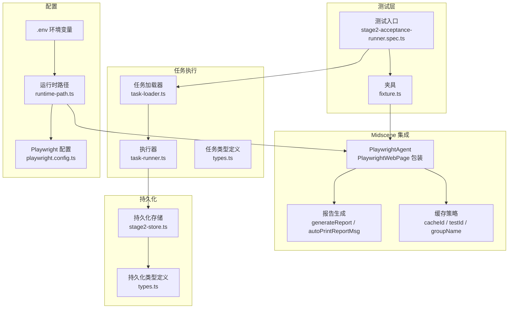
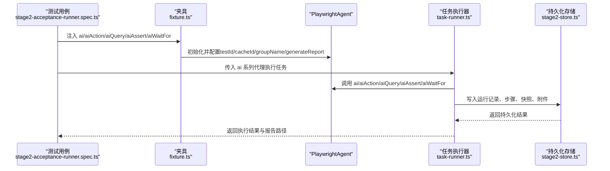
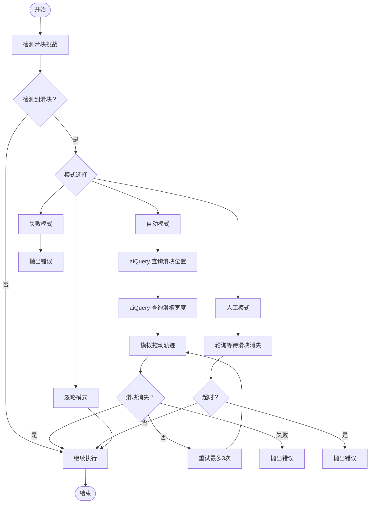
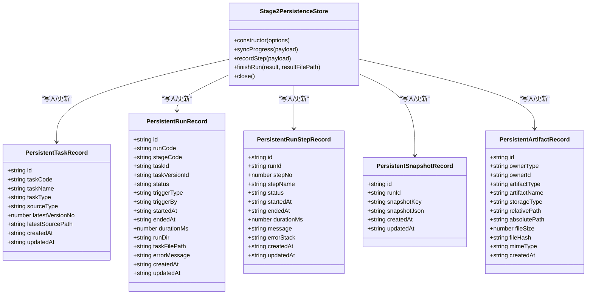
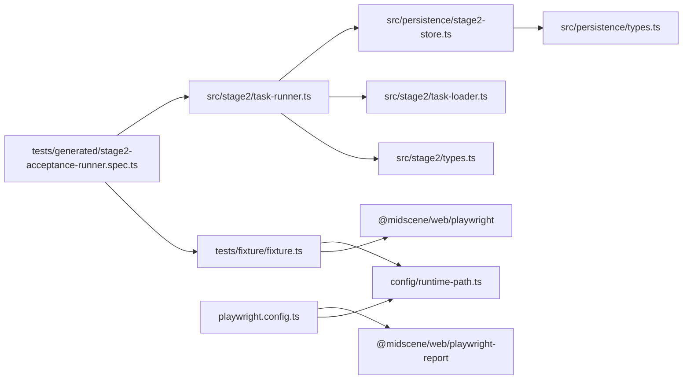

# Midscene 集成

<cite>
**本文引用的文件**
- [README.md](file://README.md)
- [AGENTS.md](file://AGENTS.md)
- [playwright.config.ts](file://playwright.config.ts)
- [package.json](file://package.json)
- [tests/fixture/fixture.ts](file://tests/fixture/fixture.ts)
- [tests/generated/stage2-acceptance-runner.spec.ts](file://tests/generated/stage2-acceptance-runner.spec.ts)
- [src/stage2/task-runner.ts](file://src/stage2/task-runner.ts)
- [src/stage2/types.ts](file://src/stage2/types.ts)
- [src/stage2/task-loader.ts](file://src/stage2/task-loader.ts)
- [src/persistence/types.ts](file://src/persistence/types.ts)
- [src/persistence/stage2-store.ts](file://src/persistence/stage2-store.ts)
- [config/runtime-path.ts](file://config/runtime-path.ts)
- [specs/tasks/acceptance-task.template.json](file://specs/tasks/acceptance-task.template.json)
- [specs/tasks/acceptance-task.community-create.example.json](file://specs/tasks/acceptance-task.community-create.example.json)
</cite>

## 目录
1. [简介](#简介)
2. [项目结构](#项目结构)
3. [核心组件](#核心组件)
4. [架构总览](#架构总览)
5. [详细组件分析](#详细组件分析)
6. [依赖关系分析](#依赖关系分析)
7. [性能考量](#性能考量)
8. [故障排查指南](#故障排查指南)
9. [结论](#结论)
10. [附录](#附录)

## 简介
本文件面向希望在 Playwright 中集成 Midscene.js 的开发者，系统性阐述 PlaywrightAgent 的初始化与配置、缓存 ID 生成策略、测试组配置与报告生成设置，并详解 AI 能力的代理模式（ai、aiAction、aiQuery、aiAssert、aiWaitFor）的使用方法与适用场景。同时，文档覆盖缓存机制与安全处理、最佳实践（性能优化、错误处理、调试技巧）、以及在不同测试场景下的配置要点。

## 项目结构
该项目采用“夹具 + 任务驱动 + 持久化”的分层组织方式：
- 夹具层：在 tests/fixture 中注入 Midscene 的 PlaywrightAgent，统一提供 ai 系列代理能力。
- 任务层：通过 JSON 任务文件描述验收流程，由 src/stage2/task-runner 解析并执行。
- 持久化层：将运行、步骤、快照、附件等结构化信息写入 SQLite 数据库。
- 配置层：通过 .env 与 config/runtime-path.ts 统一管理运行产物目录与路径解析。

图表来源
- [tests/generated/stage2-acceptance-runner.spec.ts:1-39](file://tests/generated/stage2-acceptance-runner.spec.ts#L1-L39)
- [tests/fixture/fixture.ts:23-99](file://tests/fixture/fixture.ts#L23-L99)
- [src/stage2/task-runner.ts:1-800](file://src/stage2/task-runner.ts#L1-L800)
- [src/stage2/task-loader.ts:79-91](file://src/stage2/task-loader.ts#L79-L91)
- [src/persistence/stage2-store.ts:74-641](file://src/persistence/stage2-store.ts#L74-L641)
- [config/runtime-path.ts:1-41](file://config/runtime-path.ts#L1-L41)
- [playwright.config.ts:22-95](file://playwright.config.ts#L22-L95)

章节来源
- [README.md:1-223](file://README.md#L1-L223)
- [AGENTS.md:1-61](file://AGENTS.md#L1-L61)
- [playwright.config.ts:1-95](file://playwright.config.ts#L1-L95)
- [package.json:1-26](file://package.json#L1-L26)

## 核心组件
- PlaywrightAgent 初始化与配置
  - 在夹具 tests/fixture/fixture.ts 中，为每个测试用例创建 PlaywrightAgent，传入 Page 包装器 PlaywrightWebPage。
  - 关键配置项：testId、cacheId、groupName、groupDescription、generateReport、autoPrintReportMsg。
  - 缓存 ID 生成：通过 sanitizeCacheId 对 testId 进行安全字符替换，避免非法字符影响缓存与目录命名。
  - 报告生成：generateReport=true 时启用 Midscene 报告；autoPrintReportMsg=false 控制是否自动打印报告消息。
- AI 代理模式
  - ai：支持 action/query 两种类型，通过可选参数 type 控制行为。
  - aiAction：专注于执行动作型任务。
  - aiQuery：专注从页面提取结构化数据。
  - aiAssert：执行 AI 断言。
  - aiWaitFor：在 Playwright 常规等待不适用时，使用 AI 等待条件满足。
- 运行时路径与报告
  - 通过 config/runtime-path.ts 从 .env 读取运行产物目录（PLAYWRIGHT_OUTPUT_DIR、PLAYWRIGHT_HTML_REPORT_DIR、MIDSCENE_RUN_DIR、ACCEPTANCE_RESULT_DIR）。
  - Playwright 配置 playwright.config.ts 从 runtime-path.ts 获取输出目录，并配置 HTML 报告与 Midscene 报告插件。

章节来源
- [tests/fixture/fixture.ts:23-99](file://tests/fixture/fixture.ts#L23-L99)
- [config/runtime-path.ts:8-41](file://config/runtime-path.ts#L8-L41)
- [playwright.config.ts:22-40](file://playwright.config.ts#L22-L40)
- [README.md:139-152](file://README.md#L139-L152)

## 架构总览
下图展示从测试入口到 Midscene 执行、再到持久化与报告的整体流程：

图表来源
- [tests/generated/stage2-acceptance-runner.spec.ts:12-37](file://tests/generated/stage2-acceptance-runner.spec.ts#L12-L37)
- [tests/fixture/fixture.ts:23-99](file://tests/fixture/fixture.ts#L23-L99)
- [src/stage2/task-runner.ts:1-800](file://src/stage2/task-runner.ts#L1-L800)
- [src/persistence/stage2-store.ts:74-641](file://src/persistence/stage2-store.ts#L74-L641)

## 详细组件分析

### PlaywrightAgent 初始化与配置
- 初始化时机与作用域
  - 在夹具 tests/fixture/fixture.ts 中，针对每个测试用例（testInfo）创建 PlaywrightAgent。
  - 通过 Page 包装器 PlaywrightWebPage 提供页面能力给 Agent。
- 配置项说明
  - testId：唯一标识本次测试的 ID，建议包含测试用例标识，便于追踪。
  - cacheId：用于缓存的 ID，需安全处理，避免非法字符。
  - groupName / groupDescription：测试组名称与描述，便于批量报告与归档。
  - generateReport：是否生成 Midscene 报告。
  - autoPrintReportMsg：是否自动打印报告消息（建议关闭以减少噪音）。
- 缓存 ID 安全处理
  - sanitizeCacheId 使用正则替换非法字符，确保缓存与目录命名安全。
- 报告生成设置
  - generateReport=true 时，Midscene 会在运行目录生成报告；autoPrintReportMsg=false 可避免在控制台刷屏。

章节来源
- [tests/fixture/fixture.ts:23-99](file://tests/fixture/fixture.ts#L23-L99)

### AI 代理模式详解
- ai
  - 用途：描述步骤并执行交互，支持 type='action' 或 'query'。
  - 适用场景：通用动作与查询混合的场景，或需要灵活选择行为类型时。
- aiAction
  - 用途：专注于执行动作型任务，适合明确的动作类指令。
  - 适用场景：点击、填写、拖拽等明确的用户操作。
- aiQuery
  - 用途：从页面提取结构化数据，适合需要 AI 辅助解析的复杂信息。
  - 适用场景：表格列值、弹窗内容、动态文案等。
- aiAssert
  - 用途：执行 AI 断言，适合难以用 Playwright 硬检测表达的语义断言。
  - 适用场景：自然语言断言、复杂布局断言。
- aiWaitFor
  - 用途：在 Playwright 常规等待不适用时，使用 AI 等待条件满足。
  - 适用场景：动态加载、异步渲染、不可见元素出现等。

章节来源
- [README.md:139-152](file://README.md#L139-L152)
- [tests/fixture/fixture.ts:23-99](file://tests/fixture/fixture.ts#L23-L99)

### 缓存机制与安全处理
- 缓存 ID 生成
  - 使用 sanitizeCacheId 对 testId 进行安全字符替换，避免在文件系统中产生非法路径。
- 缓存策略
  - cacheId 与 testId 分离，保证缓存键与测试标识清晰分离。
  - groupName/groupDescription 用于报告分组与归档，便于批量检索。
- 安全处理
  - 非法字符替换策略统一，避免跨平台兼容问题。
  - Midscene 日志目录通过 setLogDir 设置，统一收敛到运行目录。

章节来源
- [tests/fixture/fixture.ts:12-14](file://tests/fixture/fixture.ts#L12-L14)
- [tests/fixture/fixture.ts:26-33](file://tests/fixture/fixture.ts#L26-L33)
- [config/runtime-path.ts:28-31](file://config/runtime-path.ts#L28-L31)

### 任务执行与滑块验证码处理
- 任务加载
  - 通过 src/stage2/task-loader.ts 加载 JSON 任务文件，支持模板变量替换（如 NOW_YYYYMMDDHHMMSS）。
- 执行器
  - src/stage2/task-runner.ts 解析任务并执行，内置滑块验证码处理逻辑（自动/人工/失败/忽略）。
- 滑块验证码处理流程
  - 检测页面是否存在滑块挑战。
  - 自动模式：使用 aiQuery 获取滑块位置与滑槽宽度，模拟真人拖动轨迹，最多重试 3 次。
  - 人工模式：在超时时间内轮询等待滑块消失。
  - 失败模式：检测到即抛错。
  - 忽略模式：跳过检测。

图表来源
- [src/stage2/task-runner.ts:483-706](file://src/stage2/task-runner.ts#L483-L706)
- [src/stage2/task-runner.ts:510-559](file://src/stage2/task-runner.ts#L510-L559)
- [src/stage2/task-runner.ts:561-648](file://src/stage2/task-runner.ts#L561-L648)

章节来源
- [src/stage2/task-runner.ts:61-87](file://src/stage2/task-runner.ts#L61-L87)
- [src/stage2/task-runner.ts:483-706](file://src/stage2/task-runner.ts#L483-L706)
- [README.md:64-74](file://README.md#L64-L74)

### 报告与运行产物
- Midscene 报告
  - generateReport=true 时，Midscene 生成报告；autoPrintReportMsg=false 控制消息输出。
  - 报告目录由 MIDSCENE_RUN_DIR 管理，统一收敛到 t_runtime/midscene_run。
- Playwright 报告
  - playwright.config.ts 配置 HTML 报告输出目录与插件，确保与 Midscene 报告并行生成。
- 运行产物目录
  - PLAYWRIGHT_OUTPUT_DIR、PLAYWRIGHT_HTML_REPORT_DIR、ACCEPTANCE_RESULT_DIR 等通过 .env 与 runtime-path.ts 统一管理。

章节来源
- [tests/fixture/fixture.ts:31-32](file://tests/fixture/fixture.ts#L31-L32)
- [config/runtime-path.ts:18-36](file://config/runtime-path.ts#L18-L36)
- [playwright.config.ts:36-40](file://playwright.config.ts#L36-L40)
- [README.md:76-96](file://README.md#L76-L96)

### 持久化与数据模型
- 存储对象
  - Stage2PersistenceStore：负责任务、运行、步骤、快照、附件的写入与更新。
  - 支持敏感信息掩码（如账户密码），并记录审计日志。
- 数据模型
  - ai_task、ai_task_version、ai_run、ai_run_step、ai_snapshot、ai_artifact、ai_audit_log。
- 写入流程
  - 初始化任务与版本记录，插入运行记录，逐步写入步骤与快照，最终写入结果摘要与附件。

图表来源
- [src/persistence/stage2-store.ts:74-641](file://src/persistence/stage2-store.ts#L74-L641)
- [src/persistence/types.ts:34-125](file://src/persistence/types.ts#L34-L125)

章节来源
- [src/persistence/stage2-store.ts:74-641](file://src/persistence/stage2-store.ts#L74-L641)
- [src/persistence/types.ts:1-125](file://src/persistence/types.ts#L1-L125)

## 依赖关系分析
- 外部依赖
  - @midscene/web：提供 PlaywrightAgent、PlaywrightWebPage、报告插件等。
  - @playwright/test：测试框架与配置。
  - dotenv：读取 .env 环境变量。
- 内部依赖
  - tests/fixture/fixture.ts 依赖 @midscene/web/playwright 与 config/runtime-path.ts。
  - tests/generated/stage2-acceptance-runner.spec.ts 依赖夹具与 src/stage2/task-runner.ts。
  - src/stage2/task-runner.ts 依赖 src/stage2/types.ts、src/stage2/task-loader.ts、config/runtime-path.ts、src/persistence/stage2-store.ts。
  - src/persistence/stage2-store.ts 依赖 src/persistence/types.ts 与 sqlite 运行时工具。

图表来源
- [tests/fixture/fixture.ts:1-10](file://tests/fixture/fixture.ts#L1-L10)
- [tests/generated/stage2-acceptance-runner.spec.ts:1-39](file://tests/generated/stage2-acceptance-runner.spec.ts#L1-L39)
- [src/stage2/task-runner.ts:1-26](file://src/stage2/task-runner.ts#L1-L26)
- [src/stage2/task-loader.ts:1-17](file://src/stage2/task-loader.ts#L1-L17)
- [src/persistence/stage2-store.ts:1-14](file://src/persistence/stage2-store.ts#L1-L14)
- [playwright.config.ts:36-40](file://playwright.config.ts#L36-L40)

章节来源
- [package.json:15-24](file://package.json#L15-L24)
- [playwright.config.ts:1-95](file://playwright.config.ts#L1-L95)

## 性能考量
- 并行与超时
  - Playwright 配置 fullyParallel=true，workers 根据 CI 环境调整，有助于提升执行效率。
  - 任务执行器与夹具中设置合理的 step/page 超时，避免长时间阻塞。
- 缓存与报告
  - 合理使用 cacheId 与 groupName，避免过多无关缓存导致 IO 压力。
  - generateReport=true 时注意磁盘空间与报告生成开销，必要时在 CI 中裁剪报告细节。
- 滑块处理
  - 自动模式模拟拖动轨迹，尽量减少重试次数；若页面变化频繁，考虑提高检测与等待阈值。

章节来源
- [playwright.config.ts:28-34](file://playwright.config.ts#L28-L34)
- [tests/fixture/fixture.ts:31-32](file://tests/fixture/fixture.ts#L31-L32)
- [src/stage2/task-runner.ts:668-686](file://src/stage2/task-runner.ts#L668-L686)

## 故障排查指南
- 环境变量与路径
  - 确认 .env 中 RUNTIME_DIR_PREFIX、PLAYWRIGHT_OUTPUT_DIR、PLAYWRIGHT_HTML_REPORT_DIR、MIDSCENE_RUN_DIR、ACCEPTANCE_RESULT_DIR 设置正确。
  - 若路径解析异常，检查 config/runtime-path.ts 的 resolveRuntimePath 与 dotenv 加载。
- Midscene 报告与日志
  - setLogDir 已在夹具中设置，确保 Midscene 日志目录收敛到 MIDSCENE_RUN_DIR。
  - 如报告缺失，检查 generateReport 与 autoPrintReportMsg 配置。
- 滑块验证码
  - 若自动模式失败，检查 aiQuery 的提示词与页面截图；适当增加重试次数或切换为人工模式。
  - 人工模式下，增大 STAGE2_CAPTCHA_WAIT_TIMEOUT_MS 以适应网络波动。
- 持久化写入
  - 如数据库写入失败，检查 sqlite 权限与迁移脚本；关注 Stage2PersistenceStore 的错误日志输出。
- 任务文件
  - 确保 JSON 任务文件包含必需字段（taskId、taskName、target.url、account、form 等），否则加载器会抛错。

章节来源
- [config/runtime-path.ts:8-41](file://config/runtime-path.ts#L8-L41)
- [tests/fixture/fixture.ts:10-10](file://tests/fixture/fixture.ts#L10-L10)
- [README.md:39-54](file://README.md#L39-L54)
- [src/stage2/task-runner.ts:650-706](file://src/stage2/task-runner.ts#L650-L706)
- [src/persistence/stage2-store.ts:125-133](file://src/persistence/stage2-store.ts#L125-L133)
- [src/stage2/task-loader.ts:50-69](file://src/stage2/task-loader.ts#L50-L69)

## 结论
通过夹具层统一注入 PlaywrightAgent，结合任务驱动与持久化能力，本项目实现了可维护、可观测、可扩展的 Midscene + Playwright 集成方案。合理配置缓存与报告、遵循滑块处理策略、并利用持久化写入与审计日志，可在复杂 UI 场景下稳定地完成验收与回归测试。

## 附录
- 最佳实践清单
  - 优先使用 Playwright 硬检测（getByRole/getByLabel/getByTestId）进行断言，AI 断言作为兜底。
  - 使用 aiQuery + 代码断言替代 aiAssert，减少幻觉风险。
  - table-row-exists 作为硬门槛，table-cell-equals/contains 仅校验少量关键列，建议 soft=true。
  - AI 操作作为兜底，不建议所有步骤都直接依赖自由文本 AI 操作。
  - 统一运行产物目录，通过 .env 与 runtime-path.ts 管理，避免硬编码。
- 常用配置项
  - OPENAI_API_KEY、OPENAI_BASE_URL、MIDSCENE_MODEL_NAME：模型接入。
  - RUNTIME_DIR_PREFIX、PLAYWRIGHT_OUTPUT_DIR、PLAYWRIGHT_HTML_REPORT_DIR、MIDSCENE_RUN_DIR、ACCEPTANCE_RESULT_DIR：运行产物目录。
  - STAGE2_TASK_FILE、STAGE2_CAPTCHA_MODE、STAGE2_CAPTCHA_WAIT_TIMEOUT_MS：任务与验证码处理。

章节来源
- [README.md:146-152](file://README.md#L146-L152)
- [README.md:39-54](file://README.md#L39-L54)
- [AGENTS.md:22-46](file://AGENTS.md#L22-L46)