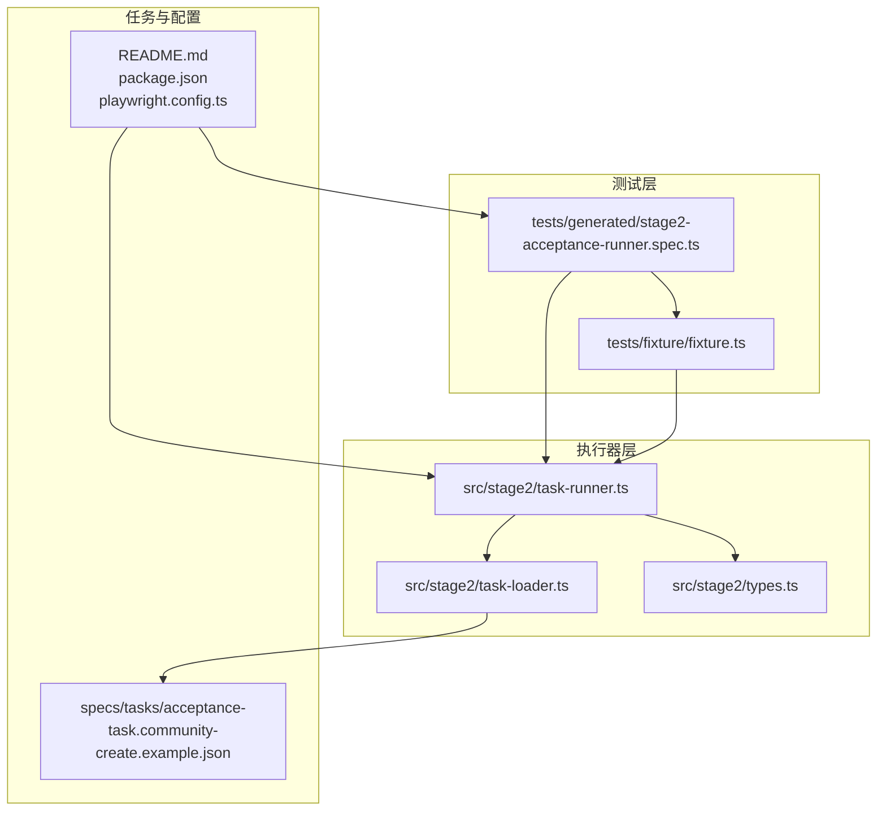
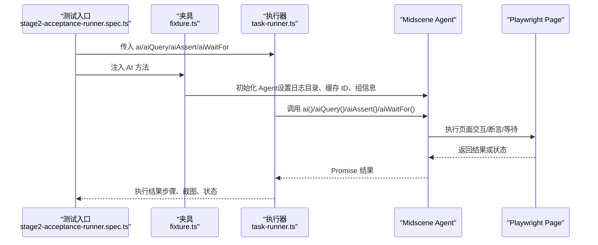
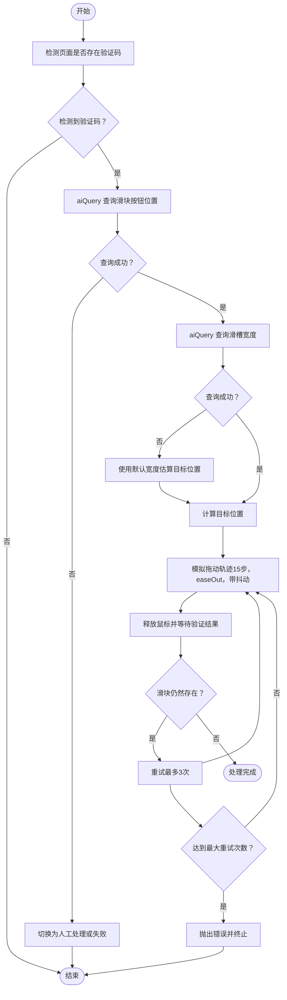
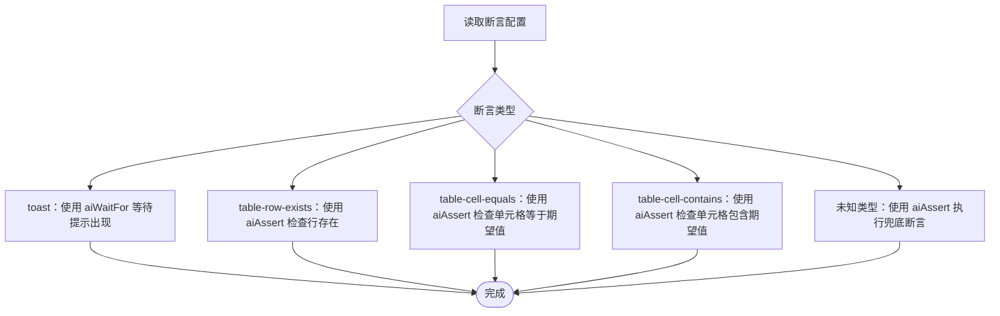
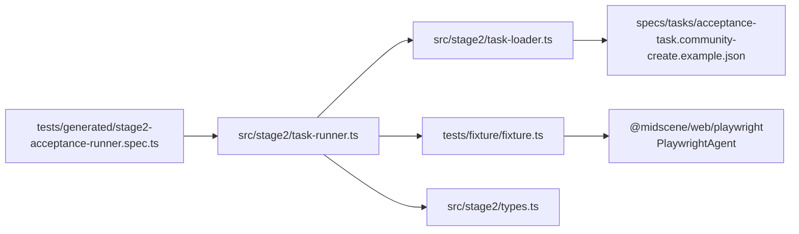

# AI 方法 API

<cite>
**本文引用的文件**
- [README.md](file://README.md)
- [package.json](file://package.json)
- [playwright.config.ts](file://playwright.config.ts)
- [src/stage2/task-runner.ts](file://src/stage2/task-runner.ts)
- [src/stage2/types.ts](file://src/stage2/types.ts)
- [src/stage2/task-loader.ts](file://src/stage2/task-loader.ts)
- [tests/generated/stage2-acceptance-runner.spec.ts](file://tests/generated/stage2-acceptance-runner.spec.ts)
- [tests/fixture/fixture.ts](file://tests/fixture/fixture.ts)
- [specs/tasks/acceptance-task.community-create.example.json](file://specs/tasks/acceptance-task.community-create.example.json)
- [.tasks/AI自主代理验收系统开发改造方案_2026-03-11.md](file://.tasks/AI自主代理验收系统开发改造方案_2026-03-11.md)
</cite>

## 目录
1. [简介](#简介)
2. [项目结构](#项目结构)
3. [核心组件](#核心组件)
4. [架构总览](#架构总览)
5. [详细组件分析](#详细组件分析)
6. [依赖关系分析](#依赖关系分析)
7. [性能考量](#性能考量)
8. [故障排查指南](#故障排查指南)
9. [结论](#结论)
10. [附录](#附录)

## 简介
本文件为 AI 方法 API 的完整参考文档，覆盖以下方法：
- ai：描述步骤并执行交互
- aiQuery：从页面中提取结构化数据
- aiAssert：执行 AI 断言
- aiWaitFor：等待页面满足某个条件

文档将说明各方法的功能、参数、返回值、典型使用场景、最佳实践、错误处理与性能优化，并给出方法链式调用与组合使用的高级技巧。同时，结合项目中的实际用例，帮助开发者快速掌握如何在真实任务驱动的执行器中使用这些 AI 方法。

## 项目结构
该项目围绕“任务驱动的第二段执行器”组织，核心文件与职责如下：
- tests/fixture/fixture.ts：提供 ai、aiQuery、aiAssert、aiWaitFor 四类 AI 方法的夹具封装，基于 Midscene 的 Playwright Agent 实现
- src/stage2/task-runner.ts：第二段执行器，负责读取任务 JSON、编排步骤、调用 AI 方法、处理验证码、断言与结果输出
- src/stage2/types.ts：任务与执行结果的数据模型定义
- src/stage2/task-loader.ts：任务文件解析与模板变量替换
- tests/generated/stage2-acceptance-runner.spec.ts：测试入口，将 AI 方法注入到测试上下文
- specs/tasks/acceptance-task.community-create.example.json：示例任务 JSON，展示字段、断言与运行时配置
- README.md：项目说明、环境变量与运行产物目录
- package.json、playwright.config.ts：运行脚本与 Playwright 配置

图表来源
- [tests/generated/stage2-acceptance-runner.spec.ts](file://tests/generated/stage2-acceptance-runner.spec.ts#L1-L39)
- [tests/fixture/fixture.ts](file://tests/fixture/fixture.ts#L1-L100)
- [src/stage2/task-runner.ts](file://src/stage2/task-runner.ts#L1062-L1344)
- [src/stage2/task-loader.ts](file://src/stage2/task-loader.ts#L71-L91)
- [specs/tasks/acceptance-task.community-create.example.json](file://specs/tasks/acceptance-task.community-create.example.json#L1-L184)
- [README.md](file://README.md#L1-L144)
- [package.json](file://package.json#L1-L24)
- [playwright.config.ts](file://playwright.config.ts#L1-L95)

章节来源
- [README.md](file://README.md#L1-L144)
- [package.json](file://package.json#L1-L24)
- [playwright.config.ts](file://playwright.config.ts#L1-L95)

## 核心组件
本节聚焦四类 AI 方法及其在夹具中的封装与在执行器中的使用。

- ai（动作型）
  - 功能：接收自然语言描述，驱动 Playwright 完成页面交互（点击、输入、滚动等）
  - 参数：prompt（字符串）、opts（可选，支持 type='action'）
  - 返回：Promise<any>
  - 典型用途：登录、点击菜单、打开弹窗、填写表单等
  - 示例路径：[tests/fixture/fixture.ts](file://tests/fixture/fixture.ts#L24-L41)，[src/stage2/task-runner.ts](file://src/stage2/task-runner.ts#L1163-L1168)

- aiQuery（查询型）
  - 功能：从页面提取结构化数据（如列表快照、坐标、数值等）
  - 参数：demand（字符串或类型签名，如 "string[]"）
  - 返回：Promise<T>
  - 典型用途：提取列表前 N 行、滑块位置与轨迹宽度、统计值等
  - 示例路径：[tests/fixture/fixture.ts](file://tests/fixture/fixture.ts#L57-L69)，[src/stage2/task-runner.ts](file://src/stage2/task-runner.ts#L1306-L1310)

- aiAssert（断言型）
  - 功能：执行 AI 断言，验证页面状态或数据
  - 参数：assertion（字符串）、errorMsg（可选）
  - 返回：Promise<void>
  - 典型用途：断言 toast 出现、某行存在、单元格等于/包含期望值
  - 示例路径：[tests/fixture/fixture.ts](file://tests/fixture/fixture.ts#L71-L83)，[src/stage2/task-runner.ts](file://src/stage2/task-runner.ts#L1026-L1060)

- aiWaitFor（等待型）
  - 功能：等待页面满足某个条件（如文本出现、元素可见）
  - 参数：assertion（字符串）、opt（可选，传入等待选项）
  - 返回：Promise<void>
  - 典型用途：等待提示出现、页面加载完成
  - 示例路径：[tests/fixture/fixture.ts](file://tests/fixture/fixture.ts#L85-L97)，[src/stage2/task-runner.ts](file://src/stage2/task-runner.ts#L1027)

章节来源
- [tests/fixture/fixture.ts](file://tests/fixture/fixture.ts#L16-L99)
- [src/stage2/task-runner.ts](file://src/stage2/task-runner.ts#L1020-L1060)

## 架构总览
下图展示了测试入口、夹具封装、执行器与任务 JSON 的交互关系，以及 AI 方法在执行器中的调用时机。

图表来源
- [tests/generated/stage2-acceptance-runner.spec.ts](file://tests/generated/stage2-acceptance-runner.spec.ts#L12-L37)
- [tests/fixture/fixture.ts](file://tests/fixture/fixture.ts#L24-L97)
- [src/stage2/task-runner.ts](file://src/stage2/task-runner.ts#L1062-L1344)

## 详细组件分析

### ai 方法详解
- 功能与用途
  - 驱动页面交互，适合“动作型”步骤，如登录、点击菜单、打开弹窗、填写表单等
  - 通过自然语言描述，让 AI 代理推断并执行合适的 Playwright 操作
- 参数与返回
  - prompt：自然语言描述
  - opts：可选，支持 type='action'
  - 返回：Promise<any>（具体取决于内部实现）
- 典型使用场景
  - 登录：在登录页输入用户名/密码并点击登录
  - 打开弹窗：点击“新增小区”按钮
  - 填写字段：在弹窗中输入字段值
- 最佳实践
  - 将长流程拆分为多个步骤，避免单条长 prompt 导致定位困难
  - 为关键步骤补充 hints，提升 AI 对页面元素的理解
- 错误处理
  - 若交互失败，执行器会捕获错误并记录截图、消息与堆栈
- 性能优化
  - 合理设置 stepTimeout/pageTimeout，避免过长等待
  - 在需要时开启截图，便于定位问题

示例路径
- [src/stage2/task-runner.ts](file://src/stage2/task-runner.ts#L1163-L1168)
- [src/stage2/task-runner.ts](file://src/stage2/task-runner.ts#L1215-L1217)
- [src/stage2/task-runner.ts](file://src/stage2/task-runner.ts#L1234-L1240)
- [src/stage2/task-runner.ts](file://src/stage2/task-runner.ts#L1242-L1247)
- [src/stage2/task-runner.ts](file://src/stage2/task-runner.ts#L1269)

章节来源
- [src/stage2/task-runner.ts](file://src/stage2/task-runner.ts#L1157-L1271)
- [README.md](file://README.md#L100-L105)

### aiQuery 方法详解
- 功能与用途
  - 从页面提取结构化数据，如列表快照、坐标、数值等
  - 适合需要“客观事实”的关键断言，降低 AI 幻觉风险
- 参数与返回
  - demand：字符串或类型签名（如 "string[]"）
  - 返回：Promise<T>
- 典型使用场景
  - 提取列表前 N 行的小区名称
  - 查询滑块按钮位置与滑槽宽度，用于自动拖动
- 最佳实践
  - 明确返回类型签名，便于后续代码断言
  - 在失败时忽略错误（如滑块检测失败），避免阻断流程
- 错误处理
  - 捕获异常并忽略，保证流程继续
- 性能优化
  - 仅在必要时进行查询，避免频繁截图与网络请求

示例路径
- [src/stage2/task-runner.ts](file://src/stage2/task-runner.ts#L1306-L1310)
- [src/stage2/task-runner.ts](file://src/stage2/task-runner.ts#L511-L522)
- [src/stage2/task-runner.ts](file://src/stage2/task-runner.ts#L541-L548)

章节来源
- [src/stage2/task-runner.ts](file://src/stage2/task-runner.ts#L507-L556)
- [src/stage2/task-runner.ts](file://src/stage2/task-runner.ts#L1305-L1311)

### aiAssert 方法详解
- 功能与用途
  - 执行 AI 断言，验证页面状态或数据
  - 适合通用断言，作为补充性可读断言
- 参数与返回
  - assertion：断言描述
  - errorMsg：可选，自定义错误信息
  - 返回：Promise<void>
- 典型使用场景
  - 断言 toast 出现
  - 断言某行存在或单元格等于/包含期望值
- 最佳实践
  - 关键断言优先使用 aiQuery + 代码断言，aiAssert 作为补充
  - 对未知断言类型，提供兜底描述，确保执行
- 错误处理
  - 断言失败会抛出错误，执行器记录失败步骤与截图

示例路径
- [src/stage2/task-runner.ts](file://src/stage2/task-runner.ts#L1026-L1060)

章节来源
- [src/stage2/task-runner.ts](file://src/stage2/task-runner.ts#L1020-L1060)
- [.tasks/AI自主代理验收系统开发改造方案_2026-03-11.md](file://.tasks/AI自主代理验收系统开发改造方案_2026-03-11.md#L78-L84)

### aiWaitFor 方法详解
- 功能与用途
  - 等待页面满足某个条件（如文本出现、元素可见）
  - 适合等待提示、加载完成等异步状态
- 参数与返回
  - assertion：等待条件描述
  - opt：可选等待选项（如超时）
  - 返回：Promise<void>
- 典型使用场景
  - 等待“操作成功”提示出现
- 最佳实践
  - 对关键提示使用 aiWaitFor，确保 UI 稳定后再继续
- 错误处理
  - 等待超时会抛出错误，执行器记录失败步骤

示例路径
- [src/stage2/task-runner.ts](file://src/stage2/task-runner.ts#L1027)

章节来源
- [src/stage2/task-runner.ts](file://src/stage2/task-runner.ts#L1020-L1030)

### 验证码自动处理流程（aiQuery + ai + Playwright）
该流程展示了如何组合 aiQuery 与 ai 方法，配合 Playwright 鼠标 API 实现滑块验证码的自动处理。

图表来源
- [src/stage2/task-runner.ts](file://src/stage2/task-runner.ts#L480-L703)
- [src/stage2/task-runner.ts](file://src/stage2/task-runner.ts#L507-L645)

章节来源
- [src/stage2/task-runner.ts](file://src/stage2/task-runner.ts#L480-L703)

### 断言编排（aiAssert + aiWaitFor）
执行器根据任务 JSON 中的断言类型，选择合适的 AI 方法进行断言与等待。

图表来源
- [src/stage2/task-runner.ts](file://src/stage2/task-runner.ts#L1020-L1060)

章节来源
- [src/stage2/task-runner.ts](file://src/stage2/task-runner.ts#L1020-L1060)

## 依赖关系分析
- 夹具依赖 Midscene 的 Playwright Agent，负责将自然语言描述转换为页面操作
- 执行器依赖任务 JSON 的结构化配置，按步骤编排调用 AI 方法
- 测试入口将 AI 方法注入到测试上下文，形成“任务驱动”的执行闭环

图表来源
- [tests/fixture/fixture.ts](file://tests/fixture/fixture.ts#L1-L100)
- [src/stage2/task-runner.ts](file://src/stage2/task-runner.ts#L1062-L1344)
- [src/stage2/task-loader.ts](file://src/stage2/task-loader.ts#L71-L91)
- [specs/tasks/acceptance-task.community-create.example.json](file://specs/tasks/acceptance-task.community-create.example.json#L1-L184)
- [tests/generated/stage2-acceptance-runner.spec.ts](file://tests/generated/stage2-acceptance-runner.spec.ts#L1-L39)

章节来源
- [tests/fixture/fixture.ts](file://tests/fixture/fixture.ts#L1-L100)
- [src/stage2/task-runner.ts](file://src/stage2/task-runner.ts#L1062-L1344)
- [src/stage2/task-loader.ts](file://src/stage2/task-loader.ts#L71-L91)

## 性能考量
- 合理设置超时
  - 任务运行时可配置 stepTimeoutMs、pageTimeoutMs，避免过长等待导致整体耗时增加
- 控制截图频率
  - 仅在需要定位问题时开启截图，减少 IO 压力
- 降低 AI 查询频率
  - 仅在必要时使用 aiQuery，避免频繁触发模型推理
- 任务拆分
  - 将长流程拆分为多个步骤，便于重试、截图与失败补偿

章节来源
- [specs/tasks/acceptance-task.community-create.example.json](file://specs/tasks/acceptance-task.community-create.example.json#L177-L182)
- [.tasks/AI自主代理验收系统开发改造方案_2026-03-11.md](file://.tasks/AI自主代理验收系统开发改造方案_2026-03-11.md#L60-L77)

## 故障排查指南
- 登录失败或验证码拦截
  - 检查 STAGE2_CAPTCHA_MODE 与 STAGE2_CAPTCHA_WAIT_TIMEOUT_MS 配置
  - 自动模式下会尝试三次滑块处理；失败时可切换为人工模式
- 断言失败
  - 使用 aiWaitFor 等待关键提示出现后再断言
  - 关键断言优先使用 aiQuery + 代码断言，避免仅依赖 aiAssert
- 步骤截图与错误信息
  - 执行器会在失败时截图并记录 message 与 errorStack，便于定位问题
- 环境变量与模型配置
  - 确认 OPENAI_API_KEY、OPENAI_BASE_URL、MIDSCENE_MODEL_NAME 等配置正确

章节来源
- [README.md](file://README.md#L39-L72)
- [src/stage2/task-runner.ts](file://src/stage2/task-runner.ts#L1132-L1149)
- [src/stage2/task-runner.ts](file://src/stage2/task-runner.ts#L647-L703)
- [.tasks/AI自主代理验收系统开发改造方案_2026-03-11.md](file://.tasks/AI自主代理验收系统开发改造方案_2026-03-11.md#L78-L84)

## 结论
- 将长流程拆分为多个步骤，分别使用 ai、aiQuery、aiAssert、aiWaitFor，可显著提升稳定性与可维护性
- 关键断言优先使用结构化查询 + 代码断言，降低 AI 幻觉风险
- 合理配置超时与截图策略，平衡执行效率与可观测性
- 通过任务 JSON 驱动执行器，实现“输入结构化、步骤原子化、断言硬化、结果可沉淀”

## 附录

### 方法选择策略与适用场景
- 使用 ai：需要执行页面交互（点击、输入、滚动等）
- 使用 aiQuery：需要提取结构化数据（列表、坐标、数值等）
- 使用 aiAssert：需要执行通用断言（如存在性、相等性、包含性）
- 使用 aiWaitFor：需要等待页面满足某个条件（如提示出现）

章节来源
- [.tasks/AI自主代理验收系统开发改造方案_2026-03-11.md](file://.tasks/AI自主代理验收系统开发改造方案_2026-03-11.md#L60-L84)

### 方法链式调用与组合使用
- 典型组合：aiQuery → ai → aiWaitFor → aiAssert
  - 先查询结构化数据，再执行动作，等待 UI 状态变化，最后断言结果
- 示例路径
  - [src/stage2/task-runner.ts](file://src/stage2/task-runner.ts#L1306-L1310)
  - [src/stage2/task-runner.ts](file://src/stage2/task-runner.ts#L1289-L1304)

章节来源
- [src/stage2/task-runner.ts](file://src/stage2/task-runner.ts#L1289-L1311)

### 常见使用模式与最佳实践
- 登录与菜单导航
  - 使用 ai 描述登录步骤与菜单点击
  - 示例路径：[src/stage2/task-runner.ts](file://src/stage2/task-runner.ts#L1163-L1168)，[src/stage2/task-runner.ts](file://src/stage2/task-runner.ts#L1205-L1213)
- 表单填写与提交
  - 使用 ai 填写字段，aiWaitFor 等待弹窗关闭，aiAssert 断言提交结果
  - 示例路径：[src/stage2/task-runner.ts](file://src/stage2/task-runner.ts#L1232-L1247)，[src/stage2/task-runner.ts](file://src/stage2/task-runner.ts#L1026-L1060)
- 搜索与回查
  - 使用 ai 填写搜索条件，aiWaitFor 等待结果出现，aiQuery 提取列表快照
  - 示例路径：[src/stage2/task-runner.ts](file://src/stage2/task-runner.ts#L1274-L1287)，[src/stage2/task-runner.ts](file://src/stage2/task-runner.ts#L1289-L1304)，[src/stage2/task-runner.ts](file://src/stage2/task-runner.ts#L1306-L1310)

章节来源
- [src/stage2/task-runner.ts](file://src/stage2/task-runner.ts#L1157-L1311)