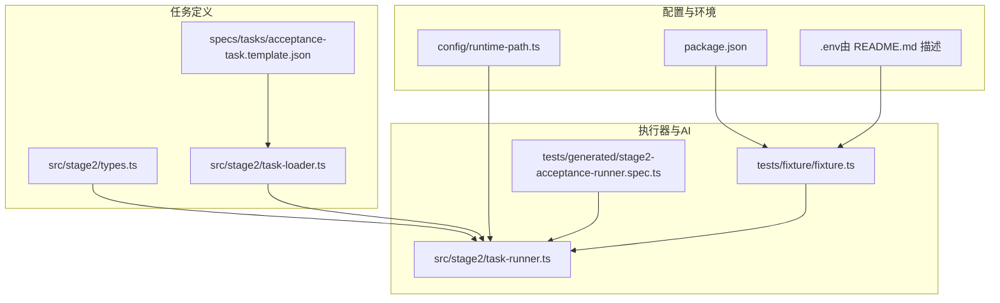
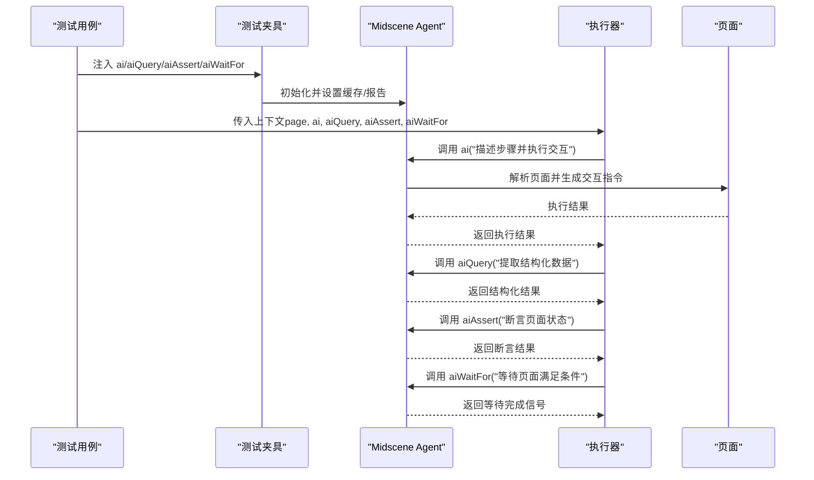
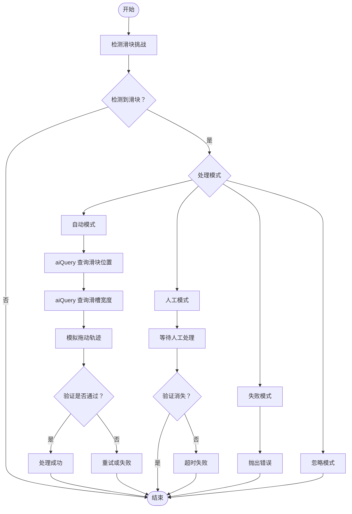
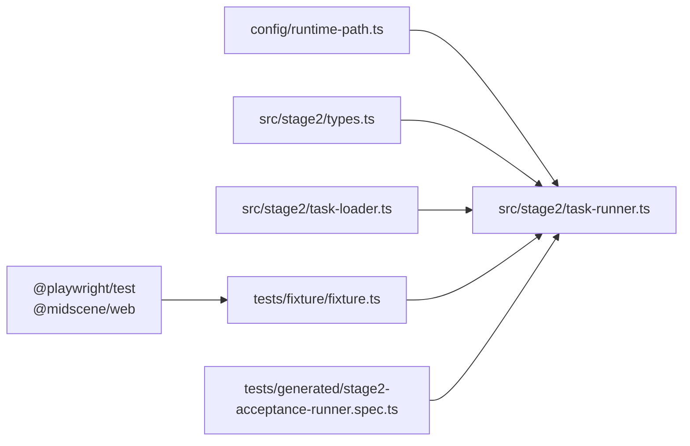

# AI 核心方法

<cite>
**本文引用的文件**
- [README.md](file://README.md)
- [package.json](file://package.json)
- [config/runtime-path.ts](file://config/runtime-path.ts)
- [src/stage2/types.ts](file://src/stage2/types.ts)
- [src/stage2/task-runner.ts](file://src/stage2/task-runner.ts)
- [src/stage2/task-loader.ts](file://src/stage2/task-loader.ts)
- [tests/fixture/fixture.ts](file://tests/fixture/fixture.ts)
- [tests/generated/stage2-acceptance-runner.spec.ts](file://tests/generated/stage2-acceptance-runner.spec.ts)
- [.tasks/AI自主代理验收系统开发改造方案_2026-03-11.md](file://.tasks/AI自主代理验收系统开发改造方案_2026-03-11.md)
- [specs/tasks/acceptance-task.template.json](file://specs/tasks/acceptance-task.template.json)
</cite>

## 目录
1. [简介](#简介)
2. [项目结构](#项目结构)
3. [核心组件](#核心组件)
4. [架构总览](#架构总览)
5. [详细组件分析](#详细组件分析)
6. [依赖分析](#依赖分析)
7. [性能考虑](#性能考虑)
8. [故障排除指南](#故障排除指南)
9. [结论](#结论)
10. [附录](#附录)

## 简介
本文件聚焦于项目中的 AI 核心方法，系统阐述其基本功能、参数配置、返回值结构、使用模式与最佳实践，并结合任务执行场景给出页面元素识别与操作的使用范式。该体系以 Midscene.js 的 AI 能力为基础，通过 Playwright 实现端到端自动化，覆盖页面元素识别、结构化数据提取、断言与等待、以及滑块验证码的自动处理等关键能力。

## 项目结构
该项目围绕“任务驱动 + AI 能力”的第二段执行器组织，核心文件包括：
- 运行时路径与环境变量解析：config/runtime-path.ts
- 任务模型定义：src/stage2/types.ts
- 任务加载与解析：src/stage2/task-loader.ts
- 执行器与 AI 方法封装：src/stage2/task-runner.ts
- 测试夹具与 AI 方法注入：tests/fixture/fixture.ts
- 测试入口与执行流程：tests/generated/stage2-acceptance-runner.spec.ts
- 项目说明与运行指引：README.md
- 任务模板与规范：specs/tasks/acceptance-task.template.json
- 改造方案与设计原则：.tasks/AI自主代理验收系统开发改造方案_2026-03-11.md

图表来源
- [config/runtime-path.ts](file://config/runtime-path.ts#L1-L41)
- [package.json](file://package.json#L1-L24)
- [src/stage2/types.ts](file://src/stage2/types.ts#L1-L125)
- [src/stage2/task-loader.ts](file://src/stage2/task-loader.ts#L1-L91)
- [specs/tasks/acceptance-task.template.json](file://specs/tasks/acceptance-task.template.json#L1-L85)
- [tests/fixture/fixture.ts](file://tests/fixture/fixture.ts#L1-L100)
- [src/stage2/task-runner.ts](file://src/stage2/task-runner.ts#L1-L1344)
- [tests/generated/stage2-acceptance-runner.spec.ts](file://tests/generated/stage2-acceptance-runner.spec.ts#L1-L39)

章节来源
- [README.md](file://README.md#L1-L144)
- [package.json](file://package.json#L1-L24)
- [config/runtime-path.ts](file://config/runtime-path.ts#L1-L41)

## 核心组件
本项目围绕四个 AI 方法构建：
- .ai：描述步骤并执行交互（支持 action/query 类型）
- .aiQuery：从页面中提取结构化数据
- .aiAssert：执行 AI 断言
- .aiWaitFor：等待页面满足特定条件

这些方法通过测试夹具注入到测试用例中，供执行器在任务流程中调用。

章节来源
- [README.md](file://README.md#L100-L105)
- [tests/fixture/fixture.ts](file://tests/fixture/fixture.ts#L23-L99)
- [tests/generated/stage2-acceptance-runner.spec.ts](file://tests/generated/stage2-acceptance-runner.spec.ts#L12-L37)

## 架构总览
AI 方法在系统中的工作流如下：
- 测试夹具初始化 Midscene Agent，注入 ai/aiQuery/aiAssert/aiWaitFor
- 执行器读取任务文件，按步骤调用 AI 方法与 Playwright 原生 API
- AI 方法通过模型解析页面截图与 DOM，输出结构化指令或结果
- 执行器结合结构化结果与 Playwright 操作完成页面交互与断言

图表来源
- [tests/fixture/fixture.ts](file://tests/fixture/fixture.ts#L23-L99)
- [src/stage2/task-runner.ts](file://src/stage2/task-runner.ts#L1020-L1060)
- [tests/generated/stage2-acceptance-runner.spec.ts](file://tests/generated/stage2-acceptance-runner.spec.ts#L12-L37)

## 详细组件分析

### AI 方法概览与职责
- .ai：用于描述步骤并执行交互，支持通过选项指定类型（action/query），默认 action
- .aiQuery：用于从页面提取结构化数据，返回类型由调用方泛型约束
- .aiAssert：用于执行 AI 断言，可选错误消息
- .aiWaitFor：用于等待页面满足特定条件，支持可选等待参数

章节来源
- [tests/fixture/fixture.ts](file://tests/fixture/fixture.ts#L16-L19)
- [tests/fixture/fixture.ts](file://tests/fixture/fixture.ts#L34-L40)
- [tests/fixture/fixture.ts](file://tests/fixture/fixture.ts#L67-L69)
- [tests/fixture/fixture.ts](file://tests/fixture/fixture.ts#L81-L83)
- [tests/fixture/fixture.ts](file://tests/fixture/fixture.ts#L95-L97)

### 参数配置与返回值结构
- .ai(prompt, { type }): 返回 Promise<T>，T 由调用方指定
  - type 可选：'action' | 'query'，默认 'action'
- .aiQuery(demand): 返回 Promise<T>，T 由调用方指定
- .aiAssert(assertion, errorMsg?): 返回 Promise<void>
- .aiWaitFor(assertion, opt?): 返回 Promise<void>

章节来源
- [tests/fixture/fixture.ts](file://tests/fixture/fixture.ts#L16-L19)
- [tests/fixture/fixture.ts](file://tests/fixture/fixture.ts#L34-L40)
- [tests/fixture/fixture.ts](file://tests/fixture/fixture.ts#L67-L69)
- [tests/fixture/fixture.ts](file://tests/fixture/fixture.ts#L81-L83)
- [tests/fixture/fixture.ts](file://tests/fixture/fixture.ts#L95-L97)

### 使用模式与任务集成
- 页面元素识别与操作
  - 使用 .ai 描述点击、填写、滚动等交互
  - 使用 .aiQuery 提取列表、表单字段等结构化数据
  - 使用 .aiAssert 对页面状态进行断言
  - 使用 .aiWaitFor 等待提示、弹窗、表格加载等条件
- 滑块验证码自动处理
  - 通过 .aiQuery 识别滑块位置与滑槽宽度
  - 使用 Playwright mouse API 模拟拖动轨迹
  - 失败时可切换为 manual 模式人工处理

章节来源
- [README.md](file://README.md#L62-L72)
- [src/stage2/task-runner.ts](file://src/stage2/task-runner.ts#L507-L556)
- [src/stage2/task-runner.ts](file://src/stage2/task-runner.ts#L558-L645)
- [src/stage2/task-runner.ts](file://src/stage2/task-runner.ts#L647-L703)

### 与其它 AI 方法的区别与协作
- 区别
  - .ai：侧重“执行交互”，适合描述步骤并触发页面行为
  - .aiQuery：侧重“结构化提取”，适合从页面抽取数据
  - .aiAssert：侧重“断言”，适合校验页面状态
  - .aiWaitFor：侧重“等待”，适合等待页面条件满足
- 协作
  - 在同一任务中，通常先 .aiQuery 提取数据，再用 .aiAssert 做断言，最后用 .aiWaitFor 等待下一步
  - 对于复杂流程，建议拆分为多个小步骤，避免长 Prompt 导致定位困难

章节来源
- [README.md](file://README.md#L100-L105)
- [.tasks/AI自主代理验收系统开发改造方案_2026-03-11.md](file://.tasks/AI自主代理验收系统开发改造方案_2026-03-11.md#L60-L84)

### 具体使用示例（路径索引）
- 使用 .ai 进行页面元素识别与操作
  - 点击菜单：[示例路径](file://src/stage2/task-runner.ts#L861-L891)
  - 触发搜索：[示例路径](file://src/stage2/task-runner.ts#L846-L858)
  - 打开级联面板：[示例路径](file://src/stage2/task-runner.ts#L705-L721)
  - 点击级联选项：[示例路径](file://src/stage2/task-runner.ts#L723-L785)
- 使用 .aiQuery 提取结构化数据
  - 提取列表快照：[示例路径](file://src/stage2/task-runner.ts#L1305-L1310)
  - 查询滑块位置：[示例路径](file://src/stage2/task-runner.ts#L507-L535)
  - 查询滑槽宽度：[示例路径](file://src/stage2/task-runner.ts#L537-L556)
- 使用 .aiAssert 进行断言
  - 表格行存在断言：[示例路径](file://src/stage2/task-runner.ts#L1030-L1033)
  - 表格单元格相等断言：[示例路径](file://src/stage2/task-runner.ts#L1035-L1041)
  - 表格单元格包含断言：[示例路径](file://src/stage2/task-runner.ts#L1043-L1054)
  - 通用断言兜底：[示例路径](file://src/stage2/task-runner.ts#L1056-L1059)
- 使用 .aiWaitFor 等待
  - 等待提示出现：[示例路径](file://src/stage2/task-runner.ts#L1026-L1028)
- 滑块验证码自动处理
  - 检测与处理：[示例路径](file://src/stage2/task-runner.ts#L647-L703)
  - 模拟拖动轨迹：[示例路径](file://src/stage2/task-runner.ts#L558-L645)

章节来源
- [src/stage2/task-runner.ts](file://src/stage2/task-runner.ts#L507-L556)
- [src/stage2/task-runner.ts](file://src/stage2/task-runner.ts#L558-L645)
- [src/stage2/task-runner.ts](file://src/stage2/task-runner.ts#L647-L703)
- [src/stage2/task-runner.ts](file://src/stage2/task-runner.ts#L705-L785)
- [src/stage2/task-runner.ts](file://src/stage2/task-runner.ts#L846-L891)
- [src/stage2/task-runner.ts](file://src/stage2/task-runner.ts#L1020-L1060)
- [src/stage2/task-runner.ts](file://src/stage2/task-runner.ts#L1299-L1310)

### 滑块验证码自动处理流程

图表来源
- [src/stage2/task-runner.ts](file://src/stage2/task-runner.ts#L480-L498)
- [src/stage2/task-runner.ts](file://src/stage2/task-runner.ts#L507-L556)
- [src/stage2/task-runner.ts](file://src/stage2/task-runner.ts#L558-L645)
- [src/stage2/task-runner.ts](file://src/stage2/task-runner.ts#L647-L703)
- [README.md](file://README.md#L54-L72)

## 依赖分析
- 外部依赖
  - @midscene/web：提供 AI 能力与 Playwright 集成
  - @playwright/test：提供测试框架与页面对象
- 内部依赖
  - config/runtime-path.ts：统一运行产物目录
  - src/stage2/types.ts：任务模型定义
  - src/stage2/task-loader.ts：任务文件加载与模板解析
  - tests/fixture/fixture.ts：AI 方法注入与 Agent 初始化
  - src/stage2/task-runner.ts：执行器与 AI 方法调用
  - tests/generated/stage2-acceptance-runner.spec.ts：测试入口

图表来源
- [package.json](file://package.json#L13-L22)
- [config/runtime-path.ts](file://config/runtime-path.ts#L1-L41)
- [src/stage2/types.ts](file://src/stage2/types.ts#L1-L125)
- [src/stage2/task-loader.ts](file://src/stage2/task-loader.ts#L1-L91)
- [tests/fixture/fixture.ts](file://tests/fixture/fixture.ts#L1-L100)
- [src/stage2/task-runner.ts](file://src/stage2/task-runner.ts#L1-L1344)
- [tests/generated/stage2-acceptance-runner.spec.ts](file://tests/generated/stage2-acceptance-runner.spec.ts#L1-L39)

章节来源
- [package.json](file://package.json#L13-L22)
- [config/runtime-path.ts](file://config/runtime-path.ts#L1-L41)
- [src/stage2/task-runner.ts](file://src/stage2/task-runner.ts#L1-L1344)

## 性能考虑
- 将长流程拆分为多个短步骤，减少单次 AI 调用的复杂度，提升可维护性与稳定性
- 合理设置等待与重试策略，避免过度轮询导致性能下降
- 使用 .aiQuery 提取结构化数据后，结合 Playwright 原生 API 做硬断言，降低 AI 幻觉风险
- 统一运行产物目录，便于缓存与日志管理，减少 IO 压力

章节来源
- [.tasks/AI自主代理验收系统开发改造方案_2026-03-11.md](file://.tasks/AI自主代理验收系统开发改造方案_2026-03-11.md#L60-L84)
- [README.md](file://README.md#L74-L92)

## 故障排除指南
- 滑块验证码自动处理失败
  - 现象：多次尝试后仍失败
  - 排查要点：页面截图确认滑块样式、调整为 manual 模式人工处理、检查滑块检测选择器
  - 参考路径：[处理逻辑](file://src/stage2/task-runner.ts#L647-L703)，[自动拖动](file://src/stage2/task-runner.ts#L558-L645)
- AI 查询报错
  - 现象：.aiQuery 返回空或报错
  - 排查要点：忽略 AI 查询错误、回退到 Playwright 原生定位、检查提示词与页面结构
  - 参考路径：[查询位置](file://src/stage2/task-runner.ts#L507-L535)，[查询宽度](file://src/stage2/task-runner.ts#L537-L556)
- 断言失败
  - 现象：.aiAssert 或 .aiWaitFor 失败
  - 排查要点：确认提示词与页面实际文案一致、检查等待超时、使用硬断言兜底
  - 参考路径：[断言实现](file://src/stage2/task-runner.ts#L1020-L1060)
- 环境变量与运行目录
  - 现象：运行产物不在预期目录
  - 排查要点：检查 .env 配置与 runtime-path.ts 解析
  - 参考路径：[环境变量](file://README.md#L39-L52)，[运行目录](file://config/runtime-path.ts#L38-L40)

章节来源
- [src/stage2/task-runner.ts](file://src/stage2/task-runner.ts#L507-L556)
- [src/stage2/task-runner.ts](file://src/stage2/task-runner.ts#L558-L645)
- [src/stage2/task-runner.ts](file://src/stage2/task-runner.ts#L647-L703)
- [src/stage2/task-runner.ts](file://src/stage2/task-runner.ts#L1020-L1060)
- [README.md](file://README.md#L39-L52)
- [config/runtime-path.ts](file://config/runtime-path.ts#L38-L40)

## 结论
AI 核心方法在本项目中承担“描述—执行—提取—断言—等待”的关键角色，配合任务驱动与结构化数据，实现了高鲁棒性的端到端自动化。通过拆分步骤、合理等待与硬断言兜底，可显著降低复杂动态页面的不确定性影响。同时，滑块验证码的自动处理展示了 AI 与 Playwright 的协同能力，为安全验证场景提供了可扩展的解决方案。

## 附录
- 任务模板与字段建议
  - 参考路径：[模板](file://specs/tasks/acceptance-task.template.json#L1-L85)，[建议字段](file://.tasks/AI自主代理验收系统开发改造方案_2026-03-11.md#L203-L214)
- 运行与产物
  - 参考路径：[运行入口](file://tests/generated/stage2-acceptance-runner.spec.ts#L12-L37)，[运行说明](file://README.md#L106-L132)