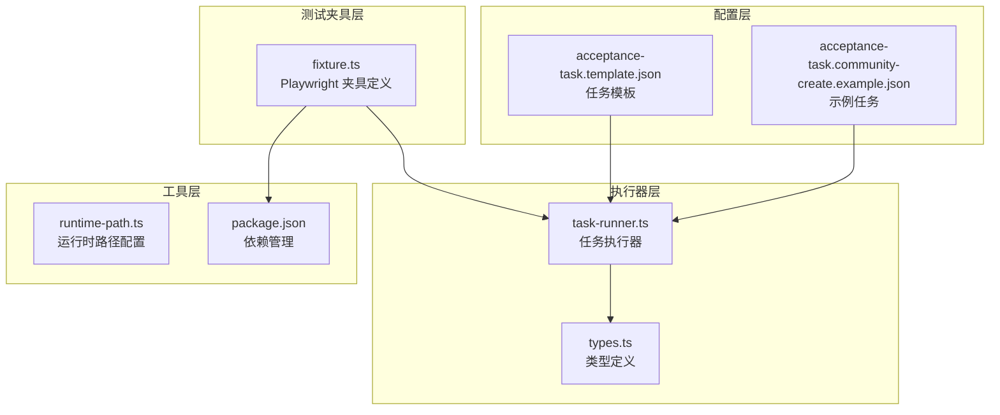
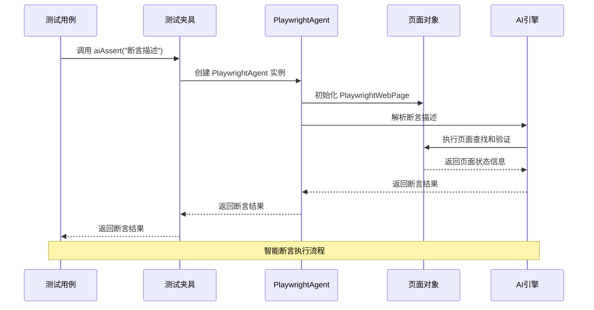
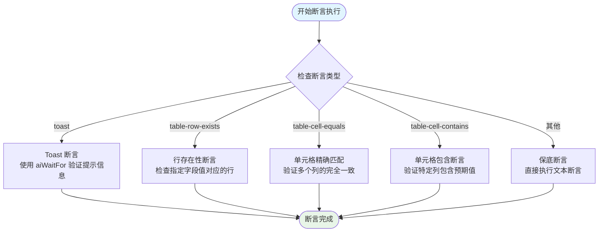
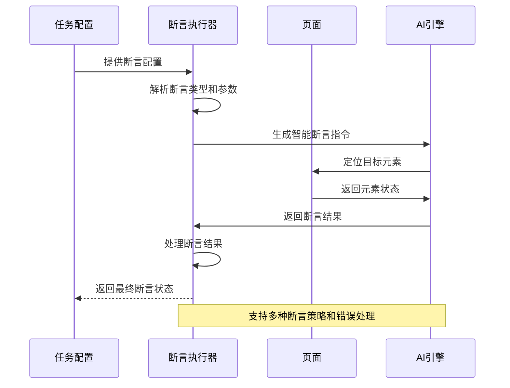
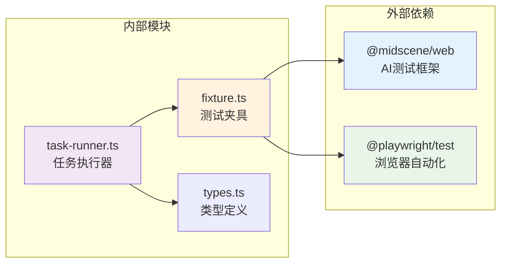
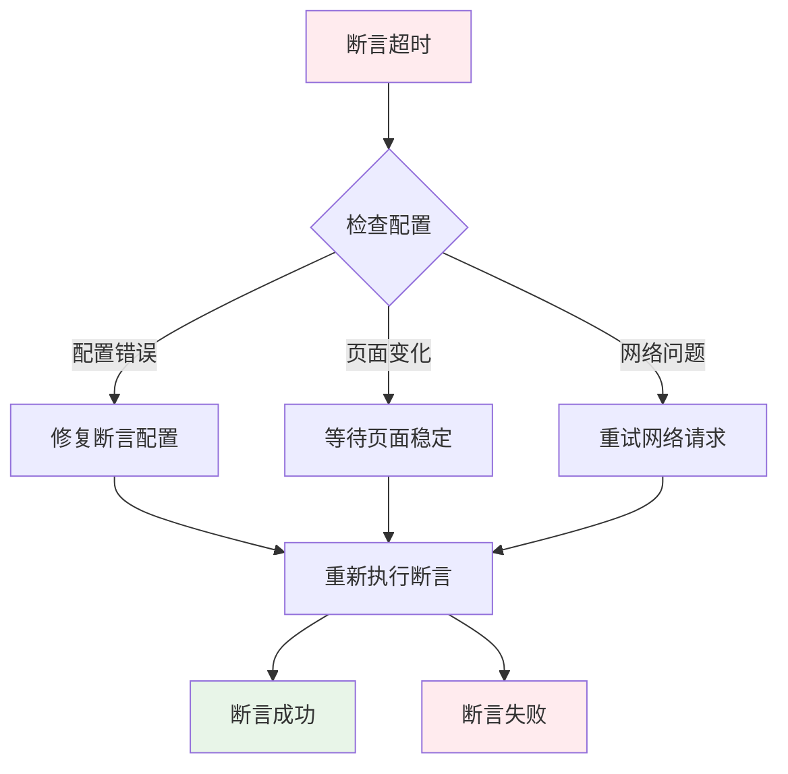

# aiAssert 断言方法

<cite>
**本文档引用的文件**
- [fixture.ts](file://tests/fixture/fixture.ts)
- [task-runner.ts](file://src/stage2/task-runner.ts)
- [types.ts](file://src/stage2/types.ts)
- [acceptance-task.template.json](file://specs/tasks/acceptance-task.template.json)
- [acceptance-task.community-create.example.json](file://specs/tasks/acceptance-task.community-create.example.json)
- [README.md](file://README.md)
- [package.json](file://package.json)
</cite>

## 目录
1. [简介](#简介)
2. [项目结构](#项目结构)
3. [核心组件](#核心组件)
4. [架构概览](#架构概览)
5. [详细组件分析](#详细组件分析)
6. [依赖分析](#依赖分析)
7. [性能考虑](#性能考虑)
8. [故障排除指南](#故障排除指南)
9. [结论](#结论)
10. [附录](#附录)

## 简介

aiAssert 是本测试框架中的核心断言方法，它提供了智能化的页面状态验证能力。该方法通过自然语言描述来执行复杂的断言逻辑，能够智能识别和验证页面上的各种元素状态，包括提示信息、表格数据、表单状态等。

在本项目中，aiAssert 作为 Playwright 测试夹具的一部分，被设计为一个强大的自动化断言工具，能够理解人类可读的断言描述，并将其转换为精确的页面验证操作。

## 项目结构

该项目采用模块化架构，主要包含以下关键组件：



**图表来源**
- [fixture.ts](file://tests/fixture/fixture.ts#L23-L99)
- [task-runner.ts](file://src/stage2/task-runner.ts#L1062-L1343)
- [types.ts](file://src/stage2/types.ts#L58-L98)

**章节来源**
- [README.md](file://README.md#L90-L144)
- [package.json](file://package.json#L1-L24)

## 核心组件

### aiAssert 方法定义

aiAssert 方法在测试夹具中被定义为一个异步函数，具有以下签名：

```typescript
aiAssert: async ({ page }, use, testInfo) => {
  const agent = new PlaywrightAgent(new PlaywrightWebPage(page), {
    testId: `playwright-${safeCacheId}`,
    cacheId: safeCacheId,
    groupName: testInfo.title,
    groupDescription: testInfo.file,
    generateReport: true,
    autoPrintReportMsg: false,
  });
  await use(async (assertion: string, errorMsg?: string) => {
    return agent.aiAssert(assertion, errorMsg);
  });
}
```

### 断言类型系统

系统支持多种断言类型，每种类型都有特定的配置要求：

| 断言类型 | 描述 | 必需字段 | 使用场景 |
|---------|------|----------|----------|
| toast | 验证页面提示信息 | expectedText | 验证操作成功/失败提示 |
| table-row-exists | 验证表格行存在性 | matchField | 验证新增数据是否出现在列表中 |
| table-cell-equals | 验证表格单元格精确匹配 | matchField, expectedColumns | 验证多个列的完整数据一致性 |
| table-cell-contains | 验证表格单元格包含关系 | matchField, column, expectedFromField | 验证特定列包含预期值 |

**章节来源**
- [fixture.ts](file://tests/fixture/fixture.ts#L71-L84)
- [types.ts](file://src/stage2/types.ts#L58-L65)

## 架构概览

aiAssert 的整体架构采用分层设计，确保了断言逻辑的可扩展性和可维护性：



**图表来源**
- [fixture.ts](file://tests/fixture/fixture.ts#L71-L84)
- [task-runner.ts](file://src/stage2/task-runner.ts#L1020-L1060)

## 详细组件分析

### 断言执行器 (runAssertion)

断言执行器是 aiAssert 的核心实现，负责将配置化的断言转换为实际的页面验证操作：



**图表来源**
- [task-runner.ts](file://src/stage2/task-runner.ts#L1020-L1060)

### 断言配置详解

#### 基础断言配置

每个断言都遵循统一的配置模式：

```json
{
  "type": "断言类型",
  "expectedText": "期望的提示文本",
  "matchField": "用于匹配的字段名",
  "expectedColumns": ["期望匹配的列名数组"],
  "column": "目标列名",
  "expectedFromField": "包含期望值的字段名"
}
```

#### 具体断言类型配置

**Toast 提示断言**
```json
{
  "type": "toast",
  "expectedText": "操作成功"
}
```

**表格行存在断言**
```json
{
  "type": "table-row-exists",
  "matchField": "小区名称"
}
```

**表格单元格精确匹配断言**
```json
{
  "type": "table-cell-equals",
  "matchField": "小区名称",
  "expectedColumns": ["小区名称", "所在地区", "详细地址"]
}
```

**表格单元格包含断言**
```json
{
  "type": "table-cell-contains",
  "matchField": "小区名称",
  "column": "所在地区",
  "expectedFromField": "省市区"
}
```

**章节来源**
- [types.ts](file://src/stage2/types.ts#L58-L65)
- [acceptance-task.template.json](file://specs/tasks/acceptance-task.template.json#L58-L67)
- [acceptance-task.community-create.example.json](file://specs/tasks/acceptance-task.community-create.example.json#L140-L166)

### 断言执行流程

aiAssert 的执行流程体现了智能断言的核心理念：



**图表来源**
- [task-runner.ts](file://src/stage2/task-runner.ts#L1020-L1060)

## 依赖分析

### 核心依赖关系



**图表来源**
- [package.json](file://package.json#L13-L22)
- [fixture.ts](file://tests/fixture/fixture.ts#L1-L10)
- [task-runner.ts](file://src/stage2/task-runner.ts#L1062-L1068)

### 版本兼容性

项目使用的依赖版本确保了功能的稳定性和兼容性：

- `@midscene/web`: ^0.9.2 - AI测试框架核心
- `@playwright/test`: ^1.56.1 - 浏览器自动化测试框架
- `@types/node`: ^22.10.5 - Node.js 类型定义

**章节来源**
- [package.json](file://package.json#L13-L22)

## 性能考虑

### 断言执行优化

1. **智能等待机制**: 使用 `aiWaitFor` 实现智能等待，避免固定延迟
2. **批量断言处理**: 支持多个断言的顺序执行和错误聚合
3. **缓存策略**: 利用 `cacheId` 机制减少重复初始化开销
4. **报告生成**: 自动化的测试报告生成，便于性能分析

### 内存管理

- 使用 `sanitizeCacheId` 函数清理缓存标识符
- 合理的资源释放策略，避免内存泄漏
- 测试结束后自动清理临时文件

## 故障排除指南

### 常见断言失败场景

#### 断言超时问题

当断言在指定时间内无法满足条件时，系统会抛出详细的错误信息：



#### 错误信息格式

断言失败时返回的标准错误格式包含以下信息：
- 错误类型：断言失败
- 失败原因：具体断言描述
- 页面状态：当前页面截图和状态
- 时间戳：断言执行时间

### 调试技巧

1. **启用详细日志**: 设置 `autoPrintReportMsg: false` 获取更多调试信息
2. **截图记录**: 利用 `screenshotOnStep` 功能捕获断言失败时的页面状态
3. **逐步调试**: 将复杂断言拆分为多个简单断言进行调试
4. **环境隔离**: 使用独立的测试环境避免数据干扰

**章节来源**
- [task-runner.ts](file://src/stage2/task-runner.ts#L1132-L1148)

## 结论

aiAssert 断言方法代表了现代测试自动化的一个重要发展方向，它将人工智能技术与传统的测试断言相结合，提供了更加智能和灵活的验证能力。

通过本文档的分析，我们可以看到 aiAssert 在以下方面具有显著优势：

1. **智能化程度高**: 能够理解自然语言描述并转换为精确的页面验证
2. **扩展性强**: 支持多种断言类型和自定义断言策略
3. **易用性好**: 简洁的 API 设计和丰富的配置选项
4. **可靠性强**: 完善的错误处理和调试机制

随着测试需求的不断增长和技术的发展，aiAssert 有望成为测试自动化领域的重要工具。

## 附录

### 最佳实践建议

1. **断言设计原则**
   - 使用清晰明确的断言描述
   - 避免过于复杂的断言组合
   - 优先使用具体的断言类型而非通用断言

2. **性能优化建议**
   - 合理设置断言超时时间
   - 避免不必要的页面等待
   - 使用批量断言提高执行效率

3. **维护性考虑**
   - 保持断言配置的一致性
   - 定期更新过时的断言规则
   - 建立断言变更的审查流程

### 常用断言场景

1. **表单提交验证**: 使用 toast 断言验证提交结果
2. **数据列表验证**: 使用 table-row-exists 验证新增数据
3. **数据完整性验证**: 使用 table-cell-equals 验证多字段一致性
4. **数据关联验证**: 使用 table-cell-contains 验证字段间的关联关系