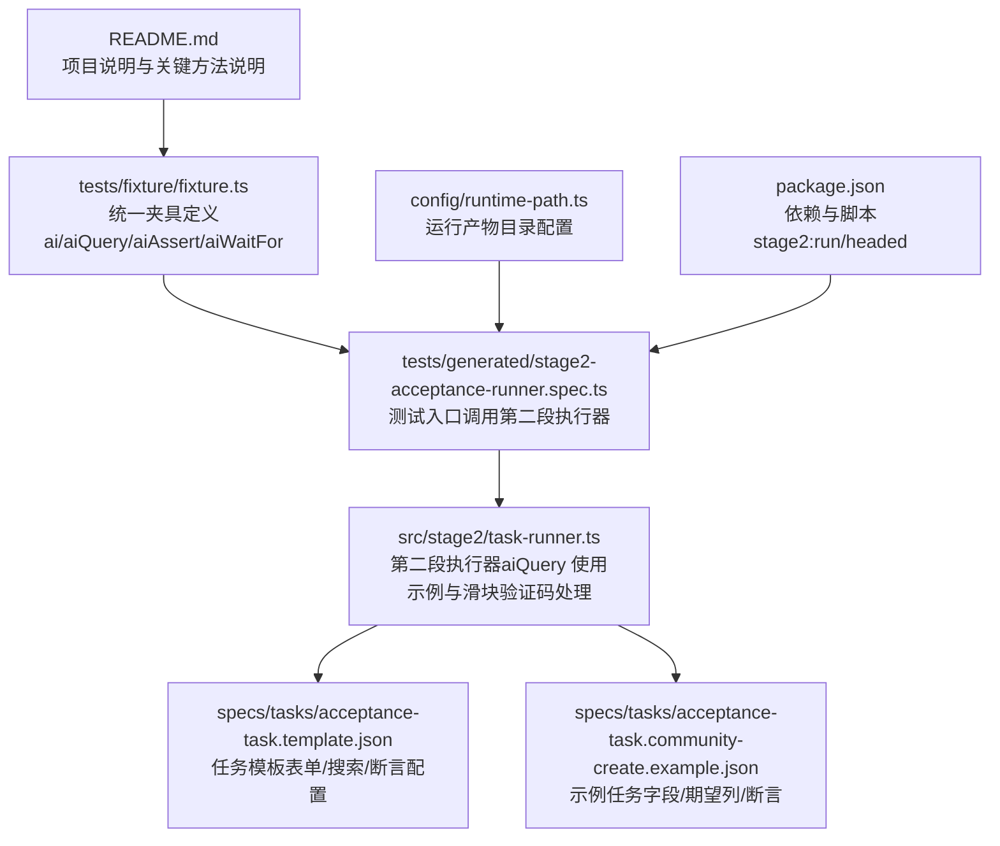
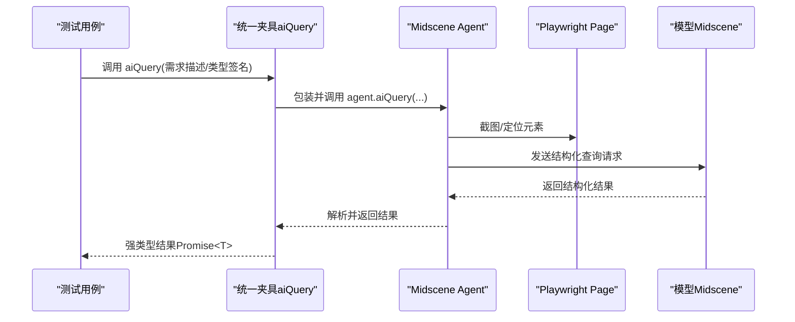
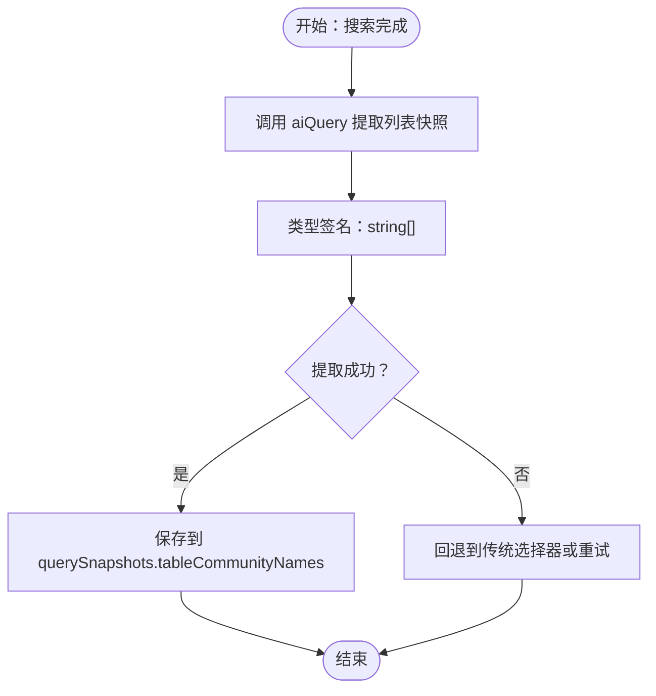
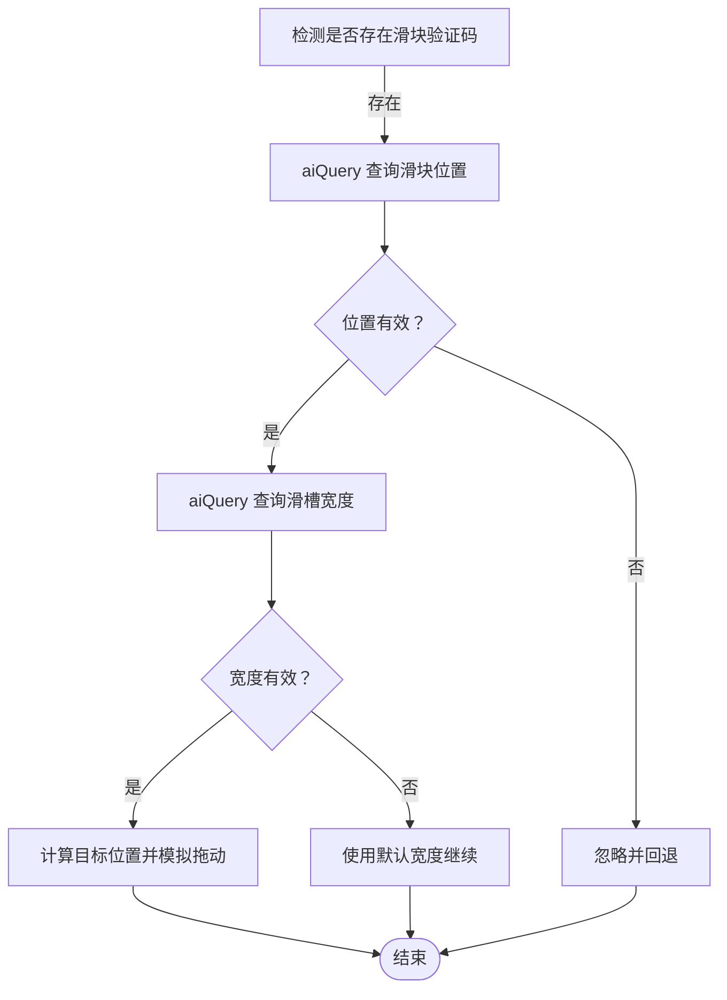
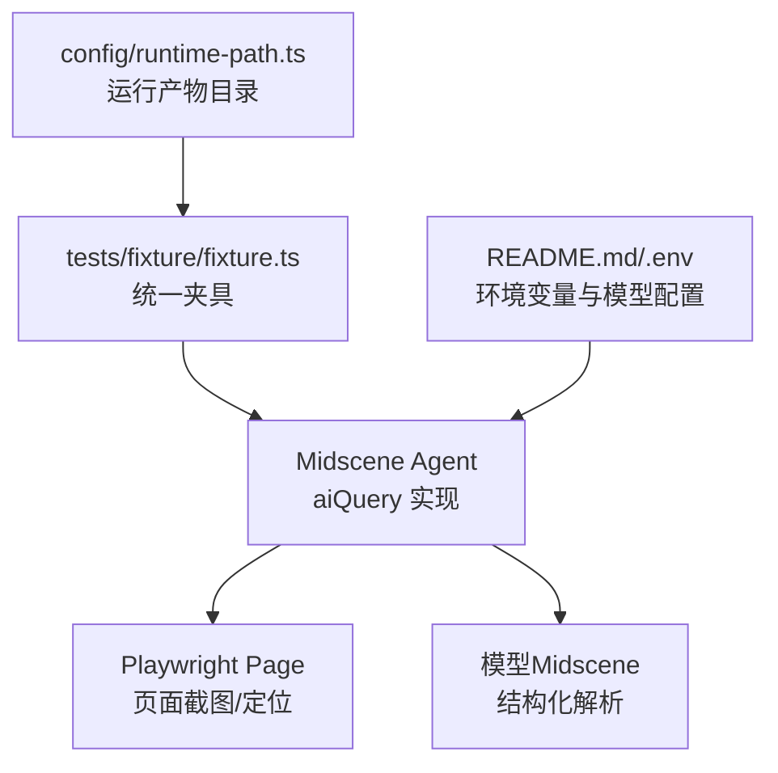

# aiQuery 查询方法

<cite>
**本文引用的文件**
- [README.md](file://README.md)
- [package.json](file://package.json)
- [config/runtime-path.ts](file://config/runtime-path.ts)
- [tests/fixture/fixture.ts](file://tests/fixture/fixture.ts)
- [tests/generated/stage2-acceptance-runner.spec.ts](file://tests/generated/stage2-acceptance-runner.spec.ts)
- [src/stage2/task-runner.ts](file://src/stage2/task-runner.ts)
- [specs/tasks/acceptance-task.template.json](file://specs/tasks/acceptance-task.template.json)
- [specs/tasks/acceptance-task.community-create.example.json](file://specs/tasks/acceptance-task.community-create.example.json)
</cite>

## 目录
1. [简介](#简介)
2. [项目结构](#项目结构)
3. [核心组件](#核心组件)
4. [架构概览](#架构概览)
5. [详细组件分析](#详细组件分析)
6. [依赖关系分析](#依赖关系分析)
7. [性能考虑](#性能考虑)
8. [故障排查指南](#故障排查指南)
9. [结论](#结论)
10. [附录](#附录)

## 简介
本文件围绕 aiQuery 查询方法进行系统化文档化，重点说明其在页面元素查询、数据提取与信息检索方面的功能特性，涵盖参数配置、返回格式、使用示例、性能优化与错误处理策略，并给出实际应用场景与最佳实践。该方法基于 Midscene 的 Playwright 集成能力，在本项目中通过统一的测试夹具暴露，用于从页面中提取结构化数据，支撑第二段任务执行与断言。

## 项目结构
该项目是一个基于 Playwright 与 Midscene.js 的 AI 自动化测试项目，核心围绕第二段任务执行器与统一夹具展开。aiQuery 作为统一夹具的一部分，贯穿于任务执行流程中的数据提取环节。

图表来源
- [README.md](file://README.md#L100-L105)
- [tests/fixture/fixture.ts](file://tests/fixture/fixture.ts#L23-L99)
- [tests/generated/stage2-acceptance-runner.spec.ts](file://tests/generated/stage2-acceptance-runner.spec.ts#L1-L39)
- [src/stage2/task-runner.ts](file://src/stage2/task-runner.ts#L1-L200)
- [specs/tasks/acceptance-task.template.json](file://specs/tasks/acceptance-task.template.json#L1-L85)
- [specs/tasks/acceptance-task.community-create.example.json](file://specs/tasks/acceptance-task.community-create.example.json#L1-L184)
- [config/runtime-path.ts](file://config/runtime-path.ts#L1-L41)
- [package.json](file://package.json#L6-L9)

章节来源
- [README.md](file://README.md#L1-L144)
- [package.json](file://package.json#L1-L24)

## 核心组件
- aiQuery 夹具：在测试夹具中以统一接口暴露，内部委托给 Midscene 的 Playwright Agent 实现页面结构化数据提取。
- 第二段执行器：在任务执行流程中多次使用 aiQuery 提取页面数据，例如滑块验证码位置、列表快照等。
- 统一夹具：提供 ai、aiQuery、aiAssert、aiWaitFor 等能力，便于在测试中统一使用 AI 能力。
- 任务模板与示例：定义了表单字段、搜索条件、期望列与断言，为 aiQuery 的使用提供上下文。

章节来源
- [tests/fixture/fixture.ts](file://tests/fixture/fixture.ts#L23-L99)
- [src/stage2/task-runner.ts](file://src/stage2/task-runner.ts#L1-L200)
- [specs/tasks/acceptance-task.template.json](file://specs/tasks/acceptance-task.template.json#L1-L85)
- [specs/tasks/acceptance-task.community-create.example.json](file://specs/tasks/acceptance-task.community-create.example.json#L1-L184)

## 架构概览
aiQuery 在项目中的工作流如下：测试夹具初始化 Midscene Agent，aiQuery 将用户需求转换为结构化查询请求，Agent 结合页面截图与模型能力输出结构化结果，最终由调用方以强类型接收。

图表来源
- [tests/fixture/fixture.ts](file://tests/fixture/fixture.ts#L57-L69)
- [src/stage2/task-runner.ts](file://src/stage2/task-runner.ts#L507-L535)

## 详细组件分析

### aiQuery 方法概述
- 方法定位：在统一夹具中通过 `aiQuery` 暴露，内部委托给 Midscene 的 Playwright Agent。
- 输入参数：支持字符串形式的需求描述，以及可选的类型签名（泛型），用于约束返回值结构。
- 返回值：Promise<T>，T 由调用方指定，常见用法包括对象字面量、数组、字符串等。
- 错误处理：调用方应捕获异常并进行降级处理（如回退到传统选择器或重试）。

章节来源
- [tests/fixture/fixture.ts](file://tests/fixture/fixture.ts#L57-L69)
- [README.md](file://README.md#L100-L105)

### 参数配置与类型签名
- 需求描述：以自然语言描述要提取的数据，例如“提取当前列表前10行的小区名称”“分析滑块验证码位置并返回坐标”。
- 类型签名：通过泛型约束返回值结构，如 `{ found: boolean, x: number, y: number, width: number, height: number }` 或 `string[]`。
- 环境与缓存：夹具初始化时设置测试 ID、缓存 ID、分组信息与报告生成开关，有助于提升稳定性与可追踪性。

章节来源
- [tests/fixture/fixture.ts](file://tests/fixture/fixture.ts#L57-L69)
- [tests/fixture/fixture.ts](file://tests/fixture/fixture.ts#L24-L56)

### 数据提取与信息检索能力
- 页面元素查询：结合 Playwright 的定位器能力与 Midscene 的视觉理解，实现对可见元素的精准定位与提取。
- 结构化数据：支持返回对象字面量、数组、字符串等，满足不同业务场景的数据抽取需求。
- 上下文感知：通过任务模板与示例任务，aiQuery 的使用场景覆盖表单字段、搜索结果、断言依据等。

章节来源
- [src/stage2/task-runner.ts](file://src/stage2/task-runner.ts#L507-L535)
- [src/stage2/task-runner.ts](file://src/stage2/task-runner.ts#L1305-L1310)
- [specs/tasks/acceptance-task.template.json](file://specs/tasks/acceptance-task.template.json#L29-L57)
- [specs/tasks/acceptance-task.community-create.example.json](file://specs/tasks/acceptance-task.community-create.example.json#L104-L139)

### 使用示例与场景

#### 示例一：提取列表快照
- 场景：在搜索后提取列表前若干行的关键字段，用于断言与回查。
- 关键点：使用类型签名约束返回值为字符串数组；在任务执行器中以 aiQuery 获取结果并记录到快照中。

图表来源
- [src/stage2/task-runner.ts](file://src/stage2/task-runner.ts#L1305-L1310)

章节来源
- [src/stage2/task-runner.ts](file://src/stage2/task-runner.ts#L1305-L1310)

#### 示例二：滑块验证码位置与轨道宽度查询
- 场景：在登录页自动处理滑块验证码，需要先查询滑块按钮位置与滑槽宽度。
- 关键点：分别调用 aiQuery 返回坐标与宽度；对缺失字段提供默认值；异常时忽略并回退。

图表来源
- [src/stage2/task-runner.ts](file://src/stage2/task-runner.ts#L480-L498)
- [src/stage2/task-runner.ts](file://src/stage2/task-runner.ts#L507-L535)
- [src/stage2/task-runner.ts](file://src/stage2/task-runner.ts#L537-L556)

章节来源
- [src/stage2/task-runner.ts](file://src/stage2/task-runner.ts#L480-L556)

### 查询结果的数据结构与处理方式
- 对象字面量：常用于返回坐标、布尔判断与元信息，如 `{ found: boolean, x: number, y: number, width: number, height: number }`。
- 数组：适用于批量数据提取，如列表快照、匹配项集合等。
- 字符串：适用于简单文本提取或标识性信息。
- 处理策略：对缺失字段提供默认值；对异常进行捕获与降级；必要时回退到 Playwright 原生定位器。

章节来源
- [src/stage2/task-runner.ts](file://src/stage2/task-runner.ts#L507-L535)
- [src/stage2/task-runner.ts](file://src/stage2/task-runner.ts#L537-L556)
- [src/stage2/task-runner.ts](file://src/stage2/task-runner.ts#L1305-L1310)

### 查询性能优化技巧
- 合理拆分步骤：将复杂流程拆分为多个小步骤，每个步骤聚焦单一目标，减少单次 aiQuery 的负担。
- 选择合适的目标：优先使用可见元素与明确的上下文，避免模糊匹配导致的高耗时与不确定性。
- 缓存与报告：夹具启用报告与缓存机制，有助于复用中间结果与加速后续执行。
- 重试与容错：对不稳定场景增加重试与降级逻辑，避免因单次失败影响整体流程。

章节来源
- [.tasks/AI自主代理验收系统开发改造方案_2026-03-11.md](file://.tasks/AI自主代理验收系统开发改造方案_2026-03-11.md#L60-L84)
- [tests/fixture/fixture.ts](file://tests/fixture/fixture.ts#L24-L56)

## 依赖关系分析
aiQuery 的依赖链路主要涉及测试夹具、Midscene Agent、Playwright Page 与模型服务。运行产物目录由环境变量控制，统一收敛到 t_runtime/ 下。

图表来源
- [tests/fixture/fixture.ts](file://tests/fixture/fixture.ts#L57-L69)
- [config/runtime-path.ts](file://config/runtime-path.ts#L1-L41)
- [README.md](file://README.md#L39-L52)

章节来源
- [tests/fixture/fixture.ts](file://tests/fixture/fixture.ts#L57-L69)
- [config/runtime-path.ts](file://config/runtime-path.ts#L1-L41)
- [README.md](file://README.md#L39-L52)

## 性能考虑
- 步骤拆分：将长流程拆分为多个短步骤，降低单次 AI 推理成本与失败概率。
- 上下文精简：在需求描述中明确目标与范围，减少无关元素干扰。
- 缓存利用：启用夹具的缓存与报告机制，避免重复计算与截图。
- 超时与重试：为关键步骤设置合理超时与重试策略，提升鲁棒性。

章节来源
- [.tasks/AI自主代理验收系统开发改造方案_2026-03-11.md](file://.tasks/AI自主代理验收系统开发改造方案_2026-03-11.md#L60-L84)
- [tests/fixture/fixture.ts](file://tests/fixture/fixture.ts#L24-L56)

## 故障排查指南
- aiQuery 返回空或结构不匹配：检查需求描述是否清晰，类型签名是否与预期一致；对缺失字段提供默认值。
- 滑块验证码识别失败：确认环境变量配置（如模型与 API Key）、截图质量与页面稳定性；必要时切换为手动模式。
- 运行产物目录异常：检查 .env 中的目录变量与 config/runtime-path.ts 的解析逻辑，确保路径正确且可写。
- 任务执行失败：查看第二段结果目录下的 report 与截图，定位失败步骤并分析原因。

章节来源
- [README.md](file://README.md#L39-L52)
- [README.md](file://README.md#L74-L92)
- [config/runtime-path.ts](file://config/runtime-path.ts#L1-L41)
- [tests/generated/stage2-acceptance-runner.spec.ts](file://tests/generated/stage2-acceptance-runner.spec.ts#L27-L36)

## 结论
aiQuery 作为本项目中统一夹具的核心能力之一，提供了强大的页面结构化数据提取能力。通过清晰的需求描述与类型签名约束，结合 Midscene 的视觉理解与模型解析，能够在复杂的动态页面中稳定地获取所需信息。配合合理的步骤拆分、缓存与报告机制，以及完善的错误处理策略，aiQuery 能够在实际业务场景中发挥重要作用，支撑从表单填写、搜索查询到断言验证的全链路自动化。

## 附录
- 运行与调试：可通过 npm scripts 启动第二段执行器，观察 Midscene 报告与 Playwright 截图，定位问题。
- 任务模板：参考任务模板与示例任务，完善字段、搜索与断言配置，提升 aiQuery 的使用效果。

章节来源
- [package.json](file://package.json#L6-L9)
- [README.md](file://README.md#L106-L132)
- [specs/tasks/acceptance-task.template.json](file://specs/tasks/acceptance-task.template.json#L1-L85)
- [specs/tasks/acceptance-task.community-create.example.json](file://specs/tasks/acceptance-task.community-create.example.json#L1-L184)