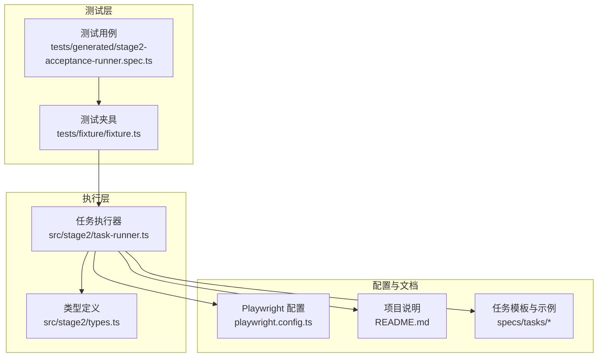
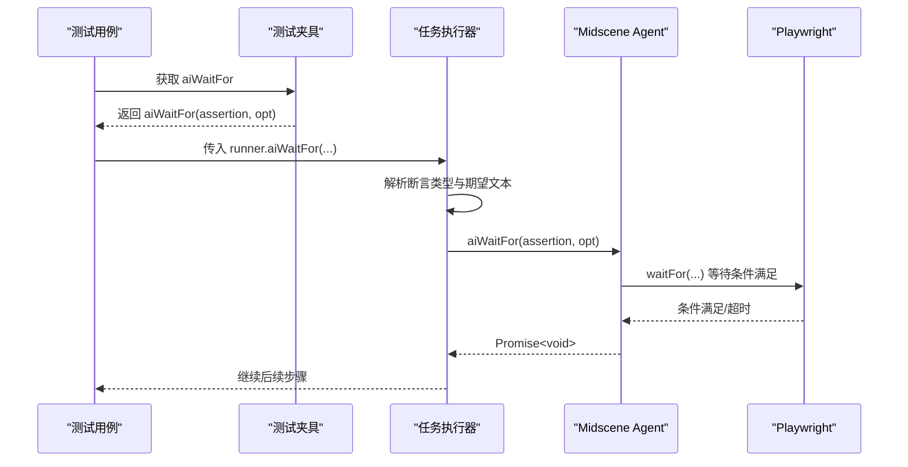
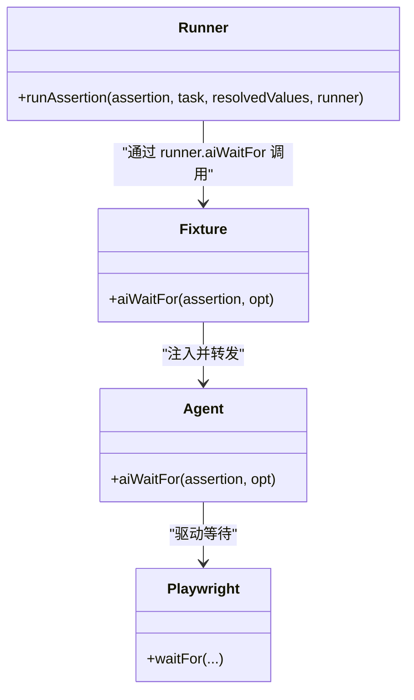

# aiWaitFor 等待方法

<cite>
**本文引用的文件**
- [README.md](file://README.md)
- [playwright.config.ts](file://playwright.config.ts)
- [src/stage2/task-runner.ts](file://src/stage2/task-runner.ts)
- [src/stage2/types.ts](file://src/stage2/types.ts)
- [tests/fixture/fixture.ts](file://tests/fixture/fixture.ts)
- [tests/generated/stage2-acceptance-runner.spec.ts](file://tests/generated/stage2-acceptance-runner.spec.ts)
- [specs/tasks/acceptance-task.template.json](file://specs/tasks/acceptance-task.template.json)
- [specs/tasks/acceptance-task.community-create.example.json](file://specs/tasks/acceptance-task.community-create.example.json)
</cite>

## 目录
1. [简介](#简介)
2. [项目结构](#项目结构)
3. [核心组件](#核心组件)
4. [架构概览](#架构概览)
5. [详细组件分析](#详细组件分析)
6. [依赖关系分析](#依赖关系分析)
7. [性能考量](#性能考量)
8. [故障排除指南](#故障排除指南)
9. [结论](#结论)
10. [附录](#附录)

## 简介
本文件围绕 aiWaitFor 等待方法进行系统化说明，重点阐述其在异步操作处理中的关键作用、等待条件配置、超时与重试机制、等待策略优化与性能考虑，并提供常见等待场景与故障排除指南。aiWaitFor 作为 Midscene AI 夹具的一部分，通过自然语言描述等待条件，驱动 Playwright 完成页面状态的等待与断言，广泛应用于动态内容加载、页面跳转完成、提示信息出现等场景。

## 项目结构
该项目采用 Playwright + Midscene.js 的组合，围绕“第二段任务执行器”构建自动化验收流程。关键结构包括：
- 测试夹具：封装 ai、aiQuery、aiAssert、aiWaitFor 等 AI 能力，统一注入到测试用例。
- 任务执行器：解析 JSON 任务，按步骤驱动页面交互、等待、断言与清理。
- 配置与运行：通过环境变量控制验证码处理模式、等待超时、输出目录等。

图表来源
- [tests/generated/stage2-acceptance-runner.spec.ts](file://tests/generated/stage2-acceptance-runner.spec.ts#L1-L39)
- [tests/fixture/fixture.ts](file://tests/fixture/fixture.ts#L1-L100)
- [src/stage2/task-runner.ts](file://src/stage2/task-runner.ts#L1-L1344)
- [src/stage2/types.ts](file://src/stage2/types.ts#L1-L125)
- [playwright.config.ts](file://playwright.config.ts#L1-L95)
- [README.md](file://README.md#L1-L144)
- [specs/tasks/acceptance-task.template.json](file://specs/tasks/acceptance-task.template.json#L1-L85)
- [specs/tasks/acceptance-task.community-create.example.json](file://specs/tasks/acceptance-task.community-create.example.json#L1-L184)

章节来源
- [README.md](file://README.md#L1-L144)
- [playwright.config.ts](file://playwright.config.ts#L1-L95)
- [tests/generated/stage2-acceptance-runner.spec.ts](file://tests/generated/stage2-acceptance-runner.spec.ts#L1-L39)
- [tests/fixture/fixture.ts](file://tests/fixture/fixture.ts#L1-L100)
- [src/stage2/task-runner.ts](file://src/stage2/task-runner.ts#L1-L1344)
- [src/stage2/types.ts](file://src/stage2/types.ts#L1-L125)
- [specs/tasks/acceptance-task.template.json](file://specs/tasks/acceptance-task.template.json#L1-L85)
- [specs/tasks/acceptance-task.community-create.example.json](file://specs/tasks/acceptance-task.community-create.example.json#L1-L184)

## 核心组件
- aiWaitFor 夹具：在测试夹具中注入，通过 Midscene Agent 将自然语言等待条件转换为 Playwright 等待动作。
- 任务执行器：在断言阶段调用 aiWaitFor，等待特定 UI 文本出现，确保后续断言与业务流程的稳定性。
- 类型系统：定义任务结构、运行时参数（如 stepTimeoutMs、pageTimeoutMs），为等待策略提供配置入口。
- 验证码处理：在登录后自动检测滑块验证码，必要时等待其消失，体现等待策略在复杂场景中的应用。

章节来源
- [tests/fixture/fixture.ts](file://tests/fixture/fixture.ts#L85-L98)
- [src/stage2/task-runner.ts](file://src/stage2/task-runner.ts#L1020-L1060)
- [src/stage2/types.ts](file://src/stage2/types.ts#L73-L78)

## 架构概览
aiWaitFor 的调用链路如下：测试用例通过夹具获取 aiWaitFor，将其传入任务执行器；执行器在断言阶段根据断言类型选择等待策略，最终由 Midscene Agent 驱动 Playwright 完成等待。

图表来源
- [tests/generated/stage2-acceptance-runner.spec.ts](file://tests/generated/stage2-acceptance-runner.spec.ts#L12-L26)
- [tests/fixture/fixture.ts](file://tests/fixture/fixture.ts#L85-L98)
- [src/stage2/task-runner.ts](file://src/stage2/task-runner.ts#L1020-L1060)

## 详细组件分析

### aiWaitFor 方法概述
- 功能定位：以自然语言描述等待条件，交由 Midscene Agent 转换为 Playwright 等待逻辑，常用于等待动态内容加载、提示信息出现、页面跳转完成等。
- 关键特性：
  - 基于自然语言的等待条件描述，降低对具体选择器的依赖。
  - 与断言流程无缝衔接，提升验收测试的可维护性。
  - 支持超时控制与重试策略（由底层 Agent 与 Playwright 驱动）。

章节来源
- [tests/fixture/fixture.ts](file://tests/fixture/fixture.ts#L85-L98)
- [src/stage2/task-runner.ts](file://src/stage2/task-runner.ts#L1020-L1060)

### 等待条件配置选项
- 文本出现等待：断言类型为 toast 时，等待页面出现指定提示文本。
- 页面跳转完成：结合页面加载状态与可见文本，确保导航后 UI 稳定。
- 数据加载完成：通过断言检查列表行/单元格内容，间接验证数据渲染完成。
- 验证码处理：在登录后等待滑块验证码消失，体现复杂等待策略。

章节来源
- [src/stage2/task-runner.ts](file://src/stage2/task-runner.ts#L1020-L1060)
- [src/stage2/task-runner.ts](file://src/stage2/task-runner.ts#L450-L464)
- [src/stage2/task-runner.ts](file://src/stage2/task-runner.ts#L647-L703)

### 实用代码示例（路径指引）
- 在断言阶段等待提示文本出现：
  - 示例路径：[runAssertion 中的 toast 等待](file://src/stage2/task-runner.ts#L1026-L1028)
- 在登录后等待首页加载与菜单可见：
  - 示例路径：[等待首页加载与菜单可见](file://src/stage2/task-runner.ts#L1174-L1202)
- 在登录后等待验证码消失：
  - 示例路径：[验证码处理循环等待](file://src/stage2/task-runner.ts#L686-L702)

章节来源
- [src/stage2/task-runner.ts](file://src/stage2/task-runner.ts#L1020-L1219)

### 超时设置与重试机制
- 超时设置：
  - 步骤级超时：来自任务运行时配置，影响单步等待与交互超时。
  - 页面级超时：来自任务运行时配置，影响页面导航与加载等待。
  - Playwright 全局超时：由 Playwright 配置决定整体测试超时。
- 重试机制：
  - Playwright 层面：全局重试次数由配置控制，CI 环境启用重试。
  - 验证码自动处理：在自动模式下，失败时进行有限次数重试。
  - 循环等待：在验证码等待场景中，定期轮询直到超时。

章节来源
- [src/stage2/types.ts](file://src/stage2/types.ts#L73-L78)
- [playwright.config.ts](file://playwright.config.ts#L25-L34)
- [src/stage2/task-runner.ts](file://src/stage2/task-runner.ts#L667-L679)
- [src/stage2/task-runner.ts](file://src/stage2/task-runner.ts#L686-L702)

### 等待策略优化与性能考虑
- 选择合适的等待条件：优先使用可稳定识别的 UI 文本或状态，减少对不稳定选择器的依赖。
- 合理设置超时：根据页面复杂度与网络状况调整 stepTimeoutMs 与 pageTimeoutMs，避免过短导致误判，过长影响效率。
- 避免过度轮询：在验证码等待等场景中，使用合理的轮询间隔与最大尝试次数，平衡稳定性与性能。
- 结合页面加载状态：在导航后先等待 domcontentloaded，再进行可见文本等待，提高成功率。
- 任务模板中的运行时参数：通过任务 JSON 的 runtime 字段统一管理超时与截图策略，便于批量优化。

章节来源
- [src/stage2/task-runner.ts](file://src/stage2/task-runner.ts#L1174-L1202)
- [specs/tasks/acceptance-task.template.json](file://specs/tasks/acceptance-task.template.json#L78-L83)
- [specs/tasks/acceptance-task.community-create.example.json](file://specs/tasks/acceptance-task.community-create.example.json#L177-L182)

### 常见等待场景
- 动态内容加载完成：等待某个文本或元素在页面中可见，确保后续断言基于稳定状态。
- 页面跳转完成：导航后等待首页文本或菜单项出现，保证页面完全渲染。
- 提示信息出现：等待 toast 或弹窗提示文本出现，验证业务流程成功。
- 验证码处理：等待滑块验证码消失，确保登录流程继续。

章节来源
- [src/stage2/task-runner.ts](file://src/stage2/task-runner.ts#L1020-L1060)
- [src/stage2/task-runner.ts](file://src/stage2/task-runner.ts#L1174-L1202)
- [src/stage2/task-runner.ts](file://src/stage2/task-runner.ts#L647-L703)

## 依赖关系分析
aiWaitFor 的依赖关系主要体现在夹具注入、任务执行器调用与底层 Agent/Playwright 驱动之间。

图表来源
- [tests/fixture/fixture.ts](file://tests/fixture/fixture.ts#L85-L98)
- [src/stage2/task-runner.ts](file://src/stage2/task-runner.ts#L1020-L1060)

章节来源
- [tests/fixture/fixture.ts](file://tests/fixture/fixture.ts#L1-L100)
- [src/stage2/task-runner.ts](file://src/stage2/task-runner.ts#L1020-L1060)

## 性能考量
- 合理设置超时：避免过长超时导致测试耗时增加，过短超时导致误判失败。
- 减少不必要的等待：在导航后先等待页面加载状态，再进行可见文本等待，提高效率。
- 控制轮询频率：验证码等待等场景中，合理设置轮询间隔与最大尝试次数，避免频繁轮询影响性能。
- 使用截图与追踪：在需要时开启截图与追踪，帮助定位问题，但注意控制开销。

## 故障排除指南
- 等待条件不生效：
  - 检查断言类型与期望文本是否准确，确保与页面实际 UI 文本一致。
  - 确认任务运行时超时设置是否足够，必要时增大 stepTimeoutMs/pageTimeoutMs。
- 页面跳转后等待失败：
  - 先等待 domcontentloaded，再进行可见文本等待。
  - 检查首页文本或菜单项是否正确配置。
- 验证码处理失败：
  - 自动模式下，若多次失败，考虑切换为人工模式或调整检测策略。
  - 检查验证码等待超时设置，确保有足够时间完成人工处理。
- 超时与重试：
  - 在 CI 环境中启用重试，观察是否因瞬时网络或页面加载问题导致失败。
  - 根据实际运行情况调整全局超时与步骤超时。

章节来源
- [src/stage2/task-runner.ts](file://src/stage2/task-runner.ts#L1174-L1202)
- [src/stage2/task-runner.ts](file://src/stage2/task-runner.ts#L647-L703)
- [playwright.config.ts](file://playwright.config.ts#L25-L34)

## 结论
aiWaitFor 通过自然语言描述等待条件，与断言流程深度集成，显著提升了验收测试的可维护性与鲁棒性。结合合理的超时设置、重试策略与等待优化，可以在复杂页面与异步场景中稳定地等待关键 UI 状态，保障业务流程的正确性与用户体验。

## 附录
- 任务运行时参数（runtime）：用于统一管理步骤超时、页面超时、截图与追踪等，便于批量优化等待策略。
- 任务模板与示例：提供标准字段与断言配置，便于快速扩展新的等待场景。

章节来源
- [specs/tasks/acceptance-task.template.json](file://specs/tasks/acceptance-task.template.json#L78-L83)
- [specs/tasks/acceptance-task.community-create.example.json](file://specs/tasks/acceptance-task.community-create.example.json#L177-L182)