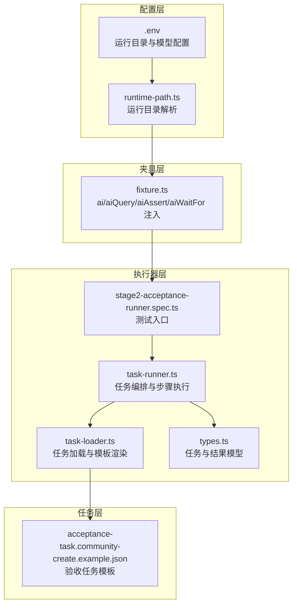
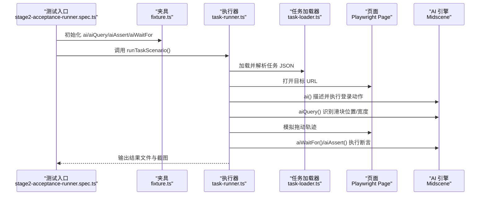
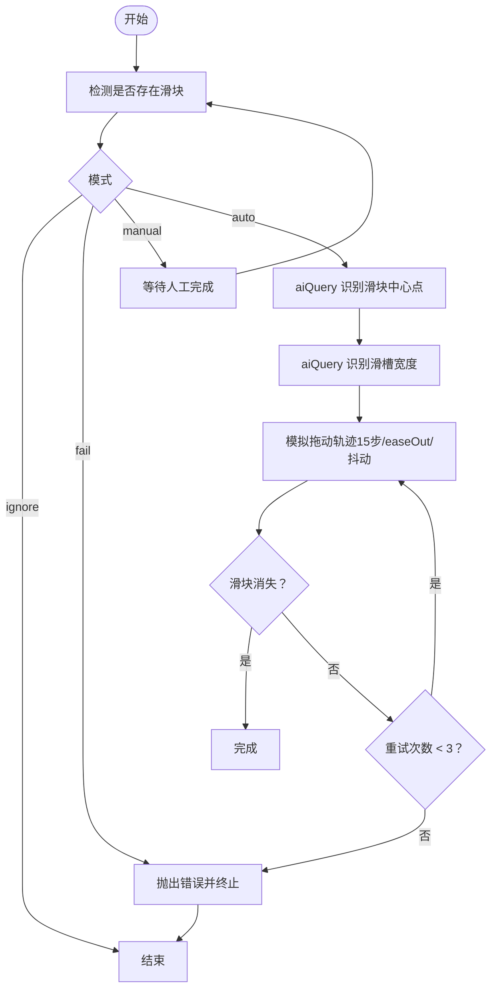
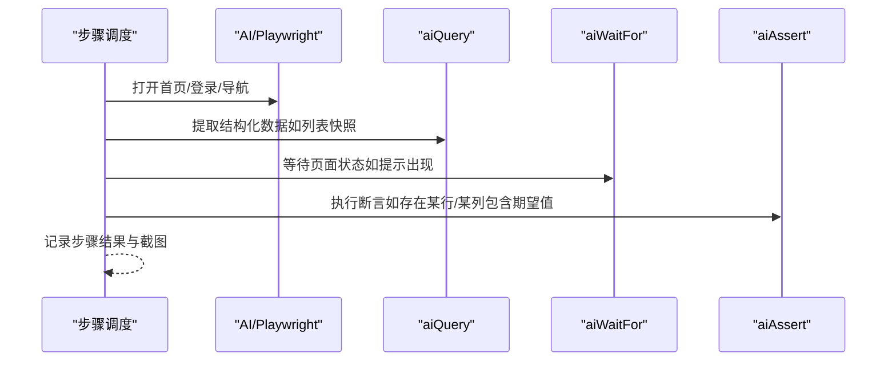
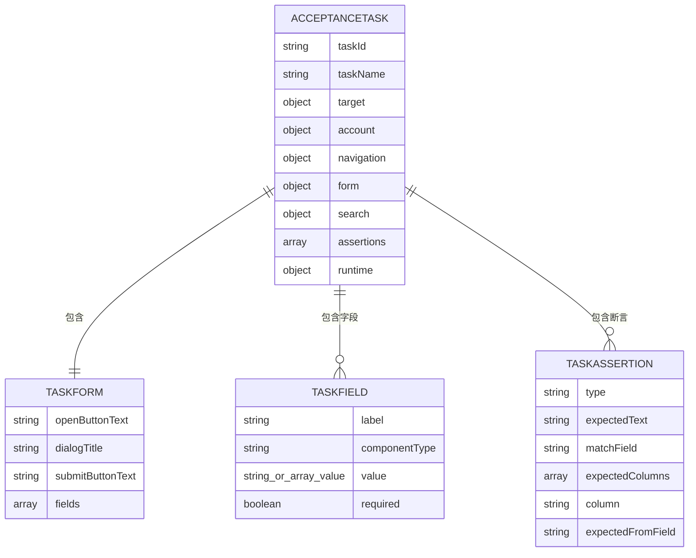
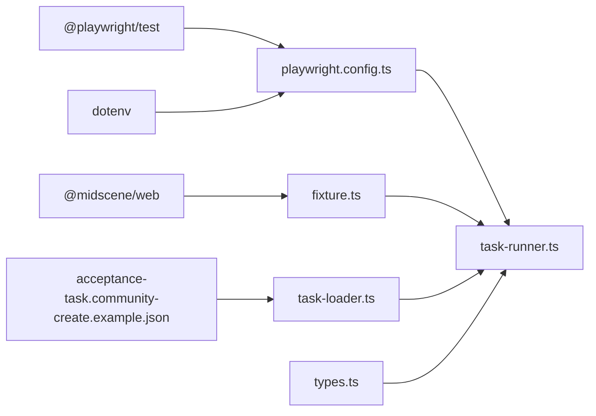

# AI 集成

<cite>
**本文引用的文件**
- [README.md](file://README.md)
- [package.json](file://package.json)
- [playwright.config.ts](file://playwright.config.ts)
- [config/runtime-path.ts](file://config/runtime-path.ts)
- [tests/fixture/fixture.ts](file://tests/fixture/fixture.ts)
- [tests/generated/stage2-acceptance-runner.spec.ts](file://tests/generated/stage2-acceptance-runner.spec.ts)
- [src/stage2/types.ts](file://src/stage2/types.ts)
- [src/stage2/task-loader.ts](file://src/stage2/task-loader.ts)
- [src/stage2/task-runner.ts](file://src/stage2/task-runner.ts)
- [specs/tasks/acceptance-task.community-create.example.json](file://specs/tasks/acceptance-task.community-create.example.json)
</cite>

## 目录
1. [简介](#简介)
2. [项目结构](#项目结构)
3. [核心组件](#核心组件)
4. [架构总览](#架构总览)
5. [组件详解](#组件详解)
6. [依赖关系分析](#依赖关系分析)
7. [性能考量](#性能考量)
8. [故障排查指南](#故障排查指南)
9. [结论](#结论)
10. [附录](#附录)

## 简介
本项目基于 Playwright 与 Midscene.js 构建，形成“AI 驱动”的自动化测试体系。通过在测试夹具中注入 AI 能力（ai、aiQuery、aiAssert、aiWaitFor），结合 JSON 任务驱动的第二段执行器，实现页面元素识别、结构化数据提取与智能断言，覆盖从登录、菜单导航、表单填写、弹窗交互、列表检索到最终断言的完整业务闭环。项目同时内置滑块验证码的 AI 识别与自动拖动处理，支持多种模式（自动、人工、失败即停、忽略）以适配不同环境。

## 项目结构
项目采用“配置-夹具-执行器-任务模板”的分层组织方式：
- 配置层：环境变量与运行目录统一管理
- 夹具层：将 Midscene 的 AI 能力注入到 Playwright 测试上下文
- 执行器层：解析任务 JSON，按步骤编排 AI 与 Playwright 行为
- 任务层：标准化的验收任务模板，定义目标、账户、表单、断言等

图表来源
- [playwright.config.ts](file://playwright.config.ts#L1-L95)
- [config/runtime-path.ts](file://config/runtime-path.ts#L1-L41)
- [tests/fixture/fixture.ts](file://tests/fixture/fixture.ts#L1-L100)
- [tests/generated/stage2-acceptance-runner.spec.ts](file://tests/generated/stage2-acceptance-runner.spec.ts#L1-L39)
- [src/stage2/task-runner.ts](file://src/stage2/task-runner.ts#L1062-L1344)
- [src/stage2/task-loader.ts](file://src/stage2/task-loader.ts#L1-L91)
- [src/stage2/types.ts](file://src/stage2/types.ts#L1-L125)
- [specs/tasks/acceptance-task.community-create.example.json](file://specs/tasks/acceptance-task.community-create.example.json#L1-L184)

章节来源
- [README.md](file://README.md#L1-L144)
- [package.json](file://package.json#L1-L24)
- [playwright.config.ts](file://playwright.config.ts#L1-L95)
- [config/runtime-path.ts](file://config/runtime-path.ts#L1-L41)

## 核心组件
- 运行配置与目录
  - 环境变量集中管理运行目录与模型参数，统一收敛到 t_runtime/ 下，便于产物归档与 CI 复用。
  - Playwright 报告、Midscene 报告、第二段结果与截图均按约定路径输出。
- AI 能力夹具
  - 将 Midscene 的 ai、aiQuery、aiAssert、aiWaitFor 注入到测试上下文，封装缓存与报告生成，保证可追溯性与复用性。
- 任务驱动执行器
  - 解析任务 JSON，按步骤执行：打开首页、登录、处理安全验证、菜单导航、弹窗打开、字段填写、提交、关闭弹窗、搜索、断言等。
  - 支持失败截图、步骤记录、进度文件与最终结果文件输出。
- 任务模板
  - 提供标准化的验收任务结构，包含目标站点、账户信息、导航路径、表单字段、搜索条件、断言类型与运行时参数等。

章节来源
- [README.md](file://README.md#L39-L131)
- [tests/fixture/fixture.ts](file://tests/fixture/fixture.ts#L23-L99)
- [src/stage2/task-runner.ts](file://src/stage2/task-runner.ts#L1062-L1344)
- [src/stage2/types.ts](file://src/stage2/types.ts#L86-L125)
- [specs/tasks/acceptance-task.community-create.example.json](file://specs/tasks/acceptance-task.community-create.example.json#L1-L184)

## 架构总览
整体架构围绕“AI + Playwright”的统一夹具展开，测试入口通过任务驱动执行器串联各步骤，AI 方法负责理解页面、提取结构化数据与断言，Playwright 负责真实 DOM 操作与可视化反馈。

图表来源
- [tests/generated/stage2-acceptance-runner.spec.ts](file://tests/generated/stage2-acceptance-runner.spec.ts#L12-L37)
- [tests/fixture/fixture.ts](file://tests/fixture/fixture.ts#L23-L99)
- [src/stage2/task-runner.ts](file://src/stage2/task-runner.ts#L1062-L1344)
- [src/stage2/task-loader.ts](file://src/stage2/task-loader.ts#L79-L89)

## 组件详解

### AI 方法与应用场景
- ai（动作型）
  - 用于描述“下一步要做什么”，由 AI 推理并驱动 Playwright 完成交互。适用于登录、点击按钮、打开弹窗、输入文本等。
  - 示例：登录描述、打开新增弹窗、点击菜单项、触发搜索等。
- aiQuery（结构化提取）
  - 用于从页面截图或 DOM 中抽取结构化数据，返回 JSON 对象或数组，适合列表快照、字段值映射等场景。
  - 示例：提取列表前 N 行的关键字段，辅助断言与二次检索。
- aiAssert（断言型）
  - 用于执行自然语言断言，AI 判断页面是否满足预期。适用于 Toast 提示、表格行/列存在与一致性等。
  - 示例：断言“列表中存在某条数据行”、“某列包含期望值”等。
- aiWaitFor（等待型）
  - 用于等待页面出现特定提示或状态，常与 aiAssert 配合使用，提升健壮性。
  - 示例：等待“操作成功”提示出现。

章节来源
- [README.md](file://README.md#L100-L105)
- [tests/fixture/fixture.ts](file://tests/fixture/fixture.ts#L23-L99)
- [src/stage2/task-runner.ts](file://src/stage2/task-runner.ts#L1020-L1060)
- [src/stage2/task-runner.ts](file://src/stage2/task-runner.ts#L1305-L1310)

### 滑块验证码自动处理流程
系统支持四种模式：auto（自动）、manual（人工）、fail（失败即停）、ignore（忽略）。在 auto 模式下，通过 aiQuery 识别滑块位置与滑槽宽度，再由 Playwright 模拟真人拖动轨迹（15 步、easeOut 缓动、随机抖动），最后验证滑块是否消失。若多次尝试失败，抛出明确错误并建议切换模式。

图表来源
- [src/stage2/task-runner.ts](file://src/stage2/task-runner.ts#L480-L703)
- [src/stage2/task-runner.ts](file://src/stage2/task-runner.ts#L507-L645)

章节来源
- [README.md](file://README.md#L54-L72)
- [src/stage2/task-runner.ts](file://src/stage2/task-runner.ts#L480-L703)

### 任务驱动执行器（第二段）
执行器按步骤编排，每个步骤封装为 runStep，支持失败截图、步骤记录与进度文件输出。典型流程包括：打开首页、登录、处理安全验证、菜单导航、弹窗打开、字段填写、提交、关闭弹窗、搜索、断言与结果快照。

图表来源
- [src/stage2/task-runner.ts](file://src/stage2/task-runner.ts#L1110-L1155)
- [src/stage2/task-runner.ts](file://src/stage2/task-runner.ts#L1305-L1310)
- [src/stage2/task-runner.ts](file://src/stage2/task-runner.ts#L1020-L1060)

章节来源
- [src/stage2/task-runner.ts](file://src/stage2/task-runner.ts#L1062-L1344)

### 任务模板与断言编排
任务模板定义了目标站点、账户、导航、表单字段、搜索与断言等要素。执行器根据模板动态解析字段值、构建断言并执行。断言类型包括 Toast 提示、表格行存在、单元格等于/包含等。

图表来源
- [src/stage2/types.ts](file://src/stage2/types.ts#L86-L98)
- [specs/tasks/acceptance-task.community-create.example.json](file://specs/tasks/acceptance-task.community-create.example.json#L1-L184)

章节来源
- [src/stage2/types.ts](file://src/stage2/types.ts#L1-L125)
- [specs/tasks/acceptance-task.community-create.example.json](file://specs/tasks/acceptance-task.community-create.example.json#L1-L184)

## 依赖关系分析
- 运行时依赖
  - @playwright/test：UI 自动化与报告
  - @midscene/web：AI 能力与夹具扩展
  - dotenv：环境变量加载
- 配置依赖
  - playwright.config.ts：测试配置、报告器与项目设备
  - runtime-path.ts：统一运行目录解析
- 夹具依赖
  - fixture.ts：注入 AI 能力，设置日志目录与缓存标识
- 执行器依赖
  - task-runner.ts：任务编排、步骤执行、截图与结果输出
  - task-loader.ts：任务文件解析与模板渲染
  - types.ts：任务与结果模型定义
- 任务模板
  - acceptance-task.community-create.example.json：示例验收任务

图表来源
- [package.json](file://package.json#L13-L22)
- [playwright.config.ts](file://playwright.config.ts#L1-L95)
- [config/runtime-path.ts](file://config/runtime-path.ts#L1-L41)
- [tests/fixture/fixture.ts](file://tests/fixture/fixture.ts#L1-L100)
- [src/stage2/task-runner.ts](file://src/stage2/task-runner.ts#L1-L1344)
- [src/stage2/task-loader.ts](file://src/stage2/task-loader.ts#L1-L91)
- [src/stage2/types.ts](file://src/stage2/types.ts#L1-L125)
- [specs/tasks/acceptance-task.community-create.example.json](file://specs/tasks/acceptance-task.community-create.example.json#L1-L184)

章节来源
- [package.json](file://package.json#L1-L24)
- [playwright.config.ts](file://playwright.config.ts#L1-L95)

## 性能考量
- 步骤拆分与重试
  - 将长流程拆分为多个小步骤，便于重试、截图与失败补偿，减少单步失败影响范围。
- 截图与报告
  - 按需开启每步截图，兼顾可观测性与磁盘占用；Midscene 报告与 Playwright HTML 报告双轨输出，便于定位问题。
- 等待策略
  - 使用 aiWaitFor 等待关键状态，避免忙轮询；必要时结合显式等待与可见性检测。
- 模型与缓存
  - 合理设置缓存 ID 与组名，减少重复推理成本；在复杂页面中优先使用 aiQuery 结构化提取，降低 AI 幻觉风险。
- 滑块拖动
  - 15 步缓动轨迹与随机抖动模拟更贴近真实用户行为，提高成功率与稳定性。

章节来源
- [.tasks/AI自主代理验收系统开发改造方案_2026-03-11.md](file://.tasks/AI自主代理验收系统开发改造方案_2026-03-11.md#L60-L84)
- [src/stage2/task-runner.ts](file://src/stage2/task-runner.ts#L589-L610)

## 故障排查指南
- 滑块验证码处理失败
  - 症状：自动拖动后滑块仍存在或多次尝试失败
  - 排查要点：确认页面截图中滑块样式与检测选择器匹配；调整为 manual 模式人工处理；检查 aiQuery 返回的坐标与宽度是否合理
  - 参考路径：[滑块自动处理](file://src/stage2/task-runner.ts#L558-L645)，[滑块检测](file://src/stage2/task-runner.ts#L480-L498)
- 登录后首页未加载
  - 症状：登录后等待首页文本/菜单超时
  - 排查要点：确认 homeReadyText 与 menuPath 是否正确；适当增大 stepTimeoutMs/pageTimeoutMs；检查网络与目标站点可用性
  - 参考路径：[首页等待](file://src/stage2/task-runner.ts#L1174-L1202)
- 弹窗未出现或无法关闭
  - 症状：点击按钮后弹窗标题未出现或提交后弹窗未关闭
  - 排查要点：确认 openButtonText/dialogTitle/submitButtonText 是否与页面一致；检查验证消息收集逻辑；必要时增加重试与截图
  - 参考路径：[弹窗等待与关闭](file://src/stage2/task-runner.ts#L1219-L1271)，[验证消息收集](file://src/stage2/task-runner.ts#L335-L364)
- 列表断言失败
  - 症状：提交后列表未出现新增数据
  - 排查要点：确认 keywordFromField 与 resolvedValues 是否正确；尝试二次输入与重试搜索；使用 aiQuery 提取列表快照辅助定位
  - 参考路径：[列表断言与快照](file://src/stage2/task-runner.ts#L1273-L1311)，[断言编排](file://src/stage2/task-runner.ts#L1020-L1060)
- 环境变量与目录
  - 症状：报告与产物不在预期目录
  - 排查要点：检查 .env 中 RUNTIME_DIR_PREFIX、PLAYWRIGHT_OUTPUT_DIR、PLAYWRIGHT_HTML_REPORT_DIR、MIDSCENE_RUN_DIR、ACCEPTANCE_RESULT_DIR；确认 runtime-path.ts 解析逻辑
  - 参考路径：[环境变量与目录](file://README.md#L39-L91)，[目录解析](file://config/runtime-path.ts#L13-L36)

章节来源
- [README.md](file://README.md#L39-L91)
- [src/stage2/task-runner.ts](file://src/stage2/task-runner.ts#L335-L364)
- [src/stage2/task-runner.ts](file://src/stage2/task-runner.ts#L1174-L1202)
- [src/stage2/task-runner.ts](file://src/stage2/task-runner.ts#L1219-L1271)
- [src/stage2/task-runner.ts](file://src/stage2/task-runner.ts#L1273-L1311)
- [src/stage2/task-runner.ts](file://src/stage2/task-runner.ts#L1020-L1060)
- [config/runtime-path.ts](file://config/runtime-path.ts#L13-L36)

## 结论
本项目通过将 Midscene 的 AI 能力与 Playwright 的真实交互相结合，实现了高鲁棒性的端到端验收测试。借助任务驱动的执行器与结构化的断言编排，系统能够在复杂动态页面中稳定地完成登录、导航、表单与列表验证等全流程任务。通过合理的步骤拆分、截图与报告策略以及滑块自动处理机制，既提升了准确性也兼顾了执行效率。建议在生产环境中结合业务特点选择合适的断言策略与等待策略，并持续优化任务模板与 AI Prompt，以获得更佳的稳定性与可维护性。

## 附录
- 运行与产物
  - 运行命令与报告查看路径参见 README
  - 产物目录统一收敛至 t_runtime/ 下，便于归档与 CI 复用
- 最佳实践
  - 将长流程拆分为多个小步骤，配合截图与进度文件
  - 关键断言优先使用 aiQuery + 显式断言，aiAssert 作为补充
  - 合理设置等待与重试，避免忙轮询
  - 在复杂页面中优先使用结构化提取，降低幻觉风险

章节来源
- [README.md](file://README.md#L106-L131)
- [src/stage2/task-runner.ts](file://src/stage2/task-runner.ts#L1110-L1155)