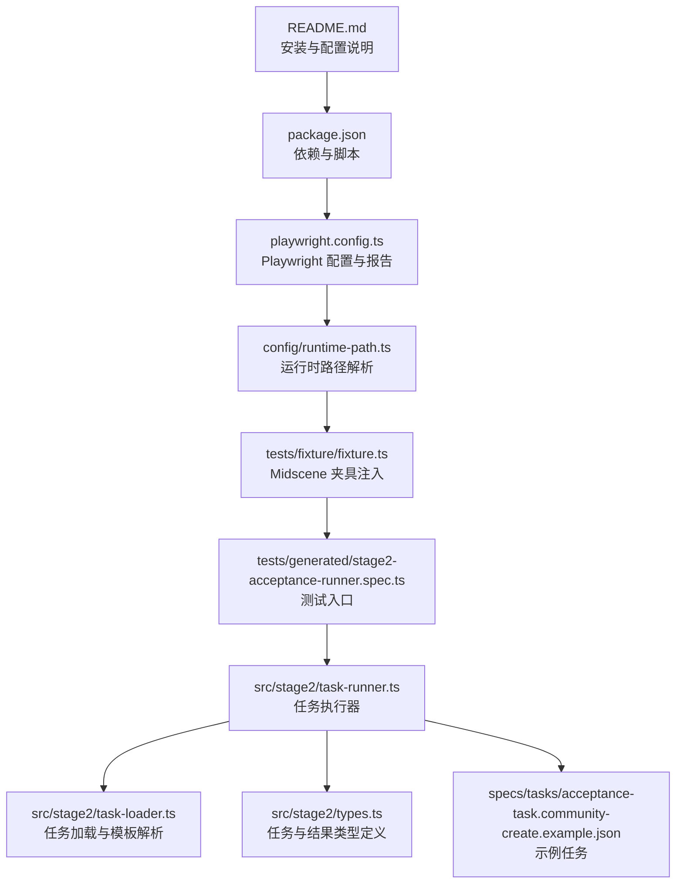
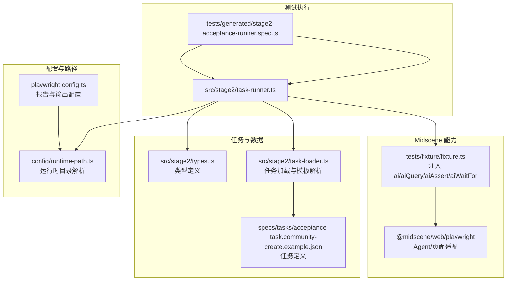
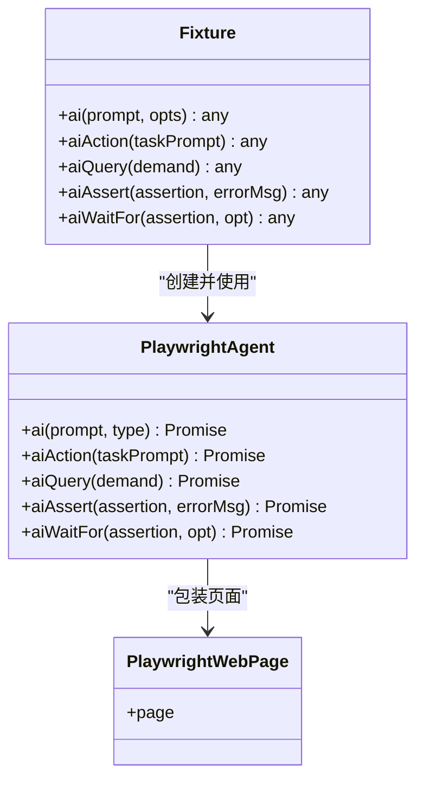
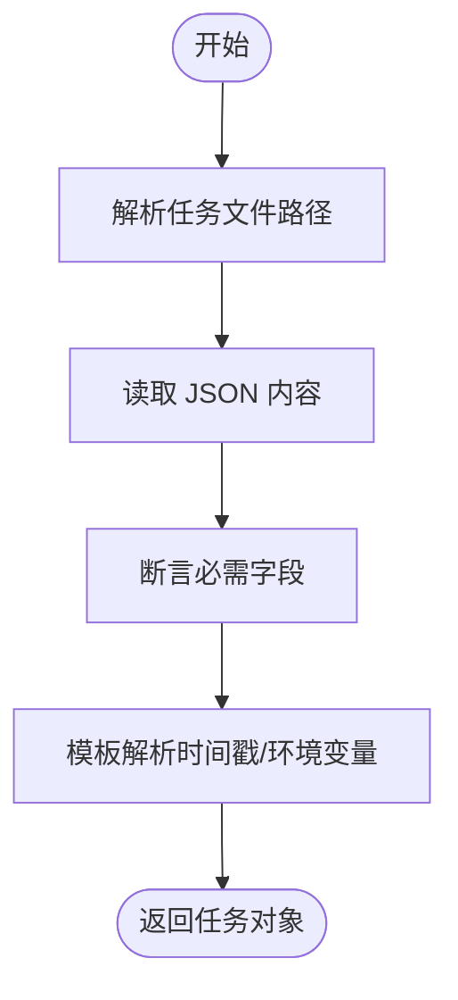
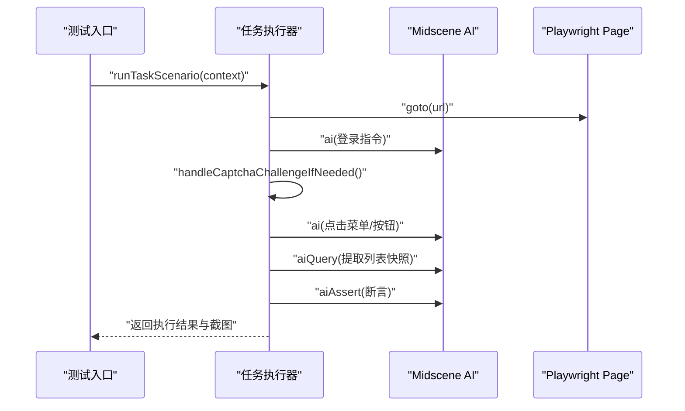
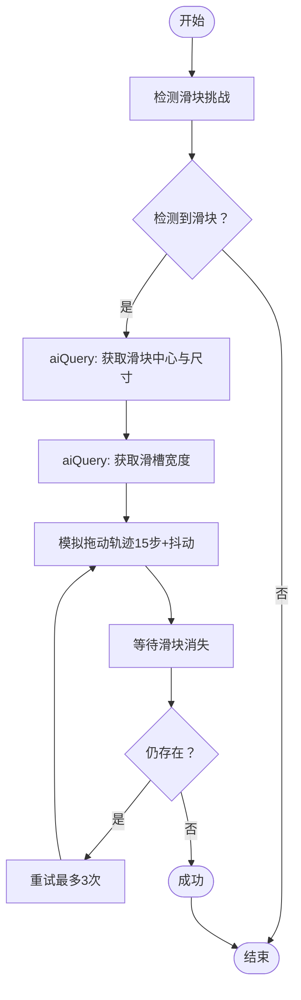
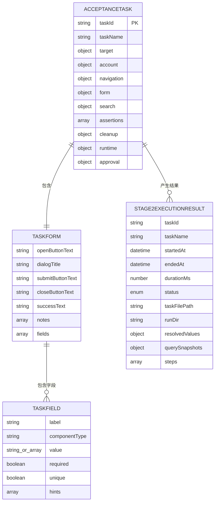
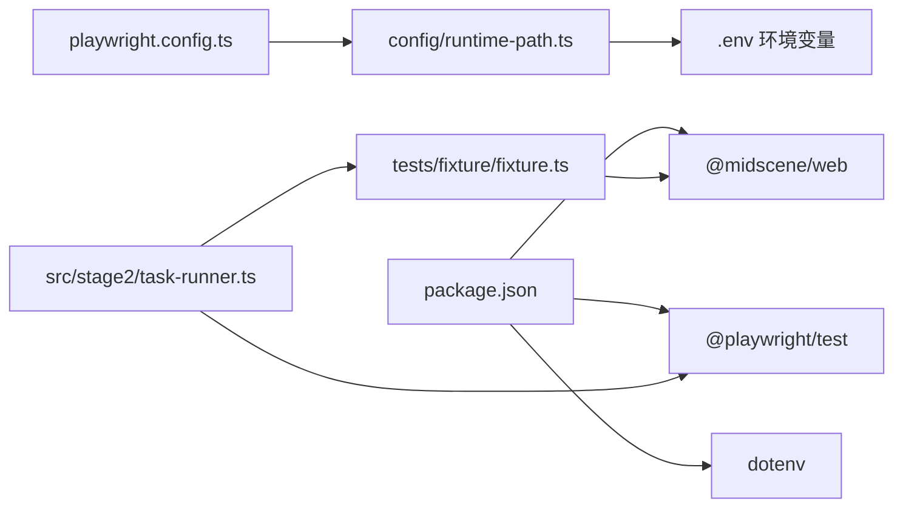

# Midscene 集成原理

<cite>
**本文引用的文件**
- [README.md](file://README.md)
- [package.json](file://package.json)
- [playwright.config.ts](file://playwright.config.ts)
- [config/runtime-path.ts](file://config/runtime-path.ts)
- [tests/fixture/fixture.ts](file://tests/fixture/fixture.ts)
- [tests/generated/stage2-acceptance-runner.spec.ts](file://tests/generated/stage2-acceptance-runner.spec.ts)
- [src/stage2/task-runner.ts](file://src/stage2/task-runner.ts)
- [src/stage2/task-loader.ts](file://src/stage2/task-loader.ts)
- [src/stage2/types.ts](file://src/stage2/types.ts)
- [specs/tasks/acceptance-task.community-create.example.json](file://specs/tasks/acceptance-task.community-create.example.json)
- [.tasks/AI自主代理验收系统开发改造方案_2026-03-11.md](file://.tasks/AI自主代理验收系统开发改造方案_2026-03-11.md)
</cite>

## 目录
1. [简介](#简介)
2. [项目结构](#项目结构)
3. [核心组件](#核心组件)
4. [架构总览](#架构总览)
5. [组件详解](#组件详解)
6. [依赖关系分析](#依赖关系分析)
7. [性能与资源优化](#性能与资源优化)
8. [故障排查指南](#故障排查指南)
9. [结论](#结论)
10. [附录](#附录)

## 简介
本项目基于 Playwright 与 Midscene.js 构建，通过 AI 能力增强页面操作、图像理解与断言，实现更稳健、可解释的自动化测试。项目重点包括：
- 通过 Midscene 的 ai、aiQuery、aiAssert、aiWaitFor 等能力，将自然语言描述转化为可执行的页面交互与断言。
- 在滑块验证码场景中，利用 AI 对页面截图进行结构化分析，结合 Playwright 的 mouse API 实现“真人轨迹”拖动，提升对抗复杂验证码的能力。
- 通过统一的运行时目录与环境变量，集中管理 Midscene 与 Playwright 的产物输出，便于调试与审计。

## 项目结构
项目采用“配置-夹具-运行器-任务”的分层组织方式：
- 配置层：环境变量与运行时路径解析，集中管理输出目录与 Midscene 日志目录。
- 夹具层：在 Playwright 测试中注入 Midscene Agent，提供 ai、aiQuery、aiAssert、aiWaitFor 等能力。
- 运行器层：按任务 JSON 的步骤顺序驱动页面交互，内置滑块验证码处理、断言与截图记录。
- 任务层：以 JSON 描述业务流程，包含目标页面、账号、表单字段、断言与运行时参数。

图表来源
- [README.md](file://README.md#L1-L144)
- [package.json](file://package.json#L1-L24)
- [playwright.config.ts](file://playwright.config.ts#L1-L95)
- [config/runtime-path.ts](file://config/runtime-path.ts#L1-L41)
- [tests/fixture/fixture.ts](file://tests/fixture/fixture.ts#L1-L100)
- [tests/generated/stage2-acceptance-runner.spec.ts](file://tests/generated/stage2-acceptance-runner.spec.ts#L1-L39)
- [src/stage2/task-runner.ts](file://src/stage2/task-runner.ts#L1-L1344)
- [src/stage2/task-loader.ts](file://src/stage2/task-loader.ts#L1-L91)
- [src/stage2/types.ts](file://src/stage2/types.ts#L1-L125)
- [specs/tasks/acceptance-task.community-create.example.json](file://specs/tasks/acceptance-task.community-create.example.json#L1-L184)

章节来源
- [README.md](file://README.md#L1-L144)
- [package.json](file://package.json#L1-L24)
- [playwright.config.ts](file://playwright.config.ts#L1-L95)
- [config/runtime-path.ts](file://config/runtime-path.ts#L1-L41)

## 核心组件
- Midscene 夹具（Playwright 测试注入）：在每个测试用例中注入 ai、aiQuery、aiAssert、aiWaitFor 等方法，封装底层 Agent，支持缓存、分组与报告生成。
- 任务加载器：解析任务 JSON 文件，支持模板变量替换（如时间戳），并校验必要字段。
- 任务执行器：按步骤驱动页面交互，内置滑块验证码自动处理、表单填充、断言与截图记录。
- 运行时路径：集中解析输出目录（Playwright 报告、Midscene 日志、验收结果等），统一收敛到 t_runtime/。

章节来源
- [tests/fixture/fixture.ts](file://tests/fixture/fixture.ts#L1-L100)
- [src/stage2/task-loader.ts](file://src/stage2/task-loader.ts#L1-L91)
- [src/stage2/task-runner.ts](file://src/stage2/task-runner.ts#L1-L1344)
- [config/runtime-path.ts](file://config/runtime-path.ts#L1-L41)

## 架构总览
整体架构围绕“任务 JSON 驱动 + Midscene AI 能力 + Playwright 页面控制”展开，测试入口负责调度执行器，执行器负责与页面交互、AI 查询与断言，并生成结构化结果与截图。

图表来源
- [tests/generated/stage2-acceptance-runner.spec.ts](file://tests/generated/stage2-acceptance-runner.spec.ts#L1-L39)
- [src/stage2/task-runner.ts](file://src/stage2/task-runner.ts#L1-L1344)
- [tests/fixture/fixture.ts](file://tests/fixture/fixture.ts#L1-L100)
- [config/runtime-path.ts](file://config/runtime-path.ts#L1-L41)
- [playwright.config.ts](file://playwright.config.ts#L1-L95)
- [src/stage2/task-loader.ts](file://src/stage2/task-loader.ts#L1-L91)
- [src/stage2/types.ts](file://src/stage2/types.ts#L1-L125)
- [specs/tasks/acceptance-task.community-create.example.json](file://specs/tasks/acceptance-task.community-create.example.json#L1-L184)

## 组件详解

### Midscene 夹具与 AI 能力注入
- 夹具在测试作用域内注入 ai、aiAction、aiQuery、aiAssert、aiWaitFor 方法，每个方法都绑定唯一的 cacheId 与分组信息，确保报告可追踪、缓存可复用。
- setLogDir 将 Midscene 日志目录统一收敛到运行时路径，便于与 Playwright 报告并行管理。
- ai 方法支持 type 参数区分“动作型”与“查询型”，aiWaitFor 支持超时与轮询策略。

图表来源
- [tests/fixture/fixture.ts](file://tests/fixture/fixture.ts#L1-L100)

章节来源
- [tests/fixture/fixture.ts](file://tests/fixture/fixture.ts#L1-L100)

### 任务加载与模板解析
- 任务文件路径支持绝对路径与相对路径解析，支持从环境变量读取默认任务文件。
- 模板解析支持 NOW_YYYYMMDDHHMMSS 时间戳与环境变量占位符，确保每次执行的任务参数唯一且可追溯。
- 加载阶段对任务必需字段进行断言，缺失时抛出明确错误。

图表来源
- [src/stage2/task-loader.ts](file://src/stage2/task-loader.ts#L1-L91)

章节来源
- [src/stage2/task-loader.ts](file://src/stage2/task-loader.ts#L1-L91)

### 任务执行器与步骤编排
- 执行器按步骤顺序驱动页面交互，包含打开首页、登录、处理安全验证、菜单导航、打开弹窗、字段填写、提交表单、搜索与断言等。
- 每一步骤封装为 runStep，支持截图、错误捕获、状态记录与进度文件写入。
- 断言类型覆盖 toast、表格行存在、单元格相等/包含等，未知类型回退到 aiAssert 文本断言。

图表来源
- [tests/generated/stage2-acceptance-runner.spec.ts](file://tests/generated/stage2-acceptance-runner.spec.ts#L1-L39)
- [src/stage2/task-runner.ts](file://src/stage2/task-runner.ts#L1062-L1344)

章节来源
- [tests/generated/stage2-acceptance-runner.spec.ts](file://tests/generated/stage2-acceptance-runner.spec.ts#L1-L39)
- [src/stage2/task-runner.ts](file://src/stage2/task-runner.ts#L1062-L1344)

### 滑块验证码自动处理
- 检测策略：通过文本关键词与特定选择器组合判断是否存在滑块挑战。
- AI 识别：使用 aiQuery 获取滑块按钮中心坐标与滑槽宽度。
- 拖动模拟：使用 mouse API 模拟真人轨迹（15步 easeOut 缓动 + 随机抖动），并重试最多 3 次。
- 结果验证：等待滑块消失，若仍存在则抛出明确错误，提示切换为 manual 模式或调整检测策略。

图表来源
- [src/stage2/task-runner.ts](file://src/stage2/task-runner.ts#L480-L703)
- [src/stage2/task-runner.ts](file://src/stage2/task-runner.ts#L507-L645)

章节来源
- [src/stage2/task-runner.ts](file://src/stage2/task-runner.ts#L480-L703)
- [src/stage2/task-runner.ts](file://src/stage2/task-runner.ts#L507-L645)

### 数据模型与类型定义
- AcceptanceTask：任务主体，包含目标页面、账号、导航、表单、搜索、断言、清理、运行时与审批信息。
- TaskForm/TaskField：表单字段定义，支持 cascader 级联、必填与唯一性约束。
- Stage2ExecutionResult：执行结果，包含步骤、截图路径、查询快照与运行目录。

图表来源
- [src/stage2/types.ts](file://src/stage2/types.ts#L86-L125)

章节来源
- [src/stage2/types.ts](file://src/stage2/types.ts#L1-L125)

### 示例任务与最佳实践
- 示例任务展示了完整的“新增小区并回查”流程，包含登录提示、菜单路径、弹窗标题、字段与断言。
- 最佳实践建议将长流程拆分为多个步骤，减少单条 ai() 的长度，降低定位难度与幻觉风险；关键断言优先使用 aiQuery + Playwright 硬断言。

章节来源
- [specs/tasks/acceptance-task.community-create.example.json](file://specs/tasks/acceptance-task.community-create.example.json#L1-L184)
- [.tasks/AI自主代理验收系统开发改造方案_2026-03-11.md](file://.tasks/AI自主代理验收系统开发改造方案_2026-03-11.md#L40-L84)

## 依赖关系分析
- 依赖管理：package.json 指定 @playwright/test、@midscene/web 与 dotenv 等依赖，脚本提供 headed/headless 两种执行模式。
- 配置集成：playwright.config.ts 引入 Midscene 报告器，统一输出目录由 config/runtime-path.ts 解析，dotenv 从 .env 读取环境变量。
- 夹具与执行器：夹具注入 AI 能力，执行器在步骤中调用 AI 与 Playwright API，形成“自然语言描述 → 页面操作/断言”的闭环。

图表来源
- [package.json](file://package.json#L1-L24)
- [playwright.config.ts](file://playwright.config.ts#L1-L95)
- [config/runtime-path.ts](file://config/runtime-path.ts#L1-L41)
- [tests/fixture/fixture.ts](file://tests/fixture/fixture.ts#L1-L100)
- [src/stage2/task-runner.ts](file://src/stage2/task-runner.ts#L1-L1344)

章节来源
- [package.json](file://package.json#L1-L24)
- [playwright.config.ts](file://playwright.config.ts#L1-L95)
- [config/runtime-path.ts](file://config/runtime-path.ts#L1-L41)

## 性能与资源优化
- 运行时目录收敛：通过 RUNTIME_DIR_PREFIX 与各目录变量统一收敛到 t_runtime/，便于磁盘空间管理与 CI 清理。
- 报告与缓存：Midscene Agent 启用缓存与报告生成，建议在 CI 中开启 headed 模式辅助定位问题，本地开发可使用 headless 提升速度。
- 步骤截图与追踪：按需开启每步截图与 trace，避免在大规模用例中产生过多中间产物。
- 模型与网络：合理设置超时与重试次数，避免因网络波动导致的不稳定；在滑块场景中，优先使用 aiQuery 精准定位，减少无效重试。

章节来源
- [README.md](file://README.md#L74-L92)
- [config/runtime-path.ts](file://config/runtime-path.ts#L1-L41)
- [playwright.config.ts](file://playwright.config.ts#L36-L40)

## 故障排查指南
- 滑块验证码自动失败
  - 现象：自动拖动多次后仍失败。
  - 排查：检查页面截图确认滑块样式与选择器；切换为 manual 模式人工处理；增大等待超时；确认 aiQuery 返回的坐标与宽度有效。
- 登录后仍出现安全验证
  - 现象：登录成功但页面仍有滑块挑战。
  - 排查：确认 handleCaptchaChallengeIfNeeded 在登录后被调用；检查检测关键词与选择器是否覆盖目标页面。
- 表单提交后弹窗未关闭
  - 现象：提交多次后弹窗仍存在。
  - 排查：查看收集到的校验提示，按字段逐项修复；确认 cascader 选择路径与最终显示值匹配。
- 截图与报告缺失
  - 现象：缺少步骤截图或 Midscene 报告。
  - 排查：确认 runtime 目录解析与 .env 配置；检查 Midscene 日志目录设置；确保每步截图开关开启。

章节来源
- [src/stage2/task-runner.ts](file://src/stage2/task-runner.ts#L647-L703)
- [src/stage2/task-runner.ts](file://src/stage2/task-runner.ts#L973-L1018)
- [README.md](file://README.md#L62-L72)

## 结论
本项目通过 Midscene 的 AI 能力与 Playwright 的页面控制相结合，实现了面向复杂 UI 的稳健自动化测试。执行器以任务 JSON 为驱动，将自然语言描述转化为可执行步骤，并在关键环节（如滑块验证码）引入 AI 图像理解与“真人轨迹”模拟，显著提升了对抗动态与反爬策略的能力。配合统一的运行时目录与报告体系，项目具备良好的可观测性与可维护性。

## 附录
- 环境变量与运行产物
  - OPENAI_API_KEY、OPENAI_BASE_URL、MIDSCENE_MODEL_NAME：模型接入参数。
  - RUNTIME_DIR_PREFIX、PLAYWRIGHT_OUTPUT_DIR、PLAYWRIGHT_HTML_REPORT_DIR、MIDSCENE_RUN_DIR、ACCEPTANCE_RESULT_DIR：运行产物目录。
  - STAGE2_TASK_FILE、STAGE2_REQUIRE_APPROVAL、STAGE2_CAPTCHA_MODE、STAGE2_CAPTCHA_WAIT_TIMEOUT_MS：任务执行与验证码处理策略。
- 运行命令
  - npx playwright test tests/generated/stage2-acceptance-runner.spec.ts
  - npm run stage2:run:headed

章节来源
- [README.md](file://README.md#L31-L52)
- [README.md](file://README.md#L106-L131)
- [package.json](file://package.json#L6-L9)