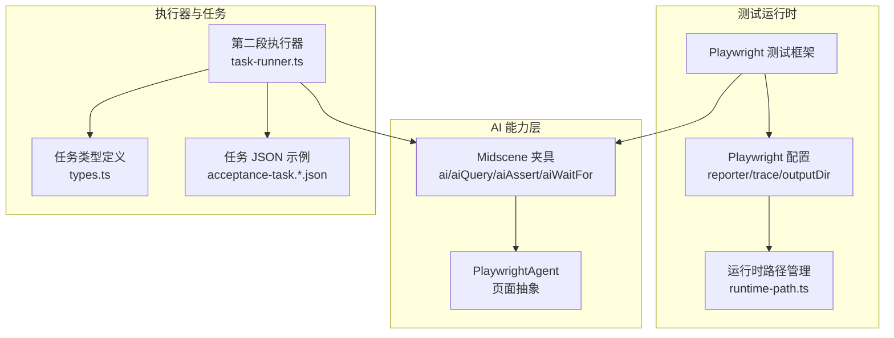
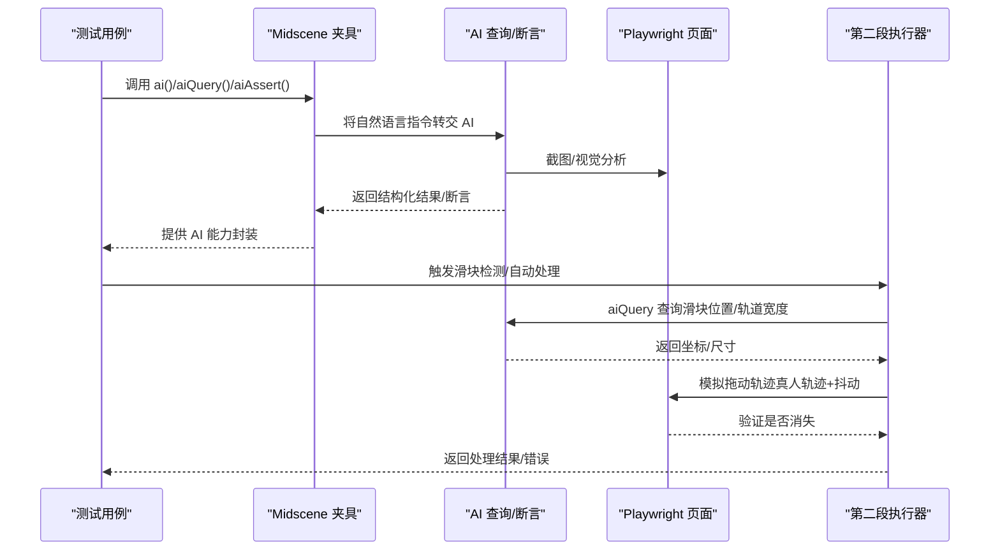
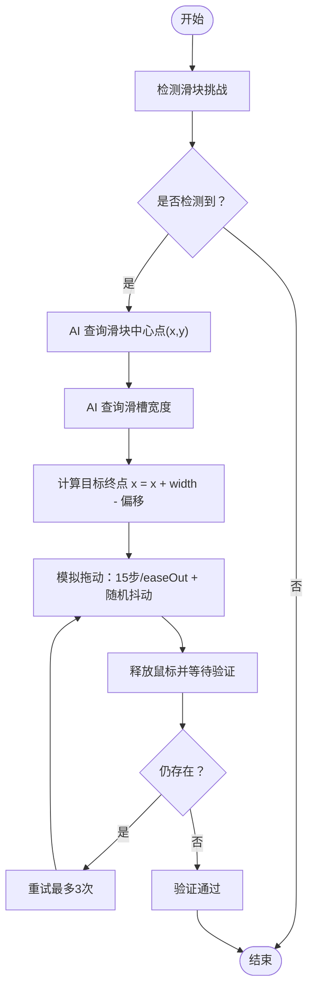
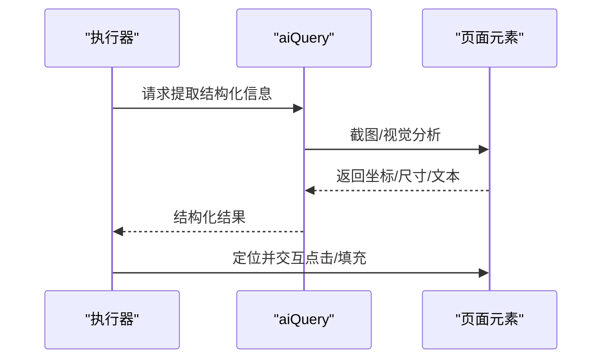
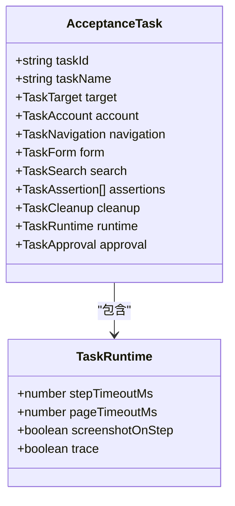
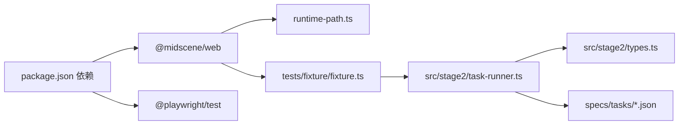

# 图像处理与识别

<cite>
**本文引用的文件**
- [README.md](file://README.md)
- [package.json](file://package.json)
- [playwright.config.ts](file://playwright.config.ts)
- [config/runtime-path.ts](file://config/runtime-path.ts)
- [tests/fixture/fixture.ts](file://tests/fixture/fixture.ts)
- [.tasks/AI自主代理验收系统开发改造方案_2026-03-11.md](file://.tasks/AI自主代理验收系统开发改造方案_2026-03-11.md)
- [src/stage2/task-runner.ts](file://src/stage2/task-runner.ts)
- [src/stage2/types.ts](file://src/stage2/types.ts)
- [specs/tasks/acceptance-task.community-create.example.json](file://specs/tasks/acceptance-task.community-create.example.json)
- [specs/tasks/acceptance-task.template.json](file://specs/tasks/acceptance-task.template.json)
</cite>

## 目录
1. [引言](#引言)
2. [项目结构](#项目结构)
3. [核心组件](#核心组件)
4. [架构总览](#架构总览)
5. [详细组件分析](#详细组件分析)
6. [依赖关系分析](#依赖关系分析)
7. [性能考量](#性能考量)
8. [故障排查指南](#故障排查指南)
9. [结论](#结论)
10. [附录](#附录)

## 引言
本文件面向“图像处理与识别”的专业需求，聚焦于如何在基于 Playwright 与 Midscene.js 的自动化测试体系中，利用 AI 对页面截图与图像数据进行处理、预处理、特征提取与模式识别，并据此完成页面元素的定位与交互。文档同时覆盖滑块验证码的自动识别与拖动流程，以及图像质量评估与优化策略、配置选项与调优参数、性能与内存管理策略。

## 项目结构
该项目以“任务驱动 + AI 能力集成”为核心，围绕第二段执行器构建了完整的端到端执行链路。与图像处理直接相关的关键模块包括：
- Midscene 夹具注入与 AI 能力扩展（ai、aiQuery、aiAssert、aiWaitFor）
- 运行时目录与报告输出路径管理
- 第二段任务执行器（含滑块验证码自动处理）
- 任务输入 JSON 模型与运行参数

图表来源
- [playwright.config.ts](file://playwright.config.ts#L22-L94)
- [config/runtime-path.ts](file://config/runtime-path.ts#L1-L41)
- [tests/fixture/fixture.ts](file://tests/fixture/fixture.ts#L23-L99)
- [src/stage2/task-runner.ts](file://src/stage2/task-runner.ts#L1-L120)
- [src/stage2/types.ts](file://src/stage2/types.ts#L86-L98)
- [specs/tasks/acceptance-task.community-create.example.json](file://specs/tasks/acceptance-task.community-create.example.json#L1-L184)

章节来源
- [README.md](file://README.md#L1-L144)
- [playwright.config.ts](file://playwright.config.ts#L22-L94)
- [config/runtime-path.ts](file://config/runtime-path.ts#L1-L41)
- [tests/fixture/fixture.ts](file://tests/fixture/fixture.ts#L1-L100)
- [src/stage2/task-runner.ts](file://src/stage2/task-runner.ts#L1-L120)
- [src/stage2/types.ts](file://src/stage2/types.ts#L1-L125)
- [specs/tasks/acceptance-task.community-create.example.json](file://specs/tasks/acceptance-task.community-create.example.json#L1-L184)

## 核心组件
- Midscene 夹具与 AI 方法族
  - ai：执行交互类 AI 指令
  - aiQuery：从页面截图中提取结构化数据
  - aiAssert：执行 AI 断言
  - aiWaitFor：等待条件满足
- 运行时路径与报告
  - 统一管理 t_runtime/* 子目录，支持 Playwright 报告、Midscene 报告、接受结果等
- 第二段执行器
  - 滑块验证码检测与自动处理（AI 查询 + Playwright 模拟拖动）
  - 通用页面元素定位与交互（可见性判断、点击、填充）

章节来源
- [tests/fixture/fixture.ts](file://tests/fixture/fixture.ts#L23-L99)
- [README.md](file://README.md#L100-L116)
- [config/runtime-path.ts](file://config/runtime-path.ts#L13-L36)
- [src/stage2/task-runner.ts](file://src/stage2/task-runner.ts#L480-L703)

## 架构总览
下图展示了“图像处理与识别”在端到端执行中的位置与交互：

图表来源
- [tests/fixture/fixture.ts](file://tests/fixture/fixture.ts#L23-L99)
- [src/stage2/task-runner.ts](file://src/stage2/task-runner.ts#L507-L645)

章节来源
- [tests/fixture/fixture.ts](file://tests/fixture/fixture.ts#L23-L99)
- [src/stage2/task-runner.ts](file://src/stage2/task-runner.ts#L507-L645)

## 详细组件分析

### 组件A：滑块验证码自动处理流水线
该组件负责在检测到滑块验证码时，通过 AI 查询滑块位置与轨道宽度，并使用 Playwright 模拟真人拖动轨迹，最终验证是否通过。

图表来源
- [src/stage2/task-runner.ts](file://src/stage2/task-runner.ts#L480-L703)
- [src/stage2/task-runner.ts](file://src/stage2/task-runner.ts#L507-L645)

章节来源
- [src/stage2/task-runner.ts](file://src/stage2/task-runner.ts#L480-L703)
- [src/stage2/task-runner.ts](file://src/stage2/task-runner.ts#L507-L645)

### 组件B：AI 查询与页面元素识别
- 文本识别：通过 aiQuery 返回结构化字段，如滑块位置、滑槽宽度等
- 图标/按钮识别：通过可见性判断与选择器匹配，结合 AI 提示增强定位
- 表单元素识别：基于字段标签、占位文案、组件类型与 hints 进行候选构建与点击/填充

图表来源
- [src/stage2/task-runner.ts](file://src/stage2/task-runner.ts#L507-L556)
- [src/stage2/task-runner.ts](file://src/stage2/task-runner.ts#L411-L448)

章节来源
- [src/stage2/task-runner.ts](file://src/stage2/task-runner.ts#L507-L556)
- [src/stage2/task-runner.ts](file://src/stage2/task-runner.ts#L411-L448)

### 组件C：任务输入与运行参数
- 任务 JSON 定义了目标 URL、账户、导航、表单字段、断言、清理策略与运行时参数
- 运行时参数控制页面超时、步骤超时、截图与 trace 开关

图表来源
- [src/stage2/types.ts](file://src/stage2/types.ts#L86-L98)
- [src/stage2/types.ts](file://src/stage2/types.ts#L73-L78)

章节来源
- [src/stage2/types.ts](file://src/stage2/types.ts#L1-L125)
- [specs/tasks/acceptance-task.community-create.example.json](file://specs/tasks/acceptance-task.community-create.example.json#L1-L184)
- [specs/tasks/acceptance-task.template.json](file://specs/tasks/acceptance-task.template.json#L1-L85)

## 依赖关系分析
- Midscene 与 Playwright 的集成：通过夹具注入 AI 方法族，统一页面抽象与报告生成
- 运行时目录：集中管理 t_runtime/*，便于产物收集与复盘
- 第二段执行器：依赖 AI 查询能力与 Playwright 交互能力，实现滑块自动处理与通用页面元素操作

图表来源
- [package.json](file://package.json#L13-L22)
- [config/runtime-path.ts](file://config/runtime-path.ts#L1-L41)
- [tests/fixture/fixture.ts](file://tests/fixture/fixture.ts#L1-L100)
- [src/stage2/task-runner.ts](file://src/stage2/task-runner.ts#L1-L120)
- [src/stage2/types.ts](file://src/stage2/types.ts#L1-L125)
- [specs/tasks/acceptance-task.community-create.example.json](file://specs/tasks/acceptance-task.community-create.example.json#L1-L184)

章节来源
- [package.json](file://package.json#L13-L22)
- [config/runtime-path.ts](file://config/runtime-path.ts#L1-L41)
- [tests/fixture/fixture.ts](file://tests/fixture/fixture.ts#L1-L100)
- [src/stage2/task-runner.ts](file://src/stage2/task-runner.ts#L1-L120)
- [src/stage2/types.ts](file://src/stage2/types.ts#L1-L125)
- [specs/tasks/acceptance-task.community-create.example.json](file://specs/tasks/acceptance-task.community-create.example.json#L1-L184)

## 性能考量
- 截图与 AI 查询频率控制
  - 建议在关键节点（如滑块检测前后）进行截图与查询，避免频繁截图导致性能下降
  - 通过任务运行时参数控制截图开关与超时，平衡准确性与性能
- 拖动轨迹模拟
  - 使用分步与缓动函数，减少一次性大位移带来的不稳定
  - 随机抖动模拟人类行为，提升通过率的同时注意不要过度影响稳定性
- 页面等待与重试
  - 对于异步加载与动画，合理设置等待与重试次数，避免过早判定失败
- 内存与磁盘管理
  - 统一运行时目录，定期清理中间产物
  - 控制截图数量与分辨率，避免占用过多磁盘空间

## 故障排查指南
- 滑块自动处理失败
  - 现象：多次尝试后滑块仍存在
  - 排查要点：确认 AI 查询返回的滑块位置与轨道宽度是否合理；检查拖动轨迹参数（步数、偏移、抖动幅度）；确认页面是否正确加载
  - 参考路径：[滑块自动处理流程](file://src/stage2/task-runner.ts#L558-L645)
- 未检测到滑块挑战
  - 现象：滑块检测函数返回未找到
  - 排查要点：确认文本关键词与选择器是否覆盖页面实际文案与结构；检查页面语言与样式差异
  - 参考路径：[滑块检测函数](file://src/stage2/task-runner.ts#L480-L498)
- AI 查询报错
  - 现象：aiQuery 抛出异常
  - 排查要点：确认模型配置与网络连通性；适当放宽重试与超时；检查提示词是否清晰
  - 参考路径：[AI 查询封装](file://tests/fixture/fixture.ts#L57-L69)
- 运行产物目录异常
  - 现象：报告与截图未生成或路径不正确
  - 排查要点：检查 .env 与 runtime-path.ts 中的目录变量；确认权限与磁盘空间
  - 参考路径：[运行时路径管理](file://config/runtime-path.ts#L13-L36)

章节来源
- [src/stage2/task-runner.ts](file://src/stage2/task-runner.ts#L558-L645)
- [src/stage2/task-runner.ts](file://src/stage2/task-runner.ts#L480-L498)
- [tests/fixture/fixture.ts](file://tests/fixture/fixture.ts#L57-L69)
- [config/runtime-path.ts](file://config/runtime-path.ts#L13-L36)

## 结论
本项目通过 Midscene 的 AI 能力与 Playwright 的页面交互能力，实现了对页面截图与图像数据的处理与识别，并在此基础上完成了滑块验证码的自动处理与通用页面元素的定位与交互。通过合理的任务输入模型、运行时参数与性能策略，可以在保证准确性的同时提升执行效率与稳定性。

## 附录

### 图像质量评估与优化策略
- 截图时机与频率
  - 在关键交互前后进行截图，避免无意义高频截图
- 分辨率与缩放
  - 根据页面缩放与设备像素比调整截图分辨率，确保关键细节可识别
- 对比度与噪声
  - 对于低对比度或噪声较大的截图，可通过增强算法（如锐化、阈值化）提升识别效果（具体实现依赖所选图像处理库）
- 一致性与稳定性
  - 固定视口大小与布局，减少因页面动态变化导致的误判

### 配置选项与调优参数
- 环境变量
  - 模型与运行目录：参见 [README 中的环境变量说明](file://README.md#L39-L52)
  - 运行时目录：参见 [运行时路径管理](file://config/runtime-path.ts#L13-L36)
- 运行时参数（任务 JSON）
  - 步骤超时、页面超时、截图开关、trace 开关：参见 [任务运行时类型定义](file://src/stage2/types.ts#L73-L78)
- 滑块处理参数
  - 模式与等待超时：参见 [滑块模式与超时解析](file://src/stage2/task-runner.ts#L58-L84)
  - 拖动轨迹：步数、缓动函数、抖动幅度：参见 [拖动轨迹模拟](file://src/stage2/task-runner.ts#L589-L610)

章节来源
- [README.md](file://README.md#L39-L52)
- [config/runtime-path.ts](file://config/runtime-path.ts#L13-L36)
- [src/stage2/types.ts](file://src/stage2/types.ts#L73-L78)
- [src/stage2/task-runner.ts](file://src/stage2/task-runner.ts#L58-L84)
- [src/stage2/task-runner.ts](file://src/stage2/task-runner.ts#L589-L610)