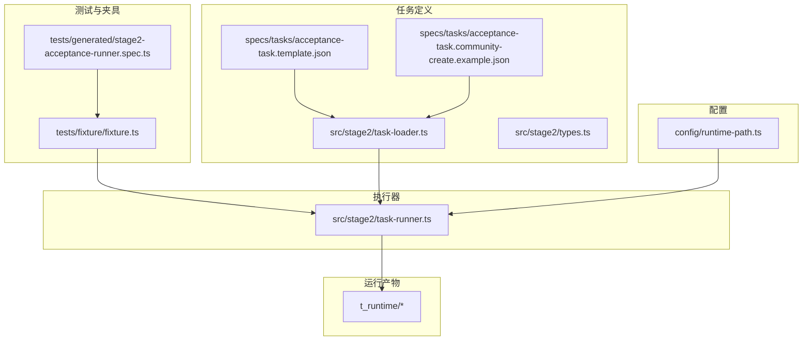
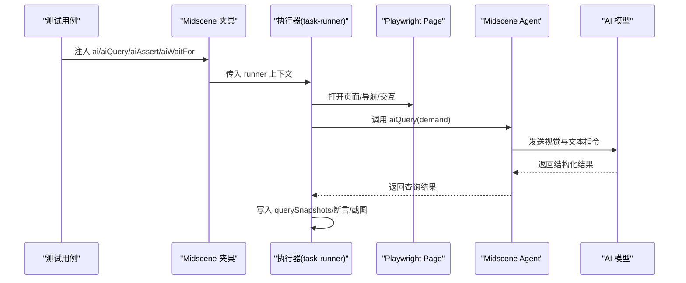
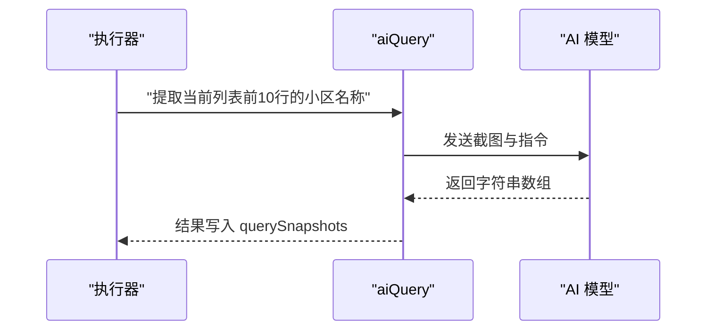
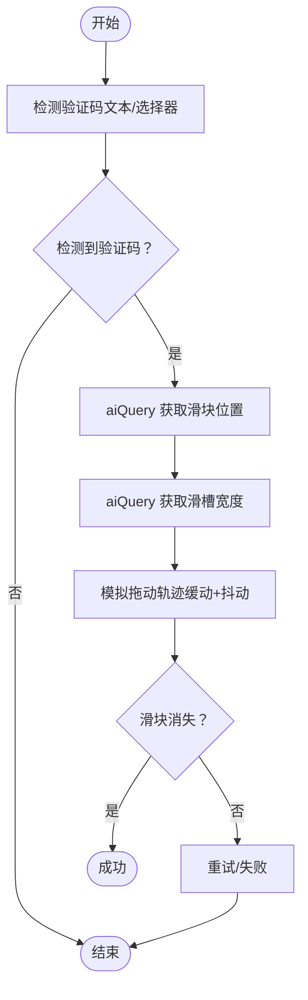
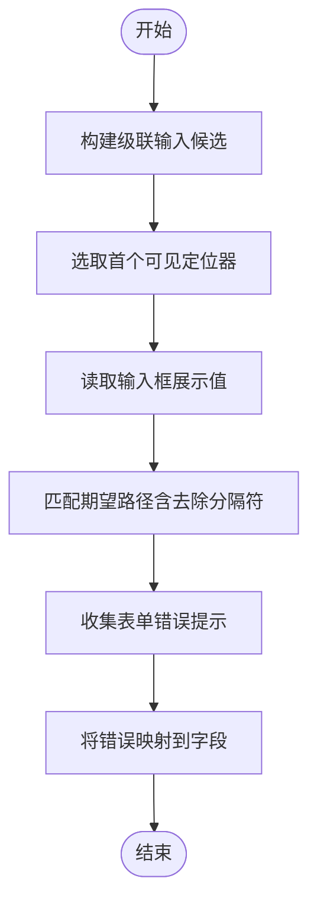
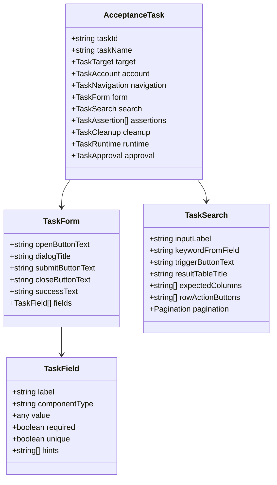
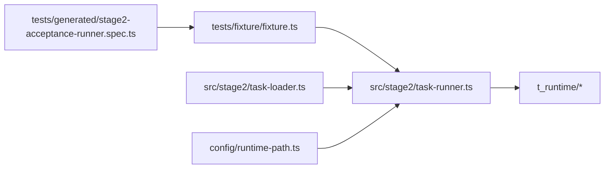

# 结构化数据提取

<cite>
**本文引用的文件**
- [README.md](file://README.md)
- [package.json](file://package.json)
- [config/runtime-path.ts](file://config/runtime-path.ts)
- [src/stage2/types.ts](file://src/stage2/types.ts)
- [src/stage2/task-loader.ts](file://src/stage2/task-loader.ts)
- [src/stage2/task-runner.ts](file://src/stage2/task-runner.ts)
- [specs/tasks/acceptance-task.template.json](file://specs/tasks/acceptance-task.template.json)
- [specs/tasks/acceptance-task.community-create.example.json](file://specs/tasks/acceptance-task.community-create.example.json)
- [tests/generated/stage2-acceptance-runner.spec.ts](file://tests/generated/stage2-acceptance-runner.spec.ts)
- [tests/fixture/fixture.ts](file://tests/fixture/fixture.ts)
</cite>

## 目录
1. [简介](#简介)
2. [项目结构](#项目结构)
3. [核心组件](#核心组件)
4. [架构总览](#架构总览)
5. [详细组件分析](#详细组件分析)
6. [依赖关系分析](#依赖关系分析)
7. [性能考量](#性能考量)
8. [故障排查指南](#故障排查指南)
9. [结论](#结论)
10. [附录](#附录)

## 简介
本项目基于 Playwright 与 Midscene.js，构建了“AI 驱动”的自动化测试与验收执行框架。其中，结构化数据提取是第二阶段执行器的关键能力之一，用于从页面中抽取表格数据、表单字段以及动态内容，支撑断言与回查。

- 数据提取通过 aiQuery 接口实现，结合自然语言指令与视觉理解，输出结构化结果。
- 项目提供了完整的任务 JSON 模型、执行器、夹具与运行产物目录管理，支持可配置的验证码处理、截图与报告生成。
- 文档将围绕数据提取的算法与技术、不同数据类型的提取策略、验证与清洗方法、配置选项与自定义规则进行系统性说明，并给出实际案例与最佳实践。

## 项目结构
项目采用“任务驱动 + 夹具 + 执行器”的分层组织方式，核心目录与文件如下：
- config：运行时目录与环境变量解析
- specs/tasks：任务模板与示例
- src/stage2：第二阶段执行器、任务加载与类型定义
- tests：Playwright 测试用例与 Midscene 夹具
- README 与 package.json：项目说明与依赖

图表来源
- [config/runtime-path.ts](file://config/runtime-path.ts#L38-L40)
- [src/stage2/task-loader.ts](file://src/stage2/task-loader.ts#L71-L89)
- [src/stage2/task-runner.ts](file://src/stage2/task-runner.ts#L1170-L1344)
- [specs/tasks/acceptance-task.template.json](file://specs/tasks/acceptance-task.template.json#L1-L85)
- [specs/tasks/acceptance-task.community-create.example.json](file://specs/tasks/acceptance-task.community-create.example.json#L1-L184)
- [tests/generated/stage2-acceptance-runner.spec.ts](file://tests/generated/stage2-acceptance-runner.spec.ts#L1-L39)
- [tests/fixture/fixture.ts](file://tests/fixture/fixture.ts#L1-L100)

章节来源
- [README.md](file://README.md#L1-L144)
- [package.json](file://package.json#L1-L24)

## 核心组件
- 任务模型与类型：定义了任务、账户、导航、表单、搜索、断言、清理、运行时与审批等结构，支撑结构化数据提取的上下文与期望。
- 任务加载器：负责解析任务文件、模板变量替换与形状校验。
- 执行器：封装步骤、异常处理、截图与进度写入；在关键步骤调用 aiQuery 进行结构化数据提取。
- 夹具与测试入口：提供 ai、aiQuery、aiAssert、aiWaitFor 等接口，连接 Midscene Agent 与 Playwright Page。

章节来源
- [src/stage2/types.ts](file://src/stage2/types.ts#L1-L125)
- [src/stage2/task-loader.ts](file://src/stage2/task-loader.ts#L71-L89)
- [src/stage2/task-runner.ts](file://src/stage2/task-runner.ts#L1170-L1344)
- [tests/fixture/fixture.ts](file://tests/fixture/fixture.ts#L23-L99)
- [tests/generated/stage2-acceptance-runner.spec.ts](file://tests/generated/stage2-acceptance-runner.spec.ts#L1-L39)

## 架构总览
下图展示了从测试入口到执行器、再到 Midscene AI 查询的数据流：

图表来源
- [tests/generated/stage2-acceptance-runner.spec.ts](file://tests/generated/stage2-acceptance-runner.spec.ts#L12-L37)
- [tests/fixture/fixture.ts](file://tests/fixture/fixture.ts#L57-L69)
- [src/stage2/task-runner.ts](file://src/stage2/task-runner.ts#L1305-L1310)

## 详细组件分析

### 组件一：结构化数据提取（aiQuery）
- 调用时机：在“提取列表快照”步骤中，使用 aiQuery 提取表格前若干行的关键字段。
- 返回类型：根据调用处的类型参数推断，常见为字符串数组或其他结构化对象数组。
- 输出用途：写入 querySnapshots，供后续断言与回查使用。

图表来源
- [src/stage2/task-runner.ts](file://src/stage2/task-runner.ts#L1305-L1310)

章节来源
- [src/stage2/task-runner.ts](file://src/stage2/task-runner.ts#L1305-L1310)

### 组件二：滑块验证码的 AI 识别与自动处理（辅助结构化提取）
虽然不是直接提取页面数据，但滑块识别与拖动流程展示了 AI 对页面元素的定位与交互能力，间接保障了后续提取步骤的稳定性。

图表来源
- [src/stage2/task-runner.ts](file://src/stage2/task-runner.ts#L507-L556)
- [src/stage2/task-runner.ts](file://src/stage2/task-runner.ts#L558-L645)

章节来源
- [src/stage2/task-runner.ts](file://src/stage2/task-runner.ts#L507-L645)

### 组件三：表单字段与级联选择的提取与校验
- 级联选择器的显示值读取：通过候选选择器与可见性判断，读取输入框的展示值，便于断言与回查。
- 表单校验消息收集：从各类 UI 组件中提取错误提示，映射到具体字段，辅助定位缺失或非法值。

图表来源
- [src/stage2/task-runner.ts](file://src/stage2/task-runner.ts#L309-L321)
- [src/stage2/task-runner.ts](file://src/stage2/task-runner.ts#L335-L404)

章节来源
- [src/stage2/task-runner.ts](file://src/stage2/task-runner.ts#L309-L321)
- [src/stage2/task-runner.ts](file://src/stage2/task-runner.ts#L335-L404)

### 组件四：任务模型与数据提取的契约
- 任务模型定义了表单字段、搜索区域、断言与运行时参数，这些字段直接影响数据提取的策略与期望。
- 示例任务展示了如何定义“列表标题、期望列、分页信息、断言类型”等，从而指导 aiQuery 的指令设计。

图表来源
- [src/stage2/types.ts](file://src/stage2/types.ts#L86-L98)
- [src/stage2/types.ts](file://src/stage2/types.ts#L32-L40)
- [src/stage2/types.ts](file://src/stage2/types.ts#L42-L56)
- [src/stage2/types.ts](file://src/stage2/types.ts#L23-L30)

章节来源
- [src/stage2/types.ts](file://src/stage2/types.ts#L1-L125)
- [specs/tasks/acceptance-task.community-create.example.json](file://specs/tasks/acceptance-task.community-create.example.json#L104-L139)

### 组件五：数据提取的算法与技术
- OCR 识别：通过 aiQuery 的视觉理解能力，结合截图与自然语言指令，实现对表格文本、表单字段与动态内容的识别与抽取。
- 布局分析：利用可见性判断、层级容器定位与候选选择器集合，提升定位准确性。
- 语义理解：通过“占位文案为...”、“请输入/请选择...”等提示词，辅助字段识别与映射。

章节来源
- [src/stage2/task-runner.ts](file://src/stage2/task-runner.ts#L276-L287)
- [src/stage2/task-runner.ts](file://src/stage2/task-runner.ts#L366-L404)
- [src/stage2/task-runner.ts](file://src/stage2/task-runner.ts#L517-L522)
- [src/stage2/task-runner.ts](file://src/stage2/task-runner.ts#L544-L547)

### 组件六：不同数据类型的提取策略
- 文本数据：通过占位文案与可见性定位，读取输入框展示值或列表单元格文本。
- 数值数据：在表格列中提取数字串，结合断言类型进行数值比较。
- 日期时间：在表格列中提取日期时间格式字符串，结合断言类型进行包含或等于判断。
- 多选数据：针对级联选择器，读取展示路径并匹配期望层级路径。

章节来源
- [src/stage2/task-runner.ts](file://src/stage2/task-runner.ts#L309-L321)
- [src/stage2/task-runner.ts](file://src/stage2/task-runner.ts#L323-L333)
- [specs/tasks/acceptance-task.community-create.example.json](file://specs/tasks/acceptance-task.community-create.example.json#L140-L166)

### 组件七：数据验证与清洗
- 去重与空值过滤：对提示词与候选值进行去重与空值过滤，减少误判。
- 文本标准化：去除空白字符、统一大小写，提升匹配鲁棒性。
- 可见性优先：优先选择可见元素，避免隐藏或不可交互元素干扰。
- 错误提示映射：将 UI 错误提示映射到具体字段，辅助定位缺失或非法值。

章节来源
- [src/stage2/task-runner.ts](file://src/stage2/task-runner.ts#L144-L153)
- [src/stage2/task-runner.ts](file://src/stage2/task-runner.ts#L162-L202)
- [src/stage2/task-runner.ts](file://src/stage2/task-runner.ts#L335-L404)

### 组件八：配置选项与自定义规则
- 运行时目录：通过环境变量统一收敛运行产物目录，便于结果归档与分析。
- 验证码处理模式：支持自动、人工、失败、忽略四种模式，影响后续提取步骤的稳定性。
- 截图与追踪：可按步骤截图并生成报告，辅助定位提取失败原因。

章节来源
- [README.md](file://README.md#L74-L92)
- [README.md](file://README.md#L54-L72)
- [config/runtime-path.ts](file://config/runtime-path.ts#L38-L40)
- [src/stage2/task-runner.ts](file://src/stage2/task-runner.ts#L58-L84)

### 组件九：实际案例与最佳实践
- 案例：社区创建任务中的“提取列表快照”步骤，使用 aiQuery 提取前 10 行的小区名称，写入 querySnapshots，随后进行断言。
- 最佳实践：
  - 在任务模板中明确“列表标题、期望列、分页信息、断言类型”，以指导 aiQuery 的指令设计。
  - 对占位文案与提示词进行规范化，提升字段识别准确率。
  - 在复杂页面中，优先使用可见性判断与候选选择器集合，降低误定位风险。

章节来源
- [specs/tasks/acceptance-task.community-create.example.json](file://specs/tasks/acceptance-task.community-create.example.json#L104-L139)
- [specs/tasks/acceptance-task.community-create.example.json](file://specs/tasks/acceptance-task.community-create.example.json#L140-L166)
- [src/stage2/task-runner.ts](file://src/stage2/task-runner.ts#L1305-L1310)

## 依赖关系分析
- 测试入口依赖夹具提供的 aiQuery 接口。
- 执行器依赖任务加载器解析任务与模板变量。
- 运行时目录由 config/runtime-path.ts 解析，统一收敛产物目录。
- Midscene Agent 将 aiQuery 的需求转化为视觉理解与推理。

图表来源
- [tests/generated/stage2-acceptance-runner.spec.ts](file://tests/generated/stage2-acceptance-runner.spec.ts#L1-L39)
- [tests/fixture/fixture.ts](file://tests/fixture/fixture.ts#L1-L100)
- [src/stage2/task-runner.ts](file://src/stage2/task-runner.ts#L1170-L1344)
- [src/stage2/task-loader.ts](file://src/stage2/task-loader.ts#L71-L89)
- [config/runtime-path.ts](file://config/runtime-path.ts#L38-L40)

章节来源
- [package.json](file://package.json#L13-L22)

## 性能考量
- 可见性优先：优先选择可见元素，减少无效查询与 DOM 访问。
- 候选集合并去重：通过候选选择器集合与去重逻辑，降低重复定位成本。
- 截图与报告：按需开启截图与追踪，平衡可观测性与性能。
- 缓动与抖动：在验证码拖动中使用缓动与抖动，提升成功率的同时控制交互时长。

## 故障排查指南
- aiQuery 返回为空或不准确：
  - 检查任务模板中的“列表标题、期望列、分页信息”是否与页面一致。
  - 确认页面截图中目标元素可见且无遮挡。
- 表单字段提取失败：
  - 校验占位文案与提示词是否正确，必要时增加候选提示词。
  - 使用可见性判断与候选定位器，避免隐藏元素干扰。
- 验证码影响提取：
  - 调整验证码处理模式（自动/人工/失败/忽略），确保页面稳定后再进行提取。
- 结果不一致：
  - 对提取结果进行去重与标准化处理，统一格式后再断言。

章节来源
- [src/stage2/task-runner.ts](file://src/stage2/task-runner.ts#L276-L287)
- [src/stage2/task-runner.ts](file://src/stage2/task-runner.ts#L335-L404)
- [README.md](file://README.md#L54-L72)

## 结论
本项目通过 aiQuery 将 Midscene 的视觉理解能力与 Playwright 的页面控制能力相结合，实现了对表格、表单与动态内容的结构化提取。配合任务模型、夹具与执行器，能够在真实业务场景中稳定地完成数据提取、验证与回查。通过合理的配置与自定义规则，可进一步提升提取的准确性与鲁棒性。

## 附录
- 运行与产物目录：通过环境变量统一收敛到 t_runtime/ 下，便于归档与分析。
- 任务模板与示例：提供可复用的任务结构，指导结构化数据提取的指令设计与断言策略。

章节来源
- [README.md](file://README.md#L74-L92)
- [specs/tasks/acceptance-task.template.json](file://specs/tasks/acceptance-task.template.json#L1-L85)
- [specs/tasks/acceptance-task.community-create.example.json](file://specs/tasks/acceptance-task.community-create.example.json#L1-L184)