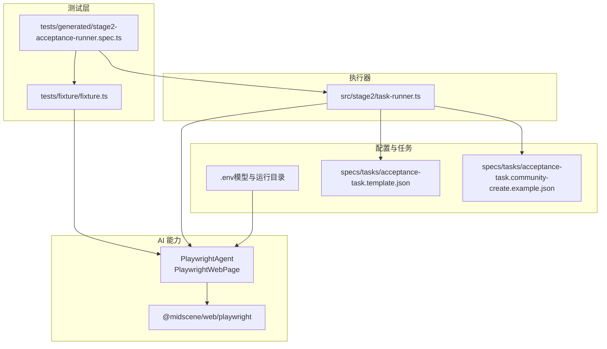
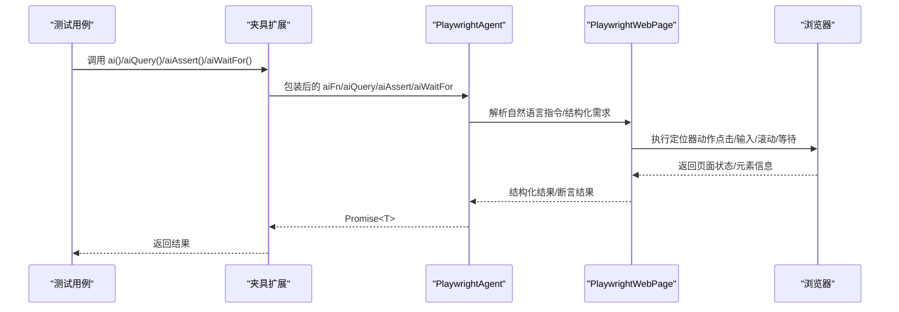
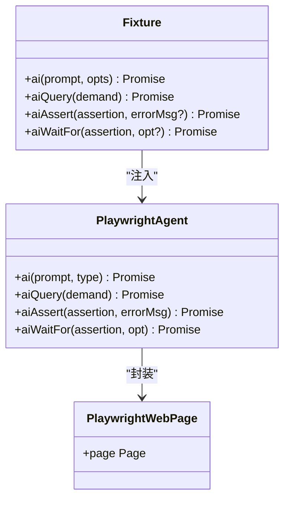
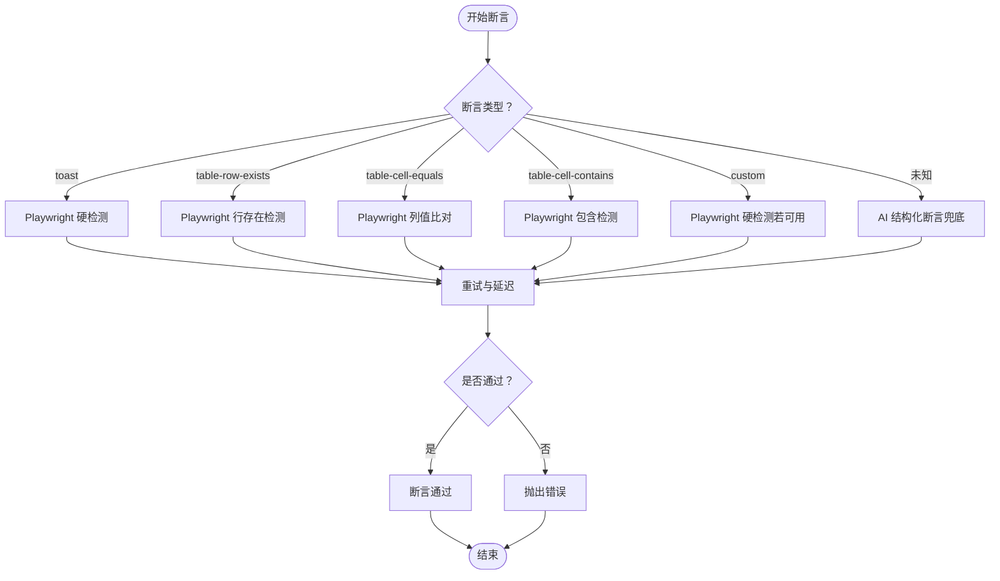
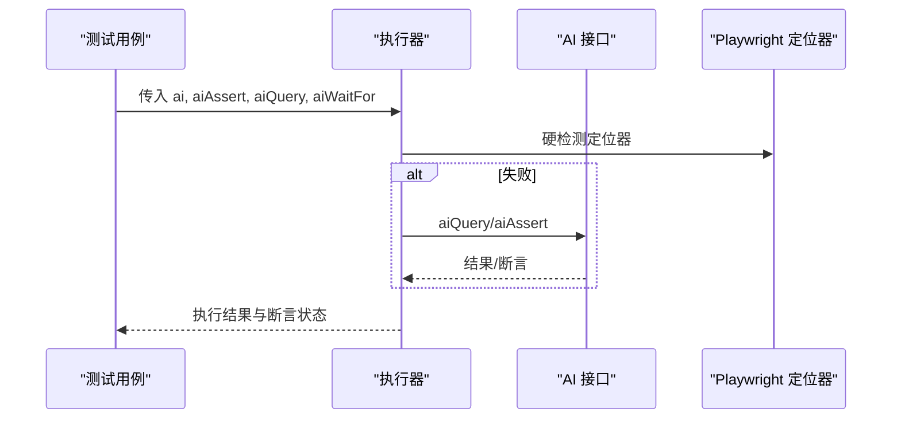
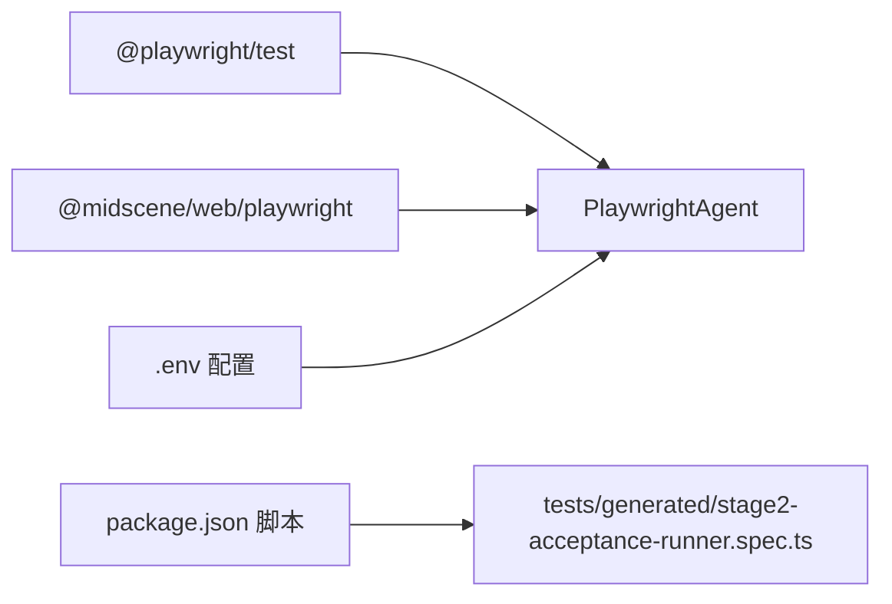

# AI 操作接口

<cite>
**本文引用的文件**
- [README.md](file://README.md)
- [package.json](file://package.json)
- [tests/generated/stage2-acceptance-runner.spec.ts](file://tests/generated/stage2-acceptance-runner.spec.ts)
- [tests/fixture/fixture.ts](file://tests/fixture/fixture.ts)
- [src/stage2/task-runner.ts](file://src/stage2/task-runner.ts)
- [specs/tasks/acceptance-task.template.json](file://specs/tasks/acceptance-task.template.json)
- [specs/tasks/acceptance-task.community-create.example.json](file://specs/tasks/acceptance-task.community-create.example.json)
- [.tasks/AI自主代理验收系统开发改造方案_2026-03-11.md](file://.tasks/AI自主代理验收系统开发改造方案_2026-03-11.md)
</cite>

## 目录
1. [简介](#简介)
2. [项目结构](#项目结构)
3. [核心组件](#核心组件)
4. [架构总览](#架构总览)
5. [详细组件分析](#详细组件分析)
6. [依赖关系分析](#依赖关系分析)
7. [性能考量](#性能考量)
8. [故障排查指南](#故障排查指南)
9. [结论](#结论)
10. [附录](#附录)

## 简介
本文件面向“AI 操作接口”的技术文档，围绕 .ai、.aiQuery、.aiAssert、.aiWaitFor 等接口进行深入解析。内容涵盖：
- 设计原理与实现机制
- 参数格式、返回值类型与典型使用场景
- 与 Playwright 定位器的集成方式
- 如何通过自然语言指令驱动页面自动化
- 接口调用最佳实践、错误处理策略与性能优化建议
- 丰富的实战应用示例（以任务 JSON 与夹具扩展的形式呈现）

## 项目结构
该项目基于 Playwright 与 Midscene.js 构建，提供统一的 AI 自动化夹具，将自然语言指令与 Playwright 定位器能力结合，形成“结构化提取 + 条件等待 + 断言验证”的闭环。

**图表来源**
- [tests/generated/stage2-acceptance-runner.spec.ts:12-37](file://tests/generated/stage2-acceptance-runner.spec.ts#L12-L37)
- [tests/fixture/fixture.ts:23-99](file://tests/fixture/fixture.ts#L23-L99)
- [src/stage2/task-runner.ts:18-25](file://src/stage2/task-runner.ts#L18-L25)
- [specs/tasks/acceptance-task.template.json:1-141](file://specs/tasks/acceptance-task.template.json#L1-L141)
- [specs/tasks/acceptance-task.community-create.example.json:1-229](file://specs/tasks/acceptance-task.community-create.example.json#L1-L229)

**章节来源**
- [README.md:132-164](file://README.md#L132-L164)
- [package.json:6-11](file://package.json#L6-L11)

## 核心组件
- 夹具扩展（Playwright Extend）：在测试夹具中注入 ai、aiAction、aiQuery、aiAssert、aiWaitFor 五个 AI 操作接口，封装底层 PlaywrightAgent 与 PlaywrightWebPage。
- 执行器（Stage2 Runner）：负责加载任务 JSON、解析断言与清理策略、调度 AI 接口与 Playwright 定位器，并提供重试与截图等保障机制。
- Midscene 能力：通过 @midscene/web/playwright 提供的 PlaywrightAgent/PlaywrightWebPage 将自然语言指令转化为可执行的页面交互与结构化提取。

关键要点：
- ai：描述步骤并执行交互（可选 type: 'action'|'query'）。
- aiQuery：从页面提取结构化数据，适合关键结果断言的兜底。
- aiAssert：执行 AI 断言，作为补充性可读断言。
- aiWaitFor：等待条件满足（仅在 Playwright 常规等待不适用时使用）。

**章节来源**
- [tests/fixture/fixture.ts:23-99](file://tests/fixture/fixture.ts#L23-L99)
- [README.md:139-144](file://README.md#L139-L144)

## 架构总览
AI 操作接口的调用链路如下：

**图表来源**
- [tests/fixture/fixture.ts:23-99](file://tests/fixture/fixture.ts#L23-L99)
- [src/stage2/task-runner.ts:18-25](file://src/stage2/task-runner.ts#L18-L25)

## 详细组件分析

### 夹具扩展与接口注入
夹具通过 Playwright 的 extend 机制注入 AI 接口，内部以 PlaywrightAgent 封装自然语言到页面操作的映射，并设置缓存 ID、分组信息与报告生成开关。

- ai(prompt, opts?): 返回 Promise<T>
  - opts.type: 'action' | 'query'
  - 用途：描述步骤并执行交互；当 type='query' 时，侧重结构化输出
- aiQuery(demand): 返回 Promise<T>
  - 用途：从页面提取结构化数据，用于关键断言
- aiAssert(assertion, errorMsg?): 返回 Promise<void>
  - 用途：执行 AI 断言，作为补充性可读断言
- aiWaitFor(assertion, opt?): 返回 Promise<void>
  - 用途：等待条件满足（仅在常规等待不适用时使用）

**图表来源**
- [tests/fixture/fixture.ts:23-99](file://tests/fixture/fixture.ts#L23-L99)

**章节来源**
- [tests/fixture/fixture.ts:23-99](file://tests/fixture/fixture.ts#L23-L99)

### 执行器中的断言与重试机制
执行器在断言阶段优先使用 Playwright 硬检测，若失败则降级到 AI 结构化断言，并内置重试与延迟策略，提升鲁棒性。

- executeAssertionWithRetry(executor, validator, retryCount, delayMs)
  - 支持多次尝试与固定延迟
  - 返回 { success, result?, attempts }
- runAssertion(assertion, task, resolvedValues, runner)
  - 针对不同断言类型（toast/table-row-exists/table-cell-equals/contains/custom/未知）分别处理
  - 对未知类型使用 aiQuery 结构化验证兜底

**图表来源**
- [src/stage2/task-runner.ts:1532-1556](file://src/stage2/task-runner.ts#L1532-L1556)
- [src/stage2/task-runner.ts:1562-1917](file://src/stage2/task-runner.ts#L1562-L1917)

**章节来源**
- [src/stage2/task-runner.ts:1532-1556](file://src/stage2/task-runner.ts#L1532-L1556)
- [src/stage2/task-runner.ts:1562-1917](file://src/stage2/task-runner.ts#L1562-L1917)

### 与 Playwright 定位器的集成
- 夹具层通过 PlaywrightWebPage 将自然语言指令映射到具体页面操作（点击、输入、滚动、等待等），并利用 Playwright 的定位器能力进行元素查找与可见性判断。
- 执行器在断言阶段优先使用 Playwright 的硬检测（如 getByRole/getByLabel/getByTestId 等），并在失败时降级到 AI 结构化断言，从而兼顾稳定性与可读性。

**章节来源**
- [README.md:146-152](file://README.md#L146-L152)
- [src/stage2/task-runner.ts:1562-1917](file://src/stage2/task-runner.ts#L1562-L1917)

### 接口参数与返回值规范
- ai(prompt, opts?)
  - 参数
    - prompt: string（自然语言描述）
    - opts.type: 'action' | 'query'
  - 返回：Promise<T>（根据类型返回交互结果或结构化数据）
- aiQuery(demand)
  - 参数：demand: any（结构化需求描述）
  - 返回：Promise<T>（结构化数据对象）
- aiAssert(assertion, errorMsg?)
  - 参数
    - assertion: string（断言描述）
    - errorMsg?: string（可选错误信息）
  - 返回：Promise<void>（断言失败抛错）
- aiWaitFor(assertion, opt?)
  - 参数
    - assertion: string（等待条件描述）
    - opt?: any（等待选项，如超时、轮询间隔等）
  - 返回：Promise<void>（条件满足或超时）

使用场景建议：
- ai：适用于通用交互步骤，建议拆分为多个小步骤，避免过长 Prompt 导致定位困难。
- aiQuery：适用于关键结果断言，配合 Playwright/TS 代码做硬断言，降低幻觉风险。
- aiAssert：作为补充性可读断言，不宜作为唯一断言手段。
- aiWaitFor：仅在 Playwright 常规等待不适用时使用，避免滥用导致性能下降。

**章节来源**
- [tests/fixture/fixture.ts:16-19](file://tests/fixture/fixture.ts#L16-L19)
- [tests/fixture/fixture.ts:34-39](file://tests/fixture/fixture.ts#L34-L39)
- [tests/fixture/fixture.ts:67-68](file://tests/fixture/fixture.ts#L67-L68)
- [tests/fixture/fixture.ts:81-82](file://tests/fixture/fixture.ts#L81-L82)
- [tests/fixture/fixture.ts:95-96](file://tests/fixture/fixture.ts#L95-L96)
- [.tasks/AI自主代理验收系统开发改造方案_2026-03-11.md:60-84](file://.tasks/AI自主代理验收系统开发改造方案_2026-03-11.md#L60-L84)

### 实战应用示例（以任务 JSON 与夹具扩展为准）
- 新增小区并回查
  - 任务 JSON 示例展示了完整的导航、表单填写、搜索、断言与清理流程，其中断言部分包含 toast、table-row-exists、table-cell-equals、table-cell-contains 与 custom 类型，体现了“硬检测优先 + AI 断言兜底”的策略。
- 夹具注入
  - 测试入口通过夹具注入 ai、aiAssert、aiQuery、aiWaitFor，执行器据此调度 AI 能力与 Playwright 定位器。

**图表来源**
- [tests/generated/stage2-acceptance-runner.spec.ts:18-25](file://tests/generated/stage2-acceptance-runner.spec.ts#L18-L25)
- [specs/tasks/acceptance-task.community-create.example.json:157-194](file://specs/tasks/acceptance-task.community-create.example.json#L157-L194)

**章节来源**
- [tests/generated/stage2-acceptance-runner.spec.ts:12-37](file://tests/generated/stage2-acceptance-runner.spec.ts#L12-L37)
- [specs/tasks/acceptance-task.community-create.example.json:1-229](file://specs/tasks/acceptance-task.community-create.example.json#L1-L229)

## 依赖关系分析
- 运行时依赖
  - @playwright/test：浏览器自动化与定位器能力
  - @midscene/web：AI 定位、提取、断言能力
- 项目脚本
  - stage2:run / stage2:run:headed：启动第二段任务执行
- 环境变量
  - OPENAI_API_KEY、OPENAI_BASE_URL、MIDSCENE_MODEL_NAME、RUNTIME_DIR_PREFIX 等用于模型接入与运行目录管理

**图表来源**
- [package.json:6-11](file://package.json#L6-L11)
- [tests/generated/stage2-acceptance-runner.spec.ts:12-37](file://tests/generated/stage2-acceptance-runner.spec.ts#L12-L37)

**章节来源**
- [package.json:15-24](file://package.json#L15-L24)
- [README.md:31-54](file://README.md#L31-L54)

## 性能考量
- 步骤拆分：将长流程拆分为多个小步骤，降低单次 Prompt 的复杂度与失败成本。
- 重试策略：合理设置 retryCount 与 delayMs，平衡稳定性与执行时长。
- 等待策略：优先使用 Playwright 常规等待，仅在必要时使用 aiWaitFor，避免过度轮询。
- 截图与报告：启用截图与报告有助于定位问题，但应控制频率以免影响性能。
- 模型与缓存：合理设置缓存 ID 与日志目录，提升重复执行的稳定性与可复现性。

**章节来源**
- [.tasks/AI自主代理验收系统开发改造方案_2026-03-11.md:60-84](file://.tasks/AI自主代理验收系统开发改造方案_2026-03-11.md#L60-L84)
- [tests/fixture/fixture.ts:12-14](file://tests/fixture/fixture.ts#L12-L14)

## 故障排查指南
- 断言失败
  - 若为未知断言类型，执行器会使用 aiQuery 结构化断言兜底；若仍失败，检查断言描述是否清晰、字段映射是否正确。
- 重试机制
  - executeAssertionWithRetry 提供了统一的重试与延迟策略，可根据断言类型调整 retryCount 与 delayMs。
- 截图与报告
  - 执行器会在关键节点生成截图与报告，结合报告定位失败步骤与页面状态。
- 环境变量
  - 确认 OPENAI_API_KEY、OPENAI_BASE_URL、MIDSCENE_MODEL_NAME、RUNTIME_DIR_PREFIX 等配置正确。

**章节来源**
- [src/stage2/task-runner.ts:1532-1556](file://src/stage2/task-runner.ts#L1532-L1556)
- [README.md:76-96](file://README.md#L76-L96)

## 结论
AI 操作接口通过夹具注入与执行器协作，实现了“自然语言 + 结构化提取 + 条件等待 + 断言验证”的完整闭环。遵循“硬检测优先 + AI 断言兜底”的策略，既能保证稳定性，又能覆盖复杂语义场景。建议在实际使用中拆分步骤、合理重试、谨慎使用 aiWaitFor，并结合任务 JSON 明确断言与清理策略，以获得更可靠的验收结果。

## 附录
- 任务模板与示例
  - acceptance-task.template.json：通用任务模板，包含导航、表单、搜索、断言与清理等字段
  - acceptance-task.community-create.example.json：社区小区创建与回查的完整示例
- 最佳实践
  - 将整条业务流程拆分为多个小步骤，避免超长 ai() Prompt
  - 关键断言优先使用 aiQuery + Playwright/TS 代码断言，aiAssert 作为补充
  - 仅在 Playwright 常规等待不适用时使用 aiWaitFor

**章节来源**
- [specs/tasks/acceptance-task.template.json:1-141](file://specs/tasks/acceptance-task.template.json#L1-L141)
- [specs/tasks/acceptance-task.community-create.example.json:1-229](file://specs/tasks/acceptance-task.community-create.example.json#L1-L229)
- [.tasks/AI自主代理验收系统开发改造方案_2026-03-11.md:60-84](file://.tasks/AI自主代理验收系统开发改造方案_2026-03-11.md#L60-L84)