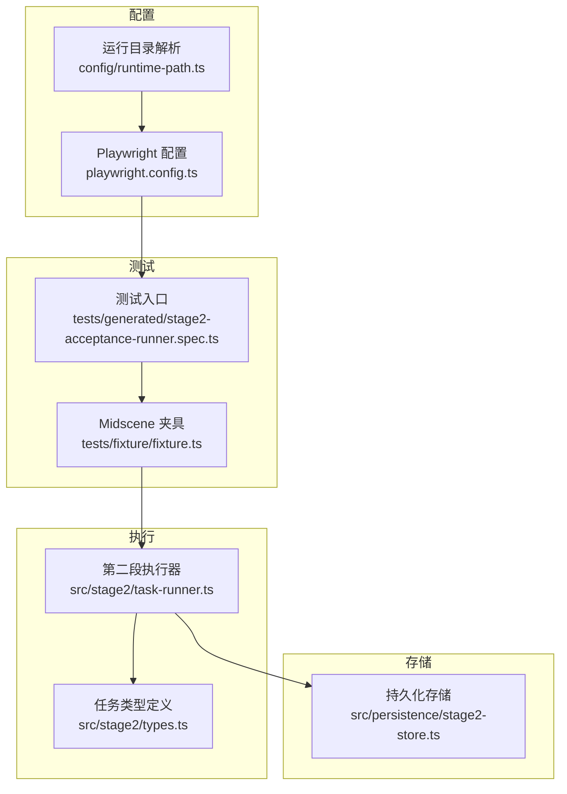
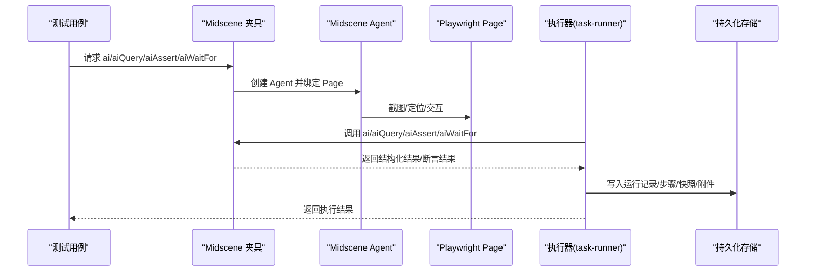
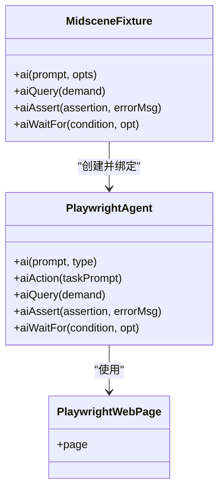
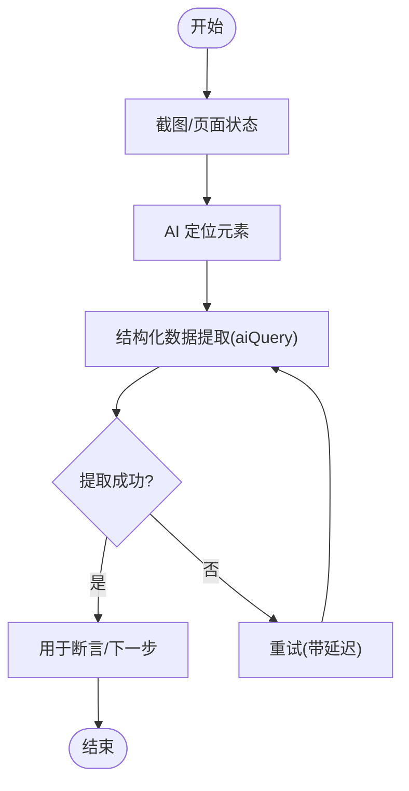
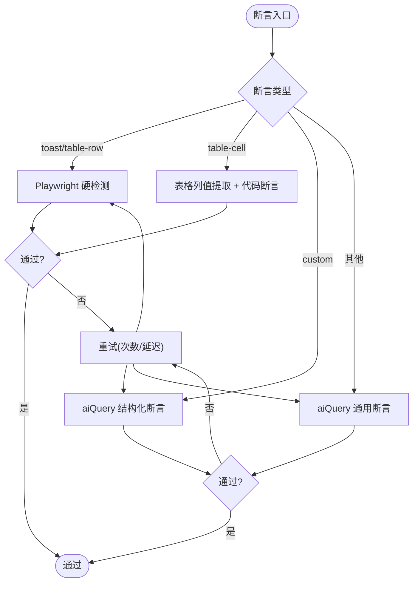
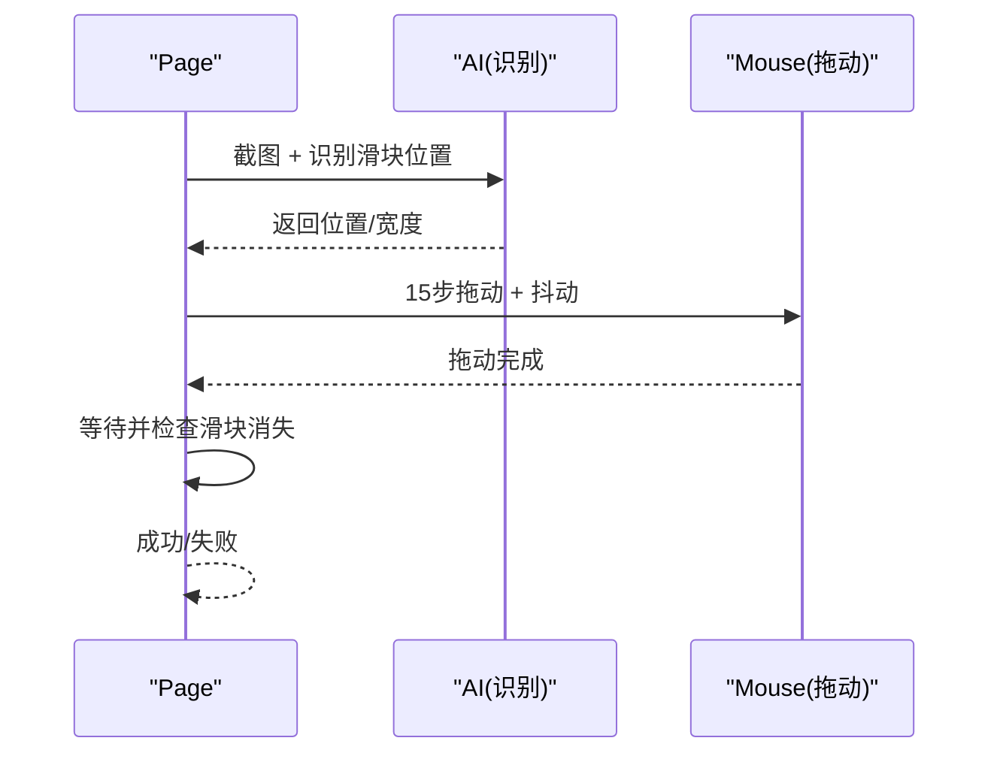
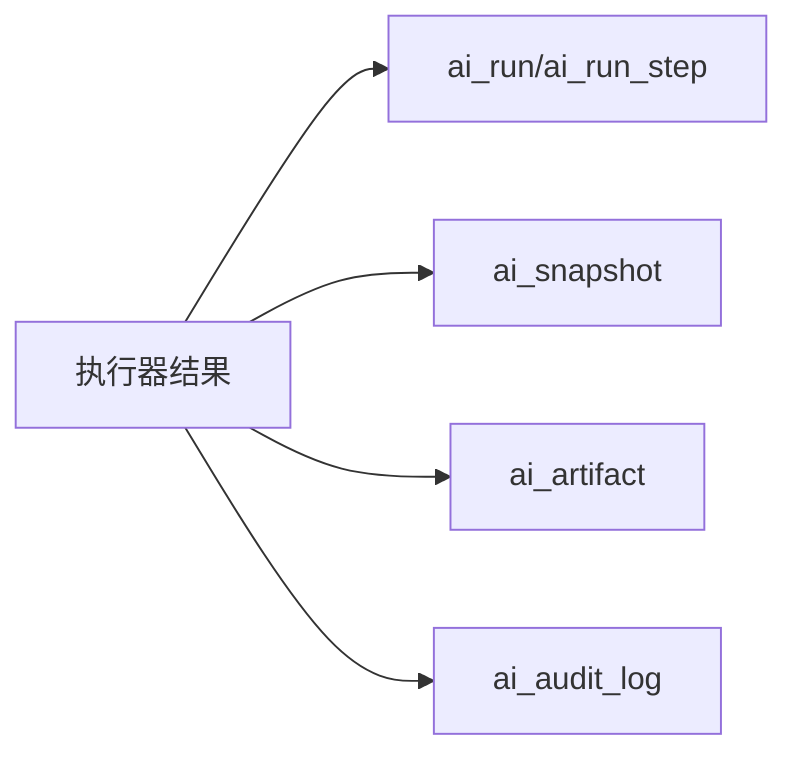
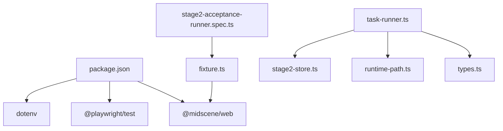

# AI 集成机制

<cite>
**本文引用的文件**
- [README.md](file://README.md)
- [playwright.config.ts](file://playwright.config.ts)
- [package.json](file://package.json)
- [tests/fixture/fixture.ts](file://tests/fixture/fixture.ts)
- [tests/generated/stage2-acceptance-runner.spec.ts](file://tests/generated/stage2-acceptance-runner.spec.ts)
- [src/stage2/task-runner.ts](file://src/stage2/task-runner.ts)
- [src/stage2/types.ts](file://src/stage2/types.ts)
- [src/persistence/stage2-store.ts](file://src/persistence/stage2-store.ts)
- [config/runtime-path.ts](file://config/runtime-path.ts)
- [specs/tasks/acceptance-task.template.json](file://specs/tasks/acceptance-task.template.json)
</cite>

## 目录
1. [简介](#简介)
2. [项目结构](#项目结构)
3. [核心组件](#核心组件)
4. [架构总览](#架构总览)
5. [组件详解](#组件详解)
6. [依赖关系分析](#依赖关系分析)
7. [性能与成本优化](#性能与成本优化)
8. [调试与故障排查](#调试与故障排查)
9. [最佳实践与常见问题](#最佳实践与常见问题)
10. [结论](#结论)
11. [附录](#附录)

## 简介
本项目基于 Playwright 与 Midscene.js 构建，形成“AI 操作 + 结构化断言 + 数据持久化”的端到端自动化测试体系。核心目标是通过 AI 能力（.ai、.aiQuery、.aiAssert、.aiWaitFor）在复杂 UI 场景中实现稳定、可维护的验收测试，并通过结构化断言与重试机制降低幻觉风险，同时通过 SQLite 数据持久化记录运行过程与结果，支撑回归与审计。

## 项目结构
- 配置层：环境变量与运行目录解析，统一输出与报告路径
- 测试层：Playwright 测试入口与 Midscene 夹具（ai、aiQuery、aiAssert、aiWaitFor）
- 执行层：JSON 任务驱动的第二段执行器，封装断言、清理、重试与滑块验证码处理
- 存储层：SQLite 数据持久化，落库运行记录、步骤、快照与附件

图表来源
- [playwright.config.ts:1-95](file://playwright.config.ts#L1-L95)
- [tests/generated/stage2-acceptance-runner.spec.ts:1-39](file://tests/generated/stage2-acceptance-runner.spec.ts#L1-L39)
- [tests/fixture/fixture.ts:1-100](file://tests/fixture/fixture.ts#L1-L100)
- [src/stage2/task-runner.ts:1-200](file://src/stage2/task-runner.ts#L1-L200)
- [src/stage2/types.ts:1-180](file://src/stage2/types.ts#L1-L180)
- [src/persistence/stage2-store.ts:1-120](file://src/persistence/stage2-store.ts#L1-L120)
- [config/runtime-path.ts:1-41](file://config/runtime-path.ts#L1-L41)

章节来源
- [README.md:10-96](file://README.md#L10-L96)
- [playwright.config.ts:1-95](file://playwright.config.ts#L1-L95)
- [config/runtime-path.ts:1-41](file://config/runtime-path.ts#L1-L41)

## 核心组件
- Midscene 夹具与 AI 操作接口
  - ai：执行动作型 AI 指令（可选 type='action'|'query'）
  - aiQuery：结构化数据提取（返回 JSON/数组等结构）
  - aiAssert：AI 断言（返回布尔或结构化断言结果）
  - aiWaitFor：等待条件满足（在常规等待不适用时使用）
- 第二段执行器（JSON 驱动）
  - 解析任务 JSON，按步骤执行，内置断言与清理策略
  - 滑块验证码自动处理（AI 识别 + Playwright 模拟拖动）
  - 带重试的断言执行器，Playwright 硬检测优先，AI 兜底
- 数据持久化
  - 将运行记录、步骤、快照与附件写入 SQLite，支持审计与回溯

章节来源
- [tests/fixture/fixture.ts:23-99](file://tests/fixture/fixture.ts#L23-L99)
- [README.md:132-153](file://README.md#L132-L153)
- [src/stage2/task-runner.ts:1023-1025](file://src/stage2/task-runner.ts#L1023-L1025)
- [src/persistence/stage2-store.ts:74-123](file://src/persistence/stage2-store.ts#L74-L123)

## 架构总览
AI 集成以“夹具 + 执行器 + 存储”三层协作：
- 夹具层：将 Midscene Agent 注入到每个测试用例，暴露 ai/aiQuery/aiAssert/aiWaitFor
- 执行层：按任务 JSON 顺序执行步骤，调用夹具接口，执行断言与清理
- 存储层：将运行状态、步骤、快照与附件落库，便于审计与复盘

图表来源
- [tests/fixture/fixture.ts:23-99](file://tests/fixture/fixture.ts#L23-L99)
- [tests/generated/stage2-acceptance-runner.spec.ts:12-37](file://tests/generated/stage2-acceptance-runner.spec.ts#L12-L37)
- [src/stage2/task-runner.ts:1562-1567](file://src/stage2/task-runner.ts#L1562-L1567)
- [src/persistence/stage2-store.ts:470-493](file://src/persistence/stage2-store.ts#L470-L493)

## 组件详解

### 夹具与 AI 操作接口
- 设计要点
  - 为每个测试用例创建独立的 Agent 实例，设置 testId、cacheId、groupName 等上下文
  - ai 接口支持 type 参数区分“动作型”与“查询型”，便于后续策略优化
  - aiQuery/aiAssert/aiWaitFor 直接委托给 Agent，统一生成报告与缓存
- 使用方法
  - 在测试中直接注入 ai/aiQuery/aiAssert/aiWaitFor，按需组合使用
  - 对复杂断言优先使用 aiQuery + 代码断言，降低 AI 幻觉风险

图表来源
- [tests/fixture/fixture.ts:23-99](file://tests/fixture/fixture.ts#L23-L99)

章节来源
- [tests/fixture/fixture.ts:23-99](file://tests/fixture/fixture.ts#L23-L99)
- [README.md:139-153](file://README.md#L139-L153)

### 页面元素识别与结构化数据提取
- 元素识别
  - 通过 Midscene AI 对页面截图进行分析，定位按钮、输入框、表格行等元素
  - 执行器内部提供多种选择器优先级（表格行、弹窗、Toast 等），提升跨平台稳定性
- 结构化提取
  - aiQuery 返回结构化数据（如字符串数组、对象），供断言与后续步骤使用
  - 执行器内置重试机制，提高不稳定页面的提取成功率

图表来源
- [src/stage2/task-runner.ts:1532-1556](file://src/stage2/task-runner.ts#L1532-L1556)
- [src/stage2/types.ts:58-65](file://src/stage2/types.ts#L58-L65)

章节来源
- [src/stage2/task-runner.ts:1532-1556](file://src/stage2/task-runner.ts#L1532-L1556)
- [src/stage2/types.ts:58-65](file://src/stage2/types.ts#L58-L65)

### 智能断言与重试机制
- 断言策略
  - Playwright 硬检测优先：Toast、表格行/单元格等具备强定位能力的场景
  - AI 断言兜底：未知类型或复杂语义断言，通过 aiQuery 返回结构化断言结果
  - 自定义断言：提供自然语言描述，由 AI 验证页面状态
- 重试与软断言
  - 统一的带重试断言执行器，支持自定义重试次数与延迟
  - soft 标记用于软断言，失败不影响整体流程但记录在案

图表来源
- [src/stage2/task-runner.ts:1562-1917](file://src/stage2/task-runner.ts#L1562-L1917)
- [src/stage2/types.ts:67-88](file://src/stage2/types.ts#L67-L88)

章节来源
- [src/stage2/task-runner.ts:1562-1917](file://src/stage2/task-runner.ts#L1562-L1917)
- [src/stage2/types.ts:67-88](file://src/stage2/types.ts#L67-L88)

### 滑块验证码自动处理
- 自动识别
  - 使用 aiQuery 分析截图，识别滑块按钮位置与滑槽宽度
- 模拟拖动
  - 使用 Playwright mouse API，15 步渐进拖动，easeOut 缓动 + 随机抖动
- 结果验证
  - 最多重试 3 次，检查滑块是否消失

图表来源
- [README.md:64-74](file://README.md#L64-L74)
- [src/stage2/task-runner.ts:650-648](file://src/stage2/task-runner.ts#L650-L648)

章节来源
- [README.md:64-74](file://README.md#L64-L74)
- [src/stage2/task-runner.ts:650-648](file://src/stage2/task-runner.ts#L650-L648)

### 数据持久化与运行产物
- 写库内容
  - 运行记录、步骤明细、结构化快照、附件（截图、报告、结果文件）
- 文件落盘
  - 运行产物统一收敛到 t_runtime/ 下，便于归档与审计
- 审计日志
  - 记录关键事件（任务创建、版本变更、步骤失败等）

图表来源
- [src/persistence/stage2-store.ts:263-356](file://src/persistence/stage2-store.ts#L263-356)
- [src/persistence/stage2-store.ts:358-468](file://src/persistence/stage2-store.ts#L358-468)
- [src/persistence/stage2-store.ts:615-630](file://src/persistence/stage2-store.ts#L615-L630)

章节来源
- [README.md:76-119](file://README.md#L76-L119)
- [src/persistence/stage2-store.ts:74-123](file://src/persistence/stage2-store.ts#L74-L123)

## 依赖关系分析
- 外部依赖
  - @midscene/web：提供 Playwright 集成的 Agent 与夹具
  - @playwright/test：测试框架与报告
  - dotenv：环境变量加载
- 内部模块耦合
  - 执行器依赖夹具提供的 ai/aiQuery/aiAssert/aiWaitFor
  - 执行器依赖类型定义与运行目录配置
  - 存储层依赖执行器输出的运行结果与步骤明细

图表来源
- [package.json:1-26](file://package.json#L1-L26)
- [src/stage2/task-runner.ts:1-200](file://src/stage2/task-runner.ts#L1-L200)
- [src/stage2/types.ts:1-180](file://src/stage2/types.ts#L1-L180)
- [config/runtime-path.ts:1-41](file://config/runtime-path.ts#L1-41)
- [src/persistence/stage2-store.ts:1-120](file://src/persistence/stage2-store.ts#L1-L120)
- [tests/generated/stage2-acceptance-runner.spec.ts:1-39](file://tests/generated/stage2-acceptance-runner.spec.ts#L1-L39)
- [tests/fixture/fixture.ts:1-100](file://tests/fixture/fixture.ts#L1-L100)

章节来源
- [package.json:1-26](file://package.json#L1-L26)
- [src/stage2/task-runner.ts:1-200](file://src/stage2/task-runner.ts#L1-L200)

## 性能与成本优化
- 模型与请求策略
  - 通过环境变量配置模型与网关，按需选择高性价比模型
  - 合理设置重试次数与延迟，避免过度请求
- 截图与缓存
  - 利用 Midscene 缓存与报告目录，减少重复截图与推理
  - 控制截图频率，仅在关键步骤与失败时生成
- 执行器优化
  - 优先使用 Playwright 硬检测，降低 AI 调用频次
  - 对表格等结构化场景，尽量使用结构化提取 + 代码断言
- 运行时长与并发
  - 合理设置 step/page 超时，避免长时间空等
  - 在 CI 环境适当调整 workers 与 retries，平衡稳定性与速度

章节来源
- [README.md:31-54](file://README.md#L31-L54)
- [README.md:146-153](file://README.md#L146-L153)
- [src/stage2/types.ts:128-133](file://src/stage2/types.ts#L128-L133)

## 调试与故障排查
- 常见问题
  - AI 幻觉导致断言失败：优先使用 aiQuery + 代码断言，必要时开启软断言
  - 页面动态渲染导致定位失败：增加等待或使用 aiWaitFor
  - 滑块验证码异常：检查 STAGE2_CAPTCHA_MODE 与等待超时配置
- 调试技巧
  - 查看 Midscene 报告与截图，定位 AI 推理问题
  - 开启 trace 与截图，结合 Playwright HTML 报告定位 UI 问题
  - 使用软断言与重试，隔离偶发性失败
- 降级策略
  - 未知断言类型自动走 aiQuery 通用断言
  - 失败步骤写入审计日志，便于回溯
  - 失败时生成最终结果与附件，支持离线复盘

章节来源
- [README.md:146-153](file://README.md#L146-L153)
- [src/stage2/task-runner.ts:1896-1917](file://src/stage2/task-runner.ts#L1896-L1917)
- [src/persistence/stage2-store.ts:581-588](file://src/persistence/stage2-store.ts#L581-L588)

## 最佳实践与常见问题
- 最佳实践
  - 断言优先使用 Playwright 硬检测，AI 断言作为兜底
  - 复杂语义断言使用 aiQuery + 代码断言，减少自由文本 AI 操作
  - table-row-exists 作为硬门槛，table-cell-* 仅校验少量关键列，建议 soft=true
  - 任务 JSON 中合理配置 uiProfile 与断言参数，提升跨平台稳定性
- 常见问题
  - 环境变量未生效：确认 .env 配置与 RUNTIME_DIR_PREFIX
  - 模型接入不兼容：参考 Midscene 官方模型配置文档
  - 执行器报错：查看最终结果文件与截图，结合审计日志定位

章节来源
- [README.md:146-153](file://README.md#L146-L153)
- [README.md:31-54](file://README.md#L31-L54)
- [specs/tasks/acceptance-task.template.json:1-141](file://specs/tasks/acceptance-task.template.json#L1-L141)

## 结论
本项目通过 Midscene 与 Playwright 的深度集成，构建了“结构化提取 + 智能断言 + 数据持久化”的自动化测试闭环。执行器以 JSON 任务为驱动，结合重试与软断言策略，有效降低了复杂 UI 场景下的不确定性；通过 SQLite 持久化与统一运行目录，实现了可审计、可复盘的测试体系。建议在实际使用中遵循“Playwright 硬检测优先、AI 断言兜底”的原则，并结合环境配置与缓存策略优化性能与成本。

## 附录
- 运行与产物
  - 运行命令与报告目录由 playwright.config.ts 与 runtime-path.ts 统一管理
  - 产物收敛至 t_runtime/ 下，便于归档与审计
- 任务模板
  - 使用 acceptance-task.template.json 作为任务输入模板，按需填充字段与断言

章节来源
- [playwright.config.ts:1-95](file://playwright.config.ts#L1-L95)
- [config/runtime-path.ts:1-41](file://config/runtime-path.ts#L1-L41)
- [README.md:154-180](file://README.md#L154-L180)
- [specs/tasks/acceptance-task.template.json:1-141](file://specs/tasks/acceptance-task.template.json#L1-L141)