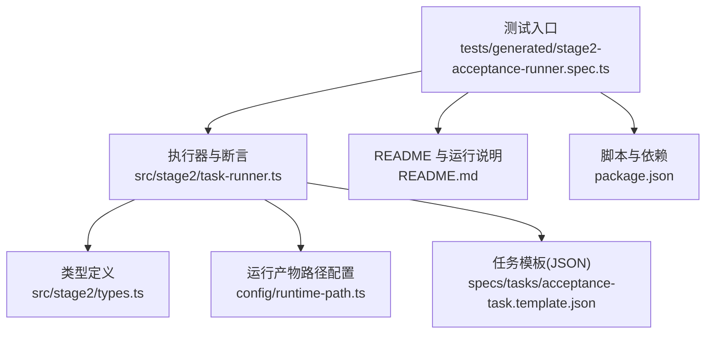
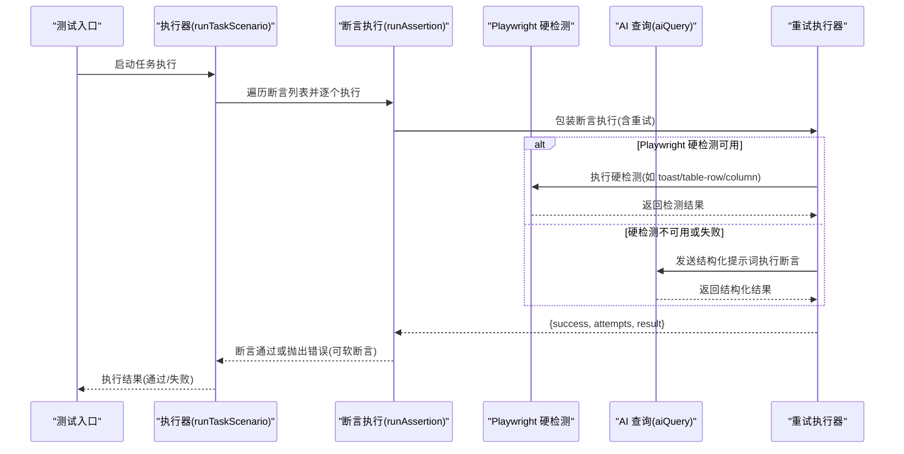
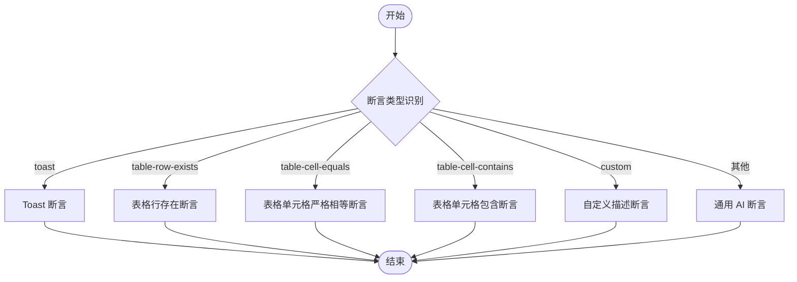
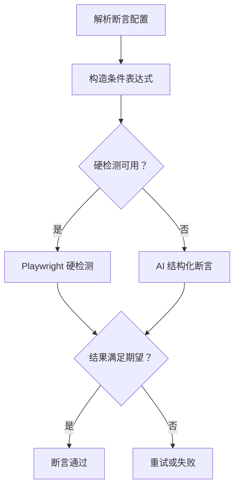
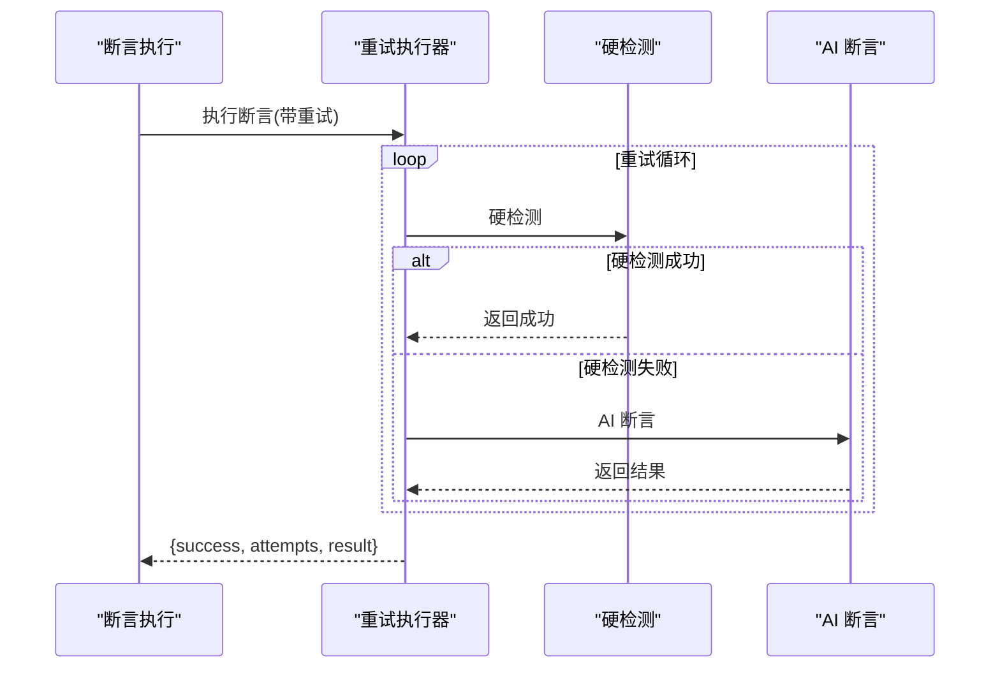
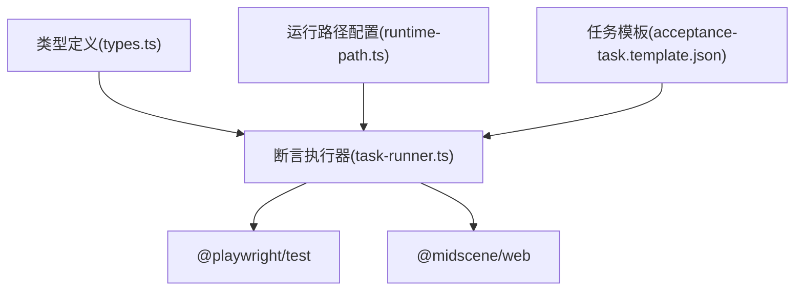

# 智能断言

<cite>
**本文引用的文件**
- [README.md](file://README.md)
- [package.json](file://package.json)
- [config/runtime-path.ts](file://config/runtime-path.ts)
- [src/stage2/types.ts](file://src/stage2/types.ts)
- [src/stage2/task-runner.ts](file://src/stage2/task-runner.ts)
- [specs/tasks/acceptance-task.template.json](file://specs/tasks/acceptance-task.template.json)
- [tests/generated/stage2-acceptance-runner.spec.ts](file://tests/generated/stage2-acceptance-runner.spec.ts)
</cite>

## 目录
1. [简介](#简介)
2. [项目结构](#项目结构)
3. [核心组件](#核心组件)
4. [架构总览](#架构总览)
5. [详细组件分析](#详细组件分析)
6. [依赖关系分析](#依赖关系分析)
7. [性能考量](#性能考量)
8. [故障排查指南](#故障排查指南)
9. [结论](#结论)
10. [附录](#附录)

## 简介
本技术文档围绕智能断言接口 .aiAssert 的实现进行深入解析，重点阐述其如何通过“语义化断言 + 条件表达式 + 结果评估”的方式，实现对页面状态的自动化验证。系统采用“Playwright 硬检测优先 + AI 断言兜底 + 重试机制”的策略，既保证稳定性与可维护性，又能在复杂语义场景中通过 AI 能力进行灵活验证。

此外，文档还总结了断言类型识别、条件表达式解析、结果评估机制、失败处理与重试策略、配置项与扩展方法、最佳实践与调试技巧，以及性能优化建议，帮助读者在不同业务场景中高效、稳健地使用智能断言。

## 项目结构
本项目采用分层与模块化组织方式：
- 核心执行器与断言逻辑集中在 stage2 子系统，负责从 JSON 任务驱动 Playwright 与 Midscene 的 AI 能力，执行断言与清理。
- 配置与运行产物路径通过环境变量集中管理，便于跨平台与多任务运行。
- 测试入口通过 Playwright 测试文件调用执行器，形成端到端的验收闭环。

**图表来源**
- [tests/generated/stage2-acceptance-runner.spec.ts:12-37](file://tests/generated/stage2-acceptance-runner.spec.ts#L12-L37)
- [src/stage2/task-runner.ts:1562-1917](file://src/stage2/task-runner.ts#L1562-L1917)
- [src/stage2/types.ts:67-88](file://src/stage2/types.ts#L67-L88)
- [config/runtime-path.ts:38-40](file://config/runtime-path.ts#L38-L40)
- [specs/tasks/acceptance-task.template.json:75-106](file://specs/tasks/acceptance-task.template.json#L75-L106)
- [README.md:132-158](file://README.md#L132-L158)
- [package.json:6-11](file://package.json#L6-L11)

**章节来源**
- [README.md:132-158](file://README.md#L132-L158)
- [package.json:6-11](file://package.json#L6-L11)
- [config/runtime-path.ts:38-40](file://config/runtime-path.ts#L38-L40)
- [tests/generated/stage2-acceptance-runner.spec.ts:12-37](file://tests/generated/stage2-acceptance-runner.spec.ts#L12-L37)

## 核心组件
- 断言类型与配置
  - 断言类型通过 assertion.type 字段识别，支持 toast、table-row-exists、table-cell-equals、table-cell-contains、custom 等。
  - 断言配置包含超时、重试次数、匹配模式、软断言标记、自定义描述等。
- 执行策略
  - 策略：Playwright 硬检测优先（如可见文本、表格行/列检测），AI 断言兜底，配合带退避的重试机制。
- 结果评估
  - 对于结构化返回（如 { found: boolean, ... } 或 { passed: boolean, reason? }），通过 validator 函数判断是否满足期望。
- 失败处理
  - 支持软断言（soft=true）与硬断言（soft=false），软断言失败不中断流程，硬断言失败抛出错误。
- 重试机制
  - 统一的带重试执行器，支持自定义重试次数与延迟，避免瞬时不稳定因素导致误判。

**章节来源**
- [src/stage2/types.ts:67-88](file://src/stage2/types.ts#L67-L88)
- [src/stage2/task-runner.ts:1562-1917](file://src/stage2/task-runner.ts#L1562-L1917)
- [src/stage2/task-runner.ts:1532-1556](file://src/stage2/task-runner.ts#L1532-L1556)

## 架构总览
智能断言的整体执行链路如下：

**图表来源**
- [tests/generated/stage2-acceptance-runner.spec.ts:18-36](file://tests/generated/stage2-acceptance-runner.spec.ts#L18-L36)
- [src/stage2/task-runner.ts:1562-1917](file://src/stage2/task-runner.ts#L1562-L1917)
- [src/stage2/task-runner.ts:1532-1556](file://src/stage2/task-runner.ts#L1532-L1556)

## 详细组件分析

### 断言类型与识别
- 类型识别
  - 通过 assertion.type 判断断言类型，目前支持 toast、table-row-exists、table-cell-equals、table-cell-contains、custom。
- 配置参数
  - timeoutMs：断言超时时间（毫秒）
  - retryCount：断言重试次数
  - matchMode：行匹配模式（exact/contains）
  - soft：软断言标记
  - description：自定义断言描述（用于 AI 断言）

**图表来源**
- [src/stage2/types.ts:67-88](file://src/stage2/types.ts#L67-L88)
- [src/stage2/task-runner.ts:1562-1917](file://src/stage2/task-runner.ts#L1562-L1917)

**章节来源**
- [src/stage2/types.ts:67-88](file://src/stage2/types.ts#L67-L88)
- [src/stage2/task-runner.ts:1562-1917](file://src/stage2/task-runner.ts#L1562-L1917)

### 条件表达式解析与结果评估
- 条件表达式解析
  - 文本可见性：支持精确/模糊匹配与 Toast 组件检测。
  - 表格行/列：支持行值匹配（exact/contains），列值提取与比较。
  - 自定义描述：通过自然语言描述构建 AI 提示词，要求返回结构化结果。
- 结果评估
  - 通过 validator 函数判断返回对象的关键字段是否满足期望（如 found/passed/allMatched 等）。
  - 对于表格断言，还会输出缺失列与不匹配列的诊断信息，便于定位问题。

**图表来源**
- [src/stage2/task-runner.ts:1278-1322](file://src/stage2/task-runner.ts#L1278-L1322)
- [src/stage2/task-runner.ts:1327-1527](file://src/stage2/task-runner.ts#L1327-L1527)
- [src/stage2/task-runner.ts:1532-1556](file://src/stage2/task-runner.ts#L1532-L1556)

**章节来源**
- [src/stage2/task-runner.ts:1278-1322](file://src/stage2/task-runner.ts#L1278-L1322)
- [src/stage2/task-runner.ts:1327-1527](file://src/stage2/task-runner.ts#L1327-L1527)
- [src/stage2/task-runner.ts:1532-1556](file://src/stage2/task-runner.ts#L1532-L1556)

### 执行策略与重试机制
- 执行策略
  - 硬检测优先：尽可能使用 Playwright 的可见性与结构化定位能力，提升稳定性与性能。
  - AI 兜底：当硬检测不可用或失败时，使用 aiQuery 执行结构化断言。
- 重试机制
  - 统一的带退避重试执行器，支持自定义重试次数与延迟。
  - 对于不同断言类型，重试次数与超时分配有所不同，以平衡稳定性与响应速度。

**图表来源**
- [src/stage2/task-runner.ts:1532-1556](file://src/stage2/task-runner.ts#L1532-L1556)
- [src/stage2/task-runner.ts:1562-1917](file://src/stage2/task-runner.ts#L1562-L1917)

**章节来源**
- [src/stage2/task-runner.ts:1532-1556](file://src/stage2/task-runner.ts#L1532-L1556)
- [src/stage2/task-runner.ts:1562-1917](file://src/stage2/task-runner.ts#L1562-L1917)

### 失败处理与软断言
- 软断言（soft=true）
  - 断言失败不中断流程，仅记录失败信息，适合非关键验证或探索性断言。
- 硬断言（soft=false 或未设置）
  - 断言失败直接抛出错误，中断流程，确保关键验证不被忽略。
- 失败诊断
  - 输出断言类型、期望值、实际值、缺失列、不匹配列等信息，便于快速定位问题。

**章节来源**
- [src/stage2/types.ts:84-88](file://src/stage2/types.ts#L84-L88)
- [src/stage2/task-runner.ts:1612-1615](file://src/stage2/task-runner.ts#L1612-L1615)
- [src/stage2/task-runner.ts:1663-1667](file://src/stage2/task-runner.ts#L1663-L1667)
- [src/stage2/task-runner.ts:1864-1870](file://src/stage2/task-runner.ts#L1864-L1870)

### 配置选项与扩展方法
- 配置选项
  - 断言级别：timeoutMs、retryCount、matchMode、soft、description。
  - UI 适配：uiProfile.tableRowSelectors、uiProfile.toastSelectors、uiProfile.dialogSelectors。
  - 任务运行：runtime.stepTimeoutMs、pageTimeoutMs、screenshotOnStep、trace。
- 扩展方法
  - 新增断言类型：在断言执行器中增加类型分支，结合 Playwright 硬检测与 AI 兜底实现。
  - 自定义提示词：通过 description 或自定义指令扩展 AI 断言能力。
  - 选择器扩展：在 uiProfile 中补充平台特定的选择器，提升硬检测命中率。

**章节来源**
- [src/stage2/types.ts:58-88](file://src/stage2/types.ts#L58-L88)
- [specs/tasks/acceptance-task.template.json:29-45](file://specs/tasks/acceptance-task.template.json#L29-L45)
- [README.md:191-201](file://README.md#L191-L201)

## 依赖关系分析
- 组件耦合
  - 执行器与断言逻辑高度内聚，通过统一的断言入口与重试执行器解耦具体断言类型。
  - 类型定义与执行器之间通过接口契约保持松耦合。
- 外部依赖
  - Playwright：提供页面定位、可见性检测与交互能力。
  - Midscene AI：提供结构化断言与自然语言理解能力。
- 配置与路径
  - 运行产物路径通过环境变量集中管理，便于跨平台与多任务隔离。

**图表来源**
- [src/stage2/types.ts:67-88](file://src/stage2/types.ts#L67-L88)
- [src/stage2/task-runner.ts:1562-1917](file://src/stage2/task-runner.ts#L1562-L1917)
- [config/runtime-path.ts:38-40](file://config/runtime-path.ts#L38-L40)
- [specs/tasks/acceptance-task.template.json:75-106](file://specs/tasks/acceptance-task.template.json#L75-L106)

**章节来源**
- [src/stage2/types.ts:67-88](file://src/stage2/types.ts#L67-L88)
- [src/stage2/task-runner.ts:1562-1917](file://src/stage2/task-runner.ts#L1562-L1917)
- [config/runtime-path.ts:38-40](file://config/runtime-path.ts#L38-L40)
- [specs/tasks/acceptance-task.template.json:75-106](file://specs/tasks/acceptance-task.template.json#L75-L106)

## 性能考量
- 硬检测优先
  - 优先使用 Playwright 的可见性与结构化定位，减少不必要的 AI 调用，降低延迟与成本。
- 合理的重试与超时
  - 不同断言类型分配不同的超时与重试次数，避免过度重试造成资源浪费。
- 选择器与匹配模式
  - 在 uiProfile 中提供更精准的选择器，减少遍历范围，提高检测效率。
- 截图与报告
  - 仅在必要时开启截图与 trace，避免产生大量中间产物影响性能。

[本节为通用指导，无需列出具体文件来源]

## 故障排查指南
- 常见问题
  - 断言频繁失败：检查断言类型与匹配模式是否正确，适当增大 retryCount 与 timeoutMs。
  - AI 断言幻觉：尽量使用结构化提示词与明确的返回格式约束，必要时回退到硬检测。
  - 页面不稳定：增加重试间隔或启用软断言，避免瞬时波动影响整体流程。
- 调试技巧
  - 开启截图与 trace，定位页面状态变化。
  - 输出断言详情（期望值、实际值、缺失列、不匹配列），快速定位差异。
  - 使用任务模板中的 uiProfile 选择器，提升硬检测命中率。
- 错误处理
  - 硬断言失败会直接抛出错误，软断言失败仅记录，便于继续执行后续步骤。

**章节来源**
- [src/stage2/task-runner.ts:1532-1556](file://src/stage2/task-runner.ts#L1532-L1556)
- [src/stage2/task-runner.ts:1612-1615](file://src/stage2/task-runner.ts#L1612-L1615)
- [src/stage2/task-runner.ts:1663-1667](file://src/stage2/task-runner.ts#L1663-L1667)
- [src/stage2/task-runner.ts:1864-1870](file://src/stage2/task-runner.ts#L1864-L1870)

## 结论
智能断言通过“硬检测优先 + AI 兜底 + 重试机制”的策略，实现了对复杂语义场景的稳健验证。借助清晰的断言类型与配置、完善的失败处理与诊断、以及可扩展的提示词与选择器体系，开发者可以在保证稳定性的同时，灵活应对多样化的业务验证需求。建议在关键路径上优先使用硬检测，在复杂语义场景中谨慎使用 AI 断言，并通过软断言与重试策略提升鲁棒性。

[本节为总结性内容，无需列出具体文件来源]

## 附录
- 使用示例与最佳实践
  - 断言优先使用 Playwright 硬检测，AI 断言作为兜底。
  - 表格断言优先尝试 Playwright 表格列值提取与代码比对，失败后再降级到 AI 结构化断言。
  - 自定义断言建议配置 soft=true，避免因个别断言失败阻断整体流程。
- 运行与产物
  - 通过测试入口启动执行，完成后可在运行产物目录查看报告与截图。
- 配置参考
  - 任务模板提供了断言与清理的完整示例，可据此扩展自定义断言类型与提示词。

**章节来源**
- [README.md:146-153](file://README.md#L146-L153)
- [specs/tasks/acceptance-task.template.json:75-128](file://specs/tasks/acceptance-task.template.json#L75-L128)
- [tests/generated/stage2-acceptance-runner.spec.ts:18-36](file://tests/generated/stage2-acceptance-runner.spec.ts#L18-L36)