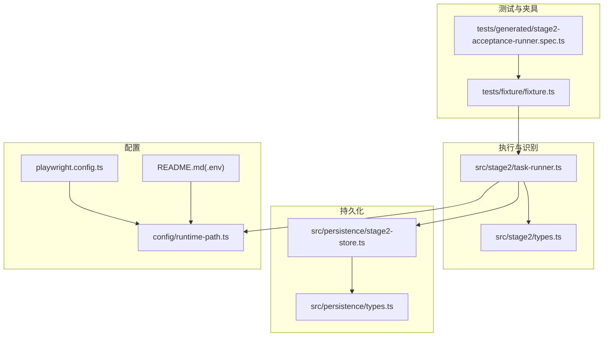
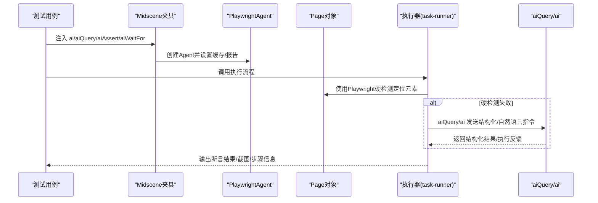
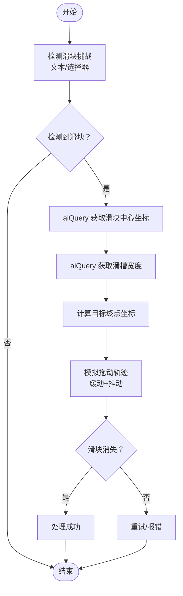
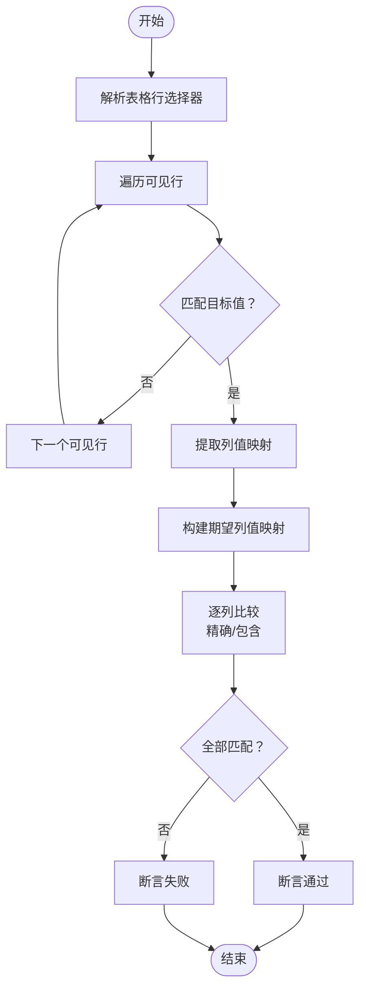
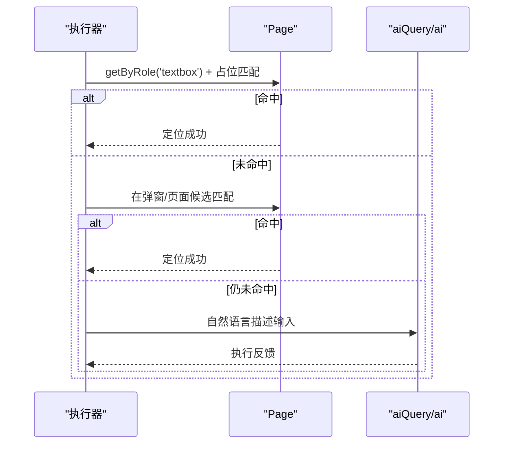
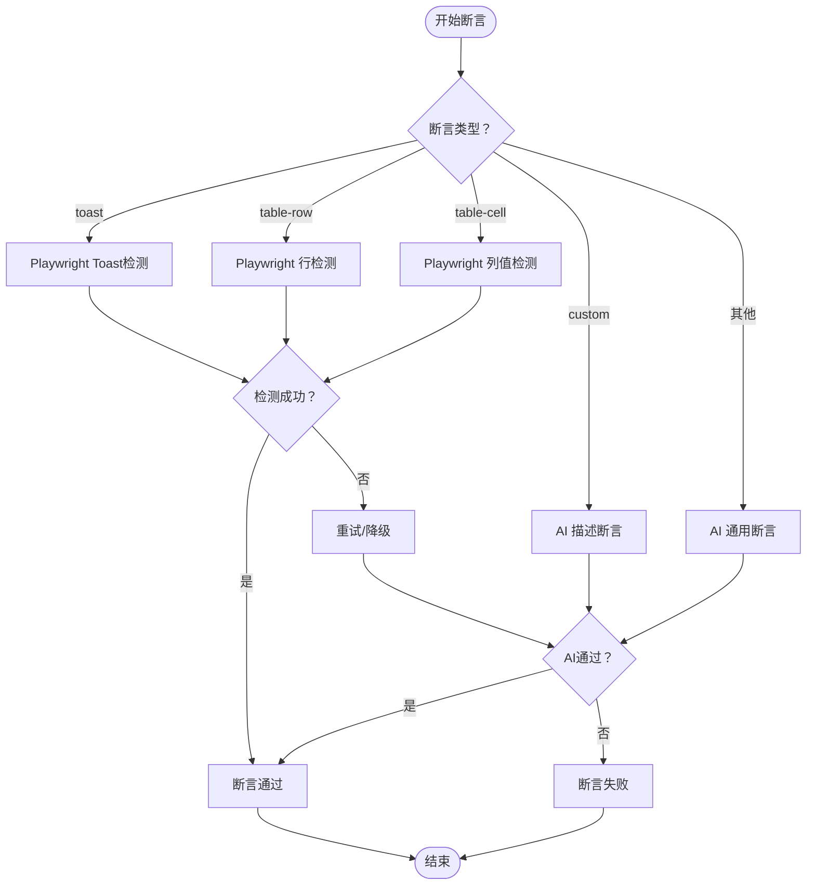
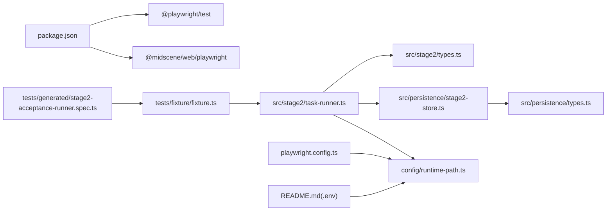

# 页面元素识别

<cite>
**本文引用的文件**
- [README.md](file://README.md)
- [package.json](file://package.json)
- [playwright.config.ts](file://playwright.config.ts)
- [src/stage2/task-runner.ts](file://src/stage2/task-runner.ts)
- [src/stage2/types.ts](file://src/stage2/types.ts)
- [src/persistence/types.ts](file://src/persistence/types.ts)
- [src/persistence/stage2-store.ts](file://src/persistence/stage2-store.ts)
- [config/runtime-path.ts](file://config/runtime-path.ts)
- [tests/generated/stage2-acceptance-runner.spec.ts](file://tests/generated/stage2-acceptance-runner.spec.ts)
- [tests/fixture/fixture.ts](file://tests/fixture/fixture.ts)
</cite>

## 目录
1. [简介](#简介)
2. [项目结构](#项目结构)
3. [核心组件](#核心组件)
4. [架构总览](#架构总览)
5. [详细组件分析](#详细组件分析)
6. [依赖关系分析](#依赖关系分析)
7. [性能考量](#性能考量)
8. [故障排查指南](#故障排查指南)
9. [结论](#结论)
10. [附录](#附录)

## 简介
本技术文档围绕“页面元素识别”能力展开，结合仓库中基于 Playwright 与 Midscene.js 的自动化测试体系，系统阐述 AI 如何在真实网页中进行元素边界检测、类型分类与属性提取，并说明其与自然语言描述协同定位复杂元素的方法、多语言与上下文理解能力、配置项与扩展机制、调试与错误处理策略，以及适配不同 UI 框架的策略。

本项目通过 aiQuery、ai、aiAssert、aiWaitFor 等能力，将结构化查询与自然语言指令相结合，形成“Playwright 硬检测优先 + AI 兜底”的通用识别与断言框架，既保证稳定性，又提升复杂场景的鲁棒性。

## 项目结构
项目采用分层组织：测试入口与夹具负责注入 AI 能力；第二阶段执行器负责任务编排、元素识别与断言；持久化模块负责运行期数据落库；配置模块统一管理运行时目录与环境变量。

**图表来源**
- [tests/generated/stage2-acceptance-runner.spec.ts:1-39](file://tests/generated/stage2-acceptance-runner.spec.ts#L1-L39)
- [tests/fixture/fixture.ts:1-100](file://tests/fixture/fixture.ts#L1-L100)
- [src/stage2/task-runner.ts:1-120](file://src/stage2/task-runner.ts#L1-L120)
- [src/stage2/types.ts:1-180](file://src/stage2/types.ts#L1-L180)
- [src/persistence/stage2-store.ts:1-120](file://src/persistence/stage2-store.ts#L1-L120)
- [src/persistence/types.ts:1-125](file://src/persistence/types.ts#L1-L125)
- [config/runtime-path.ts:1-41](file://config/runtime-path.ts#L1-L41)
- [playwright.config.ts:1-95](file://playwright.config.ts#L1-L95)
- [README.md:39-54](file://README.md#L39-L54)

**章节来源**
- [README.md:1-223](file://README.md#L1-L223)
- [package.json:1-26](file://package.json#L1-L26)
- [playwright.config.ts:1-95](file://playwright.config.ts#L1-L95)
- [config/runtime-path.ts:1-41](file://config/runtime-path.ts#L1-L41)

## 核心组件
- AI 能力注入与夹具
  - 夹具通过 Midscene 的 PlaywrightAgent 包装 page，暴露 ai、aiQuery、aiAssert、aiWaitFor 等方法，统一缓存与报告生成。
- 第二阶段执行器
  - 提供滑块验证码自动处理、菜单/按钮/输入框识别与填充、表格行与列值提取、Toast/对话框检测、断言执行器等。
- 类型与配置
  - 任务模型（AcceptanceTask）、断言模型（TaskAssertion）、清理模型（TaskCleanup）、运行时配置（TaskRuntime）等。
- 持久化存储
  - 将任务、运行、步骤、快照、附件等结构化信息写入 SQLite，便于回溯与审计。

**章节来源**
- [tests/fixture/fixture.ts:23-99](file://tests/fixture/fixture.ts#L23-L99)
- [src/stage2/task-runner.ts:1-120](file://src/stage2/task-runner.ts#L1-L120)
- [src/stage2/types.ts:141-180](file://src/stage2/types.ts#L141-L180)
- [src/persistence/stage2-store.ts:74-124](file://src/persistence/stage2-store.ts#L74-L124)

## 架构总览
AI 元素识别在本项目中体现为“结构化查询 + 自然语言指令”的混合策略：
- aiQuery：面向结构化数据抽取与验证，适合表格行、列值、提示信息等。
- ai：面向动作型指令，适合复杂交互或无法直接定位的元素。
- aiAssert/aiWaitFor：面向断言与等待，提供兜底保障。
- Playwright 硬检测：优先使用 getByRole/getByText 等强定位 API，提高稳定性与性能。

**图表来源**
- [tests/fixture/fixture.ts:23-99](file://tests/fixture/fixture.ts#L23-L99)
- [src/stage2/task-runner.ts:1562-1917](file://src/stage2/task-runner.ts#L1562-L1917)

## 详细组件分析

### 组件A：滑块验证码自动处理（元素边界检测与动作执行）
- 边界检测
  - 文本模式与选择器模式双轨检测，快速判定是否存在滑块挑战。
- 类型分类
  - 将滑块按钮与滑槽宽度抽象为结构化数据（坐标、尺寸、宽度）。
- 属性提取
  - 通过 aiQuery 返回的坐标与尺寸，推导目标拖动终点。
- 动作执行
  - 使用 mouse API 模拟真人轨迹（先快后慢的缓动、随机抖动），并校验滑块是否消失。

**图表来源**
- [src/stage2/task-runner.ts:483-706](file://src/stage2/task-runner.ts#L483-L706)
- [src/stage2/task-runner.ts:510-648](file://src/stage2/task-runner.ts#L510-L648)

**章节来源**
- [README.md:64-74](file://README.md#L64-L74)
- [src/stage2/task-runner.ts:483-706](file://src/stage2/task-runner.ts#L483-L706)
- [src/stage2/task-runner.ts:510-648](file://src/stage2/task-runner.ts#L510-L648)

### 组件B：表格行与列值识别（结构化断言）
- 行定位
  - 通过多种表格行选择器（含 UI 框架适配）遍历可见行，按单元格文本或行文本匹配。
- 列值提取
  - 从行节点解析列头与单元格文本，构建列名到值的映射。
- 匹配策略
  - 支持精确匹配与包含匹配两种模式，兼顾结构化分隔符的兼容。
- 断言执行
  - Playwright 硬检测优先，失败则降级到 aiQuery 结构化断言，支持重试与软断言。

**图表来源**
- [src/stage2/task-runner.ts:1030-1090](file://src/stage2/task-runner.ts#L1030-L1090)
- [src/stage2/task-runner.ts:1235-1272](file://src/stage2/task-runner.ts#L1235-L1272)
- [src/stage2/task-runner.ts:1369-1527](file://src/stage2/task-runner.ts#L1369-L1527)
- [src/stage2/task-runner.ts:1562-1917](file://src/stage2/task-runner.ts#L1562-L1917)

**章节来源**
- [src/stage2/task-runner.ts:1030-1090](file://src/stage2/task-runner.ts#L1030-L1090)
- [src/stage2/task-runner.ts:1235-1272](file://src/stage2/task-runner.ts#L1235-L1272)
- [src/stage2/task-runner.ts:1369-1527](file://src/stage2/task-runner.ts#L1369-L1527)
- [src/stage2/task-runner.ts:1562-1917](file://src/stage2/task-runner.ts#L1562-L1917)

### 组件C：输入框与按钮识别（自然语言与候选定位）
- 输入框识别
  - 优先使用 getByRole('textbox') + 占位文案匹配；失败则在弹窗/页面范围内按候选文案填充。
- 按钮识别
  - 优先使用 role/button + 精确/模糊文本匹配；失败则使用 ai 指令。
- 级联选择器
  - 打开面板、逐级点击选项，支持截图记录与路径匹配校验。

**图表来源**
- [src/stage2/task-runner.ts:818-974](file://src/stage2/task-runner.ts#L818-L974)
- [src/stage2/task-runner.ts:790-816](file://src/stage2/task-runner.ts#L790-L816)
- [src/stage2/task-runner.ts:708-788](file://src/stage2/task-runner.ts#L708-L788)

**章节来源**
- [src/stage2/task-runner.ts:818-974](file://src/stage2/task-runner.ts#L818-L974)
- [src/stage2/task-runner.ts:790-816](file://src/stage2/task-runner.ts#L790-L816)
- [src/stage2/task-runner.ts:708-788](file://src/stage2/task-runner.ts#L708-L788)

### 组件D：断言执行器（策略与重试）
- 策略
  - Playwright 硬检测优先（Toast/表格/文本可见性）；失败则降级到 aiQuery 结构化断言；未知类型使用通用 AI 断言。
- 重试
  - 统一的重试执行器，支持可配置的超时与重试次数。
- 软断言
  - 通过 soft 标记控制失败是否中断流程。

**图表来源**
- [src/stage2/task-runner.ts:1562-1917](file://src/stage2/task-runner.ts#L1562-L1917)

**章节来源**
- [src/stage2/task-runner.ts:1562-1917](file://src/stage2/task-runner.ts#L1562-L1917)

## 依赖关系分析
- 外部依赖
  - Playwright：页面自动化与定位。
  - Midscene.js：AI 能力（ai/aiQuery/aiAssert/aiWaitFor）。
- 内部依赖
  - 夹具注入 AI 能力至测试用例。
  - 执行器依赖类型定义与持久化模块。
  - 配置模块统一管理运行时目录与环境变量。

**图表来源**
- [package.json:15-24](file://package.json#L15-L24)
- [tests/generated/stage2-acceptance-runner.spec.ts:1-39](file://tests/generated/stage2-acceptance-runner.spec.ts#L1-L39)
- [tests/fixture/fixture.ts:1-100](file://tests/fixture/fixture.ts#L1-L100)
- [src/stage2/task-runner.ts:1-120](file://src/stage2/task-runner.ts#L1-L120)
- [src/stage2/types.ts:1-180](file://src/stage2/types.ts#L1-L180)
- [src/persistence/stage2-store.ts:1-120](file://src/persistence/stage2-store.ts#L1-L120)
- [src/persistence/types.ts:1-125](file://src/persistence/types.ts#L1-L125)
- [config/runtime-path.ts:1-41](file://config/runtime-path.ts#L1-L41)
- [playwright.config.ts:1-95](file://playwright.config.ts#L1-L95)
- [README.md:39-54](file://README.md#L39-L54)

**章节来源**
- [package.json:15-24](file://package.json#L15-L24)
- [playwright.config.ts:1-95](file://playwright.config.ts#L1-L95)
- [config/runtime-path.ts:1-41](file://config/runtime-path.ts#L1-L41)

## 性能考量
- 定位优先级
  - Playwright 硬检测优先，减少 AI 调用频率，降低延迟与成本。
- 重试与轮询
  - 断言与可见性检测采用固定轮询间隔与可配置超时，避免忙等。
- 截图与报告
  - 仅在必要步骤截图，避免产生大量中间产物。
- 缓存与日志
  - 夹具启用缓存 ID 与报告生成，提升复用与可观测性。

**章节来源**
- [src/stage2/task-runner.ts:1027-1030](file://src/stage2/task-runner.ts#L1027-L1030)
- [tests/fixture/fixture.ts:23-99](file://tests/fixture/fixture.ts#L23-L99)
- [README.md:76-96](file://README.md#L76-L96)

## 故障排查指南
- 滑块验证码自动处理失败
  - 检查 aiQuery 返回的坐标/宽度是否为空；确认页面样式变化导致的选择器失效；必要时调整为 manual 模式人工处理。
- 表格断言不稳定
  - 调整 matchMode（exact/contains）；确认表格选择器是否覆盖目标 UI 框架；增加断言超时与重试次数。
- 输入/按钮无法定位
  - 补充 uiProfile 中的表格行、Toast、弹窗选择器；检查占位文案与标签是否一致；使用 ai 指令兜底。
- 运行产物与持久化
  - 检查 RUNTIME_DIR_PREFIX 与各目录变量；确认 SQLite 初始化与迁移是否成功；核对数据库写入日志。

**章节来源**
- [README.md:56-74](file://README.md#L56-L74)
- [src/stage2/task-runner.ts:1062-1069](file://src/stage2/task-runner.ts#L1062-L1069)
- [src/stage2/task-runner.ts:1071-1090](file://src/stage2/task-runner.ts#L1071-L1090)
- [src/persistence/stage2-store.ts:125-133](file://src/persistence/stage2-store.ts#L125-L133)
- [config/runtime-path.ts:38-40](file://config/runtime-path.ts#L38-L40)

## 结论
本项目通过“Playwright 硬检测 + AI 兜底”的混合策略，实现了对复杂页面元素的高鲁棒性识别与断言。借助结构化查询与自然语言指令，既能覆盖常见 UI 框架，又能灵活应对特殊样式与动态内容。配合完善的配置、持久化与调试手段，可在多场景下稳定落地。

## 附录

### 元素识别算法与原理
- 边界检测
  - 文本/选择器双轨检测，结合可见性判断，快速定位挑战元素。
- 类型分类
  - 将视觉元素抽象为坐标、尺寸、宽度等数值属性，便于后续动作规划。
- 属性提取
  - aiQuery 返回结构化 JSON，执行器解析并用于轨迹计算与结果验证。
- 上下文理解
  - ai/aiQuery/aiAssert/aiWaitFor 均可携带上下文描述，提升复杂场景的准确性。

**章节来源**
- [src/stage2/task-runner.ts:483-559](file://src/stage2/task-runner.ts#L483-L559)
- [src/stage2/task-runner.ts:561-648](file://src/stage2/task-runner.ts#L561-L648)

### 多语言与上下文理解
- 多语言支持
  - 通过 aiQuery/ai 的自然语言输入，可直接描述目标元素与行为，不依赖特定语言。
- 上下文增强
  - 在提示词中加入弹窗标题、占位文案、组件类型等上下文，提升识别精度。

**章节来源**
- [src/stage2/task-runner.ts:721-723](file://src/stage2/task-runner.ts#L721-L723)
- [src/stage2/task-runner.ts:971-973](file://src/stage2/task-runner.ts#L971-L973)

### 配置选项与扩展机制
- 运行时目录
  - 通过 .env 与 runtime-path.ts 统一管理输出目录、报告目录、Midscene 运行目录等。
- UI 适配
  - 通过 AcceptanceTask.uiProfile 补充表格行、Toast、弹窗选择器优先级列表。
- 断言与清理
  - 通过 TaskAssertion 与 TaskCleanup 提供 matchMode、超时、重试、软断言等配置。
- 滑块验证码模式
  - 支持 auto/manual/fail/ignore 四种模式与超时配置。

**章节来源**
- [README.md:39-54](file://README.md#L39-L54)
- [config/runtime-path.ts:13-36](file://config/runtime-path.ts#L13-L36)
- [src/stage2/types.ts:58-126](file://src/stage2/types.ts#L58-L126)
- [src/stage2/task-runner.ts:61-87](file://src/stage2/task-runner.ts#L61-L87)

### 调试方法与最佳实践
- 调试方法
  - 启用 --headed 查看交互过程；在关键步骤截图；利用持久化模块查看运行快照与步骤详情。
- 最佳实践
  - 优先使用 Playwright 硬检测；AI 断言用于复杂场景；合理设置断言超时与重试；对敏感字段做脱敏处理。

**章节来源**
- [README.md:154-179](file://README.md#L154-L179)
- [src/persistence/stage2-store.ts:37-48](file://src/persistence/stage2-store.ts#L37-L48)

### 不同 UI 框架适配策略
- 通用策略
  - 通过 uiProfile 的选择器优先级列表覆盖不同 UI 框架（Element Plus、Ant Design、iView 等）。
- 表格行
  - 针对不同框架补充 tr 选择器，确保行定位稳定。
- Toast/消息
  - 补充各自框架的消息组件选择器，提升可见性检测准确率。
- 对话框
  - 补充对话框容器选择器，确保弹窗内元素可被正确识别与交互。

**章节来源**
- [src/stage2/types.ts:58-65](file://src/stage2/types.ts#L58-L65)
- [src/stage2/task-runner.ts:1030-1058](file://src/stage2/task-runner.ts#L1030-L1058)