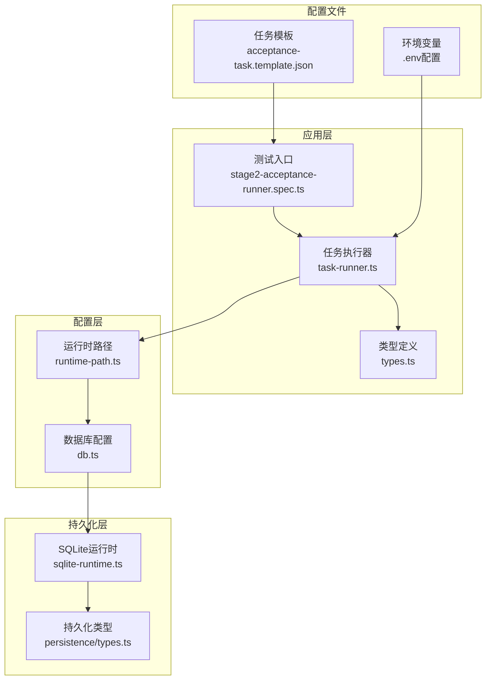
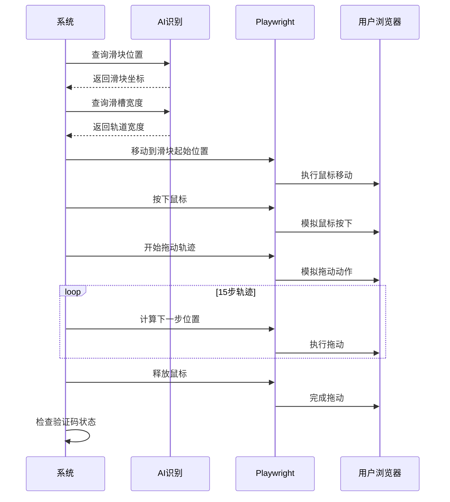
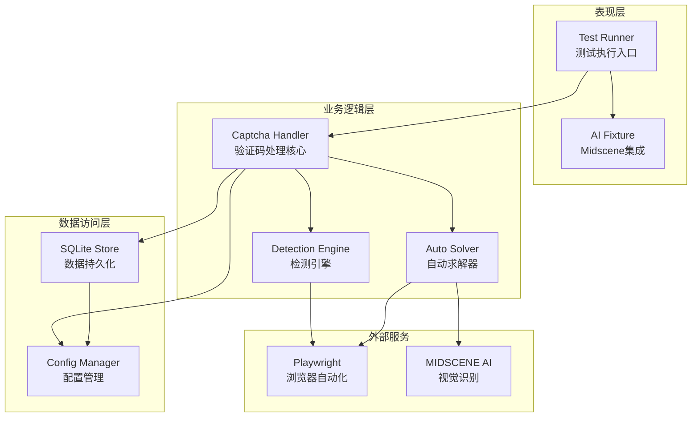
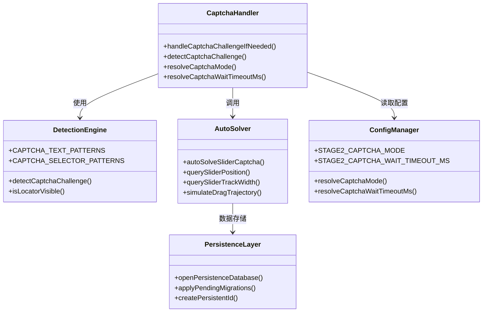
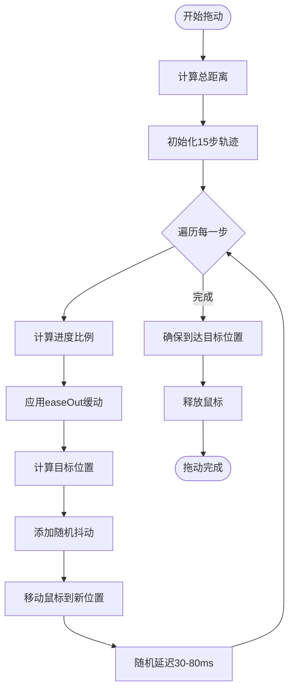
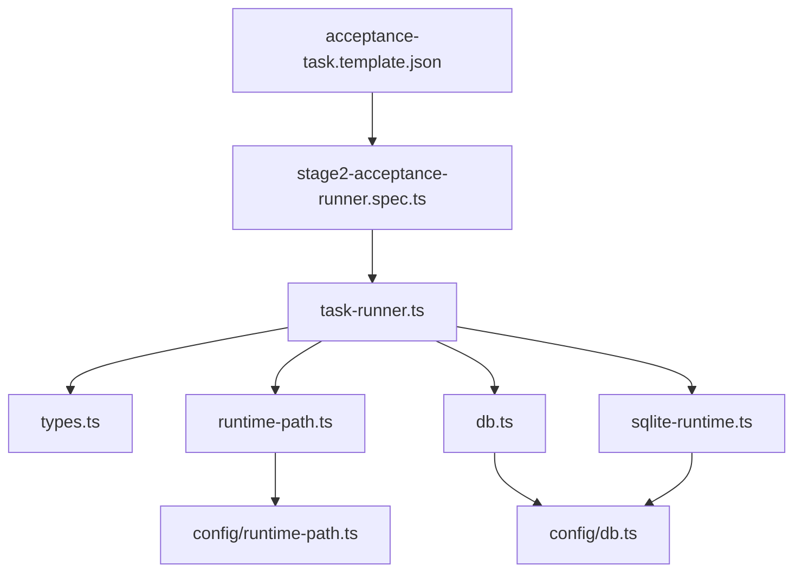

# 验证码处理系统

<cite>
**本文档引用的文件**
- [README.md](file://README.md)
- [package.json](file://package.json)
- [src/stage2/task-runner.ts](file://src/stage2/task-runner.ts)
- [src/stage2/types.ts](file://src/stage2/types.ts)
- [src/persistence/sqlite-runtime.ts](file://src/persistence/sqlite-runtime.ts)
- [src/persistence/types.ts](file://src/persistence/types.ts)
- [config/runtime-path.ts](file://config/runtime-path.ts)
- [config/db.ts](file://config/db.ts)
- [specs/tasks/acceptance-task.template.json](file://specs/tasks/acceptance-task.template.json)
- [tests/generated/stage2-acceptance-runner.spec.ts](file://tests/generated/stage2-acceptance-runner.spec.ts)
</cite>

## 目录
1. [简介](#简介)
2. [项目结构](#项目结构)
3. [核心组件](#核心组件)
4. [架构概览](#架构概览)
5. [详细组件分析](#详细组件分析)
6. [依赖关系分析](#依赖关系分析)
7. [性能考虑](#性能考虑)
8. [故障排除指南](#故障排除指南)
9. [结论](#结论)
10. [附录](#附录)

## 简介

验证码处理系统是一个基于 Playwright 和 Midscene.js 构建的 AI 自动化测试框架，专门用于处理滑块验证码等安全验证挑战。该系统提供了三种验证码处理模式：自动处理、人工处理和失败处理，并具备完善的重试机制、超时控制和错误恢复策略。

系统的核心特性包括：
- AI 驱动的滑块验证码检测和识别
- 智能轨迹模拟，模拟真实用户行为
- 多模式验证码处理策略
- 完善的错误处理和恢复机制
- 数据持久化和结果追踪

## 项目结构

该项目采用模块化的组织结构，主要分为以下几个核心部分：



**图表来源**
- [tests/generated/stage2-acceptance-runner.spec.ts:1-39](file://tests/generated/stage2-acceptance-runner.spec.ts#L1-L39)
- [src/stage2/task-runner.ts:1-800](file://src/stage2/task-runner.ts#L1-L800)
- [config/runtime-path.ts:1-41](file://config/runtime-path.ts#L1-L41)

**章节来源**
- [README.md:1-223](file://README.md#L1-L223)
- [package.json:1-26](file://package.json#L1-L26)

## 核心组件

### 验证码处理引擎

验证码处理系统的核心是 `handleCaptchaChallengeIfNeeded` 函数，它负责检测和处理各种类型的验证码挑战。系统支持三种处理模式：

#### 模式配置
- **自动模式 (auto)**: 使用 AI 自动识别和处理滑块验证码
- **人工模式 (manual)**: 检测到验证码时暂停执行，等待人工处理
- **失败模式 (fail)**: 检测到验证码时立即终止执行
- **忽略模式 (ignore)**: 跳过验证码检测（不推荐）

#### 检测机制
系统采用双重检测机制来识别验证码：

1. **文本匹配机制**: 检测页面中的特定文本模式
2. **选择器匹配机制**: 使用 CSS 选择器匹配验证码元素

**章节来源**
- [src/stage2/task-runner.ts:35-87](file://src/stage2/task-runner.ts#L35-L87)
- [src/stage2/task-runner.ts:483-501](file://src/stage2/task-runner.ts#L483-L501)

### AI 识别算法

系统使用 Midscene.js 的 AI 能力进行验证码识别，主要包括两个核心功能：

#### 滑块位置查询
通过 `querySliderPosition` 函数获取滑块按钮的精确位置信息，包括中心点坐标和尺寸。

#### 滑槽宽度查询
通过 `querySliderTrackWidth` 函数获取滑块轨道的总宽度，用于计算目标位置。

**章节来源**
- [src/stage2/task-runner.ts:510-559](file://src/stage2/task-runner.ts#L510-L559)

### 自动处理流程

自动处理流程包含完整的滑块拖动模拟，具体步骤如下：



**图表来源**
- [src/stage2/task-runner.ts:561-648](file://src/stage2/task-runner.ts#L561-L648)

**章节来源**
- [src/stage2/task-runner.ts:561-648](file://src/stage2/task-runner.ts#L561-L648)

## 架构概览

验证码处理系统采用分层架构设计，确保各组件职责清晰、耦合度低：



**图表来源**
- [src/stage2/task-runner.ts:1-800](file://src/stage2/task-runner.ts#L1-L800)
- [src/persistence/sqlite-runtime.ts:1-116](file://src/persistence/sqlite-runtime.ts#L1-L116)

### 组件关系图



**图表来源**
- [src/stage2/task-runner.ts:35-87](file://src/stage2/task-runner.ts#L35-L87)
- [src/stage2/task-runner.ts:483-706](file://src/stage2/task-runner.ts#L483-L706)

**章节来源**
- [src/stage2/task-runner.ts:1-800](file://src/stage2/task-runner.ts#L1-L800)

## 详细组件分析

### 验证码检测引擎

检测引擎是整个系统的基础组件，负责准确识别各种类型的验证码挑战。

#### 文本匹配机制
系统维护了一个预定义的文本模式数组，用于检测常见的验证码提示文本：

| 检测模式 | 描述 | 示例文本 |
|---------|------|----------|
| 安全验证 | 安全验证提示 | "请完成安全验证" |
| 滑块提示 | 滑块操作指导 | "请按住滑块", "拖动到最右边" |
| 方向指示 | 操作方向提示 | "向右滑动" |

#### 选择器匹配机制
系统使用多种 CSS 选择器来匹配不同框架和库的验证码元素：

| 选择器类别 | 目标框架 | 示例选择器 |
|-----------|----------|------------|
| NC Wrapper | 滑块验证码通用 | ".nc_wrapper" |
| NC Scale | 滑块轨道 | ".nc_scale" |
| ID Pattern | 动态ID生成 | "[id^='nc_'][id$='_wrapper']" |
| Class Pattern | 类名模式匹配 | "[class*='captcha']" |

**章节来源**
- [src/stage2/task-runner.ts:42-53](file://src/stage2/task-runner.ts#L42-L53)
- [src/stage2/task-runner.ts:483-501](file://src/stage2/task-runner.ts#L483-L501)

### AI 识别与定位

AI 识别模块利用 Midscene.js 的视觉理解能力，通过自然语言指令获取页面信息。

#### 滑块位置识别
AI 查询指令示例：
```
分析当前页面是否存在滑块验证码。
如果存在，返回滑块按钮的位置信息（中心点坐标和尺寸）。
返回格式：{ found: boolean, x: number, y: number, width: number, height: number }
其中 x,y 是滑块按钮中心点的屏幕坐标。
```

#### 滑槽宽度识别
AI 查询指令示例：
```
分析当前页面的滑块验证码滑槽宽度。
返回格式：{ found: boolean, width: number }
width 是滑槽的总宽度（像素）。
```

**章节来源**
- [src/stage2/task-runner.ts:510-559](file://src/stage2/task-runner.ts#L510-L559)

### 自动拖动模拟

自动拖动模拟是系统的核心功能，旨在模拟真实用户的操作行为。

#### 轨迹计算算法
系统使用缓动函数来模拟真实的拖动轨迹：



**图表来源**
- [src/stage2/task-runner.ts:592-613](file://src/stage2/task-runner.ts#L592-L613)

#### 参数配置
- **步数**: 15步缓动轨迹
- **抖动范围**: X轴 ±3像素，Y轴 ±2像素
- **延迟范围**: 30-80毫秒随机延迟
- **缓动函数**: easeOut，先快后慢

**章节来源**
- [src/stage2/task-runner.ts:561-648](file://src/stage2/task-runner.ts#L561-L648)

### 处理模式详解

#### 自动模式 (AUTO)
自动模式是最常用和推荐的处理方式，具有以下特点：

1. **智能检测**: 自动识别滑块验证码
2. **AI 识别**: 使用 Midscene AI 获取精确位置
3. **轨迹模拟**: 模拟真实用户拖动行为
4. **结果验证**: 检查验证码是否成功通过
5. **重试机制**: 最多重试3次

#### 人工模式 (MANUAL)
人工模式适用于复杂的验证码场景：

1. **暂停执行**: 检测到验证码时暂停
2. **等待处理**: 人工完成验证码
3. **超时控制**: 可配置的等待超时时间
4. **状态监控**: 定期检查验证码状态

#### 失败模式 (FAIL)
失败模式用于严格的质量控制：

1. **立即终止**: 检测到验证码立即停止执行
2. **错误报告**: 提供详细的错误信息
3. **日志记录**: 记录完整的执行历史

**章节来源**
- [src/stage2/task-runner.ts:650-706](file://src/stage2/task-runner.ts#L650-L706)

## 依赖关系分析

### 外部依赖

系统依赖于多个关键的外部库和服务：

```mermaid
graph LR
subgraph "核心依赖"
A[Playwright 1.56.1]
B[@midscene/web 0.9.2]
C[dotenv ^16.4.7]
end
subgraph "运行时依赖"
D[node:sqlite 实验性支持]
E[TypeScript 类型定义]
end
subgraph "开发依赖"
F[@playwright/test]
G[@types/node]
end
A --> B
B --> C
D --> E
F --> A
G --> E
```

**图表来源**
- [package.json:15-25](file://package.json#L15-L25)

### 内部模块依赖

系统内部模块之间的依赖关系清晰明确：



**图表来源**
- [src/stage2/task-runner.ts:1-800](file://src/stage2/task-runner.ts#L1-L800)
- [tests/generated/stage2-acceptance-runner.spec.ts:1-39](file://tests/generated/stage2-acceptance-runner.spec.ts#L1-L39)

**章节来源**
- [package.json:1-26](file://package.json#L1-L26)

## 性能考虑

### 执行效率优化

系统在设计时充分考虑了性能优化：

1. **智能重试**: 自动模式最多重试3次，避免无限循环
2. **异步处理**: 使用异步函数避免阻塞主线程
3. **资源管理**: 自动释放鼠标资源，防止资源泄漏
4. **缓存利用**: 利用 Midscene 的缓存机制提高响应速度

### 内存管理

系统采用渐进式内存管理模式：
- 及时释放临时对象
- 控制日志输出量
- 优化图像处理流程

### 网络性能

AI 识别依赖网络连接，系统通过以下方式优化网络性能：
- 合理的请求间隔
- 错误重试机制
- 离线降级策略

## 故障排除指南

### 常见问题及解决方案

#### 验证码检测失败
**症状**: 系统无法检测到验证码
**可能原因**:
1. 文本模式不匹配
2. 选择器配置错误
3. 页面加载不完整

**解决方法**:
1. 检查 `CAPTCHA_TEXT_PATTERNS` 配置
2. 验证 `CAPTCHA_SELECTOR_PATTERNS` 设置
3. 增加页面等待时间

#### AI 识别错误
**症状**: AI 查询返回空结果或错误
**可能原因**:
1. 模型配置问题
2. 网络连接异常
3. 图像质量不佳

**解决方法**:
1. 验证环境变量配置
2. 检查网络连接状态
3. 调整图像清晰度

#### 拖动轨迹异常
**症状**: 滑块拖动失败或不稳定
**可能原因**:
1. 位置计算错误
2. 轨迹参数不当
3. 页面元素变化

**解决方法**:
1. 检查滑块位置查询结果
2. 调整轨迹参数设置
3. 增加页面稳定性等待

### 调试技巧

#### 日志分析
系统提供了丰富的日志信息，可通过以下方式分析：
- 查看控制台输出的详细执行步骤
- 检查验证码检测的详细信息
- 监控 AI 识别的结果

#### 截图分析
系统自动生成执行过程中的截图，可用于：
- 验证验证码检测的准确性
- 分析拖动轨迹的正确性
- 诊断页面元素定位问题

#### 配置验证
通过以下方式验证配置正确性：
1. 检查环境变量设置
2. 验证任务模板配置
3. 确认数据库连接状态

**章节来源**
- [src/stage2/task-runner.ts:650-706](file://src/stage2/task-runner.ts#L650-L706)

## 结论

验证码处理系统是一个功能完整、架构清晰的自动化测试解决方案。系统的主要优势包括：

1. **多模式支持**: 提供自动、人工、失败三种处理模式，适应不同的使用场景
2. **AI 集成**: 深度集成 Midscene.js，实现智能的验证码识别和处理
3. **鲁棒性设计**: 完善的错误处理、重试机制和超时控制
4. **可扩展性**: 模块化设计，易于添加新的验证码类型支持
5. **可观测性**: 丰富的日志和截图，便于问题诊断和性能优化

该系统为 Web 应用的自动化测试提供了强有力的验证码处理能力，能够有效提升测试效率和成功率。

## 附录

### 配置选项参考

| 配置项 | 默认值 | 描述 | 可选值 |
|--------|--------|------|--------|
| STAGE2_CAPTCHA_MODE | auto | 验证码处理模式 | auto, manual, fail, ignore |
| STAGE2_CAPTCHA_WAIT_TIMEOUT_MS | 120000 | 人工处理等待超时时间 | 数值（毫秒） |
| RUNTIME_DIR_PREFIX | t_runtime/ | 运行时目录前缀 | 任意有效路径 |
| DB_DRIVER | sqlite | 数据库驱动类型 | sqlite, mysql（未来支持） |
| DB_FILE_PATH | t_runtime/db/hi_test.sqlite | 数据库文件路径 | 有效文件路径 |

### 任务配置模板

系统提供了完整的任务配置模板，支持多种 UI 框架和组件类型：

- **表单组件**: 输入框、文本域、级联选择器
- **表格组件**: 数据表格、分页组件
- **对话框组件**: 弹窗、模态框
- **断言配置**: 多种断言类型和匹配模式

**章节来源**
- [specs/tasks/acceptance-task.template.json:1-141](file://specs/tasks/acceptance-task.template.json#L1-L141)