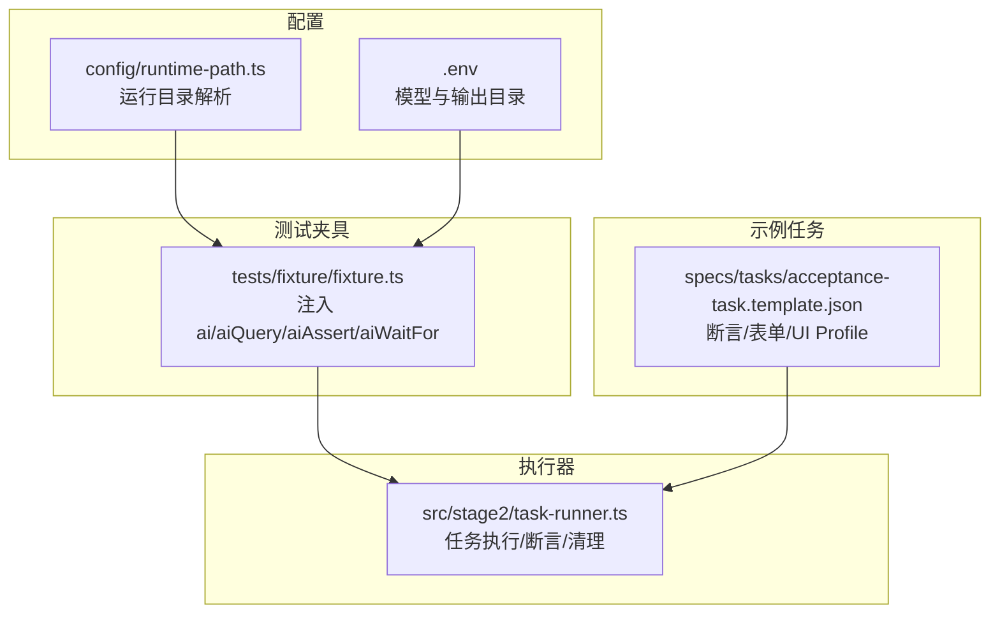
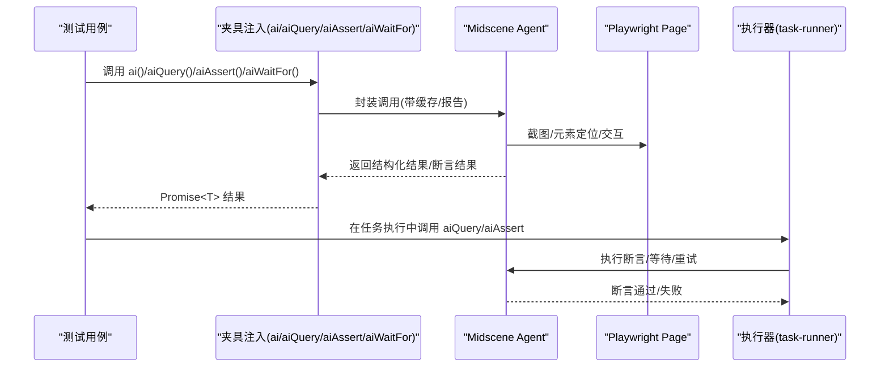
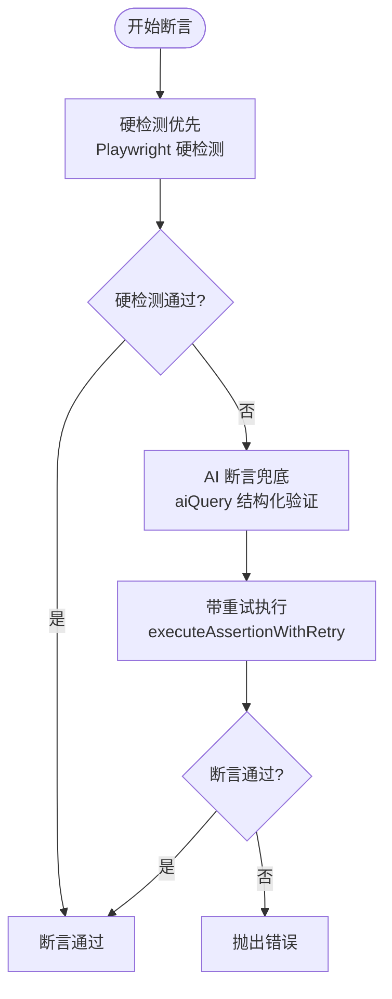
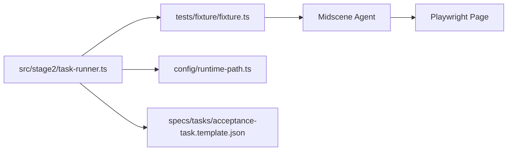

# AI 能力 API

<cite>
**本文引用的文件**
- [README.md](file://README.md)
- [package.json](file://package.json)
- [config/runtime-path.ts](file://config/runtime-path.ts)
- [tests/fixture/fixture.ts](file://tests/fixture/fixture.ts)
- [tests/generated/stage2-acceptance-runner.spec.ts](file://tests/generated/stage2-acceptance-runner.spec.ts)
- [src/stage2/task-runner.ts](file://src/stage2/task-runner.ts)
- [specs/tasks/acceptance-task.template.json](file://specs/tasks/acceptance-task.template.json)
</cite>

## 目录
1. [简介](#简介)
2. [项目结构](#项目结构)
3. [核心组件](#核心组件)
4. [架构总览](#架构总览)
5. [详细组件分析](#详细组件分析)
6. [依赖关系分析](#依赖关系分析)
7. [性能考虑](#性能考虑)
8. [故障排除指南](#故障排除指南)
9. [结论](#结论)
10. [附录](#附录)

## 简介
本文件面向使用 Midscene + Playwright 的 AI 能力 API，系统性梳理 ai()、aiQuery()、aiAssert()、aiWaitFor() 的接口规范、参数与返回、典型用法、工作原理、配置项与性能优化建议，并提供最佳实践与故障排除指引。该能力通过统一的夹具注入到测试中，既可用于页面交互（动作型），也可用于结构化数据提取与断言验证。

## 项目结构
本项目围绕“夹具注入 + 任务驱动执行”的模式组织：
- 夹具层：在 tests/fixture/fixture.ts 中注入 ai、aiAction、aiQuery、aiAssert、aiWaitFor 等 AI 能力。
- 执行器：在 src/stage2/task-runner.ts 中实现任务加载、步骤执行、断言与清理策略。
- 配置：通过 .env 与 config/runtime-path.ts 统一运行产物目录与模型参数。
- 示例任务：specs/tasks/acceptance-task.template.json 展示断言与 UI Profile 的配置方式。

**图表来源**
- [tests/fixture/fixture.ts:23-99](file://tests/fixture/fixture.ts#L23-L99)
- [src/stage2/task-runner.ts:1-200](file://src/stage2/task-runner.ts#L1-L200)
- [config/runtime-path.ts:38-41](file://config/runtime-path.ts#L38-L41)
- [specs/tasks/acceptance-task.template.json:1-141](file://specs/tasks/acceptance-task.template.json#L1-L141)

**章节来源**
- [README.md:132-164](file://README.md#L132-L164)
- [package.json:1-26](file://package.json#L1-L26)

## 核心组件
- ai(prompt, opts?): 动作型 AI 能力，支持传入 { type: 'action' | 'query' } 控制行为模式。常用于页面元素定位、点击、输入、滚动等交互步骤。
- aiQuery(demand): 结构化数据提取能力，返回 Promise<T>，适合从页面中抽取字段、统计、状态等结构化信息。
- aiAssert(assertion, errorMsg?): AI 断言能力，用于验证页面状态或业务结果，支持可选错误信息。
- aiWaitFor(assertion, opt?): AI 等待能力，当常规 Playwright 等待不适用时使用，等待某个条件满足。

这些能力均通过夹具注入到测试上下文中，统一由 Midscene Agent 驱动，具备缓存、报告与日志能力。

**章节来源**
- [tests/fixture/fixture.ts:23-99](file://tests/fixture/fixture.ts#L23-L99)
- [README.md:139-152](file://README.md#L139-L152)

## 架构总览
AI 能力在夹具中被封装为函数式接口，底层委托给 Midscene 的 PlaywrightAgent。执行器在任务驱动场景中调用 aiQuery 与 aiAssert，并内置重试与回退策略。

**图表来源**
- [tests/fixture/fixture.ts:23-99](file://tests/fixture/fixture.ts#L23-L99)
- [src/stage2/task-runner.ts:1529-1556](file://src/stage2/task-runner.ts#L1529-L1556)

## 详细组件分析

### ai() 接口规范
- 参数
  - prompt: string，自然语言描述的页面操作需求。
  - opts?: { type?: 'action' | 'query' }，控制行为模式：
    - 'action'：默认，侧重执行页面交互（点击、输入、滚动等）。
    - 'query'：侧重结构化信息抽取（与 aiQuery 类似，但通过 ai() 实现）。
- 返回
  - Promise<T>，具体类型取决于行为模式与模型输出。
- 使用场景
  - 页面元素定位与交互（如点击、输入、滚动）。
  - 将自然语言描述转化为可执行的 UI 操作。
- 注意事项
  - 不建议将整条业务流程写成一条超长 ai()，应拆分为多个步骤以提升可维护性与可观测性。

**章节来源**
- [tests/fixture/fixture.ts:34-41](file://tests/fixture/fixture.ts#L34-L41)
- [README.md:60-77](file://README.md#L60-L77)

### aiQuery() 接口规范
- 参数
  - demand: any，描述需要从页面提取的信息（如字段名、统计项、状态等）。
- 返回
  - Promise<T>，返回结构化数据对象（由模型按约定格式输出）。
- 使用场景
  - 从页面中抽取字段值、统计信息、状态标识等。
  - 与 Playwright 硬检测结合，先用 aiQuery 提取，再用代码断言，降低幻觉风险。
- 典型用法
  - 在断言前先 aiQuery 获取关键字段，再用 expect 或 assert 做强校验。

**章节来源**
- [tests/fixture/fixture.ts:67-69](file://tests/fixture/fixture.ts#L67-L69)
- [README.md:78-84](file://README.md#L78-L84)
- [src/stage2/task-runner.ts:1877-1880](file://src/stage2/task-runner.ts#L1877-L1880)

### aiAssert() 接口规范
- 参数
  - assertion: string，描述断言需求的自然语言。
  - errorMsg?: string，断言失败时的自定义错误信息。
- 返回
  - Promise<void>，断言通过无返回，失败抛出错误。
- 使用场景
  - 对页面状态、业务结果进行 AI 验证。
  - 作为补充性可读断言，关键结果仍建议使用 aiQuery + 代码断言。
- 典型用法
  - 在任务执行中调用，结合重试与回退策略，确保稳定性。

**章节来源**
- [tests/fixture/fixture.ts:81-83](file://tests/fixture/fixture.ts#L81-L83)
- [README.md:78-84](file://README.md#L78-L84)
- [src/stage2/task-runner.ts:1562-1567](file://src/stage2/task-runner.ts#L1562-L1567)

### aiWaitFor() 接口规范
- 参数
  - assertion: string，描述等待条件的自然语言。
  - opt?: 与 Agent.aiWaitFor 对应的选项（如超时、轮询间隔等）。
- 返回
  - Promise<void>，直到条件满足或超时。
- 使用场景
  - 当 Playwright 常规等待无法覆盖的复杂条件时使用。
- 典型用法
  - 在任务执行中等待特定 UI 状态、异步结果或动态元素出现。

**章节来源**
- [tests/fixture/fixture.ts:95-97](file://tests/fixture/fixture.ts#L95-L97)
- [README.md:140-144](file://README.md#L140-L144)

### 执行器中的断言与重试机制
执行器在 runAssertion 中实现了“硬检测优先 + AI 断言兜底 + 重试”的策略，并提供带重试的断言执行器 executeAssertionWithRetry。

**图表来源**
- [src/stage2/task-runner.ts:1529-1556](file://src/stage2/task-runner.ts#L1529-L1556)
- [src/stage2/task-runner.ts:1562-1567](file://src/stage2/task-runner.ts#L1562-L1567)
- [src/stage2/task-runner.ts:1877-1880](file://src/stage2/task-runner.ts#L1877-L1880)

**章节来源**
- [src/stage2/task-runner.ts:1529-1556](file://src/stage2/task-runner.ts#L1529-L1556)
- [src/stage2/task-runner.ts:1562-1567](file://src/stage2/task-runner.ts#L1562-L1567)
- [src/stage2/task-runner.ts:1877-1880](file://src/stage2/task-runner.ts#L1877-L1880)

## 依赖关系分析
- 夹具依赖 Midscene 的 PlaywrightAgent 与 PlaywrightWebPage，负责页面交互与 AI 能力封装。
- 执行器依赖夹具注入的 ai、aiQuery、aiAssert、aiWaitFor，以及任务配置（UI Profile、断言、清理策略等）。
- 配置层通过 .env 与 runtime-path.ts 统一运行产物目录，确保日志、截图、报告与数据库路径一致。

**图表来源**
- [tests/fixture/fixture.ts:23-99](file://tests/fixture/fixture.ts#L23-L99)
- [src/stage2/task-runner.ts:1-200](file://src/stage2/task-runner.ts#L1-L200)
- [config/runtime-path.ts:38-41](file://config/runtime-path.ts#L38-L41)
- [specs/tasks/acceptance-task.template.json:1-141](file://specs/tasks/acceptance-task.template.json#L1-L141)

**章节来源**
- [package.json:15-24](file://package.json#L15-L24)
- [README.md:31-54](file://README.md#L31-L54)

## 性能考虑
- 步骤拆分：将长流程拆分为多个短步骤，降低单次 AI 调用的复杂度与失败成本。
- 重试与延迟：在断言与等待中合理设置重试次数与延迟，平衡稳定性与执行时长。
- 缓存与报告：启用 Midscene 的缓存与报告，有助于复用中间结果、加速调试与定位问题。
- 目录收敛：通过 .env 与 runtime-path.ts 统一产物目录，减少 IO 开销与磁盘碎片。

**章节来源**
- [README.md:60-77](file://README.md#L60-L77)
- [README.md:78-96](file://README.md#L78-L96)
- [config/runtime-path.ts:38-41](file://config/runtime-path.ts#L38-L41)

## 故障排除指南
- 模型与环境配置
  - 确认 .env 中 OPENAI_API_KEY、OPENAI_BASE_URL、MIDSCENE_MODEL_NAME 等已正确设置。
  - 检查 RUNTIME_DIR_PREFIX、PLAYWRIGHT_OUTPUT_DIR、PLAYWRIGHT_HTML_REPORT_DIR、MIDSCENE_RUN_DIR、ACCEPTANCE_RESULT_DIR 等路径是否符合预期。
- 运行产物与日志
  - 查看 t_runtime/ 下的 playwright 报告、Midscene 报告与截图，定位失败步骤与页面状态。
- 断言失败
  - 优先使用 aiQuery 提取结构化数据，再用代码断言；必要时使用 aiAssert 作为补充。
  - 对复杂断言使用 executeAssertionWithRetry 增加稳定性。
- 等待条件
  - 当常规等待不适用时，使用 aiWaitFor 描述等待条件；合理设置超时与轮询间隔。

**章节来源**
- [README.md:31-54](file://README.md#L31-L54)
- [README.md:154-164](file://README.md#L154-L164)
- [src/stage2/task-runner.ts:1529-1556](file://src/stage2/task-runner.ts#L1529-L1556)

## 结论
AI 能力 API 通过夹具注入与执行器协作，提供了从页面交互、结构化提取到断言验证的完整链路。遵循“硬检测优先 + AI 断言兜底 + 重试回退”的策略，配合合理的步骤拆分与配置管理，可以在复杂 UI 场景中获得稳定可靠的自动化效果。

## 附录

### 使用示例（步骤级）
以下示例展示如何在测试中使用 AI 能力进行页面元素定位、数据提取与断言验证。示例以“夹具注入”和“任务执行”两种方式呈现，便于理解不同场景下的调用路径。

- 在测试夹具中使用
  - 使用 ai() 执行页面交互步骤。
  - 使用 aiQuery() 提取结构化数据。
  - 使用 aiAssert() 进行断言。
  - 使用 aiWaitFor() 等待复杂条件。

- 在任务执行器中使用
  - 在 runAssertion 中调用 aiQuery 与 aiAssert，结合重试与回退策略。

**章节来源**
- [tests/fixture/fixture.ts:23-99](file://tests/fixture/fixture.ts#L23-L99)
- [tests/generated/stage2-acceptance-runner.spec.ts:12-37](file://tests/generated/stage2-acceptance-runner.spec.ts#L12-L37)
- [src/stage2/task-runner.ts:1529-1556](file://src/stage2/task-runner.ts#L1529-L1556)
- [src/stage2/task-runner.ts:1562-1567](file://src/stage2/task-runner.ts#L1562-L1567)

### 配置项速览
- 模型与输出
  - OPENAI_API_KEY、OPENAI_BASE_URL、MIDSCENE_MODEL_NAME
  - RUNTIME_DIR_PREFIX、PLAYWRIGHT_OUTPUT_DIR、PLAYWRIGHT_HTML_REPORT_DIR、MIDSCENE_RUN_DIR、ACCEPTANCE_RESULT_DIR
- 验证码处理
  - STAGE2_CAPTCHA_MODE（auto/manual/fail/ignore）
  - STAGE2_CAPTCHA_WAIT_TIMEOUT_MS
- 任务执行
  - STAGE2_TASK_FILE
  - runtimeTimeoutMs/pageTimeoutMs/screenshotOnStep/trace 等

**章节来源**
- [README.md:31-54](file://README.md#L31-L54)
- [README.md:56-62](file://README.md#L56-L62)
- [specs/tasks/acceptance-task.template.json:134-139](file://specs/tasks/acceptance-task.template.json#L134-L139)