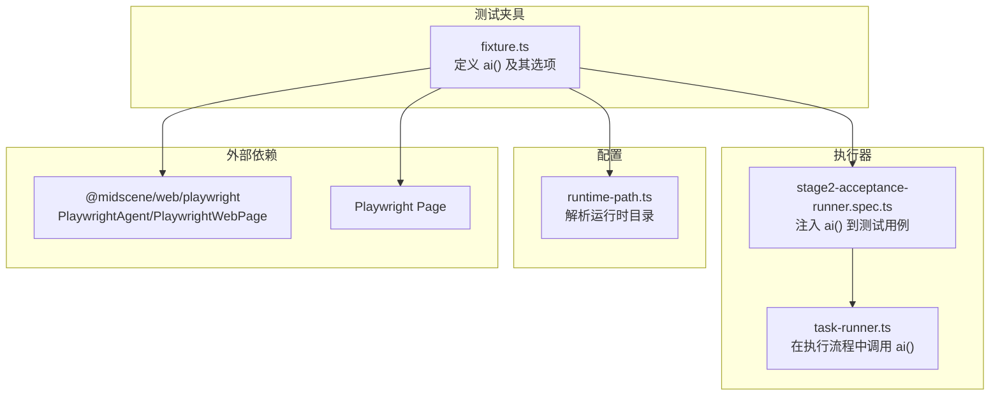
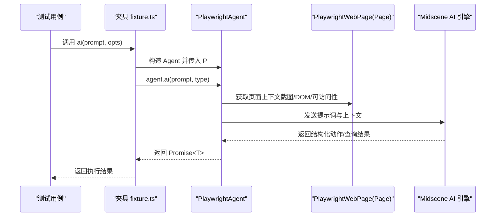
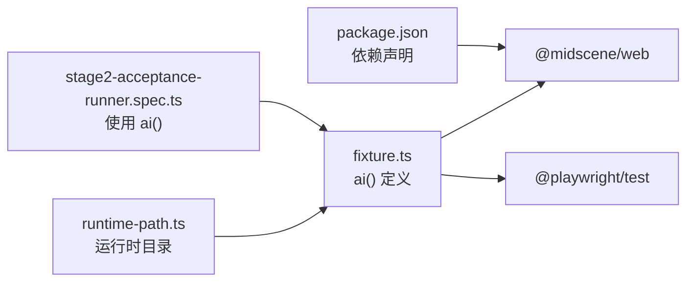

# ai() 函数 API

<cite>
**本文引用的文件**
- [README.md](file://README.md)
- [package.json](file://package.json)
- [fixture.ts](file://tests/fixture/fixture.ts)
- [stage2-acceptance-runner.spec.ts](file://tests/generated/stage2-acceptance-runner.spec.ts)
- [task-runner.ts](file://src/stage2/task-runner.ts)
- [types.ts](file://src/stage2/types.ts)
- [runtime-path.ts](file://config/runtime-path.ts)
</cite>

## 目录
1. [简介](#简介)
2. [项目结构](#项目结构)
3. [核心组件](#核心组件)
4. [架构总览](#架构总览)
5. [详细组件分析](#详细组件分析)
6. [依赖分析](#依赖分析)
7. [性能考虑](#性能考虑)
8. [故障排查指南](#故障排查指南)
9. [结论](#结论)
10. [附录](#附录)

## 简介
本文件面向使用者与维护者，系统化阐述 ai() 函数 API 的接口规范、参数类型、使用场景与内部工作机制。ai() 是在测试夹具中暴露的一个便捷入口，用于将自然语言指令转化为 Playwright 操作，并与 Midscene AI 能力集成，实现页面元素点击、输入、滚动、等待、结构化查询与断言等自动化操作。

ai() 的典型使用场景包括：
- 通过自然语言描述触发页面交互（如“点击‘提交’按钮”、“在用户名输入框中输入 admin”）
- 在复杂动态页面中定位元素（菜单、弹窗、表格行、Toast 等）
- 与 aiQuery、aiAssert、aiWaitFor 等能力配合，构建稳健的验收流程

## 项目结构
围绕 ai() 的关键文件与职责概览：
- 测试夹具层：在夹具中封装 ai()，并将其绑定到 Playwright 的 Page 实例，统一注入到每个测试用例
- 执行器层：在第二段执行器中，ai() 作为上下文的一部分被调用，驱动页面动作与断言
- 配置层：运行时目录、报告目录、Midscene 日志目录等通过环境变量集中管理
- 类型层：任务模型、断言模型、清理策略等类型定义支撑 ai() 的使用边界与约束

图表来源
- [fixture.ts:1-99](file://tests/fixture/fixture.ts#L1-L99)
- [stage2-acceptance-runner.spec.ts:1-39](file://tests/generated/stage2-acceptance-runner.spec.ts#L1-L39)
- [task-runner.ts:1-800](file://src/stage2/task-runner.ts#L1-L800)
- [runtime-path.ts:1-41](file://config/runtime-path.ts#L1-L41)

章节来源
- [README.md:132-189](file://README.md#L132-L189)
- [package.json:1-26](file://package.json#L1-L26)

## 核心组件
- ai() 函数：在夹具中定义，接收自然语言提示词与可选参数，委托给 Midscene 的 PlaywrightAgent 执行
- 参数与选项：
  - prompt: string（必填）——自然语言指令
  - opts.type: 'action' | 'query'（可选，默认 'action'）——控制执行模式（动作或查询）
- 返回值：Promise<T>（泛型），具体类型取决于执行模式与 Midscene 的解析结果
- 作用域：绑定到 Page 实例，具备页面上下文感知能力

章节来源
- [fixture.ts:16-41](file://tests/fixture/fixture.ts#L16-L41)

## 架构总览
ai() 的调用链路与集成关系如下：

图表来源
- [fixture.ts:24-41](file://tests/fixture/fixture.ts#L24-L41)
- [stage2-acceptance-runner.spec.ts:18-25](file://tests/generated/stage2-acceptance-runner.spec.ts#L18-L25)

## 详细组件分析

### ai() 接口规范
- 函数签名与参数
  - prompt: string（必填）——自然语言指令
  - opts.type: 'action' | 'query'（可选，默认 'action'）
- 返回值
  - Promise<T>（泛型），表示动作执行或查询结果
- 作用域
  - 与 Page 绑定，具备页面上下文（DOM、截图、可访问性信息）

章节来源
- [fixture.ts:16-41](file://tests/fixture/fixture.ts#L16-L41)

### ai() 与 Midscene 的集成
- 夹具中通过 PlaywrightAgent 将 Page 包装为 PlaywrightWebPage，并启用报告生成
- ai() 实际委托 agent.ai(prompt, type)，由 Midscene AI 引擎解析提示词并返回可执行的动作序列或结构化数据
- 运行日志与报告目录由 runtime-path.ts 通过环境变量解析并设置

章节来源
- [fixture.ts:23-41](file://tests/fixture/fixture.ts#L23-L41)
- [runtime-path.ts:28-36](file://config/runtime-path.ts#L28-L36)

### ai() 的内部工作机制
- 页面上下文采集：通过 PlaywrightWebPage 获取页面截图、DOM 结构、可访问性信息等
- 提示词路由：根据 opts.type 决定执行模式
  - type='action'：将 prompt 解析为可执行的页面动作（点击、输入、滚动等）
  - type='query'：将 prompt 解析为结构化查询（提取文本、属性、坐标等）
- 执行与回退：若 Midscene 无法解析或执行失败，夹具层提供回退策略（如使用 aiQuery/aiAssert/aiWaitFor 等）
- 报告与缓存：启用报告生成与缓存，提升稳定性与可追踪性

章节来源
- [fixture.ts:23-41](file://tests/fixture/fixture.ts#L23-L41)
- [README.md:146-152](file://README.md#L146-L152)

### 使用场景与最佳实践
- 动作类场景
  - 点击：通过自然语言描述目标元素（如“点击‘提交’按钮”）
  - 输入：描述输入框与值（如“在用户名输入框中输入 admin”）
  - 滚动/等待：描述滚动方向与等待条件
- 查询类场景
  - aiQuery：提取结构化数据（如坐标、文本、属性），再用 Playwright 断言
- 断言类场景
  - aiAssert：可读性断言；关键断言建议结合 aiQuery 与 Playwright 硬断言
- 最佳实践
  - 将长流程拆分为多个短步骤，降低幻觉风险
  - 关键结果优先使用 aiQuery + Playwright 代码断言
  - 合理使用 aiWaitFor，仅在常规等待不适用时使用

章节来源
- [README.md:146-152](file://README.md#L146-L152)
- [.tasks/AI自主代理验收系统开发改造方案_2026-03-11.md:58-84](file://.tasks/AI自主代理验收系统开发改造方案_2026-03-11.md#L58-L84)

### 参数配置选项
- opts.type
  - 'action'：执行页面动作（默认）
  - 'query'：执行结构化查询
- 运行时目录与报告
  - 通过环境变量集中管理（运行产物、Midscene 报告、Playwright 报告等）
- 模型与密钥
  - 通过 OPENAI_API_KEY、OPENAI_BASE_URL、MIDSCENE_MODEL_NAME 等环境变量配置

章节来源
- [fixture.ts:34-41](file://tests/fixture/fixture.ts#L34-L41)
- [runtime-path.ts:13-36](file://config/runtime-path.ts#L13-L36)
- [README.md:39-54](file://README.md#L39-L54)

### 错误处理机制
- ai() 执行失败时的回退策略
  - 使用 aiQuery 提取结构化数据进行二次判断
  - 使用 aiAssert 进行可读性断言
  - 使用 aiWaitFor 等待特定条件满足
- 滑块验证码自动处理
  - 当检测到滑块验证码时，自动尝试识别位置与轨迹并模拟拖动
  - 支持自动/人工/失败/忽略四种模式，可配置等待超时
- 任务执行失败时的定位
  - 执行器记录失败步骤、截图路径与错误信息，便于定位问题

章节来源
- [task-runner.ts:561-706](file://src/stage2/task-runner.ts#L561-L706)
- [task-runner.ts:1873-1917](file://src/stage2/task-runner.ts#L1873-L1917)

### 性能优化建议
- 将长流程拆分为多个短步骤，减少单次提示词长度与复杂度
- 在复杂动态页面中，优先使用 aiQuery + Playwright 硬断言，降低 AI 幻觉风险
- 合理配置运行时目录与报告目录，避免磁盘 IO 影响
- 使用缓存与报告功能，减少重复计算与提升可追踪性

章节来源
- [README.md:146-152](file://README.md#L146-L152)
- [runtime-path.ts:13-36](file://config/runtime-path.ts#L13-L36)

## 依赖分析
ai() 的依赖关系与耦合点：
- 夹具层依赖 @midscene/web/playwright 的 PlaywrightAgent/PlaywrightWebPage
- 执行器层依赖夹具注入的 ai() 与其他 ai* 能力
- 配置层通过环境变量统一管理运行时目录

图表来源
- [package.json:15-24](file://package.json#L15-L24)
- [fixture.ts:1-99](file://tests/fixture/fixture.ts#L1-L99)
- [stage2-acceptance-runner.spec.ts:1-39](file://tests/generated/stage2-acceptance-runner.spec.ts#L1-L39)
- [runtime-path.ts:1-41](file://config/runtime-path.ts#L1-L41)

章节来源
- [package.json:15-24](file://package.json#L15-L24)

## 性能考虑
- 提示词长度与复杂度：将长流程拆分为多个短步骤，降低单次提示词长度与复杂度
- 页面稳定性：在执行前等待页面稳定，减少动态元素干扰
- 缓存与报告：启用 Midscene 缓存与报告，减少重复计算与提升可追踪性
- 目录与 IO：合理配置运行时目录，避免磁盘 IO 影响

## 故障排查指南
- ai() 执行失败
  - 检查提示词是否清晰、目标元素是否可见
  - 使用 aiQuery 提取结构化数据进行二次判断
  - 使用 aiAssert 进行可读性断言
- 滑块验证码
  - 自动模式：检查页面截图确认滑块样式，必要时调整检测选择器
  - 人工模式：增大等待超时时间
  - 失败模式：直接中止并输出明确错误
- 运行产物与报告
  - 检查运行时目录配置与权限
  - 查看 Midscene 报告与 Playwright 报告定位问题

章节来源
- [task-runner.ts:561-706](file://src/stage2/task-runner.ts#L561-L706)
- [runtime-path.ts:13-36](file://config/runtime-path.ts#L13-L36)

## 结论
ai() 函数通过与 Midscene 的深度集成，将自然语言指令转化为可靠的 Playwright 操作，适用于复杂动态页面的自动化测试。配合 aiQuery、aiAssert、aiWaitFor 等能力，可构建稳健、可追踪的验收流程。建议遵循“拆分步骤、结构化查询、硬断言为主”的最佳实践，结合缓存与报告机制，持续优化性能与稳定性。

## 附录
- 示例用法（路径引用）
  - 在测试用例中注入 ai() 并调用：[stage2-acceptance-runner.spec.ts:18-25](file://tests/generated/stage2-acceptance-runner.spec.ts#L18-L25)
  - 在执行器中使用 ai() 进行动作与断言：[task-runner.ts:1873-1917](file://src/stage2/task-runner.ts#L1873-L1917)
- 配置项参考
  - 运行时目录与报告目录：[runtime-path.ts:13-36](file://config/runtime-path.ts#L13-L36)
  - 模型与密钥配置：[README.md:39-54](file://README.md#L39-L54)