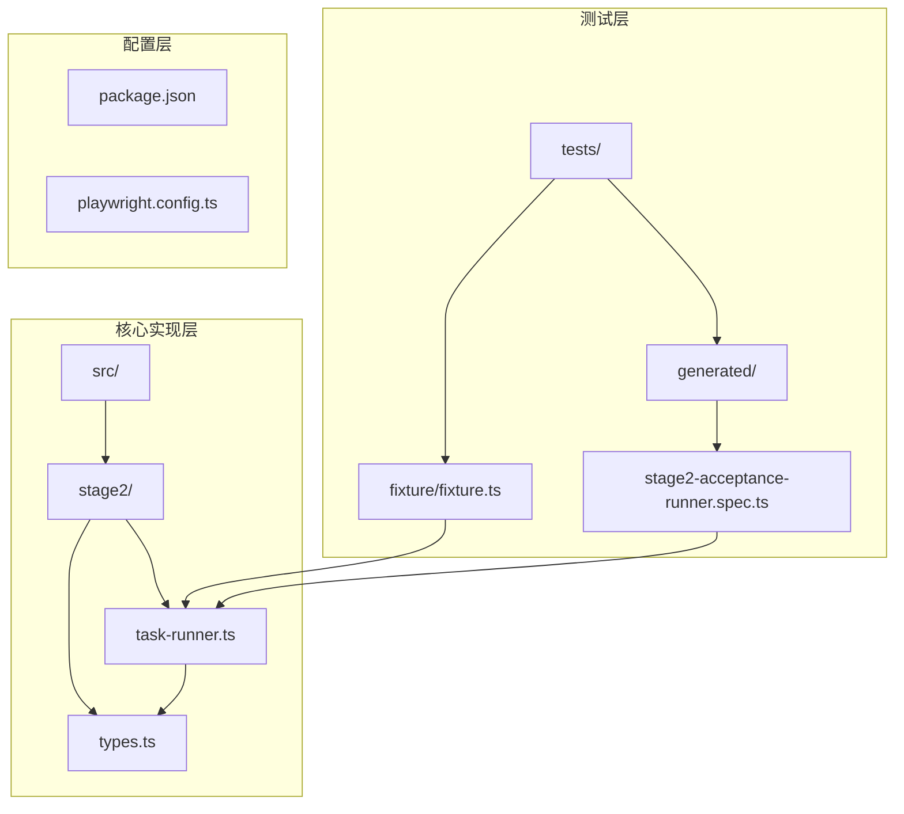
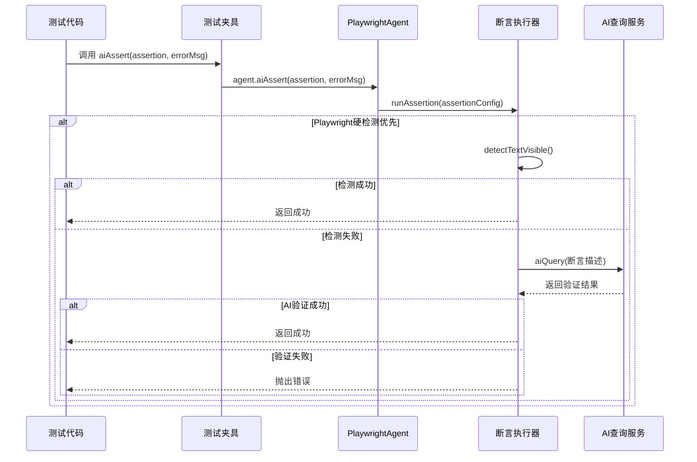
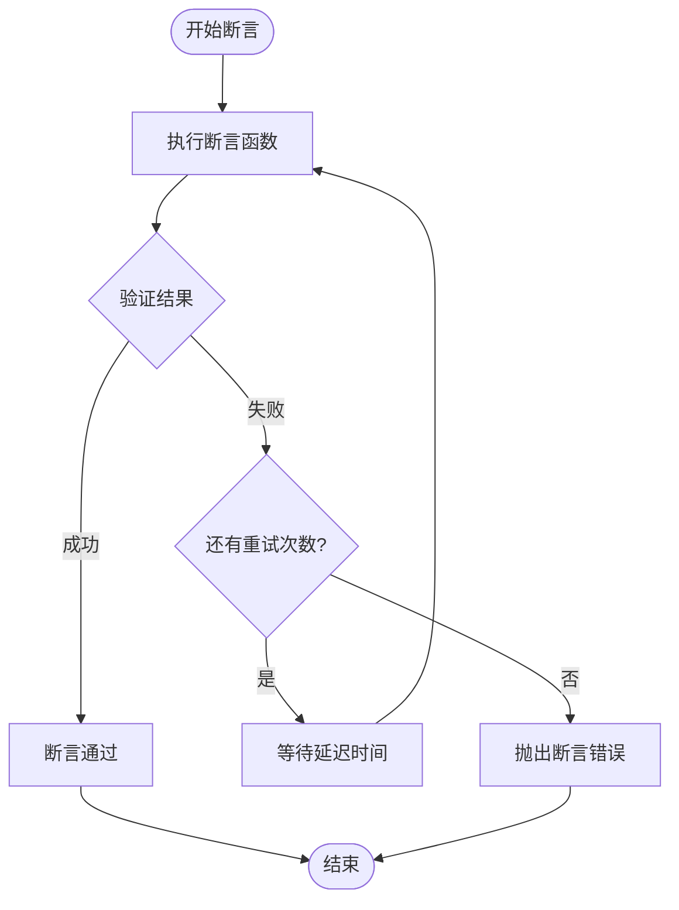
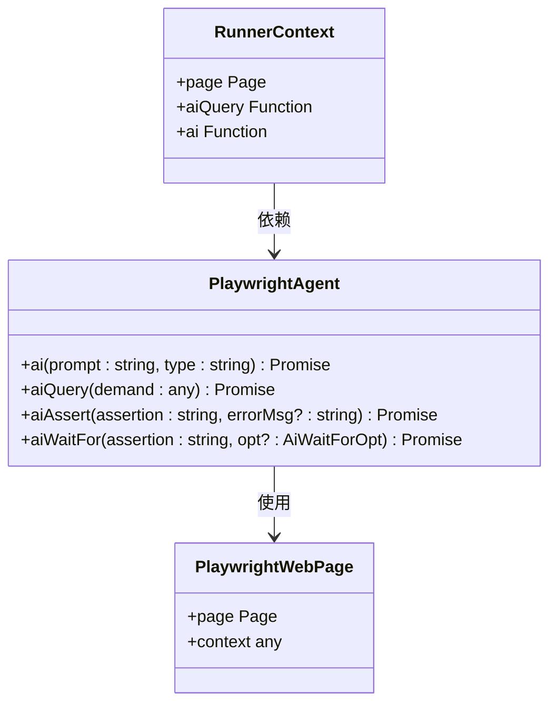
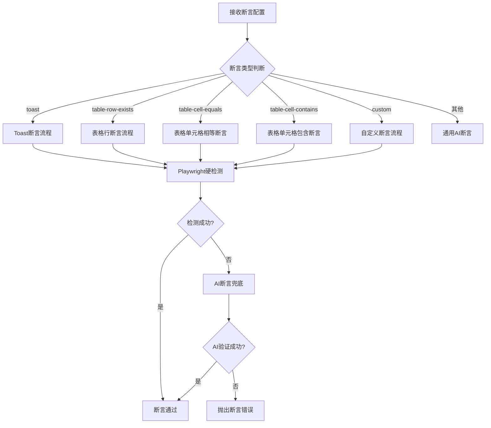
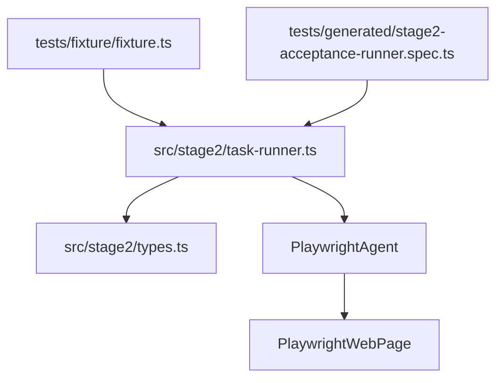

# aiAssert() 断言 API

<cite>
**本文档引用的文件**
- [task-runner.ts](file://src/stage2/task-runner.ts)
- [types.ts](file://src/stage2/types.ts)
- [fixture.ts](file://tests/fixture/fixture.ts)
- [stage2-acceptance-runner.spec.ts](file://tests/generated/stage2-acceptance-runner.spec.ts)
- [package.json](file://package.json)
</cite>

## 目录
1. [简介](#简介)
2. [项目结构](#项目结构)
3. [核心组件](#核心组件)
4. [架构概览](#架构概览)
5. [详细组件分析](#详细组件分析)
6. [依赖分析](#依赖分析)
7. [性能考虑](#性能考虑)
8. [故障排除指南](#故障排除指南)
9. [结论](#结论)
10. [附录](#附录)

## 简介

aiAssert() 是本项目中的一个关键断言 API，它提供了基于人工智能的页面状态验证能力。该 API 能够验证页面元素的存在性、文本内容、数据准确性等，是自动化测试和验收测试的重要组成部分。

本 API 的设计目标是在传统 Playwright 硬检测失效时，提供 AI 兜底的断言能力，确保测试的稳定性和可靠性。它支持多种断言类型，包括 Toast 提示断言、表格行断言、自定义描述断言等。

## 项目结构

该项目采用模块化架构，主要包含以下关键目录和文件：



**图表来源**
- [fixture.ts:1-99](file://tests/fixture/fixture.ts#L1-L99)
- [task-runner.ts:1529-1917](file://src/stage2/task-runner.ts#L1529-L1917)
- [types.ts:67-88](file://src/stage2/types.ts#L67-L88)

**章节来源**
- [package.json:1-28](file://package.json#L1-L28)

## 核心组件

### aiAssert() 函数接口规范

aiAssert() 函数是一个异步断言函数，提供以下接口特性：

**函数签名**: `aiAssert(assertion: string, errorMsg?: string): Promise<void>`

**参数说明**:
- `assertion`: 断言描述字符串，用于向 AI 模型描述需要验证的页面状态
- `errorMsg`: 可选的错误信息，当断言失败时提供自定义错误消息

**返回值**: Promise<void> - 断言成功时无返回值，失败时抛出错误

### 断言类型和验证机制

系统支持多种断言类型，每种类型都有特定的验证逻辑：

1. **Toast 断言** (`toast`): 验证页面提示信息的存在性
2. **表格行存在断言** (`table-row-exists`): 验证表格中特定行的存在
3. **表格单元格相等断言** (`table-cell-equals`): 验证表格单元格内容的精确匹配
4. **表格单元格包含断言** (`table-cell-contains`): 验证表格单元格内容的模糊匹配
5. **自定义描述断言** (`custom`): 基于描述性文本的通用断言

### 断言策略配置

断言配置支持以下参数：

| 参数名 | 类型 | 默认值 | 描述 |
|--------|------|--------|------|
| type | string | 必填 | 断言类型 |
| expectedText | string | - | 期望的文本内容 |
| matchField | string | - | 用于匹配的字段名 |
| expectedColumns | string[] | - | 期望的列名数组 |
| column | string | - | 特定列名 |
| expectedFromField | string | - | 从字段获取期望值 |
| matchMode | 'exact' \| 'contains' | 'exact' | 匹配模式 |
| timeoutMs | number | 15000 | 超时时间（毫秒） |
| retryCount | number | 2 | 重试次数 |
| soft | boolean | false | 是否为软断言 |
| description | string | - | 自定义断言描述 |

**章节来源**
- [types.ts:67-88](file://src/stage2/types.ts#L67-L88)
- [task-runner.ts:1562-1917](file://src/stage2/task-runner.ts#L1562-L1917)

## 架构概览

aiAssert() API 的整体架构采用三层断言策略：



**图表来源**
- [fixture.ts:71-84](file://tests/fixture/fixture.ts#L71-L84)
- [task-runner.ts:1562-1917](file://src/stage2/task-runner.ts#L1562-L1917)

### 重试机制

系统实现了智能重试机制，确保断言的稳定性：



**图表来源**
- [task-runner.ts:1532-1556](file://src/stage2/task-runner.ts#L1532-L1556)

## 详细组件分析

### PlaywrightAgent 集成

aiAssert() 通过 PlaywrightAgent 实现与测试环境的集成：



**图表来源**
- [fixture.ts:23-99](file://tests/fixture/fixture.ts#L23-L99)

### 断言执行流程

断言执行采用分层策略，优先使用 Playwright 硬检测，失败时使用 AI 兜底：



**图表来源**
- [task-runner.ts:1562-1917](file://src/stage2/task-runner.ts#L1562-L1917)

### 错误处理机制

系统实现了完善的错误处理机制：

1. **断言失败处理**: 当断言失败时，系统会抛出详细的错误信息
2. **重试机制**: 支持自动重试，避免临时性失败影响测试结果
3. **日志记录**: 记录断言过程中的关键信息，便于调试和问题定位
4. **软断言支持**: 支持软断言模式，允许断言失败但不中断整个测试流程

**章节来源**
- [task-runner.ts:1532-1556](file://src/stage2/task-runner.ts#L1532-L1556)
- [task-runner.ts:1562-1917](file://src/stage2/task-runner.ts#L1562-L1917)

## 依赖分析

### 外部依赖

项目的主要外部依赖包括：

```mermaid
graph LR
subgraph "核心依赖"
A[playwright-mind] --> B[主应用包]
C[@playwright/test] --> D[测试框架]
E[@midscene/web] --> F[Web组件库]
end
subgraph "工具链"
G[node_modules] --> H[类型定义]
I[scripts/] --> J[数据库脚本]
end
B --> G
D --> G
F --> G
```

**图表来源**
- [package.json:17-26](file://package.json#L17-L26)

### 内部模块依赖

断言 API 的内部模块依赖关系：



**图表来源**
- [fixture.ts:1-99](file://tests/fixture/fixture.ts#L1-L99)
- [stage2-acceptance-runner.spec.ts:1-39](file://tests/generated/stage2-acceptance-runner.spec.ts#L1-L39)
- [task-runner.ts:1529-1917](file://src/stage2/task-runner.ts#L1529-L1917)

**章节来源**
- [package.json:1-28](file://package.json#L1-L28)

## 性能考虑

### 断言性能优化

1. **超时控制**: 默认超时时间为15秒，可根据测试场景调整
2. **重试策略**: 默认重试2次，避免网络波动影响测试稳定性
3. **延迟机制**: 每次重试间隔1秒，平衡性能和成功率
4. **缓存机制**: 使用安全的缓存ID，避免重复计算

### 内存管理

- 断言结果只保留最后一次尝试的结果
- 及时释放页面资源和连接
- 合理设置超时时间，避免长时间占用资源

## 故障排除指南

### 常见问题及解决方案

1. **断言超时**: 检查网络连接和页面加载状态
2. **AI断言失败**: 优化断言描述的清晰度和准确性
3. **重试次数不足**: 根据页面复杂度适当增加重试次数
4. **匹配模式错误**: 根据实际需求选择精确匹配或包含匹配

### 调试技巧

1. **启用详细日志**: 观察断言执行过程中的关键信息
2. **使用软断言**: 在开发阶段使用软断言进行调试
3. **分步断言**: 将复杂的断言分解为多个简单的断言
4. **截图辅助**: 结合页面截图进行问题定位

**章节来源**
- [task-runner.ts:1532-1556](file://src/stage2/task-runner.ts#L1532-L1556)

## 结论

aiAssert() 断言 API 为本项目提供了强大而灵活的页面状态验证能力。通过 Playwright 硬检测与 AI 兜底相结合的策略，确保了断言的高成功率和稳定性。

该 API 的设计充分考虑了实际使用场景，提供了丰富的配置选项和错误处理机制。通过合理的断言策略配置和最佳实践，可以构建高质量的自动化测试体系。

## 附录

### 使用示例

由于代码库限制，无法直接提供具体的代码示例。建议参考以下文件获取使用示例：

- [stage2-acceptance-runner.spec.ts](file://tests/generated/stage2-acceptance-runner.spec.ts) - 测试执行示例
- [fixture.ts](file://tests/fixture/fixture.ts) - 测试夹具配置示例

### 最佳实践

1. **明确断言目标**: 在编写断言前明确要验证的具体页面状态
2. **合理设置超时**: 根据页面复杂度和网络状况设置合适的超时时间
3. **使用精确匹配**: 优先使用精确匹配模式，提高断言准确性
4. **监控断言性能**: 定期监控断言执行时间和成功率
5. **维护断言描述**: 保持断言描述的清晰和准确，便于团队协作