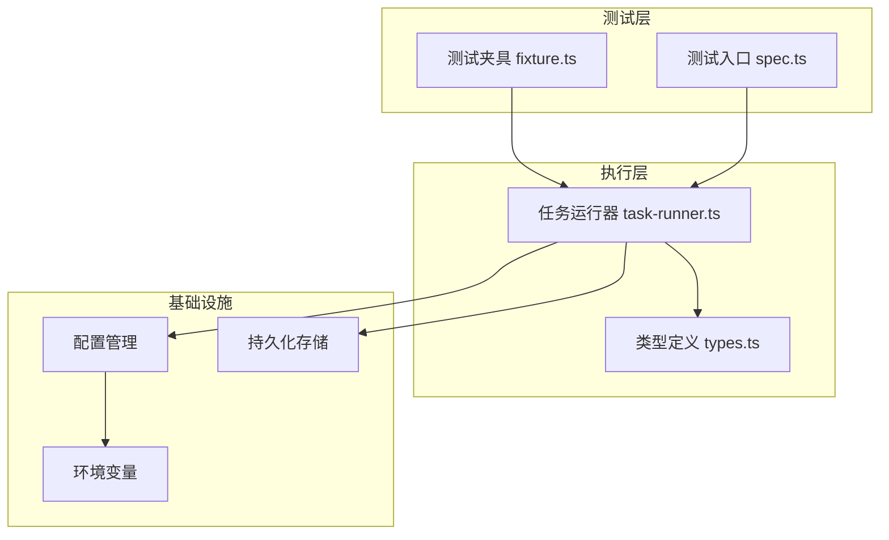
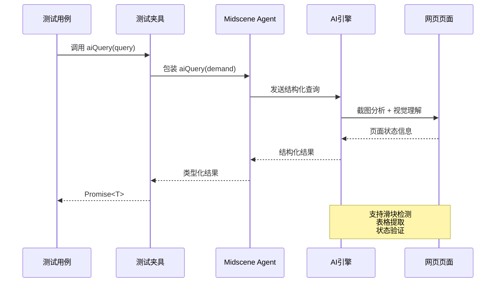
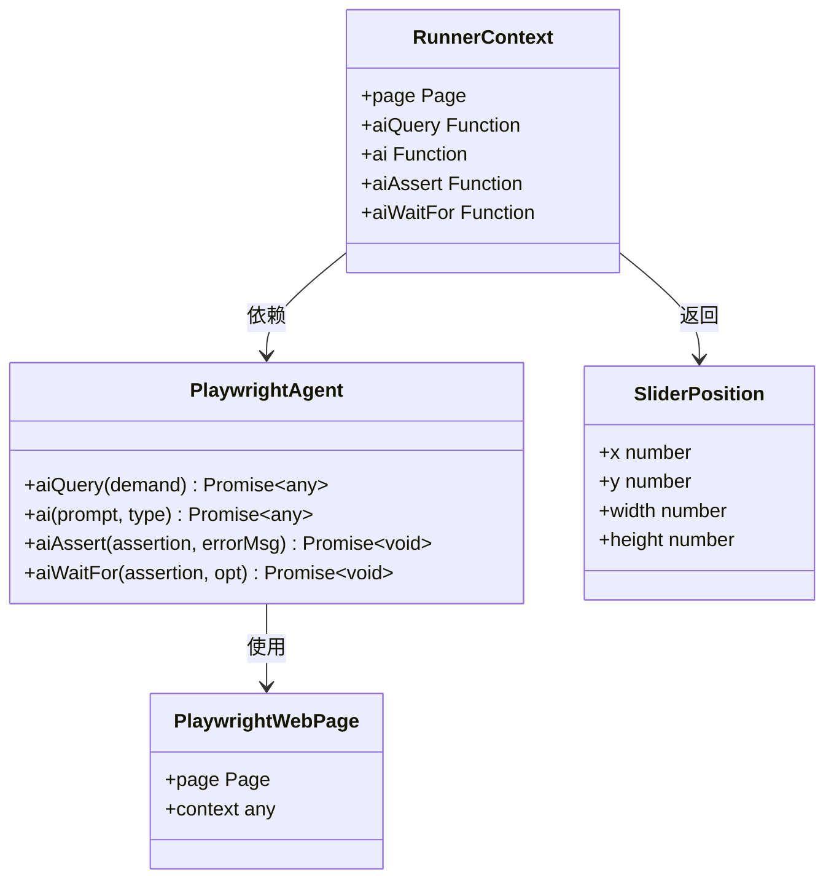
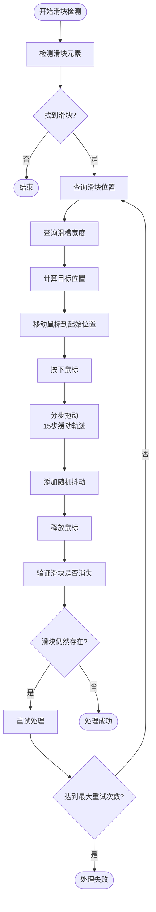
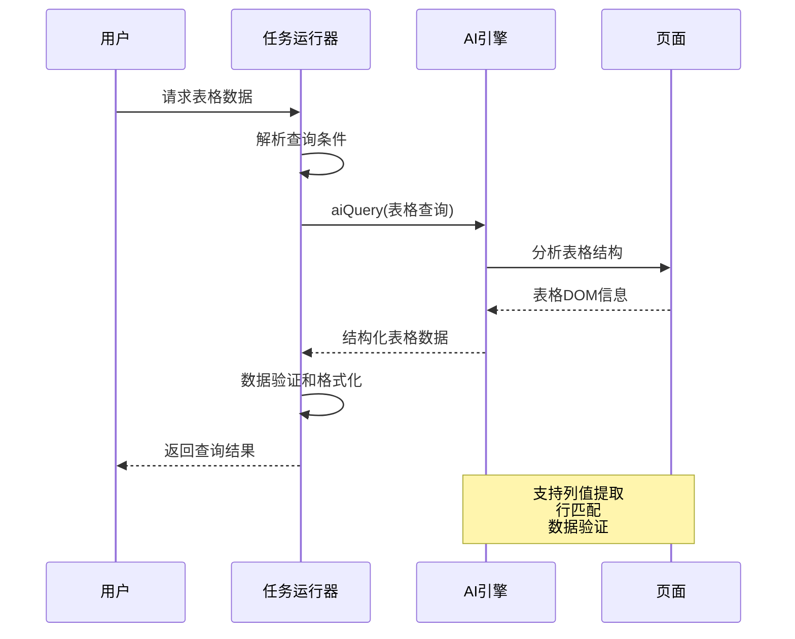
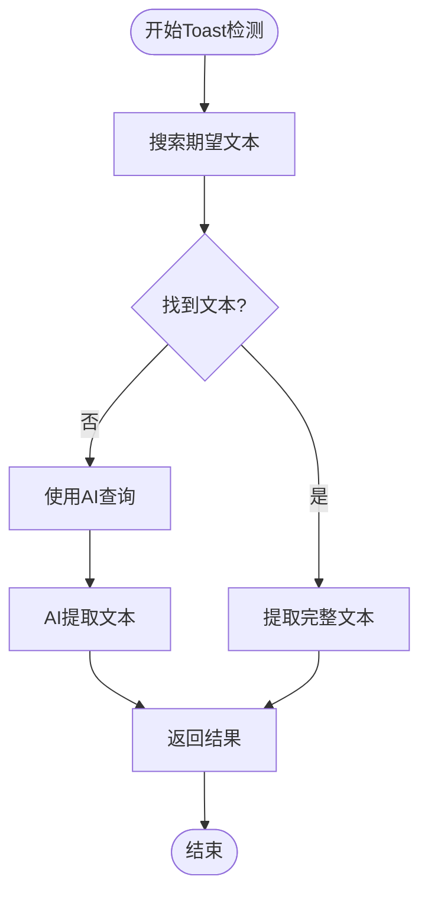
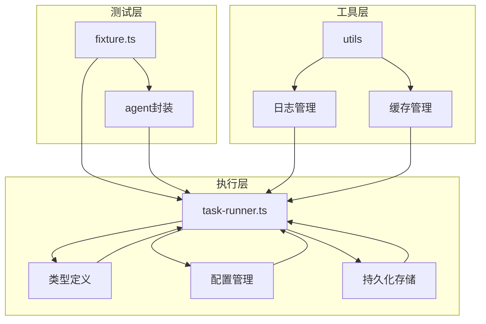

# aiQuery() 查询 API

<cite>
**本文档引用的文件**
- [README.md](file://README.md)
- [package.json](file://package.json)
- [src/stage2/task-runner.ts](file://src/stage2/task-runner.ts)
- [src/stage2/types.ts](file://src/stage2/types.ts)
- [tests/fixture/fixture.ts](file://tests/fixture/fixture.ts)
- [tests/generated/stage2-acceptance-runner.spec.ts](file://tests/generated/stage2-acceptance-runner.spec.ts)
</cite>

## 目录
1. [简介](#简介)
2. [项目结构](#项目结构)
3. [核心组件](#核心组件)
4. [架构概览](#架构概览)
5. [详细组件分析](#详细组件分析)
6. [依赖关系分析](#依赖关系分析)
7. [性能考虑](#性能考虑)
8. [故障排除指南](#故障排除指南)
9. [结论](#结论)
10. [附录](#附录)

## 简介

aiQuery() 是一个强大的结构化数据提取 API，专为从网页中提取结构化信息而设计。该 API 基于 Midscene.js 架构，结合了人工智能视觉理解和结构化输出能力，能够智能地从复杂的网页界面中提取所需的数据。

在本项目中，aiQuery() 主要用于：
- 滑块验证码位置检测和验证
- 页面元素状态查询
- 表格数据提取和验证
- Toast 提示信息检测
- 自定义业务逻辑验证

该 API 的核心优势在于其强类型的返回值设计和灵活的查询语法，使得开发者能够精确控制查询结果的格式和结构。

## 项目结构

该项目采用模块化的架构设计，主要包含以下关键组件：



**图表来源**
- [tests/fixture/fixture.ts:1-99](file://tests/fixture/fixture.ts#L1-L99)
- [src/stage2/task-runner.ts:1-200](file://src/stage2/task-runner.ts#L1-L200)
- [src/stage2/types.ts:1-180](file://src/stage2/types.ts#L1-L180)

**章节来源**
- [README.md:105-149](file://README.md#L105-L149)
- [package.json:1-28](file://package.json#L1-L28)

## 核心组件

### aiQuery() 接口规范

aiQuery() 是一个泛型函数，具有以下接口特征：

**函数签名**
```typescript
aiQuery<T = any>(demand: any): Promise<T>
```

**参数说明**
- `demand`: 查询需求参数，可以是字符串、对象或任意其他类型
- 泛型参数 `T`: 返回值的类型约束，用于编译时类型检查

**返回值**
- 类型: `Promise<T>`
- 行为: 异步返回结构化数据，支持类型推断

### 查询语法和数据格式

aiQuery() 支持多种查询语法模式：

1. **字符串查询**: 直接传入自然语言描述
2. **对象查询**: 传入结构化查询对象
3. **混合查询**: 结合多种查询方式

**查询结果格式要求**
- 必须返回结构化 JSON 对象
- 支持嵌套对象和数组
- 字段命名应清晰表达业务含义

**章节来源**
- [tests/fixture/fixture.ts:57-69](file://tests/fixture/fixture.ts#L57-L69)
- [src/stage2/task-runner.ts:1873-1917](file://src/stage2/task-runner.ts#L1873-L1917)

## 架构概览

aiQuery() 在整个系统中的架构位置如下：



**图表来源**
- [tests/fixture/fixture.ts:57-69](file://tests/fixture/fixture.ts#L57-L69)
- [src/stage2/task-runner.ts:510-538](file://src/stage2/task-runner.ts#L510-L538)

### 组件关系图



**图表来源**
- [tests/fixture/fixture.ts:23-99](file://tests/fixture/fixture.ts#L23-L99)
- [src/stage2/task-runner.ts:18-25](file://src/stage2/task-runner.ts#L18-L25)
- [src/stage2/task-runner.ts:503-508](file://src/stage2/task-runner.ts#L503-L508)

## 详细组件分析

### 滑块验证码检测组件

滑块验证码检测是 aiQuery() 的核心应用场景之一，实现了完整的自动化处理流程：



**图表来源**
- [src/stage2/task-runner.ts:561-648](file://src/stage2/task-runner.ts#L561-L648)
- [src/stage2/task-runner.ts:510-538](file://src/stage2/task-runner.ts#L510-L538)
- [src/stage2/task-runner.ts:540-559](file://src/stage2/task-runner.ts#L540-L559)

#### 滑块位置查询实现

滑块位置查询通过 aiQuery() 实现，返回精确的坐标信息：

**查询参数示例**
- 查询需求：`"分析当前页面是否存在滑块验证码。如果存在，返回滑块按钮的位置信息（中心点坐标和尺寸）。"`
- 返回格式：`{ found: boolean, x: number, y: number, width: number, height: number }`

**查询结果解析**
- `found`: 布尔值，指示是否检测到滑块
- `x, y`: 滑块中心点的屏幕坐标
- `width, height`: 滑块的尺寸信息

#### 滑槽宽度查询实现

滑槽宽度查询专门用于获取滑块拖动轨道的总宽度：

**查询参数示例**
- 查询需求：`"分析当前页面的滑块验证码滑槽宽度。"`
- 返回格式：`{ found: boolean, width: number }`

**查询结果解析**
- `width`: 滑槽的总宽度（像素）

**章节来源**
- [src/stage2/task-runner.ts:510-559](file://src/stage2/task-runner.ts#L510-L559)

### 表格数据提取组件

aiQuery() 在表格数据提取方面表现出色，支持多种查询模式：



**图表来源**
- [src/stage2/task-runner.ts:1617-1668](file://src/stage2/task-runner.ts#L1617-L1668)
- [src/stage2/task-runner.ts:1740-1789](file://src/stage2/task-runner.ts#L1740-L1789)

#### 表格行存在性验证

表格行存在性验证通过 aiQuery() 实现，支持精确匹配和包含匹配两种模式：

**查询参数示例**
- 精确匹配：`"检查当前页面列表/表格中是否存在精确匹配"用户ID"的数据行。"`
- 包含匹配：`"检查当前页面列表/表格中是否存在包含匹配"用户ID"的数据行。"`

**返回结果格式**
```json
{
  "found": true,
  "rowInfo": "完整的行信息"
}
```

#### 表格单元格值验证

单元格值验证支持精确比较和包含比较两种模式：

**查询参数示例**
- 精确比较：`"在当前列表中找到"用户名"为"张三"的行，提取列["姓名","年龄","部门"]的值，并与期望值做严格比对。"`
- 包含比较：`"在当前列表中找到"用户名"为"张三"的行，检查列"部门"是否包含"技术"。"`

**返回结果格式**
```json
{
  "found": true,
  "matchedRow": true,
  "allMatched": true,
  "mismatchedColumns": ["年龄"],
  "columnValues": {
    "姓名": "张三",
    "年龄": "25",
    "部门": "技术部"
  }
}
```

**章节来源**
- [src/stage2/task-runner.ts:1617-1789](file://src/stage2/task-runner.ts#L1617-L1789)

### Toast 提示信息检测

Toast 提示信息检测是另一个重要的应用场景：



**图表来源**
- [src/stage2/task-runner.ts:1594-1615](file://src/stage2/task-runner.ts#L1594-L1615)

**查询参数示例**
- `"检查页面是否存在包含"操作成功"的提示信息（如Toast、弹窗、通知等）。"`

**返回结果格式**
```json
{
  "found": true,
  "text": "操作成功完成"
}
```

**章节来源**
- [src/stage2/task-runner.ts:1594-1615](file://src/stage2/task-runner.ts#L1594-L1615)

### 自定义断言验证

aiQuery() 支持自定义断言验证，提供最大的灵活性：

**查询参数示例**
- `"根据以下描述验证当前页面状态："登录表单已加载且可交互"。返回格式：{ passed: boolean, reason: string }"`

**返回结果格式**
```json
{
  "passed": true,
  "reason": "页面包含登录表单，输入框可编辑"
}
```

**章节来源**
- [src/stage2/task-runner.ts:1873-1917](file://src/stage2/task-runner.ts#L1873-L1917)

## 依赖关系分析

### 外部依赖

项目对外部依赖的管理采用模块化方式：

```mermaid
graph LR
subgraph "核心依赖"
A[@midscene/web] --> B[Playwright集成]
A --> C[AI引擎]
D[@playwright/test] --> E[Web自动化]
end
subgraph "运行时依赖"
F[node:sqlite] --> G[本地数据库]
H[dotenv] --> I[环境配置]
end
subgraph "开发依赖"
J[@types/node] --> K[类型定义]
L[typescript] --> M[编译支持]
end
A --> F
D --> E
```

**图表来源**
- [package.json:17-27](file://package.json#L17-L27)

### 内部模块依赖

内部模块之间的依赖关系清晰明确：



**图表来源**
- [tests/fixture/fixture.ts:1-99](file://tests/fixture/fixture.ts#L1-L99)
- [src/stage2/task-runner.ts:1-200](file://src/stage2/task-runner.ts#L1-L200)

**章节来源**
- [package.json:1-28](file://package.json#L1-L28)

## 性能考虑

### 查询优化策略

1. **类型约束优化**: 通过泛型参数提供编译时类型检查，减少运行时错误
2. **缓存机制**: 利用 Midscene 的缓存系统，避免重复查询
3. **批量查询**: 合理组织查询请求，减少 API 调用次数
4. **超时控制**: 设置合理的查询超时时间，避免长时间阻塞

### 性能监控指标

- 查询响应时间
- AI 引擎调用频率
- 缓存命中率
- 错误率统计

### 最佳实践建议

1. **查询设计**: 设计清晰、具体的查询需求，避免模糊描述
2. **结果验证**: 对查询结果进行必要的验证和过滤
3. **错误处理**: 实现完善的错误处理机制
4. **资源管理**: 合理管理内存和网络资源

## 故障排除指南

### 常见问题及解决方案

**问题1: 查询结果为空**
- 检查查询语法是否正确
- 验证页面元素是否存在
- 确认权限设置是否正确

**问题2: 性能问题**
- 优化查询复杂度
- 实现适当的缓存策略
- 调整超时参数

**问题3: 类型不匹配**
- 检查泛型参数定义
- 验证返回值结构
- 实现类型转换逻辑

### 调试技巧

1. **启用详细日志**: 查看 Midscene 的详细执行日志
2. **截图分析**: 检查页面截图确认元素状态
3. **逐步调试**: 将复杂查询分解为简单查询
4. **环境隔离**: 在独立环境中测试查询逻辑

**章节来源**
- [src/stage2/task-runner.ts:650-699](file://src/stage2/task-runner.ts#L650-L699)

## 结论

aiQuery() 查询 API 为网页自动化测试提供了强大而灵活的结构化数据提取能力。通过精心设计的接口规范、丰富的查询语法和完善的错误处理机制，该 API 能够满足各种复杂的业务场景需求。

### 主要优势

1. **强类型支持**: 通过泛型参数提供编译时类型检查
2. **灵活查询**: 支持多种查询语法和数据格式
3. **智能处理**: 结合 AI 引擎实现智能化的数据提取
4. **易于集成**: 与现有测试框架无缝集成

### 应用前景

随着 AI 技术的不断发展，aiQuery() API 将在以下方面发挥更大作用：
- 更复杂的页面结构分析
- 更准确的数据提取精度
- 更广泛的业务场景覆盖
- 更高效的性能表现

## 附录

### 使用示例索引

以下是一些关键使用示例的位置索引：

- 滑块位置查询：[src/stage2/task-runner.ts:510-538](file://src/stage2/task-runner.ts#L510-L538)
- 滑槽宽度查询：[src/stage2/task-runner.ts:540-559](file://src/stage2/task-runner.ts#L540-L559)
- 表格行存在性验证：[src/stage2/task-runner.ts:1617-1668](file://src/stage2/task-runner.ts#L1617-L1668)
- 表格单元格值验证：[src/stage2/task-runner.ts:1740-1789](file://src/stage2/task-runner.ts#L1740-L1789)
- Toast 提示检测：[src/stage2/task-runner.ts:1594-1615](file://src/stage2/task-runner.ts#L1594-L1615)
- 自定义断言验证：[src/stage2/task-runner.ts:1873-1917](file://src/stage2/task-runner.ts#L1873-L1917)

### 配置参考

- 环境变量配置：[README.md:39-56](file://README.md#L39-L56)
- 运行时配置：[tests/fixture/fixture.ts:26-33](file://tests/fixture/fixture.ts#L26-L33)
- 任务配置：[src/stage2/types.ts:141-154](file://src/stage2/types.ts#L141-L154)