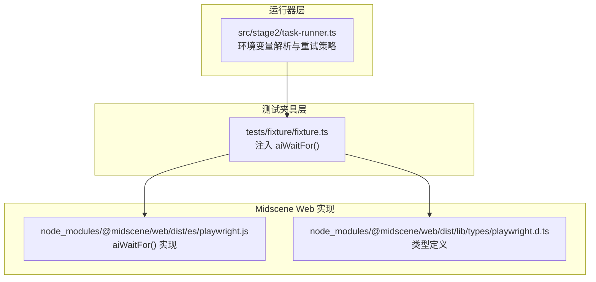
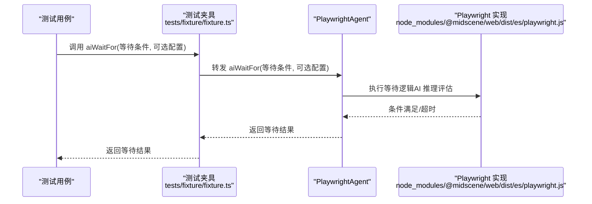
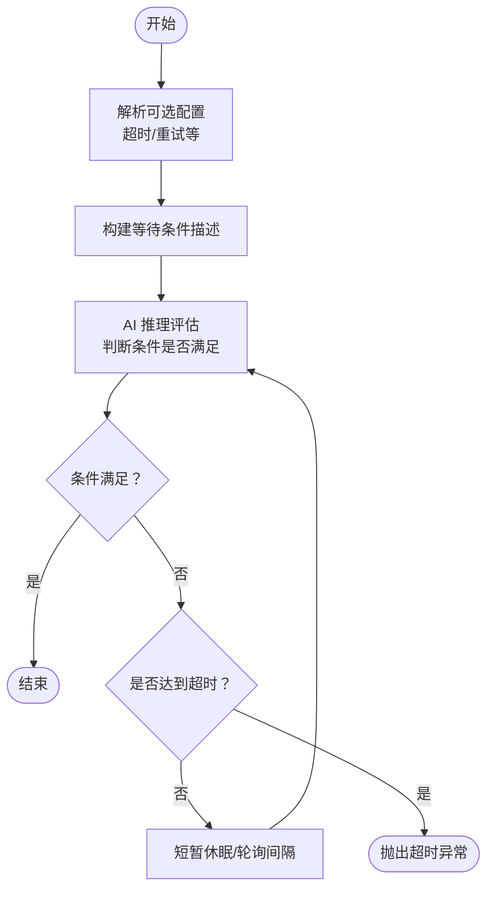
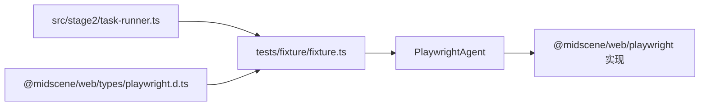

# aiWaitFor() 等待 API

<cite>
**本文引用的文件**
- [README.md](file://README.md)
- [fixture.ts](file://tests/fixture/fixture.ts)
- [task-runner.ts](file://src/stage2/task-runner.ts)
- [playwright.js](file://node_modules/@midscene/web/dist/es/playwright.js)
- [playwright.d.ts](file://node_modules/@midscene/web/dist/lib/types/playwright.d.ts)
</cite>

## 目录
1. [简介](#简介)
2. [项目结构](#项目结构)
3. [核心组件](#核心组件)
4. [架构总览](#架构总览)
5. [详细组件分析](#详细组件分析)
6. [依赖关系分析](#依赖关系分析)
7. [性能考量](#性能考量)
8. [故障排查指南](#故障排查指南)
9. [结论](#结论)
10. [附录](#附录)

## 简介
本文件系统性阐述 aiWaitFor() 等待 API 的接口规范、等待条件与超时机制，以及其在页面状态变化与异步操作完成场景中的应用。aiWaitFor() 是在 Playwright 常规等待无法覆盖的复杂语义场景下的“AI 兜底”等待能力，通过自然语言描述等待条件，由 AI 推理判断页面是否满足预期，从而实现稳定可靠的自动化等待。

## 项目结构
围绕 aiWaitFor() 的相关实现与使用分布在以下位置：
- 测试夹具层：在测试夹具中注入 aiWaitFor()，供测试用例直接调用
- 运行器层：在第二阶段任务执行器中，结合环境变量与重试策略，对 aiWaitFor() 的行为进行统一管理
- 类型与实现：在 Midscene Web 的 Playwright 实现中提供 aiWaitFor() 的具体实现与类型定义

**图表来源**
- [fixture.ts:85-99](file://tests/fixture/fixture.ts#L85-L99)
- [task-runner.ts:77-87](file://src/stage2/task-runner.ts#L77-L87)
- [playwright.js:1566](file://node_modules/@midscene/web/dist/es/playwright.js#L1566)
- [playwright.d.ts:38](file://node_modules/@midscene/web/dist/lib/types/playwright.d.ts#L38)

**章节来源**
- [README.md:144-149](file://README.md#L144-L149)
- [fixture.ts:85-99](file://tests/fixture/fixture.ts#L85-L99)
- [task-runner.ts:77-87](file://src/stage2/task-runner.ts#L77-L87)

## 核心组件
- aiWaitFor() 夹具注入
  - 在测试夹具中，aiWaitFor() 通过 PlaywrightAgent 与 PlaywrightWebPage 组合提供，直接暴露给测试用例使用
  - 夹具层负责设置日志目录、缓存标识与分组信息，并将 aiWaitFor() 以函数形式导出
- aiWaitFor() 类型与参数
  - 类型定义表明 aiWaitFor() 接受一个字符串类型的等待条件描述与可选的等待配置对象
  - 参数对象通常包含超时时间等控制项，用于调节等待行为
- 运行器层的环境变量与重试策略
  - 运行器层提供统一的超时解析逻辑，确保在不同场景下等待行为的一致性
  - 对于某些流程（如滑块验证码），运行器层会结合环境变量与固定轮询间隔，形成稳定的等待策略

**章节来源**
- [fixture.ts:85-99](file://tests/fixture/fixture.ts#L85-L99)
- [playwright.d.ts:38](file://node_modules/@midscene/web/dist/lib/types/playwright.d.ts#L38)
- [task-runner.ts:77-87](file://src/stage2/task-runner.ts#L77-L87)

## 架构总览
aiWaitFor() 的调用链路如下：
- 测试用例通过夹具调用 aiWaitFor()
- 夹具将调用转发至底层 PlaywrightAgent
- PlaywrightAgent 基于页面上下文与 AI 推理，持续评估等待条件
- 当条件满足或达到超时时，返回结果

**图表来源**
- [fixture.ts:95-97](file://tests/fixture/fixture.ts#L95-L97)
- [playwright.js:1566](file://node_modules/@midscene/web/dist/es/playwright.js#L1566)

## 详细组件分析

### aiWaitFor() 接口规范
- 输入
  - 等待条件字符串：以自然语言描述页面应满足的状态或异步操作完成的标志
  - 可选配置对象：包含超时时间等控制项
- 输出
  - 成功：等待条件满足，返回空或约定的结果
  - 失败：达到超时仍未满足，抛出异常
- 使用场景
  - 页面状态变化：如某个元素出现、文本出现、布局完成等
  - 异步操作完成：如网络请求结束、动画停止、数据刷新等
  - Playwright 硬检测不可用或不稳定时的 AI 兜底

**章节来源**
- [README.md:148-149](file://README.md#L148-L149)
- [playwright.d.ts:38](file://node_modules/@midscene/web/dist/lib/types/playwright.d.ts#L38)

### 等待条件与匹配策略
- 等待条件表达
  - 使用自然语言描述期望的页面状态，例如“元素可见”“文本出现”“页面加载完成”等
  - 条件应尽量具体且可验证，便于 AI 推理与判定
- 匹配策略
  - 底层通过 AI 推理对页面截图与 DOM 上下文进行综合分析，判断条件是否满足
  - 若条件具备明确的 Playwright 可检测特征，可优先采用硬检测；当硬检测不可靠时，AI 兜底提升稳定性

**章节来源**
- [README.md:151-157](file://README.md#L151-L157)

### 超时机制与重试
- 超时配置
  - 可通过可选配置对象传入超时时间（毫秒），用于限制等待上限
  - 运行器层提供统一的超时解析逻辑，确保在不同流程中行为一致
- 重试策略
  - 在某些流程中，运行器层采用固定轮询间隔与多次尝试，以增强鲁棒性
  - 对于 aiWaitFor()，建议在上层业务中根据场景设置合理的超时与重试次数，避免过短导致误判或过长影响效率

**章节来源**
- [task-runner.ts:77-87](file://src/stage2/task-runner.ts#L77-L87)

### 使用示例（路径指引）
以下示例均以“代码片段路径”的形式给出，避免直接粘贴源码内容：
- 等待元素可见
  - 示例路径：[tests/fixture/fixture.ts:95-97](file://tests/fixture/fixture.ts#L95-L97)
- 等待页面加载完成
  - 示例路径：[tests/fixture/fixture.ts:95-97](file://tests/fixture/fixture.ts#L95-L97)
- 等待异步操作完成
  - 示例路径：[tests/fixture/fixture.ts:95-97](file://tests/fixture/fixture.ts#L95-L97)

说明：上述示例展示了在测试夹具中如何调用 aiWaitFor()，具体等待条件字符串应根据实际页面状态编写。

**章节来源**
- [fixture.ts:95-97](file://tests/fixture/fixture.ts#L95-L97)

### 关键流程图：aiWaitFor() 执行流程

[此图为概念性流程示意，无需图表来源]

## 依赖关系分析
- 夹具到实现
  - 测试夹具将 aiWaitFor() 调用转发至 PlaywrightAgent，再由底层实现执行
- 运行器到夹具
  - 运行器层通过环境变量与统一解析逻辑，间接影响 aiWaitFor() 的行为一致性
- 类型约束
  - 类型定义明确了 aiWaitFor() 的签名与参数结构，保证调用侧与实现侧的一致性

**图表来源**
- [fixture.ts:95-97](file://tests/fixture/fixture.ts#L95-L97)
- [playwright.js:1566](file://node_modules/@midscene/web/dist/es/playwright.js#L1566)
- [playwright.d.ts:38](file://node_modules/@midscene/web/dist/lib/types/playwright.d.ts#L38)
- [task-runner.ts:77-87](file://src/stage2/task-runner.ts#L77-L87)

**章节来源**
- [fixture.ts:95-97](file://tests/fixture/fixture.ts#L95-L97)
- [playwright.d.ts:38](file://node_modules/@midscene/web/dist/lib/types/playwright.d.ts#L38)
- [task-runner.ts:77-87](file://src/stage2/task-runner.ts#L77-L87)

## 性能考量
- 合理设置超时
  - 避免过短导致频繁超时与误判，也避免过长影响整体执行效率
- 优先硬检测
  - 在可使用 Playwright 硬检测的场景下优先使用，AI 兜底仅在必要时启用
- 控制等待粒度
  - 等待条件应尽可能聚焦，减少不必要的上下文分析开销
- 日志与报告
  - 夹具层开启报告生成，有助于定位等待失败原因并优化条件描述

**章节来源**
- [README.md:151-157](file://README.md#L151-L157)
- [fixture.ts:26-33](file://tests/fixture/fixture.ts#L26-L33)

## 故障排查指南
- 等待超时
  - 检查等待条件描述是否准确、页面状态是否符合预期
  - 调整超时时间或重试策略，结合运行器层的统一解析逻辑进行验证
- 条件不可判定
  - 将自然语言条件拆分为更细粒度的步骤，或结合硬检测与 AI 兜底混合策略
- 环境变量影响
  - 某些流程受环境变量控制（如验证码等待超时），需确保配置合理

**章节来源**
- [task-runner.ts:77-87](file://src/stage2/task-runner.ts#L77-L87)

## 结论
aiWaitFor() 提供了在复杂语义场景下的稳定等待能力，通过自然语言描述等待条件并在超时与重试机制下实现可靠自动化。结合测试夹具与运行器层的统一配置，可在保证稳定性的同时兼顾性能与可维护性。

## 附录
- 相关说明
  - README 中明确指出 aiWaitFor() 适用于“Playwright 常规等待不适用”的场景
  - 推荐实践强调断言优先使用硬检测，AI 操作作为兜底

**章节来源**
- [README.md:148-149](file://README.md#L148-L149)
- [README.md:151-157](file://README.md#L151-L157)