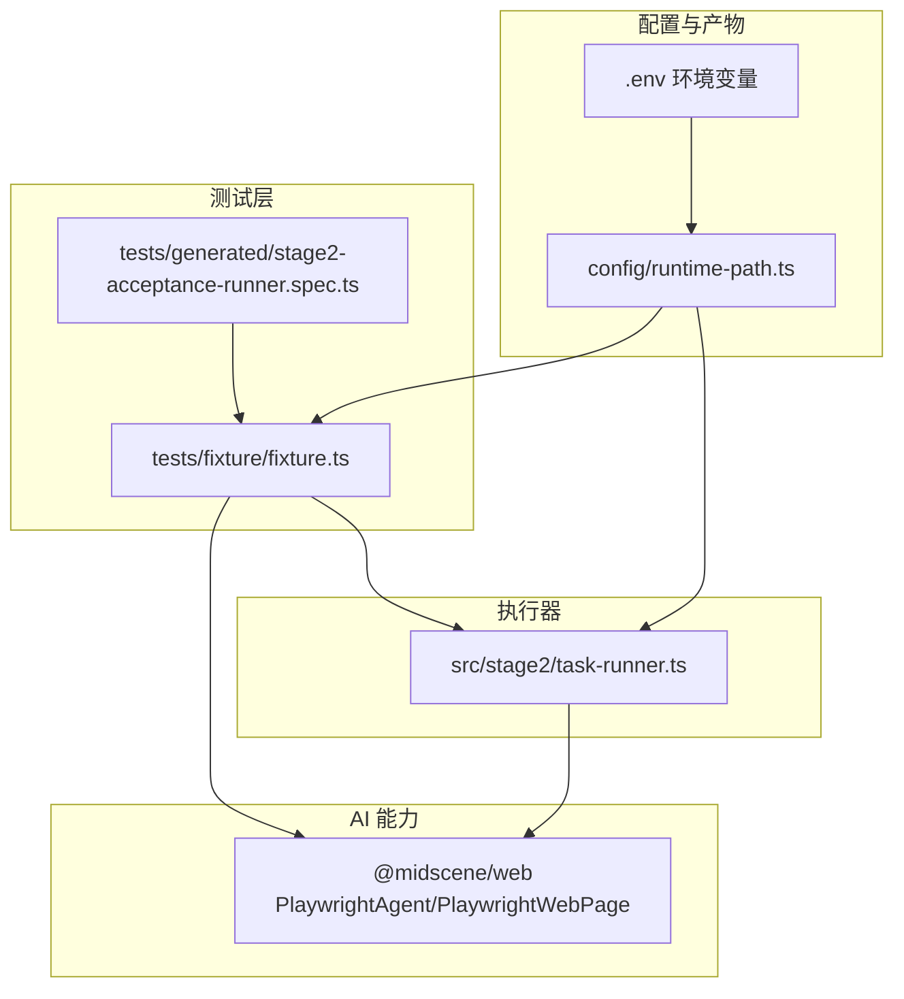
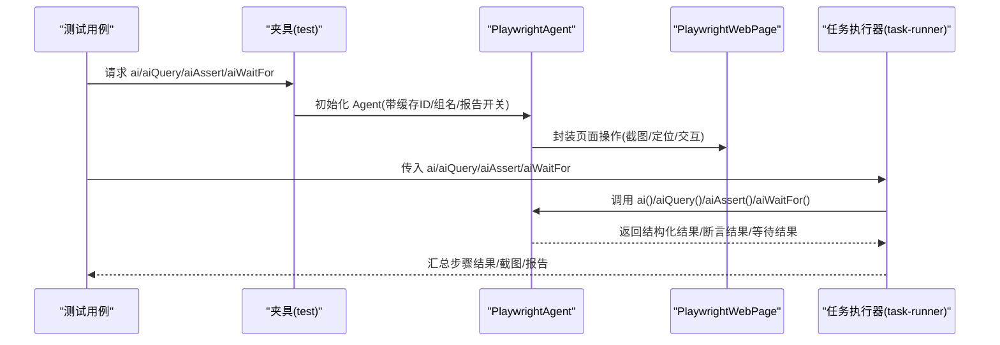
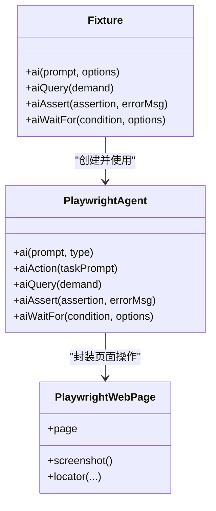
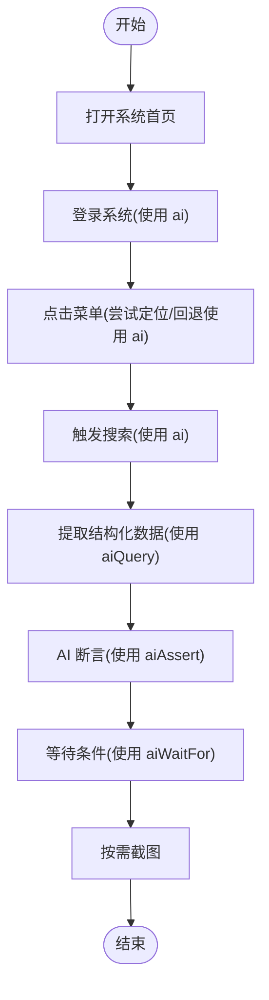
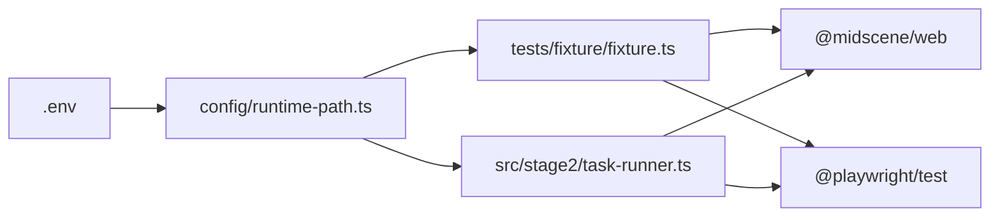

# AI 集成 API

<cite>
**本文引用的文件列表**
- [README.md](file://README.md)
- [package.json](file://package.json)
- [AGENTS.md](file://AGENTS.md)
- [config/runtime-path.ts](file://config/runtime-path.ts)
- [tests/fixture/fixture.ts](file://tests/fixture/fixture.ts)
- [tests/generated/stage2-acceptance-runner.spec.ts](file://tests/generated/stage2-acceptance-runner.spec.ts)
- [src/stage2/task-runner.ts](file://src/stage2/task-runner.ts)
- [.tasks/AI自主代理验收系统开发改造方案_2026-03-11.md](file://.tasks/AI自主代理验收系统开发改造方案_2026-03-11.md)
</cite>

## 目录
1. [简介](#简介)
2. [项目结构](#项目结构)
3. [核心组件](#核心组件)
4. [架构总览](#架构总览)
5. [组件详解](#组件详解)
6. [依赖关系分析](#依赖关系分析)
7. [性能与限制](#性能与限制)
8. [故障排查指南](#故障排查指南)
9. [结论](#结论)
10. [附录](#附录)

## 简介
本文件面向 HI-TEST 项目，系统化说明基于 Midscene.js 的 AI 集成 API，重点覆盖 ai、aiAssert、aiQuery、aiWaitFor 等核心函数的使用方法与最佳实践。文档同时解释 AI 能力在页面元素识别、结构化数据提取与智能断言中的应用，给出查询语法与断言表达式的使用建议，说明模型配置与调优参数，记录性能考量与限制条件，并提供真实使用场景与示例路径，帮助在测试中高效、稳定地利用 AI 能力。

## 项目结构
- 核心技术栈：Playwright + Midscene.js
- 运行入口：第二段任务执行器（JSON 驱动）
- AI 能力注入：通过统一夹具注入 ai、aiQuery、aiAssert、aiWaitFor
- 配置与产物：通过 .env 与 runtime-path.ts 统一管理运行目录与报告

图表来源
- [tests/generated/stage2-acceptance-runner.spec.ts](file://tests/generated/stage2-acceptance-runner.spec.ts#L1-L39)
- [tests/fixture/fixture.ts](file://tests/fixture/fixture.ts#L1-L99)
- [src/stage2/task-runner.ts](file://src/stage2/task-runner.ts#L1-L200)
- [config/runtime-path.ts](file://config/runtime-path.ts#L1-L41)

章节来源
- [README.md](file://README.md#L1-L144)
- [package.json](file://package.json#L1-L24)

## 核心组件
- 夹具注入的 AI 方法族
  - ai：执行交互动作（支持 action/query 类型）
  - aiQuery：从页面提取结构化数据
  - aiAssert：执行 AI 断言
  - aiWaitFor：等待某个条件满足（支持超时与轮询等选项）
- 任务执行器
  - 读取任务 JSON，按步骤驱动页面操作，结合 AI 能力完成登录、菜单导航、搜索、断言等
- 配置与产物目录
  - 通过 .env 与 runtime-path.ts 统一管理运行目录（Playwright 输出、Midscene 报告、接受结果等）

章节来源
- [tests/fixture/fixture.ts](file://tests/fixture/fixture.ts#L23-L99)
- [README.md](file://README.md#L93-L116)
- [config/runtime-path.ts](file://config/runtime-path.ts#L1-L41)

## 架构总览
AI 集成以夹具为核心，将 Midscene 的 PlaywrightAgent/PlaywrightWebPage 能力注入到测试用例中，形成统一的 ai、aiQuery、aiAssert、aiWaitFor 接口。任务执行器通过这些接口驱动页面交互与断言，同时结合 .env 与 runtime-path.ts 管理运行产物目录。

图表来源
- [tests/fixture/fixture.ts](file://tests/fixture/fixture.ts#L23-L99)
- [src/stage2/task-runner.ts](file://src/stage2/task-runner.ts#L15-L31)
- [tests/generated/stage2-acceptance-runner.spec.ts](file://tests/generated/stage2-acceptance-runner.spec.ts#L12-L37)

## 组件详解

### 夹具与 AI 方法注入
- 夹具通过扩展 Playwright test，注入 ai、aiQuery、aiAssert、aiWaitFor 四个方法
- 每个方法内部使用 PlaywrightAgent + PlaywrightWebPage，结合 testId、cacheId、groupName 等参数进行缓存与报告管理
- ai 支持通过 options.type 指定“action”或“query”，用于区分交互与结构化提取

图表来源
- [tests/fixture/fixture.ts](file://tests/fixture/fixture.ts#L23-L99)

章节来源
- [tests/fixture/fixture.ts](file://tests/fixture/fixture.ts#L1-L99)

### 任务执行器与 AI 能力协同
- 任务执行器按步骤驱动页面，如打开首页、登录、菜单点击、触发搜索等
- 在每个步骤中，可选择使用 ai 进行交互，或使用 aiQuery 提取结构化数据，再配合 aiAssert 做补充断言
- 执行器内置截图与失败补偿逻辑，便于问题定位与重试

图表来源
- [src/stage2/task-runner.ts](file://src/stage2/task-runner.ts#L1157-L1169)
- [src/stage2/task-runner.ts](file://src/stage2/task-runner.ts#L846-L859)

章节来源
- [src/stage2/task-runner.ts](file://src/stage2/task-runner.ts#L1-L200)
- [src/stage2/task-runner.ts](file://src/stage2/task-runner.ts#L846-L1169)

### AI 查询语法与断言表达式建议
- 查询语法（aiQuery）
  - 以“从页面提取...”为导向的自然语言描述，明确目标字段与期望格式
  - 示例路径参考：[登录步骤中使用 aiQuery 的场景](file://src/stage2/task-runner.ts#L1163-L1168)
- 断言表达式（aiAssert）
  - 使用“页面上是否存在...”、“文本是否包含...”等自然语言描述
  - 示例路径参考：[任务执行器中的断言调用](file://src/stage2/task-runner.ts#L1157-L1169)
- 最佳实践
  - 将长流程拆分为多个步骤，避免单条长 Prompt 导致定位困难
  - 关键结果优先使用 aiQuery + Playwright/TypeScript 硬断言，aiAssert 作为补充性可读断言

章节来源
- [.tasks/AI自主代理验收系统开发改造方案_2026-03-11.md](file://.tasks/AI自主代理验收系统开发改造方案_2026-03-11.md#L60-L84)
- [README.md](file://README.md#L100-L105)

### AI 模型配置与调优参数
- 模型接入与配置
  - 通过 OPENAI_API_KEY、OPENAI_BASE_URL、MIDSCENE_MODEL_NAME 等环境变量配置
  - 示例路径参考：[环境变量配置示例](file://README.md#L39-L52)
- 运行目录与产物
  - RUNTIME_DIR_PREFIX、PLAYWRIGHT_OUTPUT_DIR、PLAYWRIGHT_HTML_REPORT_DIR、MIDSCENE_RUN_DIR、ACCEPTANCE_RESULT_DIR
  - 示例路径参考：[运行产物目录说明](file://README.md#L74-L92)
- 目录解析与统一
  - runtime-path.ts 读取 .env 并提供 resolveRuntimePath，确保路径一致性
  - 示例路径参考：[runtime-path.ts](file://config/runtime-path.ts#L1-L41)

章节来源
- [README.md](file://README.md#L31-L92)
- [config/runtime-path.ts](file://config/runtime-path.ts#L1-L41)

### AI 结果的缓存机制与重试策略
- 缓存机制
  - 夹具中使用 cacheId 与 testId，结合 sanitizeCacheId 对特殊字符进行清理，确保缓存键稳定
  - 示例路径参考：[缓存 ID 清理与注入](file://tests/fixture/fixture.ts#L12-L14)、[Agent 初始化参数](file://tests/fixture/fixture.ts#L26-L33)
- 重试策略
  - 任务执行器在步骤失败时会截图并记录错误，支持按需重试与失败补偿
  - 示例路径参考：[失败截图与错误记录](file://src/stage2/task-runner.ts#L1132-L1149)

章节来源
- [tests/fixture/fixture.ts](file://tests/fixture/fixture.ts#L12-L14)
- [tests/fixture/fixture.ts](file://tests/fixture/fixture.ts#L26-L33)
- [src/stage2/task-runner.ts](file://src/stage2/task-runner.ts#L1132-L1149)

### 实际使用场景与示例路径
- 登录页自动处理（滑块验证码）
  - 使用 aiQuery 识别滑块按钮位置与滑槽宽度，再用 Playwright mouse API 模拟真人拖动轨迹
  - 示例路径参考：[滑块验证码自动处理说明](file://README.md#L62-L72)
- 任务 JSON 驱动的第二段执行
  - 通过 tests/generated/stage2-acceptance-runner.spec.ts 启动，传入 ai/aiQuery/aiAssert/aiWaitFor
  - 示例路径参考：[测试入口与参数传递](file://tests/generated/stage2-acceptance-runner.spec.ts#L12-L37)
- 任务执行器中的典型步骤
  - 打开首页、登录、菜单点击、触发搜索、提取结构化数据、断言、等待
  - 示例路径参考：[登录与菜单点击示例](file://src/stage2/task-runner.ts#L1157-L1169)、[触发搜索回退示例](file://src/stage2/task-runner.ts#L846-L859)

章节来源
- [README.md](file://README.md#L62-L72)
- [tests/generated/stage2-acceptance-runner.spec.ts](file://tests/generated/stage2-acceptance-runner.spec.ts#L12-L37)
- [src/stage2/task-runner.ts](file://src/stage2/task-runner.ts#L846-L859)
- [src/stage2/task-runner.ts](file://src/stage2/task-runner.ts#L1157-L1169)

## 依赖关系分析
- 外部依赖
  - @midscene/web：提供 PlaywrightAgent、PlaywrightWebPage 与 AI 能力
  - @playwright/test：测试框架
  - dotenv：加载 .env
- 内部依赖
  - runtime-path.ts：统一解析运行目录
  - fixture.ts：注入 AI 方法
  - task-runner.ts：任务执行与步骤编排

图表来源
- [tests/fixture/fixture.ts](file://tests/fixture/fixture.ts#L1-L99)
- [src/stage2/task-runner.ts](file://src/stage2/task-runner.ts#L1-L200)
- [config/runtime-path.ts](file://config/runtime-path.ts#L1-L41)
- [package.json](file://package.json#L13-L22)

章节来源
- [package.json](file://package.json#L13-L22)
- [config/runtime-path.ts](file://config/runtime-path.ts#L1-L41)

## 性能与限制
- 页面动态与异步刷新
  - Vue 动态页面中菜单、弹窗、分页表格、异步刷新较多，建议将长流程拆分为多个步骤，提升稳定性与可重试性
  - 示例路径参考：[流程拆分建议](file://.tasks/AI自主代理验收系统开发改造方案_2026-03-11.md#L60-L77)
- 关键断言与 AI 幻觉
  - 官方建议关键结果优先使用 aiQuery + Playwright/TypeScript 硬断言，aiAssert 作为补充性可读断言
  - 示例路径参考：[关键断言建议](file://.tasks/AI自主代理验收系统开发改造方案_2026-03-11.md#L78-L84)
- 运行产物与缓存
  - 统一运行目录与缓存目录，减少 IO 开销与路径不一致导致的问题
  - 示例路径参考：[运行产物目录](file://README.md#L74-L92)、[缓存 ID 清理](file://tests/fixture/fixture.ts#L12-L14)

章节来源
- [.tasks/AI自主代理验收系统开发改造方案_2026-03-11.md](file://.tasks/AI自主代理验收系统开发改造方案_2026-03-11.md#L60-L84)
- [README.md](file://README.md#L74-L92)
- [tests/fixture/fixture.ts](file://tests/fixture/fixture.ts#L12-L14)

## 故障排查指南
- 模型配置问题
  - 确认 OPENAI_API_KEY、OPENAI_BASE_URL、MIDSCENE_MODEL_NAME 是否正确设置
  - 示例路径参考：[环境变量配置示例](file://README.md#L39-L52)
- 运行目录不一致
  - 检查 .env 与 runtime-path.ts 的配置，确保路径解析一致
  - 示例路径参考：[runtime-path.ts](file://config/runtime-path.ts#L1-L41)
- 步骤失败与截图
  - 任务执行器在步骤失败时会截图并记录错误信息，可据此定位问题
  - 示例路径参考：[失败截图与错误记录](file://src/stage2/task-runner.ts#L1132-L1149)
- 滑块验证码处理
  - 若自动模式失败，可切换为 manual/fail/ignore 模式进行调试
  - 示例路径参考：[滑块模式说明](file://README.md#L54-L61)

章节来源
- [README.md](file://README.md#L39-L61)
- [config/runtime-path.ts](file://config/runtime-path.ts#L1-L41)
- [src/stage2/task-runner.ts](file://src/stage2/task-runner.ts#L1132-L1149)

## 结论
HI-TEST 项目通过夹具将 Midscene.js 的 AI 能力无缝注入到 Playwright 测试中，形成统一的 ai、aiQuery、aiAssert、aiWaitFor 接口。结合任务执行器与统一的运行目录管理，可在复杂动态页面中稳定地完成页面元素识别、结构化数据提取与智能断言。遵循流程拆分与关键断言优先的原则，可显著降低 AI 幻觉风险并提升测试稳定性。

## 附录
- 相关文档与规范
  - AGENTS.md：统一开发、命名、日志、配置与运行产物目录规范
  - .tasks/AI自主代理验收系统开发改造方案_2026-03-11.md：AI 能力边界与落地结论
- 相关文件
  - package.json：依赖与脚本
  - README.md：安装、配置与运行说明

章节来源
- [AGENTS.md](file://AGENTS.md#L1-L61)
- [.tasks/AI自主代理验收系统开发改造方案_2026-03-11.md](file://.tasks/AI自主代理验收系统开发改造方案_2026-03-11.md#L47-L84)
- [package.json](file://package.json#L1-L24)
- [README.md](file://README.md#L1-L144)