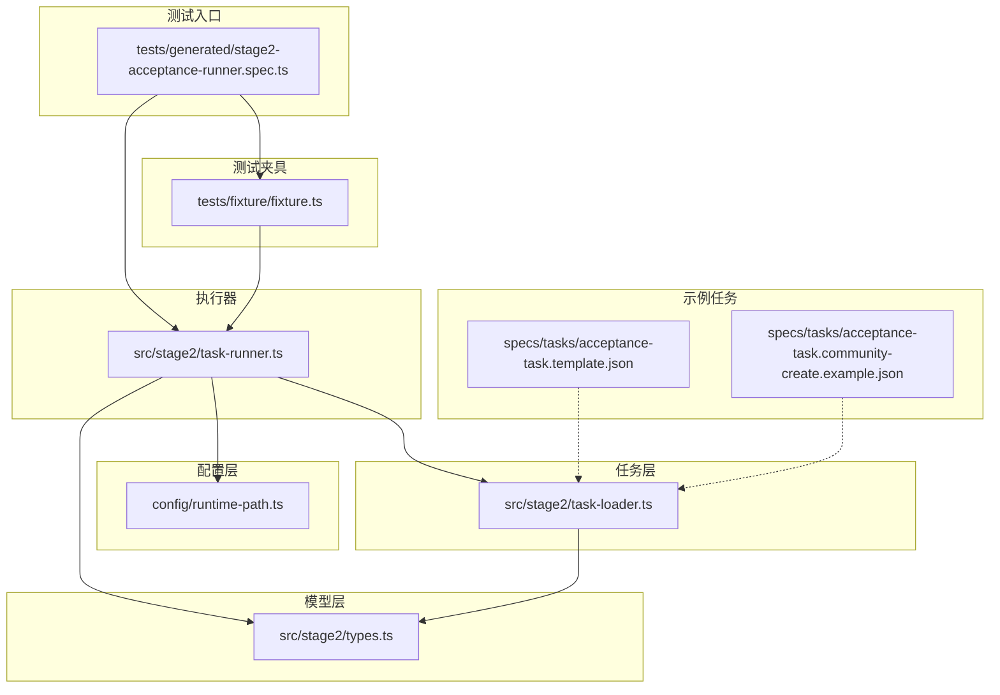
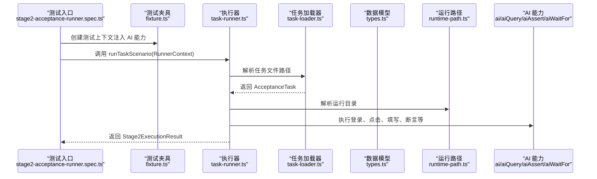
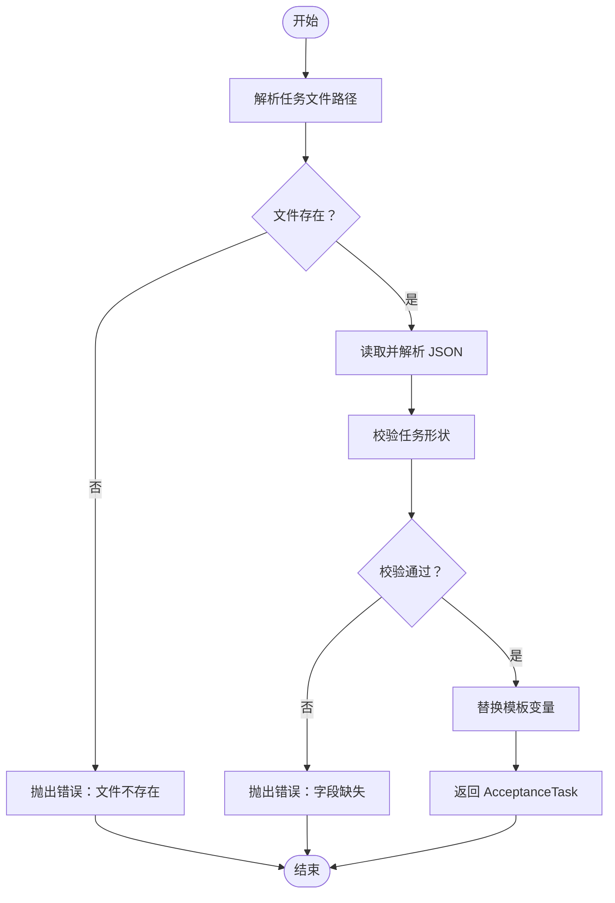
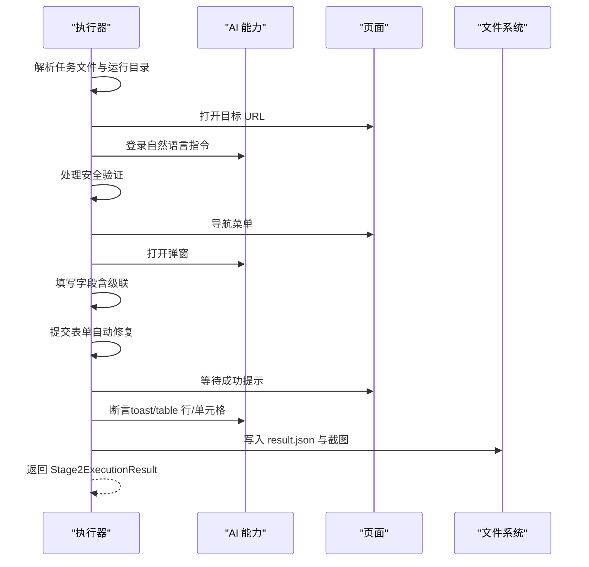
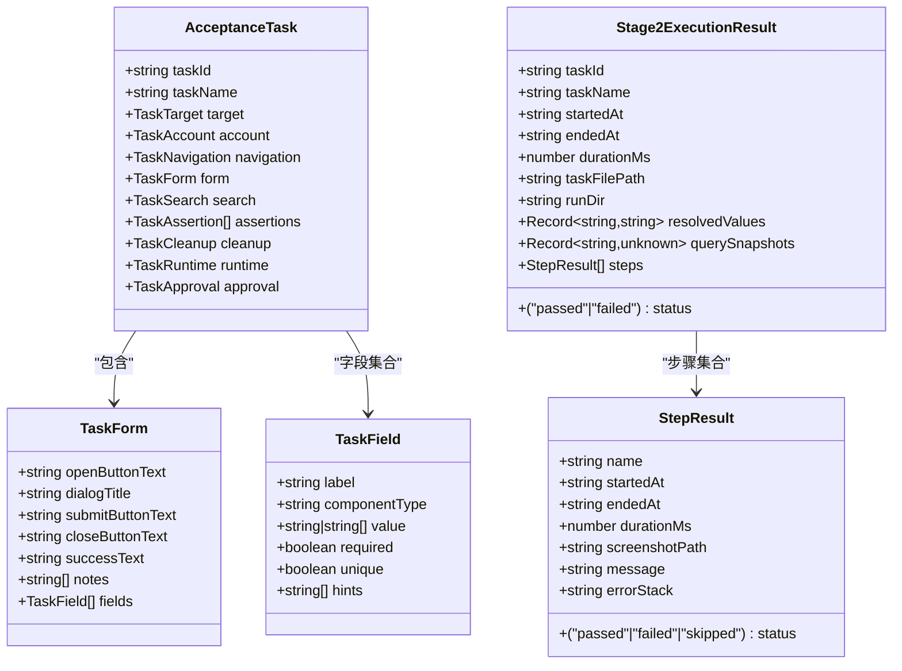
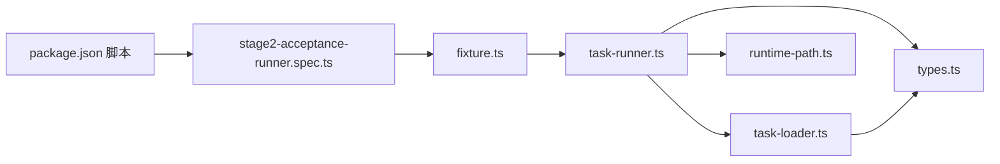

# API 参考

<cite>
**本文引用的文件**
- [README.md](file://README.md)
- [package.json](file://package.json)
- [config/runtime-path.ts](file://config/runtime-path.ts)
- [src/stage2/types.ts](file://src/stage2/types.ts)
- [src/stage2/task-loader.ts](file://src/stage2/task-loader.ts)
- [src/stage2/task-runner.ts](file://src/stage2/task-runner.ts)
- [tests/generated/stage2-acceptance-runner.spec.ts](file://tests/generated/stage2-acceptance-runner.spec.ts)
- [tests/fixture/fixture.ts](file://tests/fixture/fixture.ts)
- [specs/tasks/acceptance-task.template.json](file://specs/tasks/acceptance-task.template.json)
- [specs/tasks/acceptance-task.community-create.example.json](file://specs/tasks/acceptance-task.community-create.example.json)
</cite>

## 目录
1. [简介](#简介)
2. [项目结构](#项目结构)
3. [核心组件](#核心组件)
4. [架构总览](#架构总览)
5. [详细组件分析](#详细组件分析)
6. [依赖关系分析](#依赖关系分析)
7. [性能考量](#性能考量)
8. [故障排查指南](#故障排查指南)
9. [结论](#结论)
10. [附录](#附录)

## 简介
本文件为 HI-TEST 项目的 API 参考文档，聚焦第二阶段执行器（Stage2）的公开接口与数据模型，涵盖以下方面：
- 任务加载 API：从 JSON 任务文件解析、模板变量替换与校验
- 执行器 API：基于 JSON 任务驱动的自动化执行流程（登录、菜单导航、表单填写、提交、断言、截图与结果落盘）
- AI 集成 API：通过 Midscene 的 ai、aiQuery、aiAssert、aiWaitFor 能力进行智能交互与断言
- 数据模型参考：AcceptanceTask、TaskField、TaskForm、Stage2ExecutionResult 等
- 调用顺序与依赖关系：从任务加载到最终结果输出的完整链路
- 版本兼容与迁移：环境变量、运行产物目录与配置项的演进说明

## 项目结构
本项目采用“功能模块 + 配置 + 示例”的组织方式：
- config/runtime-path.ts：集中管理运行产物目录与路径解析
- src/stage2/types.ts：定义任务与执行结果的核心数据模型
- src/stage2/task-loader.ts：任务文件加载、模板变量解析与形状校验
- src/stage2/task-runner.ts：执行器主流程，封装 AI 与 Playwright 的协作
- tests/fixture/fixture.ts：为测试夹具注入 ai、aiQuery、aiAssert、aiWaitFor 等 AI 能力
- tests/generated/stage2-acceptance-runner.spec.ts：端到端入口，调用执行器并产出结果
- specs/tasks/*：任务 JSON 模板与示例

图表来源
- [config/runtime-path.ts](file://config/runtime-path.ts#L1-L41)
- [src/stage2/types.ts](file://src/stage2/types.ts#L1-L125)
- [src/stage2/task-loader.ts](file://src/stage2/task-loader.ts#L1-L91)
- [src/stage2/task-runner.ts](file://src/stage2/task-runner.ts#L1-L1344)
- [tests/fixture/fixture.ts](file://tests/fixture/fixture.ts#L1-L100)
- [tests/generated/stage2-acceptance-runner.spec.ts](file://tests/generated/stage2-acceptance-runner.spec.ts#L1-L39)
- [specs/tasks/acceptance-task.template.json](file://specs/tasks/acceptance-task.template.json#L1-L85)
- [specs/tasks/acceptance-task.community-create.example.json](file://specs/tasks/acceptance-task.community-create.example.json#L1-L184)

章节来源
- [README.md](file://README.md#L1-L144)
- [package.json](file://package.json#L1-L24)

## 核心组件
本节对三大核心 API 进行概述与参数说明，并给出返回值与异常处理要点。

- 任务加载 API
  - 功能：解析任务文件路径、读取 JSON、模板变量替换（含 NOW_YYYYMMDDHHMMSS）、字段形状校验
  - 关键函数：resolveTaskFilePath、loadTask
  - 返回值：AcceptanceTask
  - 异常：缺失必要字段（如 taskId、taskName、target.url、account.username/password、form.openButtonText/submitButtonText、form.fields）将抛出错误
  - 适用场景：在执行器启动前加载任务配置

- 执行器 API
  - 功能：按任务 JSON 驱动完整验收流程，包含登录、菜单导航、弹窗打开、字段填写、提交、断言、截图与结果落盘
  - 关键函数：runTaskScenario
  - 参数：RunnerContext（page、ai、aiAssert、aiQuery、aiWaitFor）与可选 RunnerOptions（rawTaskFilePath）
  - 返回值：Stage2ExecutionResult
  - 异常：步骤失败时记录步骤状态与截图路径；若步骤为必需（required），则整体失败；最终写入 result.json 与 result.partial.json

- AI 集成 API
  - 能力：ai（动作）、aiQuery（查询）、aiAssert（断言）、aiWaitFor（等待）
  - 注入方式：通过 tests/fixture/fixture.ts 将 AI 能力挂载到测试夹具
  - 使用场景：在无法直接定位元素时，使用自然语言指令驱动页面交互与断言

章节来源
- [src/stage2/task-loader.ts](file://src/stage2/task-loader.ts#L71-L91)
- [src/stage2/task-runner.ts](file://src/stage2/task-runner.ts#L1062-L1344)
- [tests/fixture/fixture.ts](file://tests/fixture/fixture.ts#L23-L99)

## 架构总览
下图展示了从测试入口到执行器再到 AI 能力的整体调用链路与数据流。

图表来源
- [tests/generated/stage2-acceptance-runner.spec.ts](file://tests/generated/stage2-acceptance-runner.spec.ts#L12-L38)
- [tests/fixture/fixture.ts](file://tests/fixture/fixture.ts#L23-L99)
- [src/stage2/task-runner.ts](file://src/stage2/task-runner.ts#L1062-L1344)
- [src/stage2/task-loader.ts](file://src/stage2/task-loader.ts#L71-L91)
- [config/runtime-path.ts](file://config/runtime-path.ts#L38-L41)

## 详细组件分析

### 任务加载 API（task-loader）
- 接口职责
  - 解析任务文件路径（支持绝对/相对路径与环境变量）
  - 读取 JSON 并进行字段形状校验
  - 支持模板字符串替换（NOW_YYYYMMDDHHMMSS、环境变量）
- 关键函数与行为
  - resolveTaskFilePath：解析任务文件路径
  - loadTask：读取、校验、模板替换并返回 AcceptanceTask
  - assertTaskShape：校验必要字段
  - resolveTemplates：递归替换模板占位符
- 参数与返回
  - 输入：任务文件路径（可选）
  - 输出：AcceptanceTask
- 异常处理
  - 文件不存在、字段缺失、字段为空时抛出错误
- 使用建议
  - 在执行器启动前调用，确保任务配置完整可用

图表来源
- [src/stage2/task-loader.ts](file://src/stage2/task-loader.ts#L71-L91)
- [src/stage2/task-loader.ts](file://src/stage2/task-loader.ts#L50-L69)
- [src/stage2/task-loader.ts](file://src/stage2/task-loader.ts#L19-L48)

章节来源
- [src/stage2/task-loader.ts](file://src/stage2/task-loader.ts#L1-L91)

### 执行器 API（task-runner）
- 接口职责
  - 依据 AcceptanceTask 驱动完整验收流程
  - 组合 AI 与 Playwright 能力，自动处理滑块验证码、弹窗、级联选择、表单提交与断言
  - 记录步骤、截图、中间快照与最终结果
- 关键函数与行为
  - runTaskScenario：主流程编排
  - runStep：步骤封装，支持截图与失败跳过策略
  - handleCaptchaChallengeIfNeeded：安全验证处理（自动/人工/失败/忽略）
  - fillField：字段填充（含级联选择）
  - submitFormWithAutoFix：自动修复并提交表单
  - runAssertion：断言执行（toast、table-row-exists、table-cell-equals、table-cell-contains）
- 参数与返回
  - RunnerContext：page、ai、aiAssert、aiQuery、aiWaitFor
  - RunnerOptions：rawTaskFilePath（可选）
  - 返回：Stage2ExecutionResult
- 异常处理
  - 步骤失败时记录 message、errorStack、截图路径；必需步骤失败导致整体失败
  - 最终写入 result.json 与 result.partial.json
- 使用建议
  - 在测试入口中调用，结合夹具注入 AI 能力
  - 合理设置 runtime 配置（stepTimeoutMs、pageTimeoutMs、screenshotOnStep、trace）

图表来源
- [src/stage2/task-runner.ts](file://src/stage2/task-runner.ts#L1062-L1344)
- [src/stage2/task-runner.ts](file://src/stage2/task-runner.ts#L1110-L1155)
- [src/stage2/task-runner.ts](file://src/stage2/task-runner.ts#L647-L703)
- [src/stage2/task-runner.ts](file://src/stage2/task-runner.ts#L973-L1018)
- [src/stage2/task-runner.ts](file://src/stage2/task-runner.ts#L1020-L1060)

章节来源
- [src/stage2/task-runner.ts](file://src/stage2/task-runner.ts#L1062-L1344)

### AI 集成 API（fixture）
- 能力说明
  - ai：执行动作型 AI 指令
  - aiQuery：执行查询型 AI 指令，返回结构化数据
  - aiAssert：执行断言型 AI 指令
  - aiWaitFor：等待页面满足特定条件
- 注入方式
  - 通过 tests/fixture/fixture.ts 将 AI 能力挂载到测试夹具
- 使用建议
  - 在无法直接定位元素时，优先使用自然语言指令
  - 对断言与等待使用 aiAssert 与 aiWaitFor，提升健壮性

章节来源
- [tests/fixture/fixture.ts](file://tests/fixture/fixture.ts#L23-L99)

### 数据模型参考（types）
- AcceptanceTask：任务主体，包含目标、账户、导航、表单、搜索、断言、清理、运行时与审批信息
- TaskField：字段定义，支持 input、textarea、cascader 等组件类型
- TaskForm：弹窗表单定义，包含按钮文案、成功提示、字段集合等
- Stage2ExecutionResult：执行结果，包含任务元信息、运行目录、解析后的字段值、查询快照、步骤明细等
- 其他模型：TaskTarget、TaskAccount、TaskNavigation、TaskSearch、TaskAssertion、TaskCleanup、TaskRuntime、TaskApproval、StepResult

图表来源
- [src/stage2/types.ts](file://src/stage2/types.ts#L86-L98)
- [src/stage2/types.ts](file://src/stage2/types.ts#L23-L40)
- [src/stage2/types.ts](file://src/stage2/types.ts#L100-L123)

章节来源
- [src/stage2/types.ts](file://src/stage2/types.ts#L1-L125)

## 依赖关系分析
- 组件耦合
  - 执行器依赖任务加载器与数据模型
  - 执行器依赖运行路径配置
  - 测试入口依赖夹具注入的 AI 能力
- 外部依赖
  - Playwright 用于页面自动化
  - Midscene 用于 AI 能力（ai、aiQuery、aiAssert、aiWaitFor）
- 环境变量
  - STAGE2_TASK_FILE：任务文件路径
  - STAGE2_REQUIRE_APPROVAL：是否要求审批
  - STAGE2_CAPTCHA_MODE：验证码处理模式（auto/manual/fail/ignore）
  - STAGE2_CAPTCHA_WAIT_TIMEOUT_MS：人工处理等待超时
  - 运行目录相关变量：RUNTIME_DIR_PREFIX、PLAYWRIGHT_OUTPUT_DIR、PLAYWRIGHT_HTML_REPORT_DIR、MIDSCENE_RUN_DIR、ACCEPTANCE_RESULT_DIR

图表来源
- [package.json](file://package.json#L6-L9)
- [tests/generated/stage2-acceptance-runner.spec.ts](file://tests/generated/stage2-acceptance-runner.spec.ts#L1-L39)
- [tests/fixture/fixture.ts](file://tests/fixture/fixture.ts#L1-L100)
- [src/stage2/task-runner.ts](file://src/stage2/task-runner.ts#L1-L14)
- [src/stage2/task-loader.ts](file://src/stage2/task-loader.ts#L1-L6)
- [src/stage2/types.ts](file://src/stage2/types.ts#L1-L5)
- [config/runtime-path.ts](file://config/runtime-path.ts#L1-L41)

章节来源
- [package.json](file://package.json#L1-L24)
- [README.md](file://README.md#L39-L52)

## 性能考量
- 页面超时与步骤超时
  - runtime.stepTimeoutMs：单步等待超时
  - runtime.pageTimeoutMs：页面加载超时
- 截图与追踪
  - runtime.screenshotOnStep：每步截图，便于问题定位但增加 IO
  - runtime.trace：启用追踪，便于调试但占用资源
- 验证码处理
  - auto 模式自动拖动，失败重试最多 3 次；manual 模式等待人工处理，可通过 STAGE2_CAPTCHA_WAIT_TIMEOUT_MS 调整等待时间
- 级联选择与表单提交
  - 级联选择最大重试 3 次；表单提交失败自动修复并重试最多 3 次

章节来源
- [src/stage2/task-runner.ts](file://src/stage2/task-runner.ts#L74-L84)
- [src/stage2/task-runner.ts](file://src/stage2/task-runner.ts#L973-L1018)
- [src/stage2/task-runner.ts](file://src/stage2/task-runner.ts#L907-L941)

## 故障排查指南
- 任务文件相关
  - 错误：任务文件不存在
    - 排查：确认 STAGE2_TASK_FILE 或传入的 rawTaskFilePath 是否正确
  - 错误：缺少必要字段（taskId、taskName、target.url、account.username/password、form.openButtonText/submitButtonText、form.fields）
    - 排查：对照模板补齐字段
- 执行步骤相关
  - 步骤失败：检查 message 与 errorStack，查看对应截图
  - 必需步骤失败：整体失败；非必需步骤失败：跳过并继续执行
- 验证码处理
  - auto 模式多次失败：检查页面截图确认滑块样式，或切换为 manual 模式
  - manual 模式超时：增大 STAGE2_CAPTCHA_WAIT_TIMEOUT_MS
- 表单与断言
  - 级联选择失败：确认省市区文案与层级顺序
  - 表单提交失败：查看弹窗内校验提示，执行器会自动修复并重试
  - 断言失败：确认断言类型与匹配字段是否正确

章节来源
- [src/stage2/task-loader.ts](file://src/stage2/task-loader.ts#L80-L89)
- [src/stage2/task-runner.ts](file://src/stage2/task-runner.ts#L1132-L1149)
- [src/stage2/task-runner.ts](file://src/stage2/task-runner.ts#L647-L703)
- [src/stage2/task-runner.ts](file://src/stage2/task-runner.ts#L973-L1018)
- [src/stage2/task-runner.ts](file://src/stage2/task-runner.ts#L1020-L1060)

## 结论
本 API 参考文档梳理了 HI-TEST 项目第二阶段执行器的三大核心接口与数据模型，明确了任务加载、执行器编排与 AI 集成的职责边界与调用关系。通过合理的运行时配置与异常处理策略，开发者可以稳定地将自然语言指令与页面自动化能力结合，构建可靠的验收测试体系。

## 附录

### API 调用顺序与依赖关系
- 任务加载
  - resolveTaskFilePath → loadTask → assertTaskShape → resolveTemplates
- 执行器
  - runTaskScenario → runStep（封装步骤）→ handleCaptchaChallengeIfNeeded → fillField → submitFormWithAutoFix → runAssertion → 写入结果文件
- AI 集成
  - 通过夹具注入 ai、aiQuery、aiAssert、aiWaitFor，贯穿登录、交互、断言与等待

章节来源
- [src/stage2/task-loader.ts](file://src/stage2/task-loader.ts#L71-L91)
- [src/stage2/task-runner.ts](file://src/stage2/task-runner.ts#L1062-L1344)
- [tests/fixture/fixture.ts](file://tests/fixture/fixture.ts#L23-L99)

### 类型定义参考（摘要）
- AcceptanceTask：任务主体，包含目标、账户、导航、表单、搜索、断言、清理、运行时与审批信息
- TaskField：字段定义，支持 input、textarea、cascader 等组件类型
- TaskForm：弹窗表单定义，包含按钮文案、成功提示、字段集合等
- Stage2ExecutionResult：执行结果，包含任务元信息、运行目录、解析后的字段值、查询快照、步骤明细等
- 其他模型：TaskTarget、TaskAccount、TaskNavigation、TaskSearch、TaskAssertion、TaskCleanup、TaskRuntime、TaskApproval、StepResult

章节来源
- [src/stage2/types.ts](file://src/stage2/types.ts#L86-L98)
- [src/stage2/types.ts](file://src/stage2/types.ts#L23-L40)
- [src/stage2/types.ts](file://src/stage2/types.ts#L100-L123)

### 任务 JSON 模板与示例
- 模板：specs/tasks/acceptance-task.template.json
- 示例：specs/tasks/acceptance-task.community-create.example.json

章节来源
- [specs/tasks/acceptance-task.template.json](file://specs/tasks/acceptance-task.template.json#L1-L85)
- [specs/tasks/acceptance-task.community-create.example.json](file://specs/tasks/acceptance-task.community-create.example.json#L1-L184)

### 运行产物与目录规范
- 运行产物目录由环境变量统一管理，包括 Playwright 报告、Midscene 日志、验收结果等
- 默认收敛到 t_runtime/ 下，可通过 RUNTIME_DIR_PREFIX 与各目录变量进行定制

章节来源
- [README.md](file://README.md#L74-L92)
- [config/runtime-path.ts](file://config/runtime-path.ts#L38-L41)

### 版本兼容与迁移指南
- 环境变量变更
  - STAGE2_CAPTCHA_MODE：新增 auto、manual、fail、ignore 四种模式，建议在新环境中优先使用 auto 并配合失败重试策略
  - STAGE2_CAPTCHA_WAIT_TIMEOUT_MS：调整人工处理等待时长
  - 运行目录变量：统一由 RUNTIME_DIR_PREFIX 与各子目录变量控制，便于迁移与归档
- 运行脚本
  - 通过 npm scripts 调用 Playwright 测试，支持 headed/headless 两种模式
- 数据模型演进
  - 新增字段时建议保持向后兼容，避免破坏既有任务 JSON 的解析

章节来源
- [README.md](file://README.md#L54-L61)
- [README.md](file://README.md#L108-L110)
- [package.json](file://package.json#L6-L9)
- [config/runtime-path.ts](file://config/runtime-path.ts#L8-L16)