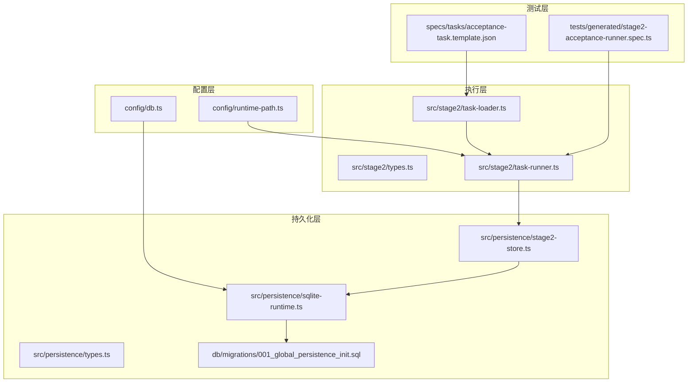
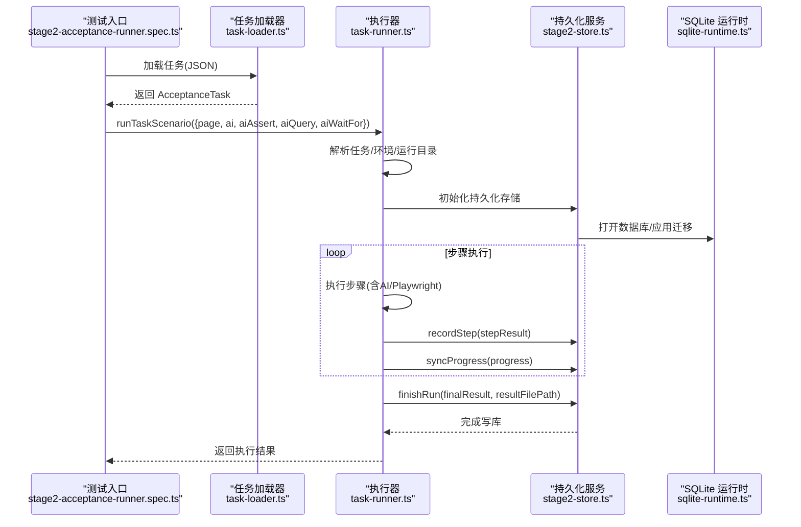
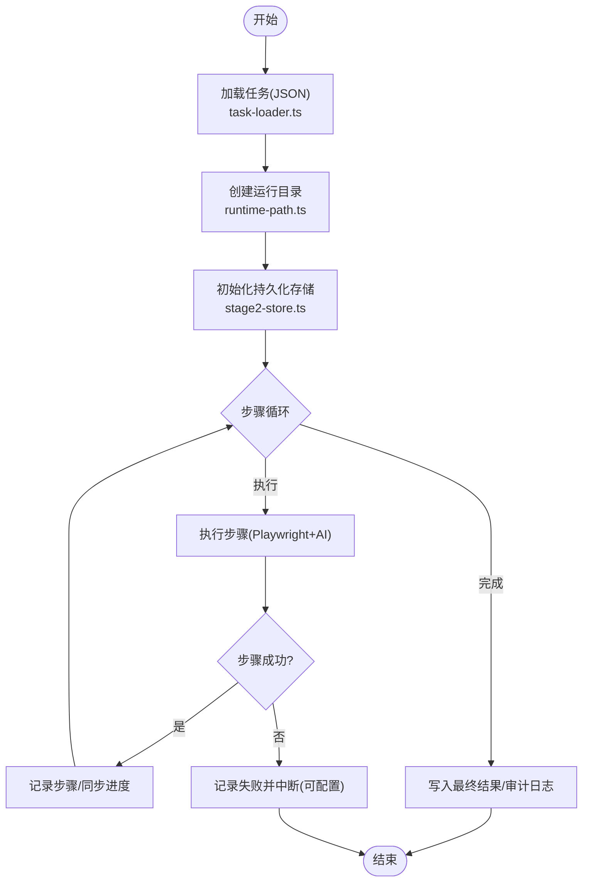
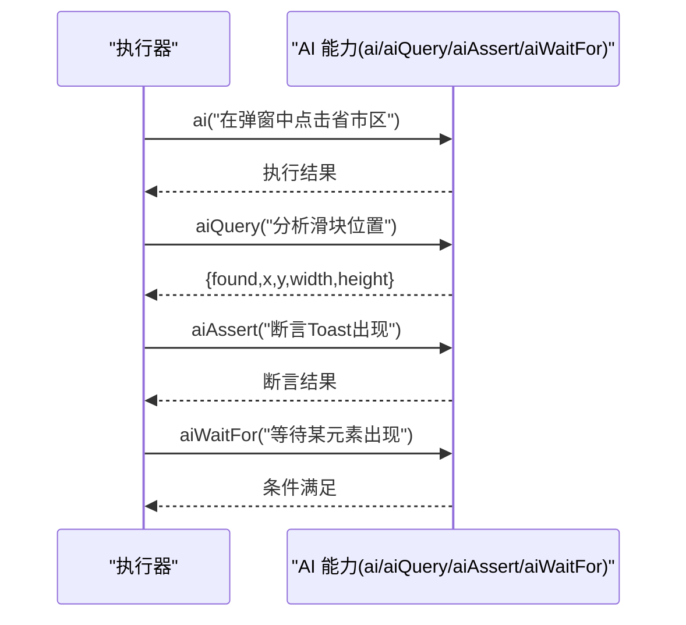
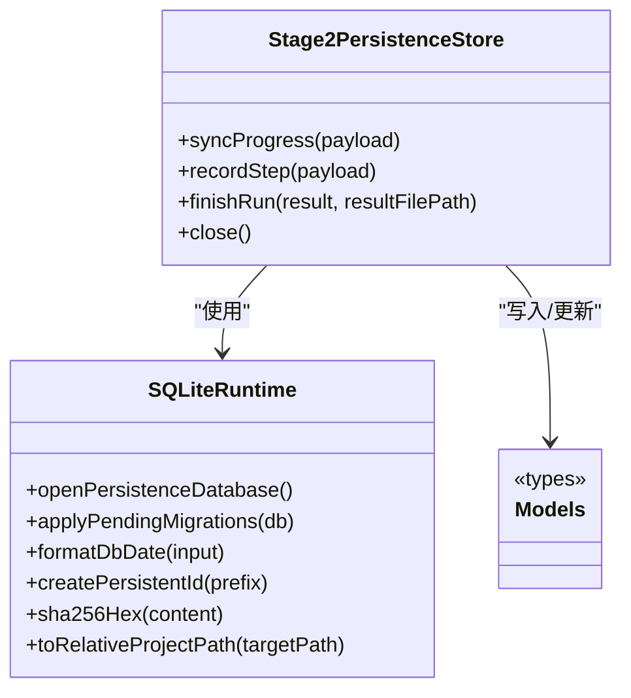
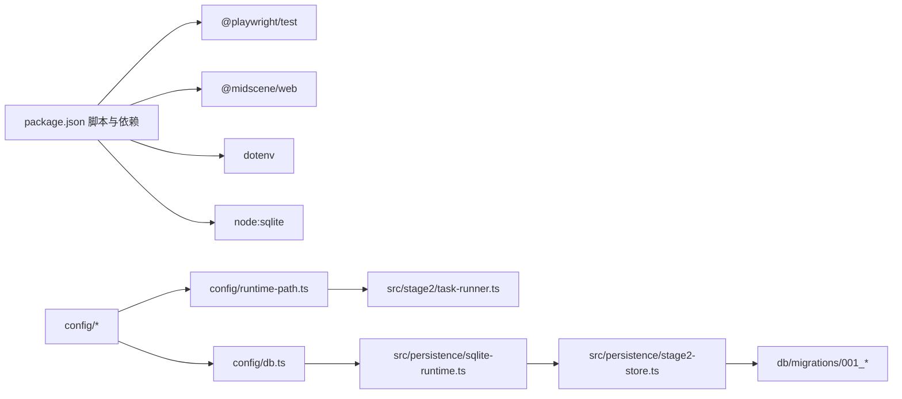

# API 参考

<cite>
**本文引用的文件**   
- [README.md](file://README.md)
- [package.json](file://package.json)
- [AGENTS.md](file://AGENTS.md)
- [src/persistence/types.ts](file://src/persistence/types.ts)
- [src/persistence/sqlite-runtime.ts](file://src/persistence/sqlite-runtime.ts)
- [src/persistence/stage2-store.ts](file://src/persistence/stage2-store.ts)
- [src/stage2/types.ts](file://src/stage2/types.ts)
- [src/stage2/task-runner.ts](file://src/stage2/task-runner.ts)
- [src/stage2/task-loader.ts](file://src/stage2/task-loader.ts)
- [config/db.ts](file://config/db.ts)
- [config/runtime-path.ts](file://config/runtime-path.ts)
- [db/migrations/001_global_persistence_init.sql](file://db/migrations/001_global_persistence_init.sql)
- [tests/generated/stage2-acceptance-runner.spec.ts](file://tests/generated/stage2-acceptance-runner.spec.ts)
- [specs/tasks/acceptance-task.template.json](file://specs/tasks/acceptance-task.template.json)
</cite>

## 目录
1. [简介](#简介)
2. [项目结构](#项目结构)
3. [核心组件](#核心组件)
4. [架构总览](#架构总览)
5. [详细组件分析](#详细组件分析)
6. [依赖关系分析](#依赖关系分析)
7. [性能考虑](#性能考虑)
8. [故障排查指南](#故障排查指南)
9. [结论](#结论)
10. [附录](#附录)

## 简介
本文件为 HI-TEST 项目的完整 API 参考，聚焦三类公开 API：
- 任务执行 API：以 JSON 任务驱动的第二阶段执行器接口，负责加载任务、执行步骤、处理验证码、持久化运行结果。
- AI 能力 API：基于 Midscene 的 AI 能力封装（ai、aiQuery、aiAssert、aiWaitFor），用于页面交互、结构化提取与断言。
- 持久化 API：SQLite 数据库存储与迁移接口，负责将任务、运行、步骤、快照、附件与审计日志落库。

文档提供参数说明、返回值定义、调用约定、错误处理、版本兼容与迁移、性能特性与使用限制、测试与调试方法，并给出可溯源的文件路径与行号，便于开发者快速定位与扩展。

## 项目结构
项目采用分层组织：
- 配置层：环境变量解析与运行产物路径管理
- 执行层：任务加载、执行器与 AI 能力集成
- 持久化层：SQLite 数据模型、迁移与写库服务
- 测试层：Playwright + Midscene 的验收执行入口

**图表来源**
- [config/db.ts:1-28](file://config/db.ts#L1-L28)
- [config/runtime-path.ts:1-41](file://config/runtime-path.ts#L1-L41)
- [src/stage2/types.ts:1-180](file://src/stage2/types.ts#L1-L180)
- [src/stage2/task-loader.ts:1-91](file://src/stage2/task-loader.ts#L1-L91)
- [src/stage2/task-runner.ts:1-800](file://src/stage2/task-runner.ts#L1-L800)
- [src/persistence/types.ts:1-125](file://src/persistence/types.ts#L1-L125)
- [src/persistence/sqlite-runtime.ts:1-116](file://src/persistence/sqlite-runtime.ts#L1-L116)
- [src/persistence/stage2-store.ts:1-655](file://src/persistence/stage2-store.ts#L1-L655)
- [db/migrations/001_global_persistence_init.sql:1-128](file://db/migrations/001_global_persistence_init.sql#L1-L128)
- [tests/generated/stage2-acceptance-runner.spec.ts:1-39](file://tests/generated/stage2-acceptance-runner.spec.ts#L1-L39)
- [specs/tasks/acceptance-task.template.json:1-141](file://specs/tasks/acceptance-task.template.json#L1-L141)

**章节来源**
- [README.md:10-223](file://README.md#L10-L223)
- [package.json:1-26](file://package.json#L1-L26)

## 核心组件
- 任务执行器（Stage2Runner）
  - 负责加载任务、执行步骤、处理验证码、截图与报告、写入持久化
  - 对外暴露 runTaskScenario 方法，接收 page 与 AI 能力对象
- AI 能力封装（Midscene）
  - ai：描述步骤并执行交互
  - aiQuery：从页面提取结构化数据
  - aiAssert：执行 AI 断言
  - aiWaitFor：等待特定条件满足
- 持久化服务（Stage2PersistenceStore）
  - 写入任务、任务版本、运行、步骤、快照、附件与审计日志
  - 提供进度同步、步骤记录、最终结果落库与关闭连接

**章节来源**
- [src/stage2/task-runner.ts:1-800](file://src/stage2/task-runner.ts#L1-L800)
- [src/stage2/types.ts:141-180](file://src/stage2/types.ts#L141-L180)
- [src/persistence/stage2-store.ts:69-655](file://src/persistence/stage2-store.ts#L69-L655)
- [README.md:132-153](file://README.md#L132-L153)

## 架构总览
整体调用链路如下：

**图表来源**
- [tests/generated/stage2-acceptance-runner.spec.ts:12-37](file://tests/generated/stage2-acceptance-runner.spec.ts#L12-L37)
- [src/stage2/task-loader.ts:79-89](file://src/stage2/task-loader.ts#L79-L89)
- [src/stage2/task-runner.ts:18-25](file://src/stage2/task-runner.ts#L18-L25)
- [src/persistence/stage2-store.ts:101-123](file://src/persistence/stage2-store.ts#L101-L123)
- [src/persistence/sqlite-runtime.ts:73-84](file://src/persistence/sqlite-runtime.ts#L73-L84)

## 详细组件分析

### 任务执行 API（Stage2Runner）
- 入口方法
  - runTaskScenario(options)
    - 参数
      - page: Playwright Page 实例
      - ai, aiAssert, aiQuery, aiWaitFor: Midscene AI 能力对象
    - 返回
      - Stage2ExecutionResult：包含任务标识、时间戳、状态、步骤数组、解析值与查询快照等
    - 调用约定
      - 通过环境变量控制验证码模式与等待超时
      - 自动生成运行目录与截图目录，按需写入结果与附件
- 关键流程
  - 任务加载与模板解析
  - 运行目录创建与产物路径解析
  - 步骤循环执行与失败处理
  - 验证码检测与自动/人工/失败/忽略策略
  - 持久化进度与最终结果

**图表来源**
- [src/stage2/task-loader.ts:79-89](file://src/stage2/task-loader.ts#L79-L89)
- [config/runtime-path.ts:38-40](file://config/runtime-path.ts#L38-L40)
- [src/persistence/stage2-store.ts:495-630](file://src/persistence/stage2-store.ts#L495-L630)
- [src/stage2/task-runner.ts:650-706](file://src/stage2/task-runner.ts#L650-L706)

**章节来源**
- [src/stage2/task-runner.ts:18-25](file://src/stage2/task-runner.ts#L18-L25)
- [src/stage2/task-runner.ts:650-706](file://src/stage2/task-runner.ts#L650-L706)
- [src/stage2/task-runner.ts:483-501](file://src/stage2/task-runner.ts#L483-L501)
- [src/stage2/task-runner.ts:561-648](file://src/stage2/task-runner.ts#L561-L648)
- [tests/generated/stage2-acceptance-runner.spec.ts:12-37](file://tests/generated/stage2-acceptance-runner.spec.ts#L12-L37)

### AI 能力 API（Midscene）
- ai
  - 作用：描述步骤并执行交互（如点击、填写、打开级联面板等）
  - 使用场景：当选择器不可靠或需要自然语言指令时兜底
- aiQuery
  - 作用：从页面提取结构化数据（如滑块位置、滑槽宽度）
  - 返回：结构化对象，供自动验证码处理与断言
- aiAssert
  - 作用：执行 AI 断言（建议优先使用 Playwright 硬检测）
- aiWaitFor
  - 作用：等待特定条件满足（仅在 Playwright 常规等待不适用时使用）

**图表来源**
- [src/stage2/task-runner.ts:514-559](file://src/stage2/task-runner.ts#L514-L559)
- [src/stage2/task-runner.ts:721-724](file://src/stage2/task-runner.ts#L721-L724)
- [README.md:139-144](file://README.md#L139-L144)

**章节来源**
- [src/stage2/task-runner.ts:514-559](file://src/stage2/task-runner.ts#L514-L559)
- [src/stage2/task-runner.ts:721-724](file://src/stage2/task-runner.ts#L721-L724)
- [README.md:139-144](file://README.md#L139-L144)

### 持久化 API（SQLite）
- 数据模型（表）
  - ai_task：任务主记录
  - ai_task_version：任务版本与 JSON 内容
  - ai_run：阶段运行主记录
  - ai_run_step：步骤明细
  - ai_snapshot：结构化快照（JSON 字符串）
  - ai_artifact：附件元数据（截图、报告、结果文件路径）
  - ai_audit_log：关键审计日志
- 写库服务
  - Stage2PersistenceStore：封装任务、版本、运行、步骤、快照、附件与审计日志的写入与更新
  - 提供进度同步、步骤记录、最终结果落库与关闭连接
- 运行时与迁移
  - sqlite-runtime.ts：打开数据库、应用迁移、生成相对路径、格式化日期、ID 生成、哈希计算
  - migrations：初始化表结构与索引

**图表来源**
- [src/persistence/stage2-store.ts:69-655](file://src/persistence/stage2-store.ts#L69-L655)
- [src/persistence/sqlite-runtime.ts:73-116](file://src/persistence/sqlite-runtime.ts#L73-L116)
- [src/persistence/types.ts:34-123](file://src/persistence/types.ts#L34-L123)

**章节来源**
- [src/persistence/stage2-store.ts:69-655](file://src/persistence/stage2-store.ts#L69-L655)
- [src/persistence/sqlite-runtime.ts:73-116](file://src/persistence/sqlite-runtime.ts#L73-L116)
- [src/persistence/types.ts:34-123](file://src/persistence/types.ts#L34-L123)
- [db/migrations/001_global_persistence_init.sql:1-128](file://db/migrations/001_global_persistence_init.sql#L1-L128)

## 依赖关系分析
- 外部依赖
  - Playwright：UI 自动化与页面交互
  - Midscene：AI 能力（ai、aiQuery、aiAssert、aiWaitFor）
  - dotenv：环境变量解析
  - node:sqlite：SQLite 数据库（实验特性）
- 内部依赖
  - 配置模块解析运行目录与数据库路径
  - 执行器依赖任务类型定义与运行时路径
  - 持久化服务依赖数据库运行时与迁移脚本

**图表来源**
- [package.json:6-24](file://package.json#L6-L24)
- [config/runtime-path.ts:1-41](file://config/runtime-path.ts#L1-L41)
- [config/db.ts:1-28](file://config/db.ts#L1-L28)
- [src/persistence/sqlite-runtime.ts:1-116](file://src/persistence/sqlite-runtime.ts#L1-L116)
- [src/persistence/stage2-store.ts:1-13](file://src/persistence/stage2-store.ts#L1-L13)
- [db/migrations/001_global_persistence_init.sql:1-128](file://db/migrations/001_global_persistence_init.sql#L1-L128)

**章节来源**
- [package.json:6-24](file://package.json#L6-L24)
- [README.md:5-9](file://README.md#L5-L9)

## 性能考虑
- 运行时超时与重试
  - 支持步骤超时、页面超时、断言重试次数与超时时间配置
  - 建议在高复杂度页面适当增加超时，避免误判
- 截图与报告
  - 可按步骤截图，建议在失败时开启，避免过多截图影响性能
  - 报告与中间产物统一收敛至运行目录，便于清理与归档
- 数据库写入
  - 写库采用事务性迁移与按需写入，避免频繁 IO
  - 附件仅记录路径与元数据，不存储大文件二进制
- AI 查询
  - aiQuery 与 aiAssert 为外部调用，建议在必要时使用，优先采用 Playwright 硬检测

**章节来源**
- [src/stage2/types.ts:128-133](file://src/stage2/types.ts#L128-L133)
- [src/stage2/types.ts:67-88](file://src/stage2/types.ts#L67-L88)
- [README.md:76-96](file://README.md#L76-L96)
- [README.md:111-118](file://README.md#L111-L118)

## 故障排查指南
- 验证码处理
  - 模式说明：auto（自动）、manual（人工）、fail（失败）、ignore（忽略）
  - 超时控制：STAGE2_CAPTCHA_WAIT_TIMEOUT_MS
  - 自动模式失败：检查滑块检测选择器与页面截图，必要时切换为 manual
- 断言与选择器
  - 优先使用 Playwright 硬检测，AI 断言仅作兜底
  - 表格断言支持 exact/contains 匹配，建议在清理后强制校验
- 数据库与迁移
  - 确保已执行 db:init/db:migrate
  - 检查 DB_DRIVER 与 DB_FILE_PATH 配置
- 日志与产物
  - 查看 t_runtime/ 下的 Playwright 报告、Midscene 报告与 acceptance-results
  - 失败时关注截图与最终 result.json

**章节来源**
- [README.md:56-75](file://README.md#L56-L75)
- [README.md:146-152](file://README.md#L146-L152)
- [README.md:120-130](file://README.md#L120-L130)
- [config/db.ts:20-26](file://config/db.ts#L20-L26)
- [src/stage2/task-runner.ts:650-706](file://src/stage2/task-runner.ts#L650-L706)

## 结论
本 API 参考围绕任务执行、AI 能力与持久化三大领域，提供了清晰的接口规范、调用约定与错误处理机制。通过环境变量与统一运行目录，项目实现了良好的可配置性与可维护性。建议在生产环境中结合硬检测与 AI 断言的组合策略，合理配置超时与重试，充分利用数据库持久化能力进行可观测性与审计。

## 附录

### API 规范总览
- 任务执行 API
  - 方法：runTaskScenario(options)
  - 输入：page, ai, aiAssert, aiQuery, aiWaitFor
  - 输出：Stage2ExecutionResult
  - 环境变量：STAGE2_CAPTCHA_MODE, STAGE2_CAPTCHA_WAIT_TIMEOUT_MS, STAGE2_TASK_FILE
- AI 能力 API
  - ai：执行交互
  - aiQuery：结构化提取
  - aiAssert：断言
  - aiWaitFor：等待条件
- 持久化 API
  - Stage2PersistenceStore：写入/更新任务、版本、运行、步骤、快照、附件与审计日志
  - sqlite-runtime：打开数据库、应用迁移、生成 ID、计算哈希、路径转换
  - 迁移脚本：初始化表结构与索引

**章节来源**
- [src/stage2/task-runner.ts:18-25](file://src/stage2/task-runner.ts#L18-L25)
- [src/stage2/types.ts:141-180](file://src/stage2/types.ts#L141-L180)
- [src/persistence/stage2-store.ts:69-655](file://src/persistence/stage2-store.ts#L69-L655)
- [src/persistence/sqlite-runtime.ts:73-116](file://src/persistence/sqlite-runtime.ts#L73-L116)
- [db/migrations/001_global_persistence_init.sql:1-128](file://db/migrations/001_global_persistence_init.sql#L1-L128)

### 版本兼容与迁移
- 数据库迁移
  - 通过 db:migrate 脚本应用迁移，自动记录迁移清单与校验和
  - 当前为 SQLite 单文件，表结构按 MySQL 兼容子集设计，未来可平滑迁移到 MySQL
- 任务 JSON
  - 支持模板变量与 NOW_YYYYMMDDHHMMSS 注入，便于动态化任务
- 命名与配置
  - 统一通过 .env 管理路径与开关，避免硬编码

**章节来源**
- [README.md:120-130](file://README.md#L120-L130)
- [src/stage2/task-loader.ts:19-48](file://src/stage2/task-loader.ts#L19-L48)
- [AGENTS.md:22-31](file://AGENTS.md#L22-L31)

### 使用示例与最佳实践
- 示例入口
  - tests/generated/stage2-acceptance-runner.spec.ts：第二段 JSON 任务执行入口
- 任务模板
  - specs/tasks/acceptance-task.template.json：包含目标、账户、表单、断言、清理与运行配置
- 最佳实践
  - 断言优先使用 Playwright 硬检测，AI 断言作为兜底
  - 表格断言建议使用 table-row-exists 作为硬门槛，少量关键列使用 table-cell-equals/contains 并 soft=true
  - 清理策略建议删除本次新增数据，并在删除后强制校验目标行消失

**章节来源**
- [tests/generated/stage2-acceptance-runner.spec.ts:12-37](file://tests/generated/stage2-acceptance-runner.spec.ts#L12-L37)
- [specs/tasks/acceptance-task.template.json:1-141](file://specs/tasks/acceptance-task.template.json#L1-L141)
- [README.md:146-152](file://README.md#L146-L152)

### 测试与调试
- 运行测试
  - npm run stage2:run 或 npm run stage2:run:headed
- 调试技巧
  - 启用 --headed 查看浏览器界面
  - 在失败步骤截图中定位问题
  - 检查 t_runtime/ 下的报告与日志
  - 验证码失败时切换为 manual 模式或增大等待超时

**章节来源**
- [package.json:9-10](file://package.json#L9-L10)
- [README.md:154-164](file://README.md#L154-L164)