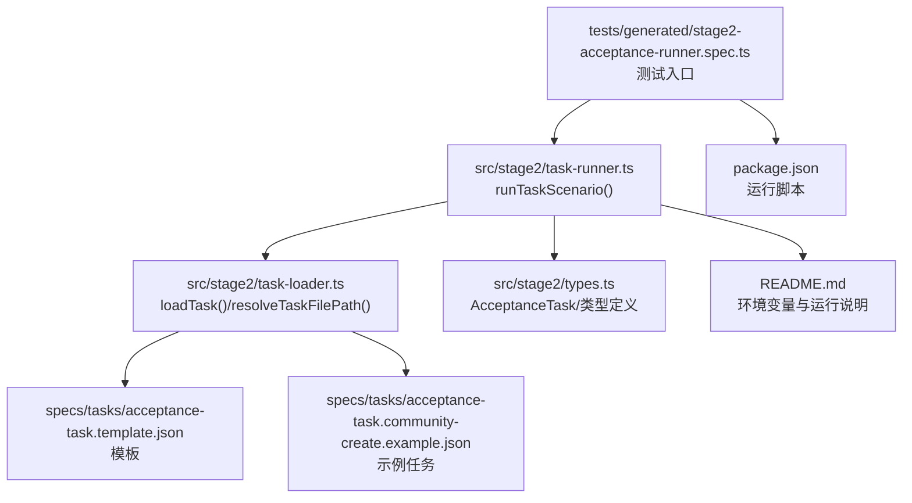
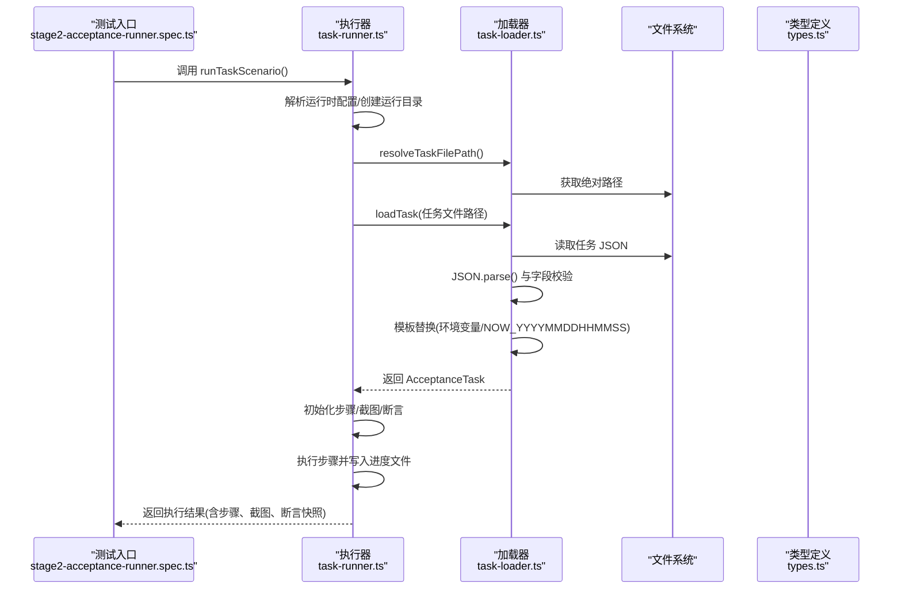
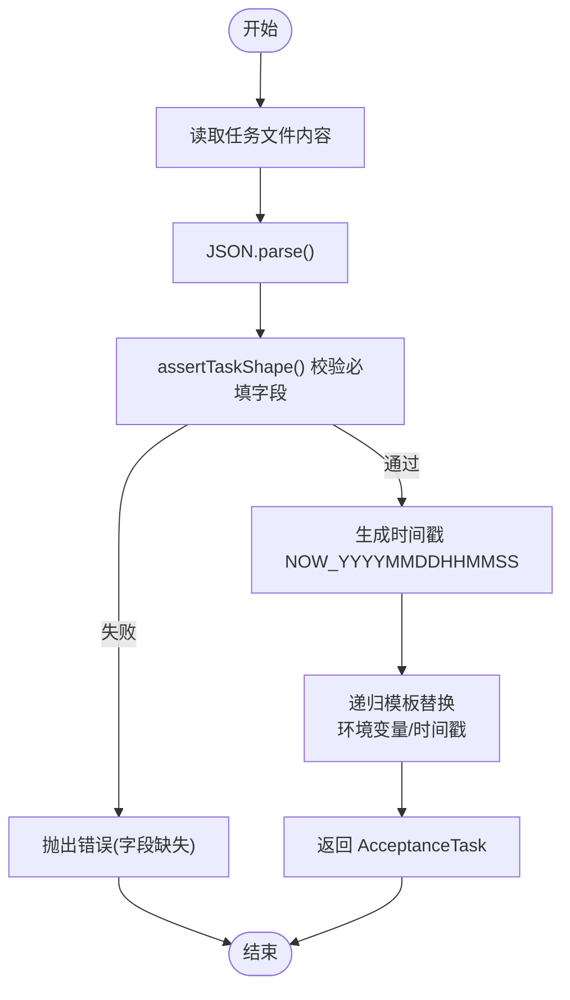
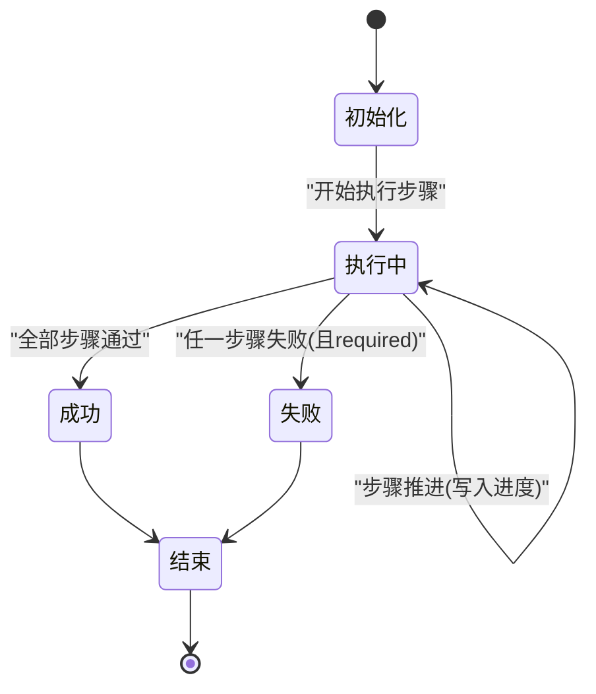
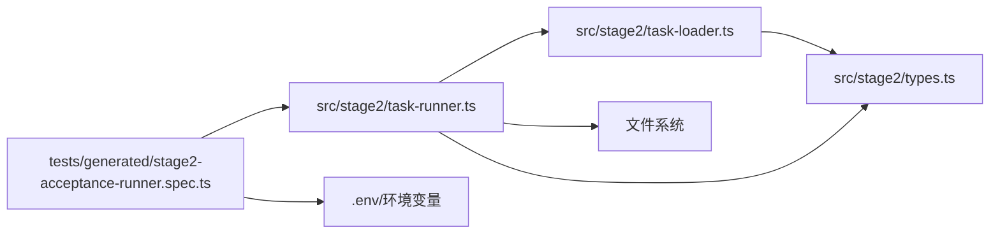

# 任务 API

<cite>
**本文引用的文件**
- [src/stage2/task-loader.ts](file://src/stage2/task-loader.ts)
- [src/stage2/task-runner.ts](file://src/stage2/task-runner.ts)
- [src/stage2/types.ts](file://src/stage2/types.ts)
- [specs/tasks/acceptance-task.template.json](file://specs/tasks/acceptance-task.template.json)
- [specs/tasks/acceptance-task.community-create.example.json](file://specs/tasks/acceptance-task.community-create.example.json)
- [tests/generated/stage2-acceptance-runner.spec.ts](file://tests/generated/stage2-acceptance-runner.spec.ts)
- [README.md](file://README.md)
- [package.json](file://package.json)
</cite>

## 目录
1. [简介](#简介)
2. [项目结构](#项目结构)
3. [核心组件](#核心组件)
4. [架构总览](#架构总览)
5. [详细组件分析](#详细组件分析)
6. [依赖关系分析](#依赖关系分析)
7. [性能考量](#性能考量)
8. [故障排查指南](#故障排查指南)
9. [结论](#结论)
10. [附录](#附录)

## 简介
本文件面向 HI-TEST 项目的任务 API，聚焦“任务加载与解析”的接口与类型定义，围绕以下目标展开：
- 详细说明 loadTask() 的使用方法、参数与返回值
- 解释 AcceptanceTask 类型定义及各字段作用与约束
- 给出任务 JSON 结构示例与解析流程
- 说明任务模板的使用、环境变量替换与动态值注入机制
- 记录任务验证规则与错误处理策略
- 展示如何正确加载与使用任务文件
- 解释任务生命周期管理与状态跟踪机制

## 项目结构
与任务 API 相关的关键文件与职责如下：
- 任务加载与解析：src/stage2/task-loader.ts
- 任务执行与生命周期：src/stage2/task-runner.ts
- 任务类型定义：src/stage2/types.ts
- 示例任务模板与示例任务：specs/tasks/acceptance-task.template.json、specs/tasks/acceptance-task.community-create.example.json
- 测试入口与运行脚本：tests/generated/stage2-acceptance-runner.spec.ts、package.json
- 项目说明与环境变量：README.md

图表来源
- [tests/generated/stage2-acceptance-runner.spec.ts](file://tests/generated/stage2-acceptance-runner.spec.ts#L1-L39)
- [src/stage2/task-runner.ts](file://src/stage2/task-runner.ts#L1061-L1344)
- [src/stage2/task-loader.ts](file://src/stage2/task-loader.ts#L71-L89)
- [specs/tasks/acceptance-task.template.json](file://specs/tasks/acceptance-task.template.json#L1-L85)
- [specs/tasks/acceptance-task.community-create.example.json](file://specs/tasks/acceptance-task.community-create.example.json#L1-L184)
- [src/stage2/types.ts](file://src/stage2/types.ts#L86-L98)
- [package.json](file://package.json#L6-L9)
- [README.md](file://README.md#L39-L52)

章节来源
- [README.md](file://README.md#L1-L144)
- [package.json](file://package.json#L1-L24)

## 核心组件
- 任务加载器：负责解析任务文件、进行必要校验、执行模板替换与动态值注入，并输出强类型的 AcceptanceTask 对象。
- 任务执行器：负责任务生命周期管理、步骤执行、状态跟踪、截图与结果持久化。
- 类型定义：定义 AcceptanceTask 及其子结构，确保任务配置的结构化与可验证性。

章节来源
- [src/stage2/task-loader.ts](file://src/stage2/task-loader.ts#L71-L89)
- [src/stage2/task-runner.ts](file://src/stage2/task-runner.ts#L1061-L1344)
- [src/stage2/types.ts](file://src/stage2/types.ts#L86-L98)

## 架构总览
任务 API 的调用链路如下：
- 测试入口通过 runTaskScenario() 启动任务执行
- runTaskScenario() 调用 resolveTaskFilePath() 解析任务文件路径
- loadTask() 读取并解析任务 JSON，进行字段校验与模板替换
- 执行器根据 AcceptanceTask 的结构驱动 Playwright 与 Midscene 完成自动化流程
- 生命周期内持续写入进度文件与最终结果文件

图表来源
- [tests/generated/stage2-acceptance-runner.spec.ts](file://tests/generated/stage2-acceptance-runner.spec.ts#L12-L37)
- [src/stage2/task-runner.ts](file://src/stage2/task-runner.ts#L1061-L1155)
- [src/stage2/task-loader.ts](file://src/stage2/task-loader.ts#L71-L89)
- [src/stage2/types.ts](file://src/stage2/types.ts#L86-L98)

## 详细组件分析

### 任务加载与解析 API：loadTask()
- 功能概述
  - 读取指定的任务文件，解析为 JSON 并转换为强类型 AcceptanceTask
  - 在解析前进行必要的字段完整性校验
  - 执行模板替换：支持环境变量与动态时间戳占位符
- 关键函数
  - resolveTaskFilePath(rawTaskFilePath?: string): string
    - 解析任务文件路径，优先使用传入参数，其次使用环境变量 STAGE2_TASK_FILE，最后回退到默认示例任务文件
    - 若为相对路径则解析为绝对路径
  - loadTask(taskFilePath: string): AcceptanceTask
    - 校验文件存在性
    - 读取并解析 JSON
    - 使用 assertTaskShape() 校验必需字段
    - 生成当前时间戳并执行 resolveTemplates() 完成模板替换
    - 返回强类型 AcceptanceTask
- 参数与返回
  - 参数：任务文件绝对路径或相对路径
  - 返回：AcceptanceTask 强类型对象
- 错误处理
  - 文件不存在：抛出错误
  - 字段缺失：抛出错误，包含具体缺失字段与文件路径
  - 模板替换：环境变量缺失时以空字符串替代
- 使用示例（路径）
  - 在测试入口中通过 runTaskScenario() 间接调用 loadTask()
  - 参考：tests/generated/stage2-acceptance-runner.spec.ts
  - 参考：src/stage2/task-runner.ts 中的 runTaskScenario()

章节来源
- [src/stage2/task-loader.ts](file://src/stage2/task-loader.ts#L71-L89)
- [src/stage2/task-runner.ts](file://src/stage2/task-runner.ts#L1061-L1067)
- [tests/generated/stage2-acceptance-runner.spec.ts](file://tests/generated/stage2-acceptance-runner.spec.ts#L12-L25)

### AcceptanceTask 类型定义与字段说明
- 类型定义位置：src/stage2/types.ts
- 核心结构
  - taskId: string（唯一标识）
  - taskName: string（任务名称）
  - target: TaskTarget（目标站点与浏览器配置）
  - account: TaskAccount（账号与登录提示）
  - navigation?: TaskNavigation（导航与菜单路径）
  - form: TaskForm（弹窗表单与字段）
  - search?: TaskSearch（搜索与列表断言）
  - assertions?: TaskAssertion[]（断言集合）
  - cleanup?: TaskCleanup（清理策略）
  - runtime?: TaskRuntime（执行超时、截图、追踪等）
  - approval?: TaskApproval（审批状态）
- 字段约束与用途
  - 必填字段：taskId、taskName、target.url、account.username、account.password、form.openButtonText、form.submitButtonText、form.fields（且非空）
  - 可选字段：navigation、search、assertions、cleanup、runtime、approval
  - 业务含义：用于驱动自动化流程，从登录、菜单导航、表单填写、提交、断言到结果落盘
- 相关类型
  - TaskTarget、TaskAccount、TaskNavigation、TaskField、TaskForm、TaskSearch、TaskAssertion、TaskCleanup、TaskRuntime、TaskApproval
  - 步骤与结果：StepResult、Stage2ExecutionResult

章节来源
- [src/stage2/types.ts](file://src/stage2/types.ts#L86-L98)
- [src/stage2/types.ts](file://src/stage2/types.ts#L5-L78)

### 任务 JSON 结构示例与解析流程
- 示例文件
  - 模板：specs/tasks/acceptance-task.template.json
  - 示例任务：specs/tasks/acceptance-task.community-create.example.json
- 解析流程
  - 读取 JSON 文本
  - JSON.parse() 得到对象
  - assertTaskShape() 校验必需字段
  - 生成时间戳 NOW_YYYYMMDDHHMMSS
  - 递归遍历对象，对字符串执行模板替换：
    - ${ENV_VAR} 替换为 process.env[ENV_VAR]，缺失时为空字符串
    - ${NOW_YYYYMMDDHHMMSS} 替换为当前时间戳
  - 返回强类型 AcceptanceTask

图表来源
- [src/stage2/task-loader.ts](file://src/stage2/task-loader.ts#L79-L89)
- [src/stage2/task-loader.ts](file://src/stage2/task-loader.ts#L19-L48)

章节来源
- [specs/tasks/acceptance-task.template.json](file://specs/tasks/acceptance-task.template.json#L1-L85)
- [specs/tasks/acceptance-task.community-create.example.json](file://specs/tasks/acceptance-task.community-create.example.json#L1-L184)
- [src/stage2/task-loader.ts](file://src/stage2/task-loader.ts#L79-L89)

### 任务模板与动态值注入
- 模板语法
  - 环境变量：${ENV_VAR}
  - 动态时间戳：${NOW_YYYYMMDDHHMMSS}
- 注入机制
  - resolveTemplates() 递归遍历对象，对字符串执行替换
  - 环境变量缺失时以空字符串替代
  - 时间戳每调用一次生成一次
- 实际应用
  - 示例任务中使用 ${NOW_YYYYMMDDHHMMSS} 为字段值注入唯一后缀，避免重复数据
  - 示例模板中使用 ${TEST_USERNAME}/${TEST_PASSWORD} 作为账号占位符

章节来源
- [src/stage2/task-loader.ts](file://src/stage2/task-loader.ts#L19-L48)
- [specs/tasks/acceptance-task.community-create.example.json](file://specs/tasks/acceptance-task.community-create.example.json#L45-L51)
- [specs/tasks/acceptance-task.template.json](file://specs/tasks/acceptance-task.template.json#L10-L11)

### 任务验证规则与错误处理策略
- 校验规则（assertTaskShape）
  - 缺少 taskId、taskName、target.url、account.username、account.password、form.openButtonText、form.submitButtonText、form.fields（且非空）时抛错
- 错误处理
  - 文件不存在：抛错
  - 字段缺失：抛错（包含文件路径）
  - 步骤异常：记录步骤状态、截图路径、消息与堆栈，必要时中断流程
- 运行前置校验
  - 若设置 STAGE2_REQUIRE_APPROVAL=true，则任务必须有 approval.approved=true，否则抛错

章节来源
- [src/stage2/task-loader.ts](file://src/stage2/task-loader.ts#L50-L69)
- [src/stage2/task-runner.ts](file://src/stage2/task-runner.ts#L1068-L1073)

### 任务生命周期管理与状态跟踪
- 生命周期阶段
  - 初始化：解析任务文件、创建运行目录、初始化步骤数组与查询快照
  - 执行：逐步骤执行，记录每个步骤的开始/结束时间、耗时、状态、截图路径与错误信息
  - 结束：汇总结果，写入最终 result.json 与进度 partial.json
- 状态与结果
  - 步骤状态：passed、failed、skipped
  - 任务状态：passed、failed
  - 结果对象：包含 taskId、taskName、startedAt、endedAt、durationMs、status、taskFilePath、runDir、resolvedValues、querySnapshots、steps
- 截图与追踪
  - 可配置每步截图与页面追踪
  - 失败时自动截图并记录失败详情

图表来源
- [src/stage2/task-runner.ts](file://src/stage2/task-runner.ts#L1086-L1155)
- [src/stage2/task-runner.ts](file://src/stage2/task-runner.ts#L1325-L1342)

章节来源
- [src/stage2/task-runner.ts](file://src/stage2/task-runner.ts#L1061-L1155)
- [src/stage2/task-runner.ts](file://src/stage2/task-runner.ts#L1157-L1342)

### API 使用示例（路径）
- 在测试入口中调用 runTaskScenario()，内部会解析任务文件并执行
  - 参考：tests/generated/stage2-acceptance-runner.spec.ts
- 通过环境变量控制任务文件与行为
  - STAGE2_TASK_FILE：任务文件路径
  - STAGE2_REQUIRE_APPROVAL：是否要求审批
  - STAGE2_CAPTCHA_MODE：验证码处理模式
  - STAGE2_CAPTCHA_WAIT_TIMEOUT_MS：人工处理等待时长
  - 参考：README.md 中的环境变量说明

章节来源
- [tests/generated/stage2-acceptance-runner.spec.ts](file://tests/generated/stage2-acceptance-runner.spec.ts#L12-L37)
- [README.md](file://README.md#L39-L52)

## 依赖关系分析
- 组件耦合
  - 测试入口依赖执行器
  - 执行器依赖加载器与类型定义
  - 加载器依赖文件系统与类型定义
- 外部依赖
  - Playwright 与 Midscene（通过夹具注入）
  - dotenv（读取 .env）

图表来源
- [tests/generated/stage2-acceptance-runner.spec.ts](file://tests/generated/stage2-acceptance-runner.spec.ts#L1-L39)
- [src/stage2/task-runner.ts](file://src/stage2/task-runner.ts#L1-L13)
- [src/stage2/task-loader.ts](file://src/stage2/task-loader.ts#L1-L3)
- [src/stage2/types.ts](file://src/stage2/types.ts#L1-L125)

章节来源
- [tests/generated/stage2-acceptance-runner.spec.ts](file://tests/generated/stage2-acceptance-runner.spec.ts#L1-L39)
- [src/stage2/task-runner.ts](file://src/stage2/task-runner.ts#L1-L13)
- [src/stage2/task-loader.ts](file://src/stage2/task-loader.ts#L1-L3)
- [src/stage2/types.ts](file://src/stage2/types.ts#L1-L125)

## 性能考量
- 模板替换为一次性遍历，复杂度与 JSON 结构大小线性相关
- 步骤截图与页面追踪可按需开启，避免不必要的 IO
- 页面超时与步骤超时可通过 runtime 配置调整
- 建议在 CI 中合理设置 CAPTCHA 等待时长，避免长时间阻塞

## 故障排查指南
- 任务文件不存在
  - 现象：抛出“任务文件不存在”错误
  - 处理：确认 STAGE2_TASK_FILE 或传入路径有效
- 字段缺失导致校验失败
  - 现象：抛出“缺少字段”错误，包含文件路径
  - 处理：补齐模板中的必填字段
- 环境变量未设置
  - 现象：模板中 ${ENV_VAR} 为空
  - 处理：在 .env 中设置对应变量
- 验证码处理模式
  - 现象：登录后出现滑块验证码
  - 处理：根据 STAGE2_CAPTCHA_MODE 设置选择自动/手动/失败/忽略
- 执行失败定位
  - 现象：最终状态为 failed
  - 处理：查看 result.json 与 screenshots 目录，定位失败步骤与截图

章节来源
- [src/stage2/task-loader.ts](file://src/stage2/task-loader.ts#L80-L81)
- [src/stage2/task-loader.ts](file://src/stage2/task-loader.ts#L50-L69)
- [src/stage2/task-runner.ts](file://src/stage2/task-runner.ts#L1068-L1073)
- [README.md](file://README.md#L54-L72)

## 结论
本任务 API 通过强类型定义与严格的校验机制，确保任务配置的可维护性与可执行性；通过模板与动态值注入，提升任务的灵活性与复用性；通过生命周期管理与状态跟踪，提供清晰的执行过程与结果落盘。结合示例任务与模板，用户可以快速构建并运行验收任务。

## 附录
- 运行命令
  - npm run stage2:run 或 npm run stage2:run:headed
- 运行产物
  - Playwright 报告、Midscene 报告、第二段结果与步骤截图

章节来源
- [package.json](file://package.json#L6-L9)
- [README.md](file://README.md#L117-L131)