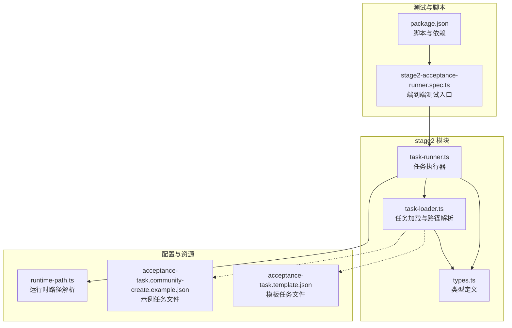
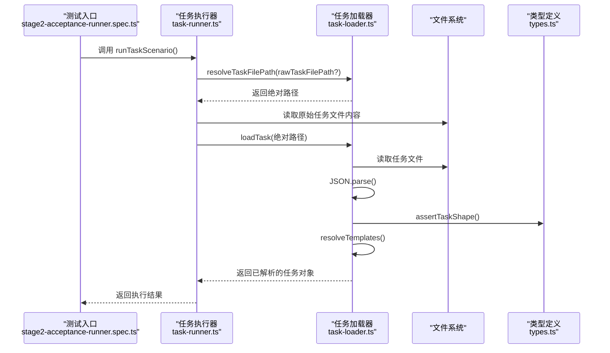
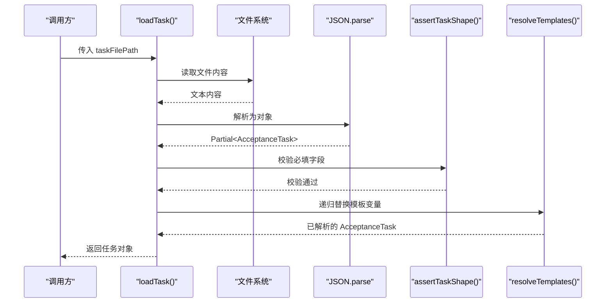
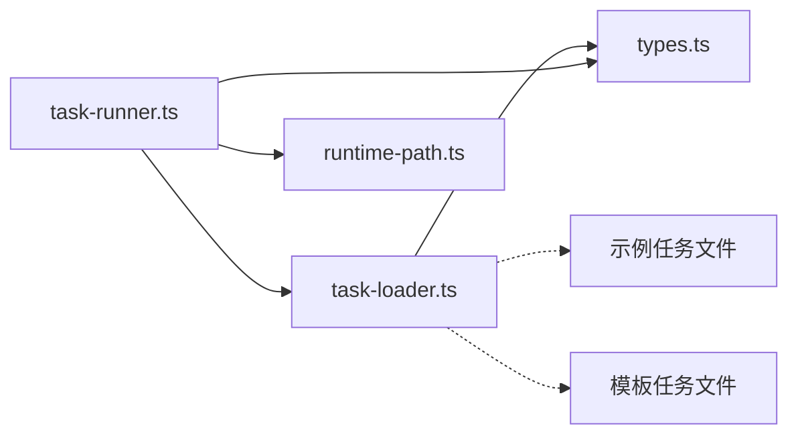

# 任务加载 API

<cite>
**本文引用的文件**
- [src/stage2/task-loader.ts](file://src/stage2/task-loader.ts)
- [src/stage2/types.ts](file://src/stage2/types.ts)
- [specs/tasks/acceptance-task.template.json](file://specs/tasks/acceptance-task.template.json)
- [specs/tasks/acceptance-task.community-create.example.json](file://specs/tasks/acceptance-task.community-create.example.json)
- [src/stage2/task-runner.ts](file://src/stage2/task-runner.ts)
- [config/runtime-path.ts](file://config/runtime-path.ts)
- [tests/generated/stage2-acceptance-runner.spec.ts](file://tests/generated/stage2-acceptance-runner.spec.ts)
- [package.json](file://package.json)
</cite>

## 目录
1. [简介](#简介)
2. [项目结构](#项目结构)
3. [核心组件](#核心组件)
4. [架构概览](#架构概览)
5. [详细组件分析](#详细组件分析)
6. [依赖关系分析](#依赖关系分析)
7. [性能特性与缓存策略](#性能特性与缓存策略)
8. [故障排查指南](#故障排查指南)
9. [结论](#结论)
10. [附录](#附录)

## 简介
本文件面向任务加载 API 的使用者与维护者，系统性地阐述以下内容：
- loadTask 与 resolveTaskFilePath 两个函数的完整接口规范（参数、返回值、调用约定）
- 任务文件的加载机制（JSON 解析、模板变量替换、字段校验）
- 路径解析策略与相对路径处理
- 错误处理与异常场景
- 性能特性与缓存策略
- 最佳实践与常见使用模式

## 项目结构
任务加载 API 位于 stage2 子模块中，配合类型定义、示例任务文件与运行器共同构成完整的任务执行链路。

图表来源
- [src/stage2/task-loader.ts:1-91](file://src/stage2/task-loader.ts#L1-L91)
- [src/stage2/task-runner.ts:1-80](file://src/stage2/task-runner.ts#L1-L80)
- [src/stage2/types.ts:141-154](file://src/stage2/types.ts#L141-L154)
- [config/runtime-path.ts:38-40](file://config/runtime-path.ts#L38-L40)
- [specs/tasks/acceptance-task.community-create.example.json:1-229](file://specs/tasks/acceptance-task.community-create.example.json#L1-L229)
- [specs/tasks/acceptance-task.template.json:1-141](file://specs/tasks/acceptance-task.template.json#L1-L141)
- [tests/generated/stage2-acceptance-runner.spec.ts:1-39](file://tests/generated/stage2-acceptance-runner.spec.ts#L1-L39)
- [package.json:6-11](file://package.json#L6-L11)

章节来源
- [src/stage2/task-loader.ts:1-91](file://src/stage2/task-loader.ts#L1-L91)
- [src/stage2/task-runner.ts:1-80](file://src/stage2/task-runner.ts#L1-L80)
- [src/stage2/types.ts:141-154](file://src/stage2/types.ts#L141-L154)
- [config/runtime-path.ts:38-40](file://config/runtime-path.ts#L38-L40)
- [specs/tasks/acceptance-task.community-create.example.json:1-229](file://specs/tasks/acceptance-task.community-create.example.json#L1-L229)
- [specs/tasks/acceptance-task.template.json:1-141](file://specs/tasks/acceptance-task.template.json#L1-L141)
- [tests/generated/stage2-acceptance-runner.spec.ts:1-39](file://tests/generated/stage2-acceptance-runner.spec.ts#L1-L39)
- [package.json:6-11](file://package.json#L6-L11)

## 核心组件
- 任务加载器（task-loader）
  - 提供路径解析与任务加载能力，负责从磁盘读取 JSON 任务文件、进行模板变量替换与字段校验。
- 类型定义（types）
  - 定义 AcceptanceTask 及其子结构（TaskTarget、TaskAccount、TaskForm、TaskField 等），作为任务文件的契约。
- 示例与模板任务文件
  - 提供可直接使用的示例任务文件与模板，便于快速生成新任务。
- 任务执行器（task-runner）
  - 在运行阶段调用任务加载器，完成任务加载与后续执行流程。
- 运行时路径解析（runtime-path）
  - 提供运行时输出目录的解析与拼接能力，间接影响任务执行产物的落盘位置。

章节来源
- [src/stage2/task-loader.ts:71-89](file://src/stage2/task-loader.ts#L71-L89)
- [src/stage2/types.ts:141-154](file://src/stage2/types.ts#L141-L154)
- [specs/tasks/acceptance-task.community-create.example.json:1-229](file://specs/tasks/acceptance-task.community-create.example.json#L1-L229)
- [specs/tasks/acceptance-task.template.json:1-141](file://specs/tasks/acceptance-task.template.json#L1-L141)
- [src/stage2/task-runner.ts:2318-2324](file://src/stage2/task-runner.ts#L2318-L2324)
- [config/runtime-path.ts:38-40](file://config/runtime-path.ts#L38-L40)

## 架构概览
任务加载 API 的调用链如下：外部通过运行器入口调用，内部由任务加载器负责路径解析与任务加载，随后执行器基于加载后的任务对象推进后续步骤。

图表来源
- [tests/generated/stage2-acceptance-runner.spec.ts:18-25](file://tests/generated/stage2-acceptance-runner.spec.ts#L18-L25)
- [src/stage2/task-runner.ts:2318-2324](file://src/stage2/task-runner.ts#L2318-L2324)
- [src/stage2/task-loader.ts:71-89](file://src/stage2/task-loader.ts#L71-L89)
- [src/stage2/types.ts:141-154](file://src/stage2/types.ts#L141-L154)

## 详细组件分析

### 接口规范：resolveTaskFilePath
- 功能
  - 将传入的原始任务文件路径转换为绝对路径，支持环境变量覆盖默认路径。
- 参数
  - rawTaskFilePath?: string（可选）。若为空，则使用环境变量 STAGE2_TASK_FILE；若仍为空，则使用内置默认路径。
- 返回值
  - string：任务文件的绝对路径。
- 调用约定
  - 若传入路径为绝对路径，直接返回。
  - 若为相对路径，使用当前工作目录进行解析。
- 默认路径
  - 默认值为 specs/tasks/acceptance-task.community-create.example.json。
- 环境变量
  - STAGE2_TASK_FILE：可覆盖默认任务文件路径。
- 典型调用位置
  - 任务执行器在启动时调用该函数以确定任务文件路径。

章节来源
- [src/stage2/task-loader.ts:71-77](file://src/stage2/task-loader.ts#L71-L77)
- [src/stage2/task-runner.ts:2322](file://src/stage2/task-runner.ts#L2322)

### 接口规范：loadTask
- 功能
  - 从指定路径加载任务文件，执行 JSON 解析、字段校验与模板变量替换，并返回强类型化的任务对象。
- 参数
  - taskFilePath: string。必须为存在的绝对路径。
- 返回值
  - AcceptanceTask：满足类型约束的完整任务对象。
- 调用约定
  - 读取文件内容后进行 UTF-8 解码与 JSON.parse。
  - 对任务对象进行字段完整性校验（缺失关键字段将抛出错误）。
  - 对字符串、数组、对象等结构进行递归模板变量替换。
- 错误处理
  - 文件不存在：抛出错误。
  - 字段校验失败：抛出错误（包含具体缺失字段信息与文件路径）。
  - 模板变量替换：对未设置的环境变量返回空字符串，不会抛错。
- 模板变量替换
  - 支持环境变量占位符 ${ENV_NAME}。
  - 支持特殊占位符 ${NOW_YYYYMMDDHHMMSS}，替换为当前时间戳（精确到秒）。
  - 替换逻辑递归应用于字符串、数组与对象结构。

章节来源
- [src/stage2/task-loader.ts:79-89](file://src/stage2/task-loader.ts#L79-L89)
- [src/stage2/task-loader.ts:19-48](file://src/stage2/task-loader.ts#L19-L48)
- [src/stage2/task-loader.ts:50-69](file://src/stage2/task-loader.ts#L50-L69)
- [src/stage2/task-loader.ts:8-17](file://src/stage2/task-loader.ts#L8-L17)

### 字段校验规则（assertTaskShape）
- 必填字段
  - taskId、taskName
  - target.url
  - account.username、account.password
  - form.openButtonText、form.submitButtonText
  - form.fields（且非空）
- 其他字段
  - navigation、uiProfile、search、assertions、cleanup、runtime、approval 等为可选。
- 抛错策略
  - 任一必填字段缺失，立即抛出错误，包含文件路径以便定位问题。

章节来源
- [src/stage2/task-loader.ts:50-69](file://src/stage2/task-loader.ts#L50-L69)

### 模板变量替换机制
- 占位符类型
  - ${ENV_NAME}：从进程环境变量读取，未设置则为空字符串。
  - ${NOW_YYYYMMDDHHMMSS}：替换为当前时间戳（YYYYMMDDHHMMSS）。
- 替换范围
  - 递归应用于字符串、数组与对象结构，确保深层嵌套也能被正确替换。
- 时间戳生成
  - formatNow 生成时间戳字符串，用于保证每次加载的唯一性（例如示例任务中的动态字段）。

章节来源
- [src/stage2/task-loader.ts:8-17](file://src/stage2/task-loader.ts#L8-L17)
- [src/stage2/task-loader.ts:19-48](file://src/stage2/task-loader.ts#L19-L48)
- [specs/tasks/acceptance-task.community-create.example.json:62-74](file://specs/tasks/acceptance-task.community-create.example.json#L62-L74)

### 任务文件加载流程（序列图）

图表来源
- [src/stage2/task-loader.ts:79-89](file://src/stage2/task-loader.ts#L79-L89)
- [src/stage2/task-loader.ts:50-69](file://src/stage2/task-loader.ts#L50-L69)
- [src/stage2/task-loader.ts:19-48](file://src/stage2/task-loader.ts#L19-L48)

### 路径解析策略与相对路径处理
- 解析顺序
  - 优先使用传入的 rawTaskFilePath。
  - 若为空，使用环境变量 STAGE2_TASK_FILE。
  - 若仍为空，使用内置默认路径。
- 绝对路径
  - 直接返回。
- 相对路径
  - 使用 process.cwd() 与 path.resolve 进行拼接，得到绝对路径。
- 典型使用
  - 测试入口通过 runTaskScenario 调用 resolveTaskFilePath，确保无论在何种工作目录下都能正确加载任务文件。

章节来源
- [src/stage2/task-loader.ts:71-77](file://src/stage2/task-loader.ts#L71-L77)
- [src/stage2/task-runner.ts:2322](file://src/stage2/task-runner.ts#L2322)

### 任务文件示例与模板
- 示例任务文件
  - 包含完整的字段结构，适合直接运行与调试。
- 模板任务文件
  - 提供字段骨架与注释，便于复制与定制。
- 特殊占位符
  - 示例文件中使用 ${NOW_YYYYMMDDHHMMSS} 实现字段去重与动态命名。

章节来源
- [specs/tasks/acceptance-task.community-create.example.json:1-229](file://specs/tasks/acceptance-task.community-create.example.json#L1-L229)
- [specs/tasks/acceptance-task.template.json:1-141](file://specs/tasks/acceptance-task.template.json#L1-L141)

### 与运行器的集成
- 运行器在启动时会：
  - 调用 resolveTaskFilePath 获取绝对路径。
  - 读取原始任务文件内容（用于持久化与审计）。
  - 调用 loadTask 获取强类型任务对象。
  - 根据任务对象执行后续步骤。
- 环境变量控制
  - STAGE2_REQUIRE_APPROVAL：是否要求人工审批后执行。

章节来源
- [src/stage2/task-runner.ts:2318-2330](file://src/stage2/task-runner.ts#L2318-L2330)

## 依赖关系分析
- 模块内依赖
  - task-runner 依赖 task-loader 与 types。
  - task-loader 依赖 path、fs 与 types。
- 外部依赖
  - 运行时路径解析依赖 dotenv（用于加载 .env）。
- 关键耦合点
  - 任务文件路径解析与运行器启动流程紧密耦合。
  - 类型定义是任务加载与执行的契约基础。

图表来源
- [src/stage2/task-runner.ts:1-16](file://src/stage2/task-runner.ts#L1-L16)
- [src/stage2/task-loader.ts:1-3](file://src/stage2/task-loader.ts#L1-L3)
- [config/runtime-path.ts:1-4](file://config/runtime-path.ts#L1-L4)

章节来源
- [src/stage2/task-runner.ts:1-16](file://src/stage2/task-runner.ts#L1-L16)
- [src/stage2/task-loader.ts:1-3](file://src/stage2/task-loader.ts#L1-L3)
- [config/runtime-path.ts:1-4](file://config/runtime-path.ts#L1-L4)

## 性能特性与缓存策略
- I/O 行为
  - 任务加载涉及一次文件读取与一次 JSON 解析，属于轻量级 I/O。
- 计算复杂度
  - 模板变量替换为 O(n)（n 为任务对象中字符串节点数量），递归遍历结构。
- 缓存策略
  - 当前实现未内置缓存。建议在高频调用场景下，调用方自行缓存已解析的任务对象，避免重复 I/O。
- 并发与稳定性
  - 文件系统读取为同步操作，建议在主线程调用，避免并发竞争。
- 运行时输出
  - 运行器会将执行结果写入运行时目录，便于后续分析与审计。

章节来源
- [src/stage2/task-loader.ts:79-89](file://src/stage2/task-loader.ts#L79-L89)
- [src/stage2/task-runner.ts:2332-2348](file://src/stage2/task-runner.ts#L2332-L2348)
- [config/runtime-path.ts:38-40](file://config/runtime-path.ts#L38-L40)

## 故障排查指南
- 常见错误与定位
  - 任务文件不存在：检查路径解析逻辑与文件权限。
  - 字段缺失：根据错误信息定位缺失字段与文件路径。
  - 环境变量未设置：检查 .env 或系统环境变量。
- 排查步骤
  - 确认 STAGE2_TASK_FILE 环境变量或调用参数是否正确。
  - 验证任务文件 JSON 结构与必填字段。
  - 检查模板变量占位符是否被正确替换。
- 测试入口
  - 使用测试脚本触发端到端执行，观察失败步骤与截图路径。

章节来源
- [src/stage2/task-loader.ts:80-81](file://src/stage2/task-loader.ts#L80-L81)
- [src/stage2/task-loader.ts:50-69](file://src/stage2/task-loader.ts#L50-L69)
- [tests/generated/stage2-acceptance-runner.spec.ts:27-35](file://tests/generated/stage2-acceptance-runner.spec.ts#L27-L35)

## 结论
任务加载 API 提供了清晰、可扩展的任务文件加载能力，结合严格的字段校验与灵活的模板变量替换，能够满足多样化的验收任务需求。通过合理的路径解析策略与错误处理机制，用户可以稳定地加载并执行任务。建议在高并发场景下引入调用方缓存，以进一步提升性能。

## 附录

### 接口速查
- resolveTaskFilePath(rawTaskFilePath?: string): string
  - 输入：原始任务文件路径（可选）
  - 输出：绝对路径
  - 默认：specs/tasks/acceptance-task.community-create.example.json
  - 环境变量：STAGE2_TASK_FILE
- loadTask(taskFilePath: string): AcceptanceTask
  - 输入：任务文件绝对路径
  - 输出：强类型任务对象
  - 行为：读取、解析、校验、模板替换

章节来源
- [src/stage2/task-loader.ts:71-89](file://src/stage2/task-loader.ts#L71-L89)

### 使用示例（路径与调用约定）
- 通过环境变量指定任务文件
  - 设置 STAGE2_TASK_FILE 指向目标任务文件路径。
- 通过调用参数指定任务文件
  - 在调用 runTaskScenario 时传入 rawTaskFilePath。
- 默认行为
  - 若两者均未提供，则使用内置默认路径。

章节来源
- [src/stage2/task-runner.ts:2322](file://src/stage2/task-runner.ts#L2322)
- [src/stage2/task-loader.ts:71-77](file://src/stage2/task-loader.ts#L71-L77)

### 最佳实践
- 任务文件组织
  - 将任务文件置于 specs/tasks 下，便于路径解析与版本管理。
- 环境变量管理
  - 使用 .env 管理敏感信息，避免硬编码。
- 模板变量使用
  - 合理使用 ${NOW_YYYYMMDDHHMMSS} 与 ${ENV_NAME}，确保可复用与可配置。
- 错误处理
  - 在调用方捕获并记录错误，结合文件路径快速定位问题。
- 性能优化
  - 在高频场景下缓存已解析任务对象，减少重复 I/O。

章节来源
- [specs/tasks/acceptance-task.template.json:10-11](file://specs/tasks/acceptance-task.template.json#L10-L11)
- [specs/tasks/acceptance-task.community-create.example.json:62](file://specs/tasks/acceptance-task.community-create.example.json#L62)
- [src/stage2/task-runner.ts:2318-2330](file://src/stage2/task-runner.ts#L2318-L2330)