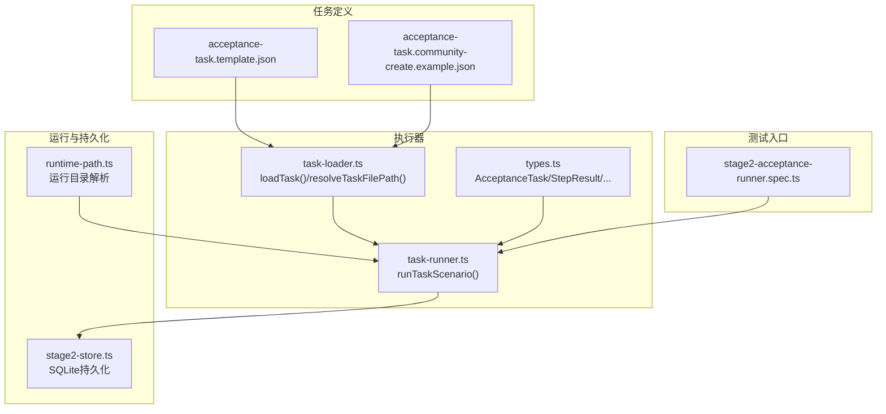
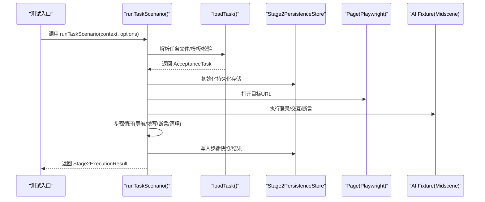
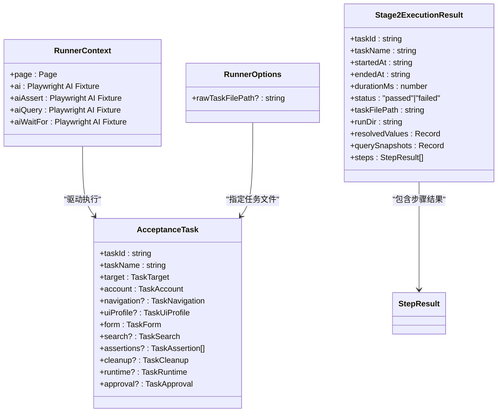

# 任务执行 API

<cite>
**本文引用的文件**
- [src/stage2/task-runner.ts](file://src/stage2/task-runner.ts)
- [src/stage2/task-loader.ts](file://src/stage2/task-loader.ts)
- [src/stage2/types.ts](file://src/stage2/types.ts)
- [specs/tasks/acceptance-task.template.json](file://specs/tasks/acceptance-task.template.json)
- [specs/tasks/acceptance-task.community-create.example.json](file://specs/tasks/acceptance-task.community-create.example.json)
- [tests/generated/stage2-acceptance-runner.spec.ts](file://tests/generated/stage2-acceptance-runner.spec.ts)
- [src/persistence/stage2-store.ts](file://src/persistence/stage2-store.ts)
- [config/runtime-path.ts](file://config/runtime-path.ts)
- [README.md](file://README.md)
- [package.json](file://package.json)
</cite>

## 目录
1. [简介](#简介)
2. [项目结构](#项目结构)
3. [核心组件](#核心组件)
4. [架构概览](#架构概览)
5. [详细组件分析](#详细组件分析)
6. [依赖关系分析](#依赖关系分析)
7. [性能考量](#性能考量)
8. [故障排查指南](#故障排查指南)
9. [结论](#结论)
10. [附录](#附录)

## 简介
本文件面向任务执行 API 的使用者，系统性阐述 runTaskScenario 函数的接口规范、执行流程、状态管理与进度跟踪、性能特性与并发策略、错误处理与最佳实践。该 API 通过 JSON 任务描述驱动 Playwright 与 Midscene AI 能力，实现端到端的验收测试自动化，覆盖任务加载、页面交互、断言验证与清理收尾。

## 项目结构
- 任务定义与模板：位于 specs/tasks 下，包含通用模板与具体示例任务。
- 执行器：src/stage2/task-runner.ts 提供 runTaskScenario 主入口，task-loader.ts 负责任务文件解析与校验。
- 类型定义：src/stage2/types.ts 定义 AcceptanceTask、断言、清理等核心数据结构。
- 运行产物与持久化：config/runtime-path.ts 统一运行目录；src/persistence/stage2-store.ts 将执行过程与结果写入本地 SQLite。
- 测试入口：tests/generated/stage2-acceptance-runner.spec.ts 展示如何调用 runTaskScenario。

图表来源
- [src/stage2/task-runner.ts](file://src/stage2/task-runner.ts)
- [src/stage2/task-loader.ts](file://src/stage2/task-loader.ts)
- [src/stage2/types.ts](file://src/stage2/types.ts)
- [specs/tasks/acceptance-task.template.json](file://specs/tasks/acceptance-task.template.json)
- [specs/tasks/acceptance-task.community-create.example.json](file://specs/tasks/acceptance-task.community-create.example.json)
- [config/runtime-path.ts](file://config/runtime-path.ts)
- [src/persistence/stage2-store.ts](file://src/persistence/stage2-store.ts)
- [tests/generated/stage2-acceptance-runner.spec.ts](file://tests/generated/stage2-acceptance-runner.spec.ts)

章节来源
- [README.md](file://README.md)
- [package.json](file://package.json)

## 核心组件
- runTaskScenario：任务执行主入口，负责加载任务、执行步骤、断言与清理，并输出结构化结果。
- 任务加载器：解析任务文件、模板变量替换、字段校验。
- 类型系统：定义任务结构、断言、清理、运行时配置与执行结果。
- 持久化存储：将执行过程与结果写入本地 SQLite，同时维护进度快照与附件元数据。
- 运行目录：统一管理运行产物目录，便于报告与截图归档。

章节来源
- [src/stage2/task-runner.ts](file://src/stage2/task-runner.ts)
- [src/stage2/task-loader.ts](file://src/stage2/task-loader.ts)
- [src/stage2/types.ts](file://src/stage2/types.ts)
- [src/persistence/stage2-store.ts](file://src/persistence/stage2-store.ts)
- [config/runtime-path.ts](file://config/runtime-path.ts)

## 架构概览
runTaskScenario 的执行流程分为五大阶段：准备阶段、导航与登录、表单填写与提交、断言验证、数据清理。每个阶段被封装为“步骤”，具备独立的超时、截图与持久化能力。

图表来源
- [src/stage2/task-runner.ts](file://src/stage2/task-runner.ts)
- [src/stage2/task-loader.ts](file://src/stage2/task-loader.ts)
- [src/persistence/stage2-store.ts](file://src/persistence/stage2-store.ts)

## 详细组件分析

### runTaskScenario 接口规范
- 函数签名
  - 输入参数
    - runner: RunnerContext
      - page: Page（Playwright 页面实例）
      - ai: Playwright AI Fixture（描述步骤并执行交互）
      - aiAssert: Playwright AI Fixture（执行 AI 断言）
      - aiQuery: Playwright AI Fixture（从页面提取结构化数据）
      - aiWaitFor: Playwright AI Fixture（等待条件满足）
    - options?: RunnerOptions
      - rawTaskFilePath?: string（可选，覆盖默认任务文件路径）
  - 返回值
    - Promise<Stage2ExecutionResult>
      - 包含任务标识、执行时间、状态、运行目录、截图路径、步骤明细、解析后的字段值、查询快照等

- 调用约定
  - 必须提供包含 ai、aiAssert、aiQuery、aiWaitFor 的 RunnerContext。
  - 可通过环境变量 STAGE2_TASK_FILE 指定任务文件，或在 options 中传入 rawTaskFilePath。
  - 若开启 STAGE2_REQUIRE_APPROVAL=true，则任务必须通过 approval.approved 校验。
  - 执行期间会写入部分结果文件与持久化快照，便于实时监控。

章节来源
- [src/stage2/task-runner.ts](file://src/stage2/task-runner.ts)
- [src/stage2/types.ts](file://src/stage2/types.ts)

### 任务加载与校验
- 任务文件解析
  - 支持绝对/相对路径，若未指定则使用默认文件。
  - 读取 JSON 后进行字段完整性校验（如 taskId、taskName、target.url、account.username/password、form.openButtonText/form.submitButtonText、form.fields 等）。
- 模板变量替换
  - 支持 ${NOW_YYYYMMDDHHMMSS} 时间令牌与环境变量占位符 ${ENV_VAR}。
- 任务批准
  - 若 STAGE2_REQUIRE_APPROVAL=true，任务必须 approval.approved 为真。

章节来源
- [src/stage2/task-loader.ts](file://src/stage2/task-loader.ts)
- [specs/tasks/acceptance-task.template.json](file://specs/tasks/acceptance-task.template.json)
- [specs/tasks/acceptance-task.community-create.example.json](file://specs/tasks/acceptance-task.community-create.example.json)

### 执行流程与步骤管理
- 步骤抽象
  - runStep(stepName, handler, options?)：封装单个步骤，自动记录开始/结束时间、耗时、截图、错误信息，并写入进度文件与持久化。
  - options.required：默认 true；若为 false，失败不会中断流程，而是标记为 skipped。
- 核心步骤
  - 打开系统首页
  - 登录系统（AI 描述 + Playwright 执行）
  - 处理安全验证（滑块验证码自动/人工/失败/忽略）
  - 等待首页加载（可选）
  - 点击菜单（支持多级路径）
  - 打开新增弹窗
  - 等待弹窗显示（可选）
  - 填写表单字段（支持级联选择）
  - 提交表单（自动修复校验提示）
  - 检查提交提示（可选）
  - 关闭弹窗（可选）
  - 搜索与回查（可选）
  - 业务断言（支持多种断言类型与软断言）
  - 数据清理（支持删除/自定义清理策略）

章节来源
- [src/stage2/task-runner.ts](file://src/stage2/task-runner.ts)

### 断言验证机制
- 断言类型
  - toast：检查 Toast/通知类提示
  - table-row-exists：检查表格行是否存在
  - table-cell-equals：检查表格单元格值严格相等
  - table-cell-contains：检查表格单元格值包含关系
  - custom：自定义描述断言
- 执行策略
  - Playwright 硬检测优先（高可靠），失败后降级为 AI 结构化断言。
  - 支持重试与轮询，可配置超时与重试次数。
  - 支持软断言（soft=true）不中断流程。

章节来源
- [src/stage2/task-runner.ts](file://src/stage2/task-runner.ts)
- [src/stage2/types.ts](file://src/stage2/types.ts)

### 数据清理流程
- 清理策略
  - delete-created：仅删除本次新增数据
  - delete-all-matched：删除所有匹配数据（通过 AI 查询列表）
  - custom：自定义清理指令
  - none：禁用清理
- 行匹配模式
  - exact：精确匹配
  - contains：包含匹配（谨慎使用）
- 行为细节
  - 可选搜索定位目标数据
  - 点击行操作按钮（如“删除”）
  - 处理确认弹窗
  - 等待成功提示并可选验证目标行消失
  - failOnError 控制清理失败是否中断任务

章节来源
- [src/stage2/task-runner.ts](file://src/stage2/task-runner.ts)
- [src/stage2/types.ts](file://src/stage2/types.ts)

### 状态管理与进度跟踪
- 进度文件
  - 在 runTaskScenario 内部维护 partial.json，实时写入状态、步骤、解析值与查询快照。
- 持久化存储
  - Stage2PersistenceStore 将运行主记录、步骤明细、快照与附件写入本地 SQLite。
  - 支持同步进度、记录步骤、完成运行等生命周期事件。
- 运行目录
  - 统一由 config/runtime-path.ts 解析，产物包括 result.json、screenshots 目录、中间快照等。

章节来源
- [src/stage2/task-runner.ts](file://src/stage2/task-runner.ts)
- [src/persistence/stage2-store.ts](file://src/persistence/stage2-store.ts)
- [config/runtime-path.ts](file://config/runtime-path.ts)

### 错误处理与异常情况
- 步骤级错误
  - runStep 捕获异常，记录 message 与 errorStack，必要时截图并标记为 failed/skipped。
- 任务级错误
  - 若 requireApproval 或 captcha 处理失败，直接抛出错误并终止。
- 断言失败
  - 硬检测失败会尝试 AI 断言；若仍失败，抛出详细错误信息。
- 清理失败
  - 取决于 failOnError 配置，可选择中断或继续。

章节来源
- [src/stage2/task-runner.ts](file://src/stage2/task-runner.ts)

### 性能特性与并发控制
- 性能特性
  - 断言采用轮询与重试策略，避免瞬时状态导致的误判。
  - 截图仅在开启 runtime.screenshotOnStep 时生成，降低 IO 压力。
  - 持久化采用异步写入与文件落盘，避免阻塞主线程。
- 并发控制
  - runTaskScenario 为单任务串行执行，步骤间有显式等待与校验。
  - 未发现多任务并发执行逻辑，建议通过外部调度器串行运行多个任务。

章节来源
- [src/stage2/task-runner.ts](file://src/stage2/task-runner.ts)
- [README.md](file://README.md)

### 最佳实践与常见模式
- 任务文件
  - 使用 acceptance-task.template.json 作为模板，按需填充字段。
  - 对敏感信息（如密码）使用占位符并在运行时注入。
- 断言策略
  - 优先使用 Playwright 硬检测；复杂语义场景使用 aiQuery + 代码断言。
  - table-row-exists 作为硬门槛，table-cell-* 仅校验关键列，建议 soft=true。
- 清理策略
  - 优先 delete-created，确保仅清理本次新增数据。
  - 启用 verifyAfterCleanup，保证删除后目标行消失。
- 运行与调试
  - 使用 npm run stage2:run:headed 查看 UI 交互与截图。
  - 通过 t_runtime/acceptance-results 查看 result.json 与 screenshots。

章节来源
- [README.md](file://README.md)
- [specs/tasks/acceptance-task.template.json](file://specs/tasks/acceptance-task.template.json)
- [specs/tasks/acceptance-task.community-create.example.json](file://specs/tasks/acceptance-task.community-create.example.json)

## 依赖关系分析

图表来源
- [src/stage2/task-runner.ts](file://src/stage2/task-runner.ts)
- [src/stage2/types.ts](file://src/stage2/types.ts)

章节来源
- [src/stage2/task-runner.ts](file://src/stage2/task-runner.ts)
- [src/stage2/types.ts](file://src/stage2/types.ts)

## 性能考量
- 断言轮询间隔与超时
  - 断言轮询间隔默认 500ms，超时与重试次数可配置。
- 截图策略
  - 仅在 runtime.screenshotOnStep=true 时生成步骤截图，建议在调试阶段开启。
- 持久化写入
  - 采用文件落盘与数据库写入双通道，避免阻塞主线程。
- 环境变量影响
  - STAGE2_CAPTCHA_MODE 与 STAGE2_CAPTCHA_WAIT_TIMEOUT_MS 影响验证码处理策略与等待时长。

章节来源
- [src/stage2/task-runner.ts](file://src/stage2/task-runner.ts)
- [README.md](file://README.md)

## 故障排查指南
- 常见问题
  - 任务文件缺失字段：检查 taskId、taskName、target.url、account.username/password、form.openButtonText/form.submitButtonText、form.fields。
  - 任务未审批：设置 STAGE2_REQUIRE_APPROVAL=false 或在任务中 approval.approved=true。
  - 滑块验证码：根据 STAGE2_CAPTCHA_MODE 设置自动/人工/失败/忽略。
  - 断言失败：查看 result.json 中最后失败步骤的 message 与截图路径。
  - 清理失败：检查 cleanup.failOnError 与清理动作配置。
- 调试建议
  - 使用 npm run stage2:run:headed 观察 UI 交互。
  - 查看 t_runtime/acceptance-results 下的 result.json 与 screenshots。
  - 检查数据库写入状态（ai_run、ai_run_step、ai_snapshot、ai_artifact）。

章节来源
- [src/stage2/task-runner.ts](file://src/stage2/task-runner.ts)
- [README.md](file://README.md)

## 结论
runTaskScenario 提供了结构化的任务执行 API，结合 Playwright 与 Midscene AI，实现了从任务加载到断言验证与清理收尾的全链路自动化。通过步骤化管理、软断言、持久化与进度快照，既保证了可靠性，也便于调试与追踪。建议遵循模板化任务文件、硬断言优先、关键列校验与严格清理策略的最佳实践，以获得更稳健的验收测试体验。

## 附录

### API 调用示例（路径引用）
- 在测试入口中调用 runTaskScenario
  - [tests/generated/stage2-acceptance-runner.spec.ts](file://tests/generated/stage2-acceptance-runner.spec.ts)
- 任务文件模板与示例
  - [specs/tasks/acceptance-task.template.json](file://specs/tasks/acceptance-task.template.json)
  - [specs/tasks/acceptance-task.community-create.example.json](file://specs/tasks/acceptance-task.community-create.example.json)
- 运行与脚本
  - [package.json](file://package.json)
  - [README.md](file://README.md)