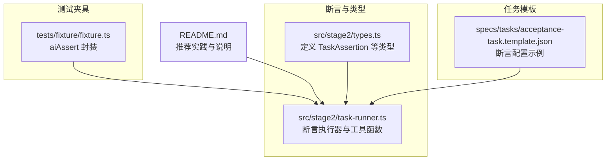
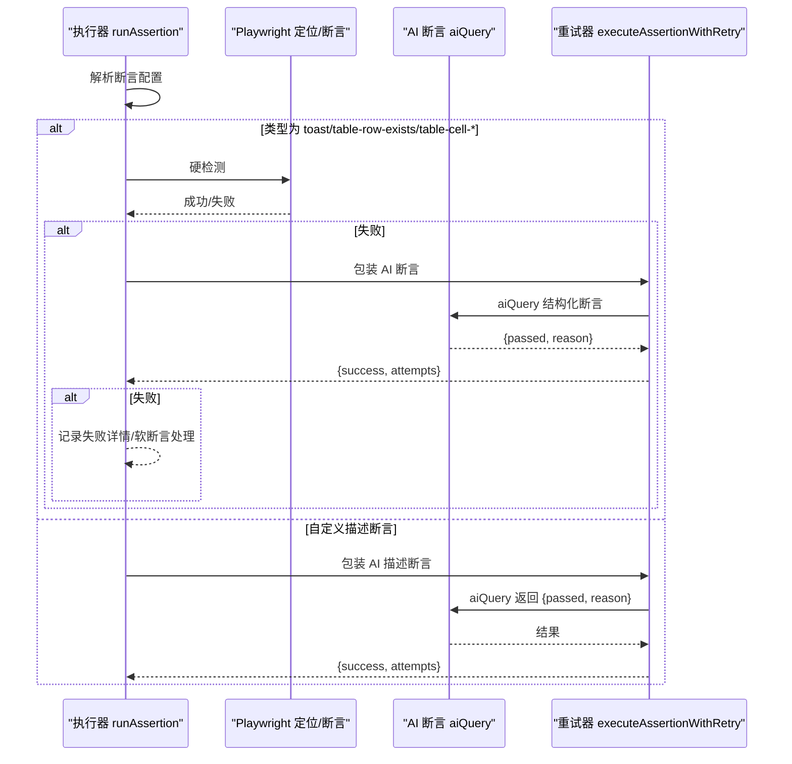
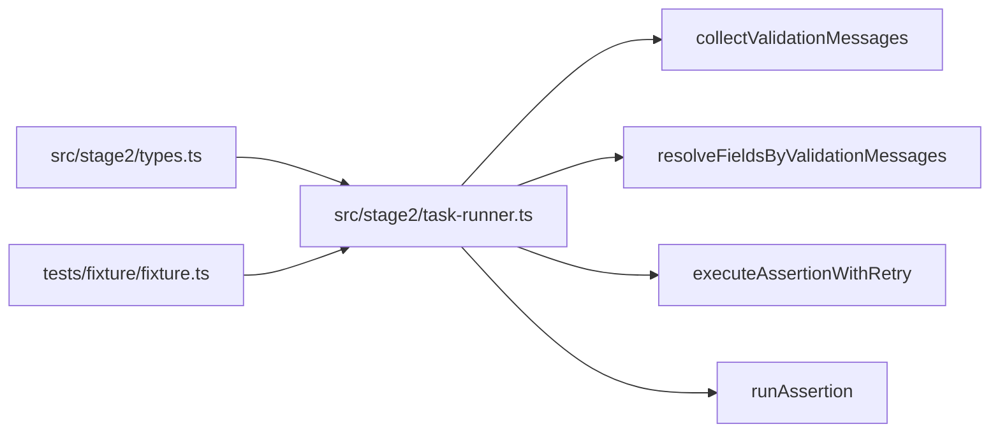

# 断言验证 API

<cite>
**本文引用的文件**
- [README.md](file://README.md)
- [src/stage2/types.ts](file://src/stage2/types.ts)
- [src/stage2/task-runner.ts](file://src/stage2/task-runner.ts)
- [tests/fixture/fixture.ts](file://tests/fixture/fixture.ts)
- [specs/tasks/acceptance-task.template.json](file://specs/tasks/acceptance-task.template.json)
</cite>

## 目录
1. [简介](#简介)
2. [项目结构](#项目结构)
3. [核心组件](#核心组件)
4. [架构概览](#架构概览)
5. [详细组件分析](#详细组件分析)
6. [依赖关系分析](#依赖关系分析)
7. [性能考量](#性能考量)
8. [故障排查指南](#故障排查指南)
9. [结论](#结论)
10. [附录](#附录)

## 简介
本文件系统性梳理断言验证 API 的设计与实现，重点覆盖以下能力：
- aiAssert：基于 Midscene 的 AI 断言能力封装，提供“断言失败时可选”的兜底能力。
- collectValidationMessages：从页面中提取校验提示文本，用于驱动字段修复与重试。
- resolveFieldsByValidationMessages：将校验提示与表单字段进行匹配，定位需要补填的字段集合。
- runAssertion：统一断言执行入口，采用“Playwright 硬检测优先 + AI 断言兜底 + 重试机制”的策略，覆盖 Toast、表格行/列断言、自定义描述断言等类型。
- 断言失败处理与重试：内置重试器与详细错误聚合，便于定位问题与二次验证。
- 性能特性与优化：断言粒度控制、重试间隔、软断言策略等。
- 最佳实践：断言类型选择、跨平台 UI 兼容、错误消息收集与重试闭环。

## 项目结构
断言验证 API 主要分布在 stage2 执行器与类型定义中，配合测试夹具提供的 aiAssert 封装，形成端到端的断言验证链路。

图表来源
- [src/stage2/types.ts:67-88](file://src/stage2/types.ts#L67-L88)
- [src/stage2/task-runner.ts:338-407](file://src/stage2/task-runner.ts#L338-L407)
- [tests/fixture/fixture.ts:71-84](file://tests/fixture/fixture.ts#L71-L84)
- [specs/tasks/acceptance-task.template.json:75-106](file://specs/tasks/acceptance-task.template.json#L75-L106)

章节来源
- [README.md:144-158](file://README.md#L144-L158)
- [src/stage2/types.ts:67-88](file://src/stage2/types.ts#L67-L88)
- [src/stage2/task-runner.ts:338-407](file://src/stage2/task-runner.ts#L338-L407)
- [tests/fixture/fixture.ts:71-84](file://tests/fixture/fixture.ts#L71-L84)
- [specs/tasks/acceptance-task.template.json:75-106](file://specs/tasks/acceptance-task.template.json#L75-L106)

## 核心组件
- aiAssert：在测试夹具中提供 aiAssert 封装，接收断言描述与可选错误信息，交由 Midscene Agent 执行断言。
- collectValidationMessages：从页面中提取各类 UI 框架的校验提示文本，去重并标准化。
- resolveFieldsByValidationMessages：将校验提示与表单字段进行匹配，支持标签、占位提示、级联组件等场景。
- runAssertion：统一断言入口，支持多种断言类型与重试策略，失败时输出详细诊断信息。
- executeAssertionWithRetry：通用重试器，支持自定义验证器与固定延迟。

章节来源
- [tests/fixture/fixture.ts:71-84](file://tests/fixture/fixture.ts#L71-L84)
- [src/stage2/task-runner.ts:338-407](file://src/stage2/task-runner.ts#L338-L407)
- [src/stage2/task-runner.ts:1529-1556](file://src/stage2/task-runner.ts#L1529-L1556)
- [src/stage2/task-runner.ts:1562-1917](file://src/stage2/task-runner.ts#L1562-L1917)

## 架构概览
断言验证的整体流程如下：
- 任务 JSON 中声明 assertions 数组，每条断言包含类型、期望值、匹配字段、重试次数、软断言等配置。
- 执行器在每个断言步骤中，优先尝试 Playwright 硬检测；若失败则降级到 AI 断言；若仍失败则根据 soft 配置决定是否中断。
- 对于表单提交失败的场景，先收集校验提示，再匹配字段并自动补填，最后重试提交直至成功或达到最大重试次数。

图表来源
- [src/stage2/task-runner.ts:1562-1917](file://src/stage2/task-runner.ts#L1562-L1917)
- [src/stage2/task-runner.ts:1529-1556](file://src/stage2/task-runner.ts#L1529-L1556)

## 详细组件分析

### aiAssert 接口规范
- 函数签名
  - 名称：aiAssert
  - 参数：
    - assertion: string —— 断言描述（例如“页面包含某文本”、“列表存在某条目”）
    - errorMsg?: string —— 可选的错误信息，用于失败时增强提示
  - 返回：Promise<void> —— 成功无返回，失败抛出错误
- 调用约定
  - 在测试夹具中通过 runner.aiAssert 调用，内部委托 Midscene Agent 执行断言
  - 若断言失败，应结合 errorMsg 与上下文信息定位问题
- 使用示例（路径）
  - [tests/fixture/fixture.ts:71-84](file://tests/fixture/fixture.ts#L71-L84)
  - [src/stage2/task-runner.ts:2589](file://src/stage2/task-runner.ts#L2589)

章节来源
- [tests/fixture/fixture.ts:71-84](file://tests/fixture/fixture.ts#L71-L84)
- [src/stage2/task-runner.ts:2589](file://src/stage2/task-runner.ts#L2589)

### collectValidationMessages 接口规范
- 函数签名
  - 名称：collectValidationMessages
  - 参数：
    - page: Page —— Playwright 页面对象
    - scope?: Locator —— 可选的作用域定位器，默认为 body
  - 返回：Promise<string[]> —— 校验提示文本数组（去重、标准化）
- 实现要点
  - 针对不同 UI 框架（Element Plus、Ant Design、iView）的校验提示类名进行提取
  - 优先读取可见元素的文本，若为空则回退到 placeholder
  - 输出前进行去重与空白标准化
- 使用示例（路径）
  - [src/stage2/task-runner.ts:338-367](file://src/stage2/task-runner.ts#L338-L367)

章节来源
- [src/stage2/task-runner.ts:338-367](file://src/stage2/task-runner.ts#L338-L367)

### resolveFieldsByValidationMessages 接口规范
- 函数签名
  - 名称：resolveFieldsByValidationMessages
  - 参数：
    - fields: TaskField[] —— 表单字段定义
    - messages: string[] —— 校验提示文本数组（来自 collectValidationMessages）
  - 返回：TaskField[] —— 匹配到的字段集合
- 匹配规则
  - 标准化字段标签与提示文本，进行包含匹配
  - 特殊处理级联组件（省市区/请选择等提示）
  - 支持“请输入/请选择 + 标签”的提示变体
- 使用示例（路径）
  - [src/stage2/task-runner.ts:369-407](file://src/stage2/task-runner.ts#L369-L407)

章节来源
- [src/stage2/task-runner.ts:369-407](file://src/stage2/task-runner.ts#L369-L407)

### runAssertion 统一断言执行器
- 断言类型与策略
  - toast：优先 Playwright 文本可见性检测，失败则 AI 结构化断言
  - table-row-exists：Playwright 定位行，失败则 AI 定位
  - table-cell-equals：优先 Playwright 列值提取与代码比对，失败则 AI 结构化断言
  - table-cell-contains：优先 Playwright 列值提取与包含判断，失败则 AI 结构化断言
  - custom：AI 描述断言，返回 {passed, reason}
  - 未知类型：AI 通用断言兜底
- 重试机制
  - executeAssertionWithRetry：固定延迟重试，支持自定义验证器
  - 断言配置支持 timeoutMs、retryCount 控制
- 错误处理
  - 失败时聚合 Playwright 与 AI 的诊断信息，输出详细差异
  - 支持 soft=true 使失败不中断流程
- 使用示例（路径）
  - [src/stage2/task-runner.ts:1562-1917](file://src/stage2/task-runner.ts#L1562-L1917)

章节来源
- [src/stage2/task-runner.ts:1562-1917](file://src/stage2/task-runner.ts#L1562-L1917)

### executeAssertionWithRetry 重试器
- 函数签名
  - 名称：executeAssertionWithRetry
  - 参数：
    - executor: () => Promise<T> —— 执行器
    - validator: (result: T) => boolean —— 验证器
    - retryCount: number —— 重试次数
    - delayMs: number = 1000 —— 重试间隔（毫秒）
  - 返回：Promise<{ success: boolean; result?: T; attempts: number }>
- 行为特征
  - 每次重试前等待 delayMs
  - 捕获异常并继续重试，最终返回最后一次结果与尝试次数
- 使用示例（路径）
  - [src/stage2/task-runner.ts:1529-1556](file://src/stage2/task-runner.ts#L1529-L1556)

章节来源
- [src/stage2/task-runner.ts:1529-1556](file://src/stage2/task-runner.ts#L1529-L1556)

### 断言类型与配置（TaskAssertion）
- 关键字段
  - type: string —— 断言类型（toast、table-row-exists、table-cell-equals、table-cell-contains、custom 等）
  - expectedText?: string —— toast 场景的期望文本
  - matchField?: string —— 行/列匹配字段（需在 resolvedValues 中解析）
  - expectedColumns?: string[] —— table-cell-equals 的期望列集合
  - expectedColumnFromFields?: Record<string, string> —— 列名到字段名映射
  - expectedColumnValues?: Record<string, string> —— 列名到期望值映射（优先级更高）
  - column?: string —— table-cell-contains 的目标列
  - expectedFromField?: string —— 期望值来源字段
  - matchMode?: 'exact' | 'contains' —— 行匹配模式
  - timeoutMs?: number —— 断言超时（毫秒）
  - retryCount?: number —— 断言重试次数
  - soft?: boolean —— 是否为软断言（失败不中断）
  - description?: string —— custom 类型的断言描述
- 使用示例（路径）
  - [src/stage2/types.ts:67-88](file://src/stage2/types.ts#L67-L88)
  - [specs/tasks/acceptance-task.template.json:75-106](file://specs/tasks/acceptance-task.template.json#L75-L106)

章节来源
- [src/stage2/types.ts:67-88](file://src/stage2/types.ts#L67-L88)
- [specs/tasks/acceptance-task.template.json:75-106](file://specs/tasks/acceptance-task.template.json#L75-L106)

### 表单提交失败的断言验证闭环
- 步骤
  - 提交后等待弹窗关闭或提示出现
  - 若弹窗未关闭，收集校验提示
  - 将提示与字段匹配，定位缺失/必填字段
  - 自动补填并重试提交，直至成功或达到最大重试次数
- 使用示例（路径）
  - [src/stage2/task-runner.ts:1017-1021](file://src/stage2/task-runner.ts#L1017-L1021)
  - [src/stage2/task-runner.ts:338-407](file://src/stage2/task-runner.ts#L338-L407)

章节来源
- [src/stage2/task-runner.ts:1017-1021](file://src/stage2/task-runner.ts#L1017-L1021)
- [src/stage2/task-runner.ts:338-407](file://src/stage2/task-runner.ts#L338-L407)

## 依赖关系分析
- 类型依赖
  - TaskAssertion 定义了断言的配置结构，被 runAssertion 使用
- 执行器依赖
  - runAssertion 依赖 Playwright 定位器、aiQuery、aiAssert、executeAssertionWithRetry
  - collectValidationMessages 与 resolveFieldsByValidationMessages 为表单补填提供支撑
- 测试夹具依赖
  - tests/fixture/fixture.ts 提供 aiAssert 封装，供任务场景中直接使用

图表来源
- [src/stage2/types.ts:67-88](file://src/stage2/types.ts#L67-L88)
- [src/stage2/task-runner.ts:338-407](file://src/stage2/task-runner.ts#L338-L407)
- [src/stage2/task-runner.ts:1529-1556](file://src/stage2/task-runner.ts#L1529-L1556)
- [src/stage2/task-runner.ts:1562-1917](file://src/stage2/task-runner.ts#L1562-L1917)
- [tests/fixture/fixture.ts:71-84](file://tests/fixture/fixture.ts#L71-L84)

章节来源
- [src/stage2/types.ts:67-88](file://src/stage2/types.ts#L67-L88)
- [src/stage2/task-runner.ts:338-407](file://src/stage2/task-runner.ts#L338-L407)
- [src/stage2/task-runner.ts:1529-1556](file://src/stage2/task-runner.ts#L1529-L1556)
- [src/stage2/task-runner.ts:1562-1917](file://src/stage2/task-runner.ts#L1562-L1917)
- [tests/fixture/fixture.ts:71-84](file://tests/fixture/fixture.ts#L71-L84)

## 性能考量
- 断言粒度控制
  - table-cell-equals 与 table-cell-contains 建议仅对关键列进行断言，避免过度比对导致性能开销
  - 使用 soft=true 降低失败对整体流程的影响，提高稳定性
- 重试策略
  - 合理设置 retryCount 与 delayMs，避免频繁重试造成资源浪费
  - 对于 toast 等快速可见断言，可缩短 timeoutMs
- 跨平台 UI 兼容
  - 通过 uiProfile 的 tableRowSelectors、toastSelectors、dialogSelectors 提升定位成功率，减少回退到 AI 的次数
- 日志与诊断
  - 失败时输出 Playwright 与 AI 的诊断差异，有助于快速定位问题，减少无效重试

[本节为通用性能建议，无需特定文件来源]

## 故障排查指南
- 常见问题
  - 断言失败：查看 runAssertion 输出的详细差异（缺失列、列值不匹配等）
  - AI 幻觉：custom 与未知类型断言建议配合 aiQuery + 代码断言，减少自由文本断言
  - UI 定位不稳定：通过 uiProfile 增加选择器优先级，或使用 aiAssert 辅助定位
- 重试与超时
  - 调整断言配置中的 timeoutMs 与 retryCount，观察是否因页面渲染延迟导致误判
- 校验提示收集
  - 若 collectValidationMessages 未命中提示，检查页面是否使用非标准类名或隐藏提示
- 软断言
  - 对非关键断言使用 soft=true，避免阻塞后续清理与收尾流程

章节来源
- [src/stage2/task-runner.ts:1562-1917](file://src/stage2/task-runner.ts#L1562-L1917)
- [README.md:151-157](file://README.md#L151-L157)

## 结论
断言验证 API 通过“Playwright 硬检测优先 + AI 断言兜底 + 重试机制”的组合，兼顾稳定性与跨平台兼容性。配合 collectValidationMessages 与 resolveFieldsByValidationMessages，可实现表单提交失败的自动修复与重试闭环。建议在复杂场景中优先使用结构化断言与代码比对，必要时再引入 AI 描述断言，以平衡准确性与鲁棒性。

[本节为总结性内容，无需特定文件来源]

## 附录

### 断言类型与调用约定速查
- toast
  - 期望：expectedText
  - 策略：Playwright 文本可见性 -> AI 结构化断言
- table-row-exists
  - 期望：matchField（需解析为行值）
  - 策略：Playwright 定位行 -> AI 定位
- table-cell-equals
  - 期望：matchField + expectedColumns + expectedColumnFromFields/expectedColumnValues
  - 策略：Playwright 列值提取与代码比对 -> AI 结构化断言
- table-cell-contains
  - 期望：matchField + column + expectedFromField
  - 策略：Playwright 列值提取与包含判断 -> AI 结构化断言
- custom
  - 期望：description
  - 策略：AI 描述断言（返回 {passed, reason}）

章节来源
- [src/stage2/task-runner.ts:1562-1917](file://src/stage2/task-runner.ts#L1562-L1917)
- [specs/tasks/acceptance-task.template.json:75-106](file://specs/tasks/acceptance-task.template.json#L75-L106)