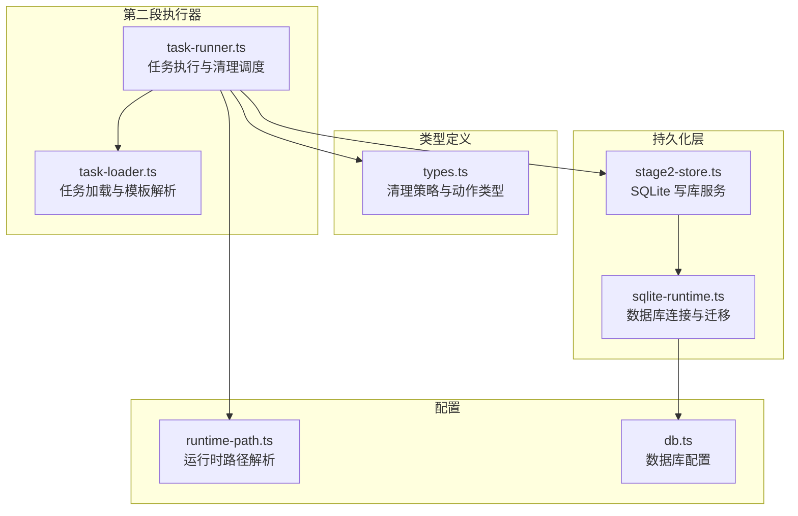
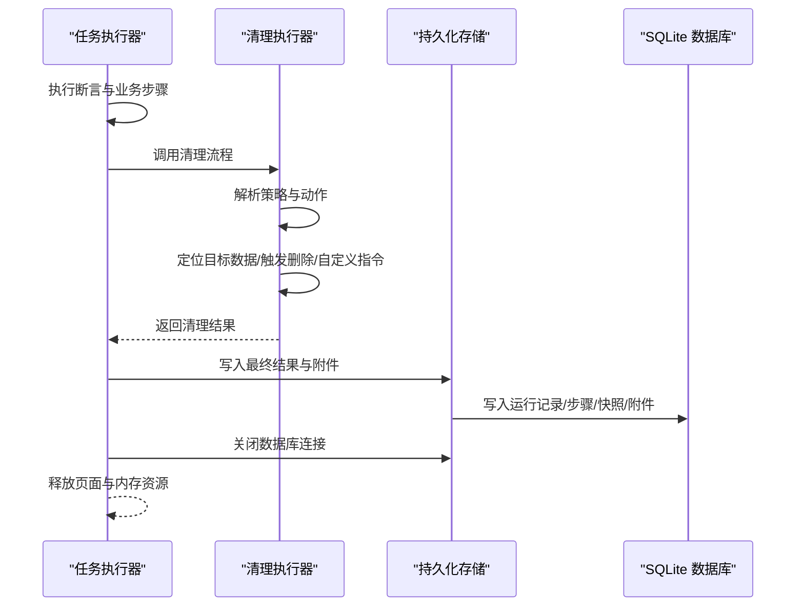
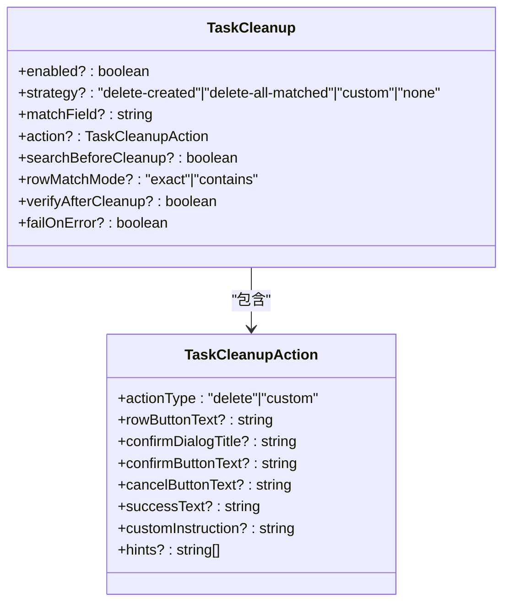
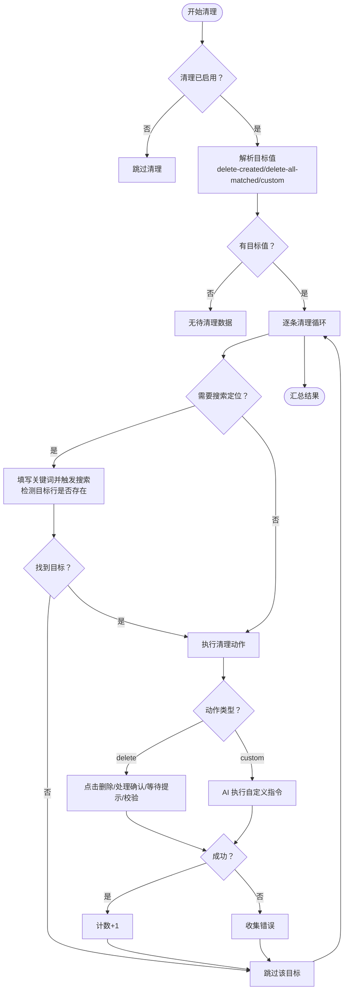
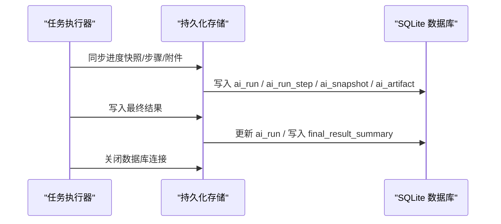
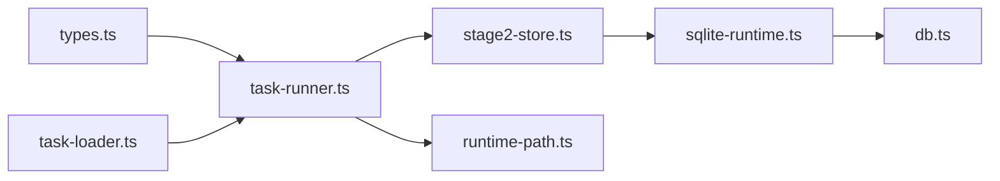

# 清理操作 API

<cite>
**本文引用的文件**
- [task-runner.ts](file://src/stage2/task-runner.ts)
- [types.ts](file://src/stage2/types.ts)
- [stage2-store.ts](file://src/persistence/stage2-store.ts)
- [sqlite-runtime.ts](file://src/persistence/sqlite-runtime.ts)
- [task-loader.ts](file://src/stage2/task-loader.ts)
- [runtime-path.ts](file://config/runtime-path.ts)
- [db.ts](file://config/db.ts)
- [README.md](file://README.md)
</cite>

## 目录
1. [简介](#简介)
2. [项目结构](#项目结构)
3. [核心组件](#核心组件)
4. [架构概览](#架构概览)
5. [详细组件分析](#详细组件分析)
6. [依赖关系分析](#依赖关系分析)
7. [性能考量](#性能考量)
8. [故障排查指南](#故障排查指南)
9. [结论](#结论)
10. [附录](#附录)

## 简介
本文件系统性阐述“清理操作 API”的设计与实现，覆盖任务执行完成后对资源释放、状态重置与临时文件清理的接口规范，以及在正常完成与异常中断两种场景下的清理策略与执行顺序。文档还提供配置项说明、自定义清理逻辑扩展方式、性能影响与优化策略，并给出最佳实践与常见使用模式，帮助开发者正确、高效地集成清理流程。

## 项目结构
清理操作 API 主要位于第二段执行器模块中，围绕任务执行生命周期进行资源管理与收尾工作。关键文件与职责如下：
- 任务执行器：负责执行任务步骤、调用清理流程、落盘执行结果与持久化存储
- 类型定义：定义清理策略、动作、断言等数据结构
- 持久化层：负责将执行结果、步骤、截图、报告等产物写入本地 SQLite 数据库
- 配置模块：提供运行时路径与数据库路径解析，统一产物目录

**图表来源**
- [task-runner.ts](file://src/stage2/task-runner.ts)
- [task-loader.ts](file://src/stage2/task-loader.ts)
- [types.ts](file://src/stage2/types.ts)
- [stage2-store.ts](file://src/persistence/stage2-store.ts)
- [sqlite-runtime.ts](file://src/persistence/sqlite-runtime.ts)
- [runtime-path.ts](file://config/runtime-path.ts)
- [db.ts](file://config/db.ts)

**章节来源**
- [task-runner.ts](file://src/stage2/task-runner.ts)
- [types.ts](file://src/stage2/types.ts)
- [stage2-store.ts](file://src/persistence/stage2-store.ts)
- [sqlite-runtime.ts](file://src/persistence/sqlite-runtime.ts)
- [task-loader.ts](file://src/stage2/task-loader.ts)
- [runtime-path.ts](file://config/runtime-path.ts)
- [db.ts](file://config/db.ts)

## 核心组件
- 清理策略与动作类型：定义清理策略（删除新增、删除全部匹配、自定义、禁用）、动作类型（删除、自定义）、匹配模式（精确/包含）等
- 清理执行器：根据策略与动作，定位目标数据、触发删除或自定义 AI 指令、处理确认弹窗、校验删除结果
- 持久化存储：在任务执行期间与结束后，将执行结果、步骤、截图、报告等写入 SQLite 数据库
- 任务加载器：加载任务 JSON，解析模板变量，保证清理所需字段可用
- 配置解析：统一运行时产物目录与数据库路径，便于清理后的文件归档与检索

**章节来源**
- [types.ts](file://src/stage2/types.ts)
- [task-runner.ts](file://src/stage2/task-runner.ts)
- [stage2-store.ts](file://src/persistence/stage2-store.ts)
- [sqlite-runtime.ts](file://src/persistence/sqlite-runtime.ts)
- [task-loader.ts](file://src/stage2/task-loader.ts)
- [runtime-path.ts](file://config/runtime-path.ts)
- [db.ts](file://config/db.ts)

## 架构概览
清理操作 API 在任务执行完成后被调用，贯穿“资源释放、状态重置、临时文件清理”三个层面。其执行时机与顺序如下：
- 正常完成：在断言之后、任务结束之前执行清理；清理成功与否可按配置决定是否中断
- 异常中断：在捕获异常后，仍会尝试执行清理，避免残留数据影响后续执行
- 资源释放：关闭持久化数据库连接，释放内存与文件句柄
- 状态重置：重置页面状态（如关闭弹窗、回到首页），确保后续任务不受干扰
- 临时文件清理：删除运行目录中的截图、中间文件等

**图表来源**
- [task-runner.ts](file://src/stage2/task-runner.ts)
- [stage2-store.ts](file://src/persistence/stage2-store.ts)
- [sqlite-runtime.ts](file://src/persistence/sqlite-runtime.ts)

**章节来源**
- [task-runner.ts](file://src/stage2/task-runner.ts)
- [stage2-store.ts](file://src/persistence/stage2-store.ts)

## 详细组件分析

### 清理策略与动作类型
- 策略
  - delete-created：仅删除本次新增的数据
  - delete-all-matched：删除当前列表中所有匹配的数据
  - custom：使用自定义 AI 指令进行清理
  - none：禁用清理
- 动作类型
  - delete：删除行，支持确认弹窗处理、成功提示检测、删除后校验
  - custom：执行自定义 AI 指令，支持占位符替换
- 匹配模式
  - exact：精确匹配
  - contains：包含匹配（谨慎使用）

**图表来源**
- [types.ts](file://src/stage2/types.ts)

**章节来源**
- [types.ts](file://src/stage2/types.ts)

### 清理执行器（删除与自定义）
- 定位目标数据
  - delete-created：从已解析的字段值中取唯一标识
  - delete-all-matched：通过 AI 查询当前列表的所有匹配值
  - custom：使用新增数据作为目标
- 搜索定位（可选）
  - 若开启 searchBeforeCleanup 且任务配置了搜索，则先填写关键词并触发搜索，再检测目标行是否存在
- 执行删除
  - 点击行操作按钮（如“删除”）
  - 处理确认弹窗（标题/按钮文案可配置）
  - 等待成功提示（可配置）
  - 删除后校验（可配置）
- 执行自定义清理
  - 将自定义指令中的占位符替换为目标值，交由 AI 执行
- 错误处理
  - 记录失败原因，按 failOnError 决定是否中断任务

**图表来源**
- [task-runner.ts](file://src/stage2/task-runner.ts)

**章节来源**
- [task-runner.ts](file://src/stage2/task-runner.ts)

### 持久化存储与资源释放
- 进度与结果写入
  - 运行期间定期写入进度 JSON 与快照，持久化到数据库
  - 任务结束时写入最终结果 JSON 与审计日志
- 资源释放
  - 关闭数据库连接，防止文件句柄泄漏
- 文件组织
  - 运行目录统一由配置模块解析，产物集中归档

**图表来源**
- [stage2-store.ts](file://src/persistence/stage2-store.ts)
- [sqlite-runtime.ts](file://src/persistence/sqlite-runtime.ts)

**章节来源**
- [stage2-store.ts](file://src/persistence/stage2-store.ts)
- [sqlite-runtime.ts](file://src/persistence/sqlite-runtime.ts)

### 页面状态重置与内存资源回收
- 页面状态重置
  - 关闭弹窗、回到首页、等待菜单可见等，确保后续任务环境一致
- 内存资源回收
  - 任务结束时关闭数据库连接，释放文件句柄
  - 截图与中间文件在运行目录中，可按需清理

**章节来源**
- [task-runner.ts](file://src/stage2/task-runner.ts)
- [stage2-store.ts](file://src/persistence/stage2-store.ts)

## 依赖关系分析
- 清理 API 依赖类型定义（策略、动作、断言）
- 清理 API 依赖任务加载器（解析模板、获取唯一字段值）
- 清理 API 依赖持久化存储（写入结果、附件、审计日志）
- 持久化存储依赖数据库配置与运行时路径解析

**图表来源**
- [task-runner.ts](file://src/stage2/task-runner.ts)
- [types.ts](file://src/stage2/types.ts)
- [stage2-store.ts](file://src/persistence/stage2-store.ts)
- [sqlite-runtime.ts](file://src/persistence/sqlite-runtime.ts)
- [task-loader.ts](file://src/stage2/task-loader.ts)
- [runtime-path.ts](file://config/runtime-path.ts)
- [db.ts](file://config/db.ts)

**章节来源**
- [task-runner.ts](file://src/stage2/task-runner.ts)
- [types.ts](file://src/stage2/types.ts)
- [stage2-store.ts](file://src/persistence/stage2-store.ts)
- [sqlite-runtime.ts](file://src/persistence/sqlite-runtime.ts)
- [task-loader.ts](file://src/stage2/task-loader.ts)
- [runtime-path.ts](file://config/runtime-path.ts)
- [db.ts](file://config/db.ts)

## 性能考量
- 清理策略选择
  - delete-created：仅处理新增数据，开销最小
  - delete-all-matched：需要 AI 查询当前列表，增加一次结构化查询开销
  - custom：依赖 AI 指令执行，开销取决于具体指令复杂度
- 搜索定位
  - searchBeforeCleanup 会触发一次搜索与等待，建议在必要时开启
- 删除后校验
  - verifyAfterCleanup 会在删除后再次查询目标行，确保删除生效，提高可靠性但增加等待时间
- 数据库写入
  - 进度与最终结果写入数据库，建议在批量写入时合并更新，避免频繁 IO

[本节为通用性能讨论，无需特定文件来源]

## 故障排查指南
- 清理失败
  - 检查动作配置（按钮文案、确认弹窗标题/按钮、成功提示）
  - 查看清理结果中的错误集合，定位具体失败项
  - 若 failOnError 为 true，清理失败将导致任务失败
- 目标数据未找到
  - 确认 searchBeforeCleanup 与搜索配置是否正确
  - 检查 matchField 与唯一字段值是否匹配
- 自定义清理指令无效
  - 检查 customInstruction 中占位符是否正确替换
  - 确认 AI 模型可用且指令可被正确执行
- 数据库写入异常
  - 检查数据库路径与权限
  - 确认迁移脚本已执行且表结构正确

**章节来源**
- [task-runner.ts](file://src/stage2/task-runner.ts)
- [stage2-store.ts](file://src/persistence/stage2-store.ts)
- [sqlite-runtime.ts](file://src/persistence/sqlite-runtime.ts)

## 结论
清理操作 API 通过清晰的策略与动作类型、完善的错误处理与可配置项，实现了在任务执行完成后对资源、状态与临时文件的系统化管理。结合持久化存储与统一的运行时路径，能够确保清理流程的可靠性与可追溯性。建议在生产环境中优先采用 delete-created 策略，谨慎使用 contains 匹配，并根据业务需求开启搜索定位与删除后校验，以平衡性能与准确性。

[本节为总结性内容，无需特定文件来源]

## 附录

### 清理操作 API 规范
- 接口位置
  - 清理流程入口：在任务断言完成后、任务结束前调用
  - 资源释放入口：在任务结束时调用
- 输入参数
  - 任务对象（含清理配置）
  - 已解析的字段值（用于定位新增数据）
  - 执行上下文（页面、AI 能力）
- 输出结果
  - 清理结果对象（成功/失败、清理数量、错误列表）
  - 可选：清理过程中的截图与快照
- 执行时机
  - 正常完成：断言之后、任务结束之前
  - 异常中断：捕获异常后仍尝试清理
- 顺序
  - 解析策略与动作
  - 定位目标数据（可选搜索）
  - 执行删除或自定义指令
  - 处理确认弹窗与成功提示
  - 删除后校验（可选）
  - 写入结果与附件
  - 关闭数据库连接

**章节来源**
- [task-runner.ts](file://src/stage2/task-runner.ts)
- [types.ts](file://src/stage2/types.ts)

### 配置选项与自定义清理逻辑
- 清理策略与动作
  - 策略：delete-created、delete-all-matched、custom、none
  - 动作：delete（支持确认弹窗、成功提示、删除后校验）、custom（支持占位符替换）
- 匹配模式
  - rowMatchMode：exact、contains
- 行为控制
  - searchBeforeCleanup：是否在清理前搜索定位
  - verifyAfterCleanup：删除后是否校验目标行消失
  - failOnError：清理失败是否中断任务
- 自定义清理逻辑
  - customInstruction：AI 指令模板，支持 {targetValue}、{value} 占位符
  - hints：辅助提示信息，提升 AI 执行准确性

**章节来源**
- [types.ts](file://src/stage2/types.ts)
- [task-runner.ts](file://src/stage2/task-runner.ts)

### 性能影响与优化策略
- 优化策略
  - 优先使用 delete-created，避免全量扫描
  - 合理使用 searchBeforeCleanup，仅在必要时开启
  - 删除后校验仅在关键业务场景启用
  - 合并数据库写入，减少频繁 IO
- 监控指标
  - 清理耗时、清理成功率、失败原因分布

**章节来源**
- [task-runner.ts](file://src/stage2/task-runner.ts)
- [stage2-store.ts](file://src/persistence/stage2-store.ts)

### 最佳实践与常见使用模式
- 最佳实践
  - 明确清理策略：新增数据优先 delete-created
  - 精准匹配：优先使用 exact，避免误删
  - 可观测性：开启截图与快照，便于回溯
  - 安全性：删除后校验与 failOnError 组合使用
- 常见模式
  - 新增-断言-清理：标准验收流程
  - 自定义清理：复杂业务场景下的灵活处理
  - 禁用清理：调试或对比场景

**章节来源**
- [README.md](file://README.md)
- [task-runner.ts](file://src/stage2/task-runner.ts)