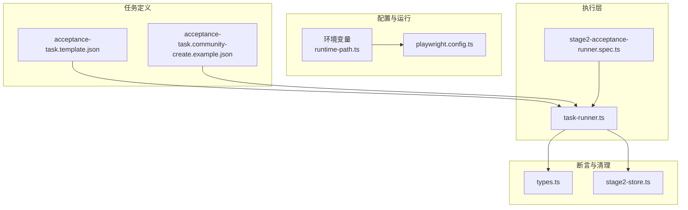
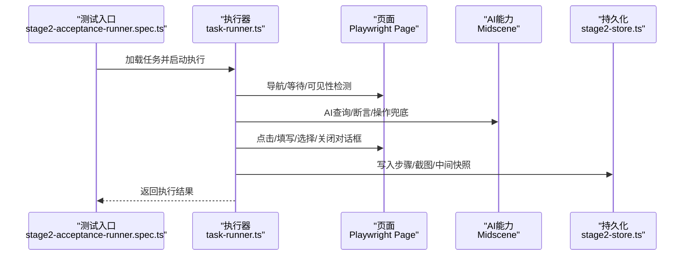
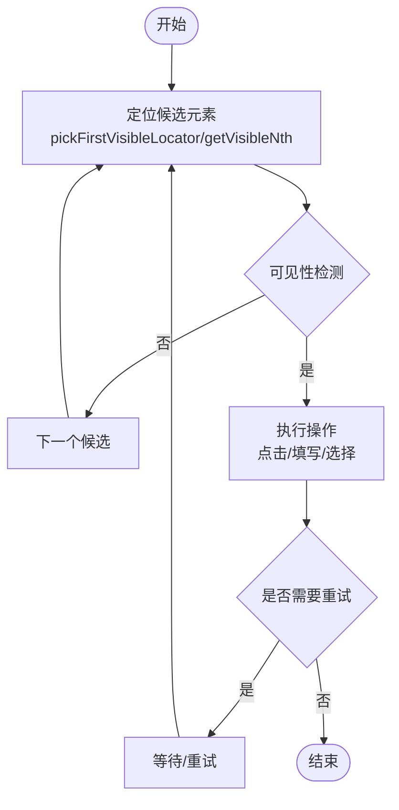
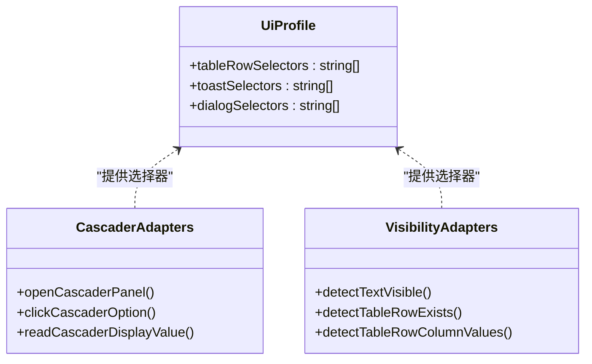
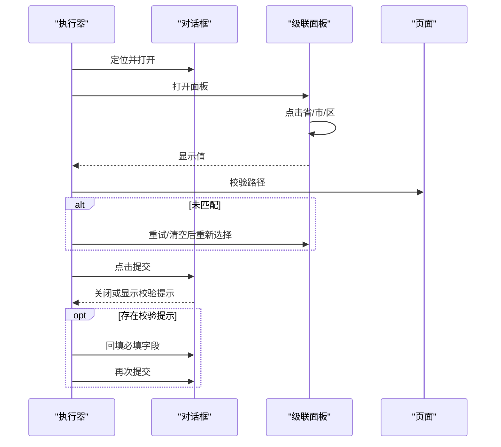
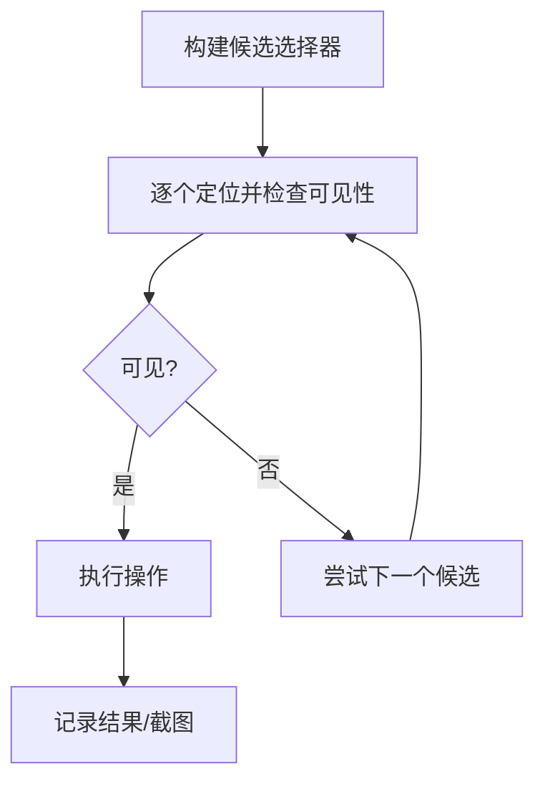
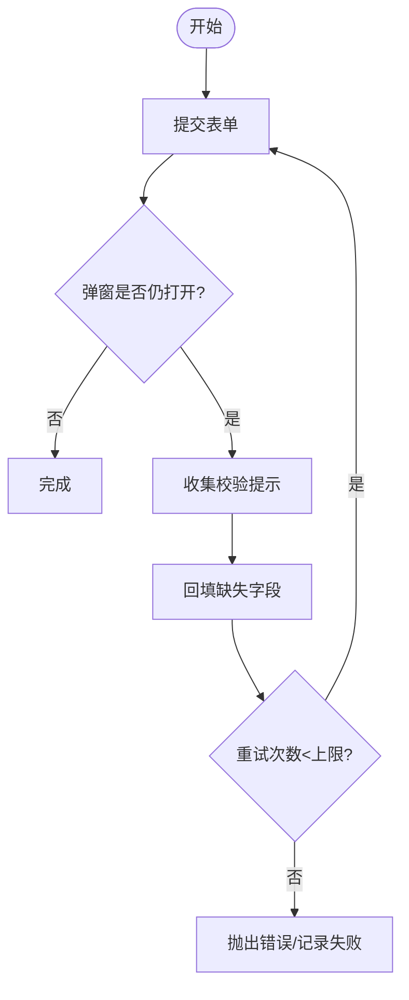
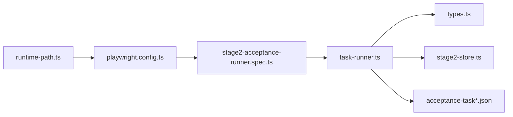

# 页面交互 API

<cite>
**本文引用的文件**
- [README.md](file://README.md)
- [playwright.config.ts](file://playwright.config.ts)
- [src/stage2/task-runner.ts](file://src/stage2/task-runner.ts)
- [src/stage2/types.ts](file://src/stage2/types.ts)
- [src/persistence/stage2-store.ts](file://src/persistence/stage2-store.ts)
- [tests/generated/stage2-acceptance-runner.spec.ts](file://tests/generated/stage2-acceptance-runner.spec.ts)
- [specs/taks/acceptance-task.template.json](file://specs/taks/acceptance-task.template.json)
- [specs/taks/acceptance-task.community-create.example.json](file://specs/taks/acceptance-task.community-create.example.json)
- [specs/basic-operations.md](file://specs/basic-operations.md)
- [specs/login-e2e.md](file://specs/login-e2e.md)
- [config/runtime-path.ts](file://config/runtime-path.ts)
</cite>

## 目录
1. [简介](#简介)
2. [项目结构](#项目结构)
3. [核心组件](#核心组件)
4. [架构总览](#架构总览)
5. [详细组件分析](#详细组件分析)
6. [依赖关系分析](#依赖关系分析)
7. [性能考量](#性能考量)
8. [故障排查指南](#故障排查指南)
9. [结论](#结论)
10. [附录](#附录)

## 简介
本文件面向“页面交互 API”的使用者与维护者，系统化梳理基于 Playwright 与 Midscene.js 的页面自动化交互能力，覆盖元素定位、点击、填写、选择、对话框与级联选择器操作、可见性检测与重试机制、以及多 UI 框架（Element Plus、Ant Design、iView）的兼容策略。文档同时给出任务驱动的执行流程、断言与清理策略、错误处理与重试、最佳实践与常见模式，帮助读者快速上手并稳定扩展。

## 项目结构
本项目采用“任务驱动 + JSON 描述 + Playwright + Midscene”的分层组织方式：
- 顶层配置与运行产物路径：通过环境变量集中管理运行目录与报告输出。
- 任务定义：以 JSON 文件描述页面导航、表单字段、断言与清理策略。
- 执行器：基于 Playwright 的页面对象与 Midscene 的 AI 能力，按任务逐步执行。
- 断言与清理：内置通用断言与清理流程，支持多种 UI 框架的适配选择器。
- 持久化：将执行结果、步骤、截图与中间快照写入本地 SQLite 数据库。

**图表来源**
- [playwright.config.ts:1-95](file://playwright.config.ts#L1-L95)
- [config/runtime-path.ts:1-46](file://config/runtime-path.ts#L1-L46)
- [specs/taks/acceptance-task.template.json:1-141](file://specs/taks/acceptance-task.template.json#L1-L141)
- [specs/taks/acceptance-task.community-create.example.json:1-229](file://specs/taks/acceptance-task.community-create.example.json#L1-L229)
- [tests/generated/stage2-acceptance-runner.spec.ts:1-39](file://tests/generated/stage2-acceptance-runner.spec.ts#L1-L39)
- [src/stage2/task-runner.ts:1-200](file://src/stage2/task-runner.ts#L1-L200)
- [src/stage2/types.ts:1-180](file://src/stage2/types.ts#L1-L180)
- [src/persistence/stage2-store.ts:1-120](file://src/persistence/stage2-store.ts#L1-L120)

**章节来源**
- [README.md:132-190](file://README.md#L132-L190)
- [playwright.config.ts:1-95](file://playwright.config.ts#L1-L95)
- [config/runtime-path.ts:1-46](file://config/runtime-path.ts#L1-L46)

## 核心组件
- 任务执行器（task-runner.ts）：封装页面交互 API、可见性检测、重试机制、滑块验证码处理、级联选择器、对话框与表单提交、断言与清理。
- 类型定义（types.ts）：统一任务结构、断言、清理策略、运行时配置等。
- 执行入口（stage2-acceptance-runner.spec.ts）：Playwright 测试入口，注入 AI 能力并驱动任务执行。
- 持久化（stage2-store.ts）：将执行结果、步骤、截图与中间快照写入 SQLite。
- 任务模板（acceptance-task.template.json、community-create.example.json）：描述导航、表单、断言与清理策略。
- 基础用例（basic-operations.md、login-e2e.md）：演示基本交互与登录场景。

**章节来源**
- [src/stage2/task-runner.ts:1-200](file://src/stage2/task-runner.ts#L1-L200)
- [src/stage2/types.ts:1-180](file://src/stage2/types.ts#L1-L180)
- [tests/generated/stage2-acceptance-runner.spec.ts:1-39](file://tests/generated/stage2-acceptance-runner.spec.ts#L1-L39)
- [src/persistence/stage2-store.ts:1-120](file://src/persistence/stage2-store.ts#L1-L120)
- [specs/taks/acceptance-task.template.json:1-141](file://specs/taks/acceptance-task.template.json#L1-L141)
- [specs/taks/acceptance-task.community-create.example.json:1-229](file://specs/taks/acceptance-task.community-create.example.json#L1-L229)
- [specs/basic-operations.md:1-34](file://specs/basic-operations.md#L1-L34)
- [specs/login-e2e.md:1-152](file://specs/login-e2e.md#L1-L152)

## 架构总览
页面交互 API 的执行链路如下：
- 读取任务 JSON，解析导航、表单、断言与清理策略。
- 使用 Playwright 定位元素，结合 Midscene 的 AI 能力进行兜底。
- 对话框、级联选择器、表单填写、按钮点击、文本可见性检测、表格行/列断言、确认弹窗处理、数据清理。
- 执行期间写入进度快照与步骤截图，最终落库。

**图表来源**
- [tests/generated/stage2-acceptance-runner.spec.ts:12-37](file://tests/generated/stage2-acceptance-runner.spec.ts#L12-L37)
- [src/stage2/task-runner.ts:2318-2399](file://src/stage2/task-runner.ts#L2318-L2399)
- [src/persistence/stage2-store.ts:470-590](file://src/persistence/stage2-store.ts#L470-L590)

## 详细组件分析

### 页面交互 API 规范
- 元素定位与可见性检测
  - 优先使用 Playwright 的 getByRole/getByText 等语义化定位；对不可见或不可用元素进行过滤与重试。
  - 提供 pickFirstVisibleLocator、getVisibleNth、isLocatorVisible 等工具函数，确保在多候选选择器中选取首个可见元素。
  - 文本可见性检测支持精确/模糊匹配与 Toast/Alert 组件检测。
- 点击操作
  - tryClickLocator：遍历候选定位器，逐个检查可见性后点击，失败则返回 false。
  - clickButtonWithCandidates：对按钮文案进行精确/宽松匹配，支持多候选文案。
- 填写操作
  - fillTextboxWithLabel：优先按角色定位，其次按占位文案定位，最后兜底到 AI。
  - fillField：针对 cascader 级联字段，提供打开面板、逐级点击选项、校验显示值与重试机制。
- 选择与级联
  - openCascaderPanel：打开级联面板，优先使用可见输入框，否则使用 AI。
  - clickCascaderOption：按层级定位菜单，支持 Element Plus、Ant Design、iView 的多种面板结构。
  - readCascaderDisplayValue：读取级联输入框显示值，用于路径校验。
- 对话框与表单提交
  - getActiveDialogLocator：定位当前可见对话框，支持多框架容器。
  - submitFormWithAutoFix：提交后自动检测弹窗是否关闭，若仍有校验提示则回填对应字段并重试。
  - collectValidationMessages：收集各框架的错误提示类选择器，用于定位必填/必选字段。
- 可见性检测与重试
  - waitVisibleByText：按文本等待元素可见。
  - executeAssertionWithRetry：断言执行的统一重试包装器，支持延迟与最大重试次数。
- 动态定位与多框架兼容
  - 通过 uiProfile 与默认选择器列表，为表格行、Toast/消息、对话框容器提供跨框架适配。
  - 级联面板选择器覆盖 .el-cascader-*、.ant-cascader-*、.ivu-cascader-* 等命名空间。

**图表来源**
- [src/stage2/task-runner.ts:165-205](file://src/stage2/task-runner.ts#L165-L205)
- [src/stage2/task-runner.ts:414-431](file://src/stage2/task-runner.ts#L414-L431)
- [src/stage2/task-runner.ts:818-847](file://src/stage2/task-runner.ts#L818-L847)
- [src/stage2/task-runner.ts:897-974](file://src/stage2/task-runner.ts#L897-L974)

**章节来源**
- [src/stage2/task-runner.ts:165-205](file://src/stage2/task-runner.ts#L165-L205)
- [src/stage2/task-runner.ts:414-431](file://src/stage2/task-runner.ts#L414-L431)
- [src/stage2/task-runner.ts:818-847](file://src/stage2/task-runner.ts#L818-L847)
- [src/stage2/task-runner.ts:897-974](file://src/stage2/task-runner.ts#L897-L974)
- [src/stage2/task-runner.ts:708-788](file://src/stage2/task-runner.ts#L708-L788)
- [src/stage2/task-runner.ts:453-467](file://src/stage2/task-runner.ts#L453-L467)
- [src/stage2/task-runner.ts:1532-1556](file://src/stage2/task-runner.ts#L1532-L1556)

### 多框架 UI 兼容性与适配策略
- 表格行选择器优先级
  - 默认包含 table tbody tr、.el-table__body tr、.ant-table-tbody tr、.ivu-table-tbody tr、[role="row"] 等。
  - 可通过 uiProfile.tableRowSelectors 扩展平台特定选择器。
- Toast/消息提示
  - 默认包含 .el-message、.el-notification、.ant-message、.ant-notification、.ivu-message、.ivu-notice、[role="alert"] 等。
  - 可通过 uiProfile.toastSelectors 自定义。
- 对话框容器
  - 默认包含 div[role="dialog"]、.el-dialog__wrapper、.el-message-box__wrapper、.ant-modal-wrap、.ant-modal-confirm、.ivu-modal-wrap、[class*="confirm"]、[class*="modal"] 等。
  - 可通过 uiProfile.dialogSelectors 自定义。
- 级联选择器
  - 输入框与菜单容器覆盖 .el-cascader-*、.ant-cascader-*、.ivu-cascader-* 命名空间。
  - 通过 openCascaderPanel 与 clickCascaderOption 适配不同层级与文本匹配策略。

**图表来源**
- [src/stage2/types.ts:58-65](file://src/stage2/types.ts#L58-L65)
- [src/stage2/task-runner.ts:1030-1058](file://src/stage2/task-runner.ts#L1030-L1058)
- [src/stage2/task-runner.ts:708-788](file://src/stage2/task-runner.ts#L708-L788)
- [src/stage2/task-runner.ts:1278-1322](file://src/stage2/task-runner.ts#L1278-L1322)
- [src/stage2/task-runner.ts:1327-1367](file://src/stage2/task-runner.ts#L1327-L1367)
- [src/stage2/task-runner.ts:1463-1527](file://src/stage2/task-runner.ts#L1463-L1527)

**章节来源**
- [src/stage2/types.ts:58-65](file://src/stage2/types.ts#L58-L65)
- [src/stage2/task-runner.ts:1030-1058](file://src/stage2/task-runner.ts#L1030-L1058)
- [src/stage2/task-runner.ts:708-788](file://src/stage2/task-runner.ts#L708-L788)

### 级联选择器、对话框与表单填充示例（基于任务模板）
- 级联选择器
  - 字段类型为 cascader，值为层级数组（如 ["省", "市", "区"]）。
  - 执行流程：打开面板 -> 逐级点击选项 -> 校验显示值 -> 失败重试 -> 超限报错。
- 对话框操作
  - 通过 getActiveDialogLocator 获取当前可见对话框，提交后若弹窗未关闭则收集校验提示并回填。
- 表单填充
  - fillField 统一处理单行/多行输入与占位文案候选，必要时使用 AI 填写。

**图表来源**
- [src/stage2/task-runner.ts:897-974](file://src/stage2/task-runner.ts#L897-L974)
- [src/stage2/task-runner.ts:708-788](file://src/stage2/task-runner.ts#L708-L788)
- [src/stage2/task-runner.ts:976-1021](file://src/stage2/task-runner.ts#L976-L1021)

**章节来源**
- [specs/taks/acceptance-task.template.json:52-63](file://specs/taks/acceptance-task.template.json#L52-L63)
- [specs/taks/acceptance-task.community-create.example.json:82-97](file://specs/taks/acceptance-task.community-create.example.json#L82-L97)
- [src/stage2/task-runner.ts:897-974](file://src/stage2/task-runner.ts#L897-L974)
- [src/stage2/task-runner.ts:708-788](file://src/stage2/task-runner.ts#L708-L788)
- [src/stage2/task-runner.ts:976-1021](file://src/stage2/task-runner.ts#L976-L1021)

### 动态定位机制与可见性检测策略
- 动态定位
  - 通过候选选择器列表与正则/文本匹配组合，提升跨框架稳定性。
  - getActiveDialogLocator、buildCascaderInputCandidates 等函数根据上下文动态构建定位候选。
- 可见性检测
  - isVisible 优先检测元素可见性；对模糊/精确文本匹配分别提供 getByText 策略。
  - detectTextVisible/detectTableRowExists/detectTableRowColumnValues 支持轮询与超时控制。

**图表来源**
- [src/stage2/task-runner.ts:165-205](file://src/stage2/task-runner.ts#L165-L205)
- [src/stage2/task-runner.ts:414-431](file://src/stage2/task-runner.ts#L414-L431)
- [src/stage2/task-runner.ts:1278-1322](file://src/stage2/task-runner.ts#L1278-L1322)
- [src/stage2/task-runner.ts:1327-1367](file://src/stage2/task-runner.ts#L1327-L1367)
- [src/stage2/task-runner.ts:1463-1527](file://src/stage2/task-runner.ts#L1463-L1527)

**章节来源**
- [src/stage2/task-runner.ts:165-205](file://src/stage2/task-runner.ts#L165-L205)
- [src/stage2/task-runner.ts:414-431](file://src/stage2/task-runner.ts#L414-L431)
- [src/stage2/task-runner.ts:1278-1322](file://src/stage2/task-runner.ts#L1278-L1322)
- [src/stage2/task-runner.ts:1327-1367](file://src/stage2/task-runner.ts#L1327-L1367)
- [src/stage2/task-runner.ts:1463-1527](file://src/stage2/task-runner.ts#L1463-L1527)

### 错误处理与重试机制
- 统一重试包装
  - executeAssertionWithRetry：对断言执行进行重试，支持最大重试次数与延迟。
- 表单提交自动修复
  - submitFormWithAutoFix：提交后若弹窗未关闭，收集校验提示并回填对应字段，最多重试 N 次。
- 滑块验证码处理
  - detectCaptchaChallenge：检测滑块文案/容器。
  - autoSolveSliderCaptcha：AI 查询位置与轨道宽度，模拟真人拖动轨迹，最多重试 N 次。
- 清理流程
  - runCleanup：支持删除已创建/全部匹配/自定义策略，失败可选择继续或中断。

**图表来源**
- [src/stage2/task-runner.ts:976-1021](file://src/stage2/task-runner.ts#L976-L1021)
- [src/stage2/task-runner.ts:650-706](file://src/stage2/task-runner.ts#L650-L706)
- [src/stage2/task-runner.ts:561-648](file://src/stage2/task-runner.ts#L561-L648)

**章节来源**
- [src/stage2/task-runner.ts:976-1021](file://src/stage2/task-runner.ts#L976-L1021)
- [src/stage2/task-runner.ts:650-706](file://src/stage2/task-runner.ts#L650-L706)
- [src/stage2/task-runner.ts:561-648](file://src/stage2/task-runner.ts#L561-L648)
- [src/stage2/task-runner.ts:1532-1556](file://src/stage2/task-runner.ts#L1532-L1556)

### 页面交互 API 最佳实践与常见模式
- 优先使用 Playwright 语义化定位（getByRole/getByLabel），降低对 DOM 结构的耦合。
- 对复杂 UI（级联、对话框、表格）使用统一的适配策略与重试机制。
- 在任务 JSON 中通过 uiProfile 扩展平台特定选择器，避免在代码中硬编码。
- 对表单提交失败场景，优先收集校验提示并自动修复，减少人工干预。
- 启用截图与持久化，便于问题复盘与审计。

**章节来源**
- [README.md:146-152](file://README.md#L146-L152)
- [specs/taks/acceptance-task.template.json:29-45](file://specs/taks/acceptance-task.template.json#L29-L45)
- [src/stage2/task-runner.ts:976-1021](file://src/stage2/task-runner.ts#L976-L1021)

## 依赖关系分析
- 执行入口依赖执行器与 AI 能力；执行器依赖类型定义与持久化模块。
- 任务模板提供运行时配置（uiProfile、断言、清理策略）。
- 配置文件集中管理运行目录与报告输出。

**图表来源**
- [tests/generated/stage2-acceptance-runner.spec.ts:12-37](file://tests/generated/stage2-acceptance-runner.spec.ts#L12-L37)
- [src/stage2/task-runner.ts:1-200](file://src/stage2/task-runner.ts#L1-L200)
- [src/stage2/types.ts:1-180](file://src/stage2/types.ts#L1-L180)
- [src/persistence/stage2-store.ts:1-120](file://src/persistence/stage2-store.ts#L1-L120)
- [specs/taks/acceptance-task.template.json:1-141](file://specs/taks/acceptance-task.template.json#L1-L141)
- [playwright.config.ts:1-95](file://playwright.config.ts#L1-L95)
- [config/runtime-path.ts:1-46](file://config/runtime-path.ts#L1-L46)

**章节来源**
- [tests/generated/stage2-acceptance-runner.spec.ts:12-37](file://tests/generated/stage2-acceptance-runner.spec.ts#L12-L37)
- [src/stage2/task-runner.ts:1-200](file://src/stage2/task-runner.ts#L1-L200)
- [src/stage2/types.ts:1-180](file://src/stage2/types.ts#L1-L180)
- [src/persistence/stage2-store.ts:1-120](file://src/persistence/stage2-store.ts#L1-L120)
- [specs/taks/acceptance-task.template.json:1-141](file://specs/taks/acceptance-task.template.json#L1-L141)
- [playwright.config.ts:1-95](file://playwright.config.ts#L1-L95)
- [config/runtime-path.ts:1-46](file://config/runtime-path.ts#L1-L46)

## 性能考量
- 重试与轮询
  - 断言与可见性检测采用轮询与固定延迟，建议根据页面复杂度与网络状况调整超时与重试次数。
- 截图与持久化
  - 步骤截图与中间快照有助于定位问题，但会增加 IO 压力，建议在调试阶段开启，生产环境按需关闭。
- 滑块验证码
  - 自动拖动轨迹模拟与多次重试可能影响整体耗时，建议在 CI 环境中合理设置等待时间与重试上限。

[本节为通用指导，无需列出具体文件来源]

## 故障排查指南
- 选择器失效
  - 检查 uiProfile 是否覆盖了目标框架的容器与组件类名；优先使用语义化定位。
- 级联选择失败
  - 确认层级路径与显示值校验逻辑；必要时增加截图与日志定位。
- 表单提交后弹窗未关闭
  - 使用 collectValidationMessages 收集提示，结合 submitFormWithAutoFix 自动修复。
- 滑块验证码
  - 检查 detectCaptchaChallenge 的文案/容器匹配；必要时调整选择器或切换为 manual 模式。
- 清理失败
  - 检查 rowMatchMode 与 searchBeforeCleanup；确认确认弹窗标题与按钮文案。

**章节来源**
- [src/stage2/task-runner.ts:338-407](file://src/stage2/task-runner.ts#L338-L407)
- [src/stage2/task-runner.ts:976-1021](file://src/stage2/task-runner.ts#L976-L1021)
- [src/stage2/task-runner.ts:650-706](file://src/stage2/task-runner.ts#L650-L706)
- [src/stage2/task-runner.ts:2218-2316](file://src/stage2/task-runner.ts#L2218-L2316)

## 结论
本页面交互 API 通过“Playwright 语义化定位 + Midscene AI 兜底 + 统一重试与可见性检测”的策略，实现了对多 UI 框架（Element Plus、Ant Design、iView）的稳定兼容。配合任务驱动的断言与清理流程，能够高效完成复杂的页面操作与验收任务。建议在实际项目中结合 uiProfile 与任务模板，持续优化选择器与重试策略，以获得更稳健的自动化体验。

[本节为总结性内容，无需列出具体文件来源]

## 附录
- 基础用例参考
  - TodoMVC 基本操作与登录端到端测试计划，可用于理解基本交互与断言思路。
- 运行与产物
  - 通过 playwright.config.ts 与 runtime-path.ts 统一管理运行目录与报告输出。

**章节来源**
- [specs/basic-operations.md:1-34](file://specs/basic-operations.md#L1-L34)
- [specs/login-e2e.md:1-152](file://specs/login-e2e.md#L1-L152)
- [playwright.config.ts:1-95](file://playwright.config.ts#L1-L95)
- [config/runtime-path.ts:1-46](file://config/runtime-path.ts#L1-L46)