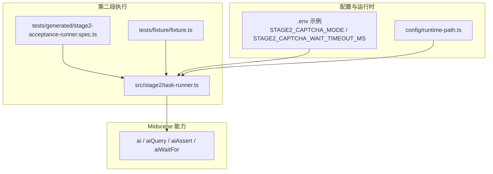
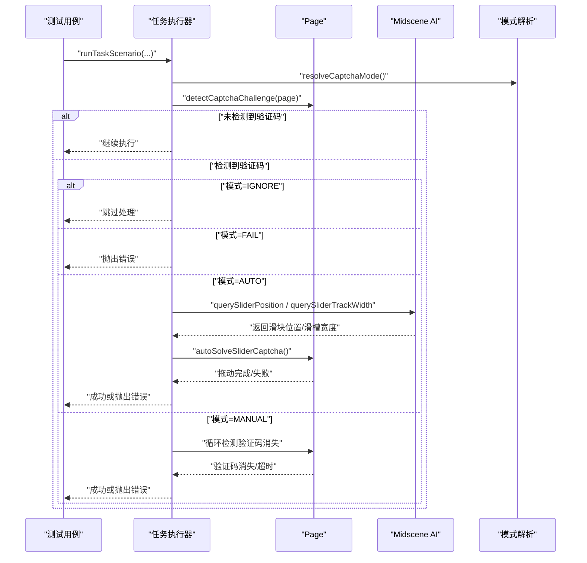
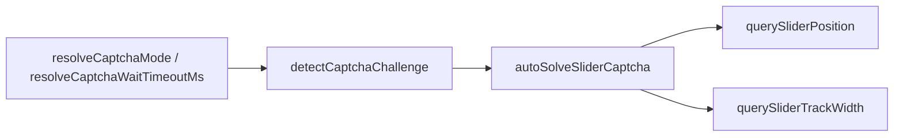

# 验证码处理 API

<cite>
**本文引用的文件**
- [README.md](file://README.md)
- [task-runner.ts](file://src/stage2/task-runner.ts)
- [stage2-acceptance-runner.spec.ts](file://tests/generated/stage2-acceptance-runner.spec.ts)
- [fixture.ts](file://tests/fixture/fixture.ts)
- [types.ts](file://src/stage2/types.ts)
- [runtime-path.ts](file://config/runtime-path.ts)
- [.env 示例](file://README.md)
</cite>

## 目录
1. [简介](#简介)
2. [项目结构](#项目结构)
3. [核心组件](#核心组件)
4. [架构概览](#架构概览)
5. [详细组件分析](#详细组件分析)
6. [依赖关系分析](#依赖关系分析)
7. [性能考量](#性能考量)
8. [故障排除指南](#故障排除指南)
9. [结论](#结论)
10. [附录](#附录)

## 简介
本文件面向第二段（Stage2）自动化执行中的验证码处理 API，重点覆盖以下函数的完整接口规范与行为说明：
- handleCaptchaChallengeIfNeeded：按配置自动检测并处理滑块验证码，支持自动模式、人工兜底模式、失败即停与忽略模式
- detectCaptchaChallenge：检测页面是否存在滑块/安全验证
- autoSolveSliderCaptcha：基于 Midscene AI 识别滑块位置与滑槽宽度，并使用 Playwright 模拟真人拖动轨迹完成滑块验证

文档还解释了验证码检测机制（文本关键词与选择器）、配置项（STAGE2_CAPTCHA_MODE、STAGE2_CAPTCHA_WAIT_TIMEOUT_MS）的作用与调优建议，并提供错误处理与超时机制说明及最佳实践。

## 项目结构
与验证码处理相关的关键文件与职责：
- src/stage2/task-runner.ts：包含验证码处理 API、滑块识别与自动拖动逻辑、环境变量解析与等待策略
- tests/generated/stage2-acceptance-runner.spec.ts：第二段执行入口，调用 runTaskScenario 并触发验证码处理
- tests/fixture/fixture.ts：提供 ai、aiQuery、aiAssert、aiWaitFor 等 Midscene 能力注入
- src/stage2/types.ts：任务与执行结果的数据模型，包含 UI Profile、断言等
- config/runtime-path.ts：运行时目录解析，影响结果输出与截图保存路径
- README.md：包含 .env 示例与验证码处理说明

图表来源
- [stage2-acceptance-runner.spec.ts:12-37](file://tests/generated/stage2-acceptance-runner.spec.ts#L12-L37)
- [fixture.ts:23-99](file://tests/fixture/fixture.ts#L23-L99)
- [task-runner.ts:61-87](file://src/stage2/task-runner.ts#L61-L87)
- [runtime-path.ts:43-45](file://config/runtime-path.ts#L43-L45)
- [README.md:39-64](file://README.md#L39-L64)

章节来源
- [README.md:39-64](file://README.md#L39-L64)
- [stage2-acceptance-runner.spec.ts:12-37](file://tests/generated/stage2-acceptance-runner.spec.ts#L12-L37)
- [fixture.ts:23-99](file://tests/fixture/fixture.ts#L23-L99)
- [task-runner.ts:61-87](file://src/stage2/task-runner.ts#L61-L87)
- [runtime-path.ts:43-45](file://config/runtime-path.ts#L43-L45)

## 核心组件
- 验证码处理模式枚举与默认值
  - CAPTCHA_MODE_AUTO、CAPTCHA_MODE_MANUAL、CAPTCHA_MODE_FAIL、CAPTCHA_MODE_IGNORE
  - 默认模式：AUTO
- 环境变量解析
  - STAGE2_CAPTCHA_MODE：解析为上述模式之一
  - STAGE2_CAPTCHA_WAIT_TIMEOUT_MS：解析为毫秒数，作为人工兜底等待超时
- 检测策略
  - 文本关键词：请完成安全验证、请按住滑块、拖动到最右边、向右滑动
  - 选择器集合：.nc_wrapper、.nc_scale、[id^="nc_"][id$="_wrapper"]、[class*="captcha"]
- 滑块识别与拖动
  - aiQuery 识别滑块中心点坐标与尺寸
  - aiQuery 识别滑槽宽度
  - Playwright mouse API 模拟拖动轨迹（15 步、easeOut 缓动、随机抖动）

章节来源
- [task-runner.ts:35-59](file://src/stage2/task-runner.ts#L35-L59)
- [task-runner.ts:61-87](file://src/stage2/task-runner.ts#L61-L87)
- [task-runner.ts:42-53](file://src/stage2/task-runner.ts#L42-L53)
- [task-runner.ts:510-559](file://src/stage2/task-runner.ts#L510-L559)
- [task-runner.ts:561-648](file://src/stage2/task-runner.ts#L561-L648)

## 架构概览
验证码处理在第二段执行流程中的位置与调用关系如下：

图表来源
- [task-runner.ts:650-706](file://src/stage2/task-runner.ts#L650-L706)
- [task-runner.ts:483-501](file://src/stage2/task-runner.ts#L483-L501)
- [task-runner.ts:510-559](file://src/stage2/task-runner.ts#L510-L559)
- [task-runner.ts:561-648](file://src/stage2/task-runner.ts#L561-L648)
- [task-runner.ts:61-87](file://src/stage2/task-runner.ts#L61-L87)

## 详细组件分析

### 函数：handleCaptchaChallengeIfNeeded
- 功能概述
  - 根据配置决定是否处理验证码
  - 若检测到验证码，按模式执行自动处理、人工等待或直接失败
- 参数
  - runner：包含 page、ai、aiAssert、aiQuery、aiWaitFor 的上下文对象
- 返回值
  - 无返回值；若处理失败则抛出错误
- 调用约定
  - 在每个关键步骤前后调用，确保在可能触发验证码的交互之后进行检测
- 处理流程
  - 解析模式 resolveCaptchaMode()
  - 若模式为 IGNORE，直接返回
  - 检测 detectCaptchaChallenge(page)
  - 若模式为 FAIL，抛出错误
  - 若模式为 AUTO：最多尝试 3 次 autoSolveSliderCaptcha，每次失败间隔 2 秒
  - 若模式为 MANUAL：以默认轮询间隔持续检测验证码消失，直到超时
- 错误与超时
  - AUTO 模式：超过最大尝试次数后抛出错误
  - MANUAL 模式：超过 STAGE2_CAPTCHA_WAIT_TIMEOUT_MS 后抛出错误

章节来源
- [task-runner.ts:650-706](file://src/stage2/task-runner.ts#L650-L706)
- [task-runner.ts:61-87](file://src/stage2/task-runner.ts#L61-L87)

### 函数：detectCaptchaChallenge
- 功能概述
  - 检测页面是否存在滑块/安全验证
- 参数
  - page：Playwright Page 实例
- 返回值
  - boolean：存在验证码返回 true，否则 false
- 检测策略
  - 文本关键词匹配（任意出现即视为存在）
  - 选择器匹配（任意可见元素匹配即视为存在）

章节来源
- [task-runner.ts:483-501](file://src/stage2/task-runner.ts#L483-L501)
- [task-runner.ts:42-53](file://src/stage2/task-runner.ts#L42-L53)

### 函数：autoSolveSliderCaptcha
- 功能概述
  - 基于 Midscene AI 识别滑块位置与滑槽宽度，使用 Playwright 模拟真人拖动轨迹完成滑块验证
- 参数
  - runner：包含 page、aiQuery 的上下文对象
- 返回值
  - boolean：验证成功返回 true，失败返回 false
- 处理流程
  - querySliderPosition：获取滑块中心点坐标与尺寸
  - querySliderTrackWidth：获取滑槽宽度
  - 计算目标位置（考虑滑槽宽度或固定偏移）
  - 模拟拖动：移动到滑块、按下鼠标、15 步 easeOut 缓动轨迹、随机抖动、释放鼠标
  - 等待并再次检测验证码是否消失
- 错误处理
  - 捕获拖动过程异常，确保释放鼠标并返回 false

章节来源
- [task-runner.ts:561-648](file://src/stage2/task-runner.ts#L561-L648)
- [task-runner.ts:510-559](file://src/stage2/task-runner.ts#L510-L559)

### 配置项与环境变量
- STAGE2_CAPTCHA_MODE
  - 可选值：auto、manual、fail、ignore
  - 默认值：auto
  - 作用：控制验证码处理策略
- STAGE2_CAPTCHA_WAIT_TIMEOUT_MS
  - 类型：正整数（毫秒）
  - 默认值：120000（2 分钟）
  - 作用：manual 模式下等待验证码完成的最大时长

章节来源
- [README.md:54-64](file://README.md#L54-L64)
- [task-runner.ts:61-87](file://src/stage2/task-runner.ts#L61-L87)

### 代码示例（路径指引）
- 自动处理滑块验证码（含重试与错误抛出）
  - [handleCaptchaChallengeIfNeeded 调用链:650-706](file://src/stage2/task-runner.ts#L650-L706)
- 人工兜底模式（等待验证码消失）
  - [MANUAL 模式等待循环:688-706](file://src/stage2/task-runner.ts#L688-L706)
- 滑块识别与拖动
  - [querySliderPosition:510-559](file://src/stage2/task-runner.ts#L510-L559)
  - [querySliderTrackWidth:540-559](file://src/stage2/task-runner.ts#L540-L559)
  - [autoSolveSliderCaptcha:561-648](file://src/stage2/task-runner.ts#L561-L648)
- Midscene 能力注入（ai、aiQuery、aiAssert、aiWaitFor）
  - [fixture.ts 中的能力注入:23-99](file://tests/fixture/fixture.ts#L23-L99)

章节来源
- [task-runner.ts:650-706](file://src/stage2/task-runner.ts#L650-L706)
- [task-runner.ts:510-559](file://src/stage2/task-runner.ts#L510-L559)
- [task-runner.ts:540-559](file://src/stage2/task-runner.ts#L540-L559)
- [task-runner.ts:561-648](file://src/stage2/task-runner.ts#L561-L648)
- [fixture.ts:23-99](file://tests/fixture/fixture.ts#L23-L99)

## 依赖关系分析
- 组件耦合
  - handleCaptchaChallengeIfNeeded 依赖 detectCaptchaChallenge、resolveCaptchaMode、resolveCaptchaWaitTimeoutMs
  - autoSolveSliderCaptcha 依赖 querySliderPosition、querySliderTrackWidth、detectCaptchaChallenge
  - querySliderPosition/querySliderTrackWidth 依赖 runner.aiQuery
- 外部依赖
  - Playwright Page、Locator、mouse API
  - Midscene aiQuery、ai 系列能力
- 环境变量
  - 通过 process.env 读取 STAGE2_CAPTCHA_MODE、STAGE2_CAPTCHA_WAIT_TIMEOUT_MS

图表来源
- [task-runner.ts:61-87](file://src/stage2/task-runner.ts#L61-L87)
- [task-runner.ts:483-501](file://src/stage2/task-runner.ts#L483-L501)
- [task-runner.ts:510-559](file://src/stage2/task-runner.ts#L510-L559)
- [task-runner.ts:540-559](file://src/stage2/task-runner.ts#L540-L559)
- [task-runner.ts:561-648](file://src/stage2/task-runner.ts#L561-L648)

章节来源
- [task-runner.ts:61-87](file://src/stage2/task-runner.ts#L61-L87)
- [task-runner.ts:483-501](file://src/stage2/task-runner.ts#L483-L501)
- [task-runner.ts:510-559](file://src/stage2/task-runner.ts#L510-L559)
- [task-runner.ts:540-559](file://src/stage2/task-runner.ts#L540-L559)
- [task-runner.ts:561-648](file://src/stage2/task-runner.ts#L561-L648)

## 性能考量
- AUTO 模式
  - 最多 3 次尝试，每次失败间隔 2 秒，避免频繁重试导致的长时间阻塞
  - 拖动轨迹采用 15 步缓动与随机抖动，兼顾成功率与稳定性
- MANUAL 模式
  - 默认轮询间隔约 1 秒，避免过度轮询造成资源浪费
  - 超时时间可通过 STAGE2_CAPTCHA_WAIT_TIMEOUT_MS 调整
- AI 查询
  - querySliderPosition 与 querySliderTrackWidth 在失败时静默忽略错误，保证流程不被中断
- 页面等待
  - 关键步骤包含短暂停顿（如 500ms、200ms）以确保页面稳定

章节来源
- [task-runner.ts:668-686](file://src/stage2/task-runner.ts#L668-L686)
- [task-runner.ts:592-613](file://src/stage2/task-runner.ts#L592-L613)
- [task-runner.ts:694-702](file://src/stage2/task-runner.ts#L694-L702)
- [task-runner.ts:534-537](file://src/stage2/task-runner.ts#L534-L537)

## 故障排除指南
- 症状：AUTO 模式多次尝试后仍失败
  - 排查要点
    - 检查页面截图确认滑块样式是否与 AI 期望一致
    - 调整为 manual 模式进行人工验证
    - 检查并调整滑块检测选择器（CAPTCHA_SELECTOR_PATTERNS）
  - 参考路径
    - [AUTO 模式重试与错误抛出:668-686](file://src/stage2/task-runner.ts#L668-L686)
    - [滑块检测选择器:48-53](file://src/stage2/task-runner.ts#L48-53)
- 症状：MANUAL 模式等待超时
  - 排查要点
    - 增大 STAGE2_CAPTCHA_WAIT_TIMEOUT_MS
    - 确认验证码确实存在且可被人工完成
  - 参考路径
    - [MANUAL 模式等待与超时:688-706](file://src/stage2/task-runner.ts#L688-L706)
    - [等待超时解析:77-87](file://src/stage2/task-runner.ts#L77-L87)
- 症状：滑块拖动失败或鼠标未释放
  - 排查要点
    - 检查页面是否有遮挡或动画干扰
    - 确认拖动轨迹计算合理（滑槽宽度或默认偏移）
  - 参考路径
    - [拖动轨迹与异常处理:561-648](file://src/stage2/task-runner.ts#L561-L648)
- 症状：环境变量未生效
  - 排查要点
    - 确认 .env 文件已正确加载
    - 检查变量大小写与空格
  - 参考路径
    - [.env 示例与说明:39-64](file://README.md#L39-L64)

章节来源
- [task-runner.ts:668-686](file://src/stage2/task-runner.ts#L668-L686)
- [task-runner.ts:48-53](file://src/stage2/task-runner.ts#L48-L53)
- [task-runner.ts:688-706](file://src/stage2/task-runner.ts#L688-L706)
- [task-runner.ts:77-87](file://src/stage2/task-runner.ts#L77-L87)
- [task-runner.ts:561-648](file://src/stage2/task-runner.ts#L561-L648)
- [README.md:39-64](file://README.md#L39-L64)

## 结论
验证码处理 API 提供了灵活的三种模式（自动、人工兜底、失败即停、忽略），并通过 AI 识别与 Playwright 拖动相结合的方式提升滑块验证的成功率。通过合理的配置与调优，可在不同平台与页面样式下稳定运行。建议在生产环境中优先使用 AUTO 模式，并结合 MANUAL 模式作为兜底策略，同时根据页面特性调整检测选择器与等待超时时间。

## 附录

### API 接口规范速览
- handleCaptchaChallengeIfNeeded(runner: RunnerContext): Promise<void>
  - 输入：RunnerContext（包含 page、ai、aiAssert、aiQuery、aiWaitFor）
  - 输出：无；失败抛出错误
  - 行为：按模式处理验证码
- detectCaptchaChallenge(page: Page): Promise<boolean>
  - 输入：Playwright Page
  - 输出：是否存在验证码
  - 行为：文本关键词或选择器检测
- autoSolveSliderCaptcha(runner: RunnerContext): Promise<boolean>
  - 输入：RunnerContext
  - 输出：是否验证成功
  - 行为：AI 识别滑块位置与滑槽宽度，模拟拖动轨迹

章节来源
- [task-runner.ts:650-706](file://src/stage2/task-runner.ts#L650-L706)
- [task-runner.ts:483-501](file://src/stage2/task-runner.ts#L483-L501)
- [task-runner.ts:561-648](file://src/stage2/task-runner.ts#L561-L648)