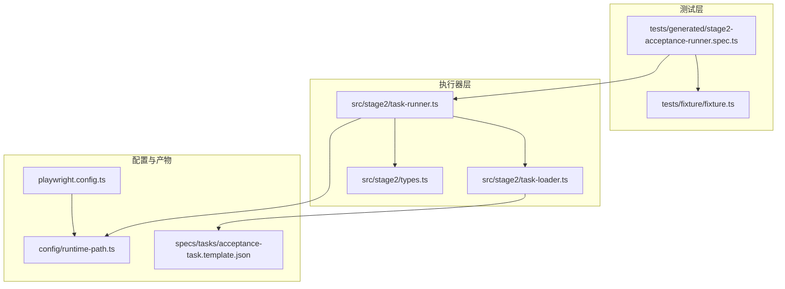
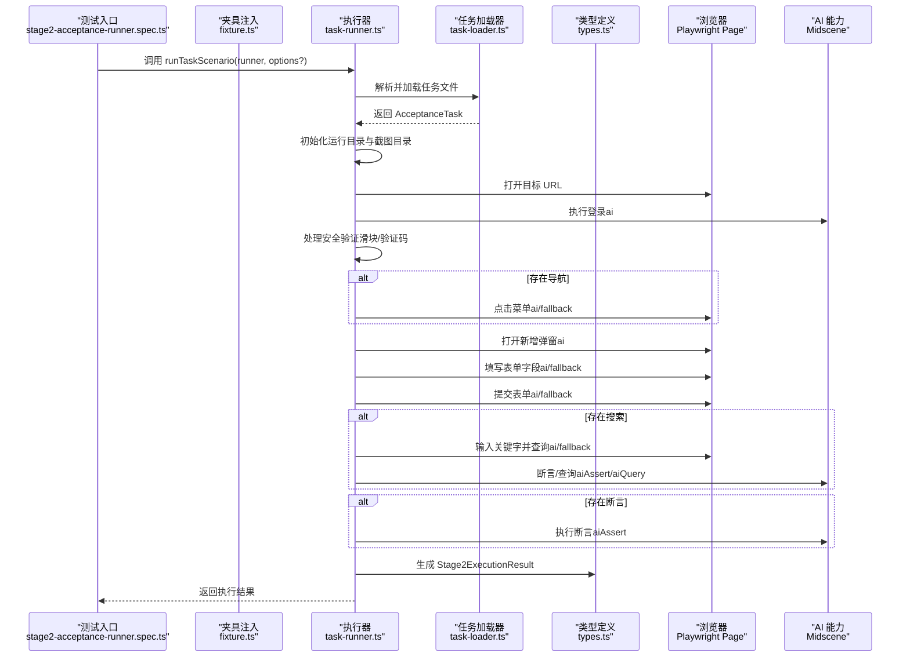
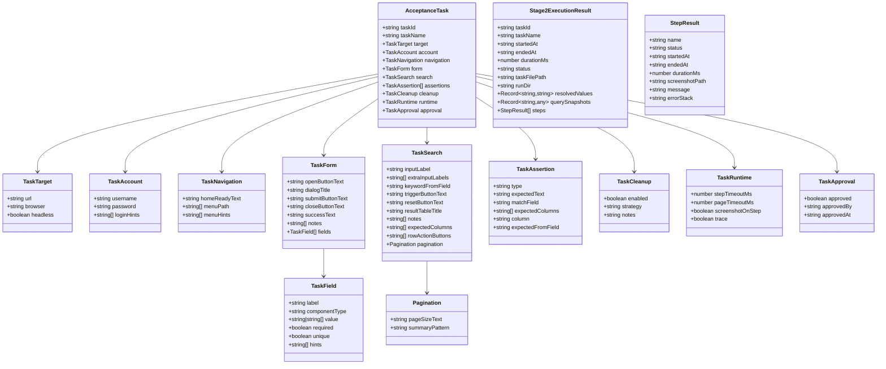
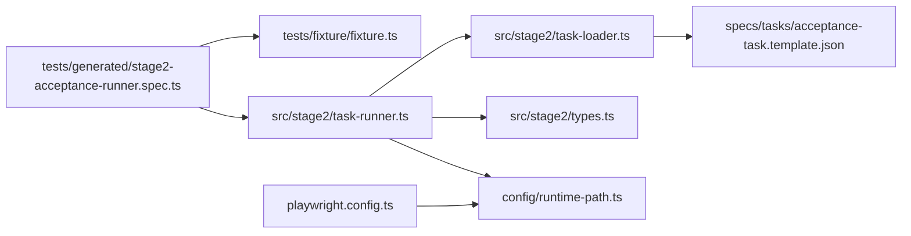

# 执行器 API

<cite>
**本文引用的文件**
- [src/stage2/task-runner.ts](file://src/stage2/task-runner.ts)
- [src/stage2/types.ts](file://src/stage2/types.ts)
- [src/stage2/task-loader.ts](file://src/stage2/task-loader.ts)
- [tests/generated/stage2-acceptance-runner.spec.ts](file://tests/generated/stage2-acceptance-runner.spec.ts)
- [tests/fixture/fixture.ts](file://tests/fixture/fixture.ts)
- [specs/tasks/acceptance-task.template.json](file://specs/tasks/acceptance-task.template.json)
- [config/runtime-path.ts](file://config/runtime-path.ts)
- [playwright.config.ts](file://playwright.config.ts)
- [README.md](file://README.md)
- [package.json](file://package.json)
</cite>

## 目录
1. [简介](#简介)
2. [项目结构](#项目结构)
3. [核心组件](#核心组件)
4. [架构总览](#架构总览)
5. [详细组件分析](#详细组件分析)
6. [依赖关系分析](#依赖关系分析)
7. [性能考虑](#性能考虑)
8. [故障排查指南](#故障排查指南)
9. [结论](#结论)
10. [附录](#附录)

## 简介
本文件为 HI-TEST 项目中的“执行器 API”提供完整文档，重点围绕 runTaskScenario() 函数的接口规范、执行流程、返回值结构、任务类型与策略、状态管理与错误处理、配置项与性能调优，以及与浏览器自动化框架（Playwright + Midscene）的集成方式进行系统化说明。文档同时提供执行示例与最佳实践，帮助开发者快速上手并稳定运行第二段验收任务。

## 项目结构
- 核心执行器位于 src/stage2，包含任务加载、执行器逻辑与类型定义。
- 测试入口位于 tests/generated，通过 Playwright 测试框架驱动执行器。
- 配置与运行目录由 config/runtime-path.ts 统一解析，Playwright 配置文件负责输出与报告。
- 示例任务模板位于 specs/tasks，用于定义可执行的验收任务。

图表来源
- [tests/generated/stage2-acceptance-runner.spec.ts](file://tests/generated/stage2-acceptance-runner.spec.ts#L1-L39)
- [tests/fixture/fixture.ts](file://tests/fixture/fixture.ts#L1-L100)
- [src/stage2/task-runner.ts](file://src/stage2/task-runner.ts#L1062-L1343)
- [src/stage2/task-loader.ts](file://src/stage2/task-loader.ts#L79-L89)
- [src/stage2/types.ts](file://src/stage2/types.ts#L1-L125)
- [playwright.config.ts](file://playwright.config.ts#L1-L95)
- [config/runtime-path.ts](file://config/runtime-path.ts#L1-L41)
- [specs/tasks/acceptance-task.template.json](file://specs/tasks/acceptance-task.template.json#L1-L85)

章节来源
- [README.md](file://README.md#L1-L144)
- [package.json](file://package.json#L1-L24)

## 核心组件
- 执行器入口：runTaskScenario(runner, options?)，负责加载任务、执行步骤、收集结果与截图、写入进度与最终结果。
- 任务加载器：loadTask(taskFilePath)，解析并校验任务 JSON，支持模板变量替换。
- 类型定义：AcceptanceTask、Stage2ExecutionResult、StepResult 等，定义任务结构与执行结果数据模型。
- 夹具与集成：tests/fixture/fixture.ts 将 Midscene 的 ai/aiQuery/aiAssert/aiWaitFor 注入到测试上下文，供执行器调用。

章节来源
- [src/stage2/task-runner.ts](file://src/stage2/task-runner.ts#L1062-L1343)
- [src/stage2/task-loader.ts](file://src/stage2/task-loader.ts#L79-L89)
- [src/stage2/types.ts](file://src/stage2/types.ts#L86-L125)
- [tests/fixture/fixture.ts](file://tests/fixture/fixture.ts#L23-L99)

## 架构总览
执行器以“步骤化流水线”的方式驱动浏览器自动化，结合 Midscene 的 AI 能力进行智能定位与断言。整体流程如下：

图表来源
- [tests/generated/stage2-acceptance-runner.spec.ts](file://tests/generated/stage2-acceptance-runner.spec.ts#L12-L37)
- [tests/fixture/fixture.ts](file://tests/fixture/fixture.ts#L23-L99)
- [src/stage2/task-runner.ts](file://src/stage2/task-runner.ts#L1062-L1343)
- [src/stage2/task-loader.ts](file://src/stage2/task-loader.ts#L79-L89)
- [src/stage2/types.ts](file://src/stage2/types.ts#L111-L123)

## 详细组件分析

### runTaskScenario() 接口规范
- 函数签名
  - 参数
    - runner: RunnerContext
      - 包含 page、ai、aiAssert、aiQuery、aiWaitFor
    - options?: RunnerOptions
      - rawTaskFilePath?: string（可选，覆盖默认任务文件路径）
  - 返回值
    - Promise<Stage2ExecutionResult>
- 功能概述
  - 加载任务文件并校验
  - 根据审批开关决定是否允许执行
  - 创建运行目录与截图目录
  - 以步骤为单位执行任务，记录每个步骤的开始/结束时间、耗时、截图路径、消息与堆栈
  - 支持“必需/可跳过”步骤策略
  - 实时写入部分结果（progress）与最终结果（result.json）

章节来源
- [src/stage2/task-runner.ts](file://src/stage2/task-runner.ts#L1062-L1065)
- [src/stage2/task-runner.ts](file://src/stage2/task-runner.ts#L1066-L1067)
- [src/stage2/task-runner.ts](file://src/stage2/task-runner.ts#L1068-L1073)
- [src/stage2/task-runner.ts](file://src/stage2/task-runner.ts#L1075-L1084)
- [src/stage2/task-runner.ts](file://src/stage2/task-runner.ts#L1108-L1155)
- [src/stage2/task-runner.ts](file://src/stage2/task-runner.ts#L1326-L1342)

### 步骤调度与状态管理
- runStep(stepName, handler, options?)
  - 执行 handler 并捕获异常
  - 成功：记录结束时间与耗时，可选截图
  - 失败：标记状态为 failed（或 skipped，若 required=false），截图、记录 message 与 errorStack，必要时抛出异常
  - 每个步骤结束后写入 partial 结果，便于实时观察
- 步骤类型（示例）
  - 打开系统首页、登录系统、处理安全验证、等待首页加载、点击菜单、打开新增弹窗、等待弹窗显示、填写字段、提交表单、检查提交提示、关闭弹窗、输入搜索条件、点击查询按钮、检查列表包含新增数据、提取列表快照、业务断言等

章节来源
- [src/stage2/task-runner.ts](file://src/stage2/task-runner.ts#L1110-L1155)
- [src/stage2/task-runner.ts](file://src/stage2/task-runner.ts#L1158-L1323)

### 错误处理与容错策略
- 安全验证（滑块/验证码）
  - 支持四种模式：manual（人工）、auto（AI+Playwright 自动拖动）、fail（直接失败）、ignore（忽略）
  - auto 模式下，AI 查询滑块位置与滑槽宽度，Playwright 模拟拖动轨迹，最多重试 3 次
  - manual 模式下，设置超时等待人工完成，超时则失败
- 表单提交自动修复
  - 提交后若弹窗仍存在，收集校验提示，定位必填字段并重新填写，最多重试 3 次
- 级联选择器容错
  - 打开面板、逐级点击选项，校验最终显示值，失败则重试并抛出明确错误
- 断言回退
  - 若断言类型未覆盖，回退到 aiAssert 执行通用断言

章节来源
- [src/stage2/task-runner.ts](file://src/stage2/task-runner.ts#L58-L84)
- [src/stage2/task-runner.ts](file://src/stage2/task-runner.ts#L647-L703)
- [src/stage2/task-runner.ts](file://src/stage2/task-runner.ts#L973-L1018)
- [src/stage2/task-runner.ts](file://src/stage2/task-runner.ts#L907-L941)
- [src/stage2/task-runner.ts](file://src/stage2/task-runner.ts#L1020-L1060)

### 任务类型与执行策略
- AcceptanceTask 字段概览
  - taskId、taskName：任务标识与名称
  - target：目标 URL、浏览器与 headless 设置
  - account：用户名、密码与登录提示
  - navigation：首页就绪文本、菜单路径与菜单提示
  - form：打开按钮文本、弹窗标题、提交按钮文本、关闭按钮文本、成功提示、字段集合
  - search：搜索输入标签、关键词来源字段、触发按钮文本、结果表标题、期望列、行操作按钮、分页配置
  - assertions：断言集合（toast、table-row-exists、table-cell-equals、table-cell-contains 等）
  - cleanup：清理策略
  - runtime：步骤超时、页面超时、每步截图、trace
  - approval：审批状态
- 执行策略
  - 通过 ai/aiQuery/aiAssert/aiWaitFor 驱动页面交互与断言
  - 对于无法直接定位的元素，采用 AI 描述步骤并执行
  - 对于复杂 UI（如级联选择器），提供专门的打开与点击逻辑

章节来源
- [src/stage2/types.ts](file://src/stage2/types.ts#L86-L98)
- [src/stage2/types.ts](file://src/stage2/types.ts#L100-L123)
- [specs/tasks/acceptance-task.template.json](file://specs/tasks/acceptance-task.template.json#L1-L85)

### 执行结果数据结构
- Stage2ExecutionResult
  - taskId、taskName、startedAt、endedAt、durationMs、status、taskFilePath、runDir、resolvedValues、querySnapshots、steps
- StepResult
  - name、status、startedAt、endedAt、durationMs、screenshotPath、message、errorStack

章节来源
- [src/stage2/types.ts](file://src/stage2/types.ts#L111-L123)
- [src/stage2/types.ts](file://src/stage2/types.ts#L100-L109)

### 配置选项与性能调优
- 环境变量
  - STAGE2_TASK_FILE：任务文件路径（相对或绝对）
  - STAGE2_REQUIRE_APPROVAL：是否要求审批后执行
  - STAGE2_CAPTCHA_MODE：验证码处理模式（auto/manual/fail/ignore）
  - STAGE2_CAPTCHA_WAIT_TIMEOUT_MS：人工处理等待时长（毫秒）
- 运行时配置（AcceptanceTask.runtime）
  - stepTimeoutMs：步骤超时
  - pageTimeoutMs：页面跳转超时
  - screenshotOnStep：每步截图
  - trace：是否开启 trace
- 运行目录与产物
  - RUNTIME_DIR_PREFIX：运行目录前缀
  - PLAYWRIGHT_OUTPUT_DIR、PLAYWRIGHT_HTML_REPORT_DIR、MIDSCENE_RUN_DIR、ACCEPTANCE_RESULT_DIR：各产物输出目录
- Playwright 配置
  - 输出目录、HTML 报告目录、trace 策略、项目设备配置等

章节来源
- [README.md](file://README.md#L39-L61)
- [README.md](file://README.md#L74-L92)
- [src/stage2/task-runner.ts](file://src/stage2/task-runner.ts#L24-L26)
- [src/stage2/types.ts](file://src/stage2/types.ts#L73-L78)
- [config/runtime-path.ts](file://config/runtime-path.ts#L8-L40)
- [playwright.config.ts](file://playwright.config.ts#L22-L48)

### 执行器与浏览器自动化框架的集成
- 夹具注入
  - tests/fixture/fixture.ts 将 Midscene 的 ai/aiQuery/aiAssert/aiWaitFor 注入到测试上下文
  - 通过 PlaywrightAgent 与 PlaywrightWebPage 封装 AI 能力，支持缓存、报告与分组
- 测试入口
  - tests/generated/stage2-acceptance-runner.spec.ts 调用 runTaskScenario，传入 runner 上下文
- 执行器内部
  - 使用 page.goto、locator、click、fill、waitFor、keyboard 等 Playwright API
  - 使用 ai/aiQuery/aiAssert/aiWaitFor 进行智能交互与断言

章节来源
- [tests/fixture/fixture.ts](file://tests/fixture/fixture.ts#L23-L99)
- [tests/generated/stage2-acceptance-runner.spec.ts](file://tests/generated/stage2-acceptance-runner.spec.ts#L12-L37)
- [src/stage2/task-runner.ts](file://src/stage2/task-runner.ts#L1062-L1343)

### 代码级类图（类型与关系）

图表来源
- [src/stage2/types.ts](file://src/stage2/types.ts#L5-L98)
- [src/stage2/types.ts](file://src/stage2/types.ts#L100-L123)

## 依赖关系分析
- 执行器对任务加载器与类型定义的依赖
- 测试入口对夹具与执行器的依赖
- 配置模块对运行目录与环境变量的依赖
- Playwright 配置对输出目录与报告的依赖

图表来源
- [tests/generated/stage2-acceptance-runner.spec.ts](file://tests/generated/stage2-acceptance-runner.spec.ts#L1-L39)
- [tests/fixture/fixture.ts](file://tests/fixture/fixture.ts#L1-L100)
- [src/stage2/task-runner.ts](file://src/stage2/task-runner.ts#L1-L13)
- [src/stage2/task-loader.ts](file://src/stage2/task-loader.ts#L1-L5)
- [src/stage2/types.ts](file://src/stage2/types.ts#L1-L12)
- [config/runtime-path.ts](file://config/runtime-path.ts#L1-L41)
- [playwright.config.ts](file://playwright.config.ts#L1-L95)

章节来源
- [src/stage2/task-runner.ts](file://src/stage2/task-runner.ts#L1-L13)
- [src/stage2/task-loader.ts](file://src/stage2/task-loader.ts#L1-L5)
- [src/stage2/types.ts](file://src/stage2/types.ts#L1-L12)
- [playwright.config.ts](file://playwright.config.ts#L1-L95)

## 性能考虑
- 步骤超时与页面超时
  - 通过 AcceptanceTask.runtime.stepTimeoutMs 与 pageTimeoutMs 控制步骤与页面跳转的等待时间，避免长时间阻塞
- 截图与 trace
  - screenshotOnStep 与 trace 在调试阶段非常有用，但会增加 IO 与内存消耗，建议在生产执行时谨慎开启
- 自动验证码处理
  - auto 模式下会进行多次尝试与截图，注意网络与页面稳定性对成功率的影响
- 重试策略
  - 表单提交与级联选择器均有重试逻辑，合理设置重试次数与间隔可提升鲁棒性

章节来源
- [src/stage2/types.ts](file://src/stage2/types.ts#L73-L78)
- [src/stage2/task-runner.ts](file://src/stage2/task-runner.ts#L647-L703)
- [src/stage2/task-runner.ts](file://src/stage2/task-runner.ts#L973-L1018)
- [src/stage2/task-runner.ts](file://src/stage2/task-runner.ts#L907-L941)

## 故障排查指南
- 任务未审批
  - 若启用 STAGE2_REQUIRE_APPROVAL=true，且任务未审批，执行器会直接抛错
- 首页加载超时
  - 检查 navigation.homeReadyText 与 menuPath 是否正确，适当增大 stepTimeoutMs
- 菜单点击失败
  - 使用 AI 描述点击动作作为回退；确认菜单层级与提示信息
- 表单提交失败
  - 查看弹窗中的校验提示，执行器会自动定位缺失字段并重填；若多次失败，检查字段值与必填规则
- 级联选择器未选中
  - 确认路径层级与选项名称；执行器会重试并抛出明确错误
- 验证码处理失败
  - auto 模式失败时，查看截图确认滑块样式；可切换为 manual 模式或调整等待时间
- 断言失败
  - 对于未知断言类型，执行器会回退到 aiAssert；建议补充具体断言类型以提高准确性

章节来源
- [src/stage2/task-runner.ts](file://src/stage2/task-runner.ts#L1068-L1073)
- [src/stage2/task-runner.ts](file://src/stage2/task-runner.ts#L1174-L1203)
- [src/stage2/task-runner.ts](file://src/stage2/task-runner.ts#L1205-L1213)
- [src/stage2/task-runner.ts](file://src/stage2/task-runner.ts#L973-L1018)
- [src/stage2/task-runner.ts](file://src/stage2/task-runner.ts#L907-L941)
- [src/stage2/task-runner.ts](file://src/stage2/task-runner.ts#L647-L703)
- [src/stage2/task-runner.ts](file://src/stage2/task-runner.ts#L1020-L1060)

## 结论
本执行器 API 通过“步骤化流水线 + AI 智能定位”的方式，实现了对复杂业务场景的稳健自动化执行。其清晰的类型定义、完善的错误处理与容错策略、灵活的配置项与性能调优空间，使其适用于多种验收与回归场景。配合 Playwright 与 Midscene 的强大能力，能够显著降低维护成本并提升执行稳定性。

## 附录

### 执行示例与最佳实践
- 示例：运行第二段任务
  - 使用 npm 脚本启动：npm run stage2:run 或 npm run stage2:run:headed
  - 产物目录：t_runtime/acceptance-results/<taskId>/<timestamp>/result.json 与 screenshots
- 最佳实践
  - 明确任务审批开关，确保任务上线前经过评审
  - 合理设置步骤与页面超时，平衡稳定性与效率
  - 在调试阶段开启每步截图与 trace，定位问题后再关闭
  - 使用模板变量与环境变量统一管理敏感信息与动态参数
  - 对于复杂 UI，优先提供明确的标签与提示，减少 AI 定位不确定性

章节来源
- [README.md](file://README.md#L106-L132)
- [package.json](file://package.json#L6-L9)
- [README.md](file://README.md#L39-L61)