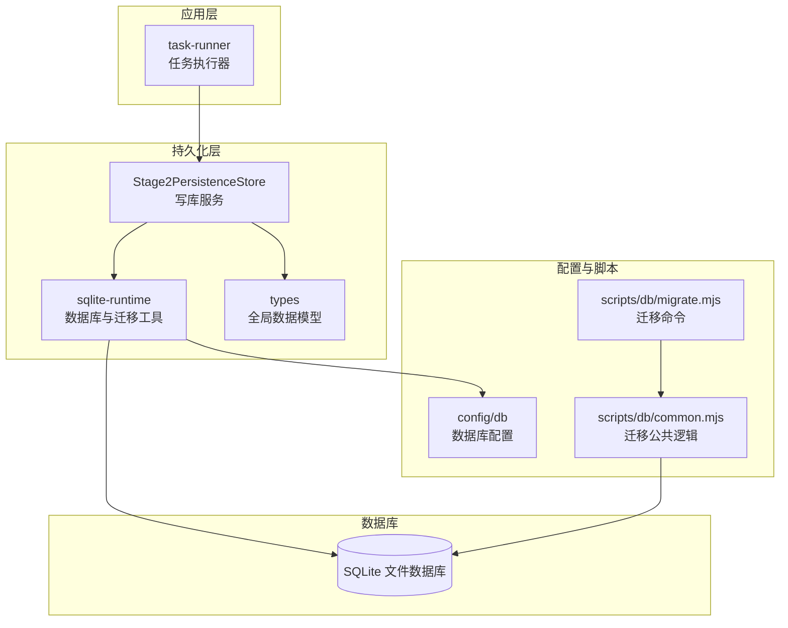
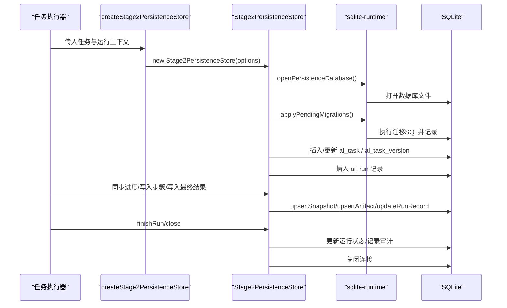
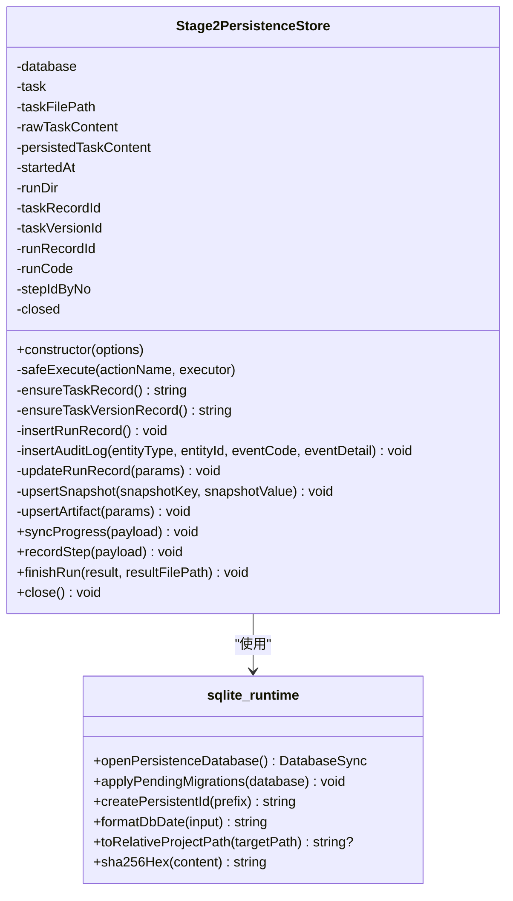
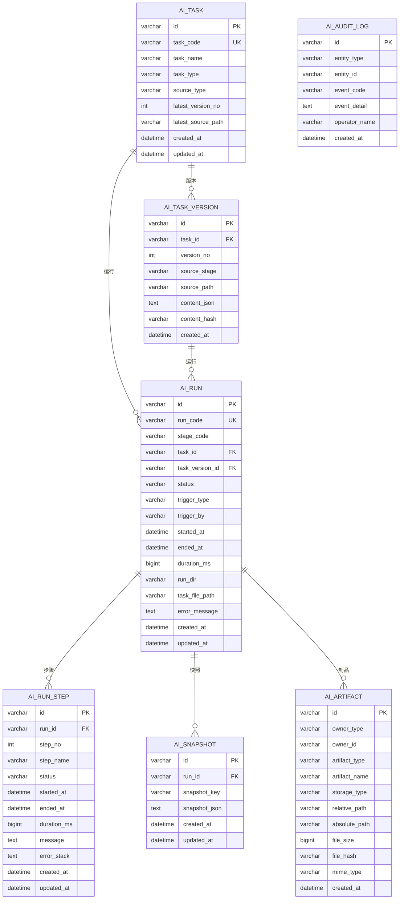
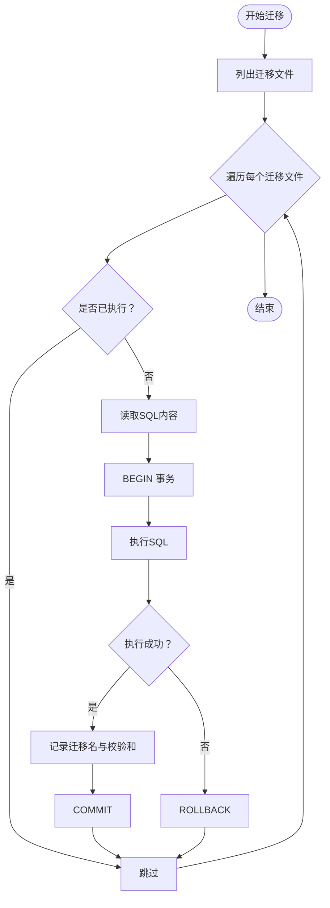
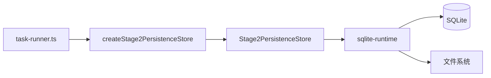

# 持久化 API

<cite>
**本文引用的文件**
- [src/persistence/stage2-store.ts](file://src/persistence/stage2-store.ts)
- [src/persistence/sqlite-runtime.ts](file://src/persistence/sqlite-runtime.ts)
- [src/persistence/types.ts](file://src/persistence/types.ts)
- [db/migrations/001_global_persistence_init.sql](file://db/migrations/001_global_persistence_init.sql)
- [src/stage2/task-runner.ts](file://src/stage2/task-runner.ts)
- [config/db.ts](file://config/db.ts)
- [scripts/db/migrate.mjs](file://scripts/db/migrate.mjs)
- [scripts/db/common.mjs](file://scripts/db/common.mjs)
</cite>

## 目录
1. [简介](#简介)
2. [项目结构](#项目结构)
3. [核心组件](#核心组件)
4. [架构概览](#架构概览)
5. [详细组件分析](#详细组件分析)
6. [依赖分析](#依赖分析)
7. [性能考虑](#性能考虑)
8. [故障排查指南](#故障排查指南)
9. [结论](#结论)
10. [附录](#附录)

## 简介
本文件面向数据持久化 API，重点围绕 createStage2PersistenceStore() 函数及其配套的 Stage2PersistenceStore 存储服务，系统性说明：
- 存储接口与数据模型
- 数据库表结构设计与约束
- 读写操作 API（插入、更新、查询、删除）的规范与行为
- 事务处理与一致性保障
- 数据迁移与版本管理
- 性能优化建议与最佳实践

该持久化层以 SQLite 作为本地单文件数据库，采用与 MySQL 兼容的 SQL 子集进行建模，并通过迁移脚本维护结构演进。

## 项目结构
与持久化相关的模块分布如下：
- 存储实现与接口：src/persistence/stage2-store.ts
- 运行时工具与迁移：src/persistence/sqlite-runtime.ts
- 类型定义：src/persistence/types.ts
- 数据库迁移脚本：db/migrations/001_global_persistence_init.sql
- 运行时配置：config/db.ts
- 迁移命令脚本：scripts/db/migrate.mjs、scripts/db/common.mjs
- 使用方：src/stage2/task-runner.ts

图表来源
- [src/persistence/stage2-store.ts:74-123](file://src/persistence/stage2-store.ts#L74-L123)
- [src/persistence/sqlite-runtime.ts:73-84](file://src/persistence/sqlite-runtime.ts#L73-L84)
- [config/db.ts:20-26](file://config/db.ts#L20-L26)
- [scripts/db/migrate.mjs:12-51](file://scripts/db/migrate.mjs#L12-L51)
- [scripts/db/common.mjs:31-58](file://scripts/db/common.mjs#L31-L58)

章节来源
- [src/persistence/stage2-store.ts:1-655](file://src/persistence/stage2-store.ts#L1-L655)
- [src/persistence/sqlite-runtime.ts:1-116](file://src/persistence/sqlite-runtime.ts#L1-L116)
- [src/persistence/types.ts:1-125](file://src/persistence/types.ts#L1-L125)
- [db/migrations/001_global_persistence_init.sql:1-128](file://db/migrations/001_global_persistence_init.sql#L1-L128)
- [src/stage2/task-runner.ts:2318-2499](file://src/stage2/task-runner.ts#L2318-L2499)
- [config/db.ts:1-28](file://config/db.ts#L1-L28)
- [scripts/db/migrate.mjs:1-52](file://scripts/db/migrate.mjs#L1-L52)
- [scripts/db/common.mjs:1-108](file://scripts/db/common.mjs#L1-L108)

## 核心组件
- Stage2PersistenceStore：负责任务、运行、步骤、快照、制品、审计日志等实体的持久化写入与状态更新。
- createStage2PersistenceStore：工厂函数，封装初始化流程（打开数据库、应用迁移、确保任务/版本记录、写入运行记录、记录审计日志）。
- sqlite-runtime：提供数据库打开、迁移应用、ID 生成、日期格式化、路径相对化等基础设施。
- types：定义全局持久化数据模型（任务、版本、运行、步骤、快照、制品、审计日志）及枚举类型。

章节来源
- [src/persistence/stage2-store.ts:74-123](file://src/persistence/stage2-store.ts#L74-L123)
- [src/persistence/stage2-store.ts:643-654](file://src/persistence/stage2-store.ts#L643-L654)
- [src/persistence/sqlite-runtime.ts:73-114](file://src/persistence/sqlite-runtime.ts#L73-L114)
- [src/persistence/types.ts:34-123](file://src/persistence/types.ts#L34-L123)

## 架构概览
持久化 API 的调用链路如下：
- 应用层（任务执行器）通过工厂函数创建存储实例
- 存储实例在构造时完成数据库打开与迁移
- 在执行过程中，按需写入运行记录、步骤记录、快照、制品与审计日志
- 结束时更新运行状态与最终结果

图表来源
- [src/stage2/task-runner.ts:2341-2348](file://src/stage2/task-runner.ts#L2341-L2348)
- [src/persistence/stage2-store.ts:101-123](file://src/persistence/stage2-store.ts#L101-L123)
- [src/persistence/stage2-store.ts:263-303](file://src/persistence/stage2-store.ts#L263-L303)
- [src/persistence/stage2-store.ts:470-493](file://src/persistence/stage2-store.ts#L470-L493)
- [src/persistence/stage2-store.ts:495-590](file://src/persistence/stage2-store.ts#L495-L590)
- [src/persistence/stage2-store.ts:592-630](file://src/persistence/stage2-store.ts#L592-L630)
- [src/persistence/stage2-store.ts:632-640](file://src/persistence/stage2-store.ts#L632-L640)
- [src/persistence/sqlite-runtime.ts:73-114](file://src/persistence/sqlite-runtime.ts#L73-L114)

## 详细组件分析

### createStage2PersistenceStore() 与 Stage2PersistenceStore
- 工厂函数职责
  - 接收任务元数据、任务文件路径、原始任务内容、启动时间、运行目录等
  - 打开数据库并应用待执行迁移
  - 确保任务与任务版本记录存在
  - 创建运行记录并写入审计日志
  - 返回存储实例供后续写入进度、步骤、结果
- 存储实例方法
  - 同步进度：写入解析值、查询快照、进度状态快照，并记录进度 JSON 制品
  - 写入步骤：按步骤号 upsert 步骤记录，必要时写入截图制品
  - 写入最终结果：更新运行状态、写入最终快照与结果 JSON 制品，并记录审计日志
  - 关闭：安全关闭数据库连接

图表来源
- [src/persistence/stage2-store.ts:74-641](file://src/persistence/stage2-store.ts#L74-L641)
- [src/persistence/sqlite-runtime.ts:73-114](file://src/persistence/sqlite-runtime.ts#L73-L114)

章节来源
- [src/persistence/stage2-store.ts:643-654](file://src/persistence/stage2-store.ts#L643-L654)
- [src/persistence/stage2-store.ts:101-123](file://src/persistence/stage2-store.ts#L101-L123)
- [src/persistence/stage2-store.ts:470-630](file://src/persistence/stage2-store.ts#L470-L630)

### 数据模型与表结构设计
- ai_task：任务主表，唯一标识任务编码，记录最新版本号与源路径
- ai_task_version：任务版本表，按任务与版本号/内容哈希唯一，记录来源阶段、路径与内容哈希
- ai_run：运行记录表，关联任务与版本，记录运行状态、触发方式、时间戳与运行目录
- ai_run_step：运行步骤表，按运行与步骤号唯一，记录步骤状态、耗时与错误信息
- ai_snapshot：运行快照表，按运行与键唯一，存储 JSON 快照
- ai_artifact：制品表，按拥有者类型/ID与制品类型/名称唯一，记录文件路径、大小、MIME 等
- ai_audit_log：审计日志表，记录实体事件与操作者

图表来源
- [db/migrations/001_global_persistence_init.sql:1-128](file://db/migrations/001_global_persistence_init.sql#L1-L128)

章节来源
- [db/migrations/001_global_persistence_init.sql:1-128](file://db/migrations/001_global_persistence_init.sql#L1-L128)
- [src/persistence/types.ts:34-123](file://src/persistence/types.ts#L34-L123)

### API 接口规范（方法与参数）

- 工厂函数
  - 名称：createStage2PersistenceStore
  - 参数：Stage2StoreInitOptions
    - task: AcceptanceTask
    - taskFilePath: string
    - rawTaskContent: string
    - startedAt: string
    - runDir: string
  - 返回：Stage2PersistenceStore 实例或 null（初始化失败时）
  - 失败处理：捕获异常并记录错误日志

- 存储实例方法
  - syncProgress(payload: Stage2ProgressPayload)
    - 功能：写入解析值、查询快照、进度状态快照；记录进度 JSON 制品
    - 参数：payload 包含 status、inProgress、resolvedValues、querySnapshots、steps、progressFilePath
  - recordStep(payload: Stage2StepPayload)
    - 功能：按步骤号 upsert 步骤记录；若存在截图则写入截图制品；失败时记录审计日志
    - 参数：payload 包含 stepNo、stepResult
  - finishRun(result: Stage2ExecutionResult, resultFilePath: string)
    - 功能：更新运行状态、写入最终快照与结果 JSON 制品；记录运行结束审计日志
  - close()
    - 功能：安全关闭数据库连接，避免重复关闭

- 内部工具与类型
  - sqlite-runtime
    - openPersistenceDatabase()：打开 SQLite 数据库，启用外键约束
    - applyPendingMigrations(database)：扫描迁移文件并逐个执行，事务包裹
    - createPersistentId(prefix)：生成带前缀与随机串的全局唯一 ID
    - formatDbDate(input?)：格式化日期字符串
    - toRelativeProjectPath(targetPath?)：将绝对路径转换为相对工程路径
    - sha256Hex(content)：计算内容哈希
  - types
    - 持久化状态枚举：PersistentRunStatus
    - 拥有者类型枚举：PersistentOwnerType
    - 制品种类枚举：PersistentArtifactType
    - 数据模型：PersistentTaskRecord、PersistentTaskVersionRecord、PersistentRunRecord、PersistentRunStepRecord、PersistentSnapshotRecord、PersistentArtifactRecord、PersistentAuditLogRecord

章节来源
- [src/persistence/stage2-store.ts:643-654](file://src/persistence/stage2-store.ts#L643-L654)
- [src/persistence/stage2-store.ts:470-630](file://src/persistence/stage2-store.ts#L470-L630)
- [src/persistence/sqlite-runtime.ts:73-114](file://src/persistence/sqlite-runtime.ts#L73-L114)
- [src/persistence/types.ts:11-123](file://src/persistence/types.ts#L11-L123)

### 事务处理与一致性保证
- 迁移执行
  - 迁移脚本逐个读取 SQL 文件，开启事务，执行后记录迁移名与校验和，失败回滚
- 写入操作
  - 存储实例内部使用 try/catch 包裹关键写入，避免单点异常导致整体失败
  - 外键约束启用，确保引用完整性（如运行记录删除时，步骤与快照级联删除）
- 一致性
  - 任务与版本记录通过内容哈希与版本号唯一约束，防止重复
  - 运行与步骤通过唯一索引保证并发写入不冲突

图表来源
- [scripts/db/migrate.mjs:15-46](file://scripts/db/migrate.mjs#L15-L46)
- [scripts/db/common.mjs:88-106](file://scripts/db/common.mjs#L88-L106)
- [src/persistence/sqlite-runtime.ts:86-114](file://src/persistence/sqlite-runtime.ts#L86-L114)

章节来源
- [scripts/db/migrate.mjs:15-46](file://scripts/db/migrate.mjs#L15-L46)
- [scripts/db/common.mjs:88-106](file://scripts/db/common.mjs#L88-L106)
- [src/persistence/sqlite-runtime.ts:86-114](file://src/persistence/sqlite-runtime.ts#L86-L114)

### 数据迁移与版本管理
- 迁移文件
  - 位于 db/migrations/，命名按顺序编号，扩展名为 .sql
  - 迁移表 schema_migrations 记录已执行的迁移名与校验和
- 执行流程
  - 读取迁移文件列表，逐个检查是否已执行
  - 未执行的迁移在事务内执行，并记录执行时间
- 版本控制
  - 任务版本通过 content_hash 与 (task_id, version_no) 唯一约束
  - 最新版本号由任务表维护，便于快速定位

章节来源
- [db/migrations/001_global_persistence_init.sql:1-128](file://db/migrations/001_global_persistence_init.sql#L1-L128)
- [src/persistence/sqlite-runtime.ts:86-114](file://src/persistence/sqlite-runtime.ts#L86-L114)
- [scripts/db/migrate.mjs:15-46](file://scripts/db/migrate.mjs#L15-L46)
- [scripts/db/common.mjs:60-95](file://scripts/db/common.mjs#L60-L95)

### 使用示例与集成点
- 任务执行器在 runTaskScenario 中创建存储实例，并在执行过程中周期性写入进度、步骤与最终结果
- 进度文件与数据库快照同步，确保离线可观测性与可恢复性

章节来源
- [src/stage2/task-runner.ts:2341-2348](file://src/stage2/task-runner.ts#L2341-L2348)
- [src/stage2/task-runner.ts:2350-2378](file://src/stage2/task-runner.ts#L2350-L2378)
- [src/stage2/task-runner.ts:2417-2434](file://src/stage2/task-runner.ts#L2417-L2434)
- [src/stage2/task-runner.ts:2437-2499](file://src/stage2/task-runner.ts#L2437-L2499)

## 依赖分析
- 组件耦合
  - Stage2PersistenceStore 依赖 sqlite-runtime 提供数据库与迁移能力
  - 任务执行器通过工厂函数间接依赖存储层
- 外部依赖
  - node:sqlite 提供 SQLite 同步数据库访问
  - 迁移脚本依赖 node:sqlite 与文件系统

图表来源
- [src/stage2/task-runner.ts:2341-2348](file://src/stage2/task-runner.ts#L2341-L2348)
- [src/persistence/stage2-store.ts:643-654](file://src/persistence/stage2-store.ts#L643-L654)
- [src/persistence/stage2-store.ts:101-123](file://src/persistence/stage2-store.ts#L101-L123)
- [src/persistence/sqlite-runtime.ts:73-84](file://src/persistence/sqlite-runtime.ts#L73-L84)

章节来源
- [src/stage2/task-runner.ts:2318-2499](file://src/stage2/task-runner.ts#L2318-L2499)
- [src/persistence/stage2-store.ts:643-654](file://src/persistence/stage2-store.ts#L643-L654)
- [src/persistence/sqlite-runtime.ts:73-114](file://src/persistence/sqlite-runtime.ts#L73-L114)

## 性能考虑
- 写入批量化
  - 将频繁的中间状态写入合并到周期性进度文件与数据库快照，减少数据库写放大
- 索引与查询
  - 表上建立复合索引（如运行表按任务+阶段+开始时间），有利于查询与统计
- 文件 I/O
  - 制品路径尽量使用相对路径，减小存储冗余
- 事务粒度
  - 单条写入使用 try/catch 包裹，迁移与批量写入使用事务，平衡一致性与吞吐
- 并发与锁
  - SQLite 适合单文件场景；若并发写入较多，建议拆分任务或引入队列

## 故障排查指南
- 初始化失败
  - 现象：工厂函数返回 null
  - 排查：检查数据库驱动配置、数据库文件路径、迁移文件是否存在
- 迁移执行失败
  - 现象：迁移脚本报错并回滚
  - 排查：查看具体 SQL 错误、迁移文件完整性、schema_migrations 记录
- 写入异常
  - 现象：某一步骤或进度未落库
  - 排查：确认存储实例未被提前关闭；检查 safeExecute 包裹的异常日志
- 路径问题
  - 现象：制品路径为空或相对路径不可用
  - 排查：确认 toRelativeProjectPath 的返回值与运行目录权限

章节来源
- [src/persistence/stage2-store.ts:643-654](file://src/persistence/stage2-store.ts#L643-L654)
- [src/persistence/stage2-store.ts:125-133](file://src/persistence/stage2-store.ts#L125-L133)
- [src/persistence/sqlite-runtime.ts:73-84](file://src/persistence/sqlite-runtime.ts#L73-L84)
- [scripts/db/migrate.mjs:35-44](file://scripts/db/migrate.mjs#L35-L44)

## 结论
本持久化 API 以 SQLite 为基础，结合迁移机制与严格的模型设计，提供了从任务到运行、从步骤到快照与制品的全生命周期数据管理能力。通过事务与外键约束保障一致性，通过工厂函数与工具函数简化使用与运维。建议在生产环境中配合监控与备份策略，确保数据可靠性与可恢复性。

## 附录
- 配置项
  - DB_DRIVER：数据库驱动（当前仅支持 sqlite）
  - DB_FILE_PATH：数据库文件路径（默认位于运行目录）
- 迁移脚本
  - 迁移命令：scripts/db/migrate.mjs
  - 公共逻辑：scripts/db/common.mjs

章节来源
- [config/db.ts:20-26](file://config/db.ts#L20-L26)
- [scripts/db/migrate.mjs:12-51](file://scripts/db/migrate.mjs#L12-L51)
- [scripts/db/common.mjs:31-58](file://scripts/db/common.mjs#L31-L58)