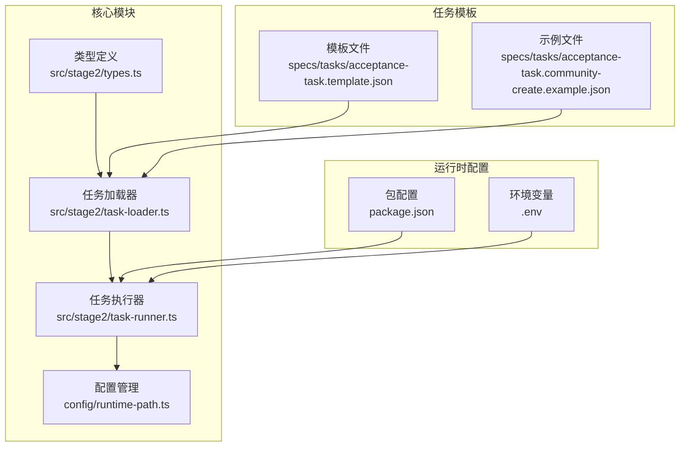
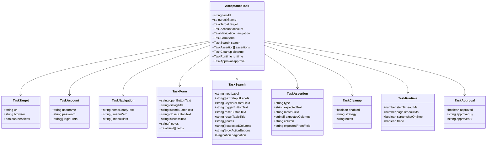
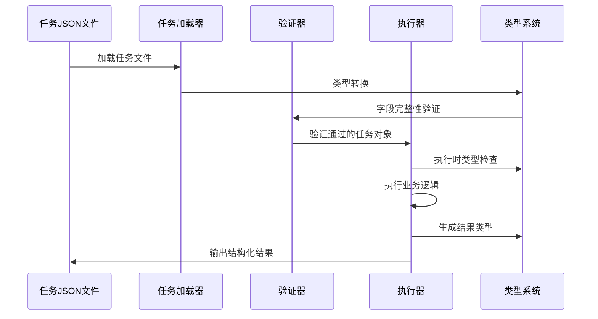
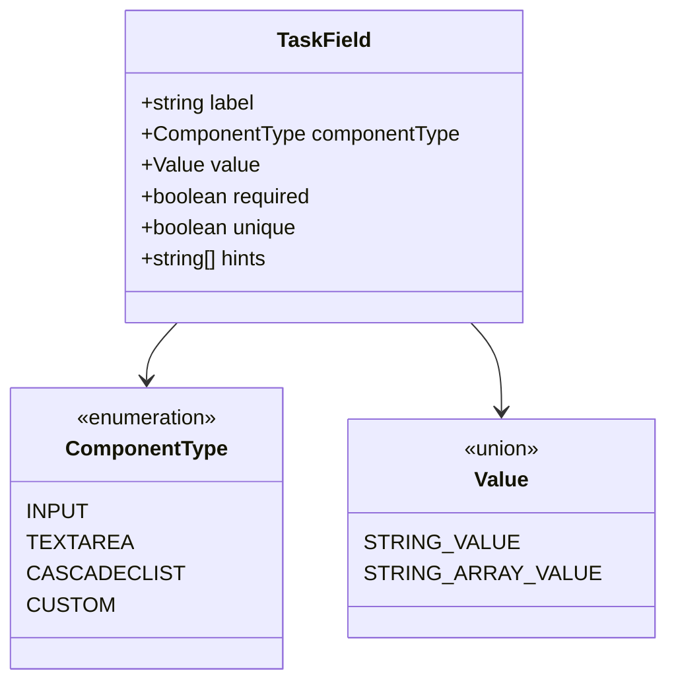
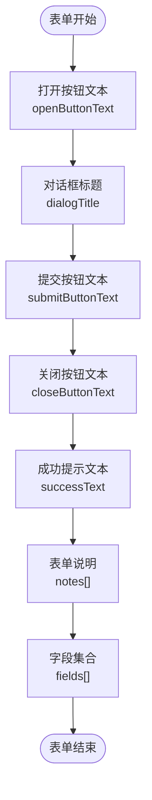
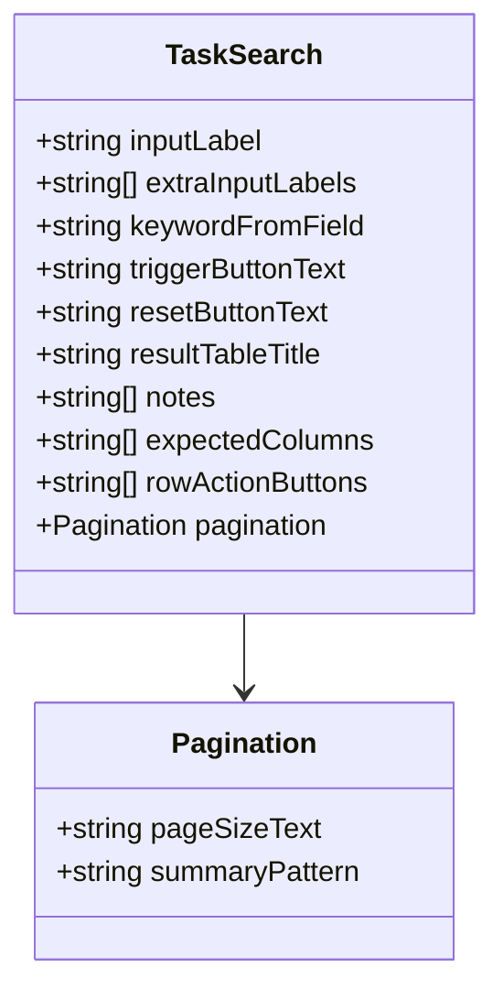
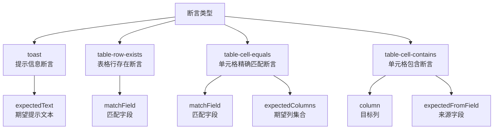
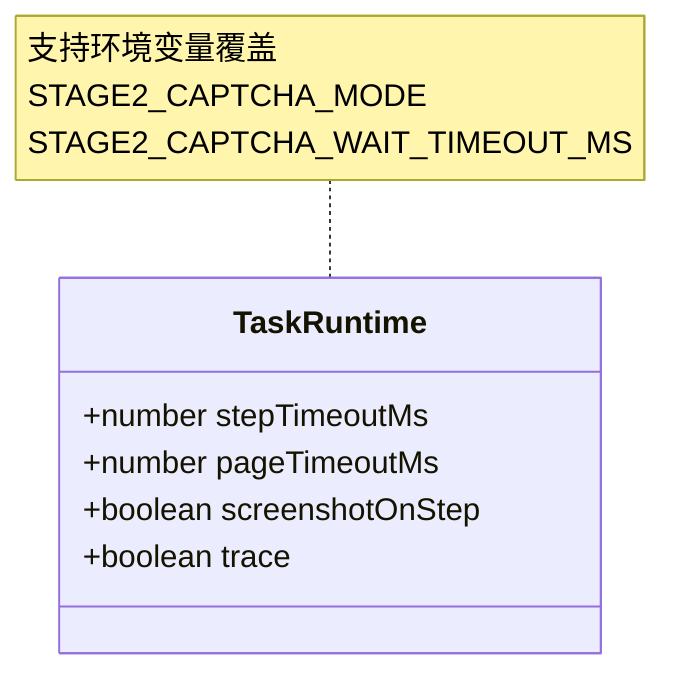
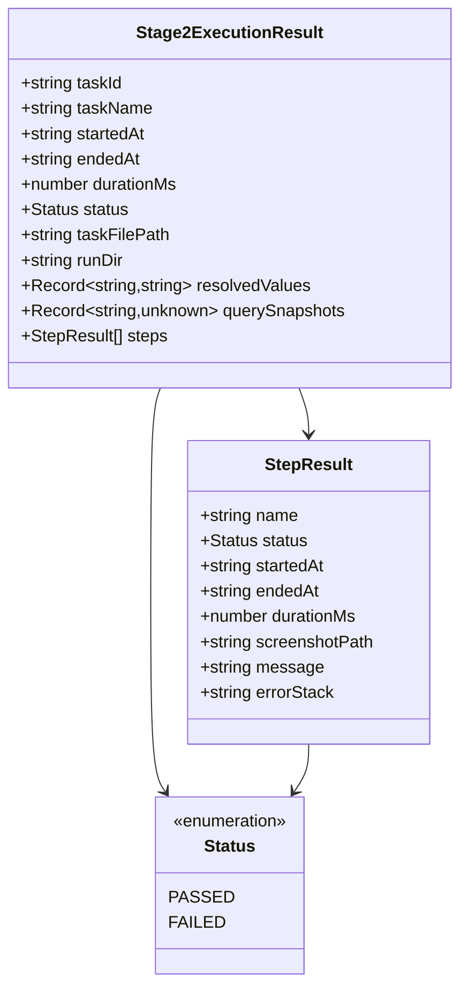
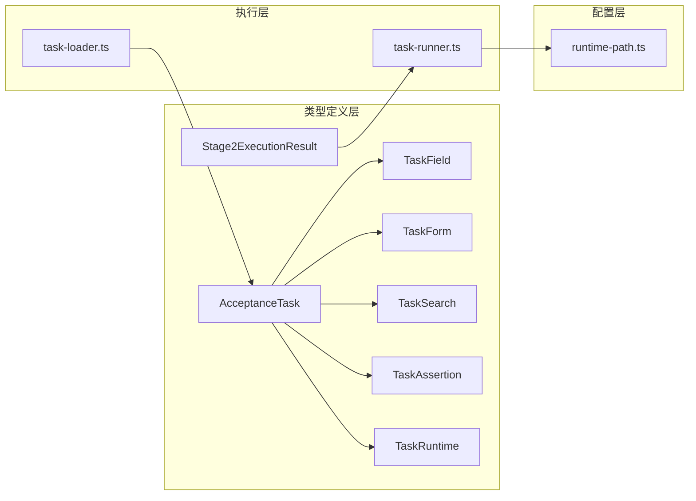

# 类型定义

<cite>
**本文档引用的文件**
- [src/stage2/types.ts](file://src/stage2/types.ts)
- [src/stage2/task-runner.ts](file://src/stage2/task-runner.ts)
- [src/stage2/task-loader.ts](file://src/stage2/task-loader.ts)
- [specs/tasks/acceptance-task.template.json](file://specs/tasks/acceptance-task.template.json)
- [specs/tasks/acceptance-task.community-create.example.json](file://specs/tasks/acceptance-task.community-create.example.json)
- [config/runtime-path.ts](file://config/runtime-path.ts)
- [package.json](file://package.json)
- [README.md](file://README.md)
</cite>

## 目录
1. [简介](#简介)
2. [项目结构](#项目结构)
3. [核心组件](#核心组件)
4. [架构概览](#架构概览)
5. [详细组件分析](#详细组件分析)
6. [依赖分析](#依赖分析)
7. [性能考虑](#性能考虑)
8. [故障排除指南](#故障排除指南)
9. [结论](#结论)

## 简介

HI-TEST 项目是一个基于 Playwright 和 Midscene.js 的 AI 自动化测试框架。本文档详细说明了第二段执行器中的核心数据类型定义，包括 AcceptanceTask、TaskField、TaskForm、TaskSearch、TaskAssertion、TaskRuntime、Stage2ExecutionResult 等接口的设计理念、字段定义、约束条件和使用模式。

该类型系统采用 TypeScript 接口定义，提供了强类型支持和完整的 JSON Schema 对应关系，确保任务定义的准确性和可验证性。

## 项目结构

项目采用模块化的架构设计，主要分为以下几个核心模块：

**图表来源**
- [src/stage2/types.ts](file://src/stage2/types.ts#L1-L125)
- [src/stage2/task-loader.ts](file://src/stage2/task-loader.ts#L1-L91)
- [src/stage2/task-runner.ts](file://src/stage2/task-runner.ts#L1-L1344)

**章节来源**
- [src/stage2/types.ts](file://src/stage2/types.ts#L1-L125)
- [src/stage2/task-loader.ts](file://src/stage2/task-loader.ts#L1-L91)
- [src/stage2/task-runner.ts](file://src/stage2/task-runner.ts#L1-L1344)

## 核心组件

### AcceptanceTask 核心类型

AcceptanceTask 是整个任务系统的核心接口，定义了完整的验收测试任务结构。它包含了系统访问、用户认证、界面导航、表单操作、搜索功能、断言验证、清理策略、运行时配置和审批信息等所有必要组件。

**图表来源**
- [src/stage2/types.ts](file://src/stage2/types.ts#L5-L98)

### 关键字段约束和默认值

每个核心字段都有明确的约束条件和默认行为：

| 字段 | 类型 | 必填 | 默认值 | 约束条件 |
|------|------|------|--------|----------|
| `taskId` | string | 是 | - | 唯一标识符，用于结果目录组织 |
| `taskName` | string | 是 | - | 任务显示名称 |
| `target.url` | string | 是 | - | 目标系统URL，必须可访问 |
| `account.username` | string | 是 | - | 用户名，支持环境变量占位符 |
| `account.password` | string | 是 | - | 密码，支持环境变量占位符 |
| `form.openButtonText` | string | 是 | - | 打开表单对话框的按钮文本 |
| `form.submitButtonText` | string | 是 | - | 提交表单的按钮文本 |
| `form.fields` | TaskField[] | 是 | [] | 表单字段数组，至少包含一个字段 |

**章节来源**
- [src/stage2/types.ts](file://src/stage2/types.ts#L86-L98)
- [src/stage2/task-loader.ts](file://src/stage2/task-loader.ts#L50-L69)

## 架构概览

类型系统在整个执行流程中的作用和交互关系：

**图表来源**
- [src/stage2/task-loader.ts](file://src/stage2/task-loader.ts#L79-L89)
- [src/stage2/task-runner.ts](file://src/stage2/task-runner.ts#L1062-L1343)

## 详细组件分析

### TaskField - 表单字段定义

TaskField 接口定义了单个表单字段的所有属性，支持多种组件类型和验证规则。

**图表来源**
- [src/stage2/types.ts](file://src/stage2/types.ts#L23-L30)

#### 字段使用示例

表单字段支持以下组件类型：
- `input`: 单行文本输入框
- `textarea`: 多行文本输入框  
- `cascader`: 级联选择器（省市区等）
- `string`: 自定义组件类型

**章节来源**
- [src/stage2/types.ts](file://src/stage2/types.ts#L25-L29)

### TaskForm - 表单容器

TaskForm 将多个 TaskField 组织成完整的表单结构，并提供表单级别的配置选项。

**图表来源**
- [src/stage2/types.ts](file://src/stage2/types.ts#L32-L40)

**章节来源**
- [src/stage2/types.ts](file://src/stage2/types.ts#L32-L40)

### TaskSearch - 搜索功能

TaskSearch 定义了列表搜索和结果验证的功能配置。

**图表来源**
- [src/stage2/types.ts](file://src/stage2/types.ts#L42-L56)

**章节来源**
- [src/stage2/types.ts](file://src/stage2/types.ts#L42-L56)

### TaskAssertion - 断言验证

TaskAssertion 定义了多种断言类型和验证规则，支持不同场景的业务验证。

**图表来源**
- [src/stage2/types.ts](file://src/stage2/types.ts#L58-L65)

**章节来源**
- [src/stage2/types.ts](file://src/stage2/types.ts#L58-L65)

### TaskRuntime - 运行时配置

TaskRuntime 提供了执行过程中的各种配置选项，支持调试和性能优化。

**图表来源**
- [src/stage2/types.ts](file://src/stage2/types.ts#L73-L78)

**章节来源**
- [src/stage2/types.ts](file://src/stage2/types.ts#L73-L78)

### Stage2ExecutionResult - 执行结果

Stage2ExecutionResult 记录了整个任务执行的完整结果和过程信息。

**图表来源**
- [src/stage2/types.ts](file://src/stage2/types.ts#L100-L123)

**章节来源**
- [src/stage2/types.ts](file://src/stage2/types.ts#L100-L123)

## 依赖分析

类型系统之间的依赖关系和耦合度分析：

**图表来源**
- [src/stage2/types.ts](file://src/stage2/types.ts#L1-L125)
- [src/stage2/task-runner.ts](file://src/stage2/task-runner.ts#L1-L1344)
- [src/stage2/task-loader.ts](file://src/stage2/task-loader.ts#L1-L91)

**章节来源**
- [src/stage2/types.ts](file://src/stage2/types.ts#L1-L125)
- [src/stage2/task-runner.ts](file://src/stage2/task-runner.ts#L1-L1344)
- [src/stage2/task-loader.ts](file://src/stage2/task-loader.ts#L1-L91)

## 性能考虑

类型系统在性能方面的优化策略：

1. **类型安全的早期验证**：通过 TypeScript 在编译时捕获类型错误
2. **最小字段验证**：任务加载器只验证必需字段，减少运行时开销
3. **内存优化**：使用 Record 类型存储动态值，避免不必要的对象创建
4. **异步处理**：所有 UI 操作都是异步的，不会阻塞类型系统

## 故障排除指南

### 常见类型错误及解决方案

1. **任务ID缺失**
   - 错误：`任务文件缺少 taskId: ${filePath}`
   - 解决：在任务JSON中添加唯一的 taskId 字段

2. **表单字段为空**
   - 错误：`任务文件缺少 form.fields: ${filePath}`
   - 解决：确保 form.fields 数组至少包含一个 TaskField

3. **运行时配置错误**
   - 错误：`STAGE2_CAPTCHA_MODE=fail，不允许继续执行`
   - 解决：设置正确的验证码处理模式或调整等待超时

**章节来源**
- [src/stage2/task-loader.ts](file://src/stage2/task-loader.ts#L50-L69)
- [src/stage2/task-runner.ts](file://src/stage2/task-runner.ts#L647-L703)

## 结论

HI-TEST 项目的类型定义系统展现了现代前端测试框架的最佳实践：

1. **强类型支持**：完整的 TypeScript 接口定义确保了类型安全
2. **灵活的扩展性**：支持自定义组件类型和断言类型
3. **完善的验证机制**：运行时和编译时双重验证
4. **清晰的层次结构**：模块化的类型设计便于维护和扩展

该类型系统为 AI 自动化测试提供了坚实的基础，支持复杂的业务场景和灵活的配置需求。