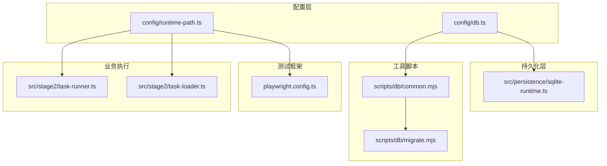
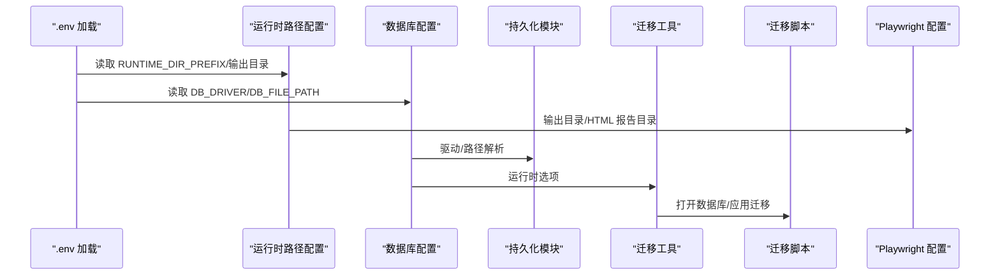
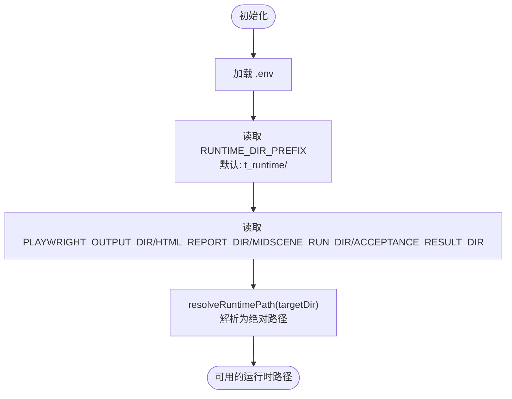
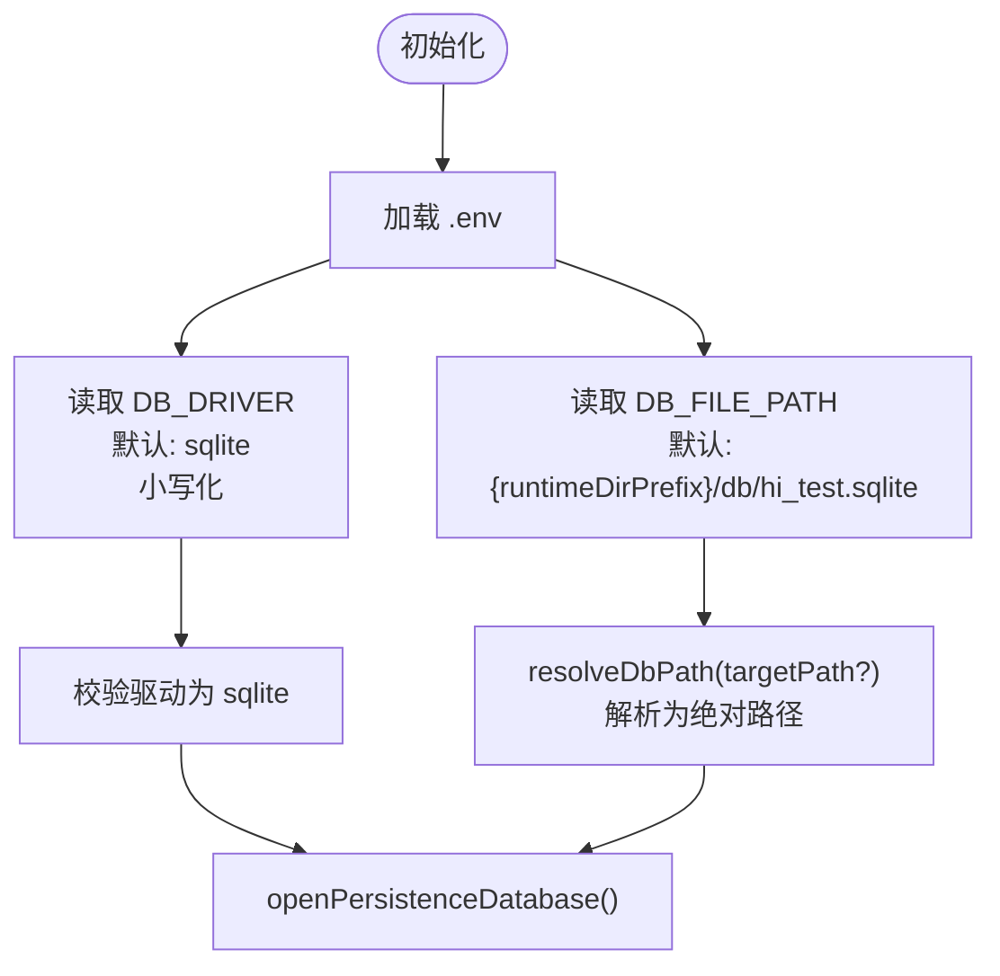
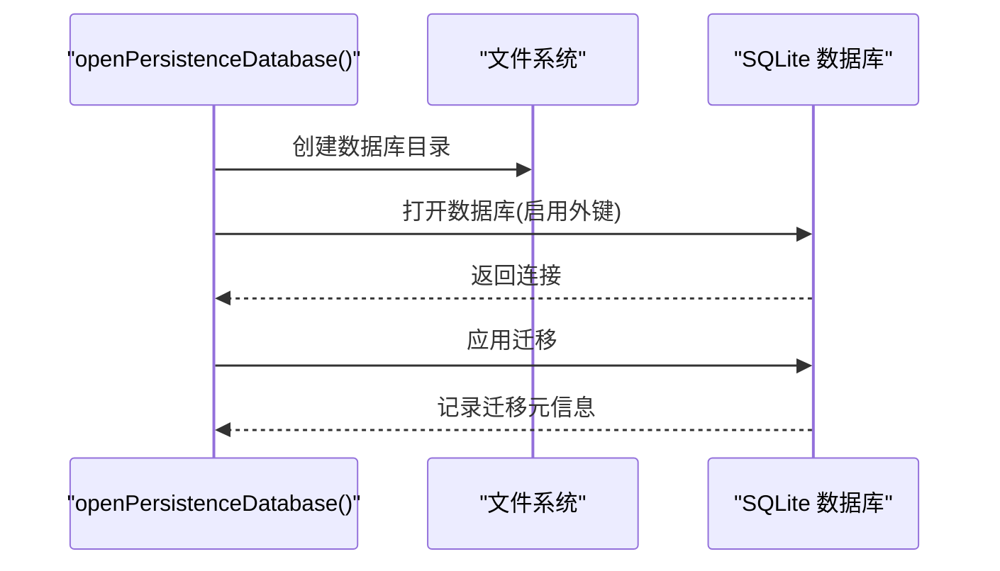
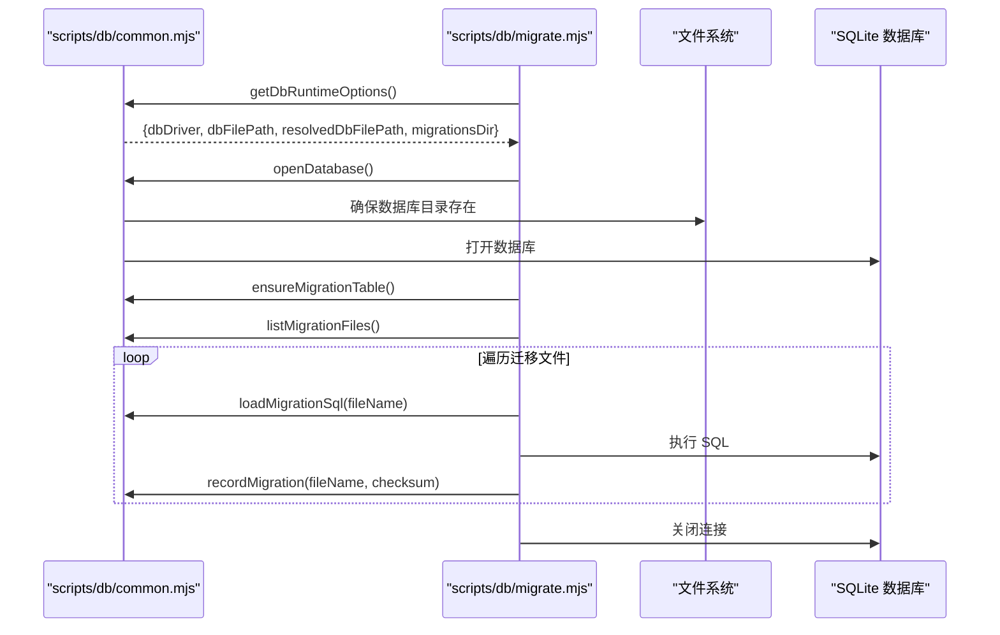
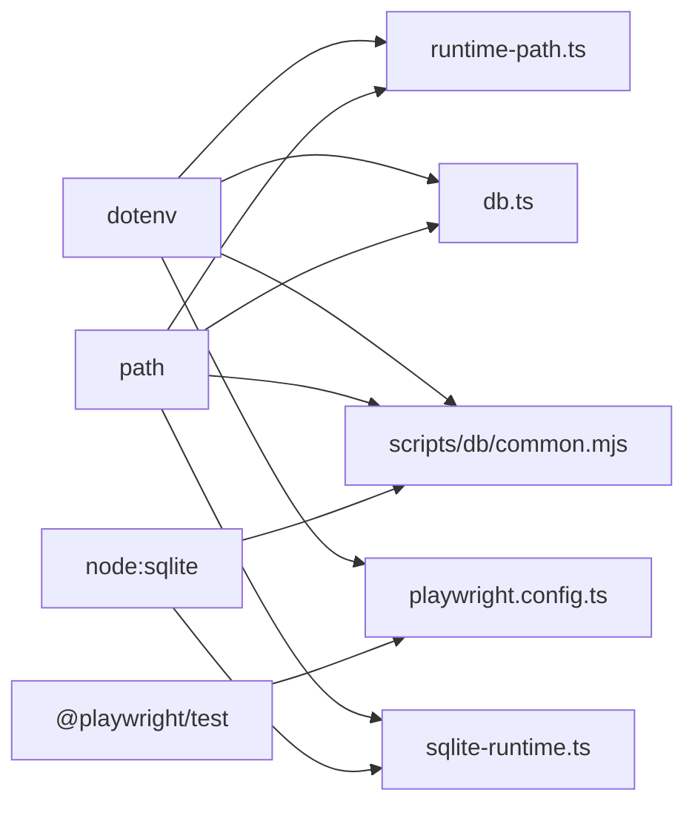

# 配置 API

<cite>
**本文引用的文件列表**
- [config/db.ts](file://config/db.ts)
- [config/runtime-path.ts](file://config/runtime-path.ts)
- [src/persistence/sqlite-runtime.ts](file://src/persistence/sqlite-runtime.ts)
- [scripts/db/common.mjs](file://scripts/db/common.mjs)
- [scripts/db/migrate.mjs](file://scripts/db/migrate.mjs)
- [playwright.config.ts](file://playwright.config.ts)
- [package.json](file://package.json)
- [src/stage2/task-runner.ts](file://src/stage2/task-runner.ts)
- [src/stage2/task-loader.ts](file://src/stage2/task-loader.ts)
- [src/stage2/types.ts](file://src/stage2/types.ts)
</cite>

## 目录
1. [简介](#简介)
2. [项目结构](#项目结构)
3. [核心组件](#核心组件)
4. [架构总览](#架构总览)
5. [详细组件分析](#详细组件分析)
6. [依赖关系分析](#依赖关系分析)
7. [性能考量](#性能考量)
8. [故障排查指南](#故障排查指南)
9. [结论](#结论)
10. [附录](#附录)

## 简介
本文件系统性梳理本项目的“配置管理 API”，覆盖运行时路径配置、数据库连接配置、环境变量规范与默认值、配置验证与错误处理、加载顺序与优先级、以及配置热更新与动态配置的可行方案。文档以代码为依据，配合图示帮助读者快速理解与正确使用配置接口。

## 项目结构
本项目采用“分层 + 功能模块”的组织方式：
- 配置层：集中于 config 目录，提供运行时路径与数据库配置的读取与解析。
- 持久化层：封装 SQLite 数据库打开、迁移应用等逻辑。
- 工具脚本：db 目录下的迁移工具，负责命令行迁移执行。
- 测试框架：Playwright 配置从运行时路径配置中读取输出目录。
- 业务执行：stage2 执行器从环境变量读取运行参数，并结合运行时路径生成结果目录。

图表来源
- [config/runtime-path.ts:1-41](file://config/runtime-path.ts#L1-L41)
- [config/db.ts:1-28](file://config/db.ts#L1-L28)
- [src/persistence/sqlite-runtime.ts:1-116](file://src/persistence/sqlite-runtime.ts#L1-L116)
- [scripts/db/common.mjs:1-108](file://scripts/db/common.mjs#L1-L108)
- [scripts/db/migrate.mjs:1-52](file://scripts/db/migrate.mjs#L1-L52)
- [playwright.config.ts:1-95](file://playwright.config.ts#L1-L95)
- [src/stage2/task-runner.ts:1-200](file://src/stage2/task-runner.ts#L1-L200)
- [src/stage2/task-loader.ts:71-89](file://src/stage2/task-loader.ts#L71-L89)

章节来源
- [config/runtime-path.ts:1-41](file://config/runtime-path.ts#L1-L41)
- [config/db.ts:1-28](file://config/db.ts#L1-L28)
- [playwright.config.ts:1-95](file://playwright.config.ts#L1-L95)
- [src/stage2/task-runner.ts:1-200](file://src/stage2/task-runner.ts#L1-L200)
- [src/stage2/task-loader.ts:71-89](file://src/stage2/task-loader.ts#L71-L89)
- [scripts/db/common.mjs:1-108](file://scripts/db/common.mjs#L1-L108)
- [scripts/db/migrate.mjs:1-52](file://scripts/db/migrate.mjs#L1-L52)

## 核心组件
- 运行时路径配置
  - 提供运行时目录前缀与多个输出目录的读取与解析。
  - 默认前缀为 t_runtime/，其他目录基于该前缀拼接。
  - 提供路径解析函数，确保返回绝对路径。
- 数据库配置
  - 读取数据库驱动与文件路径，支持默认值与大小写规范化。
  - 提供数据库路径解析函数，确保路径解析到工作目录下。
- 持久化与迁移
  - 打开 SQLite 数据库，启用外键约束。
  - 应用迁移，记录迁移元信息，保证幂等与事务一致性。
- 工具脚本
  - 命令行迁移工具，读取运行时选项，执行迁移并记录日志。
- 测试框架
  - Playwright 从运行时路径配置读取输出目录与 HTML 报告目录。
- 业务执行
  - 从环境变量读取运行参数（如验证码模式、等待超时等），并结合运行时路径生成结果目录。

章节来源
- [config/runtime-path.ts:1-41](file://config/runtime-path.ts#L1-L41)
- [config/db.ts:1-28](file://config/db.ts#L1-L28)
- [src/persistence/sqlite-runtime.ts:73-114](file://src/persistence/sqlite-runtime.ts#L73-L114)
- [scripts/db/common.mjs:31-58](file://scripts/db/common.mjs#L31-L58)
- [playwright.config.ts:22-48](file://playwright.config.ts#L22-L48)
- [src/stage2/task-runner.ts:61-87](file://src/stage2/task-runner.ts#L61-L87)

## 架构总览
配置 API 的调用链路如下：
- 启动阶段：各模块在初始化时读取 .env 并解析环境变量。
- 运行时：运行时路径配置被 Playwright、业务执行器与持久化模块共享使用。
- 数据库：持久化模块与迁移脚本共同依赖数据库配置，确保一致的驱动与路径。

图表来源
- [config/runtime-path.ts:1-41](file://config/runtime-path.ts#L1-L41)
- [config/db.ts:1-28](file://config/db.ts#L1-L28)
- [src/persistence/sqlite-runtime.ts:73-114](file://src/persistence/sqlite-runtime.ts#L73-L114)
- [scripts/db/common.mjs:31-58](file://scripts/db/common.mjs#L31-L58)
- [scripts/db/migrate.mjs:12-51](file://scripts/db/migrate.mjs#L12-L51)
- [playwright.config.ts:8-48](file://playwright.config.ts#L8-L48)

## 详细组件分析

### 运行时路径配置 API
- 功能
  - 读取运行时目录前缀与多个输出目录（测试结果、HTML 报告、中间场景运行目录、验收结果目录）。
  - 提供路径解析函数，将相对路径解析为绝对路径。
- 关键点
  - 默认前缀为 t_runtime/。
  - 输出目录基于前缀拼接，便于统一管理。
  - 解析函数确保路径位于工作目录之下，避免越权访问。
- 使用示例
  - 在 Playwright 中设置输出目录与 HTML 报告目录。
  - 在业务执行器中生成验收结果目录与截图目录。

图表来源
- [config/runtime-path.ts:8-40](file://config/runtime-path.ts#L8-L40)
- [playwright.config.ts:22-48](file://playwright.config.ts#L22-L48)

章节来源
- [config/runtime-path.ts:1-41](file://config/runtime-path.ts#L1-L41)
- [playwright.config.ts:1-95](file://playwright.config.ts#L1-L95)

### 数据库配置 API
- 功能
  - 读取数据库驱动与数据库文件路径，支持默认值与大小写规范化。
  - 提供数据库路径解析函数，确保路径解析到工作目录下。
- 关键点
  - 默认驱动为 sqlite，文件路径默认基于运行时前缀拼接。
  - 仅支持 sqlite 驱动（在持久化模块与迁移脚本中均有校验）。
- 使用示例
  - 打开数据库连接。
  - 作为迁移工具的输入，决定迁移目录与数据库文件路径。

图表来源
- [config/db.ts:10-26](file://config/db.ts#L10-L26)
- [src/persistence/sqlite-runtime.ts:73-84](file://src/persistence/sqlite-runtime.ts#L73-L84)
- [scripts/db/common.mjs:31-41](file://scripts/db/common.mjs#L31-L41)

章节来源
- [config/db.ts:1-28](file://config/db.ts#L1-L28)
- [src/persistence/sqlite-runtime.ts:73-84](file://src/persistence/sqlite-runtime.ts#L73-L84)
- [scripts/db/common.mjs:31-41](file://scripts/db/common.mjs#L31-L41)

### 持久化与迁移 API
- 功能
  - 打开 SQLite 数据库，启用外键约束。
  - 应用迁移，记录迁移元信息，保证幂等与事务一致性。
- 关键点
  - 仅支持 sqlite 驱动。
  - 迁移目录固定为 db/migrations。
  - 迁移记录表 schema_migrations 保存迁移名、校验和与执行时间。
- 错误处理
  - 驱动不为 sqlite 时抛出错误。
  - 迁移执行失败时回滚事务并抛出异常。

图表来源
- [src/persistence/sqlite-runtime.ts:73-114](file://src/persistence/sqlite-runtime.ts#L73-L114)

章节来源
- [src/persistence/sqlite-runtime.ts:1-116](file://src/persistence/sqlite-runtime.ts#L1-L116)

### 工具脚本迁移 API
- 功能
  - 读取运行时选项（驱动、数据库文件路径、迁移目录）。
  - 打开数据库，应用迁移，记录日志。
- 关键点
  - 与持久化模块共享相同的运行时选项解析逻辑。
  - 对每个迁移文件计算校验和，防止重复执行。
- 错误处理
  - 驱动不为 sqlite 时抛出错误。
  - 迁移执行失败时回滚事务并抛出异常。

图表来源
- [scripts/db/common.mjs:31-106](file://scripts/db/common.mjs#L31-L106)
- [scripts/db/migrate.mjs:12-51](file://scripts/db/migrate.mjs#L12-L51)

章节来源
- [scripts/db/common.mjs:1-108](file://scripts/db/common.mjs#L1-L108)
- [scripts/db/migrate.mjs:1-52](file://scripts/db/migrate.mjs#L1-L52)

### 测试框架配置 API
- 功能
  - 从运行时路径配置读取输出目录与 HTML 报告目录。
  - 支持多种报告器（list、html、自定义）。
- 关键点
  - .env 在配置文件中显式加载。
  - 输出目录与 HTML 报告目录来自运行时路径配置。

章节来源
- [playwright.config.ts:1-95](file://playwright.config.ts#L1-L95)
- [config/runtime-path.ts:18-36](file://config/runtime-path.ts#L18-L36)

### 业务执行配置 API
- 功能
  - 从环境变量读取验证码模式与等待超时等参数。
  - 结合运行时路径生成验收结果目录与截图目录。
- 关键点
  - 参数解析包含默认值与数值合法性校验。
  - 生成的运行目录结构清晰，便于后续产物管理。

章节来源
- [src/stage2/task-runner.ts:61-120](file://src/stage2/task-runner.ts#L61-L120)
- [src/stage2/task-loader.ts:71-89](file://src/stage2/task-loader.ts#L71-L89)

## 依赖关系分析
- 配置层
  - 运行时路径配置被 Playwright、业务执行器与任务加载器共享。
  - 数据库配置被持久化模块与迁移工具共享。
- 外部依赖
  - dotenv 用于加载 .env 文件。
  - node:sqlite 用于 SQLite 数据库操作。
  - @playwright/test 用于测试框架配置。

图表来源
- [config/runtime-path.ts:1-41](file://config/runtime-path.ts#L1-L41)
- [config/db.ts:1-28](file://config/db.ts#L1-L28)
- [src/persistence/sqlite-runtime.ts:1-116](file://src/persistence/sqlite-runtime.ts#L1-L116)
- [scripts/db/common.mjs:1-108](file://scripts/db/common.mjs#L1-L108)
- [playwright.config.ts:1-95](file://playwright.config.ts#L1-L95)

章节来源
- [config/runtime-path.ts:1-41](file://config/runtime-path.ts#L1-L41)
- [config/db.ts:1-28](file://config/db.ts#L1-L28)
- [src/persistence/sqlite-runtime.ts:1-116](file://src/persistence/sqlite-runtime.ts#L1-L116)
- [scripts/db/common.mjs:1-108](file://scripts/db/common.mjs#L1-L108)
- [playwright.config.ts:1-95](file://playwright.config.ts#L1-L95)

## 性能考量
- 路径解析
  - 绝对路径解析减少字符串拼接与多次路径转换的成本。
- 数据库连接
  - 外键约束开启提升数据一致性，但可能影响部分写入性能；可根据场景评估。
- 迁移执行
  - 逐个迁移执行并记录校验和，确保幂等；建议在生产环境谨慎触发迁移。
- 环境变量读取
  - 初始化阶段一次性读取并缓存，避免重复 IO。

## 故障排查指南
- 环境变量未生效
  - 确认 .env 文件存在且路径正确；检查 dotenv 的加载时机。
  - 章节来源
    - [config/runtime-path.ts:4](file://config/runtime-path.ts#L4)
    - [config/db.ts:5](file://config/db.ts#L5)
    - [playwright.config.ts:8-9](file://playwright.config.ts#L8-L9)
    - [scripts/db/common.mjs:7](file://scripts/db/common.mjs#L7)
- 驱动不为 sqlite
  - 当前仅支持 sqlite；若 DB_DRIVER 非 sqlite，将抛出错误。
  - 章节来源
    - [src/persistence/sqlite-runtime.ts:74-76](file://src/persistence/sqlite-runtime.ts#L74-L76)
    - [scripts/db/common.mjs:49-51](file://scripts/db/common.mjs#L49-L51)
- 数据库文件路径无效
  - 确保 DB_FILE_PATH 解析后的路径位于工作目录内，避免越权访问。
  - 章节来源
    - [config/db.ts:24-26](file://config/db.ts#L24-L26)
    - [src/persistence/sqlite-runtime.ts:77-78](file://src/persistence/sqlite-runtime.ts#L77-L78)
- 迁移失败
  - 查看迁移日志与错误栈；确认迁移文件完整性与权限。
  - 章节来源
    - [scripts/db/migrate.mjs:41-44](file://scripts/db/migrate.mjs#L41-L44)
    - [src/persistence/sqlite-runtime.ts:109-112](file://src/persistence/sqlite-runtime.ts#L109-L112)
- 输出目录不可写
  - 确认 RUNTIME_DIR_PREFIX 与相关输出目录的解析结果具有写权限。
  - 章节来源
    - [config/runtime-path.ts:38-40](file://config/runtime-path.ts#L38-L40)
    - [playwright.config.ts:24-38](file://playwright.config.ts#L24-L38)

## 结论
本项目的配置 API 通过 dotenv 统一加载环境变量，运行时路径与数据库配置分别提供默认值与解析函数，确保路径安全与一致性。持久化与迁移工具共享相同的运行时选项，保证执行链路的一致性。建议在生产环境中严格控制环境变量与路径权限，并在变更前进行充分验证。

## 附录

### 环境变量与默认值清单
- 运行时路径相关
  - RUNTIME_DIR_PREFIX：运行时目录前缀，默认 t_runtime/
  - PLAYWRIGHT_OUTPUT_DIR：Playwright 输出目录，默认 {RUNTIME_DIR_PREFIX}test-results
  - PLAYWRIGHT_HTML_REPORT_DIR：Playwright HTML 报告目录，默认 {RUNTIME_DIR_PREFIX}playwright-report
  - MIDSCENE_RUN_DIR：中间场景运行目录，默认 {RUNTIME_DIR_PREFIX}midscene_run
  - ACCEPTANCE_RESULT_DIR：验收结果目录，默认 {RUNTIME_DIR_PREFIX}acceptance-results
- 数据库相关
  - DB_DRIVER：数据库驱动，默认 sqlite（自动转小写）
  - DB_FILE_PATH：数据库文件路径，默认 {RUNTIME_DIR_PREFIX}db/hi_test.sqlite
- 业务执行相关
  - STAGE2_CAPTCHA_MODE：验证码模式，默认 auto（支持 manual/auto/fail/ignore）
  - STAGE2_CAPTCHA_WAIT_TIMEOUT_MS：验证码等待超时（毫秒），默认 120000
  - STAGE2_TASK_FILE：任务文件路径（任务加载器）

章节来源
- [config/runtime-path.ts:13-36](file://config/runtime-path.ts#L13-L36)
- [config/db.ts:20-22](file://config/db.ts#L20-L22)
- [src/stage2/task-runner.ts:35-41](file://src/stage2/task-runner.ts#L35-L41)
- [src/stage2/task-runner.ts:61-87](file://src/stage2/task-runner.ts#L61-L87)
- [src/stage2/task-loader.ts:71-77](file://src/stage2/task-loader.ts#L71-L77)

### 配置加载顺序与优先级
- 加载顺序
  - 各模块在初始化时调用 dotenv.config()，确保环境变量在模块内部可用。
  - Playwright 配置在加载 dotenv 后读取运行时路径配置。
  - 业务执行器在初始化时读取环境变量并解析运行时路径。
- 优先级
  - 环境变量优先于默认值。
  - 数据库驱动在读取后统一转为小写，确保比较一致性。
  - 路径解析始终返回绝对路径，避免相对路径导致的不确定性。

章节来源
- [config/runtime-path.ts:4](file://config/runtime-path.ts#L4)
- [config/db.ts:5](file://config/db.ts#L5)
- [playwright.config.ts:8-9](file://playwright.config.ts#L8-L9)
- [src/stage2/task-runner.ts:61-87](file://src/stage2/task-runner.ts#L61-L87)

### 配置验证与错误处理 API
- 验证
  - 驱动类型校验：仅允许 sqlite。
  - 数值参数校验：验证码等待超时需为正数。
  - 路径有效性：确保解析后的路径位于工作目录内。
- 错误处理
  - 驱动不为 sqlite：抛出错误。
  - 任务文件不存在：抛出错误。
  - 迁移执行失败：回滚事务并抛出异常。

章节来源
- [src/persistence/sqlite-runtime.ts:74-76](file://src/persistence/sqlite-runtime.ts#L74-L76)
- [src/stage2/task-loader.ts:80-82](file://src/stage2/task-loader.ts#L80-L82)
- [scripts/db/migrate.mjs:41-44](file://scripts/db/migrate.mjs#L41-L44)

### 配置热更新与动态配置
- 现状
  - 配置在模块初始化时读取并缓存，未提供运行时热更新机制。
- 建议
  - 若需热更新，可在业务层引入配置监听（如文件系统事件或外部配置中心），并在受影响模块中重新加载配置。
  - 对于 Playwright 输出目录等，可在重启测试进程时重新加载 dotenv 与配置。

章节来源
- [playwright.config.ts:8-9](file://playwright.config.ts#L8-L9)
- [config/runtime-path.ts:4](file://config/runtime-path.ts#L4)
- [config/db.ts:5](file://config/db.ts#L5)

### 使用示例与最佳实践
- 示例：设置运行时路径
  - 设置 RUNTIME_DIR_PREFIX 为自定义目录前缀，确保所有输出目录基于此前缀。
  - 章节来源
    - [config/runtime-path.ts:13-16](file://config/runtime-path.ts#L13-L16)
- 示例：设置数据库
  - 设置 DB_DRIVER 为 sqlite，DB_FILE_PATH 为自定义数据库文件路径。
  - 章节来源
    - [config/db.ts:20-22](file://config/db.ts#L20-L22)
- 示例：Playwright 输出目录
  - 在 Playwright 配置中使用运行时路径配置的输出目录与 HTML 报告目录。
  - 章节来源
    - [playwright.config.ts:24-38](file://playwright.config.ts#L24-L38)
- 示例：业务执行参数
  - 设置 STAGE2_CAPTCHA_MODE 与 STAGE2_CAPTCHA_WAIT_TIMEOUT_MS，确保验证码处理符合预期。
  - 章节来源
    - [src/stage2/task-runner.ts:61-87](file://src/stage2/task-runner.ts#L61-L87)
- 最佳实践
  - 在 CI 环境中统一管理 .env 文件与目录权限。
  - 变更配置后执行基础校验，确认输出目录与数据库文件路径正确。
  - 非必要不引入新依赖，优先复用现有配置模块。

章节来源
- [playwright.config.ts:1-95](file://playwright.config.ts#L1-L95)
- [src/stage2/task-runner.ts:1-200](file://src/stage2/task-runner.ts#L1-L200)
- [src/stage2/task-loader.ts:71-89](file://src/stage2/task-loader.ts#L71-L89)
- [package.json:6-11](file://package.json#L6-L11)