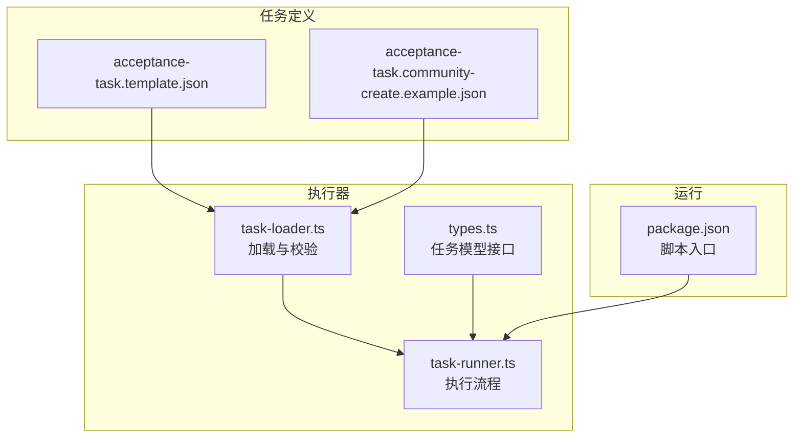
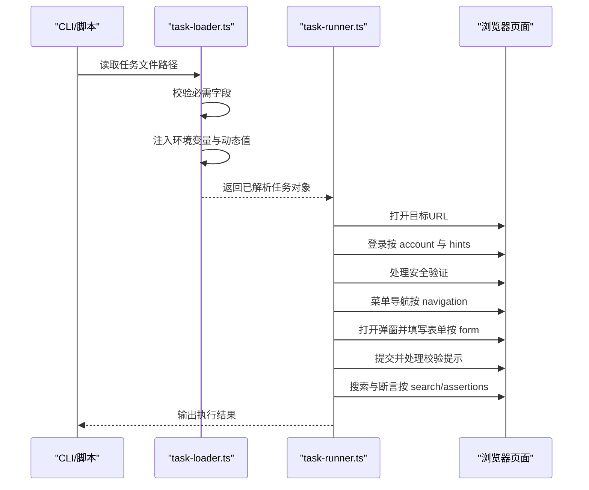
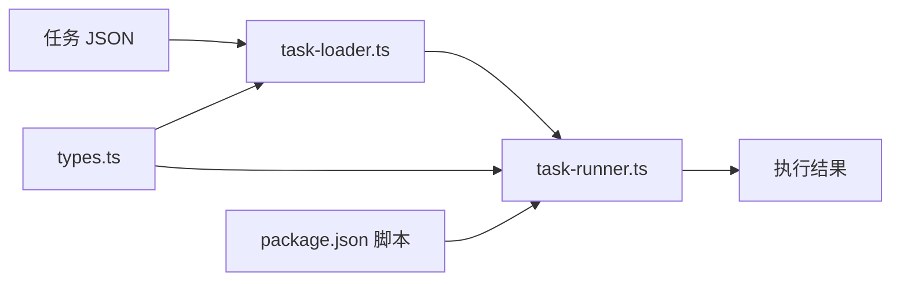

# 任务 JSON 结构规范

<cite>
**本文引用的文件**
- [acceptance-task.template.json](file://specs/tasks/acceptance-task.template.json)
- [acceptance-task.community-create.example.json](file://specs/tasks/acceptance-task.community-create.example.json)
- [types.ts](file://src/stage2/types.ts)
- [task-loader.ts](file://src/stage2/task-loader.ts)
- [task-runner.ts](file://src/stage2/task-runner.ts)
- [package.json](file://package.json)
- [login-e2e.md](file://specs/login-e2e.md)
</cite>

## 目录
1. [简介](#简介)
2. [项目结构](#项目结构)
3. [核心组件](#核心组件)
4. [架构概览](#架构概览)
5. [详细组件分析](#详细组件分析)
6. [依赖关系分析](#依赖关系分析)
7. [性能考量](#性能考量)
8. [故障排查指南](#故障排查指南)
9. [结论](#结论)
10. [附录](#附录)

## 简介
本规范文档面向 HI-TEST 的第二段执行器（Stage2），系统性阐述“任务 JSON”的完整结构与语法规则，覆盖必需字段与可选字段、字段值格式与约束、字段间逻辑关系与依赖规则，并给出 JSON Schema 定义与验证建议、示例与最佳实践，帮助使用者正确编写符合规范的任务 JSON 文件。

## 项目结构
- 任务 JSON 示例与模板位于 specs/tasks 目录，包含通用模板与一个业务场景示例。
- 类型定义与运行器位于 src/stage2，包含任务模型、加载器与执行器。
- package.json 提供脚本入口，用于触发 Stage2 执行。

图表来源
- [acceptance-task.template.json](file://specs/tasks/acceptance-task.template.json#L1-L85)
- [acceptance-task.community-create.example.json](file://specs/tasks/acceptance-task.community-create.example.json#L1-L184)
- [types.ts](file://src/stage2/types.ts#L1-L125)
- [task-loader.ts](file://src/stage2/task-loader.ts#L1-L91)
- [task-runner.ts](file://src/stage2/task-runner.ts#L1-L1344)
- [package.json](file://package.json#L6-L9)

章节来源
- [acceptance-task.template.json](file://specs/tasks/acceptance-task.template.json#L1-L85)
- [acceptance-task.community-create.example.json](file://specs/tasks/acceptance-task.community-create.example.json#L1-L184)
- [types.ts](file://src/stage2/types.ts#L1-L125)
- [task-loader.ts](file://src/stage2/task-loader.ts#L1-L91)
- [task-runner.ts](file://src/stage2/task-runner.ts#L1-L1344)
- [package.json](file://package.json#L6-L9)

## 核心组件
- 任务模型接口：定义了 AcceptanceTask 及其子结构（target、account、navigation、form、search、assertions、cleanup、approval、runtime）的字段与类型约束。
- 任务加载器：负责解析任务文件、注入环境变量与动态值（如时间戳）、进行基础形状校验。
- 任务执行器：按步骤驱动 Playwright/AI 完成登录、菜单导航、表单填写、提交、搜索与断言等全流程。

章节来源
- [types.ts](file://src/stage2/types.ts#L86-L98)
- [task-loader.ts](file://src/stage2/task-loader.ts#L50-L89)
- [task-runner.ts](file://src/stage2/task-runner.ts#L1062-L1344)

## 架构概览
任务 JSON 从加载器进入执行器，执行器依据 JSON 字段驱动页面交互与断言，最终输出结构化执行结果。

图表来源
- [task-loader.ts](file://src/stage2/task-loader.ts#L79-L89)
- [task-runner.ts](file://src/stage2/task-runner.ts#L1157-L1320)

## 详细组件分析

### 任务根对象 AcceptanceTask
- 字段清单与约束
  - taskId: 必需，字符串，唯一标识任务。
  - taskName: 必需，字符串，任务名称。
  - target: 必需，对象，包含 url、browser、headless。
  - account: 必需，对象，包含 username、password、loginHints。
  - navigation: 可选，对象，包含 homeReadyText、menuPath、menuHints。
  - form: 必需，对象，包含 openButtonText、dialogTitle、submitButtonText、closeButtonText、successText、notes、fields。
  - search: 可选，对象，包含 inputLabel、extraInputLabels、keywordFromField、triggerButtonText、resetButtonText、resultTableTitle、notes、expectedColumns、rowActionButtons、pagination。
  - assertions: 可选数组，元素为断言对象，支持 toast、table-row-exists、table-cell-equals、table-cell-contains 等类型。
  - cleanup: 可选，对象，包含 enabled、strategy、notes。
  - approval: 可选，对象，包含 approved、approvedBy、approvedAt。
  - runtime: 可选，对象，包含 stepTimeoutMs、pageTimeoutMs、screenshotOnStep、trace。

- 字段值格式与约束
  - 字符串字段：建议使用明确、稳定的文案；支持环境变量占位符与动态占位符（如 NOW_YYYYMMDDHHMMSS）。
  - 数组字段：如 loginHints、menuPath、fields、expectedColumns、rowActionButtons 等，需保证非空且元素为字符串。
  - 布尔字段：如 headless、screenshotOnStep、trace、required、unique、enabled 等，仅接受布尔值。
  - 数字字段：如 stepTimeoutMs、pageTimeoutMs，需为正整数毫秒值。
  - 时间字段：如 approvedAt，建议使用 ISO-8601 格式字符串。

- 字段间逻辑关系与依赖
  - form.fields 至少包含一条字段定义；必填字段建议标记 required=true。
  - search 与 assertions 存在时，需确保 matchField、expectedFromField 等引用的字段存在于 form.fields 中。
  - navigation.menuPath 与 menuHints 协作，用于菜单点击与容错提示。
  - approval.approved=true 时才允许执行（受环境变量控制）。

章节来源
- [types.ts](file://src/stage2/types.ts#L86-L98)
- [task-loader.ts](file://src/stage2/task-loader.ts#L50-L69)
- [task-runner.ts](file://src/stage2/task-runner.ts#L1062-L1073)

### target（目标站点）
- 字段
  - url: 必需，目标站点 URL。
  - browser: 可选，浏览器类型（如 chromium）。
  - headless: 可选，是否无头模式。
- 约束
  - url 必须可访问；headless 为布尔值。
- 最佳实践
  - 在 CI 环境通过环境变量注入 URL，避免硬编码。

章节来源
- [types.ts](file://src/stage2/types.ts#L5-L9)
- [acceptance-task.template.json](file://specs/tasks/acceptance-task.template.json#L4-L8)
- [acceptance-task.community-create.example.json](file://specs/tasks/acceptance-task.community-create.example.json#L4-L8)

### account（登录凭证）
- 字段
  - username: 必需，用户名或账号。
  - password: 必需，密码。
  - loginHints: 可选，字符串数组，描述页面元素特征（如占位文案、按钮文案）。
- 约束
  - username、password 必填；loginHints 为字符串数组。
- 最佳实践
  - 生产环境建议通过环境变量注入；loginHints 描述页面元素特征，提升定位稳定性。

章节来源
- [types.ts](file://src/stage2/types.ts#L11-L15)
- [task-loader.ts](file://src/stage2/task-loader.ts#L50-L62)
- [acceptance-task.template.json](file://specs/tasks/acceptance-task.template.json#L9-L17)
- [acceptance-task.community-create.example.json](file://specs/tasks/acceptance-task.community-create.example.json#L9-L16)
- [login-e2e.md](file://specs/login-e2e.md#L24-L28)

### navigation（导航）
- 字段
  - homeReadyText: 可选，首页就绪文本，用于等待首页加载。
  - menuPath: 可选，菜单层级路径数组。
  - menuHints: 可选，菜单点击提示。
- 约束
  - menuPath 为字符串数组；homeReadyText 与 menuHints 为字符串。
- 最佳实践
  - menuPath 顺序与页面实际菜单一致；menuHints 提供页面结构提示，便于 AI 定位。

章节来源
- [types.ts](file://src/stage2/types.ts#L17-L21)
- [acceptance-task.template.json](file://specs/tasks/acceptance-task.template.json#L18-L28)
- [acceptance-task.community-create.example.json](file://specs/tasks/acceptance-task.community-create.example.json#L17-L28)

### form（表单）
- 字段
  - openButtonText: 必需，打开弹窗按钮文案。
  - dialogTitle: 可选，弹窗标题。
  - submitButtonText: 必需，提交按钮文案。
  - closeButtonText: 可选，关闭按钮文案。
  - successText: 可选，提交成功提示文案。
  - notes: 可选，表单说明。
  - fields: 必需，字段数组，每项包含 label、componentType、value、required、unique、hints。
- 字段值与约束
  - componentType 支持 input、textarea、cascader 或自定义字符串；cascader 的 value 为字符串数组。
  - required、unique 为布尔值；hints 为字符串数组。
  - value 支持字符串或字符串数组（cascader）。
- 最佳实践
  - 为每个字段提供清晰的 label 与 hints；对必填字段标记 required=true；对唯一字段标记 unique=true。

章节来源
- [types.ts](file://src/stage2/types.ts#L32-L40)
- [acceptance-task.template.json](file://specs/tasks/acceptance-task.template.json#L29-L47)
- [acceptance-task.community-create.example.json](file://specs/tasks/acceptance-task.community-create.example.json#L29-L103)

### search（搜索）
- 字段
  - inputLabel: 必需，搜索输入框标签。
  - extraInputLabels: 可选，额外输入框标签数组。
  - keywordFromField: 可选，关键词来源字段标签。
  - triggerButtonText: 可选，触发查询按钮文案。
  - resetButtonText: 可选，重置按钮文案。
  - resultTableTitle: 可选，结果表格标题。
  - notes: 可选，搜索区说明。
  - expectedColumns: 可选，期望列名数组。
  - rowActionButtons: 可选，行操作按钮数组。
  - pagination: 可选，分页信息对象，包含 pageSizeText、summaryPattern。
- 约束
  - keywordFromField 引用的字段需存在于 form.fields。
  - expectedColumns、rowActionButtons 为字符串数组。
- 最佳实践
  - 明确 keywordFromField 与 inputLabel 的对应关系；提供 expectedColumns 以增强断言准确性。

章节来源
- [types.ts](file://src/stage2/types.ts#L42-L56)
- [acceptance-task.template.json](file://specs/tasks/acceptance-task.template.json#L48-L57)
- [acceptance-task.community-create.example.json](file://specs/tasks/acceptance-task.community-create.example.json#L104-L139)

### assertions（断言）
- 断言类型与字段
  - toast：断言页面提示文本，需提供 expectedText。
  - table-row-exists：断言列表中存在某行，需提供 matchField。
  - table-cell-equals：断言某行的若干列值等于期望值，需提供 matchField 与 expectedColumns。
  - table-cell-contains：断言某行某列包含期望值，需提供 matchField、column、expectedFromField。
- 约束
  - matchField、expectedFromField 引用的字段需存在于 form.fields。
  - expectedColumns 为字符串数组。
- 最佳实践
  - 优先使用结构化断言类型；为每个断言提供清晰的预期值来源。

章节来源
- [types.ts](file://src/stage2/types.ts#L58-L65)
- [task-runner.ts](file://src/stage2/task-runner.ts#L1020-L1060)
- [acceptance-task.template.json](file://specs/tasks/acceptance-task.template.json#L58-L67)
- [acceptance-task.community-create.example.json](file://specs/tasks/acceptance-task.community-create.example.json#L140-L166)

### cleanup（清理）
- 字段
  - enabled: 可选，是否启用清理。
  - strategy: 可选，清理策略字符串。
  - notes: 可选，清理说明。
- 约束
  - enabled 为布尔值；strategy 为字符串；notes 为字符串。
- 最佳实践
  - 在测试数据回滚场景启用清理；strategy 与 notes 保持简洁明确。

章节来源
- [types.ts](file://src/stage2/types.ts#L67-L71)
- [acceptance-task.template.json](file://specs/tasks/acceptance-task.template.json#L68-L72)
- [acceptance-task.community-create.example.json](file://specs/tasks/acceptance-task.community-create.example.json#L167-L171)

### approval（审批）
- 字段
  - approved: 可选，是否已审批。
  - approvedBy: 可选，审批人标识。
  - approvedAt: 可选，审批时间（ISO-8601）。
- 约束
  - approved 为布尔值；approvedAt 为合法日期字符串。
- 最佳实践
  - 在 CI 中开启审批强制校验（STAGE2_REQUIRE_APPROVAL=true）时，务必设置 approved=true。

章节来源
- [types.ts](file://src/stage2/types.ts#L80-L84)
- [task-runner.ts](file://src/stage2/task-runner.ts#L1068-L1073)
- [acceptance-task.template.json](file://specs/tasks/acceptance-task.template.json#L73-L77)
- [acceptance-task.community-create.example.json](file://specs/tasks/acceptance-task.community-create.example.json#L172-L176)

### runtime（运行时）
- 字段
  - stepTimeoutMs: 可选，步骤超时毫秒数。
  - pageTimeoutMs: 可选，页面加载超时毫秒数。
  - screenshotOnStep: 可选，是否在每步截图。
  - trace: 可选，是否启用调试跟踪。
- 约束
  - 超时为正整数；布尔字段为布尔值。
- 最佳实践
  - 在不稳定页面或长流程中适当增大超时；截图与跟踪会增加磁盘占用，按需开启。

章节来源
- [types.ts](file://src/stage2/types.ts#L73-L78)
- [acceptance-task.template.json](file://specs/tasks/acceptance-task.template.json#L78-L83)
- [acceptance-task.community-create.example.json](file://specs/tasks/acceptance-task.community-create.example.json#L177-L182)

## 依赖关系分析
- 任务加载器依赖于任务 JSON 的形状校验与模板解析（环境变量与动态值注入）。
- 任务执行器依赖于任务模型与断言类型，按步骤驱动页面交互。
- 运行脚本通过 package.json 的 stage2:run 触发执行器。

图表来源
- [task-loader.ts](file://src/stage2/task-loader.ts#L79-L89)
- [task-runner.ts](file://src/stage2/task-runner.ts#L1062-L1344)
- [types.ts](file://src/stage2/types.ts#L86-L98)
- [package.json](file://package.json#L6-L9)

章节来源
- [task-loader.ts](file://src/stage2/task-loader.ts#L79-L89)
- [task-runner.ts](file://src/stage2/task-runner.ts#L1062-L1344)
- [types.ts](file://src/stage2/types.ts#L86-L98)
- [package.json](file://package.json#L6-L9)

## 性能考量
- 合理设置 stepTimeoutMs 与 pageTimeoutMs，避免过短导致误判，过长影响整体效率。
- 控制截图与 trace 的使用范围，仅在问题定位阶段开启，减少磁盘与 IO 压力。
- 在搜索与断言环节，尽量使用精确的列名与匹配字段，减少回退与重试次数。

## 故障排查指南
- 任务加载失败
  - 缺少必需字段：taskId、taskName、target.url、account.username/password、form.openButtonText/form.submitButtonText、form.fields。
  - 解决方法：对照模板补齐缺失字段；确保 form.fields 非空。
- 登录失败
  - loginHints 描述不准确或页面元素变化。
  - 解决方法：更新 loginHints；确认账号密码正确；检查页面布局变化。
- 菜单点击失败
  - menuPath 与 menuHints 不匹配或页面结构变化。
  - 解决方法：核对 menuPath 顺序；补充 menuHints。
- 表单填写失败
  - 字段 label 与 hints 不够明确；cascader 值数组不完整。
  - 解决方法：为字段提供更具体的 hints；确保 cascader 值数组层级完整。
- 提交失败
  - 校验提示未消除或弹窗未关闭。
  - 解决方法：查看收集到的校验提示；确认提交按钮文案；必要时增加重试与自动修复逻辑。
- 断言失败
  - 断言类型与字段引用不匹配。
  - 解决方法：核对 matchField、expectedFromField 引用的字段；确保 expectedColumns 正确。
- 审批未通过
  - STAGE2_REQUIRE_APPROVAL=true 时 approval.approved=false。
  - 解决方法：设置 approved=true 并提供审批人与时间。

章节来源
- [task-loader.ts](file://src/stage2/task-loader.ts#L50-L69)
- [task-runner.ts](file://src/stage2/task-runner.ts#L1068-L1073)
- [task-runner.ts](file://src/stage2/task-runner.ts#L973-L1018)
- [task-runner.ts](file://src/stage2/task-runner.ts#L1020-L1060)

## 结论
本规范系统梳理了 HI-TEST 任务 JSON 的结构与语法规则，明确了各字段的必需性、可选性、值格式与约束、字段间依赖关系，并结合执行器实现展示了断言类型与运行时配置的最佳实践。遵循本规范可显著提升任务可维护性与执行稳定性。

## 附录

### JSON Schema 定义与验证规则（建议）
以下为基于仓库现有实现与示例的 Schema 建议定义（以伪 JSON Schema 形式呈现，便于理解与扩展）：
- 顶层对象 AcceptanceTask
  - 必需字段：taskId、taskName、target、account、form
  - 可选字段：navigation、search、assertions、cleanup、approval、runtime
  - target.url 必填且为 URL 字符串
  - account.username、password 必填
  - form.openButtonText、form.submitButtonText 必填
  - form.fields 非空数组，每项包含 label、componentType、value、hints（可选）
  - componentType 支持 input、textarea、cascader 或自定义字符串
  - cascader 的 value 为字符串数组
  - search.keywordFromField 引用 form.fields 中存在的字段
  - assertions 中的 matchField、expectedFromField、column、expectedColumns 引用 form.fields 中存在的字段
  - approval.approved=true 时才允许执行（受环境变量控制）

章节来源
- [types.ts](file://src/stage2/types.ts#L86-L98)
- [task-loader.ts](file://src/stage2/task-loader.ts#L50-L69)
- [task-runner.ts](file://src/stage2/task-runner.ts#L1020-L1060)

### 字段值示例与最佳实践
- 示例参考
  - 通用模板：[acceptance-task.template.json](file://specs/tasks/acceptance-task.template.json#L1-L85)
  - 业务场景示例：[acceptance-task.community-create.example.json](file://specs/tasks/acceptance-task.community-create.example.json#L1-L184)
- 最佳实践
  - 使用环境变量占位符（如 TEST_USERNAME、TEST_PASSWORD）注入敏感信息。
  - 使用动态占位符 NOW_YYYYMMDDHHMMSS 生成唯一值，避免重复数据。
  - 为每个字段提供 hints，描述占位文案、按钮文案等页面特征。
  - 对必填与唯一字段明确标注 required、unique。
  - 在 search 中明确 keywordFromField 与 expectedColumns，提升断言准确性。
  - 在 approval 中提供审批人与时间，满足 CI 审批要求。

章节来源
- [task-loader.ts](file://src/stage2/task-loader.ts#L19-L48)
- [acceptance-task.template.json](file://specs/tasks/acceptance-task.template.json#L1-L85)
- [acceptance-task.community-create.example.json](file://specs/tasks/acceptance-task.community-create.example.json#L1-L184)