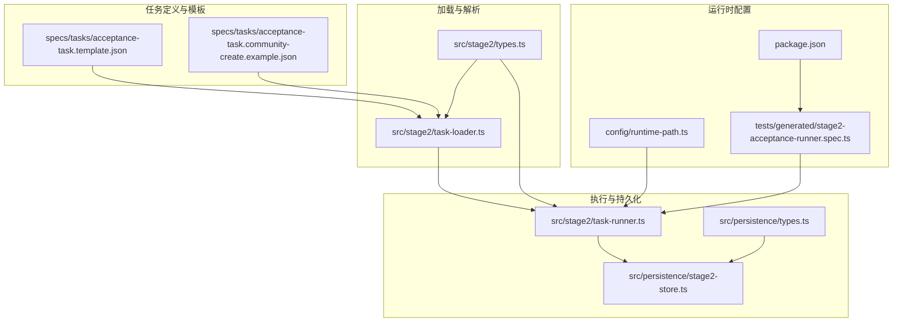
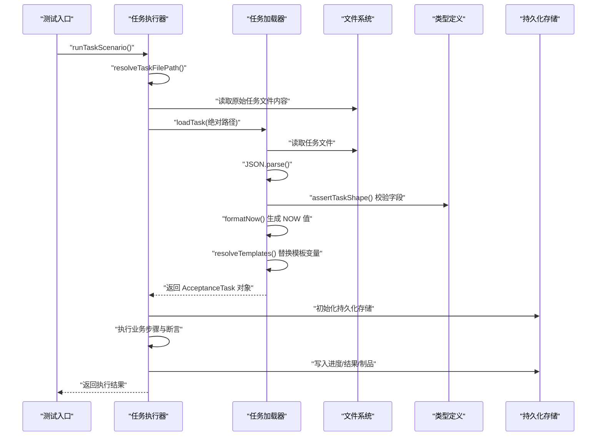
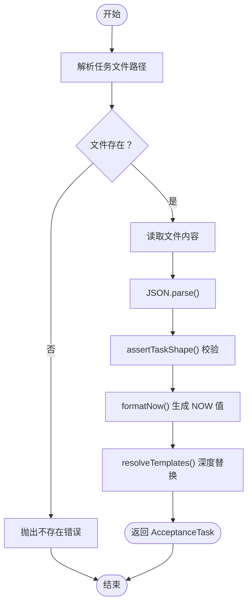
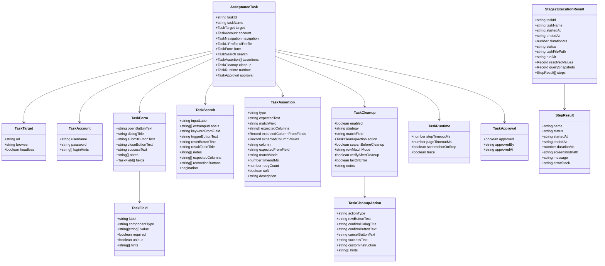
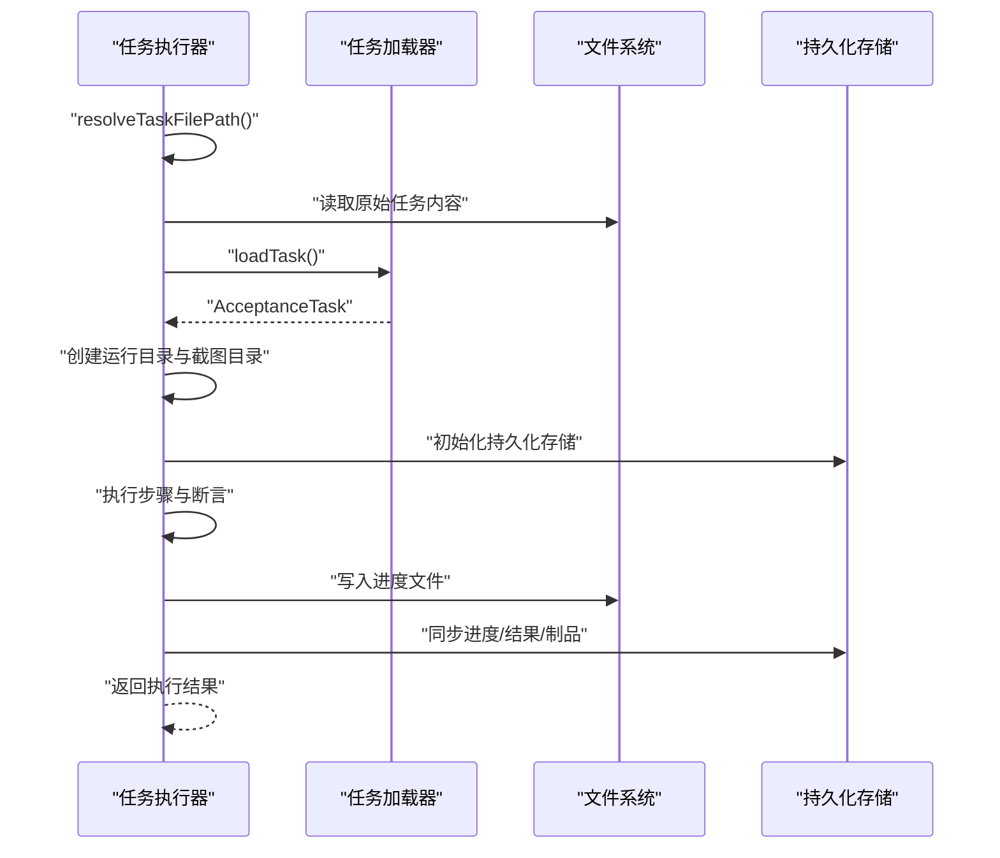
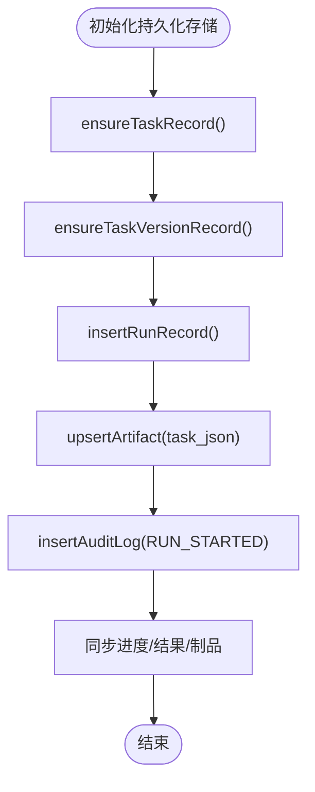
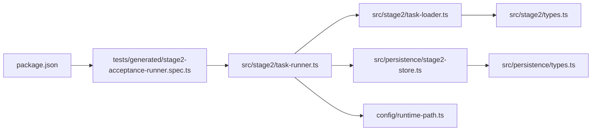
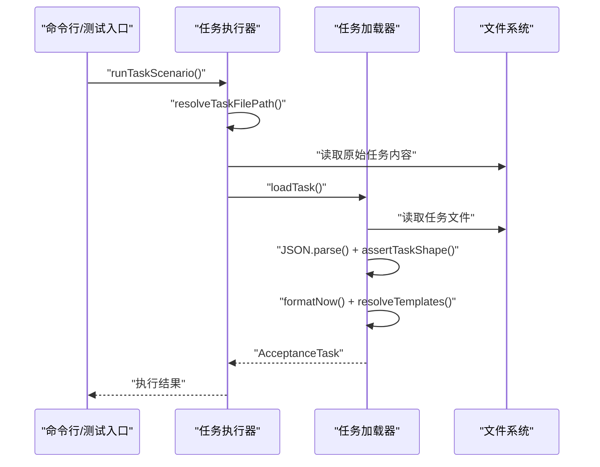

# 任务加载与解析

<cite>
**本文引用的文件**
- [src/stage2/task-loader.ts](file://src/stage2/task-loader.ts)
- [src/stage2/types.ts](file://src/stage2/types.ts)
- [specs/tasks/acceptance-task.template.json](file://specs/tasks/acceptance-task.template.json)
- [specs/tasks/acceptance-task.community-create.example.json](file://specs/tasks/acceptance-task.community-create.example.json)
- [src/stage2/task-runner.ts](file://src/stage2/task-runner.ts)
- [src/persistence/stage2-store.ts](file://src/persistence/stage2-store.ts)
- [src/persistence/types.ts](file://src/persistence/types.ts)
- [config/runtime-path.ts](file://config/runtime-path.ts)
- [tests/generated/stage2-acceptance-runner.spec.ts](file://tests/generated/stage2-acceptance-runner.spec.ts)
- [package.json](file://package.json)
</cite>

## 目录
1. [简介](#简介)
2. [项目结构](#项目结构)
3. [核心组件](#核心组件)
4. [架构总览](#架构总览)
5. [详细组件分析](#详细组件分析)
6. [依赖关系分析](#依赖关系分析)
7. [性能考量](#性能考量)
8. [故障排查指南](#故障排查指南)
9. [结论](#结论)
10. [附录](#附录)

## 简介
本文件系统性阐述 HI-TEST 项目中“任务加载与解析”的完整机制，覆盖以下方面：
- 任务文件的加载流程：文件路径解析、JSON 格式验证、模板变量处理
- 任务解析过程中的数据转换、字段校验与错误处理
- 模板变量的替换逻辑与作用域管理（NOW 时间戳与环境变量）
- 任务文件的缓存策略与性能优化
- 常见加载失败原因与解决方案
- 任务文件格式验证最佳实践与调试技巧
- 完整示例：从文件读取到对象实例化的全流程

## 项目结构
围绕任务加载与解析的关键目录与文件如下：
- src/stage2：任务加载器与执行器
- specs/tasks：任务模板与示例
- src/persistence：运行期持久化与结果写入
- config：运行时路径与环境变量加载
- tests：端到端测试入口

图表来源
- [src/stage2/task-loader.ts:1-91](file://src/stage2/task-loader.ts#L1-L91)
- [src/stage2/types.ts:141-154](file://src/stage2/types.ts#L141-L154)
- [specs/tasks/acceptance-task.template.json:1-141](file://specs/tasks/acceptance-task.template.json#L1-L141)
- [specs/tasks/acceptance-task.community-create.example.json:1-229](file://specs/tasks/acceptance-task.community-create.example.json#L1-L229)
- [src/stage2/task-runner.ts:2318-2380](file://src/stage2/task-runner.ts#L2318-L2380)
- [src/persistence/stage2-store.ts:101-123](file://src/persistence/stage2-store.ts#L101-L123)
- [config/runtime-path.ts:38-41](file://config/runtime-path.ts#L38-L41)
- [tests/generated/stage2-acceptance-runner.spec.ts:1-39](file://tests/generated/stage2-acceptance-runner.spec.ts#L1-L39)
- [package.json:6-11](file://package.json#L6-L11)

章节来源
- [src/stage2/task-loader.ts:1-91](file://src/stage2/task-loader.ts#L1-L91)
- [src/stage2/types.ts:141-154](file://src/stage2/types.ts#L141-L154)
- [specs/tasks/acceptance-task.template.json:1-141](file://specs/tasks/acceptance-task.template.json#L1-L141)
- [specs/tasks/acceptance-task.community-create.example.json:1-229](file://specs/tasks/acceptance-task.community-create.example.json#L1-L229)
- [src/stage2/task-runner.ts:2318-2380](file://src/stage2/task-runner.ts#L2318-L2380)
- [src/persistence/stage2-store.ts:101-123](file://src/persistence/stage2-store.ts#L101-L123)
- [config/runtime-path.ts:38-41](file://config/runtime-path.ts#L38-L41)
- [tests/generated/stage2-acceptance-runner.spec.ts:1-39](file://tests/generated/stage2-acceptance-runner.spec.ts#L1-L39)
- [package.json:6-11](file://package.json#L6-L11)

## 核心组件
- 任务加载器：负责路径解析、文件存在性校验、JSON 解析、字段完整性校验、模板变量替换
- 任务类型定义：强类型约束任务结构，确保后续解析与执行的安全性
- 任务执行器：在加载完成后，驱动 Playwright/AI 流程执行，并进行断言与清理
- 持久化存储：记录任务版本、运行记录、步骤、快照与制品
- 运行时路径与环境：统一输出目录、报告目录、运行结果目录等

章节来源
- [src/stage2/task-loader.ts:71-89](file://src/stage2/task-loader.ts#L71-L89)
- [src/stage2/types.ts:141-154](file://src/stage2/types.ts#L141-L154)
- [src/stage2/task-runner.ts:2318-2380](file://src/stage2/task-runner.ts#L2318-L2380)
- [src/persistence/stage2-store.ts:101-123](file://src/persistence/stage2-store.ts#L101-L123)
- [config/runtime-path.ts:38-41](file://config/runtime-path.ts#L38-L41)

## 架构总览
任务从“文件加载”到“对象实例化”，再到“执行与持久化”的整体流程如下：

图表来源
- [src/stage2/task-runner.ts:2318-2380](file://src/stage2/task-runner.ts#L2318-L2380)
- [src/stage2/task-loader.ts:71-89](file://src/stage2/task-loader.ts#L71-L89)
- [src/stage2/types.ts:141-154](file://src/stage2/types.ts#L141-L154)
- [src/persistence/stage2-store.ts:101-123](file://src/persistence/stage2-store.ts#L101-L123)

## 详细组件分析

### 组件A：任务加载器（task-loader）
职责与流程
- 路径解析：支持传参、环境变量、默认文件三者优先级
- 文件存在性校验：不存在则抛错
- JSON 解析：严格 JSON 格式，失败抛错
- 字段完整性校验：缺失关键字段抛错
- 模板变量替换：支持 NOW 时间戳与环境变量

模板变量处理细节
- NOW_TOKEN：固定令牌，替换为当前时间戳（YYYYMMDDHHMMSS）
- 环境变量：以 ${VAR_NAME} 形式引用，不存在时替换为空字符串
- 递归替换：对字符串、数组、对象进行深度遍历替换

字段校验要点
- 必填字段：taskId、taskName、target.url、account.username/password、form.openButtonText/form.submitButtonText、form.fields 非空
- 任何缺失均抛出明确错误信息，包含文件路径定位

复杂度与性能
- 路径解析与文件读取为 O(1)，JSON 解析与校验为 O(n)（n 为任务结构大小）
- 模板替换采用深度遍历，复杂度 O(n)
- 无显式缓存，每次加载均为全新解析

图表来源
- [src/stage2/task-loader.ts:71-89](file://src/stage2/task-loader.ts#L71-L89)
- [src/stage2/task-loader.ts:50-69](file://src/stage2/task-loader.ts#L50-L69)
- [src/stage2/task-loader.ts:19-48](file://src/stage2/task-loader.ts#L19-L48)

章节来源
- [src/stage2/task-loader.ts:71-89](file://src/stage2/task-loader.ts#L71-L89)
- [src/stage2/task-loader.ts:50-69](file://src/stage2/task-loader.ts#L50-L69)
- [src/stage2/task-loader.ts:19-48](file://src/stage2/task-loader.ts#L19-L48)

### 组件B：任务类型定义（types）
- 接口分层：Target/Account/Form/Search/Assertion/Cleanup/Runtime/Approval 等
- 关键任务对象：AcceptanceTask 作为顶层契约，包含必需字段与可选扩展
- 执行结果：Stage2ExecutionResult、StepResult 等，用于持久化与报告

图表来源
- [src/stage2/types.ts:5-154](file://src/stage2/types.ts#L5-L154)
- [src/stage2/types.ts:156-180](file://src/stage2/types.ts#L156-L180)

章节来源
- [src/stage2/types.ts:5-154](file://src/stage2/types.ts#L5-L154)
- [src/stage2/types.ts:156-180](file://src/stage2/types.ts#L156-L180)

### 组件C：任务执行器（task-runner）
- 入口：runTaskScenario，负责加载任务、创建运行目录、写入进度文件、持久化
- 路径解析：复用加载器的 resolveTaskFilePath
- 审批控制：可通过环境变量强制要求审批
- 进度与结果：实时写入 partial.json 与最终 result.json，并同步到持久化存储
- 运行时配置：基于 runtime 字段设置步骤/页面超时、截图与 trace

图表来源
- [src/stage2/task-runner.ts:2318-2380](file://src/stage2/task-runner.ts#L2318-L2380)
- [src/stage2/task-loader.ts:71-89](file://src/stage2/task-loader.ts#L71-L89)
- [src/persistence/stage2-store.ts:101-123](file://src/persistence/stage2-store.ts#L101-L123)

章节来源
- [src/stage2/task-runner.ts:2318-2380](file://src/stage2/task-runner.ts#L2318-L2380)
- [src/stage2/task-runner.ts:2332-2380](file://src/stage2/task-runner.ts#L2332-L2380)

### 组件D：持久化存储（stage2-store）
- 初始化：创建任务记录、任务版本记录、运行记录，关联任务文件路径与制品
- 敏感信息脱敏：对任务 JSON 中的密码进行掩码处理
- 进度同步：将运行中的进度写入本地文件并同步到数据库
- 版本管理：基于内容哈希识别任务版本，避免重复入库

图表来源
- [src/persistence/stage2-store.ts:101-123](file://src/persistence/stage2-store.ts#L101-L123)
- [src/persistence/stage2-store.ts:135-211](file://src/persistence/stage2-store.ts#L135-L211)

章节来源
- [src/persistence/stage2-store.ts:101-123](file://src/persistence/stage2-store.ts#L101-L123)
- [src/persistence/stage2-store.ts:135-211](file://src/persistence/stage2-store.ts#L135-L211)

## 依赖关系分析
- task-runner 依赖 task-loader 提供的路径解析与任务对象
- task-loader 依赖 types.ts 的类型定义进行字段校验
- task-runner 依赖 stage2-store 将执行结果持久化
- config/runtime-path.ts 提供运行时路径解析能力
- tests/generated/stage2-acceptance-runner.spec.ts 作为测试入口，调用 runTaskScenario 并断言结果

图表来源
- [tests/generated/stage2-acceptance-runner.spec.ts:1-39](file://tests/generated/stage2-acceptance-runner.spec.ts#L1-L39)
- [src/stage2/task-runner.ts:2318-2380](file://src/stage2/task-runner.ts#L2318-L2380)
- [src/stage2/task-loader.ts:71-89](file://src/stage2/task-loader.ts#L71-L89)
- [src/stage2/types.ts:141-154](file://src/stage2/types.ts#L141-L154)
- [src/persistence/stage2-store.ts:101-123](file://src/persistence/stage2-store.ts#L101-L123)
- [src/persistence/types.ts:34-98](file://src/persistence/types.ts#L34-L98)
- [config/runtime-path.ts:38-41](file://config/runtime-path.ts#L38-L41)
- [package.json:6-11](file://package.json#L6-L11)

章节来源
- [tests/generated/stage2-acceptance-runner.spec.ts:1-39](file://tests/generated/stage2-acceptance-runner.spec.ts#L1-L39)
- [src/stage2/task-runner.ts:2318-2380](file://src/stage2/task-runner.ts#L2318-L2380)
- [src/stage2/task-loader.ts:71-89](file://src/stage2/task-loader.ts#L71-L89)
- [src/stage2/types.ts:141-154](file://src/stage2/types.ts#L141-L154)
- [src/persistence/stage2-store.ts:101-123](file://src/persistence/stage2-store.ts#L101-L123)
- [src/persistence/types.ts:34-98](file://src/persistence/types.ts#L34-L98)
- [config/runtime-path.ts:38-41](file://config/runtime-path.ts#L38-L41)
- [package.json:6-11](file://package.json#L6-L11)

## 性能考量
- 加载阶段无内置缓存：每次运行均重新读取与解析任务文件，适合小到中型任务文件
- 模板替换为深度遍历：对大型任务 JSON 的字符串替换成本与结构规模线性相关
- 运行时写入：执行过程中频繁写入进度文件与持久化存储，建议合理设置截图与 trace 开关以降低 IO 压力
- 建议优化方向
  - 任务文件变更监控：在 CI 场景下，可基于文件修改时间与哈希进行缓存
  - 分段解析：对超大任务文件，考虑拆分为多个子任务或分段配置
  - 并发执行：在多任务场景下，避免重复解析同一任务文件

[本节为通用性能讨论，无需特定文件来源]

## 故障排查指南
常见加载失败原因与解决
- 任务文件不存在
  - 现象：抛出“任务文件不存在”错误
  - 排查：确认传入路径、环境变量 STAGE2_TASK_FILE、默认路径是否正确
  - 解决：修正路径或设置正确的环境变量
- JSON 格式错误
  - 现象：JSON.parse 抛错
  - 排查：使用 JSON 校验工具检查语法；检查模板变量是否正确转义
  - 解决：修复语法问题或调整模板变量
- 关键字段缺失
  - 现象：assertTaskShape 抛出缺失字段错误
  - 排查：对照 AcceptanceTask 字段清单，逐项核对
  - 解决：补齐缺失字段（如 taskId、taskName、target.url、account、form 等）
- 模板变量未生效
  - 现象：${VAR_NAME} 未被替换
  - 排查：确认环境变量是否设置；NOW_TOKEN 是否在任务中使用
  - 解决：设置环境变量或使用正确的 NOW_TOKEN
- 审批限制导致执行失败
  - 现象：STAGE2_REQUIRE_APPROVAL=true 且任务未审批
  - 排查：检查 approval 字段
  - 解决：设置 approval.approved=true 或关闭审批限制

调试技巧
- 在测试入口中打印任务文件路径与解析后的对象关键字段
- 使用最小化任务文件快速定位问题
- 逐步注释掉模板变量，确认是否由变量替换导致异常
- 检查运行目录与产物文件，定位执行阶段问题

章节来源
- [src/stage2/task-loader.ts:71-89](file://src/stage2/task-loader.ts#L71-L89)
- [src/stage2/task-loader.ts:50-69](file://src/stage2/task-loader.ts#L50-L69)
- [src/stage2/task-runner.ts:2318-2380](file://src/stage2/task-runner.ts#L2318-L2380)

## 结论
本机制通过“强类型契约 + 严格校验 + 模板替换”的方式，确保任务文件从加载到执行的可靠性与可维护性。当前实现简洁高效，适合中小型任务场景；对于大规模任务或高频执行场景，建议引入缓存与分段策略以进一步优化性能。

[本节为总结性内容，无需特定文件来源]

## 附录

### 任务文件格式验证最佳实践
- 使用模板文件作为基线，逐步添加业务字段
- 在 CI 中加入 JSON 语法校验与字段完整性检查
- 对敏感字段（如密码）使用环境变量注入，避免硬编码
- 使用 NOW_TOKEN 生成唯一标识，避免数据冲突

### 完整任务加载示例（从文件读取到对象实例化）
- 步骤概览
  - 解析任务文件路径：支持参数、环境变量、默认文件
  - 读取原始内容并解析为对象
  - 校验关键字段完整性
  - 生成 NOW 值并替换模板变量
  - 返回强类型 AcceptanceTask 对象

图表来源
- [src/stage2/task-runner.ts:2318-2380](file://src/stage2/task-runner.ts#L2318-L2380)
- [src/stage2/task-loader.ts:71-89](file://src/stage2/task-loader.ts#L71-L89)

章节来源
- [src/stage2/task-runner.ts:2318-2380](file://src/stage2/task-runner.ts#L2318-L2380)
- [src/stage2/task-loader.ts:71-89](file://src/stage2/task-loader.ts#L71-L89)