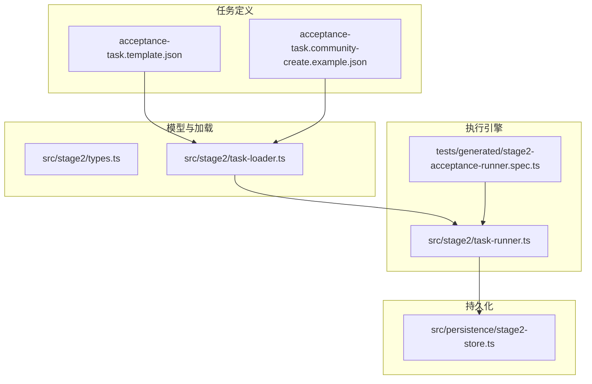
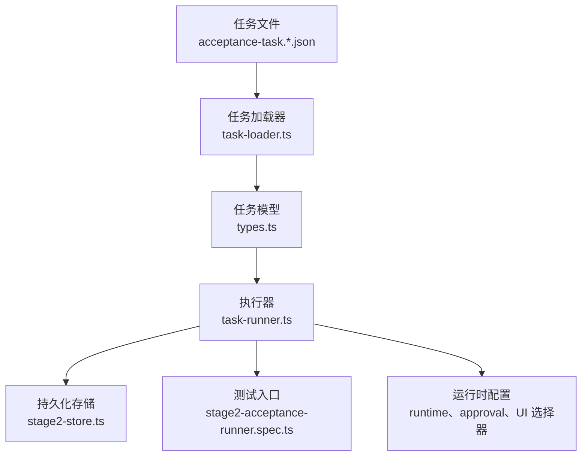
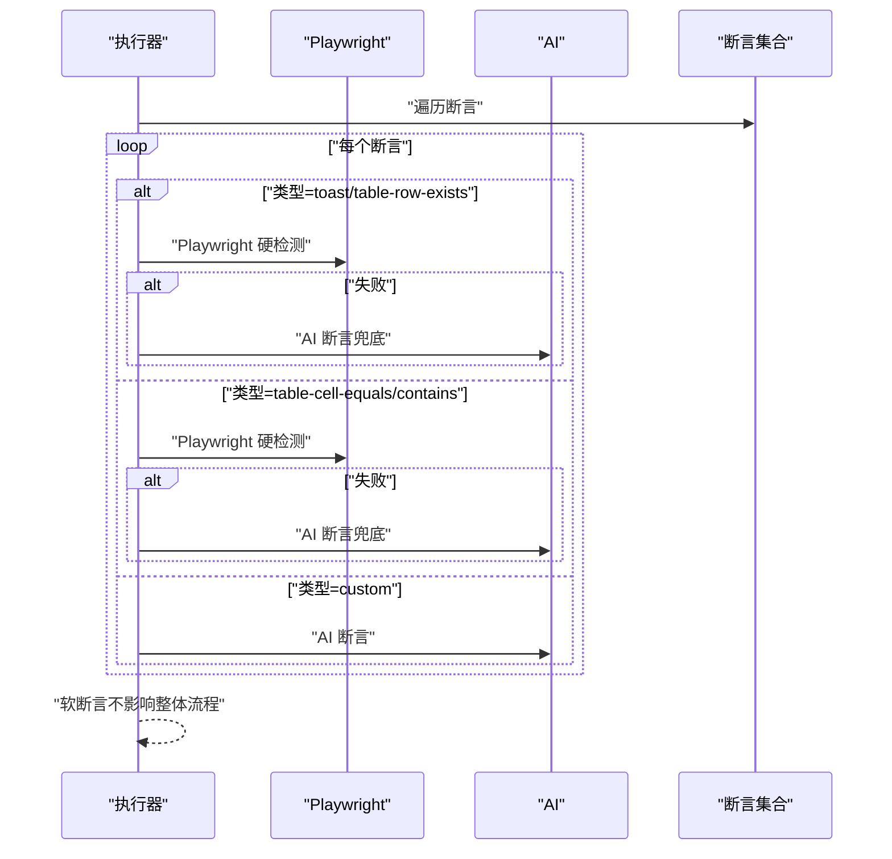
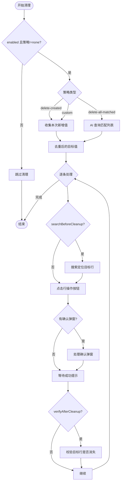
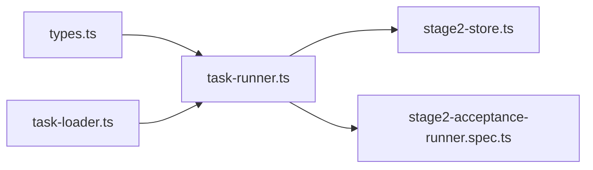

# 任务定义与结构

<cite>
**本文引用的文件**
- [acceptance-task.template.json](file://specs/tasks/acceptance-task.template.json)
- [acceptance-task.community-create.example.json](file://specs/tasks/acceptance-task.community-create.example.json)
- [types.ts](file://src/stage2/types.ts)
- [task-runner.ts](file://src/stage2/task-runner.ts)
- [task-loader.ts](file://src/stage2/task-loader.ts)
- [stage2-store.ts](file://src/persistence/stage2-store.ts)
- [stage2-acceptance-runner.spec.ts](file://tests/generated/stage2-acceptance-runner.spec.ts)
- [package.json](file://package.json)
- [login-e2e.md](file://specs/login-e2e.md)
- [第二段最小执行器实现_2026-03-11.md](file://.tasks/第二段最小执行器实现_2026-03-11.md)
- [AI自主代理验收系统开发改造方案_2026-03-11.md](file://.tasks/AI自主代理验收系统开发改造方案_2026-03-11.md)
- [stage2跨平台通用断言与清理优化实现_2026-03-12.md](file://.tasks/stage2跨平台通用断言与清理优化实现_2026-03-12.md)
</cite>

## 目录
1. [简介](#简介)
2. [项目结构](#项目结构)
3. [核心组件](#核心组件)
4. [架构总览](#架构总览)
5. [详细组件分析](#详细组件分析)
6. [依赖关系分析](#依赖关系分析)
7. [性能考量](#性能考量)
8. [故障排查指南](#故障排查指南)
9. [结论](#结论)
10. [附录](#附录)

## 简介
本文件系统化阐述 HI-TEST 的任务定义与结构，围绕 AcceptanceTask 接口及其子结构进行深入解析，覆盖字段语义、数据类型、配置要求与最佳实践；详解 TaskTarget、TaskAccount、TaskNavigation、TaskForm、TaskSearch、TaskAssertion、TaskCleanup 等核心组件的定义与使用方法；说明任务模板的设计模式与变量解析机制；给出任务版本管理与向后兼容策略；并提供多类业务场景的配置示例与上手指引。

## 项目结构
- 任务定义与模板位于 specs/tasks 下，包含通用模板与示例任务。
- 任务模型与运行器位于 src/stage2，包含类型定义、任务加载与执行流程。
- 持久化层位于 src/persistence，负责任务版本、运行记录与产物归档。
- 测试入口位于 tests/generated，提供第二段执行的测试入口。
- 任务与执行相关的设计文档位于 .tasks 与 specs 目录。

图表来源
- [acceptance-task.template.json:1-141](file://specs/tasks/acceptance-task.template.json#L1-L141)
- [acceptance-task.community-create.example.json:1-229](file://specs/tasks/acceptance-task.community-create.example.json#L1-L229)
- [types.ts:1-180](file://src/stage2/types.ts#L1-L180)
- [task-loader.ts:1-91](file://src/stage2/task-loader.ts#L1-L91)
- [task-runner.ts:1-120](file://src/stage2/task-runner.ts#L1-L120)
- [stage2-store.ts:1-120](file://src/persistence/stage2-store.ts#L1-L120)
- [stage2-acceptance-runner.spec.ts](file://tests/generated/stage2-acceptance-runner.spec.ts)

章节来源
- [acceptance-task.template.json:1-141](file://specs/tasks/acceptance-task.template.json#L1-L141)
- [acceptance-task.community-create.example.json:1-229](file://specs/tasks/acceptance-task.community-create.example.json#L1-L229)
- [types.ts:1-180](file://src/stage2/types.ts#L1-L180)
- [task-loader.ts:1-91](file://src/stage2/task-loader.ts#L1-L91)
- [task-runner.ts:1-120](file://src/stage2/task-runner.ts#L1-L120)
- [stage2-store.ts:1-120](file://src/persistence/stage2-store.ts#L1-L120)
- [stage2-acceptance-runner.spec.ts](file://tests/generated/stage2-acceptance-runner.spec.ts)

## 核心组件
本节对 AcceptanceTask 及其子结构进行逐项说明，包括字段含义、数据类型、是否必填、可选配置与典型用途。

- AcceptanceTask
  - taskId: string（必填）- 任务唯一标识，用于运行目录与持久化关联。
  - taskName: string（必填）- 任务名称，便于报告与审计。
  - target: TaskTarget（必填）- 目标站点与浏览器配置。
  - account: TaskAccount（必填）- 登录凭据与提示。
  - navigation?: TaskNavigation（可选）- 首页就绪与菜单导航提示。
  - uiProfile?: TaskUiProfile（可选）- 跨平台 UI 选择器集合（表格、提示、弹窗）。
  - form: TaskForm（必填）- 表单打开、提交、字段与提示。
  - search?: TaskSearch（可选）- 搜索区配置与期望列。
  - assertions?: TaskAssertion[]（可选）- 断言集合。
  - cleanup?: TaskCleanup（可选）- 清理策略与动作。
  - runtime?: TaskRuntime（可选）- 运行时超时与截图/追踪开关。
  - approval?: TaskApproval（可选）- 人工审批标记。

- TaskTarget
  - url: string（必填）- 目标站点 URL。
  - browser?: string（可选）- 浏览器类型（如 chromium）。
  - headless?: boolean（可选）- 是否无头模式。

- TaskAccount
  - username: string（必填）- 用户名或标识。
  - password: string（必填）- 密码。
  - loginHints?: string[]（可选）- 登录页 UI 提示，辅助识别输入框与按钮。

- TaskNavigation
  - homeReadyText?: string（可选）- 首页就绪文本，用于等待。
  - menuPath?: string[]（可选）- 菜单层级路径。
  - menuHints?: string[]（可选）- 菜单导航提示。

- TaskUiProfile
  - tableRowSelectors?: string[]（可选）- 表格行选择器，支持多框架优先级。
  - toastSelectors?: string[]（可选）- Toast/消息选择器。
  - dialogSelectors?: string[]（可选）- 弹窗容器选择器。

- TaskForm
  - openButtonText: string（必填）- 打开表单的按钮文案。
  - dialogTitle?: string（可选）- 表单弹窗标题。
  - submitButtonText: string（必填）- 提交按钮文案。
  - closeButtonText?: string（可选）- 关闭按钮文案。
  - successText?: string（可选）- 成功提示文案。
  - notes?: string[]（可选）- 表单交互说明。
  - fields: TaskField[]（必填）- 字段列表。

- TaskField
  - label: string（必填）- 字段标签。
  - componentType: 'input' | 'textarea' | 'cascader' | string（必填）- 组件类型。
  - value: string | string[]（必填）- 字段值（级联可为数组）。
  - required?: boolean（可选）- 是否必填。
  - unique?: boolean（可选）- 是否唯一（用于清理匹配）。
  - hints?: string[]（可选）- 字段 UI 提示。

- TaskSearch
  - inputLabel: string（必填）- 搜索关键词输入框标签。
  - extraInputLabels?: string[]（可选）- 额外输入框标签。
  - keywordFromField?: string（可选）- 关键词来源字段。
  - triggerButtonText?: string（可选）- 触发搜索按钮文案。
  - resetButtonText?: string（可选）- 重置按钮文案。
  - resultTableTitle?: string（可选）- 结果表格标题。
  - notes?: string[]（可选）- 搜索区说明。
  - expectedColumns?: string[]（可选）- 期望列名。
  - rowActionButtons?: string[]（可选）- 行操作按钮文案列表。
  - pagination?: { pageSizeText?: string; summaryPattern?: string }（可选）- 分页信息。

- TaskAssertion
  - type: string（必填）- 断言类型（如 toast、table-row-exists、table-cell-equals、table-cell-contains、custom）。
  - expectedText?: string（可选）- Toast 文本。
  - matchField?: string（可选）- 匹配字段（用于行存在/单元格断言）。
  - expectedColumns?: string[]（可选）- 期望列集合（table-cell-equals）。
  - expectedColumnFromFields?: Record<string, string>（可选）- 列名到字段的映射。
  - expectedColumnValues?: Record<string, string>（可选）- 列名到期望值的映射。
  - column?: string（可选）- 单元格断言列名。
  - expectedFromField?: string（可选）- 期望值来源字段（table-cell-contains）。
  - matchMode?: 'exact' | 'contains'（可选）- 行匹配模式。
  - timeoutMs?: number（可选）- 断言超时时间。
  - retryCount?: number（可选）- 重试次数。
  - soft?: boolean（可选）- 是否软断言。
  - description?: string（可选）- 自定义断言描述（AI 断言）。

- TaskCleanup
  - enabled?: boolean（可选）- 是否启用清理。
  - strategy?: 'delete-created' | 'delete-all-matched' | 'custom' | 'none'（可选）- 清理策略。
  - matchField?: string（可选）- 匹配字段（通常与表单 unique 字段对应）。
  - action?: TaskCleanupAction（可选）- 清理动作。
  - searchBeforeCleanup?: boolean（可选）- 清理前是否先搜索定位。
  - rowMatchMode?: 'exact' | 'contains'（可选）- 行匹配模式。
  - verifyAfterCleanup?: boolean（可选）- 删除后是否校验目标行消失。
  - failOnError?: boolean（可选）- 清理失败是否中断任务。
  - notes?: string（可选）- 清理说明。

- TaskCleanupAction
  - actionType: 'delete' | 'custom'（可选）- 动作类型。
  - rowButtonText?: string（可选）- 行操作按钮文案。
  - confirmDialogTitle?: string（可选）- 确认弹窗标题。
  - confirmButtonText?: string（可选）- 确认按钮文案。
  - cancelButtonText?: string（可选）- 取消按钮文案。
  - successText?: string（可选）- 成功提示文案。
  - customInstruction?: string（可选）- 自定义 AI 指令。
  - hints?: string[]（可选）- 操作提示。

- TaskRuntime
  - stepTimeoutMs?: number（可选）- 步骤超时。
  - pageTimeoutMs?: number（可选）- 页面加载超时。
  - screenshotOnStep?: boolean（可选）- 步骤截图开关。
  - trace?: boolean（可选）- 是否开启追踪。

- TaskApproval
  - approved?: boolean（可选）- 是否已审批。
  - approvedBy?: string（可选）- 审批人。
  - approvedAt?: string（可选）- 审批时间。

章节来源
- [types.ts:1-180](file://src/stage2/types.ts#L1-L180)
- [acceptance-task.template.json:1-141](file://specs/tasks/acceptance-task.template.json#L1-L141)
- [acceptance-task.community-create.example.json:1-229](file://specs/tasks/acceptance-task.community-create.example.json#L1-L229)

## 架构总览
下图展示了从任务文件到执行与持久化的整体流程，以及各模块之间的依赖关系。

图表来源
- [task-loader.ts:79-89](file://src/stage2/task-loader.ts#L79-L89)
- [types.ts:141-154](file://src/stage2/types.ts#L141-L154)
- [task-runner.ts:2318-2380](file://src/stage2/task-runner.ts#L2318-L2380)
- [stage2-store.ts:101-123](file://src/persistence/stage2-store.ts#L101-L123)
- [stage2-acceptance-runner.spec.ts](file://tests/generated/stage2-acceptance-runner.spec.ts)

章节来源
- [task-loader.ts:79-89](file://src/stage2/task-loader.ts#L79-L89)
- [task-runner.ts:2318-2380](file://src/stage2/task-runner.ts#L2318-L2380)
- [stage2-store.ts:101-123](file://src/persistence/stage2-store.ts#L101-L123)
- [stage2-acceptance-runner.spec.ts](file://tests/generated/stage2-acceptance-runner.spec.ts)

## 详细组件分析

### AcceptanceTask 类型与字段解析
- 字段分类
  - 必填字段：taskId、taskName、target.url、account.username、account.password、form.openButtonText、form.submitButtonText、form.fields。
  - 可选字段：navigation、uiProfile、search、assertions、cleanup、runtime、approval。
- 加载与校验
  - 通过 task-loader.ts 读取任务文件，进行最小字段校验与模板变量解析。
  - 支持 ${NOW_YYYYMMDDHHMMSS} 与 ${ENV_VAR} 占位符解析。
- 执行前审批
  - 当 STAGE2_REQUIRE_APPROVAL=true 时，任务需 approval.approved=true 才能执行。

章节来源
- [task-loader.ts:50-89](file://src/stage2/task-loader.ts#L50-L89)
- [task-runner.ts:2325-2330](file://src/stage2/task-runner.ts#L2325-L2330)
- [第二段最小执行器实现_2026-03-11.md:22-26](file://.tasks/第二段最小执行器实现_2026-03-11.md#L22-L26)

### TaskTarget、TaskAccount、TaskNavigation
- Target 与 Account
  - 用于初始化浏览器与登录，支持 headless 与浏览器类型配置。
- Navigation
  - 通过 homeReadyText 与 menuPath 辅助等待首页就绪与菜单展开，menuHints 提升跨平台兼容性。

章节来源
- [types.ts:5-21](file://src/stage2/types.ts#L5-L21)
- [acceptance-task.template.json:4-28](file://specs/tasks/acceptance-task.template.json#L4-L28)

### TaskUiProfile 与跨平台 UI 适配
- 通过 tableRowSelectors、toastSelectors、dialogSelectors 三类选择器集合，提升多 UI 框架（Element Plus、Ant Design、iView 等）的兼容性。
- 执行器内部提供解析与回退策略，优先使用配置，否则回退至 AI 判定。

章节来源
- [types.ts:58-65](file://src/stage2/types.ts#L58-L65)
- [task-runner.ts:1570-1572](file://src/stage2/task-runner.ts#L1570-L1572)

### TaskForm 与 TaskField
- Form
  - openButtonText、submitButtonText 为必填，用于定位弹窗与提交按钮。
  - dialogTitle、successText、notes 提升可读性与可维护性。
- Field
  - componentType 支持 input、textarea、cascader 与自定义字符串。
  - required/unique 标记影响断言与清理策略。
  - hints 用于提取占位文案候选，辅助定位输入框。

章节来源
- [types.ts:23-40](file://src/stage2/types.ts#L23-L40)
- [acceptance-task.community-create.example.json:46-120](file://specs/tasks/acceptance-task.community-create.example.json#L46-L120)

### TaskSearch
- 关键字段
  - inputLabel、keywordFromField、triggerButtonText、resetButtonText、resultTableTitle。
  - expectedColumns、rowActionButtons、pagination 用于断言与清理。
- 使用建议
  - 为搜索区补充 notes，明确按钮与输入框布局。
  - 为分页补充 pageSizeText 与 summaryPattern，便于断言。

章节来源
- [types.ts:42-56](file://src/stage2/types.ts#L42-L56)
- [acceptance-task.community-create.example.json:121-156](file://specs/tasks/acceptance-task.community-create.example.json#L121-L156)

### TaskAssertion 断言体系
- 断言类型
  - toast：基于 Toast 文本断言。
  - table-row-exists：基于行存在断言，支持 exact/contains 匹配。
  - table-cell-equals：基于单元格值严格比对，支持列映射与期望值映射。
  - table-cell-contains：基于单元格值包含断言。
  - custom：自定义描述断言，由 AI 执行。
- 重试与回退
  - Playwright 硬检测优先，失败后回退至 AI 断言。
  - 支持 timeoutMs、retryCount、soft 控制执行策略。

图表来源
- [task-runner.ts:1562-1917](file://src/stage2/task-runner.ts#L1562-L1917)

章节来源
- [task-runner.ts:1562-1917](file://src/stage2/task-runner.ts#L1562-L1917)
- [stage2跨平台通用断言与清理优化实现_2026-03-12.md:13-22](file://.tasks/stage2跨平台通用断言与清理优化实现_2026-03-12.md#L13-L22)

### TaskCleanup 清理流程
- 策略
  - delete-created：仅删除本次新增数据。
  - delete-all-matched：删除所有匹配数据（通过 AI 查询列表）。
  - custom：使用自定义指令清理。
  - none：禁用清理。
- 动作
  - 支持删除与自定义两种 actionType。
  - 支持确认弹窗标题/按钮文案、成功提示文案与 hints。
- 安全性
  - 支持 searchBeforeCleanup、rowMatchMode、verifyAfterCleanup、failOnError 等安全开关。

图表来源
- [task-runner.ts:2218-2316](file://src/stage2/task-runner.ts#L2218-L2316)

章节来源
- [task-runner.ts:2218-2316](file://src/stage2/task-runner.ts#L2218-L2316)

### 任务模板与变量解析
- 模板文件
  - acceptance-task.template.json 提供通用字段与注释示例。
  - acceptance-task.community-create.example.json 提供业务示例（小区创建与回查）。
- 变量解析
  - ${NOW_YYYYMMDDHHMMSS}：注入当前时间戳。
  - ${ENV_VAR}：注入环境变量，缺失时为空字符串。
  - 解析在加载阶段完成，确保运行时无需再次解析。

章节来源
- [acceptance-task.template.json:1-141](file://specs/tasks/acceptance-task.template.json#L1-L141)
- [acceptance-task.community-create.example.json:1-229](file://specs/tasks/acceptance-task.community-create.example.json#L1-L229)
- [task-loader.ts:19-48](file://src/stage2/task-loader.ts#L19-L48)

### 任务版本管理与向后兼容
- 版本记录
  - 通过 contentHash 与 content_json 记录任务版本，更新任务时递增版本号。
- 兼容策略
  - 新增字段采用可选策略，旧任务可平滑升级。
  - 通过 UI Profile 与断言扩展，提升跨平台兼容性而不破坏既有任务。

章节来源
- [stage2-store.ts:187-261](file://src/persistence/stage2-store.ts#L187-L261)
- [stage2跨平台通用断言与清理优化实现_2026-03-12.md:13-27](file://.tasks/stage2跨平台通用断言与清理优化实现_2026-03-12.md#L13-L27)

### 业务场景配置示例
- 示例一：登录与断言
  - 参考 login-e2e.md 的环境变量与断言思路，结合 TaskAccount 与 TaskAssertion 的 toast/table-row-exists 类型，快速构建登录验收任务。
- 示例二：表单新增与回查
  - 参考 acceptance-task.community-create.example.json 的 form/search/assertions/cleanup 配置，覆盖“新增-提交-回查-断言-清理”的完整闭环。
- 示例三：跨平台 UI 适配
  - 通过 uiProfile 的 tableRowSelectors、toastSelectors、dialogSelectors，适配 Element Plus、Ant Design 等 UI 框架。

章节来源
- [login-e2e.md:24-46](file://specs/login-e2e.md#L24-L46)
- [acceptance-task.community-create.example.json:1-229](file://specs/tasks/acceptance-task.community-create.example.json#L1-L229)
- [types.ts:58-65](file://src/stage2/types.ts#L58-L65)

## 依赖关系分析
- 模块耦合
  - task-runner.ts 依赖 types.ts 的接口定义与 task-loader.ts 的任务加载。
  - stage2-store.ts 依赖 types.ts 的模型与 task-runner.ts 的执行结果。
- 外部依赖
  - Playwright 作为自动化引擎，Midscene AI 用于断言与清理兜底。
  - SQLite 用于本地持久化，迁移脚本在 db/migrations。

图表来源
- [types.ts:1-180](file://src/stage2/types.ts#L1-L180)
- [task-runner.ts:1-120](file://src/stage2/task-runner.ts#L1-L120)
- [task-loader.ts:1-91](file://src/stage2/task-loader.ts#L1-L91)
- [stage2-store.ts:1-120](file://src/persistence/stage2-store.ts#L1-L120)
- [stage2-acceptance-runner.spec.ts](file://tests/generated/stage2-acceptance-runner.spec.ts)

章节来源
- [types.ts:1-180](file://src/stage2/types.ts#L1-L180)
- [task-runner.ts:1-120](file://src/stage2/task-runner.ts#L1-L120)
- [task-loader.ts:1-91](file://src/stage2/task-loader.ts#L1-L91)
- [stage2-store.ts:1-120](file://src/persistence/stage2-store.ts#L1-L120)
- [stage2-acceptance-runner.spec.ts](file://tests/generated/stage2-acceptance-runner.spec.ts)

## 性能考量
- 重试与超时
  - 断言支持 retryCount 与 timeoutMs，建议根据页面复杂度与网络状况合理设置。
- 截图与追踪
  - screenshotOnStep 与 trace 会增加 IO 与内存消耗，建议在调试阶段开启，稳定后关闭。
- 选择器命中率
  - 通过 uiProfile 与 hints 提升定位效率，减少回退至 AI 的次数。

## 故障排查指南
- 任务加载失败
  - 检查 STAGE2_TASK_FILE 指向与文件存在性；确认最小字段校验通过。
- 登录失败
  - 核对 account.username/password 与 loginHints；必要时在 navigation 中补充 homeReadyText。
- 断言失败
  - 检查断言类型与字段映射（expectedColumnFromFields/expectedColumnValues）；适当提高 retryCount 与 timeoutMs。
- 清理失败
  - 检查 cleanup.strategy 与 matchField；确认 searchBeforeCleanup 与 rowMatchMode；必要时开启 verifyAfterCleanup。
- 审批门禁
  - 当 STAGE2_REQUIRE_APPROVAL=true 时，确保 approval.approved=true。

章节来源
- [task-loader.ts:80-89](file://src/stage2/task-loader.ts#L80-L89)
- [task-runner.ts:2325-2330](file://src/stage2/task-runner.ts#L2325-L2330)
- [stage2-acceptance-runner.spec.ts](file://tests/generated/stage2-acceptance-runner.spec.ts)

## 结论
HI-TEST 的任务定义以 AcceptanceTask 为核心，通过结构化字段与模板变量实现高复用与强可维护性；借助 TaskUiProfile 与断言/清理的回退策略，实现跨平台与多 UI 框架的稳定执行；版本化持久化保障任务演进与可追溯。建议在实际业务中遵循“最小字段必填、可选字段按需补齐、断言与清理安全开关前置”的原则，结合示例任务快速落地。

## 附录
- 运行与脚本
  - npm run stage2:run 与 npm run stage2:run:headed 用于执行第二段验收任务。
- 目录产物
  - t_acceptance-results/<taskId>/<timestamp>/result.json 与 screenshots/ 为标准产物目录。

章节来源
- [package.json:6-11](file://package.json#L6-L11)
- [第二段最小执行器实现_2026-03-11.md:47-52](file://.tasks/第二段最小执行器实现_2026-03-11.md#L47-L52)