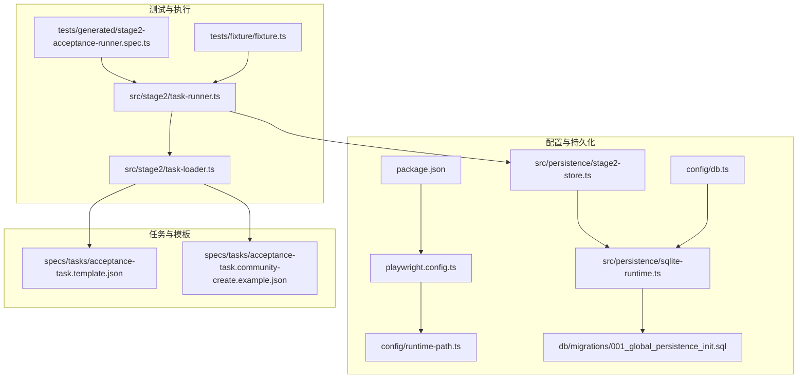
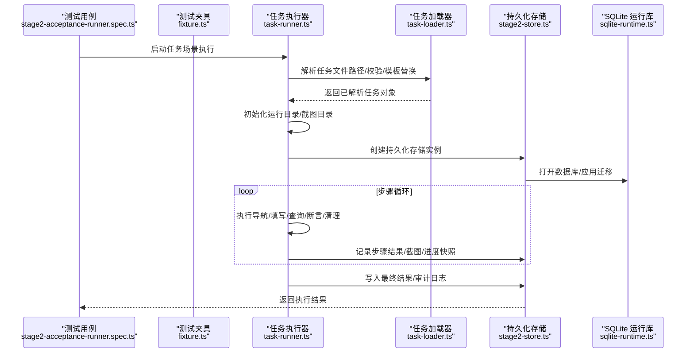
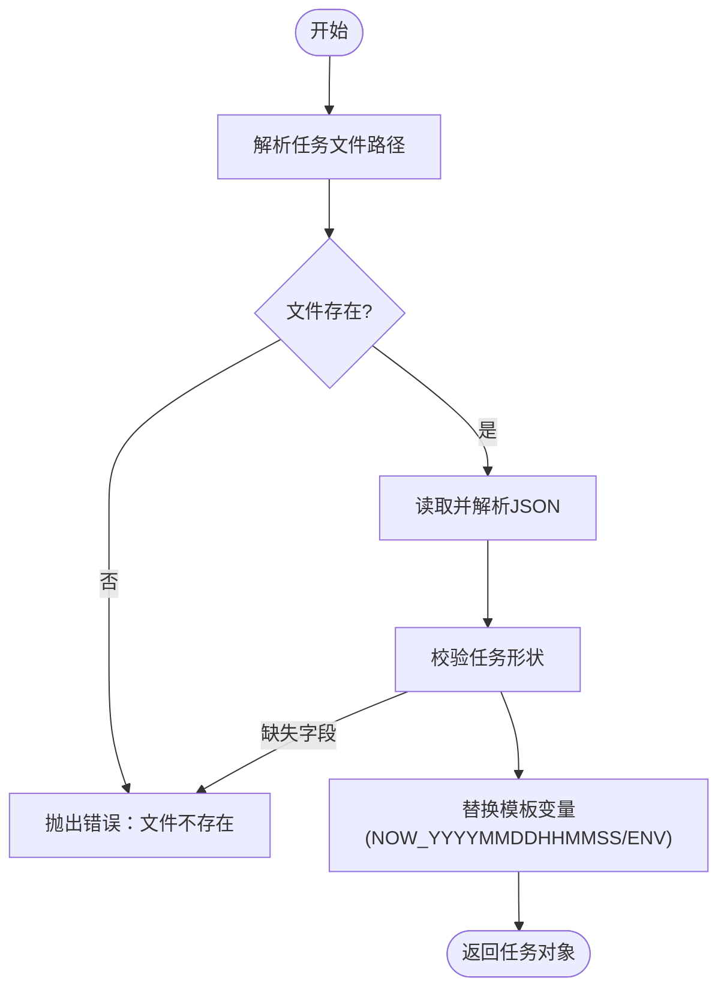
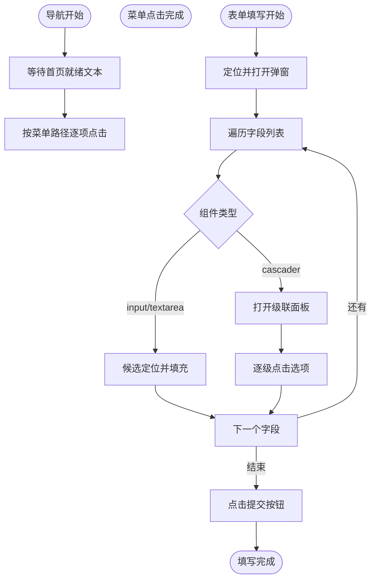
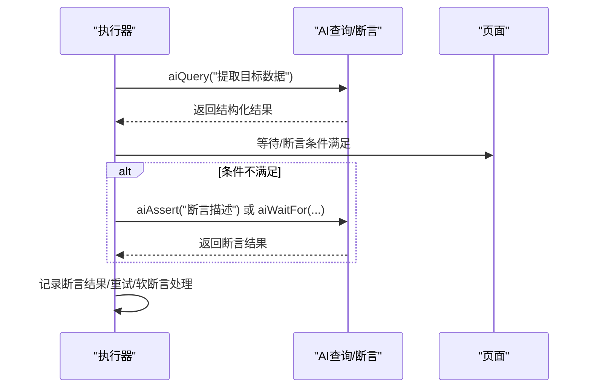
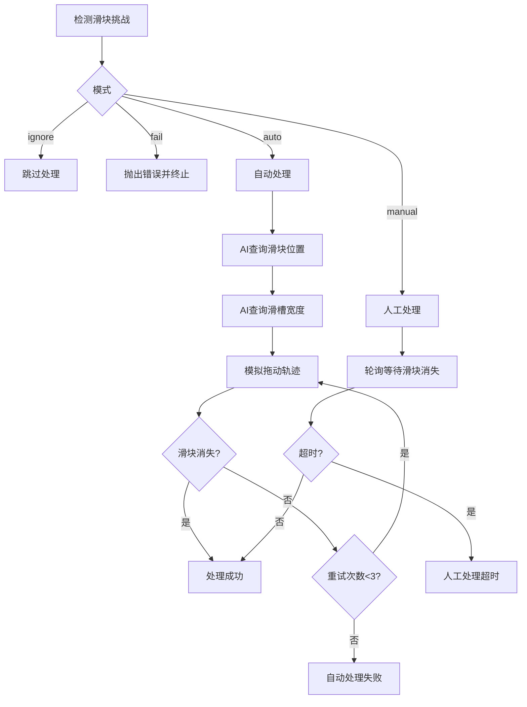
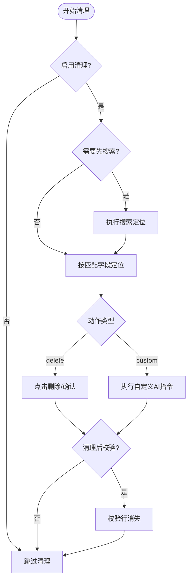
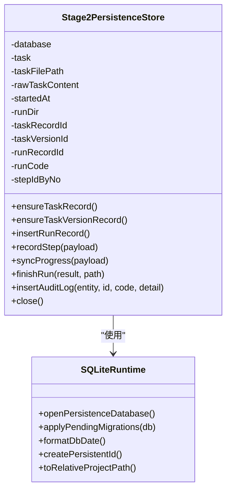
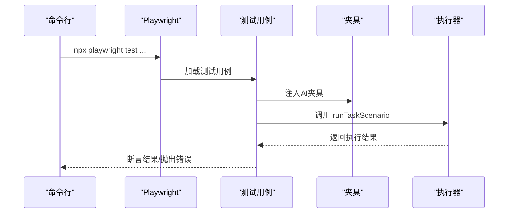
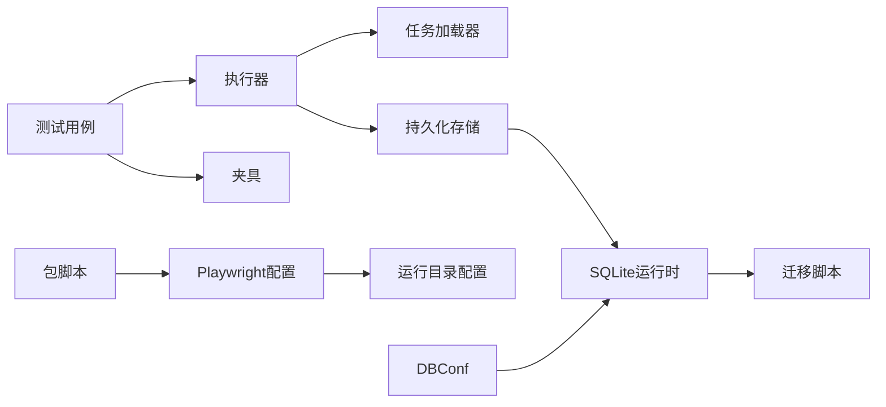

# 任务执行流程

<cite>
**本文引用的文件**
- [README.md](file://README.md)
- [package.json](file://package.json)
- [playwright.config.ts](file://playwright.config.ts)
- [config/runtime-path.ts](file://config/runtime-path.ts)
- [config/db.ts](file://config/db.ts)
- [src/persistence/sqlite-runtime.ts](file://src/persistence/sqlite-runtime.ts)
- [db/migrations/001_global_persistence_init.sql](file://db/migrations/001_global_persistence_init.sql)
- [src/persistence/stage2-store.ts](file://src/persistence/stage2-store.ts)
- [src/stage2/task-runner.ts](file://src/stage2/task-runner.ts)
- [src/stage2/task-loader.ts](file://src/stage2/task-loader.ts)
- [src/stage2/types.ts](file://src/stage2/types.ts)
- [specs/tasks/acceptance-task.template.json](file://specs/tasks/acceptance-task.template.json)
- [specs/tasks/acceptance-task.community-create.example.json](file://specs/tasks/acceptance-task.community-create.example.json)
- [tests/generated/stage2-acceptance-runner.spec.ts](file://tests/generated/stage2-acceptance-runner.spec.ts)
- [tests/fixture/fixture.ts](file://tests/fixture/fixture.ts)
</cite>

## 目录
1. [引言](#引言)
2. [项目结构](#项目结构)
3. [核心组件](#核心组件)
4. [架构总览](#架构总览)
5. [详细组件分析](#详细组件分析)
6. [依赖关系分析](#依赖关系分析)
7. [性能考量](#性能考量)
8. [故障排除指南](#故障排除指南)
9. [结论](#结论)
10. [附录](#附录)

## 引言
本文件面向 HI-TEST 第二阶段（Stage2）的任务执行流程，系统性阐述从任务初始化、页面导航、表单填写、数据查询、断言验证到清理收尾的完整编排逻辑。文档覆盖错误处理机制（重试策略、异常捕获、回滚思路）、执行状态跟踪与监控（步骤级进度记录、性能指标采集）、可视化时序图与流程图，并提供调试技巧与故障排除方法，以及不同任务类型的执行示例与最佳实践。

## 项目结构
- 核心执行入口位于测试用例中，通过 Playwright 测试框架驱动 Midscene AI 能力与 Playwright 自动化。
- 任务定义采用 JSON 模板，支持动态变量替换与跨平台 UI Profile。
- 数据持久化采用 SQLite，统一落库运行主记录、步骤明细、快照与附件，便于审计与回溯。
- 运行产物与报告目录由环境变量集中管理，便于统一归档与检索。

**图表来源**
- [tests/generated/stage2-acceptance-runner.spec.ts:1-39](file://tests/generated/stage2-acceptance-runner.spec.ts#L1-L39)
- [tests/fixture/fixture.ts:1-100](file://tests/fixture/fixture.ts#L1-L100)
- [src/stage2/task-runner.ts:1-800](file://src/stage2/task-runner.ts#L1-L800)
- [src/stage2/task-loader.ts:1-91](file://src/stage2/task-loader.ts#L1-L91)
- [src/persistence/stage2-store.ts:1-655](file://src/persistence/stage2-store.ts#L1-L655)
- [src/persistence/sqlite-runtime.ts:1-116](file://src/persistence/sqlite-runtime.ts#L1-L116)
- [db/migrations/001_global_persistence_init.sql:1-128](file://db/migrations/001_global_persistence_init.sql#L1-L128)
- [config/runtime-path.ts:1-41](file://config/runtime-path.ts#L1-L41)
- [config/db.ts:1-28](file://config/db.ts#L1-L28)
- [package.json:1-26](file://package.json#L1-L26)
- [playwright.config.ts:1-95](file://playwright.config.ts#L1-L95)
- [specs/tasks/acceptance-task.template.json:1-141](file://specs/tasks/acceptance-task.template.json#L1-L141)
- [specs/tasks/acceptance-task.community-create.example.json:1-229](file://specs/tasks/acceptance-task.community-create.example.json#L1-L229)

**章节来源**
- [README.md:132-190](file://README.md#L132-L190)
- [package.json:6-11](file://package.json#L6-L11)
- [playwright.config.ts:22-95](file://playwright.config.ts#L22-L95)
- [config/runtime-path.ts:1-41](file://config/runtime-path.ts#L1-L41)
- [config/db.ts:1-28](file://config/db.ts#L1-L28)

## 核心组件
- 任务加载器：解析任务文件路径、校验必要字段、替换模板变量（含 NOW_YYYYMMDDHHMMSS）。
- 任务执行器：编排导航、表单填写、查询、断言、清理等步骤，内置滑块验证码处理与重试策略。
- 持久化存储：将任务、版本、运行、步骤、快照、附件写入 SQLite，支持进度快照与最终结果落库。
- 测试夹具：封装 Midscene AI 能力（ai、aiQuery、aiAssert、aiWaitFor），统一日志与缓存目录。
- 配置系统：运行目录、数据库路径、报告输出、Playwright 项目配置集中管理。

**章节来源**
- [src/stage2/task-loader.ts:71-91](file://src/stage2/task-loader.ts#L71-L91)
- [src/stage2/task-runner.ts:1-800](file://src/stage2/task-runner.ts#L1-L800)
- [src/persistence/stage2-store.ts:74-123](file://src/persistence/stage2-store.ts#L74-L123)
- [tests/fixture/fixture.ts:23-99](file://tests/fixture/fixture.ts#L23-L99)
- [config/runtime-path.ts:13-40](file://config/runtime-path.ts#L13-L40)
- [config/db.ts:20-26](file://config/db.ts#L20-L26)

## 架构总览
下图展示了从测试入口到任务执行再到持久化的端到端流程。

**图表来源**
- [tests/generated/stage2-acceptance-runner.spec.ts:12-37](file://tests/generated/stage2-acceptance-runner.spec.ts#L12-L37)
- [tests/fixture/fixture.ts:23-99](file://tests/fixture/fixture.ts#L23-L99)
- [src/stage2/task-runner.ts:1-800](file://src/stage2/task-runner.ts#L1-L800)
- [src/stage2/task-loader.ts:79-91](file://src/stage2/task-loader.ts#L79-L91)
- [src/persistence/stage2-store.ts:101-123](file://src/persistence/stage2-store.ts#L101-L123)
- [src/persistence/sqlite-runtime.ts:73-114](file://src/persistence/sqlite-runtime.ts#L73-L114)

## 详细组件分析

### 任务加载与校验
- 路径解析：支持绝对/相对路径，结合环境变量默认值。
- 形状校验：确保 taskId、taskName、target.url、account.username/password、form.openButtonText/form.submitButtonText、form.fields 存在。
- 模板替换：支持 NOW_YYYYMMDDHHMMSS 动态时间戳与环境变量占位符替换。
- 输出：返回规范化后的 AcceptanceTask 对象。

**图表来源**
- [src/stage2/task-loader.ts:71-91](file://src/stage2/task-loader.ts#L71-L91)

**章节来源**
- [src/stage2/task-loader.ts:71-91](file://src/stage2/task-loader.ts#L71-L91)
- [specs/tasks/acceptance-task.template.json:1-141](file://specs/tasks/acceptance-task.template.json#L1-L141)

### 执行器：页面导航与表单填写
- 导航：支持 homeReadyText、menuPath、menuHints，逐步点击菜单路径。
- 表单：支持 input/textarea/cascader 组件，候选选择器与可见性判断，级联选择器打开与逐级点击。
- 填写：优先使用可见候选定位，失败则回退 AI 指令。
- 级联：构建候选选择器，打开面板，按层级点击选项，支持多种 UI 框架选择器。

**图表来源**
- [src/stage2/task-runner.ts:207-257](file://src/stage2/task-runner.ts#L207-L257)
- [src/stage2/task-runner.ts:708-724](file://src/stage2/task-runner.ts#L708-L724)
- [src/stage2/task-runner.ts:726-788](file://src/stage2/task-runner.ts#L726-L788)

**章节来源**
- [src/stage2/task-runner.ts:207-257](file://src/stage2/task-runner.ts#L207-L257)
- [src/stage2/task-runner.ts:708-724](file://src/stage2/task-runner.ts#L708-L724)
- [src/stage2/task-runner.ts:726-788](file://src/stage2/task-runner.ts#L726-L788)

### 执行器：数据查询与断言验证
- 查询：使用 aiQuery 提取结构化数据，支持滑块位置与滑槽宽度查询。
- 断言：支持 toast、table-row-exists、table-cell-equals/contains、自定义断言等；支持软断言与重试。
- 等待：aiWaitFor 在 Playwright 原生等待不适用时使用。

**图表来源**
- [src/stage2/task-runner.ts:510-559](file://src/stage2/task-runner.ts#L510-L559)
- [src/stage2/task-runner.ts:561-648](file://src/stage2/task-runner.ts#L561-L648)
- [src/stage2/task-runner.ts:650-706](file://src/stage2/task-runner.ts#L650-L706)

**章节来源**
- [src/stage2/task-runner.ts:510-559](file://src/stage2/task-runner.ts#L510-L559)
- [src/stage2/task-runner.ts:561-648](file://src/stage2/task-runner.ts#L561-L648)
- [src/stage2/task-runner.ts:650-706](file://src/stage2/task-runner.ts#L650-L706)

### 执行器：滑块验证码处理
- 检测：基于文本与选择器模式检测滑块挑战。
- 自动：AI 查询滑块位置与滑槽宽度，模拟真人拖动轨迹（15步、easeOut、随机抖动），最多重试3次。
- 人工/失败/忽略：支持 manual/fail/ignore 模式与超时控制。

**图表来源**
- [src/stage2/task-runner.ts:483-501](file://src/stage2/task-runner.ts#L483-L501)
- [src/stage2/task-runner.ts:561-648](file://src/stage2/task-runner.ts#L561-L648)
- [src/stage2/task-runner.ts:650-706](file://src/stage2/task-runner.ts#L650-L706)

**章节来源**
- [src/stage2/task-runner.ts:483-501](file://src/stage2/task-runner.ts#L483-L501)
- [src/stage2/task-runner.ts:561-648](file://src/stage2/task-runner.ts#L561-L648)
- [src/stage2/task-runner.ts:650-706](file://src/stage2/task-runner.ts#L650-L706)

### 执行器：清理与回滚思路
- 清理策略：delete-created/delete-all-matched/custom 等；支持先搜索再清理、行匹配模式、清理后校验。
- 回滚思路：通过唯一字段匹配目标行，执行删除或自定义 AI 指令；失败可配置 failOnError 控制是否中断。

**图表来源**
- [src/stage2/task-runner.ts:90-120](file://src/stage2/task-runner.ts#L90-L120)
- [src/stage2/types.ts:109-126](file://src/stage2/types.ts#L109-L126)

**章节来源**
- [src/stage2/task-runner.ts:90-120](file://src/stage2/task-runner.ts#L90-L120)
- [src/stage2/types.ts:109-126](file://src/stage2/types.ts#L109-L126)

### 持久化存储：运行记录与快照
- 初始化：创建任务、任务版本、运行记录，写入审计日志。
- 进度：每步写入步骤明细与截图附件，同时更新 resolved_values、query_snapshots、progress_state。
- 结束：更新运行状态、写入最终结果摘要与 result.json，插入 RUN_FINISHED 审计事件。

**图表来源**
- [src/persistence/stage2-store.ts:74-123](file://src/persistence/stage2-store.ts#L74-L123)
- [src/persistence/stage2-store.ts:495-630](file://src/persistence/stage2-store.ts#L495-L630)
- [src/persistence/sqlite-runtime.ts:73-114](file://src/persistence/sqlite-runtime.ts#L73-L114)

**章节来源**
- [src/persistence/stage2-store.ts:74-123](file://src/persistence/stage2-store.ts#L74-L123)
- [src/persistence/stage2-store.ts:495-630](file://src/persistence/stage2-store.ts#L495-L630)
- [src/persistence/sqlite-runtime.ts:73-114](file://src/persistence/sqlite-runtime.ts#L73-L114)
- [db/migrations/001_global_persistence_init.sql:1-128](file://db/migrations/001_global_persistence_init.sql#L1-L128)

### 测试入口与夹具
- 测试入口：通过 playwright test 调用，设置超时与项目参数。
- 夹具：注入 ai、aiQuery、aiAssert、aiWaitFor，统一 Midscene 日志目录与缓存标识。

**图表来源**
- [package.json:9-10](file://package.json#L9-L10)
- [tests/generated/stage2-acceptance-runner.spec.ts:12-37](file://tests/generated/stage2-acceptance-runner.spec.ts#L12-L37)
- [tests/fixture/fixture.ts:23-99](file://tests/fixture/fixture.ts#L23-L99)

**章节来源**
- [package.json:6-11](file://package.json#L6-L11)
- [tests/generated/stage2-acceptance-runner.spec.ts:1-39](file://tests/generated/stage2-acceptance-runner.spec.ts#L1-L39)
- [tests/fixture/fixture.ts:1-100](file://tests/fixture/fixture.ts#L1-L100)

## 依赖关系分析
- 执行入口依赖测试夹具提供的 AI 能力与 Playwright 页面上下文。
- 执行器依赖任务加载器与持久化存储，二者分别负责任务解析与运行数据落库。
- 持久化层依赖 SQLite 运行时与迁移脚本，保证表结构一致性与外键约束。
- 配置层通过环境变量统一管理运行目录、数据库路径与报告输出。

**图表来源**
- [tests/generated/stage2-acceptance-runner.spec.ts:1-39](file://tests/generated/stage2-acceptance-runner.spec.ts#L1-L39)
- [tests/fixture/fixture.ts:1-100](file://tests/fixture/fixture.ts#L1-L100)
- [src/stage2/task-runner.ts:1-800](file://src/stage2/task-runner.ts#L1-L800)
- [src/stage2/task-loader.ts:1-91](file://src/stage2/task-loader.ts#L1-L91)
- [src/persistence/stage2-store.ts:1-655](file://src/persistence/stage2-store.ts#L1-L655)
- [src/persistence/sqlite-runtime.ts:1-116](file://src/persistence/sqlite-runtime.ts#L1-L116)
- [db/migrations/001_global_persistence_init.sql:1-128](file://db/migrations/001_global_persistence_init.sql#L1-L128)
- [package.json:6-11](file://package.json#L6-L11)
- [playwright.config.ts:22-95](file://playwright.config.ts#L22-L95)
- [config/runtime-path.ts:1-41](file://config/runtime-path.ts#L1-L41)
- [config/db.ts:1-28](file://config/db.ts#L1-L28)

**章节来源**
- [README.md:132-190](file://README.md#L132-L190)
- [playwright.config.ts:22-95](file://playwright.config.ts#L22-L95)
- [config/runtime-path.ts:1-41](file://config/runtime-path.ts#L1-L41)
- [config/db.ts:1-28](file://config/db.ts#L1-L28)

## 性能考量
- 步骤超时与页面超时：通过任务 runtime 配置 stepTimeoutMs/pageTimeoutMs 控制单步与页面加载超时。
- 截图与追踪：可按需开启截图与 trace，便于问题定位但会增加 IO 与存储压力。
- 滑块自动处理：采用分步轨迹与抖动模拟，兼顾成功率与稳定性；失败重试上限为3次。
- 断言重试：软断言与重试次数配置降低偶发抖动影响，提升鲁棒性。

**章节来源**
- [src/stage2/types.ts:128-133](file://src/stage2/types.ts#L128-L133)
- [src/stage2/task-runner.ts:668-686](file://src/stage2/task-runner.ts#L668-L686)
- [README.md:146-152](file://README.md#L146-L152)

## 故障排除指南
- 滑块验证码
  - 现象：页面出现滑块挑战。
  - 处理：根据 STAGE2_CAPTCHA_MODE 设置选择 auto/manual/fail/ignore；若 auto 失败，检查页面截图与选择器；增大 STAGE2_CAPTCHA_WAIT_TIMEOUT_MS。
- 表单填写失败
  - 现象：字段无法定位或不可见。
  - 处理：检查 UI Profile 中的对话框/输入框选择器；确认弹窗标题与打开按钮文案；必要时使用 AI 指令兜底。
- 断言不稳定
  - 现象：toast/table-row/table-cell 断言偶发失败。
  - 处理：适当提高 timeoutMs/retryCount；对关键列使用硬断言，其余列使用软断言。
- 清理未生效
  - 现象：数据未被删除或未消失。
  - 处理：确认 cleanup.matchField 与表单 unique 字段一致；启用 verifyAfterCleanup；必要时调整 rowMatchMode。
- 持久化写入失败
  - 现象：数据库初始化或迁移报错。
  - 处理：检查 DB_DRIVER 与 DB_FILE_PATH；确保运行目录可写；查看迁移脚本执行日志。

**章节来源**
- [src/stage2/task-runner.ts:483-501](file://src/stage2/task-runner.ts#L483-L501)
- [src/stage2/task-runner.ts:650-706](file://src/stage2/task-runner.ts#L650-L706)
- [src/stage2/task-runner.ts:708-788](file://src/stage2/task-runner.ts#L708-L788)
- [src/stage2/task-runner.ts:90-120](file://src/stage2/task-runner.ts#L90-L120)
- [src/persistence/stage2-store.ts:643-654](file://src/persistence/stage2-store.ts#L643-L654)
- [src/persistence/sqlite-runtime.ts:73-114](file://src/persistence/sqlite-runtime.ts#L73-L114)

## 结论
HI-TEST 的第二阶段执行器以 JSON 任务为中心，结合 Midscene AI 与 Playwright 实现高可移植、可维护的验收自动化。通过完善的错误处理（滑块验证码、断言重试、清理校验）、结构化的数据持久化与可视化报告，能够有效支撑复杂业务场景的自动化验收与回归测试。

## 附录

### 执行流程可视化与时序图
- 任务执行时序：参见“架构总览”中的序列图。
- 滑块处理流程：参见“执行器：滑块验证码处理”的流程图。
- 清理流程：参见“执行器：清理与回滚思路”的流程图。

### 不同类型任务的执行示例与最佳实践
- 示例任务：社区新增小区任务模板与示例，涵盖导航、表单、查询、断言与清理。
- 最佳实践：
  - 断言优先使用 Playwright 硬检测，AI 断言作为兜底。
  - 关键列使用硬断言，非关键列使用软断言并配置合理重试。
  - 清理策略启用 verifyAfterCleanup，确保数据隔离。
  - 使用 UI Profile 统一跨平台选择器，提升稳定性。

**章节来源**
- [specs/tasks/acceptance-task.template.json:1-141](file://specs/tasks/acceptance-task.template.json#L1-L141)
- [specs/tasks/acceptance-task.community-create.example.json:1-229](file://specs/tasks/acceptance-task.community-create.example.json#L1-L229)
- [README.md:146-152](file://README.md#L146-L152)