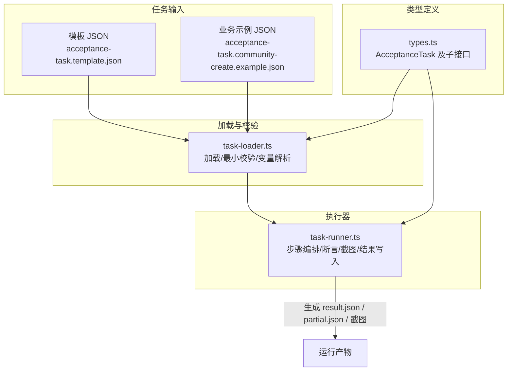
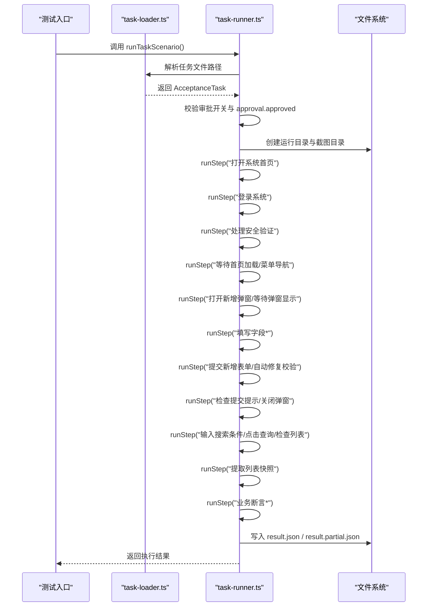
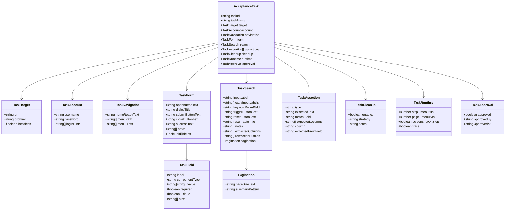
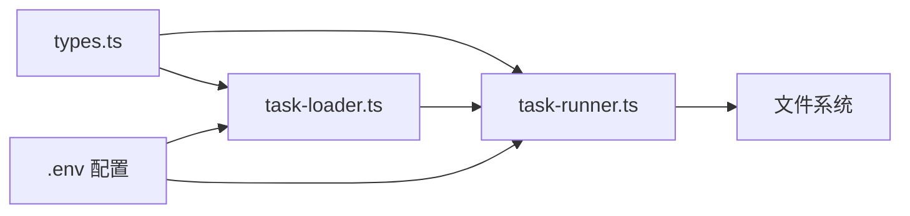

# 任务模型定义

<cite>
**本文引用的文件**
- [src/stage2/types.ts](file://src/stage2/types.ts)
- [src/stage2/task-loader.ts](file://src/stage2/task-loader.ts)
- [src/stage2/task-runner.ts](file://src/stage2/task-runner.ts)
- [specs/tasks/acceptance-task.template.json](file://specs/tasks/acceptance-task.template.json)
- [specs/tasks/acceptance-task.community-create.example.json](file://specs/tasks/acceptance-task.community-create.example.json)
- [tests/generated/stage2-acceptance-runner.spec.ts](file://tests/generated/stage2-acceptance-runner.spec.ts)
- [README.md](file://README.md)
</cite>

## 目录
1. [简介](#简介)
2. [项目结构](#项目结构)
3. [核心组件](#核心组件)
4. [架构总览](#架构总览)
5. [详细组件分析](#详细组件分析)
6. [依赖分析](#依赖分析)
7. [性能考虑](#性能考虑)
8. [故障排查指南](#故障排查指南)
9. [结论](#结论)
10. [附录](#附录)

## 简介
本文件面向 HI-TEST 项目的第二段执行器，系统性阐述 AcceptanceTask 任务模型的结构与使用方法。文档覆盖以下要点：
- AcceptanceTask 接口的完整字段定义、数据类型、取值范围与约束条件
- 字段间依赖关系与相互影响
- 任务模型的设计理念与层次结构（嵌套对象组织方式）
- 类型定义的最佳实践与扩展方法
- 如何根据业务需求定制任务模型字段
- 通过真实示例与代码路径定位，帮助读者快速理解与应用

## 项目结构
第二段执行器围绕“任务 JSON -> 加载与校验 -> 执行器 -> 结果输出”的主线展开，核心文件与职责如下：
- 类型定义：src/stage2/types.ts
- 任务加载与最小校验：src/stage2/task-loader.ts
- 任务执行与断言：src/stage2/task-runner.ts
- 示例任务模板与业务示例：specs/tasks/acceptance-task.template.json、specs/tasks/acceptance-task.community-create.example.json
- 执行入口测试：tests/generated/stage2-acceptance-runner.spec.ts
- 项目说明与运行方式：README.md

图表来源
- [src/stage2/task-loader.ts](file://src/stage2/task-loader.ts#L79-L89)
- [src/stage2/task-runner.ts](file://src/stage2/task-runner.ts#L1062-L1343)
- [src/stage2/types.ts](file://src/stage2/types.ts#L86-L98)

章节来源
- [README.md](file://README.md#L117-L131)
- [tests/generated/stage2-acceptance-runner.spec.ts](file://tests/generated/stage2-acceptance-runner.spec.ts#L1-L39)

## 核心组件
本节聚焦 AcceptanceTask 接口及其子接口的字段定义、类型与约束，并结合加载器与执行器的行为说明字段的作用与影响。

- taskId：字符串，唯一标识任务，必填。用于运行目录命名与结果聚合。
- taskName：字符串，任务名称，必填。用于报告与日志可读性。
- target：TaskTarget，目标站点信息，必填
  - url：字符串，必填
  - browser：字符串枚举（如 chromium），可选
  - headless：布尔，可选
- account：TaskAccount，登录凭证，必填
  - username：字符串，必填
  - password：字符串，必填
  - loginHints：字符串数组，可选，用于指导 AI 登录步骤
- navigation：TaskNavigation，可选
  - homeReadyText：字符串，首页就绪文本，可选
  - menuPath：字符串数组，菜单路径，可选
  - menuHints：字符串数组，菜单点击提示，可选
- form：TaskForm，表单相关，必填
  - openButtonText：字符串，打开弹窗按钮文案，必填
  - dialogTitle：字符串，弹窗标题，可选
  - submitButtonText：字符串，提交按钮文案，必填
  - closeButtonText：字符串，关闭按钮文案，可选
  - successText：字符串，提交成功提示文案，可选
  - notes：字符串数组，可选，步骤说明
  - fields：TaskField 数组，必填且非空
- search：TaskSearch，可选
  - inputLabel：字符串，搜索输入框标签，必填
  - extraInputLabels：字符串数组，额外搜索输入框标签，可选
  - keywordFromField：字符串，关键字来源字段名，可选
  - triggerButtonText：字符串，触发查询按钮文案，可选
  - resetButtonText：字符串，重置按钮文案，可选
  - resultTableTitle：字符串，结果表格标题，可选
  - notes：字符串数组，可选
  - expectedColumns：字符串数组，期望列名，可选
  - rowActionButtons：字符串数组，行内操作按钮名，可选
  - pagination：对象，分页信息，可选
    - pageSizeText：字符串，每页条目文本，可选
    - summaryPattern：字符串，总数摘要模式串，可选
- assertions：TaskAssertion 数组，可选
  - type：字符串，断言类型，必填
  - expectedText：字符串，期望提示文本，可选
  - matchField：字符串，匹配字段名，可选
  - expectedColumns：字符串数组，期望列集合，可选
  - column：字符串，列名，可选
  - expectedFromField：字符串，期望值来自字段名，可选
- cleanup：TaskCleanup，可选
  - enabled：布尔，是否启用清理，可选
  - strategy：字符串，清理策略，可选
  - notes：字符串，清理说明，可选
- runtime：TaskRuntime，可选
  - stepTimeoutMs：数字，步骤超时（毫秒），可选
  - pageTimeoutMs：数字，页面超时（毫秒），可选
  - screenshotOnStep：布尔，是否每步截图，可选
  - trace：布尔，是否开启 trace，可选
- approval：TaskApproval，可选
  - approved：布尔，是否已审批，可选
  - approvedBy：字符串，审批人，可选
  - approvedAt：字符串（ISO 时间），审批时间，可选

字段约束与最小校验（来自加载器）：
- 必填字段：taskId、taskName、target.url、account.username、account.password、form.openButtonText、form.submitButtonText、form.fields（且非空）
- 未满足上述字段时，加载器会抛出明确错误，阻止进入执行阶段

章节来源
- [src/stage2/types.ts](file://src/stage2/types.ts#L86-L98)
- [src/stage2/task-loader.ts](file://src/stage2/task-loader.ts#L50-L69)

## 架构总览
第二段执行器的端到端流程如下：
- 读取任务文件（支持绝对/相对路径与环境变量覆盖）
- 最小字段校验与变量占位符解析（NOW_YYYYMMDDHHMMSS、ENV_VAR）
- 创建运行目录与截图目录
- 按步骤顺序执行：打开首页、登录、处理安全验证、菜单导航、打开弹窗、填写字段、提交、搜索、断言
- 记录步骤状态、耗时、截图路径、错误信息
- 生成最终结果文件与部分进度文件

图表来源
- [src/stage2/task-runner.ts](file://src/stage2/task-runner.ts#L1062-L1343)
- [src/stage2/task-loader.ts](file://src/stage2/task-loader.ts#L79-L89)

章节来源
- [src/stage2/task-runner.ts](file://src/stage2/task-runner.ts#L1062-L1343)
- [src/stage2/task-loader.ts](file://src/stage2/task-loader.ts#L79-L89)

## 详细组件分析

### AcceptanceTask 接口与子接口
- 设计理念
  - 以 JSON 作为任务输入，不依赖数据库，便于版本控制与复用
  - 将“场景描述”与“测试数据”分离，字段结构化，避免自然语言歧义
  - 通过 hints 增强 AI 对页面元素的理解
  - 支持环境变量占位符与动态时间戳注入，提升可维护性
- 层次结构
  - AcceptanceTask 顶层包含多个子对象，形成清晰的领域分层
  - 子对象内部进一步细分为字段与可选配置，便于按需扩展
- 依赖关系
  - form.fields 的值会被解析为 resolvedValues，供断言与搜索使用
  - navigation 与 search 的字段名需与 form.fields 的 label 保持一致，否则无法正确匹配
  - approval.approved 与环境变量 STAGE2_REQUIRE_APPROVAL 共同决定是否允许执行

图表来源
- [src/stage2/types.ts](file://src/stage2/types.ts#L5-L98)

章节来源
- [src/stage2/types.ts](file://src/stage2/types.ts#L5-L98)

### 字段定义与约束详解
- taskId、taskName
  - 类型：字符串
  - 取值范围：任意非空字符串
  - 约束：必填；用于运行目录命名与结果聚合
  - 影响：运行目录以 taskId 命名，失败时错误信息包含 taskId
- target.url
  - 类型：字符串
  - 取值范围：有效 URL
  - 约束：必填；加载器强制校验
  - 影响：作为页面入口地址
- account.username、account.password
  - 类型：字符串
  - 取值范围：任意字符串
  - 约束：必填；加载器强制校验
  - 影响：登录步骤使用
- navigation.homeReadyText、menuPath、menuHints
  - 类型：字符串/字符串数组
  - 取值范围：页面可见文本
  - 约束：可选
  - 影响：首页等待与菜单点击逻辑
- form.openButtonText、form.submitButtonText、form.fields
  - 类型：字符串/TaskField[]
  - 取值范围：按钮文案与字段定义
  - 约束：必填；fields 非空
  - 影响：打开弹窗、填写字段、提交流程
- search.inputLabel、keywordFromField、triggerButtonText、expectedColumns、rowActionButtons、pagination
  - 类型：字符串/字符串数组/对象
  - 取值范围：页面可见文本
  - 约束：可选
  - 影响：搜索与断言流程
- assertions
  - 类型：TaskAssertion[]
  - 取值范围：type 与字段名需与 form.fields.label 匹配
  - 约束：可选
  - 影响：断言执行与结果判定
- cleanup
  - 类型：TaskCleanup
  - 取值范围：布尔/字符串
  - 约束：可选
  - 影响：可扩展清理策略
- runtime
  - 类型：TaskRuntime
  - 取值范围：正整数/布尔
  - 约束：可选
  - 影响：超时控制与截图策略
- approval
  - 类型：TaskApproval
  - 取值范围：布尔/字符串/ISO 时间
  - 约束：可选
  - 影响：与环境变量 STAGE2_REQUIRE_APPROVAL 共同决定执行许可

章节来源
- [src/stage2/task-loader.ts](file://src/stage2/task-loader.ts#L50-L69)
- [src/stage2/task-runner.ts](file://src/stage2/task-runner.ts#L1062-L1343)

### 字段间依赖与相互影响
- form.fields 与 search.keywordFromField
  - 关系：search.keywordFromField 应与 form.fields[].label 一致，否则无法正确提取关键字
- navigation 与 search
  - 关系：若 navigation 未就绪，search 可能因页面未加载而失败
- assertions 与 resolvedValues
  - 关系：断言中的 matchField、expectedFromField 必须存在于 resolvedValues（由 form.fields 解析而来）
- approval 与执行许可
  - 关系：当 STAGE2_REQUIRE_APPROVAL=true 时，必须设置 approval.approved=true 才能执行

章节来源
- [src/stage2/task-runner.ts](file://src/stage2/task-runner.ts#L128-L134)
- [src/stage2/task-runner.ts](file://src/stage2/task-runner.ts#L1068-L1073)

### 类型定义最佳实践与扩展方法
- 最佳实践
  - 使用 hints 字段为 AI 提供上下文，减少误判
  - 将动态值通过占位符注入（如 NOW_YYYYMMDDHHMMSS），避免硬编码
  - 将业务字段与 UI 文案解耦，优先使用 label 作为跨模块引用键
  - 在 assertions 中尽量使用明确的列名与字段映射，提高断言稳定性
- 扩展方法
  - 新增断言类型：在断言执行器中增加新的 type 分支
  - 新增字段类型：在 TaskField.componentType 中扩展枚举值
  - 新增清理策略：在 TaskCleanup.strategy 中扩展策略名
  - 新增运行时选项：在 TaskRuntime 中扩展配置项

章节来源
- [src/stage2/types.ts](file://src/stage2/types.ts#L23-L30)
- [src/stage2/types.ts](file://src/stage2/types.ts#L58-L65)
- [src/stage2/types.ts](file://src/stage2/types.ts#L67-L78)
- [src/stage2/types.ts](file://src/stage2/types.ts#L80-L84)

### 业务定制化指南
- 选择合适的字段
  - 若页面无弹窗，可移除 dialogTitle、closeButtonText
  - 若无需搜索，可移除 search 节点
  - 若断言简单，可只保留 toast 类型
- 动态数据注入
  - 使用占位符 ${ENV_VAR} 引用环境变量
  - 使用 ${NOW_YYYYMMDDHHMMSS} 注入时间戳，避免重复数据
- 复杂断言
  - 使用 table-cell-equals 与 table-cell-contains 组合，覆盖多列一致性校验
- 安全验证处理
  - 根据环境变量 STAGE2_CAPTCHA_MODE 选择自动/人工/失败/忽略策略

章节来源
- [src/stage2/task-loader.ts](file://src/stage2/task-loader.ts#L19-L48)
- [README.md](file://README.md#L54-L72)

## 依赖分析
- 模块耦合
  - task-runner.ts 依赖 types.ts 中的接口定义与 task-loader.ts 的任务加载能力
  - 任务文件与运行时配置（如 STAGE2_TASK_FILE、STAGE2_REQUIRE_APPROVAL）共同决定执行行为
- 外部依赖
  - Playwright 与 Midscene 提供页面自动化与 AI 能力
  - 环境变量与文件系统用于路径解析与产物落盘

图表来源
- [src/stage2/types.ts](file://src/stage2/types.ts#L86-L98)
- [src/stage2/task-loader.ts](file://src/stage2/task-loader.ts#L79-L89)
- [src/stage2/task-runner.ts](file://src/stage2/task-runner.ts#L1062-L1343)

章节来源
- [src/stage2/task-loader.ts](file://src/stage2/task-loader.ts#L71-L77)
- [src/stage2/task-runner.ts](file://src/stage2/task-runner.ts#L1066-L1073)

## 性能考虑
- 超时控制
  - 通过 runtime.stepTimeoutMs 与 runtime.pageTimeoutMs 控制步骤与页面加载超时
- 截图策略
  - runtime.screenshotOnStep=true 会在每步截图，便于问题定位，但会增加 IO 压力
- 自动修复提交
  - 提交失败时自动收集校验提示并重填字段，避免手工干预，但会增加重试成本
- 安全验证处理
  - 自动模式下通过 AI 识别与模拟拖动，需平衡识别准确度与重试次数

章节来源
- [src/stage2/types.ts](file://src/stage2/types.ts#L73-L78)
- [src/stage2/task-runner.ts](file://src/stage2/task-runner.ts#L973-L1018)
- [README.md](file://README.md#L62-L72)

## 故障排查指南
- 常见错误与定位
  - 任务文件缺失必填字段：加载器会抛出明确错误，包含字段名与文件路径
  - 首页加载超时：检查 navigation.homeReadyText 与 menuPath 是否正确
  - 弹窗未显示：检查 form.dialogTitle 与 openButtonText 是否与页面一致
  - 提交失败：查看断开的校验提示，确认 fields.required 与 unique 配置
  - 审批未通过：当 STAGE2_REQUIRE_APPROVAL=true 时，需设置 approval.approved=true
- 产物定位
  - 运行结果：t_runtime/acceptance-results/<taskId>/<timestamp>/result.json
  - 进度文件：result.partial.json
  - 步骤截图：screenshots/

章节来源
- [src/stage2/task-loader.ts](file://src/stage2/task-loader.ts#L50-L69)
- [src/stage2/task-runner.ts](file://src/stage2/task-runner.ts#L1174-L1202)
- [src/stage2/task-runner.ts](file://src/stage2/task-runner.ts#L1242-L1247)
- [README.md](file://README.md#L117-L131)

## 结论
AcceptanceTask 任务模型以结构化 JSON 为核心，结合 AI 与 Playwright 实现端到端的验收执行。通过清晰的字段定义、严格的最小校验与灵活的运行时配置，既能满足快速落地，又能支撑复杂业务场景的扩展。建议在实际使用中：
- 明确字段语义与依赖关系，避免跨模块引用不一致
- 充分利用 hints 与动态占位符，提升可维护性
- 根据环境变量与运行时配置，合理设置超时与截图策略
- 通过断言组合与清理策略，构建稳健的验收闭环

## 附录
- 示例任务文件
  - 模板：specs/tasks/acceptance-task.template.json
  - 业务示例：specs/tasks/acceptance-task.community-create.example.json
- 执行入口
  - tests/generated/stage2-acceptance-runner.spec.ts
- 运行方式与产物
  - README.md 中的运行说明与产物目录

章节来源
- [specs/tasks/acceptance-task.template.json](file://specs/tasks/acceptance-task.template.json#L1-L85)
- [specs/tasks/acceptance-task.community-create.example.json](file://specs/tasks/acceptance-task.community-create.example.json#L1-L184)
- [tests/generated/stage2-acceptance-runner.spec.ts](file://tests/generated/stage2-acceptance-runner.spec.ts#L1-L39)
- [README.md](file://README.md#L117-L131)