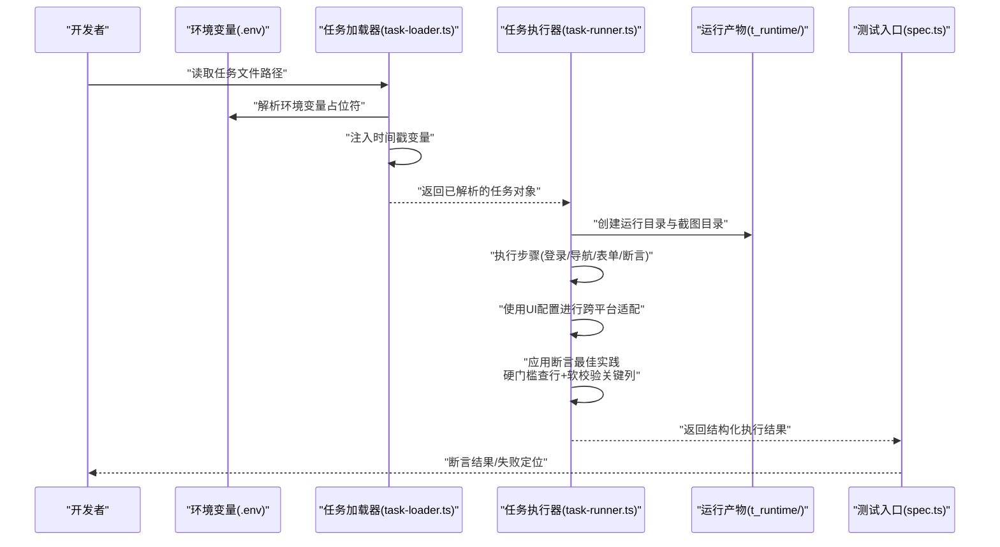
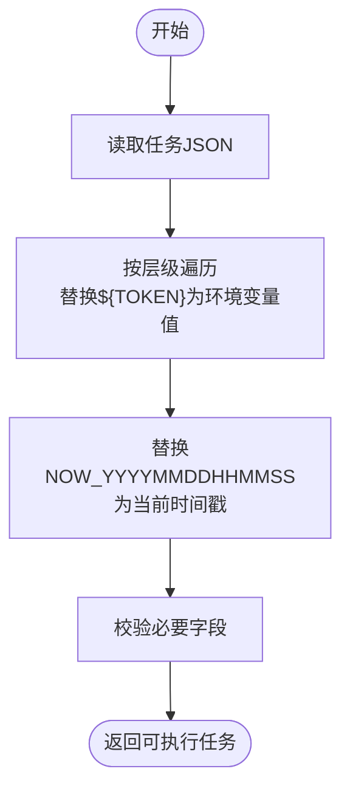
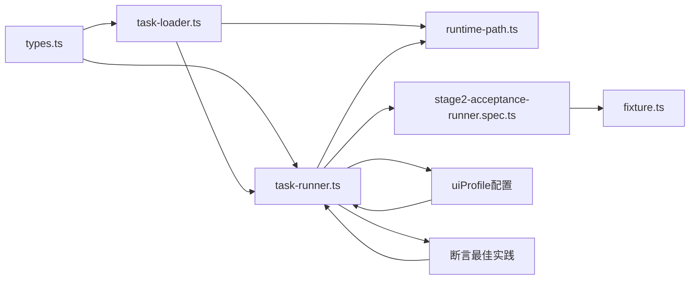

# 任务模板使用

<cite>
**本文引用的文件**
- [README.md](file://README.md)
- [package.json](file://package.json)
- [config/runtime-path.ts](file://config/runtime-path.ts)
- [specs/tasks/acceptance-task.template.json](file://specs/tasks/acceptance-task.template.json)
- [specs/tasks/acceptance-task.community-create.example.json](file://specs/tasks/acceptance-task.community-create.example.json)
- [.tasks/AI自主代理验收系统开发改造方案_2026-03-11.md](file://.tasks/AI自主代理验收系统开发改造方案_2026-03-11.md)
- [.tasks/stage2跨平台通用断言与清理优化实现_2026-03-12.md](file://.tasks/stage2跨平台通用断言与清理优化实现_2026-03-12.md)
- [src/stage2/types.ts](file://src/stage2/types.ts)
- [src/stage2/task-loader.ts](file://src/stage2/task-loader.ts)
- [src/stage2/task-runner.ts](file://src/stage2/task-runner.ts)
- [tests/generated/stage2-acceptance-runner.spec.ts](file://tests/generated/stage2-acceptance-runner.spec.ts)
- [tests/fixture/fixture.ts](file://tests/fixture/fixture.ts)
</cite>

## 目录
1. [简介](#简介)
2. [项目结构](#项目结构)
3. [核心组件](#核心组件)
4. [架构总览](#架构总览)
5. [详细组件分析](#详细组件分析)
6. [依赖关系分析](#依赖关系分析)
7. [性能考虑](#性能考虑)
8. [故障排查指南](#故障排查指南)
9. [结论](#结论)
10. [附录](#附录)

## 简介
本文件面向使用 HI-TEST 任务模板的用户与维护者，系统性阐述任务模板的设计原理、变量定义与替换机制、环境变量注入、时间戳变量、模板继承与复用最佳实践、可复用模板构建方法、调试与测试流程、典型业务场景示例以及模板版本与维护策略。目标是帮助你在不深入源码的情况下，也能高效、安全地编写与维护任务模板，并稳定执行。

**更新** 本版本新增了跨平台UI配置支持、断言匹配模式优化和清理流程增强功能，特别强调了"硬门槛查行 + 软校验关键列"的断言最佳实践。

## 项目结构
本项目围绕"任务 JSON 模板 + 加载器 + 执行器 + 报告与产物"组织，关键目录与文件如下：
- specs/tasks：存放任务模板与示例任务
- src/stage2：任务加载与执行的核心实现
- config/runtime-path.ts：统一运行期目录与环境变量解析
- tests：Playwright + Midscene 夹具与执行入口
- README.md/package.json：安装、运行与环境变量说明

```mermaid
graph TB
subgraph "模板与配置"
TPL["specs/tasks/*.json"]
ENV[".env<br/>环境变量"]
CFG["config/runtime-path.ts"]
UI["uiProfile<br/>跨平台UI配置"]
ASSERT["断言最佳实践<br/>硬门槛查行+软校验关键列"]
END
subgraph "加载与执行"
LOADER["src/stage2/task-loader.ts"]
RUNNER["src/stage2/task-runner.ts"]
TYPES["src/stage2/types.ts"]
END
subgraph "测试与夹具"
SPEC["tests/generated/stage2-acceptance-runner.spec.ts"]
FIX["tests/fixture/fixture.ts"]
END
TPL --> LOADER
ENV --> LOADER
CFG --> RUNNER
UI --> RUNNER
ASSERT --> RUNNER
LOADER --> RUNNER
TYPES --> LOADER
TYPES --> RUNNER
RUNNER --> SPEC
FIX --> SPEC
```

**图表来源**
- [specs/tasks/acceptance-task.template.json](file://specs/tasks/acceptance-task.template.json#L29-L45)
- [specs/tasks/acceptance-task.community-create.example.json](file://specs/tasks/acceptance-task.community-create.example.json#L29-L45)
- [src/stage2/task-loader.ts](file://src/stage2/task-loader.ts#L1-L91)
- [src/stage2/task-runner.ts](file://src/stage2/task-runner.ts#L1070-L1089)
- [src/stage2/types.ts](file://src/stage2/types.ts#L58-L65)
- [config/runtime-path.ts](file://config/runtime-path.ts#L1-L41)
- [tests/generated/stage2-acceptance-runner.spec.ts](file://tests/generated/stage2-acceptance-runner.spec.ts#L1-L39)
- [tests/fixture/fixture.ts](file://tests/fixture/fixture.ts#L1-L100)

**章节来源**
- [README.md](file://README.md#L1-L144)
- [package.json](file://package.json#L1-L24)

## 核心组件
- 任务模板：以 JSON 形式描述任务的结构化输入，包含目标系统、账户信息、导航、表单、搜索、断言、清理、审批与运行时参数等。
- **新增** UI配置配置：通过`uiProfile`字段提供跨平台UI元素选择器配置，包括表格行、Toast消息和弹窗容器的选择器数组。
- **更新** 断言最佳实践：采用"硬门槛查行 + 软校验关键列"的默认断言策略，确保关键业务数据的硬性验证，同时允许对关键列进行软断言以提高稳定性。
- 任务加载器：负责解析任务文件、注入环境变量、注入时间戳变量、进行基本校验并输出可执行的任务对象。
- 任务执行器：基于 Midscene + Playwright 执行模板定义的步骤，生成结构化结果与报告。
- 运行时路径：集中管理运行产物目录，统一收敛到 t_runtime/ 下，便于定位与清理。
- 测试夹具与入口：提供 ai/aiQuery/aiAssert 等能力注入，作为执行器的上下文。

**章节来源**
- [specs/tasks/acceptance-task.template.json](file://specs/tasks/acceptance-task.template.json#L1-L141)
- [specs/tasks/acceptance-task.community-create.example.json](file://specs/tasks/acceptance-task.community-create.example.json#L1-L229)
- [src/stage2/types.ts](file://src/stage2/types.ts#L1-L180)
- [src/stage2/task-loader.ts](file://src/stage2/task-loader.ts#L1-L91)
- [src/stage2/task-runner.ts](file://src/stage2/task-runner.ts#L1-L800)
- [config/runtime-path.ts](file://config/runtime-path.ts#L1-L41)
- [tests/fixture/fixture.ts](file://tests/fixture/fixture.ts#L1-L100)
- [tests/generated/stage2-acceptance-runner.spec.ts](file://tests/generated/stage2-acceptance-runner.spec.ts#L1-L39)

## 架构总览
任务模板从"文件输入"到"执行输出"的整体流程如下：



**图表来源**
- [src/stage2/task-loader.ts](file://src/stage2/task-loader.ts#L79-L89)
- [src/stage2/task-runner.ts](file://src/stage2/task-runner.ts#L1070-L1089)
- [config/runtime-path.ts](file://config/runtime-path.ts#L38-L40)
- [tests/generated/stage2-acceptance-runner.spec.ts](file://tests/generated/stage2-acceptance-runner.spec.ts#L12-L37)

## 详细组件分析

### 任务模板设计与字段说明
- 任务 ID 与名称：用于唯一标识与结果归档。
- 目标系统：URL、浏览器类型、是否无头模式。
- 账户信息：用户名、密码与登录提示。
- 导航：首页就绪文本、菜单路径、菜单提示。
- **新增** UI配置：通过`uiProfile`提供跨平台UI元素选择器配置，包括表格行、Toast消息和弹窗容器的选择器数组。
- 表单：弹窗标题、打开按钮、提交按钮、关闭按钮、成功提示、字段数组（含标签、控件类型、值、是否必填/唯一、提示）。
- 搜索：搜索输入标签、额外输入标签、关键词来源字段、触发按钮、重置按钮、结果表标题、期望列、行内按钮、分页信息。
- **更新** 断言：多种断言类型（如 toast、表格行存在、单元格相等/包含），新增`matchMode`字段支持精确匹配和包含匹配，采用"硬门槛查行 + 软校验关键列"的最佳实践。
- **更新** 清理：是否启用、策略、备注，新增`rowMatchMode`和`verifyAfterCleanup`选项增强清理流程。
- 审批：是否批准、批准人、批准时间。
- 运行时：步骤超时、页面超时、每步截图、开启 trace。

**章节来源**
- [specs/tasks/acceptance-task.template.json](file://specs/tasks/acceptance-task.template.json#L1-L141)
- [specs/tasks/acceptance-task.community-create.example.json](file://specs/tasks/acceptance-task.community-create.example.json#L1-L229)
- [src/stage2/types.ts](file://src/stage2/types.ts#L58-L126)

### 模板变量与替换机制
- 环境变量注入：模板字符串中以 ${TOKEN} 形式引用，加载器会从进程环境变量中查找并替换；若未找到，替换为空字符串。
- 时间戳变量：模板中支持 NOW_YYYYMMDDHHMMSS 占位符，加载器会在每次加载时生成当前时间的紧凑格式并替换。
- 递归替换：对整个任务对象进行深度遍历，确保嵌套结构中的字符串均被正确替换。



**图表来源**
- [src/stage2/task-loader.ts](file://src/stage2/task-loader.ts#L19-L48)
- [src/stage2/task-loader.ts](file://src/stage2/task-loader.ts#L79-L89)

**章节来源**
- [src/stage2/task-loader.ts](file://src/stage2/task-loader.ts#L1-L91)

### UI配置与跨平台适配
**新增** 通过`uiProfile`字段提供跨平台UI元素选择器配置，支持以下配置项：
- `tableRowSelectors`：表格行选择器数组，支持多种UI框架的表格行选择器
- `toastSelectors`：Toast/消息选择器数组，支持多种UI框架的消息提示选择器  
- `dialogSelectors`：弹窗容器选择器数组，支持多种UI框架的弹窗容器选择器

执行器会优先使用任务模板中配置的选择器，然后回退到默认的选择器数组，确保在不同UI框架下的兼容性。

**章节来源**
- [specs/tasks/acceptance-task.template.json](file://specs/tasks/acceptance-task.template.json#L29-L45)
- [specs/tasks/acceptance-task.community-create.example.json](file://specs/tasks/acceptance-task.community-create.example.json#L29-L45)
- [src/stage2/types.ts](file://src/stage2/types.ts#L58-L65)
- [src/stage2/task-runner.ts](file://src/stage2/task-runner.ts#L1070-L1089)

### 断言最佳实践：硬门槛查行 + 软校验关键列
**更新** 断言配置现已采用"硬门槛查行 + 软校验关键列"的最佳实践，确保关键业务数据的硬性验证，同时提高断言的稳定性：

#### 硬门槛查行（硬断言）
- 使用 `table-row-exists` 断言类型，确保关键数据行的存在
- 默认使用 `matchMode: "exact"` 进行精确匹配，确保数据准确性
- 设置合理的 `timeoutMs` 和 `retryCount` 参数，平衡执行效率与稳定性
- 硬断言失败会直接中断流程，确保问题及时暴露

#### 软校验关键列（软断言）
- 使用 `table-cell-equals` 和 `table-cell-contains` 断言类型对关键列进行软断言
- 仅对最重要的业务字段（如名称、状态、关键信息）进行软断言
- 设置 `soft: true` 标记，即使软断言失败也不会中断整个流程
- 使用 `retryCount` 和 `timeoutMs` 参数提高软断言的成功率

#### 默认示例配置
通用模板提供了"硬门槛查行 + 软校验关键列"的默认示例：
- 硬断言：`table-row-exists` + `matchMode: "exact"`
- 软断言：`table-cell-equals` + `soft: true`（仅验证关键列）

这种配置确保了：
1. **关键数据的硬性验证**：通过精确匹配确保数据行存在
2. **业务字段的软校验**：通过软断言验证关键业务字段的准确性
3. **执行稳定性**：软断言失败不影响整体流程，提高执行成功率
4. **可维护性**：断言配置简洁明了，易于理解和维护

**章节来源**
- [specs/tasks/acceptance-task.template.json](file://specs/tasks/acceptance-task.template.json#L75-L106)
- [specs/tasks/acceptance-task.community-create.example.json](file://specs/tasks/acceptance-task.community-create.example.json#L157-L194)
- [src/stage2/types.ts](file://src/stage2/types.ts#L67-L88)
- [src/stage2/task-runner.ts](file://src/stage2/task-runner.ts#L1184-L1917)

### 断言匹配模式优化
**更新** 在断言配置中新增`matchMode`字段，支持以下匹配模式：
- `exact`：精确匹配（默认值）
- `contains`：包含匹配

主要用于`table-row-exists`断言类型，当业务场景允许模糊匹配时可使用包含模式，但需谨慎使用以避免误判。

**章节来源**
- [specs/tasks/acceptance-task.template.json](file://specs/tasks/acceptance-task.template.json#L86)
- [specs/tasks/acceptance-task.community-create.example.json](file://specs/tasks/acceptance-task.community-create.example.json#L168)
- [src/stage2/types.ts](file://src/stage2/types.ts#L78-L88)
- [src/stage2/task-runner.ts](file://src/stage2/task-runner.ts#L1381)

### 清理流程增强
**更新** 在清理配置中新增以下增强选项：
- `rowMatchMode`：行匹配模式，支持`exact`和`contains`两种模式
- `verifyAfterCleanup`：删除后验证，删除完成后检查目标行是否仍存在，确保清理成功

清理流程现在包括目标去重、精确匹配、删除后行消失校验等步骤，提高了数据清理的安全性和可靠性。

**章节来源**
- [specs/tasks/acceptance-task.template.json](file://specs/tasks/acceptance-task.template.json#L112-L113)
- [specs/tasks/acceptance-task.community-create.example.json](file://specs/tasks/acceptance-task.community-create.example.json#L200-L201)
- [src/stage2/types.ts](file://src/stage2/types.ts#L119-L122)
- [src/stage2/task-runner.ts](file://src/stage2/task-runner.ts#L1779-L1795)

### 环境变量注入与时间戳变量使用
- 环境变量注入：在模板中使用 ${ENV_VAR} 引用，如 ${TEST_USERNAME}、${TEST_PASSWORD}，加载器会从 .env 或进程环境变量中读取对应值。
- 时间戳变量：使用 NOW_YYYYMMDDHHMMSS，常用于唯一化字段值，避免重复数据导致回查失败。
- 示例：社区创建模板中，字段值包含时间戳后缀，确保每次执行生成唯一记录。

**章节来源**
- [specs/tasks/acceptance-task.template.json](file://specs/tasks/acceptance-task.template.json#L10-L11)
- [specs/tasks/acceptance-task.community-create.example.json](file://specs/tasks/acceptance-task.community-create.example.json#L62-L68)
- [src/stage2/task-loader.ts](file://src/stage2/task-loader.ts#L6-L17)

### 模板继承与复用最佳实践
- 基于模板文件：以 acceptance-task.template.json 为基础，复制并按需覆盖字段，形成具体场景的示例任务。
- 通用字段优先：优先在模板中定义通用字段（如 target、account、navigation），在具体任务中仅覆盖差异部分。
- **新增** UI配置复用：通过`uiProfile`字段在多个任务间共享跨平台UI配置，减少重复配置。
- **更新** 断言策略复用：采用"硬门槛查行 + 软校验关键列"的默认断言策略，确保关键业务数据的硬性验证。
- 唯一性策略：对关键字段使用时间戳或随机后缀，避免跨任务污染。
- 清晰注释：在 hints、notes 中补充页面元素提示与注意事项，提升可维护性。
- 审批与人工门禁：通过 approval 字段与环境变量 STAGE2_REQUIRE_APPROVAL 实现人工门禁控制。

**章节来源**
- [.tasks/AI自主代理验收系统开发改造方案_2026-03-11.md](file://.tasks/AI自主代理验收系统开发改造方案_2026-03-11.md#L141-L173)
- [specs/tasks/acceptance-task.template.json](file://specs/tasks/acceptance-task.template.json#L1-L141)
- [specs/tasks/acceptance-task.community-create.example.json](file://specs/tasks/acceptance-task.community-create.example.json#L1-L229)

### 创建可复用的任务模板
- 通用模板：定义 target、account、navigation、form、search、assertions、runtime 等通用字段，作为"父模板"。
- **新增** UI配置模板：在通用模板基础上添加`uiProfile`字段，提供跨平台UI元素选择器配置。
- **更新** 断言模板：在通用模板基础上提供"硬门槛查行 + 软校验关键列"的默认断言配置，作为可复用的断言模板。
- 场景化任务：在示例任务中覆盖具体业务字段，如 form.fields、search、assertions 的差异配置。
- 字段标准化：将表单字段拆分为结构化 TaskField，明确 componentType、required、unique、hints，便于执行器稳定定位与断言。
- **更新** 断言配置：利用`matchMode`字段优化断言匹配策略，提高断言的准确性和灵活性。
- **更新** 清理策略：在 cleanup 中声明是否启用与策略，新增`rowMatchMode`和`verifyAfterCleanup`选项，便于后续回收测试数据。

**章节来源**
- [specs/tasks/acceptance-task.template.json](file://specs/tasks/acceptance-task.template.json#L1-L141)
- [specs/tasks/acceptance-task.community-create.example.json](file://specs/tasks/acceptance-task.community-create.example.json#L29-L229)
- [src/stage2/types.ts](file://src/stage2/types.ts#L23-L40)

### 模板调试与测试方法
- 运行入口：通过 Playwright 测试入口 tests/generated/stage2-acceptance-runner.spec.ts 触发执行。
- 夹具能力：tests/fixture/fixture.ts 注入 ai、aiQuery、aiAssert、aiWaitFor 等能力，供执行器使用。
- 失败定位：入口测试会根据执行结果中的失败步骤定位原因与截图路径，便于快速复盘。
- 报告与产物：运行产物统一收敛至 t_runtime/，包含 Playwright 报告、Midscene 报告、结构化结果与截图。

**章节来源**
- [tests/generated/stage2-acceptance-runner.spec.ts](file://tests/generated/stage2-acceptance-runner.spec.ts#L1-L39)
- [tests/fixture/fixture.ts](file://tests/fixture/fixture.ts#L1-L100)
- [README.md](file://README.md#L117-L131)

### 丰富模板使用示例
- 社区创建示例：展示完整的"新增小区并回查"场景，包含菜单导航、弹窗表单、字段唯一化、断言与分页信息。
- 通用模板：提供可复用的基础字段与结构，便于快速扩展到其他业务场景。
- **新增** UI配置示例：社区创建模板展示了如何使用`uiProfile`配置跨平台UI元素选择器，包括表格行、Toast消息和弹窗容器的选择器。
- **更新** 断言示例：社区创建模板展示了如何使用"硬门槛查行 + 软校验关键列"的最佳实践，通过精确匹配确保数据行存在，通过软断言验证关键列。
- **更新** 清理示例：社区创建模板展示了如何使用`rowMatchMode`和`verifyAfterCleanup`增强清理流程。
- 字段类型：支持 input、textarea、cascader 等控件类型，配合 hints 与 notes 提升定位稳定性。

**章节来源**
- [specs/tasks/acceptance-task.community-create.example.json](file://specs/tasks/acceptance-task.community-create.example.json#L1-L229)
- [specs/tasks/acceptance-task.template.json](file://specs/tasks/acceptance-task.template.json#L1-L141)

### 模板版本管理与维护策略
- 版本化命名：示例任务文件采用日期后缀，便于区分版本与归档。
- 文档驱动：通过 .tasks 下的方案文档说明模板设计原则、字段建议与实施范围，确保团队共识。
- 运行目录统一：config/runtime-path.ts 统一管理运行产物目录，减少根目录噪音，便于清理与迁移。
- 人工门禁：通过 approval 字段与 STAGE2_REQUIRE_APPROVAL 环境变量实现人工门禁，保障任务执行质量。
- **新增** 跨平台适配：通过`uiProfile`配置支持不同UI框架的适配，减少因UI变化导致的维护成本。
- **更新** 断言策略统一：通过"硬门槛查行 + 软校验关键列"的最佳实践，确保断言策略的一致性和可维护性。

**章节来源**
- [.tasks/AI自主代理验收系统开发改造方案_2026-03-11.md](file://.tasks/AI自主代理验收系统开发改造方案_2026-03-11.md#L434-L462)
- [config/runtime-path.ts](file://config/runtime-path.ts#L1-L41)
- [README.md](file://README.md#L133-L143)

## 依赖关系分析
任务模板系统各模块之间的依赖关系如下：



**图表来源**
- [src/stage2/types.ts](file://src/stage2/types.ts#L1-L180)
- [src/stage2/task-loader.ts](file://src/stage2/task-loader.ts#L1-L91)
- [src/stage2/task-runner.ts](file://src/stage2/task-runner.ts#L1-L800)
- [config/runtime-path.ts](file://config/runtime-path.ts#L1-L41)
- [tests/generated/stage2-acceptance-runner.spec.ts](file://tests/generated/stage2-acceptance-runner.spec.ts#L1-L39)
- [tests/fixture/fixture.ts](file://tests/fixture/fixture.ts#L1-L100)

**章节来源**
- [src/stage2/types.ts](file://src/stage2/types.ts#L1-L180)
- [src/stage2/task-loader.ts](file://src/stage2/task-loader.ts#L1-L91)
- [src/stage2/task-runner.ts](file://src/stage2/task-runner.ts#L1-L800)
- [config/runtime-path.ts](file://config/runtime-path.ts#L1-L41)
- [tests/generated/stage2-acceptance-runner.spec.ts](file://tests/generated/stage2-acceptance-runner.spec.ts#L1-L39)
- [tests/fixture/fixture.ts](file://tests/fixture/fixture.ts#L1-L100)

## 性能考虑
- 递归替换的复杂度：对整个任务对象进行深度遍历，字符串替换为 O(n)（n 为字符串长度），整体复杂度取决于模板大小与字段数量。
- 环境变量访问：通过 process.env 直接读取，时间复杂度为 O(1)。
- 运行时目录创建：一次性创建目录结构，避免频繁 IO。
- **新增** UI配置解析：UI配置的解析和合并操作具有线性复杂度，通常影响较小。
- **新增** 匹配模式处理：断言和清理中的匹配模式处理为常量时间操作，性能开销很小。
- **新增** 断言最佳实践优化：硬门槛查行 + 软校验关键列的策略减少了不必要的断言操作，提高了执行效率。
- 建议：尽量减少模板中的冗余字段与深层嵌套，有助于提升加载与执行效率。

**章节来源**
- [src/stage2/task-loader.ts](file://src/stage2/task-loader.ts#L33-L48)
- [src/stage2/task-runner.ts](file://src/stage2/task-runner.ts#L1070-L1089)

## 故障排查指南
- 任务文件缺失：加载器会检查任务文件是否存在，不存在时抛出错误。
- 必填字段缺失：加载器会对 taskId、taskName、target.url、account.username/password、form.openButtonText/form.submitButtonText/form.fields 等进行校验，缺失时报错。
- 环境变量未设置：${TOKEN} 未匹配到环境变量时会被替换为空字符串，可能导致登录失败或字段为空。
- **新增** UI配置问题：如果UI配置选择器不正确，可能导致断言和清理操作失败。检查`uiProfile`配置是否正确匹配目标UI框架。
- **新增** 匹配模式问题：如果使用包含匹配模式但期望值过于宽泛，可能导致误判。检查`matchMode`配置是否符合业务需求。
- **新增** 清理验证失败：如果`verifyAfterCleanup`选项启用但目标行仍存在，可能是清理操作未正确执行。检查清理动作配置和确认弹窗处理。
- **新增** 断言策略问题：如果断言配置不符合"硬门槛查行 + 软校验关键列"的最佳实践，可能导致断言过于严格或过于宽松。检查断言配置的合理性。
- 滑块验证码：根据 STAGE2_CAPTCHA_MODE 与 STAGE2_CAPTCHA_WAIT_TIMEOUT_MS 配置处理，失败或超时会抛出明确错误。
- 失败定位：测试入口会根据失败步骤输出详细信息与截图路径，便于定位问题。

**章节来源**
- [src/stage2/task-loader.ts](file://src/stage2/task-loader.ts#L79-L89)
- [src/stage2/task-loader.ts](file://src/stage2/task-loader.ts#L50-L69)
- [src/stage2/task-runner.ts](file://src/stage2/task-runner.ts#L58-L84)
- [src/stage2/task-runner.ts](file://src/stage2/task-runner.ts#L1779-L1795)
- [tests/generated/stage2-acceptance-runner.spec.ts](file://tests/generated/stage2-acceptance-runner.spec.ts#L27-L36)

## 结论
HI-TEST 的任务模板体系以结构化 JSON 为核心，结合环境变量与时间戳变量注入，实现了高可复用、易维护与可追溯的自动化执行链路。**更新后的版本**通过新增的UI配置支持、断言匹配模式优化和清理流程增强，以及"硬门槛查行 + 软校验关键列"的断言最佳实践，进一步提升了跨平台兼容性、断言准确性和数据清理可靠性。新的断言策略确保了关键业务数据的硬性验证，同时通过软断言提高执行稳定性，为复杂业务场景提供了更加稳健的自动化解决方案。通过模板继承与差异化配置、清晰的字段设计与断言策略、统一的运行产物目录与人工门禁机制，能够在不牺牲稳定性的情况下快速扩展到更多业务场景。建议在团队内推广模板命名与文档规范，持续完善字段与断言策略，以提升整体执行质量与可维护性。

## 附录
- 运行命令与产物目录：参见 README.md 中的运行说明与产物目录说明。
- 任务文件路径解析：加载器支持传入路径、环境变量 STAGE2_TASK_FILE 或默认路径。
- 类型定义：所有任务字段与结果结构均在 types.ts 中定义，便于 IDE 提示与静态校验。
- **新增** UI配置参考：参考社区创建示例中的`uiProfile`配置，了解如何为不同UI框架配置选择器。
- **新增** 匹配模式参考：参考社区创建示例中的`matchMode`配置，了解精确匹配和包含匹配的使用场景。
- **新增** 断言最佳实践参考：参考通用模板中的"硬门槛查行 + 软校验关键列"默认配置，了解断言策略的最佳实践。

**章节来源**
- [README.md](file://README.md#L106-L131)
- [src/stage2/task-loader.ts](file://src/stage2/task-loader.ts#L71-L77)
- [src/stage2/types.ts](file://src/stage2/types.ts#L86-L180)
- [specs/tasks/acceptance-task.community-create.example.json](file://specs/tasks/acceptance-task.community-create.example.json#L29-L45)
- [specs/tasks/acceptance-task.community-create.example.json](file://specs/tasks/acceptance-task.community-create.example.json#L168)
- [specs/tasks/acceptance-task.community-create.example.json](file://specs/tasks/acceptance-task.community-create.example.json#L200-L201)
- [specs/tasks/acceptance-task.template.json](file://specs/tasks/acceptance-task.template.json#L75-L106)