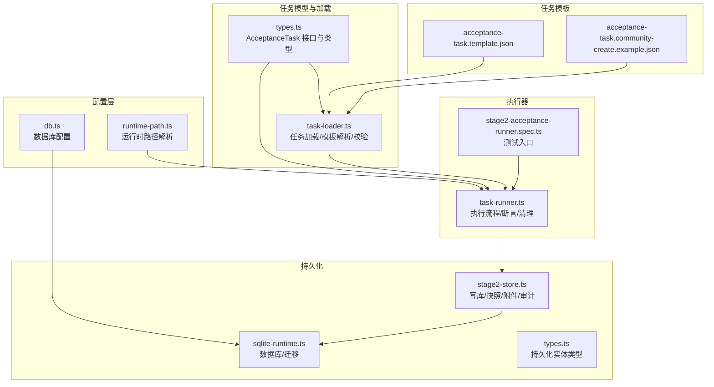
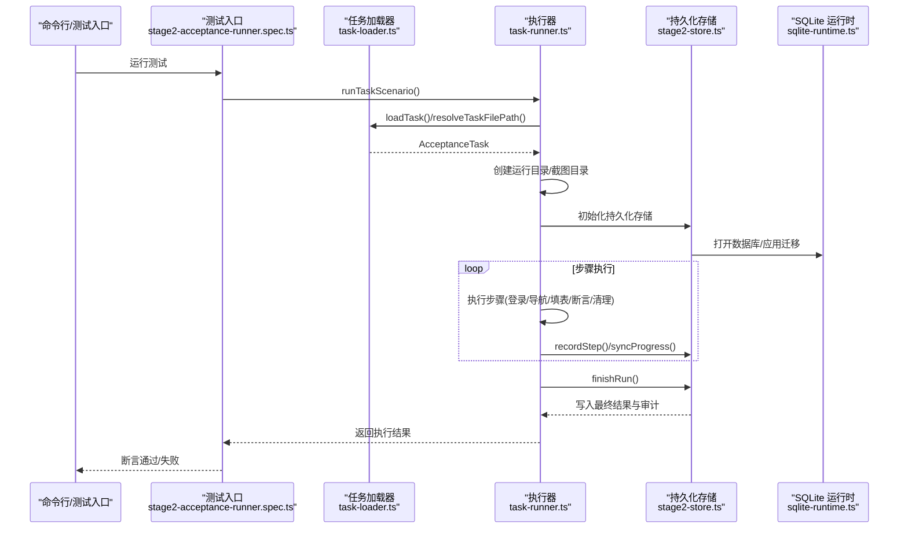
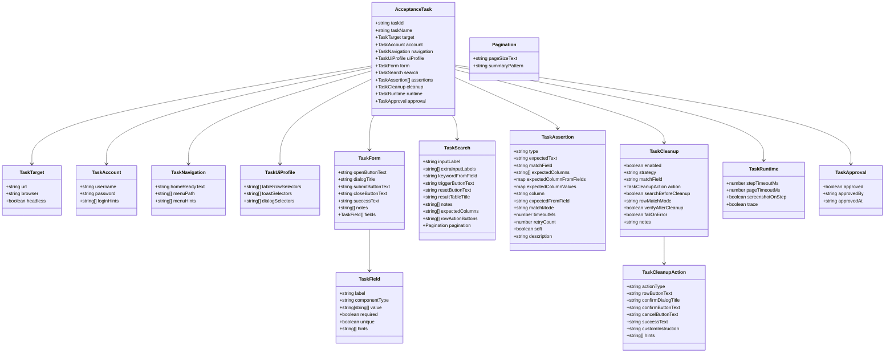
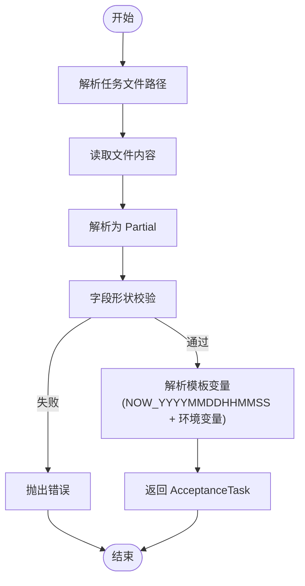
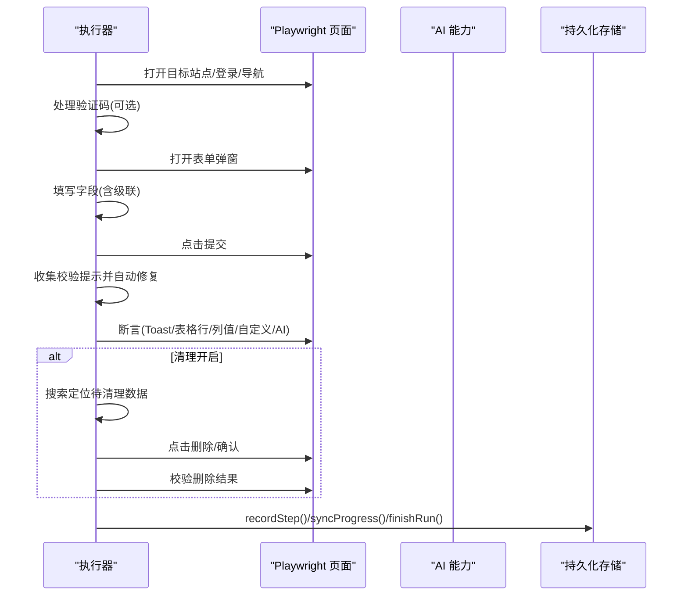
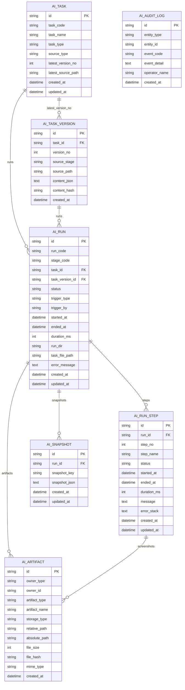
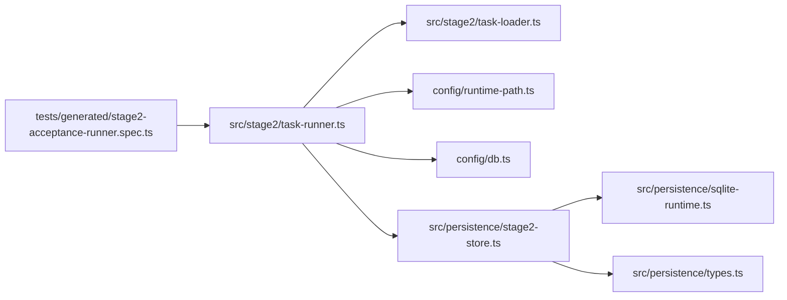

# 任务系统

<cite>
**本文引用的文件**
- [src/stage2/types.ts](file://src/stage2/types.ts)
- [src/stage2/task-loader.ts](file://src/stage2/task-loader.ts)
- [src/stage2/task-runner.ts](file://src/stage2/task-runner.ts)
- [specs/tasks/acceptance-task.template.json](file://specs/tasks/acceptance-task.template.json)
- [specs/tasks/acceptance-task.community-create.example.json](file://specs/tasks/acceptance-task.community-create.example.json)
- [src/persistence/stage2-store.ts](file://src/persistence/stage2-store.ts)
- [src/persistence/sqlite-runtime.ts](file://src/persistence/sqlite-runtime.ts)
- [src/persistence/types.ts](file://src/persistence/types.ts)
- [config/runtime-path.ts](file://config/runtime-path.ts)
- [config/db.ts](file://config/db.ts)
- [tests/generated/stage2-acceptance-runner.spec.ts](file://tests/generated/stage2-acceptance-runner.spec.ts)
- [README.md](file://README.md)
- [package.json](file://package.json)
</cite>

## 目录
1. [简介](#简介)
2. [项目结构](#项目结构)
3. [核心组件](#核心组件)
4. [架构总览](#架构总览)
5. [详细组件分析](#详细组件分析)
6. [依赖关系分析](#依赖关系分析)
7. [性能考量](#性能考量)
8. [故障排除指南](#故障排除指南)
9. [结论](#结论)
10. [附录](#附录)

## 简介
本文件面向 HI-TEST 任务系统，围绕第二阶段（Stage2）的 JSON 任务模型与执行器进行系统化说明。内容涵盖：
- JSON 任务模型的完整架构与字段定义
- 任务加载与解析机制（模板变量、字段校验、错误处理）
- 任务执行流程（从加载到步骤执行再到结果记录）
- 任务模板设计模式与最佳实践
- 任务版本管理与持久化（历史追踪与变更记录）
- 调试与故障排除方法

## 项目结构
项目采用“模块化 + 类型驱动”的组织方式，核心目录与职责如下：
- src/stage2：任务模型定义与执行器实现
- specs/tasks：任务模板与示例
- src/persistence：SQLite 持久化与迁移
- config：运行时路径与数据库配置
- tests：端到端执行入口与夹具
- 根目录 README 与 package.json 提供环境与运行说明

图表来源
- [config/runtime-path.ts:1-41](file://config/runtime-path.ts#L1-L41)
- [config/db.ts:1-28](file://config/db.ts#L1-L28)
- [src/stage2/types.ts:141-180](file://src/stage2/types.ts#L141-L180)
- [src/stage2/task-loader.ts:79-91](file://src/stage2/task-loader.ts#L79-L91)
- [src/stage2/task-runner.ts:2318-2399](file://src/stage2/task-runner.ts#L2318-L2399)
- [src/persistence/stage2-store.ts:69-124](file://src/persistence/stage2-store.ts#L69-L124)
- [src/persistence/sqlite-runtime.ts:73-116](file://src/persistence/sqlite-runtime.ts#L73-L116)
- [src/persistence/types.ts:34-125](file://src/persistence/types.ts#L34-L125)
- [specs/tasks/acceptance-task.template.json:1-141](file://specs/tasks/acceptance-task.template.json#L1-L141)
- [specs/tasks/acceptance-task.community-create.example.json:1-229](file://specs/tasks/acceptance-task.community-create.example.json#L1-L229)

章节来源
- [README.md:1-223](file://README.md#L1-L223)
- [package.json:1-26](file://package.json#L1-L26)

## 核心组件
- 任务模型与类型
  - AcceptanceTask：任务主模型，包含目标、账户、导航、UI 配置、表单、搜索、断言、清理、运行时、审批等字段
  - TaskField/TaskForm/TaskSearch/TaskAssertion/TaskCleanup/TaskRuntime/TaskApproval 等子模型
- 任务加载器
  - 解析任务文件、模板变量（NOW_YYYYMMDDHHMMSS 与环境变量）、字段形状校验
- 执行器
  - 任务执行编排、断言执行（Playwright 硬检测优先 + AI 兜底 + 重试）、数据清理、截图与运行目录管理
- 持久化存储
  - SQLite 写库、任务版本、运行记录、步骤、快照、附件、审计日志与迁移

章节来源
- [src/stage2/types.ts:141-180](file://src/stage2/types.ts#L141-L180)
- [src/stage2/task-loader.ts:79-91](file://src/stage2/task-loader.ts#L79-L91)
- [src/stage2/task-runner.ts:2318-2399](file://src/stage2/task-runner.ts#L2318-L2399)
- [src/persistence/stage2-store.ts:69-124](file://src/persistence/stage2-store.ts#L69-L124)

## 架构总览
任务系统以“JSON 任务驱动 + AI + Playwright”的方式执行验收流程。整体流程：
- 读取任务文件 → 加载与解析（模板变量、校验）→ 创建运行目录与截图目录 → 初始化持久化存储
- 执行步骤：登录/导航 → 打开表单 → 填写字段（含级联）→ 提交与自动修复 → 断言（Toast/表格行/列值/自定义/AI）
- 清理：按策略搜索定位并删除（支持删除、自定义 AI 指令）
- 记录：步骤结果、截图、中间快照、最终结果写入本地 SQLite，并落盘 JSON

图表来源
- [tests/generated/stage2-acceptance-runner.spec.ts:12-38](file://tests/generated/stage2-acceptance-runner.spec.ts#L12-L38)
- [src/stage2/task-runner.ts:2318-2399](file://src/stage2/task-runner.ts#L2318-L2399)
- [src/stage2/task-loader.ts:79-91](file://src/stage2/task-loader.ts#L79-L91)
- [src/persistence/stage2-store.ts:69-124](file://src/persistence/stage2-store.ts#L69-L124)
- [src/persistence/sqlite-runtime.ts:73-116](file://src/persistence/sqlite-runtime.ts#L73-L116)

## 详细组件分析

### JSON 任务模型与字段定义
- 顶层字段
  - taskId、taskName：任务标识与名称
  - target：目标站点与浏览器参数
  - account：登录凭据与提示
  - navigation：首页就绪文本、菜单路径与提示
  - uiProfile：跨平台 UI 选择器优先级（表格行、Toast、对话框）
  - form：表单按钮文案、弹窗标题、字段集合
  - search：搜索输入、关键字来源、触发/重置按钮、结果表头、分页信息
  - assertions：断言集合（Toast/表格行/列值/包含/自定义/AI）
  - cleanup：清理策略、匹配字段、动作配置、前置搜索、匹配模式、校验开关、失败策略
  - runtime：步骤超时、页面超时、每步截图、Trace
  - approval：审批状态
- 关键类型与约束
  - TaskField：label/componentType/value/required/unique/hints
  - TaskAssertion：type/matchMode/timeout/retry/soft/描述字段
  - TaskCleanup：strategy/matchField/action/searchBeforeCleanup/rowMatchMode/verifyAfterCleanup/failOnError

图表来源
- [src/stage2/types.ts:5-180](file://src/stage2/types.ts#L5-L180)

章节来源
- [src/stage2/types.ts:5-180](file://src/stage2/types.ts#L5-L180)

### 任务加载与解析机制
- 文件解析
  - 通过 resolveTaskFilePath 解析任务文件路径（支持绝对/相对路径与环境变量）
  - 读取 JSON 并解析为 Partial<AcceptanceTask>
- 模板变量处理
  - NOW_YYYYMMDDHHMMSS：注入当前时间戳
  - 环境变量：${ENV_VAR} 替换为 process.env 中的值，缺失时为空字符串
  - 递归遍历对象/数组/字符串，深度解析
- 字段校验
  - 断言任务必须包含 taskId、taskName、target.url、account.username/password、form.openButtonText/form.submitButtonText、form.fields
- 错误处理
  - 文件不存在、字段缺失、解析失败均抛出明确错误

图表来源
- [src/stage2/task-loader.ts:71-91](file://src/stage2/task-loader.ts#L71-L91)

章节来源
- [src/stage2/task-loader.ts:71-91](file://src/stage2/task-loader.ts#L71-L91)

### 任务执行流程编排
- 入口与准备
  - 通过测试入口调用 runTaskScenario，创建运行目录与截图目录，初始化持久化存储
  - 读取任务文件与内容，按需校验审批状态
- 步骤执行
  - 登录/导航：处理验证码挑战（自动/人工/失败/忽略），点击菜单
  - 打开表单：定位弹窗，填充字段（含级联）
  - 提交与自动修复：点击提交按钮，收集校验提示并自动补全必填字段
  - 断言：Toast/表格行/列值/包含/自定义/AI，Playwright 硬检测优先，AI 兜底，带重试
  - 清理：按策略搜索定位并删除，支持删除与自定义 AI 指令
- 结果记录
  - 每步写入步骤记录与截图，周期性写入进度 JSON 与快照
  - 结束时写入最终结果、审计日志与附件

图表来源
- [src/stage2/task-runner.ts:2318-2399](file://src/stage2/task-runner.ts#L2318-L2399)
- [src/stage2/task-runner.ts:1562-1917](file://src/stage2/task-runner.ts#L1562-L1917)
- [src/stage2/task-runner.ts:2218-2316](file://src/stage2/task-runner.ts#L2218-L2316)
- [src/persistence/stage2-store.ts:495-630](file://src/persistence/stage2-store.ts#L495-L630)

章节来源
- [src/stage2/task-runner.ts:2318-2399](file://src/stage2/task-runner.ts#L2318-L2399)
- [src/stage2/task-runner.ts:1562-1917](file://src/stage2/task-runner.ts#L1562-L1917)
- [src/stage2/task-runner.ts:2218-2316](file://src/stage2/task-runner.ts#L2218-L2316)

### 任务模板设计模式与最佳实践
- 模板与示例
  - template.json：提供完整字段骨架与注释，便于复制与定制
  - community-create.example.json：真实业务场景示例，展示字段值、断言与清理策略
- 设计要点
  - 使用 uiProfile 为不同 UI 框架提供选择器优先级
  - assertions 以“硬检测优先 + 轻量软断言”为主，关键列强校验，非关键列软断言
  - cleanup.enabled + strategy + matchField + action 组合，确保可追溯与可恢复
  - runtime.screenshotOnStep + trace 便于问题定位
- 示例场景
  - 新增小区并回查：表单字段含输入/文本域/级联，断言包含 Toast、行存在、列值等于/包含
  - 清理策略：delete-created 仅清理本次新增，verifyAfterCleanup 校验删除结果

章节来源
- [specs/tasks/acceptance-task.template.json:1-141](file://specs/tasks/acceptance-task.template.json#L1-L141)
- [specs/tasks/acceptance-task.community-create.example.json:1-229](file://specs/tasks/acceptance-task.community-create.example.json#L1-L229)

### 任务版本管理与持久化
- 版本管理
  - 以任务内容的 SHA256 作为 content_hash，去重生成版本号，记录 ai_task_version
  - 任务文件路径与最新版本号同步更新至 ai_task
- 运行记录
  - ai_run：运行主记录，状态、耗时、错误信息、运行目录与任务文件路径
  - ai_run_step：步骤明细，含截图附件
  - ai_snapshot：结构化快照（resolved_values/query_snapshots/progress_state/final_result_summary）
  - ai_artifact：附件元数据（task_json/result_json/progress_json/screenshot/playwright_report/midscene_report）
  - ai_audit_log：关键事件审计（创建任务/版本/运行/步骤失败等）
- 迁移与数据库
  - 通过 sqlite-runtime 应用迁移文件，确保表结构一致性
  - 仅落文件路径，不落大文件二进制，截图与报告仍落盘文件系统

图表来源
- [src/persistence/types.ts:34-125](file://src/persistence/types.ts#L34-L125)
- [src/persistence/stage2-store.ts:135-261](file://src/persistence/stage2-store.ts#L135-L261)
- [src/persistence/stage2-store.ts:263-356](file://src/persistence/stage2-store.ts#L263-L356)
- [src/persistence/stage2-store.ts:358-493](file://src/persistence/stage2-store.ts#L358-L493)
- [src/persistence/stage2-store.ts:495-630](file://src/persistence/stage2-store.ts#L495-L630)
- [src/persistence/sqlite-runtime.ts:43-116](file://src/persistence/sqlite-runtime.ts#L43-L116)

章节来源
- [src/persistence/stage2-store.ts:135-261](file://src/persistence/stage2-store.ts#L135-L261)
- [src/persistence/stage2-store.ts:263-356](file://src/persistence/stage2-store.ts#L263-L356)
- [src/persistence/stage2-store.ts:358-493](file://src/persistence/stage2-store.ts#L358-L493)
- [src/persistence/stage2-store.ts:495-630](file://src/persistence/stage2-store.ts#L495-L630)
- [src/persistence/sqlite-runtime.ts:86-116](file://src/persistence/sqlite-runtime.ts#L86-L116)

## 依赖关系分析
- 组件耦合
  - task-runner 依赖 task-loader、runtime-path、db 配置、persistence-store
  - persistence-store 依赖 sqlite-runtime 与持久化类型
  - 测试入口依赖执行器
- 外部依赖
  - Playwright、Midscene AI 能力
  - Node SQLite 驱动（实验特性）

图表来源
- [tests/generated/stage2-acceptance-runner.spec.ts:12-38](file://tests/generated/stage2-acceptance-runner.spec.ts#L12-L38)
- [src/stage2/task-runner.ts:2318-2399](file://src/stage2/task-runner.ts#L2318-L2399)
- [src/stage2/task-loader.ts:79-91](file://src/stage2/task-loader.ts#L79-L91)
- [config/runtime-path.ts:38-41](file://config/runtime-path.ts#L38-L41)
- [config/db.ts:24-26](file://config/db.ts#L24-L26)
- [src/persistence/stage2-store.ts:69-124](file://src/persistence/stage2-store.ts#L69-L124)
- [src/persistence/sqlite-runtime.ts:73-84](file://src/persistence/sqlite-runtime.ts#L73-L84)
- [src/persistence/types.ts:34-125](file://src/persistence/types.ts#L34-L125)

章节来源
- [tests/generated/stage2-acceptance-runner.spec.ts:12-38](file://tests/generated/stage2-acceptance-runner.spec.ts#L12-L38)
- [src/stage2/task-runner.ts:2318-2399](file://src/stage2/task-runner.ts#L2318-L2399)
- [src/stage2/task-loader.ts:79-91](file://src/stage2/task-loader.ts#L79-L91)
- [src/persistence/stage2-store.ts:69-124](file://src/persistence/stage2-store.ts#L69-L124)

## 性能考量
- 断言重试与轮询间隔：默认重试次数与轮询间隔平衡了稳定性与性能
- 截图与 Trace：按需开启，避免过大体积影响性能
- 表格断言：优先使用 Playwright 硬检测，AI 兜底仅在必要时使用
- 清理策略：delete-created 仅清理本次新增，降低搜索与断言成本

## 故障排除指南
- 常见错误与定位
  - 任务文件缺失字段：加载器会抛出明确错误，检查 taskId/taskName/target.url/account/form.fields
  - 模板变量未解析：确认环境变量与 NOW_YYYYMMDDHHMMSS 注入是否正确
  - 验证码阻塞：根据 STAGE2_CAPTCHA_MODE 设置处理（auto/manual/fail/ignore）
  - 表单提交失败：查看校验提示并确认自动修复是否生效
  - 断言失败：区分 Playwright 硬检测与 AI 兜底失败，结合截图与运行日志定位
  - 清理失败：检查 rowMatchMode、确认弹窗标题/文案、verifyAfterCleanup 配置
- 数据库与持久化
  - 确认 DB_DRIVER 与 DB_FILE_PATH，执行 npm run db:init/db:migrate 初始化与迁移
  - 查看 ai_run/ai_run_step/ai_snapshot/ai_artifact/ai_audit_log 记录核对执行链路
- 运行产物
  - Playwright 报告、Midscene 报告、第二段结果与截图位于 t_runtime/ 下对应目录

章节来源
- [src/stage2/task-loader.ts:50-69](file://src/stage2/task-loader.ts#L50-L69)
- [src/stage2/task-runner.ts:650-706](file://src/stage2/task-runner.ts#L650-L706)
- [src/stage2/task-runner.ts:976-1021](file://src/stage2/task-runner.ts#L976-L1021)
- [src/stage2/task-runner.ts:1562-1917](file://src/stage2/task-runner.ts#L1562-L1917)
- [src/stage2/task-runner.ts:2218-2316](file://src/stage2/task-runner.ts#L2218-L2316)
- [src/persistence/stage2-store.ts:592-630](file://src/persistence/stage2-store.ts#L592-L630)
- [README.md:97-131](file://README.md#L97-L131)

## 结论
HI-TEST 任务系统以 JSON 任务模型为核心，结合 AI 与 Playwright 实现高鲁棒性的验收自动化。通过严格的字段校验、模板变量解析、断言重试与清理策略，以及完善的 SQLite 持久化与审计，系统在可维护性与可观测性方面具备良好工程实践。建议在实际使用中：
- 优先使用硬检测 + 轻量软断言
- 合理配置清理策略与匹配模式
- 按需开启截图与 Trace
- 借助持久化记录与报告进行回归分析

## 附录
- 运行与调试
  - 初始化数据库：npm run db:init
  - 执行迁移：npm run db:migrate
  - 运行第二段：npm run stage2:run[:headed]
- 关键环境变量
  - STAGE2_TASK_FILE：任务文件路径
  - STAGE2_REQUIRE_APPROVAL：是否要求审批
  - STAGE2_CAPTCHA_MODE/STAGE2_CAPTCHA_WAIT_TIMEOUT_MS：验证码处理策略与等待时长
  - ACCEPTANCE_RESULT_DIR/PLAYWRIGHT_OUTPUT_DIR/PLAYWRIGHT_HTML_REPORT_DIR/MIDSCENE_RUN_DIR：运行产物目录

章节来源
- [README.md:39-54](file://README.md#L39-L54)
- [README.md:165-180](file://README.md#L165-L180)
- [package.json:6-11](file://package.json#L6-L11)