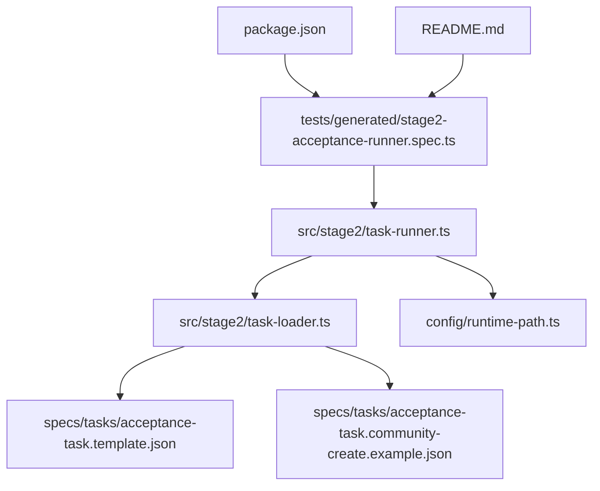
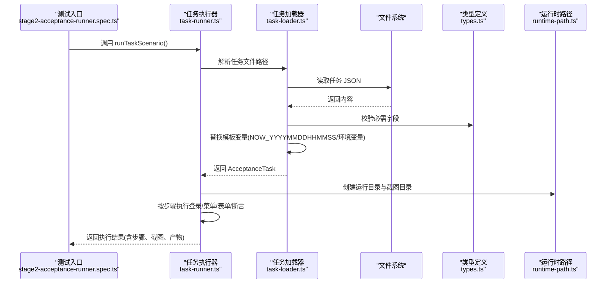
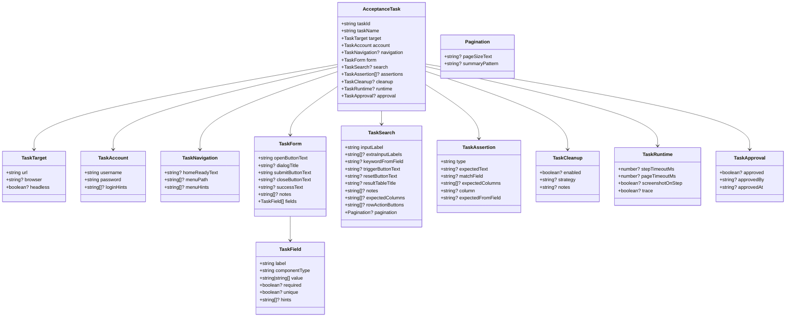
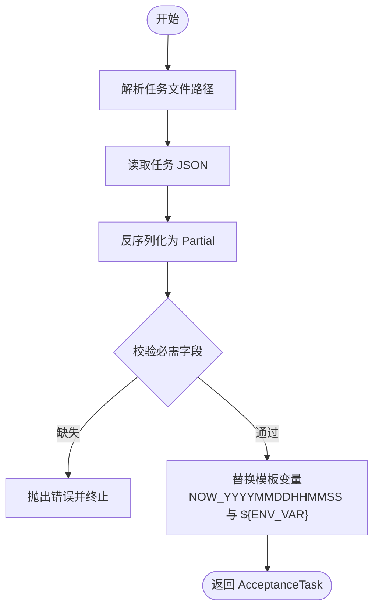
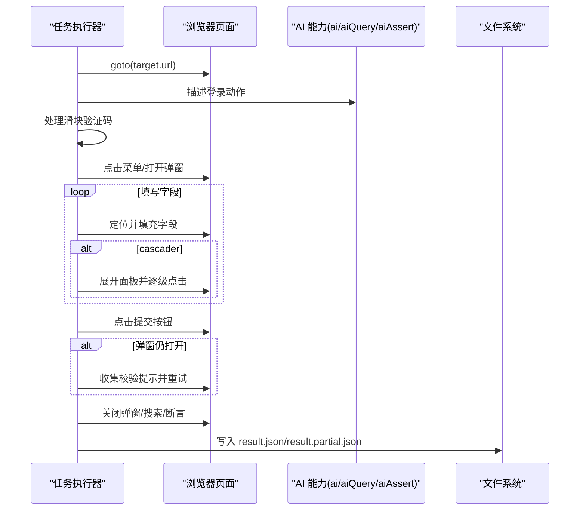
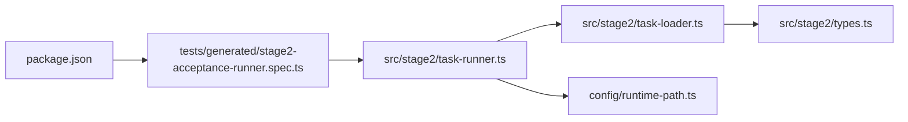

# 任务系统

<cite>
**本文引用的文件**
- [README.md](file://README.md)
- [package.json](file://package.json)
- [config/runtime-path.ts](file://config/runtime-path.ts)
- [src/stage2/types.ts](file://src/stage2/types.ts)
- [src/stage2/task-loader.ts](file://src/stage2/task-loader.ts)
- [src/stage2/task-runner.ts](file://src/stage2/task-runner.ts)
- [specs/tasks/acceptance-task.template.json](file://specs/tasks/acceptance-task.template.json)
- [specs/tasks/acceptance-task.community-create.example.json](file://specs/tasks/acceptance-task.community-create.example.json)
- [tests/generated/stage2-acceptance-runner.spec.ts](file://tests/generated/stage2-acceptance-runner.spec.ts)
</cite>

## 目录
1. [简介](#简介)
2. [项目结构](#项目结构)
3. [核心组件](#核心组件)
4. [架构总览](#架构总览)
5. [详细组件分析](#详细组件分析)
6. [依赖关系分析](#依赖关系分析)
7. [性能考量](#性能考量)
8. [故障排查指南](#故障排查指南)
9. [结论](#结论)
10. [附录](#附录)

## 简介
本文件面向 HI-TEST 任务系统，聚焦第二阶段（Stage2）的 AcceptanceTask 任务模型与执行流程。文档覆盖以下主题：
- AcceptanceTask 任务模型的完整结构：元数据、导航、表单字段、搜索、断言、清理、运行时配置等
- 任务 JSON 文件的语法规范：必需字段、可选字段及语义说明
- 任务模板的使用方法与最佳实践：如何基于模板快速构建可复用任务
- 任务加载与解析流程：模板变量替换、环境变量注入、必需字段校验
- 实际任务示例：社区新增小区任务示例及其扩展思路
- 调试技巧与常见错误排查：步骤截图、失败定位、运行产物目录

## 项目结构
该仓库采用分层组织方式：
- config：运行时路径与环境变量解析
- specs/tasks：任务 JSON 模板与示例
- src/stage2：任务类型定义、任务加载器、任务执行器
- tests：Playwright 测试入口与夹具
- 根目录：README、package.json、运行脚本与环境变量示例

图表来源
- [tests/generated/stage2-acceptance-runner.spec.ts](file://tests/generated/stage2-acceptance-runner.spec.ts#L1-L39)
- [src/stage2/task-runner.ts](file://src/stage2/task-runner.ts#L1062-L1344)
- [src/stage2/task-loader.ts](file://src/stage2/task-loader.ts#L71-L89)
- [specs/tasks/acceptance-task.template.json](file://specs/tasks/acceptance-task.template.json#L1-L85)
- [specs/tasks/acceptance-task.community-create.example.json](file://specs/tasks/acceptance-task.community-create.example.json#L1-L184)
- [config/runtime-path.ts](file://config/runtime-path.ts#L1-L41)
- [package.json](file://package.json#L1-L24)

章节来源
- [README.md](file://README.md#L1-L144)
- [package.json](file://package.json#L1-L24)

## 核心组件
- AcceptanceTask 任务模型：定义任务元数据、目标站点、账户、导航、表单、搜索、断言、清理、运行时与审批等字段
- 任务加载器：负责解析任务文件、注入模板变量与环境变量、校验必需字段
- 任务执行器：按步骤驱动 Playwright 与 Midscene 能力，执行登录、菜单导航、表单填写、提交、断言与结果持久化
- 运行时路径：统一管理 t_runtime 下的产物目录，便于结果与报告归档

章节来源
- [src/stage2/types.ts](file://src/stage2/types.ts#L86-L98)
- [src/stage2/task-loader.ts](file://src/stage2/task-loader.ts#L50-L89)
- [src/stage2/task-runner.ts](file://src/stage2/task-runner.ts#L1062-L1344)
- [config/runtime-path.ts](file://config/runtime-path.ts#L1-L41)

## 架构总览
任务系统以“JSON 驱动”的方式将业务流程结构化，通过任务加载器解析任务文件，再由任务执行器驱动浏览器自动化与 AI 能力完成端到端验收。

图表来源
- [tests/generated/stage2-acceptance-runner.spec.ts](file://tests/generated/stage2-acceptance-runner.spec.ts#L12-L37)
- [src/stage2/task-runner.ts](file://src/stage2/task-runner.ts#L1062-L1344)
- [src/stage2/task-loader.ts](file://src/stage2/task-loader.ts#L71-L89)
- [config/runtime-path.ts](file://config/runtime-path.ts#L108-L117)

## 详细组件分析

### AcceptanceTask 任务模型
AcceptanceTask 是任务系统的核心数据模型，用于描述一次验收任务的完整流程与期望行为。其字段分为必需与可选两类，并支持运行时控制与审批标记。

- 任务元数据
  - taskId：任务唯一标识
  - taskName：任务名称
  - approval：审批信息（approved、approvedBy、approvedAt）

- 目标与账户
  - target：目标站点（url、browser、headless）
  - account：账户信息（username、password、loginHints）

- 导航
  - navigation：首页就绪文本、菜单路径、菜单提示

- 表单
  - form：弹窗按钮、对话框标题、提交/关闭按钮、成功提示、字段数组
  - TaskField：字段标签、组件类型、值、是否必填/唯一、提示

- 搜索
  - search：搜索输入标签、关键词来源字段、触发/重置按钮、结果表头、期望列、行操作按钮、分页配置

- 断言
  - assertions：断言类型与参数集合

- 清理
  - cleanup：启用开关、策略、备注

- 运行时
  - runtime：步骤超时、页面超时、每步截图、开启 trace

图表来源
- [src/stage2/types.ts](file://src/stage2/types.ts#L5-L98)

章节来源
- [src/stage2/types.ts](file://src/stage2/types.ts#L5-L98)

### 任务 JSON 语法规范
- 必需字段
  - taskId、taskName
  - target.url
  - account.username、account.password
  - form.openButtonText、form.submitButtonText
  - form.fields（至少一个）

- 可选字段
  - navigation.homeReadyText、navigation.menuPath、navigation.menuHints
  - form.dialogTitle、form.closeButtonText、form.successText、form.notes
  - search.keywordFromField、search.triggerButtonText、search.resetButtonText、search.resultTableTitle、search.expectedColumns、search.rowActionButtons、search.pagination.pageSizeText、search.pagination.summaryPattern
  - assertions（断言类型与参数）
  - cleanup.enabled、cleanup.strategy、cleanup.notes
  - approval.approved、approval.approvedBy、approval.approvedAt
  - runtime.stepTimeoutMs、runtime.pageTimeoutMs、runtime.screenshotOnStep、runtime.trace

- 字段语义要点
  - componentType 支持 input、textarea、cascader 等，cascader 的 value 为层级数组
  - required/unique 控制字段是否必填与唯一性
  - hints 用于增强 AI 识别与容错
  - pagination.pageSizeText、summaryPattern 用于列表分页识别

章节来源
- [src/stage2/task-loader.ts](file://src/stage2/task-loader.ts#L50-L69)
- [specs/tasks/acceptance-task.template.json](file://specs/tasks/acceptance-task.template.json#L1-L85)
- [specs/tasks/acceptance-task.community-create.example.json](file://specs/tasks/acceptance-task.community-create.example.json#L1-L184)

### 任务模板与最佳实践
- 使用模板文件作为起点，复制并修改必要字段
- 使用模板变量
  - NOW_YYYYMMDDHHMMSS：自动注入当前时间戳，常用于去重
  - ${ENV_VAR}：注入环境变量，如 TEST_USERNAME、TEST_PASSWORD
- 最佳实践
  - 为每个字段提供清晰的 label 与 hints，提升 AI 识别成功率
  - 对 cascader 字段提供完整层级数组，减少失败重试
  - 在 form.notes 中记录 UI 细节（按钮文案、关闭按钮位置等）
  - 合理设置 runtime.stepTimeoutMs/pageTimeoutMs，平衡稳定性与速度
  - 为断言提供明确的 matchField 与 expectedColumns，确保断言可维护

章节来源
- [specs/tasks/acceptance-task.template.json](file://specs/tasks/acceptance-task.template.json#L1-L85)
- [src/stage2/task-loader.ts](file://src/stage2/task-loader.ts#L8-L31)

### 任务加载与解析流程
- 任务文件路径解析
  - 优先使用传入路径，否则读取环境变量 STAGE2_TASK_FILE，最后回退到默认示例文件
- 读取与解析
  - 读取 JSON 文本并反序列化为 Partial<AcceptanceTask>
- 必需字段校验
  - 若缺失则抛出明确错误，便于早期发现配置问题
- 模板变量替换
  - NOW_YYYYMMDDHHMMSS：替换为当前时间戳字符串
  - ${ENV_VAR}：替换为 process.env[ENV_VAR]，若不存在则为空字符串
- 返回最终 AcceptanceTask

图表来源
- [src/stage2/task-loader.ts](file://src/stage2/task-loader.ts#L71-L89)
- [src/stage2/task-loader.ts](file://src/stage2/task-loader.ts#L50-L69)
- [src/stage2/task-loader.ts](file://src/stage2/task-loader.ts#L19-L48)

章节来源
- [src/stage2/task-loader.ts](file://src/stage2/task-loader.ts#L71-L89)

### 任务执行流程（从 JSON 到结果）
- 初始化
  - 解析任务文件路径与任务对象
  - 根据 STAGE2_REQUIRE_APPROVAL 检查审批状态
  - 创建运行目录与截图目录
  - 记录 resolvedValues（字段值映射）
- 步骤执行
  - 打开首页、登录、处理安全验证（滑块验证码）
  - 等待首页就绪、点击菜单、打开弹窗
  - 填写字段（含 cascader 多级选择与截图）
  - 提交表单（自动修复校验提示）
  - 关闭弹窗、搜索与断言（toast、表格行/单元格）
- 结果输出
  - 写入 result.json 与 result.partial.json
  - 生成步骤截图与 Midscene/Playwright 报告

图表来源
- [src/stage2/task-runner.ts](file://src/stage2/task-runner.ts#L1062-L1344)
- [src/stage2/task-runner.ts](file://src/stage2/task-runner.ts#L1157-L1323)

章节来源
- [src/stage2/task-runner.ts](file://src/stage2/task-runner.ts#L1062-L1344)

### 实际任务示例
- 社区新增小区示例
  - 包含多个字段：小区名称（含时间戳去重）、地址、省市区（cascader）、负责人、电话
  - 搜索区字段与期望列、分页配置
  - 多种断言：toast、表格行存在、表格单元格等于/包含
- 模板示例
  - 提供基础字段与注释，便于快速复制与修改

章节来源
- [specs/tasks/acceptance-task.community-create.example.json](file://specs/tasks/acceptance-task.community-create.example.json#L1-L184)
- [specs/tasks/acceptance-task.template.json](file://specs/tasks/acceptance-task.template.json#L1-L85)

## 依赖关系分析
- 测试入口依赖任务执行器
- 任务执行器依赖任务加载器与运行时路径
- 任务加载器依赖类型定义与文件系统
- package.json 提供运行脚本与依赖声明

图表来源
- [tests/generated/stage2-acceptance-runner.spec.ts](file://tests/generated/stage2-acceptance-runner.spec.ts#L1-L39)
- [src/stage2/task-runner.ts](file://src/stage2/task-runner.ts#L1062-L1344)
- [src/stage2/task-loader.ts](file://src/stage2/task-loader.ts#L71-L89)
- [src/stage2/types.ts](file://src/stage2/types.ts#L1-L125)
- [config/runtime-path.ts](file://config/runtime-path.ts#L1-L41)
- [package.json](file://package.json#L1-L24)

章节来源
- [package.json](file://package.json#L1-L24)

## 性能考量
- 合理设置 runtime.stepTimeoutMs 与 runtime.pageTimeoutMs，避免过短导致误判，过长影响效率
- 使用 cascader 的层级数组一次性提供完整路径，减少重试次数
- 在 form.notes 中提供 UI 细节，有助于 AI 更快定位元素
- 适当开启 runtime.screenshotOnStep 以平衡可观测性与磁盘占用

## 故障排查指南
- 任务文件缺失或格式错误
  - 现象：启动即报错，提示缺少必需字段或文件不存在
  - 排查：核对 taskId、taskName、target.url、account.username/password、form.openButtonText、form.submitButtonText、form.fields
- 模板变量未生效
  - 现象：${ENV_VAR} 未被替换
  - 排查：确认环境变量已正确设置，且拼写一致
- 滑块验证码处理失败
  - 现象：自动模式多次尝试后仍失败，或人工模式超时
  - 排查：调整 STAGE2_CAPTCHA_MODE 与 STAGE2_CAPTCHA_WAIT_TIMEOUT_MS；检查页面截图确认滑块样式；必要时改为 manual 模式
- 表单提交失败
  - 现象：弹窗未关闭或反复出现校验提示
  - 排查：查看 result.partial.json 中的步骤与截图；确认字段值与 hints；检查 cascader 层级顺序
- 断言失败
  - 现象：toast/表格断言不通过
  - 排查：核对 assertions 的 matchField、expectedColumns、expectedFromField；确认 resolvedValues 映射正确

章节来源
- [src/stage2/task-loader.ts](file://src/stage2/task-loader.ts#L50-L69)
- [src/stage2/task-runner.ts](file://src/stage2/task-runner.ts#L647-L703)
- [src/stage2/task-runner.ts](file://src/stage2/task-runner.ts#L973-L1018)
- [src/stage2/task-runner.ts](file://src/stage2/task-runner.ts#L1020-L1060)

## 结论
HI-TEST 任务系统通过 AcceptanceTask 将验收流程结构化，结合模板变量与环境变量注入，实现了高可复用与可维护的任务定义。任务加载器负责严格的字段校验与模板替换，任务执行器以步骤化的方式驱动浏览器与 AI 能力，最终输出结构化的执行结果与截图。遵循本文的最佳实践与排障指南，可显著提升任务的稳定性与可维护性。

## 附录
- 运行产物目录
  - Playwright 输出目录、HTML 报告目录、Midscene 运行日志与缓存、验收结果目录
- 运行命令
  - npm run stage2:run 或 npm run stage2:run:headed

章节来源
- [README.md](file://README.md#L74-L129)
- [package.json](file://package.json#L6-L8)